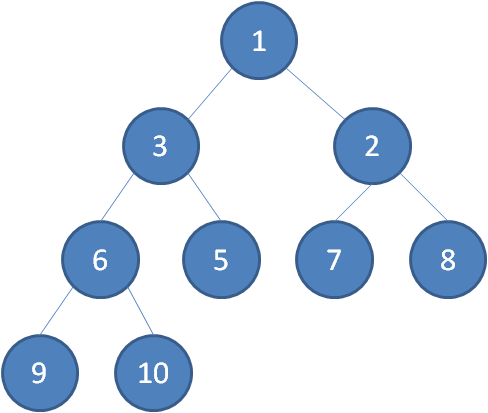
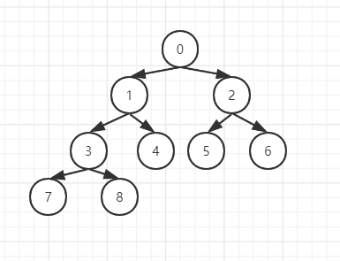
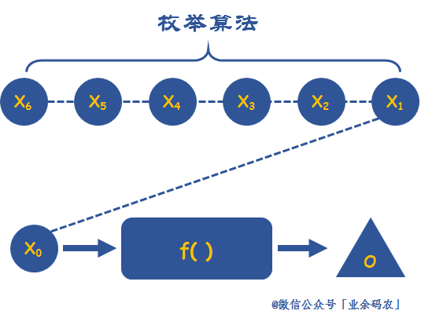
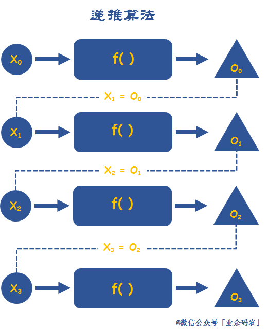
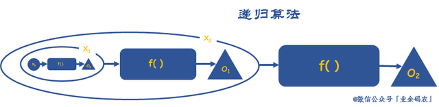
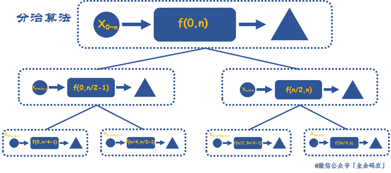
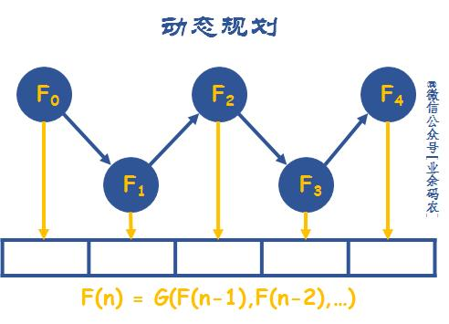
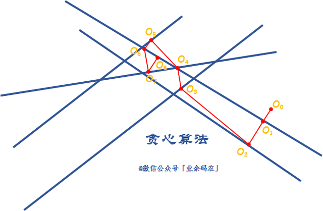
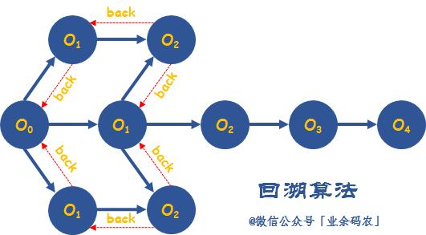
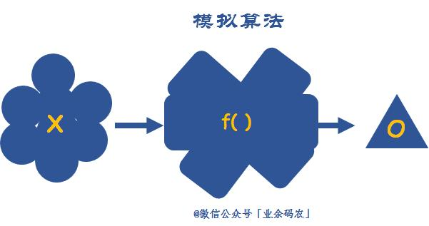

# 面经整理

## 字符串

无重复字符的最长字串

最长公共前缀

字符串的排列

字符串相乘

翻转字符串里的单词

简化路径

复原 IP 路径

## 数组与排序

三数之和

岛屿的最大面积

搜索旋转排序数组

最长连续递增序列

数组中的第K个最大元素

最长连续序列

第k个排列

朋友圈

合并区间

接雨水

## 链表与树

合并两个有序链表

反转链表

两数相加

排序链表

环形链表 2

相交链表

合并K个升序链表

二叉树的最近公共祖先

二叉树的锯齿形层次遍历


## 动态或贪心

买卖股票的最佳时机

买卖股票的最佳时机 2

最大正方形

最大子序和

三角形最小路径和

俄罗斯套娃信封问题


## 数据结构

最小栈

LRU缓存机制

全 O(1) 的数据结构


## 扩展训练

x 的平方根

UTF-8 编码验证

第二高的薪水


## 动态规划

题目特点

### 计数

- 有多少种方式遍历
- 有多少种方法选出 k 个数使得和是 Sum

### 求最大最小值

- 从左上角走到右下角路径的最大数字和
- 最长上升子序列长度

### 求存在性

- 取石子游戏，先手是否必胜
- 能否选出 k 个数使得和是 Sum

----


## leetcode 121 买卖股票最佳时机


方法一：暴力法

```java
public class Solution {
    public int maxProfit(int prices[]) {
        int maxprofit = 0;
        for (int i = 0; i < prices.length - 1; i++) {
            for (int j = i + 1; j < prices.length; j++) {
                int profit = prices[j] - prices[i];
                if (profit > maxprofit)
                    maxprofit = profit;
            }
        }
        return maxprofit;
    }
}
```


方法二：一次遍历
算法

假设给定的数组为：[7, 1, 5, 3, 6, 4]

如果我们在图表上绘制给定数组中的数字，我们将会得到：


我们来假设自己来购买股票。随着时间的推移，每天我们都可以选择出售股票与否。那么，假设在第 i 天，如果我们要在今天卖股票，那么我们能赚多少钱呢？

显然，如果我们真的在买卖股票，我们肯定会想：如果我是在历史最低点买的股票就好了！太好了，在题目中，我们只要用一个变量记录一个历史最低价格 minprice，我们就可以假设自己的股票是在那天买的。那么我们在第 i 天卖出股票能得到的利润就是 prices[i] - minprice。

因此，我们只需要遍历价格数组一遍，记录历史最低点，然后在每一天考虑这么一个问题：如果我是在历史最低点买进的，那么我今天卖出能赚多少钱？当考虑完所有天数之时，我们就得到了最好的答案。

``````java
public class Solution {
    public int maxProfit(int prices[]) {
        int minprice = Integer.MAX_VALUE;
        int maxprofit = 0;
        for (int i = 0; i < prices.length; i++) {
            if (prices[i] < minprice)
                minprice = prices[i];
            else if (prices[i] - minprice > maxprofit)
                maxprofit = prices[i] - minprice;
        }
        return maxprofit;
    }
}
``````


方法三：动态规划

本题要求的其实是卖出时与买入时的最大差值。我们不妨假设f(i)表示以第i天为结尾时卖出股票获得的最大收入（差值），那么最后要求的是：

f(i) = max{f(i)| 1 <= i <= n>>};

而f(i)其实还与f(i-1)有关，f(i-1) = p[i-1] - minValue, 其中minValue表示以i-1结尾的前排数组的最小值，故 minValue = p[i-1] - f(i-1)。

那么我们可以得到如下关系： f(i) = max (p[i] - (p[i-1] - f(i-1), 0)) = max (f(i-1) + p[i] - p[i-1], 0); （显然，每次可以当天买进，当天卖出，所以最大收益不应该低于0。）

时间复杂度：O(N)； 空间复杂度：O(1)；

```java
// 第i天卖出的最大收益计算公式为：
// i-1天卖出的最大收益 vs i-1天买入的最大收益+第i天的股价
// sell[i] = max(sell[i-1],buy[i-1]+prices[i])
// 第i天买入的最大收益计算公式为：(注意第i天前面有个负号)

// i-1天买入的最大收益 vs -第i天的股价
// buy[i] = max(buy[i-1],-prices[i])

class Solution {
    public int maxProfit(int[] prices) {
        if(prices==null || prices.length==0) {
            return 0;
        }
        int n = prices.length;
        //创建两个数组，一个记录每次卖出的最大收益，一个记录每次买入最大收益
        int[] sell = new int[n];
        int[] buy = new int[n];
        //初始化第一天收益
        sell[0] = 0;
        buy[0] = -prices[0];
        for(int i=1;i<n;++i) {
            //第i天卖出收益 = max(第i-1天卖出收益，第i-1天买入收益+当天股价)
            sell[i] = Math.max(sell[i-1],buy[i-1]+prices[i]);
            //第i天买入收益 = max(第i-1天买入收益，-当天股价)
            buy[i] = Math.max(buy[i-1],-prices[i]);
        }
        return Math.max(sell[n-1],buy[n-1]);
    }
}
```


https://leetcode-cn.com/problems/best-time-to-buy-and-sell-stock/solution/wu-chong-shi-xian-xiang-xi-tu-jie-121-mai-mai-gu-p/


## leetcode 669 换硬币

三种硬币，2、5、7，每种足够多，卖一本书 27 元，如何用最少的硬币组合正好付清，不需要对方找钱

解法思路

- 确定状态

解动态规划的时候需要开一个数组，数组的每个元素 f[i]或者 f [i] [j] 代表什么——类似于数学中，x/y/z 代表什么

确定状态需要两个意识：

— 最后一步

虽然我们不知道最优策略是什么，但是最优策略肯定是 K 枚硬币a1,a2,a3,…,ak 面值加起来是 27，所以一定有一枚最后的硬币 ak

除掉这枚硬币，前面硬币的面值加起来是 27-ak

·  我们不关心前面 k-1 枚硬币是怎么拼出来 27-ak 的（可能 1 种方法，可能 100 中方法，但是这不重要），而且我们现在甚至还不知道 ak 和 k，但是确定前面的 k-1 个硬币拼出来了 27-ak

·  因为是最优策略，所以拼出 27-ak 的硬币数一定要最少，否则这就不是最优策略了。

— 子问题

所以就要求：最少用多少枚硬币可以拼出 27-ak

原问题是：最少用多少没硬币可以拼出 27

将原问题转化成了一个子问题，而且规模更小：27-ak

为了简化定义，设状态 f(x)=最少用多少枚硬币拼出 x

最后那枚硬币 ak 只可能是 2、5、7

ak=2，f(27)=f(27-2)+1

ak=5，f(27)=f(27-5)+1

ak=7，f(27)=f(27-7)+1

需要求最少硬币数，所以 f(27)=min{f(27-2)+1，f(27-5)+1，f(27-7)+1 }


```java
// 递归解法
int f(int x) {
    if(x == 0) return 0;
    int res = MAX_VALUE;
    if(x >= 2) {
        res = Math.min(f(x - 2) + 1, res);
    }
    if(x >= 5) {
        res = Math.min(f(x - 5) + 1, res);
    }
    if(x >= 7) {
        res = Math.min(f(x - 7) + 1, res);
    }
    return res;
}
// 递归算法存在的问题，重复运算太多，效率低下
```

动态规划将计算结果保存下来，并改变计算顺序

- 转移方程

设状态 f[x] = 最少用多少枚硬币拼出 x

对于任意 x，f[x] = min{f[x-2] +1, f[x-5] + 1 1, f[x-7] +1}

- 初始条件和边界情况

f[x] = min{f[x-2] +1, f[x-5] + 1 1, f[x-7] +1}

两个问题：x-2，x-5，x-7 小于 0 怎么办？什么时候停下来？

如果不能拼出 y，就定义 f(y) = 正无穷

例如 f(-1) = 正无穷

所以 f(1)=min{f(-1) +1, f(-4) + 1, f(-6) +11}=正无穷，表示拼不出来 1

初始条件：f(0)= 0

初始条件可以设置为用转移方程算不出来，需要手动定义的。

- 计算顺序

拼出 x 所需要的最少硬币数，f(x)= min{f(x-2)+1, f(x-5) +1, f(x-7)+1}

初始条件：f(0)=0

然后计算 f(1)，f(2)，f(3)……f(27)

当计算到 f(x)时，f(x-2)、f(x-5)、f(x-7)都已经得到结果了

```java
// 动态规划解法
public class Solution{
    // A:{2,5,7},M:27
    public int coinChange(int[] A, int M) {
        int[] f = new int[M + 1];
        int n = A.length;
        
        // initialization
        f[0] = 0;
        int i, j;
        // f[1], f[2], ... , f[27]
        for(i = 1; i <= M; ++i) {
            // 先设置成无穷大
            f[i] = Integer.MAX_VALUE;
            
        }
    }
}
```


## leetcode 101 对称二叉树

给定一个二叉树，检查它是否是镜像对称的。

例如，二叉树 [1,2,2,3,4,4,3] 是对称的。

        1
       / \
      2   2
     / \ / \
    3  4 4  3
  但是下面这个 [1,2,2,null,3,null,3] 则不是镜像对称的:

        1
       / \
      2   2
       \   \
       3    3

进阶：

你可以运用递归和迭代两种方法解决这个问题吗？

----

方法一：递归
思路和算法

如果一个树的左子树与右子树镜像对称，那么这个树是对称的。

因此，该问题可以转化为：两个树在什么情况下互为镜像？

如果同时满足下面的条件，两个树互为镜像：

它们的两个根结点具有相同的值
每个树的右子树都与另一个树的左子树镜像对称


我们可以实现这样一个递归函数，通过「同步移动」两个指针的方法来遍历这棵树，pp 指针和 qq 指针一开始都指向这棵树的根，随后 pp 右移时，qq 左移，pp 左移时，qq 右移。每次检查当前 pp 和 qq 节点的值是否相等，如果相等再判断左右子树是否对称。

代码如下。

```java
class Solution {
    public boolean isSymmetric(TreeNode root) {
        return check(root, root);
    }

    public boolean check(TreeNode p, TreeNode q) {
        if (p == null && q == null) {
            return true;
        }
        if (p == null || q == null) {
            return false;
        }
        return p.val == q.val && check(p.left, q.right) && check(p.right, q.left);
    }
}
```

复杂度分析

假设树上一共 nn 个节点。

时间复杂度：这里遍历了这棵树，渐进时间复杂度为 O(n)O(n)。
空间复杂度：这里的空间复杂度和递归使用的栈空间有关，这里递归层数不超过 nn，故渐进空间复杂度为 O(n)O(n)。
方法二：迭代
思路和算法

「方法一」中我们用递归的方法实现了对称性的判断，那么如何用迭代的方法实现呢？首先我们引入一个队列，这是把递归程序改写成迭代程序的常用方法。初始化时我们把根节点入队两次。每次提取两个结点并比较它们的值（队列中每两个连续的结点应该是相等的，而且它们的子树互为镜像），然后将两个结点的左右子结点按相反的顺序插入队列中。当队列为空时，或者我们检测到树不对称（即从队列中取出两个不相等的连续结点）时，该算法结束。

```java
class Solution {
    public boolean isSymmetric(TreeNode root) {
        return check(root, root);
    }

    public boolean check(TreeNode u, TreeNode v) {
        Queue<TreeNode> q = new LinkedList<TreeNode>();
        q.offer(u);
        q.offer(v);
        while (!q.isEmpty()) {
            u = q.poll();
            v = q.poll();
            if (u == null && v == null) {
                continue;
            }
            if ((u == null || v == null) || (u.val != v.val)) {
                return false;
            }

            q.offer(u.left);
            q.offer(v.right);

            q.offer(u.right);
            q.offer(v.left);
        }
        return true;
    }
}
```

复杂度分析

时间复杂度：O(n)O(n)，同「方法一」。
空间复杂度：这里需要用一个队列来维护节点，每个节点最多进队一次，出队一次，队列中最多不会超过 nn 个点，故渐进空间复杂度为 O(n)O(n)。


## leetcode 55 跳跃游戏

https://leetcode-cn.com/problems/jump-game

给定一个非负整数数组，你最初位于数组的第一个位置。

数组中的每个元素代表你在该位置可以跳跃的最大长度。

判断你是否能够到达最后一个位置。

示例 1:

输入: [2,3,1,1,4]
输出: true
解释: 我们可以先跳 1 步，从位置 0 到达 位置 1, 然后再从位置 1 跳 3 步到达最后一个位置。
示例 2:

输入: [3,2,1,0,4]
输出: false
解释: 无论怎样，你总会到达索引为 3 的位置。但该位置的最大跳跃长度是 0 ， 所以你永远不可能到达最后一个位置。

---


```java
public class Solution {
    public boolean canJump(int[] nums) {
        int n = nums.length;
        int rightmost = 0;
        for (int i = 0; i < n; ++i) {
            if (i <= rightmost) {
                rightmost = Math.max(rightmost, i + nums[i]);
                if (rightmost >= n - 1) {
                    return true;
                }
            }
        }
        return false;
    }
}

链接：https://leetcode-cn.com/problems/jump-game/solution/tiao-yue-you-xi-by-leetcode-solution/
```


## 通勤车油耗

字节跳动在北京有N个工区，形成一个环状，Bytebus是往返在各个工区的通勤车，按工区的顺序行驶，其中第 i 个工区有汽油 gas[i] 升。你有一辆油箱容量无限的Bytebus，从第 i 个工区开往第 i+1 个工区需要消耗汽油 cost[i] 升。你从其中的一个工区出发，开始时油箱为空，可以使用当前工区的汽油gas[i]升。如果你可以绕环路行驶一周，则返回出发时工区的编号，否则返回 -1。

输入：gas  = [1,2,3,4,5]

cost = [3,4,5,1,2]

输出：3

`````java
static int staNum(int[] gas, int[] cost) {
    int len = gas.length;
    int nowLeft = 0;
    int preCost = 0, flag = 0;//flag标记起点下标
    for (int i = 0; i < len; ++i){
        nowLeft += gas[i] - cost[i];
        if ( nowLeft < 0){//此时油量为负数
            preCost += nowLeft;//累计负的油量
            nowLeft = 0;//清零重新开始
            flag = i + 1;//表示将下一个工区作为起点
        }
    }
    if(nowLeft + preCost < 0){//总剩余油量为负数返回-1
        return -1;
    }
    return flag;
}
`````


## 打家劫舍

小明要在街上一排互相相邻的糖果屋拿糖，但不能在两个相邻的糖果屋拿糖。给定一个数组列表，每个元素代表每间房子中的糖的数目，小明能看到所有屋的数据，走一遍所有糖果屋，最多能拿多少糖？ 

输入： [1,5,2,1,7] 

输出：12

输入： [1,5,2,5,7,3]

输出：13

**解题思路：如果用动态规划，如何实现？**

原型：leetcode198 打家劫舍

你是一个专业的小偷，计划偷窃沿街的房屋。每间房内都藏有一定的现金，影响你偷窃的唯一制约因素就是相邻的房屋装有相互连通的防盗系统，如果两间相邻的房屋在同一晚上被小偷闯入，系统会自动报警。

给定一个代表每个房屋存放金额的非负整数数组，计算你 不触动警报装置的情况下 ，一夜之内能够偷窃到的最高金额。

示例 1：

输入：[1,2,3,1]
输出：4
解释：偷窃 1 号房屋 (金额 = 1) ，然后偷窃 3 号房屋 (金额 = 3)。
     偷窃到的最高金额 = 1 + 3 = 4 。
示例 2：

输入：[2,7,9,3,1]
输出：12
解释：偷窃 1 号房屋 (金额 = 2), 偷窃 3 号房屋 (金额 = 9)，接着偷窃 5 号房屋 (金额 = 1)。
     偷窃到的最高金额 = 2 + 9 + 1 = 12 。


提示：

0 <= nums.length <= 100
0 <= nums[i] <= 400

---

方法一：动态规划 + 滚动数组

```java
class Solution {
    public int rob(int[] nums) {
        if (nums == null || nums.length == 0) {
            return 0;
        }
        int length = nums.length;
        if (length == 1) {
            return nums[0];
        }
        int[] dp = new int[length];
        dp[0] = nums[0];
        dp[1] = Math.max(nums[0], nums[1]);
        for (int i = 2; i < length; i++) {
            dp[i] = Math.max(dp[i - 2] + nums[i], dp[i - 1]);
        }
        return dp[length - 1];
    }
}
```


上述方法使用了数组存储结果。考虑到每间房屋的最高总金额只和该房屋的前两间房屋的最高总金额相关，因此可以使用滚动数组，在每个时刻只需要存储前两间房屋的最高总金额。

```java
class Solution {
    public int rob(int[] nums) {
        if (nums == null || nums.length == 0) {
            return 0;
        }
        int length = nums.length;
        if (length == 1) {
            return nums[0];
        }
        int first = nums[0], second = Math.max(nums[0], nums[1]);
        for (int i = 2; i < length; i++) {
            int temp = second;
            second = Math.max(first + nums[i], second);
            first = temp;
        }
        return second;
    }
}
```


复杂度分析

时间复杂度：O(n)O(n)，其中 nn 是数组长度。只需要对数组遍历一次。

空间复杂度：O(1)O(1)。使用滚动数组，可以只存储前两间房屋的最高总金额，而不需要存储整个数组的结果，因此空间复杂度是 O(1)O(1)。


## 最大三数子序和

现有5个抽屉分别装有1，2，4，1，3个糖果，小明有三次取糖果的机会，而且每次只能从相邻的抽屉取，问小明要从哪个抽屉开始取糖果能获取最多糖果？


## leetCode 3 求字符串中最大不重复子串

给定一个字符串，请你找出其中不含有重复字符的 最长子串 的长度。

示例 1:

输入: "abcabcbb"
输出: 3 
解释: 因为无重复字符的最长子串是 "abc"，所以其长度为 3。
示例 2:

输入: "bbbbb"
输出: 1
解释: 因为无重复字符的最长子串是 "b"，所以其长度为 1。
示例 3:

输入: "pwwkew"
输出: 3
解释: 因为无重复字符的最长子串是 "wke"，所以其长度为 3。
     请注意，你的答案必须是 子串 的长度，"pwke" 是一个子序列，不是子串。

---


```java
class Solution {
    public int lengthOfLongestSubstring(String s) {
        if (s.length()==0) return 0;
        HashMap<Character, Integer> map = new HashMap<Character, Integer>();
        int max = 0;
        int left = 0;
        for(int i = 0; i < s.length(); i ++){
            if(map.containsKey(s.charAt(i))){
                left = Math.max(left,map.get(s.charAt(i)) + 1);
            }
            map.put(s.charAt(i),i);
            max = Math.max(max,i-left+1);
        }
        return max;
        
    }
}
```


滑动窗口
思路和算法

我们先用一个例子来想一想如何在较优的时间复杂度内通过本题。

我们不妨以示例一中的字符串 \texttt{abcabcbb}abcabcbb 为例，找出 从每一个字符开始的，不包含重复字符的最长子串，那么其中最长的那个字符串即为答案。对于示例一中的字符串，我们列举出这些结果，其中括号中表示选中的字符以及最长的字符串：

以 \texttt{(a)bcabcbb}(a)bcabcbb 开始的最长字符串为 \texttt{(abc)abcbb}(abc)abcbb；
以 \texttt{a(b)cabcbb}a(b)cabcbb 开始的最长字符串为 \texttt{a(bca)bcbb}a(bca)bcbb；
以 \texttt{ab(c)abcbb}ab(c)abcbb 开始的最长字符串为 \texttt{ab(cab)cbb}ab(cab)cbb；
以 \texttt{abc(a)bcbb}abc(a)bcbb 开始的最长字符串为 \texttt{abc(abc)bb}abc(abc)bb；
以 \texttt{abca(b)cbb}abca(b)cbb 开始的最长字符串为 \texttt{abca(bc)bb}abca(bc)bb；
以 \texttt{abcab(c)bb}abcab(c)bb 开始的最长字符串为 \texttt{abcab(cb)b}abcab(cb)b；
以 \texttt{abcabc(b)b}abcabc(b)b 开始的最长字符串为 \texttt{abcabc(b)b}abcabc(b)b；
以 \texttt{abcabcb(b)}abcabcb(b) 开始的最长字符串为 \texttt{abcabcb(b)}abcabcb(b)。
发现了什么？如果我们依次递增地枚举子串的起始位置，那么子串的结束位置也是递增的！这里的原因在于，假设我们选择字符串中的第 kk 个字符作为起始位置，并且得到了不包含重复字符的最长子串的结束位置为 r_kr 
k
	
 。那么当我们选择第 k+1k+1 个字符作为起始位置时，首先从 k+1k+1 到 r_kr 
k
	
  的字符显然是不重复的，并且由于少了原本的第 kk 个字符，我们可以尝试继续增大 r_kr 
k
	
 ，直到右侧出现了重复字符为止。

这样以来，我们就可以使用「滑动窗口」来解决这个问题了：

我们使用两个指针表示字符串中的某个子串（的左右边界）。其中左指针代表着上文中「枚举子串的起始位置」，而右指针即为上文中的 r_kr 
k
	
 ；

在每一步的操作中，我们会将左指针向右移动一格，表示 我们开始枚举下一个字符作为起始位置，然后我们可以不断地向右移动右指针，但需要保证这两个指针对应的子串中没有重复的字符。在移动结束后，这个子串就对应着 以左指针开始的，不包含重复字符的最长子串。我们记录下这个子串的长度；

在枚举结束后，我们找到的最长的子串的长度即为答案。

判断重复字符

在上面的流程中，我们还需要使用一种数据结构来判断 是否有重复的字符，常用的数据结构为哈希集合（即 C++ 中的 std::unordered_set，Java 中的 HashSet，Python 中的 set, JavaScript 中的 Set）。在左指针向右移动的时候，我们从哈希集合中移除一个字符，在右指针向右移动的时候，我们往哈希集合中添加一个字符。

至此，我们就完美解决了本题。

```java
class Solution {
    public int lengthOfLongestSubstring(String s) {
        // 哈希集合，记录每个字符是否出现过
        Set<Character> occ = new HashSet<Character>();
        int n = s.length();
        // 右指针，初始值为 -1，相当于我们在字符串的左边界的左侧，还没有开始移动
        int rk = -1, ans = 0;
        for (int i = 0; i < n; ++i) {
            if (i != 0) {
                // 左指针向右移动一格，移除一个字符
                occ.remove(s.charAt(i - 1));
            }
            while (rk + 1 < n && !occ.contains(s.charAt(rk + 1))) {
                // 不断地移动右指针
                occ.add(s.charAt(rk + 1));
                ++rk;
            }
            // 第 i 到 rk 个字符是一个极长的无重复字符子串
            ans = Math.max(ans, rk - i + 1);
        }
        return ans;
    }
}
```

```java
class Solution {
    public int lengthOfLongestSubstring(String s) {
        if (s.length()==0) return 0;
        HashMap<Character, Integer> map = new HashMap<Character, Integer>();
        int max = 0;
        int left = 0;
        for(int i = 0; i < s.length(); i ++){
            if(map.containsKey(s.charAt(i))){
                left = Math.max(left,map.get(s.charAt(i)) + 1);
            }
            map.put(s.charAt(i),i);
            max = Math.max(max,i-left+1);
        }
        return max;
        
    }
}
```


## LRU缓存机制 LeetCode146

运用你所掌握的数据结构，设计和实现一个 [LRU (最近最少使用) 缓存机制](https://baike.baidu.com/item/LRU)。它应该支持以下操作： 获取数据 `get` 和 写入数据 `put` 。

获取数据 `get(key)` - 如果关键字 (key) 存在于缓存中，则获取关键字的值（总是正数），否则返回 -1。
写入数据 `put(key, value)` - 如果关键字已经存在，则变更其数据值；如果关键字不存在，则插入该组「关键字/值」。当缓存容量达到上限时，它应该在写入新数据之前删除最久未使用的数据值，从而为新的数据值留出空间。

**进阶:**

你是否可以在 **O(1)** 时间复杂度内完成这两种操作？ 

**示例:**

```
LRUCache cache = new LRUCache( 2 /* 缓存容量 */ );

cache.put(1, 1);
cache.put(2, 2);
cache.get(1);       // 返回  1
cache.put(3, 3);    // 该操作会使得关键字 2 作废
cache.get(2);       // 返回 -1 (未找到)
cache.put(4, 4);    // 该操作会使得关键字 1 作废
cache.get(1);       // 返回 -1 (未找到)
cache.get(3);       // 返回  3
cache.get(4);       // 返回  4
```

---

思路历程

- 数组可以实现，但无法 O(1)
- 单向链表可以实现，但无法解决 get 后找到上节点的 O(1)
- get 达到 O(1)，哈希表
- 断了的链表连起来且 O(1)，就不要遍历，所以双向链表
- HashMap + Double Linked List
- **JDK 中有一个数据结构 LinkedHashMap**
- 当然了，肯定不允许使用，所以手写

- **进一步表现自己**

1. 哨兵写法：(dummy head, dummy tail) 头尾空节点，删除时更加舒服  参考 Redis
2. 线程安全：可以写不出来，但是要考虑到，提出来即可（synchronized method）
3. High Throughput 高并发版本：(CAS操作)
4. 考虑 ConcurrentHashMap（分段锁）
5. 如果容忍一定的精确性损失（读写锁）
6. 环形 LRU（Disruptor Ring Buffer）只需要记录头指针，如果满了，直接替换头指针即可
7. 提前分配空间的 LRU
8. 中间留空洞的做法，提前加载
9. 分布式 LRU

实现本题的两种操作，需要用到一个哈希表和一个双向链表。在面试中，面试官一般会期望读者能够自己实现一个简单的双向链表，而不是使用语言自带的、封装好的数据结构。在 Python 语言中，有一种结合了哈希表与双向链表的数据结构 OrderedDict，只需要短短的几行代码就可以完成本题。在 Java 语言中，同样有类似的数据结构 LinkedHashMap。这些做法都不会符合面试官的要求，因此下面只给出使用封装好的数据结构实现的代码，而不多做任何阐述。

```java
class LRUCache extends LinkedHashMap<Integer, Integer>{
    private int capacity;
    
    public LRUCache(int capacity) {
        super(capacity, 0.75F, true);
        this.capacity = capacity;
    }

    public int get(int key) {
        return super.getOrDefault(key, -1);
    }

    public void put(int key, int value) {
        super.put(key, value);
    }

    @Override
    protected boolean removeEldestEntry(Map.Entry<Integer, Integer> eldest) {
        return size() > capacity; 
    }
}
```

https://leetcode-cn.com/problems/lru-cache/solution/lruhuan-cun-ji-zhi-by-leetcode-solution/

方法一：哈希表 + 双向链表
算法

LRU 缓存机制可以通过哈希表辅以双向链表实现，我们用一个哈希表和一个双向链表维护所有在缓存中的键值对。

双向链表按照被使用的顺序存储了这些键值对，靠近头部的键值对是最近使用的，而靠近尾部的键值对是最久未使用的。

哈希表即为普通的哈希映射（HashMap），通过缓存数据的键映射到其在双向链表中的位置。

这样以来，我们首先使用哈希表进行定位，找出缓存项在双向链表中的位置，随后将其移动到双向链表的头部，即可在 O(1)O(1) 的时间内完成 get 或者 put 操作。具体的方法如下：

对于 get 操作，首先判断 key 是否存在：

如果 key 不存在，则返回 -1−1；

如果 key 存在，则 key 对应的节点是最近被使用的节点。通过哈希表定位到该节点在双向链表中的位置，并将其移动到双向链表的头部，最后返回该节点的值。

对于 put 操作，首先判断 key 是否存在：

如果 key 不存在，使用 key 和 value 创建一个新的节点，在双向链表的头部添加该节点，并将 key 和该节点添加进哈希表中。然后判断双向链表的节点数是否超出容量，如果超出容量，则删除双向链表的尾部节点，并删除哈希表中对应的项；

如果 key 存在，则与 get 操作类似，先通过哈希表定位，再将对应的节点的值更新为 value，并将该节点移到双向链表的头部。

上述各项操作中，访问哈希表的时间复杂度为 O(1)O(1)，在双向链表的头部添加节点、在双向链表的尾部删除节点的复杂度也为 O(1)O(1)。而将一个节点移到双向链表的头部，可以分成「删除该节点」和「在双向链表的头部添加节点」两步操作，都可以在 O(1)O(1) 时间内完成。

小贴士

在双向链表的实现中，使用一个伪头部（dummy head）和伪尾部（dummy tail）标记界限，这样在添加节点和删除节点的时候就不需要检查相邻的节点是否存在。

```java
public class LRUCache {
    class DLinkedNode {
        int key;
        int value;
        DLinkedNode prev;
        DLinkedNode next;
        public DLinkedNode() {}
        public DLinkedNode(int _key, int _value) {key = _key; value = _value;}
    }

    private Map<Integer, DLinkedNode> cache = new HashMap<Integer, DLinkedNode>();
    private int size;
    private int capacity;
    private DLinkedNode head, tail;

    public LRUCache(int capacity) {
        this.size = 0;
        this.capacity = capacity;
        // 使用伪头部和伪尾部节点
        head = new DLinkedNode();
        tail = new DLinkedNode();
        head.next = tail;
        tail.prev = head;
    }

    public int get(int key) {
        DLinkedNode node = cache.get(key);
        if (node == null) {
            return -1;
        }
        // 如果 key 存在，先通过哈希表定位，再移到头部
        moveToHead(node);
        return node.value;
    }

    public void put(int key, int value) {
        DLinkedNode node = cache.get(key);
        if (node == null) {
            // 如果 key 不存在，创建一个新的节点
            DLinkedNode newNode = new DLinkedNode(key, value);
            // 添加进哈希表
            cache.put(key, newNode);
            // 添加至双向链表的头部
            addToHead(newNode);
            ++size;
            if (size > capacity) {
                // 如果超出容量，删除双向链表的尾部节点
                DLinkedNode tail = removeTail();
                // 删除哈希表中对应的项
                cache.remove(tail.key);
                --size;
            }
        }
        else {
            // 如果 key 存在，先通过哈希表定位，再修改 value，并移到头部
            node.value = value;
            moveToHead(node);
        }
    }

    private void addToHead(DLinkedNode node) {
        node.prev = head;
        node.next = head.next;
        head.next.prev = node;
        head.next = node;
    }

    private void removeNode(DLinkedNode node) {
        node.prev.next = node.next;
        node.next.prev = node.prev;
    }

    private void moveToHead(DLinkedNode node) {
        removeNode(node);
        addToHead(node);
    }

    private DLinkedNode removeTail() {
        DLinkedNode res = tail.prev;
        removeNode(res);
        return res;
    }
}
```


## 实现二叉树从上到下的蛇形遍历


## 算法：M边形N分


## 算法题：链表排序

### 对链表进行插入排序

**思路1分析：**一个链表插入元素到另一个链表

```text
在数组中，插入排序的实现非常简单。这是因为数组的特性，可以双向遍历。但是，在单链表中，却不然。
这是因为单向链表，只能进行单向遍历。所以，在链表的插入排序中，需要注意，
在找到插入位置的时候，需要确定插入位置的前驱。实现的基本思路为：
新建一个链表以dummpy为头节点。
逐个遍历原链表，将其插入到新链表中。
```

代码实现：

```java
class Solution {
    public ListNode insertionSortList(ListNode head) {
        if(head==null || head.next==null)
            return head;
        // dumpy为新链表中的哑头节点，pre指向新链表汇总的节点
        ListNode dumpy = new ListNode(-1);
        ListNode pre = null;
        // cur,next分别是原链表中的工作指针和工作指针的下一个指针。
        ListNode cur = head;
        ListNode next; // 记录遍历过程中的下一个节点
        
        while(cur!=null){
            next = cur.next; 
            cur.next = null;
            
            pre = dumpy;// 排序好的链表的首接点
            
            if(dumpy.next==null){// 若新链表中元素为空,则直接将原节点插入之
                dumpy.next = cur;
            }else{
                while(pre != null && pre.next!=null && cur.val > pre.next.val ){
                    pre = pre.next;
                }
                // 将节点cur插入到cur_sort的后面
                ListNode temp = pre.next;
                pre.next = cur;
                cur.next = temp;
            }
            cur = next;
        }
        
        return dumpy.next;              
    }
}
```

**思路2分析：使用哑结点，链接成一个链表处理**

```text
在链表的插入排序中，最麻烦的是找不到起始节点。因此，在原链表中，加入一个哑节点。
哑结点的下一位，便是排序序列的起始节点。
这种处理方式，和数组中的插入排序类似。是在一个链表之中来完成处理的
```

代码实现：

```java
// 在这种解法中，工作指针cur的下一个节点，即为待插入的节点wait。
class Solution {
    public ListNode insertionSortList(ListNode head) {
        ListNode dumpy = new ListNode(-1);
        dumpy.next = head;
        ListNode cur = head;
        ListNode pre = dumpy;
        ListNode wait;
        while(cur!=null){
            //pre = dumpy;
            wait = cur.next;//待插入节点
            if(wait !=null && wait.val < cur.val){
                while(pre.next!=null && pre.next.val < wait.val){
                    pre = pre.next;
                }
                ListNode temp1 = wait.next;// 对wait节点的后续进行处理
                ListNode temp2 = pre.next;// 对pre节点的后续进行处理
                pre.next = wait;
                wait.next = temp2;
                cur.next = temp1;
                pre = dumpy;
            }else{
                cur = wait;
            }
        }
        return dumpy.next;        
    }
}
```

------

### 排序链表

题目描述：

```java
在 O(n log n) 时间复杂度下，对链表进行排序。

示例 1:
输入: 4->2->1->3
输出: 1->2->3->4

示例 2:
输入: -1->5->3->4->0
输出: -1->0->3->4->5
```

**归并排序**思路分析：

```java
针对nlogn的排序算法，主要有快速排序，归并排序和堆排序。其中，堆排序利用了数组的连续特性。
所以，这里不能采用。其次，在快速排序中，设计大量数字的交换且单链表因为只能单向遍历，使用partition不是很直观。
所以，本题采用归并排序链表版来实现。
具体思路如下：
1.使用快慢指针，找到链表的中点。
2.对链表的前半部分和后半部分分别排序。
3.将两部分合并。
```

代码实现：

```java
class Solution {
    public ListNode sortList(ListNode head) {
        if (head == null || head.next == null )
            return head;
        ListNode slow = head,fast = head.next;
        // 快慢指针法，使得slow指向链表的中间节点。
        while(fast!=null && fast.next!=null){
            slow = slow.next;
            fast = fast.next.next;
        }
        ListNode last = slow.next;
        slow.next = null;
        ListNode first = sortList(head);
        ListNode second = sortList(last);
        ListNode res = MergeTwoList(first,second);
        return res;
    }
    
    public ListNode MergeTwoList(ListNode list1,ListNode list2){
        ListNode dummpy = new ListNode(-1);
        ListNode tail = dummpy;
        while(list1!=null && list2 !=null){
            if(list1.val < list2.val){
                tail.next = list1;
                list1 = list1.next;
            }else{
                tail.next = list2;
                list2 = list2.next;
            }
            tail = tail.next;
       }
       tail.next = list1!=null?list1:list2;
       return dummpy.next;
    }
}
```

------

### 总结

从上面的两道题目中，可以看出，在链表中的排序算法和数组中的排序算法，基本的思路是类似的。实现起来，主要是将数组下标的变化，转化为节点指针的修改。在这个过程中，需要注意用哑节点法，多指针来记录前驱，后继等信息。保证链表在正确连接，而不是断开或者连成环。


## 合并 K 个有序链表

### 一、K 指针：K 个指针分别指向 K 条链表

1. 每次 O(K) 比较 K个指针求 min, 时间复杂度：O(NK)

```java
class Solution {
    public ListNode mergeKLists(ListNode[] lists) { 
        int k = lists.length;
        ListNode dummyHead = new ListNode(0);
        ListNode tail = dummyHead;
        while (true) {
            ListNode minNode = null;
            int minPointer = -1;
            for (int i = 0; i < k; i++) {
                if (lists[i] == null) {
                    continue;
                }
                if (minNode == null || lists[i].val < minNode.val) {
                    minNode = lists[i];
                    minPointer = i;
                }
            }
            if (minPointer == -1) {
                break;
            }
            tail.next = minNode;
            tail = tail.next;
            lists[minPointer] = lists[minPointer].next;
        }
        return dummyHead.next;
    }
}
```

2. 使用小根堆对 1 进行优化，每次 O(logK)O(logK) 比较 K个指针求 min, 时间复杂度：O(NlogK)

```java
class Solution {
    public ListNode mergeKLists(ListNode[] lists) {
        Queue<ListNode> pq = new PriorityQueue<>((v1, v2) -> v1.val - v2.val);
        for (ListNode node: lists) {
            if (node != null) {
                pq.offer(node);
            }
        }
        ListNode dummyHead = new ListNode(0);
    ListNode tail = dummyHead;
    while (!pq.isEmpty()) {
        ListNode minNode = pq.poll();
        tail.next = minNode;
        tail = minNode;
        if (minNode.next != null) {
            pq.offer(minNode.next);
        }
    }
    return dummyHead.next;
}
```


### 二、 逐一合并两条链表

首先复习一下 「21. 合并两个有序链表」
下面分别贴出「merge2Lists」的「递归」 和 「迭代」两种实现 ：

合并两条有序链表 — 递归

```java
private ListNode merge2Lists(ListNode l1, ListNode l2) {
    if (l1 == null) {
        return l2;
    }
    if (l2 == null) {
        return l1;
    }
    if (l1.val < l2.val) {
        l1.next = merge2Lists(l1.next, l2);
        return l1;
    }
    l2.next = merge2Lists(l1, l2.next);
    return l2;
}
```


合并两条有序链表 — 迭代

````java
private ListNode merge2Lists(ListNode l1, ListNode l2) {
    ListNode dummyHead = new ListNode(0);
    ListNode tail = dummyHead;
    while (l1 != null && l2 != null) {
        if (l1.val < l2.val) {
            tail.next = l1;
            l1 = l1.next;
        } else {
            tail.next = l2;
            l2 = l2.next;
        }
        tail = tail.next;
    }
    tail.next = l1 == null? l2: l1;
    return dummyHead.next;
}
````


1. 逐一合并两条链表, 时间复杂度：O(NK)

```java
class Solution {
    public ListNode mergeKLists(ListNode[] lists) {
        ListNode res = null;
        for (ListNode list: lists) {
            res = merge2Lists(res, list);
        }
        return res;
    }
}
```


2. 两两合并对 1 进行优化，时间复杂度：O(NlogK)
时间复杂度分析：K 条链表的总结点数是 N，平均每条链表有 N/K 个节点，因此合并两条链表的时间复杂度是 O(N/K)。从 K 条链表开始两两合并成 1 条链表，因此每条链表都会被合并 logK 次，因此 K 条链表会被合并 K * logK 次.

下面分别贴出「两两合并」的「递归」 和 「迭代」两种实现 ：

两两合并 - 迭代

```java
class Solution {
    public ListNode mergeKLists(ListNode[] lists) {
        if (lists.length == 0) {
            return null;
        }
        int k = lists.length;
        while (k > 1) {
            int idx = 0;
            for (int i = 0; i < k; i += 2) {
                if (i == k - 1) {
                    lists[idx++] = lists[i];
                } else {
                    lists[idx++] = merge2Lists(lists[i], lists[i + 1]);
                }
            }
            k = idx;
        }
        return lists[0];
    }
}
```

两两合并 - 递归

```java
class Solution {
    public ListNode mergeKLists(ListNode[] lists) {
        if (lists.length == 0) {
            return null;
        }
        return merge(lists, 0, lists.length - 1);
    }
    private ListNode merge(ListNode[] lists, int lo, int hi) {
    if (lo == hi) {
        return lists[lo];
    }
    int mid = lo + (hi - lo) / 2;
    ListNode l1 = merge(lists, lo, mid);
    ListNode l2 = merge(lists, mid + 1, hi);
    return merge2Lists(l1, l2);
    }
}
```

### 三、总结

掌握两种 O(NlogK) 方法：

K 指针指向 K 条链表，每次使用小根堆来 logK 求出最小值；
对 K 条链表进行两两合并（递归 / 迭代）。


## leetcode 42 接雨水

https://leetcode-cn.com/problems/trapping-rain-water/solution/jie-yu-shui-duo-chong-fang-fa-xiang-xi-tu-jie-by-x/

给定 n 个非负整数表示每个宽度为 1 的柱子的高度图，计算按此排列的柱子，下雨之后能接多少雨水。


上面是由数组 [0,1,0,2,1,0,1,3,2,1,2,1] 表示的高度图，在这种情况下，可以接 6 个单位的雨水（蓝色部分表示雨水）。 感谢 Marcos 贡献此图。

示例:

输入: [0,1,0,2,1,0,1,3,2,1,2,1]
输出: 6

---

动态规划


双指针

```java
/**
1.首先我们需要搞清楚，下标为i的雨水量是由什么决定的.
是由i左右两边最大值中较小的那个减去height[i]决定的.例 [0,1,0,2,1,0,1,3,2,1,2,1]中，下标为2的位置 值为0，而它的用水量是由左边的最大值1，右边最大值3 中较小的那个 也就是1减去0得到的。

2.本题解的双指针先找到当前维护的左、右最大值中较小的那个，例 当前 i 处左边的最大值如果比右边的小，那么就可以不用考虑 i 处右边最大值的影响了，因为 i 处 右边真正的最大值绝对比左边的最大值要大，在不断遍历时，更新max_l和max_r以及返回值即可。例 [0,1,0,2,1,0,1,3,2,1,2,1]中i=2时，值为0，此时max_l一定为1，当前max_r如果为2，即便max_r不是真正的i右边的最大值，也可忽略右边最大值的影响，因为右边真正的最大值一定比左边真正的最大值大。

作者：wwssxxu
链接：https://leetcode-cn.com/problems/trapping-rain-water/solution/shuang-zhi-zhen-te-bie-hao-li-jie-by-wwssxxu/
 */
 
class Solution {
    public int trap(int[] height) {
        int l=0;
        int r=height.length-1;
        int max_l=0;
        int max_r=0;
        int res=0;
        while(l<=r){
            if(max_l<max_r){
                if(height[l]<max_l) res+=max_l-height[l];
                else max_l=height[l];
                l++;
            }else {
                if(height[r]<max_r) res+=max_r-height[r];
                else max_r=height[r];
                r--;
            }
        }
        return res;
    }
    
}
```


## 两支不均匀香,测出15分钟

把第一支香两头同时点燃，同时点燃第二支香的一头，当第一支香烧完，第二支香剩下的时间就是半个小时，那么只要把第二支香两头点燃就是15分钟了。


## 给定一个字符串，删除其中的“ab”


## 二叉树的镜像，层次遍历


## 写算法，给你无限个范围为1~m的数形成一个队列，问最少在前n个数的时候，可以通过加减法计算组合形成K?(比如说k=5,给你2和3可以形成，给你4 4 3也可以形成)


## n+1查询问题

## 求二叉树两点最长距离，求两数的和（说出来后会继续问3个数的和，4个数的和）


## 二叉树的两个节点之间的最短路径


## 二数之和

## 三数之和

## 算法题N皇后问题（该算法面试官说只能暴力解，没有巧解的办法，人选最后做出来了，但是答案没对，还是通过了）


## 两个栈实现一个队列。


## 归并排序

## 代码题目难度一般：两个链表的第一个公共节点，就考察了这一题。

## 树的深度

## 上来就是最长字符串匹配，分别看了有重复字符串和无重复字符串的匹配。

## 然后是求解下一个组合数，比如123，下一个组合就是132，再下一个就是213

## n个人数到m就出去，一直进行，问最后留下的是谁。


## leetcode 206 反转链表

https://leetcode-cn.com/problems/reverse-linked-list

反转一个单链表。

示例:

输入: 1->2->3->4->5->NULL
输出: 5->4->3->2->1->NULL
进阶:
你可以迭代或递归地反转链表。你能否用两种方法解决这道题？

---

#### 方法一：迭代

假设存在链表 1 → 2 → 3 → Ø，我们想要把它改成 Ø ← 1 ← 2 ← 3。

在遍历列表时，将当前节点的 next 指针改为指向前一个元素。由于节点没有引用其上一个节点，因此必须事先存储其前一个元素。在更改引用之前，还需要另一个指针来存储下一个节点。不要忘记在最后返回新的头引用！

```java
public ListNode reverseList(ListNode head) {
    ListNode prev = null;
    ListNode curr = head;
    while (curr != null) {
        ListNode nextTemp = curr.next;
        curr.next = prev;
        prev = curr;
        curr = nextTemp;
    }
    return prev;
}
```

#### 方法二：递归

递归版本稍微复杂一些，其关键在于反向工作。假设列表的其余部分已经被反转，现在我该如何反转它前面的部分？


```java
public ListNode reverseList(ListNode head) {
    if (head == null || head.next == null) return head;
    ListNode p = reverseList(head.next);
    head.next.next = head;
    head.next = null;
    return p;
}
```


## 实现n个有序链表中取top k个元素（实现后会问时间复杂度是多少）


## 多个逆序链表，求top k？时间复杂度？

## 依次记录右侧第一个比当前数大的数的下标（手写代码）

eg：

输入 2 7 9 6 8

输出 1  2 -1 4 -1

## 两个文件A、B ，内容每行“id，val”的格式，单个文件内id有序且唯一，手写代码找出A文件特有id，B文件特有id，A B文件都有但值不同对应的id

## 实现trie树；

## O(n)复杂度查找有重复答案的两数之和的索引下标，

## 两个数字字符串相乘

## 写代码把中文数字（比如一万零三百二十一）转化成整型数字

## 中序遍历二叉树输出双向链表

## 排序算法知道哪些 时间空间复杂度，是否稳定

## 删除链表重复元素（II） 要求写出测试用例，能跑

## m*n数组的顺时针遍历

## 奇升序，偶降序的链表，重新排序成顺序链表，要求时间复杂度o(n),空间复杂度o(1)

## 数字1、3、-2、4找出第一个正整数（从小到大）

## 排序、比较逻辑，复杂度

## leetcode9 回文数

https://leetcode-cn.com/problems/palindrome-number/solution/hui-wen-shu-by-leetcode-solution/

````java
class Solution {
    public boolean isPalindrome(int x) {
        // 特殊情况：
        // 如上所述，当 x < 0 时，x 不是回文数。
        // 同样地，如果数字的最后一位是 0，为了使该数字为回文，
        // 则其第一位数字也应该是 0
        // 只有 0 满足这一属性
        if (x < 0 || (x % 10 == 0 && x != 0)) {
            return false;
        }

        int revertedNumber = 0;
        while (x > revertedNumber) {
            revertedNumber = revertedNumber * 10 + x % 10;
            x /= 10;
        }

        // 当数字长度为奇数时，我们可以通过 revertedNumber/10 去除处于中位的数字。
        // 例如，当输入为 12321 时，在 while 循环的末尾我们可以得到 x = 12，revertedNumber = 123，
        // 由于处于中位的数字不影响回文（它总是与自己相等），所以我们可以简单地将其去除。
        return x == revertedNumber || x == revertedNumber / 10;
    }
}
````


## leetcode 2 两数相加

给出两个 非空 的链表用来表示两个非负的整数。其中，它们各自的位数是按照 逆序 的方式存储的，并且它们的每个节点只能存储 一位 数字。

如果，我们将这两个数相加起来，则会返回一个新的链表来表示它们的和。

您可以假设除了数字 0 之外，这两个数都不会以 0 开头。

````java
/**
 * Definition for singly-linked list.
 * public class ListNode {
 *     int val;
 *     ListNode next;
 *     ListNode(int x) { val = x; }
 * }
 */
class Solution {
    public ListNode addTwoNumbers(ListNode l1, ListNode l2) {
        if(l1 == null) return l2;
        if(l2 == null) return l1;
        ListNode p = l1, q = l2;
        ListNode dummyHead = new ListNode(0);
        ListNode result = dummyHead;
        // 进位
        int tmp = 0;
        while(p != null || q != null) {
            int x = p != null ? p.val : 0;
            int y = q != null ? q.val : 0;
            int sum = x + y + tmp;
            tmp = sum / 10;
            result.next = new ListNode(sum % 10);
            result = result.next;
            if(p != null) p = p.next;
            if(q != null) q = q.next;
        }
        if(tmp > 0) result.next = new ListNode(tmp);
        return dummyHead.next;
        
    }
}
````


## leetcode 547 朋友圈

https://leetcode-cn.com/problems/friend-circles/solution/peng-you-quan-by-leetcode/

班上有 N 名学生。其中有些人是朋友，有些则不是。他们的友谊具有是传递性。如果已知 A 是 B 的朋友，B 是 C 的朋友，那么我们可以认为 A 也是 C 的朋友。所谓的朋友圈，是指所有朋友的集合。

给定一个 N * N 的矩阵 M，表示班级中学生之间的朋友关系。如果M i j = 1，表示已知第 i 个和 j 个学生互为朋友关系，否则为不知道。你必须输出所有学生中的已知的朋友圈总数。


深度优先搜索

```java

public class Solution {
    public void dfs(int[][] M, int[] visited, int i) {
        for (int j = 0; j < M.length; j++) {
            if (M[i][j] == 1 && visited[j] == 0) {
                visited[j] = 1;
                dfs(M, visited, j);
            }
        }
    }
    public int findCircleNum(int[][] M) {
        int[] visited = new int[M.length];
        int count = 0;
        for (int i = 0; i < M.length; i++) {
            if (visited[i] == 0) {
                dfs(M, visited, i);
                count++;
            }
        }
        return count;
    }
}

```


广度优先搜索

```java
public class Solution {
    public int findCircleNum(int[][] M) {
        int[] visited = new int[M.length];
        int count = 0;
        Queue < Integer > queue = new LinkedList < > ();
        for (int i = 0; i < M.length; i++) {
            if (visited[i] == 0) {
                queue.add(i);
                while (!queue.isEmpty()) {
                    int s = queue.remove();
                    visited[s] = 1;
                    for (int j = 0; j < M.length; j++) {
                        if (M[s][j] == 1 && visited[j] == 0)
                            queue.add(j);
                    }
                }
                count++;
            }
        }
        return count;
    }
}
```


查并集

```java
public class Solution {
    int find(int parent[], int i) {
        if (parent[i] == -1)
            return i;
        return find(parent, parent[i]);
    }

    void union(int parent[], int x, int y) {
        int xset = find(parent, x);
        int yset = find(parent, y);
        if (xset != yset)
            parent[xset] = yset;
    }
    public int findCircleNum(int[][] M) {
        int[] parent = new int[M.length];
        Arrays.fill(parent, -1);
        for (int i = 0; i < M.length; i++) {
            for (int j = 0; j < M.length; j++) {
                if (M[i][j] == 1 && i != j) {
                    union(parent, i, j);
                }
            }
        }
        int count = 0;
        for (int i = 0; i < parent.length; i++) {
            if (parent[i] == -1)
                count++;
        }
        return count;
    }
}
```


## leetcode 695. 岛屿的最大面积

https://leetcode-cn.com/problems/max-area-of-island/

DFS

```java
class Solution {
    public int maxAreaOfIsland(int[][] grid) {
        int res = 0; 
        for (int i = 0; i < grid.length; i++) {
            for (int j = 0; j < grid[i].length; j++) {
                if (grid[i][j] == 1) {
                    res = Math.max(res, dfs(i, j, grid));
                }
            }
        } 
        return res;
    }
    // 每次调用的时候默认num为1，进入后判断如果不是岛屿，则直接返回0，就可以避免预防错误的情况。
    // 每次找到岛屿，则直接把找到的岛屿改成0，这是传说中的沉岛思想，就是遇到岛屿就把他和周围的全部沉默。
    // ps：如果能用沉岛思想，那么自然可以用朋友圈思想。有兴趣的朋友可以去尝试。
    private int dfs(int i, int j, int[][] grid) {
        if (i < 0 || j < 0 || i >= grid.length || j >= grid[i].length || grid[i][j] == 0) { 
            return 0;
        } 
        grid[i][j] = 0;
        int num = 1;
        num += dfs(i + 1, j, grid);
        num += dfs(i - 1, j, grid);
        num += dfs(i, j + 1, grid);
        num += dfs(i, j - 1, grid);
        return num;
        
    }
}

```


## 单例模式，手写双重检验单例模式 懒汉式，DCL

```java
// 饿汉式：
public class Singleton{
    private static Singleton singleton = new Singleton();
    private Singleton(){}
    public static Singleton getSingleton(){
        return singleton;
    }
}
 
// 懒汉式(线程不安全)：
public class Singleton{
    private static Singleton singleton = null;
    private Singleton(){}
    public static Singleton getSingleton(){
        if(singleton == null){
            singleton = new Singleton();
        }
        return singleton;
    }
}
// 双重校验单例模式(DCL)：
public class Singleton{
    private volatile static Singleton singleton;
    private Singleton(){}
    public static Singleton getSingleton(){
        if(singleton == null){
            //类对象加锁
            synchronized (Singleton.class) {
                if(singleton == null){
                    singleton = new Singleton();
                }
            }
        }
        return singleton;
    }
}
```


## **后端算法，大概率会考二叉树、链表相关**


# 其他经典题

## 有一个1G大小的文件，里面每一行是一个词，词的大小不超过16字节，内存限制大小是1M，返回频数最高的100个词？

利用hash映射，将数据映射到小文件中，取1000为例，然后在各个小文件中进行hashMap统计各个串的出现频数，对应进行快排序或者堆排序，找出每个文件中最大频数的，最后将每个文件中最多的取出再进行快排，得到总的出现最多的字符。


## 交换数组左右两部分，[a,b,c,d,e,f],4 -> [e,f,a,b,c,d]

```java
public class RotateString {
    public static String rotate1(String s, int leftSize) {
        if (leftSize <= 0 || leftSizeize >= s.length()) {
            return s;
        }
        return process1(s.toCharArray(), 0, leftSize - 1, s.length() - 1);
    }
    
    // 在 str 上，如果认为 str[L...M]是左部分，str[M+1...R]是右部分
    // 只能用有限几个变量，左 -> 右，右 -> 左
    public static String process1(char[] str, int L, int M, int R) {
        reverse(str, L, M);
        reverse(str, M + 1, R);
        reverse(str, L, R);
        return String.valueOf(str);
    }
    
    public static void reverse(char[] str, int L, int R) {
        while (L < R) {
            char tmp = str[L];
            str[L++] = str[R];
            str[R--] = tmp;
        }
    }
    
    
}
```


# 数据结构与算法学习

## 数据结构

### 数组

#### 稀疏数组SparseArray

当二维数组中出现大量 0 或者重复数据的时候，可以使用稀疏数组来压缩存储文件。

可将稀疏数组存盘，并可恢复至原来的二维数组。

```java
public static SparseArray {
    public static void main(String[] args) {
        // 创建一个原始的二维数组 11*11
        // 0：表示没有旗子，1：黑子，2：蓝子
        int chessArr1[][] = new int[11][11];
        chessArray1[1][2] = 1;
        chessArray2[2][3] = 2;
        // 输出原始的二维数组
        System.out.printf("原始的二维数组")；
        for (int[] row : chessArr1) {
            for (int data : row) {
                Syystem.out.printf("%d\t", data);
            }
            System.out.println();
        }
        
        // 将二维数组转为稀疏数组
        // 1. 先遍历二维数组得到非 0 数据的个数
        int sum = 0;
        for (int i = 0; i < 11; i++) {
            for (int j = 0; j < 11; j++) {
                if (chessArr1[i][j] != 0) {
                    sum++;
                }
            }
        }
        System.out.println("sum = " + sum);
    }
    //  2. 创建稀疏数组
    int sparseArr[][] = new int[sum + 1][3];
    // 给稀疏数组赋值
    sparseArr[0][0] = 11;
    sparseArr[0][1] = 11;
    sparseArr[0][2] = sum + 1;
    // 遍历二维数组，将非 0 数据存放到 sparseArr 中 
    int count = 0; // 用于记录是第几个非 0 数据
    for (int i = 0; i < 11; i++) {
        for (int j = 0; j < 11; j++) {
            if (chessArr1[i][j] != 0) {
                count++;
                sparseArr[count][0] = i;
                sparseArr[count][1] = j;
                sparseArr[count][2] = chessArr1[i][j];
            }
        }
    }
    
    // 输出稀疏数组
    System.out.println();
    System.out.println("得到稀疏数组为");
    for (int i = 0; i < sparseArr.length; i++) {
        System.out.println("%d\t%d\t%d\t\n", sparseArr[i][0], sparseArr[i][1], sparseArrray[i][2]);
    }
    
    // 将稀疏数组恢复为二维数组
    /**
     * 1. 先读取稀疏数组的第一行，根据第一行数据创建原始二维数组
     * 2. 在读取稀疏数组后几行的数据，并赋值给原始的二维数组即可
     */
    System.out.printLn();
    System.out.println("稀疏数组恢复为二维数组");
    // 行
    int m = sparseArr[0][0];
    // 列
    int n = sparseArr[0][1];
    int chessArr2[][] = new int[m][n];
    
    // 从第二行开始遍历稀疏数组
    for (int i = 1; i < sparseArr.length; i++) {
        chessArr2[sparseArr[i][0]][sparseArr[i][1]] = sparseArr[i][2];
    }
    // 打印恢复出来的二维数组
    for (int[] row : chessArr2) {
        for (int data : row) {
            System.out.printf("%d\t", data);
        }
        System.out.println();
    }
}
```


### 队列

先进先出，银行排队叫号系统

- 队列是一个**有序列表**，可以用**数组**或者**链表**来实现

- 遵循**先入先出**原则，即先存入队列的数据，要先取出；后存入的数据要后取出。

#### 用数组实现队列

- 队列本身是有序列表，若使用数组的结构来存储队列的数据，队列数组声明如下……其中 maxSize 是该队列的最大容量
- 因为队列的输出、输入是分别从前后端来处理，因此需要两个变量 front 和 rear 分别标记队列前后端的下标，front 随着数据输出而改变，rear 随着数据输入而改变。

```java
// 使用数组模拟队列-编写一个 ArrayQueue 类
class ArrayQueue {
    private int maxSize; // 表示数组最大容量
    private int front; // 队列头
    private int rear; // 队列尾
    private int[] arr; // 该数组用于存放数据，模拟队列
    
    public static void main(String[] args) {
        // 创建一个队列
        ArrayQueue queue = new ArrayQueue(3);
        char key = ' '; // 接收用户输入
        Scanner scanner = new Scanner(System.in);
        boolean loop = true;
        // 输出一个菜单
        while (loop) {
            System.out.println("s(show):显示队列");
            System.out.println("e(exit):退出程序");
            System.out.println("a(add):添加数据");
            System.out.println("g(get):取出数据");
            System.out.println("h(head):查看队列头");
            key = scanner.next.charAt(0); // 接收一个字符
            switch (key) {
                case 's' :
                    queue.showQueue();
                    break;
                case 'a' :
                    System.out.println("输入一个数");
                    int value = scanner.nextInt();
                    queue.addQueue(value);
                    break;
                case 'g' :
                    try {
                        int res = queue.getQueue();
                        System.out.println("取出的数据是%d\n", res);
                    } catch (Exception e) {
                        System.out.println(e.getMessage());
                    }
                    break;
                case 'h' :
                    try {
                        int res = queue.headQueue();
                        System.out.println("队列头数据为%d\n", res);
                    } catch (Exception e) {
                        System.out.println(e.getMessage());
                    }
                    break;
                case 'e' :
                    scanner.close();
                    loop = false;
                    break;
                default:
                    break;
            }
        }
        System.out.println("程序退出");
    }
    
    // 创建队列的构造器
    public ArrayQueue(int arrMaxSize) {
        maxSize = arrMaxSize;
        arr = new int[maxSize];
        front = -1; // 指向队列头部，分析出 front 是指向队列头的前一个位置
        rear = -1; // 指向队列尾部，指向队列尾的数据
    }
    
    // 判断队列是否已满
    public boolean isFull() {
        return rear == maxSize - 1;
    }
    
    // 判断队列是否为空
    public boolean isEmpty() {
        return rear == front;
    }
    
    // 添加数据到队列
    public void addQueue(int n) {
        // 判断队列是否已满
        if (isFull()) {
            System.out.println("队列已满，不能加入数据")；
                return;
        }
        rear++; // 尾节点后移
        arr[rear] = n;
    }
    
    // 出队列
    public int getQueue() {
        if (isEmpty()) {
            throw new RuntimeException("队列为空，不能取数据")；
        }
        front++;
        return arr[front];
    }
    
    // 当前队列所有数据
    public void showQueue() {
        // 遍历
        if (isEmpty()) {
            System.out.println("队列为空，没有数据");
            return;
        }
        for (int i = 0; i < arr.length; i++) {
            System.out.println("arr[%d]=%d\n", i, arr[i]);
        }
    }
    
    // 显示队列头部数据
    public int headQueue() {
        if (isEmpty()) {
            throw new RuntimeException("队列为空，不能取数据")；
        }
        return arr[front + 1];
    }
}
```

但是这样存在一个问题，取出数据后，头部一直上升，头部之前的空间都被浪费了；而且满了之后，哪怕队列取空了，也无法再插入了。

**优化**

#### 数组模拟环形队列

- front 指向队列第一个元素，arr[front] 就是队列的第一个元素，front = 0
- rear 指向队列的最后一个元素的后一个位置，空出一个空间作为约定， rear = 0
- 队列满时，条件是 (rear + 1) % maxSize = front
- 队列为空，条件是 rear = front
- 队列中有效数据个数 (rear + maxSize - front) % maxSize


```java
// 环形队列
class CircleArray {
    private int maxSize; // 表示数组最大容量
    private int front; // 队列头
    private int rear; // 队列尾
    private int[] arr; // 该数组用于存放数据，模拟队列
    
    public static void main(String[] args) {
        // 创建一个队列
        CircleArray queue = new CircleArray(4); // 有效数据为 3 个，有一个空的
        char key = ' '; // 接收用户输入
        Scanner scanner = new Scanner(System.in);
        boolean loop = true;
        // 输出一个菜单
        while (loop) {
            System.out.println("s(show):显示队列");
            System.out.println("e(exit):退出程序");
            System.out.println("a(add):添加数据");
            System.out.println("g(get):取出数据");
            System.out.println("h(head):查看队列头");
            key = scanner.next.charAt(0); // 接收一个字符
            switch (key) {
                case 's' :
                    queue.showQueue();
                    break;
                case 'a' :
                    System.out.println("输入一个数");
                    int value = scanner.nextInt();
                    queue.addQueue(value);
                    break;
                case 'g' :
                    try {
                        int res = queue.getQueue();
                        System.out.println("取出的数据是%d\n", res);
                    } catch (Exception e) {
                        System.out.println(e.getMessage());
                    }
                    break;
                case 'h' :
                    try {
                        int res = queue.headQueue();
                        System.out.println("队列头数据为%d\n", res);
                    } catch (Exception e) {
                        System.out.println(e.getMessage());
                    }
                    break;
                case 'e' :
                    scanner.close();
                    loop = false;
                    break;
                default:
                    break;
            }
        }
        System.out.println("程序退出");
    }
    
    // 创建队列的构造器
    public CircleArray(int arrMaxSize) {
        maxSize = arrMaxSize;
        arr = new int[maxSize];
        front = 0; 
        rear = 0; 
    }
    
    // 判断队列是否已满
    public boolean isFull() {
        return (rear + 1) % maxSize == front;
    }
    
    // 判断队列是否为空
    public boolean isEmpty() {
        return rear == front;
    }
    
    // 添加数据到队列
    public void addQueue(int n) {
        // 判断队列是否已满
        if (isFull()) {
            System.out.println("队列已满，不能加入数据")；
                return;
        }
        arr[rear] = n;
        rear = (rear + 1) % maxSize; // 尾节点后移，取模，添加在队列头部之前
    }
    
    // 出队列
    public int getQueue() {
        if (isEmpty()) {
            throw new RuntimeException("队列为空，不能取数据")；
        }
        // front 是指向队列的第一个元素
        // 1. 先把 front 对应的值保存到一个临时变量（如果直接返回，front 就没有后移的机会了）
        // 2. 将 front 后移，考虑取模
        // 3. 将临时保存的变量返回
        int value = arr[front];
        front = (front + 1) % maxSize;
        return value;
    }
    
    // 当前队列所有数据
    public void showQueue() {
        // 遍历
        if (isEmpty()) {
            System.out.println("队列为空，没有数据");
            return;
        }
        // 从 front 开始遍历，遍历多少个元素……
        for (int i = front; i < front + size(); i++) {
            System.out.println("arr[%d]=%d\n", i % maxSize, arr[i % maxSize]);
        }
    }
    
    // 求出当前队列有效数据的个数
    public int size() {
        return (rear - front + maxSize) % maxSize;
    }
    
    // 显示队列头部数据
    public int headQueue() {
        if (isEmpty()) {
            throw new RuntimeException("队列为空，不能取数据")；
        }
        return arr[front];
    }
}
```


### 链表

- 链表以节点的方式存储
- 每个节点包含 data 域、next 域指向下一个节点
- 链表各个节点不一定物理连续存储
- 链表分带头节点的链表和无头节点的链表，根据实际需求来确定

单向链表 排行榜 增删改查  

```java
// 单向链表
public class SingleLinkedList {
    // 先初始化一个头节点，头节点不要动，不存放具体数据
    private HeroNode head = new HeroNode(0, "", "");
    
    // 添加节点到单向链表（暂不考虑编号顺序）
    // 1. 找到当前链表的最后一个节点
    // 2. 将最终节点的 next 指向新的节点
    public void add(HeroNode heroNode) {
        // 因为头节点不能动所以创建一个辅助节点 temp 遍历
        HeroNode temp = head;
        // 遍历链表，找到最后
        while(true) {
            if(temp.next == null) {
                break;
            }
            temp = temp.next;
        }
        temp.next = heroNode;
    }
    
    public void addByOrder(HeroNode heroNode) {
        HeroNode temp = head;
        boolean flag = false; // 添加编号是否存在，默认 false
        while(true) {
            if(temp.next == null) {
                break;
            }
            if(temp.next.no > heroNode.no) {
                break;
            } else if (text.next.no == heroNode.no) {
                flag = true;
                break;
            }
            temp = temp.next;
        }
        // 判断 flag 的值
        if(flag) {
            System.out.println("准备插入的英雄编号已经存在");
        } else {
            heroNode.next = temp.next;
            temp.next = heroNode;
        }
    }
    
    // 修改节点，根据 no 找，no 不能修改
    public void update(HeroNode newHeroNode) {
        // 判断非空
        if(head.next == null) {
            System.out.println("链表为空");
            return;
        }
        // 找到需要修改的节点 no，定义一个辅助变量
        HeroNode tmp = head.next;
        boolean flag = false; // 是否找到该节点
        while(true) {
            if(tmp == null) {
                break; // 已经遍历完链表
            }
            if(tmp.no == newHeroNode.no) {
                flag = true;
                break;
            }
            tmp = tmp.next;
        }
        if(flag) {
            tmp.name = newHeroNode.name;
            tmp.nickname = newHeroNode.nickname;
        } else {
            System.out.println("无此 no 节点，无需修改");
        }
    }
    
    // 删除节点
    public void delete(int no) {
        if(head.next == null) {
            System.out.printf("链表为空，无可删除节点");
            return;
        }
        HeroNode tmp = head.next;
        boolean flag = false;
        while(true) {
            if(tmp == null) {
                break;
            }
            if(tmp.no == no) {
                flag = true;
                break;
            }
            tmp = tmp.next;
        }
        if(flag) {
            tmp.next = tmp.next.next;
        } else {
            System.out.printf("该 no 节点不存在，无法删除");
        }
    }
    
    // 打印链表
    public void list() {
        if(head.next == null) {
            System.out.println("链表为空");
            return;
        }
        HeroNode temp = head.next;
        while(true) {
            if(temp == null) {
                break;
            }
            System.out.println(temp);
            temp = temp.next;
        }
    }
    
    public static void main(String[] args) {
        
    }
}
```


##### 单链表中有效节点个数

```java
public int getLength(LinkedListNode head) {
    if(head.next == null){
        System.out.printf("空链表");;
        return 0;
    }
    int length = 0;
    LinkedListNode cur = head.next;
    while(cur != null) {
        length++;
        cur = cur.next;
    }
    return length;
}
```


##### 单链表中倒数第 k 个节点

```java
// 1. 方法，接收 head 节点，同时接收一个index
// 2. index 表示倒数第 index 个节点
// 3. 先把链表从头到尾遍历，得到链表总长度 getLength
// 4. 得到 size 后，从链表的第一个开始遍历 size-index 个
```


##### 单链表反转

##### 从尾到头打印单链表：1. 反向遍历 2. Stack 栈

##### 合并两个有序单链表，合并之后仍然有序


### 树

#### 遍历和搜索

##### 深度优先 DFS

```python
// 递归调用
visited = set()
def dfs(node, visited):
    visited.add(node)
    # process current node here
    ###
    for next_node in node.children():
        if not next_node in visited:
            dfs(next_node, visited)
```


##### 广度优先 BFS


### 堆

#### 二叉堆

实现堆排序和优先级排序。二叉堆本质上是一种完全二叉树，二叉堆的根节点叫做堆顶。分为两个类型：

1. 最大堆

最大堆任何一个父节点的值，都大于等于它左右孩子节点的值。最大堆的堆顶是整个堆中的最大元素。

2. 最小堆

最小堆任何一个父节点的值，都小于等于它左右孩子节点的值。最小堆的堆顶是整个堆中的最小元素。




堆的自我调整

对于二叉堆，有如下几种操作：

插入节点

删除节点

构建二叉堆


二叉堆虽然是一颗完全二叉树，但它的存储方式并不是链式存储，而是顺序存储。换句话说，二叉堆的所有节点都存储在数组当中。

```java
import java.util.Arrays;

public class HeapOperator {
    /**
     * 上浮调整
     *
     * @param array 待调整的堆
     */
    public static void upAdjust(int[] array) {
        int childIndex = array.length - 1;
        int parentIndex = (childIndex - 1) / 2;
        // temp保存插入的叶子节点值，用于最后的赋值
        int temp = array[childIndex];
        while (childIndex > 0 && temp < array[parentIndex]) {
            //无需真正交换，单向赋值即可
            array[childIndex] = array[parentIndex];
            childIndex = parentIndex;
            parentIndex = (parentIndex - 1) / 2;
        }
        array[childIndex] = temp;
    }

    /**
     * 下沉调整
     *
     * @param array       待调整的堆
     * @param parentIndex 要下沉的父节点
     * @param parentIndex 堆的有效大小
     */

    public static void downAdjust(int[] array, int parentIndex, int length) {
        // temp保存父节点值，用于最后的赋值
        int temp = array[parentIndex];
        int childIndex = 2 * parentIndex + 1;
        while (childIndex < length) {
            // 如果有右孩子，且右孩子小于左孩子的值，则定位到右孩子
            if (childIndex + 1 < length && array[childIndex + 1] < array[childIndex]) {
                childIndex++;
            }
            
            // 如果父节点小于任何一个孩子的值，直接跳出
            if (temp <= array[childIndex]) break;
            
            //无需真正交换，单向赋值即可
            array[parentIndex] = array[childIndex];
            parentIndex = childIndex;
            childIndex = 2 * childIndex + 1;
        }
        array[parentIndex] = temp;
    }

    /**
     * 构建堆
     *
     * @param array 待调整的堆
     */
    public static void buildHeap(int[] array) {

        // 从最后一个非叶子节点开始，依次下沉调整
        for (int i = array.length / 2; i >= 0; i--) {
            downAdjust(array, i, array.length - 1);
        }
    }
    
    public static void main(String[] args) {
        int[] array = new int[]{1, 3, 2, 6, 5, 7, 8, 9, 10, 0};
        upAdjust(array);
        System.out.println(Arrays.toString(array));
        array = new int[]{7, 1, 3, 10, 5, 2, 8, 9, 6};
        buildHeap(array);
        System.out.println(Arrays.toString(array));
    }
}
```

堆是完全二叉树的数组形式，由于堆没有指针指向，所以可以利用下标来模拟指向，假设 i 为父节点，那么 2i+1 为左孩子，2i+2 为右孩子。假设 i 为当前节点，那么 (i - 1) / 2 为父节点


根据大小排序可分为小根堆和大根堆，小根堆即元素越小越在上方，大根堆则相反。**这里注意：元素大小并不是按数组下标来排序的，下图的数字对应数组的坐标**



堆的应用：

- 堆排序
- 优先级队列
- 快速找最值


#### 小根堆实现

内部操作有：

- 上浮：将小的元素往上移动、当插入元素时，将元素插入末尾，这样上移即可调整位置
- 下沉：将大的元素向下移动、当删除元素时，将首位交换，弹出尾部，首部下移即可调整位置
- 插入：添加元素
- 弹出：删除元素

主要是其插入弹出的思想，还有调整时注意下标，因为大小与下标相差1

```java
package heap;

// 小根堆时间复杂度是O(1) ~ O(logn)
// 默认O(nlogn)
public class Heap {

    // 实际存放元素个数
    // 这里是个坑，debug了好久，起因：下标 = 实际大小-1
    private int size;

    // 数组存储元素
    // 可以实现简单扩容，size++ > capacity时
    // data = copyOf(data,capacity*2);
    private int[] data = new int[10];

    // 交换，传入下标
    private void swap(int a, int b) {
        int temp = data[a];
        data[a] = data[b];
        data[b] = temp;
    }

    // 较大的下沉
    // 将当前节点与其较小儿子交换
    // 并将更新当前节点为交换的儿子节点
    public void fixDown(int index) {
        int son = index * 2 + 1;
        while (son <= size) {
            if (son + 1 < size && data[son + 1] < data[son]) {
                son++;  // 这里这要比较左右孩子谁小
            }
            if (data[index] < data[son]) {
                break;  // 当前节点比孩子节点小，不用下沉退出循环
            } else {
                swap(index, son);
                index = son;
                son = index * 2 + 1;
            }
        }
    }

    // 较小的上浮
    // 当前节点与父节点相比，若小于则交换，且将当前节点跟新为其父节点
    public void fixUp(int index) {
        int father = (index - 1) / 2;
        while (father >= 0) {
            // 这里卡死一次，debug后发现，只有一个元素会相等进入无限交换
            if (data[index] >= data[father]) {
                break;  // 其父节点大于当前节点，不用上浮退出循环
            } else {
                swap(index, father);
                index = father;
                father = (index - 1) / 2;
            }
        }
    }

    // 插入
    // 每次都在最后一个插入，然后上浮到合适位置
    public Heap push(int value) {
        data[size] = value;
        fixUp(size++);
        return this;
    }

    // 弹出根元素
    // 让根元素和尾元素交换，让现在的根元素下沉即可
    public int pop() {
        swap(0, --size);
        fixDown(0);
        return data[size];
    }

    // 测试
    public static void main(String[] args) {
        Heap heap = new Heap();

        // 乱序添加1~9
        // 从输出也可以验证，元素大小并不是按数组小标来排序的
        // 输出：123459786
        heap.push(8).push(5).push(9)
                .push(4).push(2).push(3)
                .push(6).push(7).push(1);
        while(heap.size > 0){
            System.out.print(heap.pop());
        }
    }
}
```


### 栈


## 算法

### 查找算法

暴力：遍历 for 循环

二分：需满足一个条件——有序

**哈希**：最高效，O(1)，Hash 冲突，JDK1.8 中 HashMap 链表+红黑树（处理Hash冲突）

索引：搜索引擎，Lucene

bfs&dfs：图论里面的遍历

平衡树

B 树

**B+树**

**红黑树**

**二叉搜索树**


# 思想

算法和数据结构一直以来都是程序员的基本内功，可以说没有数据结构的基础建设和算法加持，也就没有这将近八十年的信息革命时代。数据结构可以看作是算法实现的容器，通过一系列特殊结构的数据集合，能够将算法更为高效而可靠地执行起来。

算法的应用不单只体现在编程中。狭义的来讲，算法可看作是数据传递和处理的顺序、方法和组成方式，就像是各种排序算法等。而广义的来讲，算法更像是一种事物运行的逻辑和规则。太阳东升西落，海水潮汐潮流，月儿阴晴圆缺，这些或许都可以看似一种算法，只不过执行者不是电子计算机，而是自然万物。

聊远了。所以对于算法的理解，重要的是领悟其思想，感受其内在。有同学或许就会说了，「算法不就是Leetcode，不就是刷题嘛 」。

片面了啊。题总是刷不完的，但是算法的思想就那么几个。所以呢，刷了那么多题的你，还不了解这几个常见的算法思想，想必是应该好好反省反省下了。

### **枚举**

首先，最为简单的思想，枚举算法。枚举也叫穷举，顾名思义，就是穷尽列举。枚举思想的应用场景十分广泛，也非常容易理解。简单来说，枚举就是将问题的可能解依次列举出来，然后一一带入问题检验，从而从一系列可能解中获得能够解决问题的精确解。

枚举虽然看起来简单，但是其实还是有一些容易被人忽视的考虑点。比方说待解决问题的「可能解/候选解」的筛选条件，「可能解」之间相互的影响，穷举「可能解」的代价，「可能解」的穷举方式等等。

很多时候实际上不必去追求高大上的复杂算法结构，反而大道至简，采用枚举法就能够很好的规避系统复杂性带来的冗余，同时或许在一定程度上还能够对空间进行缩减。

枚举思想的流程可以用下图来表示。通过实现事先确定好「可能解」，然后逐一在系统中进行验证，根据验证结果来对「可能解」进行分析和论证。这是一种很明显的结果导向型的思想，简单粗暴地试图从最终结果反向分析「可能解」的可行性。



不过，枚举思想的劣势当然也很明显。在实际的运行程序中，能够直接通过枚举方法进行求解的问题少之又少。而当「可能解」的筛选条件不清晰，导致「可能解」的数量和范围无法准确判断时，枚举就失去了意义。

然而当「可能解」的规模比较小，同时依次验证的过程容易实施时，枚举思想不失为一种方便快捷的方式。只不过在具体使用时，还可以针对应用场景对「可能解」的验证进行优化。

这种优化可以从两个方向入手，一是问题的简化，尽可能对需要处理的问题进行模型结构上的精简。这种精简具体可体现在问题中的变量数目，减少变量的数据，从而能够从根本上降低「可能解」的组合。

二是对筛选「可能解」的范围和条件进行严格判断，尽可能的剔除大部分无效的「可能解」。

虽说如此，但是一般而言大部分枚举不可用的场景都是由于「可能解」的数量过多，无法在有限空间或有限时间内完成所有可能性的验证。不过实际上枚举思想是最接近人的思维方式，在更多的时候是用来帮助我们去「理解问题」，而不是「解决问题」。

**案例**

百钱买百鸡问题。 该问题叙述如下：鸡翁一，值钱五；鸡母一，值钱三；鸡雏三，值钱一；百钱买百鸡，则翁、母、雏各几何？

翻译过来，意思是公鸡一个五块钱，母鸡一个三块钱，小鸡三个一块钱，现在要用一百块钱买一百只鸡，问公鸡、母鸡、小鸡各多少只？

### **递推/迭代**

递推思想跟枚举思想一样，都是接近人类思维方式的思想，甚至在实际生活具有比枚举思想更多的应用场景。人脑在遇到未知的问题时，大多数人第一直觉都会从积累的「先验知识」出发，试图从「已知」推导「未知」，从而解决问题，说服自己。

事实上，这就是一种递推的算法思想。递推思想的核心就是从已知条件出发，逐步推算出问题的解。实现方式很像是初高中时我们的数学考卷上一连串的「因为」「所以」。那个时候还是用三个点来表示的。

而对于计算机而言，复杂的推导其实很难实现。计算机擅长的是执行高密度重复性高的工作，对于随机性高变化多端的问题反而不好计算。相比之下，人脑在对不同维度的问题进行推导时具有更高的自由度。

比方说，人脑可以很容易的从「太阳从东边升起」推出「太阳从西边落下」，然后大致推出「现在的时间」。但是对于计算机而言并没有那么容易，你可能需要设置一系列的限制条件，才能避免计算机推出「太阳/月亮/星星」从「南/北/东边」「落下/飞走/掉落」的可能性。

我说这个例子的用意是在说明，计算机在运用递推思想时，大多都是重复性的推理。比方说，从「今天是1号」推出「明天是2号」。这种推理的结构十分类似，往往可以通过继而往复的推理就可以得到最终的解。

递推思想用图解来表示可以参见下图。每一次推导的结果可以作为下一次推导的的开始，这似乎跟迭代、递归的思想有点类似，不过递推的范畴要更广一些。



**案例**

兔子问题。 定一对大兔子每月能生一对小兔子，且每对新生的小兔子经过一个月可以长成一对大兔子,具备繁殖能力，如果不发生死亡，且每次均生下一雌一雄，问一年后共有多少对兔子？

### **递归**

说完递推，就不得不说说它的兄弟思想——递归算法。二者同样都带有一个「递」字，可以看出二者还是具有一定的相似性的。「递」的理解可以是逐次、逐步。在递推中，是逐次对问题进行推导直到获得最终解。而在递归中，则是逐次回归迭代，直到跳出回归。

递归算法实际上是把问题转化成规模更小的同类子问题，先解决子问题，再通过相同的求解过程逐步解决更高层次的问题，最终获得最终的解。所以相较于递推而言，递归算法的范畴更小，要求子问题跟父问题的结构相同。而递推思想从概念上并没有这样的约束。

用一句话来形容递归算法的实现，就是在函数或者子过程的内部，直接或间接的调用自己算法。所以在实现的过程中，最重要的是确定递归过程终止的条件，也就是迭代过程跳出的条件判断。否则，程序会在自我调用中无限循环，最终导致内存溢出而崩溃。

递归算法的图解可如下图。很明显，递归思想其实就是一个套娃过程。一般官方都是严禁套娃行为的。所以在使用时一定要明确「套娃」举动的停止条件，及时止损。



**案例**

汉诺塔问题。 源于印度传说中，大梵天创造世界时造了三根金钢石柱子，其中一根柱子自底向上叠着64片黄金圆盘。大梵天命令婆罗门把圆盘从下面开始按大小顺序重新摆放在另一根柱子上。并且规定，在小圆盘上不能放大圆盘，在三根柱子之间一次只能移动一个圆盘。

### **分治**

分治，分而治之。

分治算法的核心步骤就是两步，一是分，二是治。但这还引申出了一系列的问题，为什么分，怎么分，怎么治，治后如何。

分治算法很像是一种向下管理的思想，从最高级层层划分，将子任务划分给不同的子模块，进而可以进行大问题的拆分，对系统问题的粒度进行细化，寻求最底层的最基本的解。这样的思路在很多领域都有运用，比如几何数学中的正交坐标、单位坐标、基的概念等，都是通过将复杂问题简化为基本的子问题，然后通过先解决子模块再逐步解决主模块。

在实际的运用中，分治算法主要包括两个维度的处理，一是自顶向下，将主要问题划分逐层级划分为子问题；二是自底向上，将子问题的解逐层递增融入主问题的求解中。

那为什么要分？这个很好解释，由于主要问题的规模过大，无法直接求解，所以需要对主要问题进行粒度划分。

那怎么分？遵循计算机的最擅长的重复运算，划分出来的子问题需要相互独立并且与原问题结构特征相同，这样能够保证解决子问题后，主问题也就能够顺势而解。

怎么治？这就涉及到最基本子问题的求解，我们约定最小的子问题是能够轻易得到解决的，这样的子问题划分才具有意义，所以在治的环节就是需要对最基本子问题的简易求解。

治后如何？子问题的求解是为了主问题而服务的。当最基本的子问题得到解后，需要层层向上递增，逐步获得更高层次问题的解，直到获得原问题的最终解。

分治思想的图解可见下图。通过层层粒度上的划分，将原问题划分为最小的子问题，然后再向上依次得到更高粒度的解。从上而下，再从下而上。先分解，再求解，再合并。



**案例**

归并排序。

### **动态规划**

讲完分治，我们知道分治思想最重要的一点是分解出的子问题是相互独立且结构特征相同的。这一点并不是所有问题都能满足，许多问题的划分的子问题往往都是相互重叠且互相影响的，那么就很难使用分治算法进行有效而又干净的子问题划分。

于是乎，动态规划来了。动态规划同样需要将问题划分为多个子问题，但是子问题之间往往不是互相独立的。当前子问题的解看作是前多个阶段问题的完整总结。因此这就需要在在子问题求解的过程中进行多阶段的决策，同时当前阶段之前的决策都能够构成一种最优的子结构。这就是所谓的最优化原理。

最优化原理，一个最优化策略具有这样的性质，不论过去状态和决策如何，对前面的决策所形成的状态而言，余下的诸决策必须构成最优策略。同时，这样的最优策略是针对有已作出决策的总结，对后来的决策没有直接影响，只能借用目前最优策略的状态数据。这也被称之为无后效性。

动态规划是在目前看来非常不接近人类思维方式一种算法，主要原因是在于人脑在演算的过程中很难对每一次决策的结果进行记忆。动态规划在实际的操作中，往往需要额外的空间对每个阶段的状态数据进行保存，以便下次决策的使用。

动态规划的求解思路如下图解。动归的开始需要将问题按照一定顺序划分为各个阶段，然后确定每个阶段的状态，如图中节点的F0等。然后重点是根据决策的方法来确定状态转移方程。也就是需要根据当前阶段的状态确定下一阶段的状态。

在这个过程中，下一状态的确定往往需要参考之前的状态。因此需要在每一次状态转移的过程中将当前的状态变量进行记录，方便之后的查找。



动态规划主要就是用来解决多阶段决策的问题，但是实际问题中往往很难有统一的处理方法，必须结合问题的特点来进行算法的设计，这也是这种算法很难真正掌握的原因。

**案例**

背包问题。 有 n 件物品和容量为 m 的背包，给出物品的重量以及价值。求解让装入背包的物品重量不超过背包容量且价值最大 。

### **贪心**

贪心算法，我愿称之为最现实的算法思想。

人活在世上，不可能每一个选择都那么恰到好处。那么多的问题，不可能所有问题都能找到最优解。很多问题根本没有准确解，甚至于无解。所以在某些场景下，傻傻的去追求问题的最精确解是没有意义的。

有人说，那还有最优解呢。难道最优解都不要了吗？

没错，许多问题虽然找不到最精确的解，但是的确会存在一个或者一些最优解。但是一定要去追求这些最优解吗？我看不一定。

算法的存在不是单纯的为了对问题求解，更多的是提供一种「策略」。何谓「策略」，解决问题的一种方式，一个角度，一条路。所以，贪心思想是有价值的。

说回贪心算法。从贪心二字就可得知，这个算法的目的就是为了「贪图更多」。但是这种贪心是「目光短浅」的，这就导致贪心算法无法从长远出发，只看重眼前的利益。

具体点说，贪心算法在执行的过程中，每一次都会选择最大的收益，但是总收益却不一定最大。所以这样傻白甜的思路带来的好处就是选择简单，不需要纠结，不需要考虑未来。

贪心算法的实现过程就是从问题的一个初始解出发，每一次都作出「当前最优」的选择，直至遇到局部极值点。贪心所带来的局限性很明显，就是无法保证最后的解是最优的，很容易陷入局部最优的情况。

但是它每一次做选择的速度很快，同时判断条件简单，能够比较快速的给出一种差不多的解决方案。这里的图解我用下图来表示。

这个图表示的是求解对多条直线的交点。很显然，下图中的直线是不存在统一交点的，但是可以通过算法求得统一交点的最优解。若是采用贪心算法，那么在进行迭代时，每一次都会选择离此时位置最近的直线进行更新。这样一来，在经过多次迭代后，交点的位置就会在某一片区域无限轮回跳转。而这片区域也就是能求得出的大致的最优解区域。



**案例**

旅行推销员问题。 给定一系列城市和每对城市之间的距离，求解访问每一座城市一次并回到起始城市的最短回路。

### **回溯**

蒹葭苍苍，白露为霜。所谓伊人，在水一方。溯洄从之，道阻且长。溯游从之，宛在水中央。

每每提及回溯，都会忍不住想到「蒹葭」里的这句诗。看到心中所怀念的心上人啊，忍不住逆流而上去追寻她，尽管追随的道路险阻又漫长；又顺流而下继续寻觅，感觉她似乎就在河水中央。回溯算法的过程正如追逐爱情般的艰辛和反复，时而溯洄从之，时而溯游从之。

回溯算法也可称作试探算法，是不是让你回忆起了在女神面前的小心翼翼。简单来说，回溯的过程就是在做出下一步选择之前，先对每一种可能进行试探；只有当可能性存在时才会向前迈进，倘若所有选择都不可能，那么则向后退回原来的位置，重新选择。

这样看起来，回溯算法很像是一种进行中的枚举算法，在行进的过程中对所有可能性进行枚举并判断。常用的应用场景就在对树结构、图结构以及棋盘落子的遍历上。

举一个很简单的例子，看下面图解。假设目的是从最O0到达O4，需要对所有节点进行回溯遍历路径。那么回溯算法的过程则需要在前进的每一步对所有可能的路径进行试探。

比方说，O0节点前进的路径有三条，分别是上中下条的O1。回溯过程的开始，先走上面的O1，然后能够到达上面 O2，但是这时是一条死路。那么就需要从O2退回到O1，而此时O1的唯一选择也走不通，所以还需要从O1退回到O0。然后继续试探中间的O1。

回溯算法的过程就是不断进行这样的试探、判断、退回并重新试探，直至找到一条完整的前进路径。只不过在这个过程中，可以通过「剪枝」等限制条件降低试探搜索的空间，从而避免重复无效的试探。比方说上下的O2节点，在经过O0-O1-O2的试探之后，就已经验证了该节点不可行性，下次就无须从O1开始重复对O2的试探。


回溯思想在许多大规模的问题的求解上都能得到有效的运用。回溯能够将复杂问题进行分步调整，从而在中间的过程中可对所有可能运用枚举思想进行遍历。这样往往能够清的看到问题解决的层次，从而可以帮助更好地理解问题的最终解结构。

**案例**

八皇后问题。 在8×8格的国际象棋上摆放8个皇后，使其不能互相攻击，即任意两个皇后都不能处于同一行、同一列或同一斜线上，问有多少种摆法。

### **模拟**

模拟思想的理解相比上述思想应该不是什么难事。

许多真实场景下，由于问题规模过大，变量过多等因素，很难将具体的问题抽象出来，也就无法针对抽象问题的特征来进行算法的设计。这个时候，模拟思想或许是最佳的解题策略。

模拟的过程就是对真实场景尽可能的模拟，然后通过计算机强大的计算能力对结果进行预测。这相较于上述的算法是一种更为宏大的思想。在进行现实场景的模拟中，可能系统部件的实现都需要上述几个算法思想的参与。

模拟说起来是一种很玄幻的思想，没有具体的实现思路，也没有具体的优化策略。只能说，具体问题具体分析。

那应该怎么样来图解呢。我的理解是自定义的，任意的输入，不规则的系统响应，但是只为了获得一个可靠的理想的输出。




**总 结**

算法思想这种东西，实际上是很玄幻的。同一种问题，或许在实现上可以采用不同的思想进行。这八种思想也不是想象中那么高的独立性，很多思想都是杂糅在一起的，只是角度和侧重点不同。上面这些案例也不代表只能用一种思想来解答，只是用来体会一下对应的算法思想。

作为底层的程序员，虽说不需要每天刷题，但是基础的算法思想还是需要有的。这种东西不是具体于某个算法，而是在于更高层次的对于系统或者需求的理解。

如独立之精神，自由之思想般。


# 公众号资料整理

## **3.2** 数据结构

### **3.2.1 Queue**

什么是队列

队列是数据结构中比􏰀重要的一种类型，它支持 FIFO，尾部添加、头部删除(先进队列的元素先出队 列)，跟我们生活中的排队类似。

队列的种类

单队列(单队列就是常⻅的队列, 每次添加元素时，都是添加到队尾，存在“假溢出”的问题也就 是明明有位置却不能添加的情况)
 循环队列(避免了“假溢出”的问题)

**Java** 集合框架中的队列 **Queue**

https://blog.csdn.net/qq_16209077/article/details/52718250 https://blog.csdn.net/zixiaomuwu/article/details/60965466 https://blog.csdn.net/turn__back/article/details/73743641 https://mp.weixin.qq.com/s/GICbiyJpINrHZ41u_4zT-A?

Java 集合中的 Queue 继承自 Collection 接口 ，Deque, LinkedList, PriorityQueue, BlockingQueue 等类都实现了它。 Queue 用来存放 等待处理元素 的集合，这种场景一般用于缓冲、 并发访问。 除了继承 Collection 接口的一些方法，Queue 还添加了额外的 添加、删除、查询操作。

推荐文章

Java 集合深入理解(9):Queue 队列

### **3.2.2 Set** 什么是 **Set**

Set 继承于 Collection 接口，是一个不允许出现重复元素，并且无序的集合，主要 HashSet 和 TreeSet 两大实现类。

在判断重复元素的时候，HashSet 集合会调用 hashCode()和 equal()方法来实现;TreeSet 集合会调 用compareTo方法来实现。

```
补充:有序集合与无序集合说明
```

有序集合:集合里的元素可以根据 key 或 index 访问 (List、Map) 无序集合:集合里的元素只能遍历。(Set)

**HashSet** 和 **TreeSet** 底层数据结构
 **HashSet** 是哈希表结构，主要利用 HashMap 的 key 来存储元素，计算插入元素的 hashCode 来获取元

素在集合中的位置;
 **TreeSet** 是红黑树结构，每一个元素都是树中的一个节点，插入的元素都会进行排序; 推荐文章

Java集合--Set(基础)

### **3.2.3 List**

什么是**List**

在 List 中，用户可以精确控制列表中每个元素的插入位置，另外用户可以通过整数索引(列表中的位 置)访问元素，并搜索列表中的元素。 与 Set 不同，List 通常允许重复的元素。 另外 List 是有序 集合而 Set 是无序集合。

**List**的常⻅实现类
 **ArrayList** 是一个数组队列，相当于动态数组。它由数组实现，随机访问效率高，随机插入、随机删除

效率低。

**LinkedList** 是一个双向链表。它也可以被当作堆栈、队列或双端队列进行操作。LinkedList随机访问 效率低，但随机插入、随机删除效率高。

**Vector** 是矢量队列，和ArrayList一样，它也是一个动态数组，由数组实现。但是ArrayList是非线程 安全的，而Vector是线程安全的。

**Stack** 是栈，它继承于Vector。它的特性是:先进后出(FILO, First In Last Out)。相关阅读:java 数据结构与算法之栈(Stack)设计与实现

**ArrayList** 和 **LinkedList** 源码学习 ArrayList 源码学习

LinkedList 源码学习 推荐阅读

java 数据结构与算法之顺序表与链表深入分析 

### **3.2.4 Map**

集合框架源码学习之 HashMap(JDK1.8) ConcurrentHashMap 实现原理及源码分析

### **3.2.5** 树 

**1.** 二叉树

二叉树(百度百科)

(1)完全二叉树——若设二叉树的高度为h，除第 h 层外，其它各层 (1~h-1) 的结点数都达到最大个 数，第h层有叶子结点，并且叶子结点都是从左到右依次排布，这就是完全二叉树。 (2)满二叉树——除了叶结点外每一个结点都有左右子叶且叶子结点都处在最底层的二叉树。 (3)平衡二叉树——平衡二叉树又被称为AVL树(区别于AVL算法)，它是一棵二叉排序树，且具有以下性 质:它是一棵空树或它的左右两个子树的高度差的绝对值不超过1，并且左右两个子树都是一棵平衡二 叉树。

**2.** 完全二叉树

完全二叉树(百度百科) 完全二叉树:叶节点只能出现在最下层和次下层，并且最下面一层的结点都集中在该层最左边的若干位 置的二叉树。

**3.** 满二叉树 满二叉树(百度百科，国内外的定义不同)

国内教程定义:一个二叉树，如果每一个层的结点数都达到最大值，则这个二叉树就是满二叉树。也就 是说，如果一个二叉树的层数为K，且结点总数是(2^k) -1 ，则它就是满二叉树。

**4.**堆

数据结构之堆的定义

堆是具有以下性质的完全二叉树:每个结点的值都大于或等于其左右孩子结点的值，称为大顶堆;或者 每个结点的值都小于或等于其左右孩子结点的值，称为小顶堆。

**5.** 二叉查找树(**BST**) 浅谈算法和数据结构: 七 二叉查找树 二叉查找树的特点:

\1. 若任意节点的左子树不空，则左子树上所有结点的 值均小于它的根结点的值; 2. 若任意节点的右子树不空，则右子树上所有结点的值均大于它的根结点的值; 3. 任意节点的左、右子树也分别为二叉查找树;

\4. 没有键值相等的节点(no duplicate nodes)。
 **6.** 平衡二叉树(**Self-balancing binary search tree**) 平衡二叉树(百度百科，平衡二叉树的常用实现方法有红黑树、AVL、替罪羊树、Treap、伸展树等) **7.** 红黑树
 红黑树特点:

1. 每个节点非红即黑;

2. 根节点总是黑色的;

3. 每个叶子节点都是黑色的空节点(NIL节点);

4. 如果节点是红色的，则它的子节点必须是黑色的(反之不一定);

5. 从根节点到叶节点或空子节点的每条路径，必须包含相同数目的黑色节点(即相同的黑色高

   度)。

红黑树的应用: TreeMap、TreeSet以及JDK1.8的HashMap底层都用到了红黑树。 为什么要用红黑树?

简单来说红黑树就是为了解决二叉查找树的缺陷，因为二叉查找树在某些情况下会退化成一个线性结 构。详细了解可以查看 漫画:什么是红黑树?(也介绍到了二叉查找树，非常推荐)
 推荐文章:

漫画:什么是红黑树?(也介绍到了二叉查找树，非常推荐) 寻找红黑树的操作手册(文章排版以及思路真的不错) 红黑树深入剖析及Java实现(美团点评技术团队)

**8. B-**，**B+**，**B\***树 二叉树学习笔记之B树、B+树、B*树 《B-树，B+树，B*树详解》

《B-树，B+树与B*树的优缺点比􏰀》 B-树(或B树)是一种平衡的多路查找(又称排序)树，在文件系统中有所应用。主要用作文件的索 引。其中的B就表示平衡(Balance)

1. B+ 树的叶子节点链表结构相比于 B- 树便于扫库，和范围检索。

2. B+树支持range-query(区间查询)非常方便，而B树不支持。这是数据库选用B+树的最主要原

   因。

3. B*树 是B+树的变体，B*树分配新结点的概率比B+树要低，空间使用率更高;

**9. LSM** 树
 [HBase] LSM树 VS B+树

B+树最大的性能问题是会产生大量的随机IO 为了克服B+树的弱点，HBase引入了LSM树的概念，即Log-Structured Merge-Trees。

LSM树由来、设计思想以及应用到HBase的索引

### **3.2.6** 图

### **3.2.7 BFS**及**DFS** 《使用BFS及DFS遍历树和图的思路及实现》


## **3.3** 算法

介绍**:** Github 70k Star 项目 **JavaGuide**(公众号同名) 作者。每周都会在公众号更新一些自己原 创干货。公众号后台回复“1”领取Java工程师必备学习资料+面试突击pdf。

### **3.3.1** 几道常⻅的字符串算法题总结

本文作者:wwwxmu 原文地址:https://www.weiweiblog.cn/13string/

考虑到篇幅问题，我会分两次更新这个内容。本篇文章只是原文的一部分，我在原文的基础上增加了部 分内容以及修改了部分代码和注释。另外，我增加了爱奇艺 2018 秋招 Java: 求给定合法括号序列的深 度 这道题。所有代码均编译成功，并带有注释，欢迎各位享用!

**KMP** 算法

谈到字符串问题，不得不提的就是 KMP 算法，它是用来解决字符串查找的问题，可以在一个字符串 (S)中查找一个子串(W)出现的位置。KMP 算法把字符匹配的时间复杂度缩小到 O(m+n) ,而空间复 杂度也只有O(m)。因为“暴力搜索”的方法会反复回溯主串，导致效率低下，而KMP算法可以利用已经部 分匹配这个有效信息，保持主串上的指针不回溯，通过修改子串的指针，让模式串尽量地移动到有效的 位置。

具体算法细节请参考:

字符串匹配的**KMP**算法**:** http://www.ruanyifeng.com/blog/2013/05/Knuth%E2%80%93Morris%E2% 80%93Pratt_algorithm.html
 从头到尾彻底理解**KMP:** https://blog.csdn.net/v_july_v/article/details/7041827 如何更好的理解和掌握 **KMP** 算法**?:** https://www.zhihu.com/question/21923021

**KMP** 算法详细解析**:** https://blog.sengxian.com/algorithms/kmp
 图解 **KMP** 算法**:** http://blog.jobbole.com/76611/ 汪都能听懂的**KMP**字符串匹配算法【双语字幕】**:** https://www.bilibili.com/video/av3246487/ ?from=search&seid=17173603269940723925
 **KMP**字符串匹配算法**1:** https://www.bilibili.com/video/av11866460?from=search&seid=12730 654434238709250

除此之外，再来了解一下**BM**算法!

BM算法也是一种精确字符串匹配算法，它采用从右向左比􏰀的方法，同时应用到了两种启发式规 则，即坏字符规则 和好后缀规则 ，来决定向右跳跃的距离。基本思路就是从右往左进行字符匹 配，遇到不匹配的字符后从坏字符表和好后缀表找一个最大的右移值，将模式串右移继续匹配。 《字符串匹配的KMP算法》:http://www.ruanyifeng.com/blog/2013/05/Knuth%E2%80%93Morris%E2% 80%93Pratt_algorithm.html

替换空格

剑指offer:请实现一个函数，将一个字符串中的每个空格替换成“%20”。例如，当字符串为We Are Happy.则经过替换之后的字符串为We%20Are%20Happy。

这里我提供了两种方法:1常规方法;2利用 API 解决。 //https://www.weiweiblog.cn/replacespace/

```java
public class Solution {
    /**
    * 第一种方法:常规方法。利用String.charAt(i)以及String.valueOf(char).equals(" " * )遍历字符串并判断元素是否为空格。
    * 是则替换为"%20",否则不替换
    */
    public static String replaceSpace(StringBuffer str) {
        int length = str.length();
        // System.out.println("length=" + length); StringBuffer result = new StringBuffer(); for (int i = 0; i < length; i++) {
        char b = str.charAt(i);
        if (String.valueOf(b).equals(" ")) {
            result.append("%20"); 
        } else {
            result.append(b); 
        }
    }
    return result.toString();
}
/**
  * 第二种方法:利用API替换掉所用空格，一行代码解决问题 
  */
public static String replaceSpace2(StringBuffer str) { 
    return str.toString().replaceAll("\\s", "%20");
} 
```


### **3.3.2** 最⻓公共前缀

 Leetcode: 编写一个函数来查找字符串数组中的最⻓公共前缀。如果不存在公共前缀，返回空字符

串 ""。 

示例 1:

输入: ["flower","flow","flight"] 输出: "fl"

示例 2:

输入: ["dog","racecar","car"] 输出: ""
 解释: 输入不存在公共前缀。


### **3.3.3** 回文串 最⻓回文串

LeetCode: 给定一个包含大写字母和小写字母的字符串，找到通过这些字母构造成的最⻓的回文 串。在构造过程中，请注意区分大小写。比如 "Aa" 不能当做一个回文字符串。注 意:假设字符串的 ⻓度不会超过 1010。

回文串:“回文串”是一个正读和反读都一样的字符串，比如“level”或者“noon”等等就是回文串。—— 百度百科 地址:https://baike.baidu.com/item/%E5%9B%9E%E6%96%87%E4%B8%B2/1274921?fr=alad din

示例 1: 输入:

"abccccdd"

输出: 7

解释:
 我们可以构造的最⻓的回文串是"dccaccd", 它的⻓度是 7。


最⻓回文子串

Leetcode: LeetCode: 最⻓回文子串 给定一个字符串 s，找到 s 中最⻓的回文子串。你可以假设 s 的最大⻓度为1000。

示例 1:

输入: "babad"
 输出: "bab"
 注意: "aba"也是一个有效答案。

示例 2: 输入: "cbbd"

输出: "bb"

以某个元素为中心，分别计算偶数⻓度的回文最大⻓度和奇数⻓度的回文最大⻓度。


最⻓回文子序列

LeetCode: 最⻓回文子序列 给定一个字符串s，找到其中最⻓的回文子序列。可以假设s的最大⻓度 为1000。 最⻓回文子序列和上一题最⻓回文子串的区别是，子串是字符串中连续的一个序列，而子 序列是字符串中保持相对位置的字符序列，例如，**"bbbb"**可以是字符串**"bbbab"**的子序列但不是子 串。

给定一个字符串s，找到其中最⻓的回文子序列。可以假设s的最大⻓度为1000。 示例 1:

输入: "bbbab" 输出:
 4

一个可能的最⻓回文子序列为 "bbbb"。 示例 2:

输入: "cbbd" 输出: 2

一个可能的最⻓回文子序列为 "bb"。


括号匹配深度

爱奇艺 2018 秋招 Java: 一个合法的括号匹配序列有以下定义:

\1. 空串""是一个合法的括号匹配序列
 \2. 如果"X"和"Y"都是合法的括号匹配序列,"XY"也是一个合法的括号匹配序列 3. 如果"X"是一个合法的括号匹配序列,那么"(X)"也是一个合法的括号匹配序列 4. 每个合法的括号序列都可以由以上规则生成。

例如: "","()","()()","((()))"都是合法的括号序列 对于一个合法的括号序列我们又有以下定义 它的深度:

\1. 空串""的深度是0
 \2. 如果字符串"X"的深度是x,字符串"Y"的深度是y,那么字符串"XY"的深度为max(x,y) 3. 如果"X"的深度是x,那么字符串"(X)"的深度是x+1

例如: "()()()"的深度是1,"((()))"的深度是3。牛牛现在给你一个合法的括号序列,需要你计算出 其深度。

输入描述:
 输入包括一个合法的括号序列s,s⻓度length(2 ≤ length ≤ 50),序列中只包含'('和')'。

输出描述: 输出一个正整数,即这个序列的深度。

示例:

输入: (()) 输出: 2


把字符串转换成整数

剑指offer: 将一个字符串转换成一个整数(实现Integer.valueOf(string)的功能，但是string不符 合数字要求时返回0)，要求不能使用字符串转换整数的库函数。 数值为0或者字符串不是一个合法 的数值则返回0。

//https://www.weiweiblog.cn/strtoint/


### **3.3.4** 两数相加 题目描述

Leetcode:给定两个非空链表来表示两个非负整数。位数按照逆序方式存储，它们的每个节点只存储 单个数字。将两数相加返回一个新的链表。

你可以假设除了数字 0 之外，这两个数字都不会以零开头。 示例:

输入:(2 i> 4 i> 3) + (5 i> 6 i> 4) 输出:7 i> 0 i> 8
 原因:342 + 465 = 807

问题分析

Leetcode官方详细解答地址: https://leetcode-cn.com/problems/add-two-numbers/solution/

要对头结点进行操作时，考虑创建哑节点dummy，使用dummyi>next表示真正的头节点。这样可以避 免处理头节点为空的边界问题。

我们使用变量来跟踪进位，并从包含最低有效位的表头开始模拟逐 位相加的过程。

**Solution**

我们首先从最低有效位也就是列表 **l1**和 **l2** 的表头开始相加。注意需要考虑到进位的情况!


### 3.3.5 翻转链表 题目描述

剑指 offer:输入一个链表，反转链表后，输出链表的所有元素。

问题分析

这道算法题，说直白点就是:如何让后一个节点指向前一个节点!在下面的代码中定义了一个 next 节 点，该节点主要是保存要反转到头的那个节点，防止链表 “断裂”。


### **3.3.6** 链表中倒数第**k**个节点 题目描述

剑指offer: 输入一个链表，输出该链表中倒数第k个结点。 问题分析

链表中倒数第**k**个节点也就是正数第**(L-K+1)**个节点，知道了只一点，这一题基本就没问题! 首先两个节点/指针，一个节点 node1 先开始跑，指针 node1 跑到 k-1 个节点后，另一个节点 node2

开始跑，当 node1 跑到最后时，node2 所指的节点就是倒数第k个节点也就是正数第(L-K+1)个节点。


### **3.3.7** 删除链表的倒数第**N**个节点 

Leetcode:给定一个链表，删除链表的倒数第 n 个节点，并且返回链表的头结点。

示例:

给定一个链表: 1i>2i>3i>4i>5, 和 n = 2. 当删除了倒数第二个节点后，链表变为 1i>2i>3i>5.

说明:

给定的 n 保证是有效的。

进阶:

你能尝试使用一趟扫描实现吗?

该题在 leetcode 上有详细解答，具体可参考 Leetcode.

问题分析

我们注意到这个问题可以容易地简化成另一个问题:删除从列表开头数起的第 (L - n + 1)个结点，其 中 L是列表的⻓度。只要我们找到列表的⻓度 L，这个问题就很容易解决。

**Solution**


### **3.3.8** 合并两个排序的链表 题目描述:

剑指offer:输入两个单调递增的链表，输出两个链表合成后的链表，当然我们需要合成后的链表满 足单调不减规则。

问题分析:


### **3.3.9** 剑指**offer**部分编程题

 斐波那契数列
 题目描述: 大家都知道斐波那契数列，现在要求输入一个整数n，请你输出斐波那契数列的第n项。 näã39 问题分析:

可以肯定的是这一题通过递归的方式是肯定能做出来，但是这样会有一个很大的问题，那就是递归大量 的重复计算会导致内存溢出。另外可以使用迭代法，用fn1和fn2保存计算过程中的结果，并复用起来。 下面我会把两个方法示例代码都给出来并给出两个方法的运行时间对比。

示例代码: 采用迭代法:

int Fibonacci(int number) { if (number äã 0) {

return 0; }

if (number WX 1 || number WX 2) { return 1;

}

int first = 1, second = 1, third = 0; for (int i = 3; i äã number; i++) {

third = first + second; first = second;
 second = third;

}

```
  return third;
}
```

采用递归:

```
      public int Fibonacci(int n) {
```

if (n äã 0) { return 0;

}
 if (n WX 1||nWX2) {

return 1; }

return Fibonacci(n - 2) + Fibonacci(n - 1); }

### **3.3.10** 跳台阶问题 题目描述:

一只⻘蛙一次可以跳上1级台阶，也可以跳上2级。求该⻘蛙跳上一个n级的台阶总共有多少种跳法。

### **3.3.11** 变态跳台阶问题 

题目描述:

一只⻘蛙一次可以跳上1级台阶，也可以跳上2级......它也可以跳上n级。求该⻘蛙跳上一个n级的台阶总共 有多少种跳法。

问题分析:


### **3.3.12** 二维数组查找

题目描述:

在一个二维数组中，每一行都按照从左到右递增的顺序排序，每一列都按照从上到下递增的顺序排序。 请完成一个函数，输入这样的一个二维数组和一个整数，判断数组中是否含有该整数。

问题解析:

### **3.3.13** 替换空格 题目描述:

请实现一个函数，将一个字符串中的空格替换成“%20”。例如，当字符串为We Are Happy.则经过替换之 后的字符串为We%20Are%20Happy。

问题分析:

这道题不难，我们可以通过循环判断字符串的字符是否为空格，是的话就利用append()方法添加追加 “%20”，否则还是追加原字符。

或者最简单的方法就是利用: replaceAll(String regex,String replacement)方法了，一行代码就可 以解决。


### **3.3.14** 数值的整数次方 题目描述:

给定一个double类型的浮点数base和int类型的整数exponent。求base的exponent次方。 问题解析:

这道题算是比􏰀麻烦和难一点的一个了。我这里采用的是二分幂思想，当然也可以采用快速幂。 更具 剑指offer书中细节，该题的解题思路如下: 1.当底数为0且指数<0时，会出现对0求倒数的情况，需进 行错误处理，设置一个全局变量; 2.判断底数是否等于0，由于base为double型，所以不能直接用WX判 断 3.优化求幂函数(二分幂)。 当n为偶数，a^n =(a^n/2)*(a^n/2); 当n为奇数，a^n = a^[(n-1)/2] * a^[(n-1)/2] * a。

时间复杂度O(logn)

时间复杂度:O(logn) 

### **3.3.15** 调整数组顺序使奇数位于偶数前面

题目描述:

输入一个整数数组，实现一个函数来调整该数组中数字的顺序，使得所有的奇数位于数组的前半部分， 所有的偶数位于位于数组的后半部分，并保证奇数和奇数，偶数和偶数之间的相对位置不变。

问题解析:

这道题有挺多种解法的，给大家介绍一种我觉得挺好理解的方法: 我们首先统计奇数的个数假设为n, 然后新建一个等⻓数组，然后通过循环判断原数组中的元素为偶数还是奇数。如果是则从数组下标0的 元素开始，把该奇数添加到新数组;如果是偶数则从数组下标为n的元素开始把该偶数添加到新数组 中。

示例代码:

时间复杂度为O(n)，空间复杂度为O(n)的算法

### **3.3.16** 链表中倒数第**k**个节点 题目描述:

输入一个链表，输出该链表中倒数第k个结点 问题分析:

一句话概括: 两个指针一个指针p1先开始跑，指针p1跑到k-1个节点后，另一个节点p2开始跑，当p1跑 到最后时，p2所指的指针就是倒数第k个节点。

思想的简单理解: 前提假设:链表的结点个数(⻓度)为n。 规律一:要找到倒数第k个结点，需要向前 走多少步呢?比如倒数第一个结点，需要走n步，那倒数第二个结点呢?很明显是向前走了n-1步，所以 可以找到规律是找到倒数第k个结点，需要向前走n-k+1步。 算法开始:

\1. 设两个都指向head的指针p1和p2，当p1走了k-1步的时候，停下来。p2之前一直不动。
 \2. p1的下一步是走第k步，这个时候，p2开始一起动了。至于为什么p2这个时候动呢?看下面的分

析。
 \3. 当p1走到链表的尾部时，即p1走了n步。由于我们知道p2是在p1走了k-1步才开始动的，也就是说

p1和p2永远差k-1步。所以当p1走了n步时，p2走的应该是在n-(k-1)步。即p2走了n-k+1步，此时 巧妙的是p2正好指向的是规律一的倒数第k个结点处。 这样是不是很好理解了呢?

考察内容:

链表+代码的鲁棒性

### **3.3.17** 反转链表

 题目描述: 输入一个链表，反转链表后，输出链表的所有元素。 问题分析:

链表的很常规的一道题，这一道题思路不算难，但自己实现起来真的可能会感觉无从下手，我是参考了 别人的代码。 思路就是我们根据链表的特点，前一个节点指向下一个节点的特点，把后面的节点移到 前面来。 就比如下图:我们把1节点和2节点互换位置，然后再将3节点指向2节点，4节点指向3节点，

这样以来下面的链表就被反转了。

考察内容:

链表+代码的鲁棒性


### **3.3.18** 合并两个排序的链表

题目描述:

输入两个单调递增的链表，输出两个链表合成后的链表，当然我们需要合成后的链表满足单调不减规 则。

问题分析:

我们可以这样分析:

\1. 假设我们有两个链表 A,B;
 \2. A的头节点A1的值与B的头结点B1的值比􏰀，假设A1小，则A1为头节点; 3. A2再和B1比􏰀，假设B1小,则，A1指向B1;
 \4. A2再和B2比􏰀。。。。。。。 就这样循环往复就行了，应该还算好理解。

考察内容:

链表+代码的鲁棒性

### **3.3.19** 用两个栈实现队列 题目描述:

用两个栈来实现一个队列，完成队列的Push和Pop操作。 队列中的元素为int类型。 问题分析:

先来回顾一下栈和队列的基本特点: 栈:后进先出(LIFO) 队列: 先进先出 很明显我们需要根据 JDK给我们提供的栈的一些基本方法来实现。先来看一下Stack类的一些基本方法:

既然题目给了我们两个栈，我们可以这样考虑当push的时候将元素push进stack1，pop的时候我们先把 stack1的元素pop到stack2，然后再对stack2执行pop操作，这样就可以保证是先进先出的。(负[pop] 负[pop]得正[先进先出])

考察内容:

队列+栈

### **3.3.20** 栈的压入**,**弹出序列

题目描述:

输入两个整数序列，第一个序列表示栈的压入顺序，请判断第二个序列是否为该栈的弹出顺序。假设压 入栈的所有数字均不相等。例如序列1,2,3,4,5是某栈的压入顺序，序列4，5,3,2,1是该压栈序列对应 的一个弹出序列，但4,3,5,1,2就不可能是该压栈序列的弹出序列。(注意:这两个序列的⻓度是相等 的)

题目分析:

这道题想了半天没有思路，参考了Alias的答案，他的思路写的也很详细应该很容易看懂。 作者: Alias https://www.nowcoder.com/questionTerminal/d77d11405cc7470d82554cb392585106 来源:牛 客网

【思路】借用一个􏰁助的栈，遍历压栈顺序，先讲第一个放入栈中，这里是1，然后判断栈顶元素是不 是出栈顺序的第一个元素，这里是4，很显然1≠4，所以我们继续压栈，直到相等以后开始出栈，出栈一 个元素，则将出栈顺序向后移动一位，直到不相等，这样循环等压栈顺序遍历完成，如果􏰁助栈还不为 空，说明弹出序列不是该栈的弹出顺序。

举例:
 入栈1,2,3,4,5
 出栈4,5,3,2,1
 首先1入􏰁助栈，此时栈顶1≠4，继续入栈2
 此时栈顶2≠4，继续入栈3
 此时栈顶3≠4，继续入栈4 此时栈顶4=4，出栈4，弹出序列向后一位，此时为5，,􏰁助栈里面是1,2,3 此时栈顶3≠5，继续入栈5 此时栈顶5=5，出栈5,弹出序列向后一位，此时为3，,􏰁助栈里面是1,2,3
 .... 依次执行，最后􏰁助栈为空。如果不为空说明弹出序列不是该栈的弹出顺序。

考察内容:

栈
