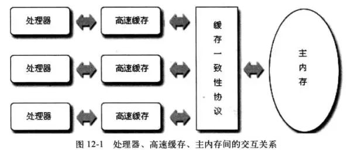
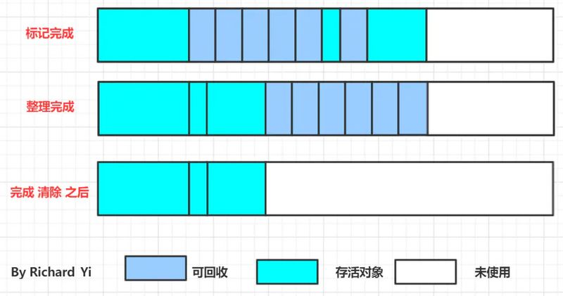

#   面经试题整理


## JVM 内存模型，哪些是线程私有的，哪些是公有的；硬件内存架构

Java 程序在运行时，会为JVM单独划出一块内存区域，而这块内存区域又可以再次划分出一块**运行时数据区**，运行时数据区域大致可以分为五个部分：


从上面的图中，有两种颜色不同的区域，红色的是线程共享区域，绿色的是线程私有区域

## Java 对象的内存结构


## 对象如何创建


## 如何判断是个对象是垃圾

垃圾回收的过程首先就是要确定对象是否是垃圾对象，如果是垃圾对象，垃圾回收器才会进行回收。垃圾回收主要又两种算法：引用计数算法和可达性分析算法。

### 引用计数算法

引用计数算法就是在对象中添加了一个引用计数器，当有地方引用这个对象时，引用计数器的值就加 1，当引用失效的时候，引用计数器的值就减 1。当引用计数器的值为 0 时，JVM 就开始回收这个对象。

简单的来说，在 JVM 的栈中，如果栈帧中指向了一个对象，那么堆中的引用计数器的值就会加 1，当栈帧这个指向 null 时，对象的引用计数器就减 1。

这种方法虽然很简单、高效，但是 JVM 一般不会选择这个方法，因为这个方法会出现一个问题：当对象之间相互指向时，两个对象的引用计数器的值都会加 1，而由于两个对象时相互指向，所以引用不会失效，这样 JVM 就无法回收。

### 可达性分析算法

针对引用计数算法的 BUG，JVM 采用了另一种方法：定义一个名为"GC Roots"的对象作为起始点，这个"GC Roots"可以有多个，从这些节点开始向下搜索，搜索所走过的路径称为引用链(Reference Chain)，当一个对象到GC Roots没有任何引用链相连时，则证明此对象是不可用的，即可以进行垃圾回收。


在上图中可以看到，如果时选用引用计数算法，object5, object6, object7之间互相引用，所以无法被回收。但是如果选用了可达性分析算法，虽然他们之间时相互引用，但是他们没有任何引用链和GC Roots连接，所以是可回收对象。

GC Roots对象一般包括有：

1. 虚拟机栈（栈帧中本地变量表）中引用的对象；

2. 方法区中类静态属性引用的对象；

3. 方法区中常量引用的对象；

4. 本地方法栈中JNI（Native方法）引用的对象。


## 有哪些垃圾回收算法，垃圾回收器

见下  G1 运作步骤


## 什么是full gc，过程，触发的条件是什么，为什么要避免 FullGC

### GC是什么时候触发的（面试最常见的问题之一）

由于对象进行了分代处理，因此垃圾回收区域、时间也不一样。GC 有两种类型：Scavenge GC 和 Full GC。

#### Scavenge GC 年轻代

一般情况下，当新对象生成，并且在 Eden 申请空间失败时，就会触发 Scavenge GC，对 Eden 区域进行 GC，清除非存活对象，并且把尚且存活的对象移动到 Survivor 区，然后整理 Survivor 的两个区。这种方式的 GC 是对年轻代的 Eden 区进行，不会影响到年老代。因为大部分对象都是从 Eden 区开始的，同时 Eden 区不会分配的很大，所以 Eden 区的GC会频繁进行。因而，一般在这里需要使用速度快、效率高的算法，使 Eden 去能尽快空闲出来。

#### Full GC

对整个堆进行整理，包括 Young、Tenured 和 Perm。**Full GC 因为需要对整个堆进行回收**，所以比 Scavenge GC 要慢，因此应该尽可能减少 Full GC 的次数。在对JVM调优的过程中，很大一部分工作就是对于Full GC的调节。有如下原因可能导致Full GC：

a) 老年代（Tenured）被写满；

b) 方法区空间不足；

c) System.gc() 被显示调用，系统建议执行 Full GC，但不必然执行；

d) 上一次 GC 之后 Heap 的各域分配策略动态变化；

e) 持久代（Perm）被写满，会导致 Class、Method 元信息的卸载；

f) 通过 Minor GC 后进入老年代的平均大小大于老年代的可用内存；

g) 由 Eden 区、survivor space1（From Space）区向survivor space2（To Space）区复制时，对象大小大于To Space可用内存，则把该对象转存到老年代，且老年代的可用内存小于该对象大小。


## 新生代垃圾收集算法，会不会 STW

在进行标记的时候，如果工作线程不停止的话，那么肯定会有新对象生成。这些对象是没有被标记的，里面可能有存活的对象，也可能有已经没有被引用的垃圾对象。那么在标记完后，进行回收时。要如何回收？

因为 Serial 和 ParNew 是采用的复制算法。回收的时候，是需要把存活对象移到Survivor中的。而那些没有被标记的，有存活的，也有垃圾对象。显然不能全部移动到 survivor 中的。

所以，在进行新生代回收的时候，是需要 stop the world 的。


## CMS垃圾回收针对哪些部分，回收过程

老年代

Concurrent Mark Sweep，在进行垃圾回收的时候，应用程序也可以并发运行，减少 STW（200ms 以内）

前面说到过 Parallel Scavenge 收集器，它是一个可以控制吞吐量的垃圾收集器。现在要说的 CMS 收集器，它是一个追求最短停顿时间的垃圾收集器，基于标记-清除算法实现的。CMS 垃圾收集器的运作过程相对前面几个垃圾收集器来说比较复杂，整个过程可以分为四个部分：

- **初始标记：** 需要 Stop The World，这里仅仅标记 GC Roots 能够直接关联的对象，所以速度很快。
- **并发标记：** 从关联对象遍历整个GC Roots的引用链，这个过程耗时最长，但是却可以和用户线程并发运行。
- **重新标记：** 修正并发时间，因为用户线程可能会导致标记产生变动，同样需要 Stop The World。
- **并发清除：** 清除已经死亡的对象。


## 老年代GC和FullGC的关系


## GC时间长如何发现，如何处理

### 1.对象创建的速度过高

如果应用创建对象的速度非常高，随之而来的就是GC频率也会变快，然后会导致GC的停顿时间变长。所以说，优化代码以降低对象的创建速率是降低GC停顿时间最有效的方法。这可能是一件非常耗时的事情，但是却非常值得去做。可以使用JProfiler, YourKit, JVisualVM这样的性能监控工具来帮助优化对象的创建速度，这些工具会分析出：应用到底创建了哪些对象？对象创建的速度是多少？这些对象占用了多少内存空间？是谁创建的这些对象？所谓擒贼先擒王，因此首先要考虑优化那些占用内存最多的对象。

tip1：如何知道对象的创建速度？[把GC日志上传到gceasy.io](http://xn--gcgceasy-m39lv3gosmhw6bulhx9l.io/)，这个工具会告诉你对象的创建速度，下图中‘Object Stats’里面的 ‘Avg creation rate’ 就是对象的平均创建速度。要让这个值尽可能的小。


### 2. Young区过小

如果 Young 过小，对象就会过早的晋升到 Old 区，Old 区的垃圾回收一般比 Young 区会花费更多的时间，因此，可以通过增大 Young 区来有效的降低长时间 GC 停顿。可以用下面两个 JVM 参数来设置 Young 区的大小：

-Xmn: 设置 Young 区所占的字节数

-XX:NewRatio: 设置 Old 区和 Young 区的比例，比如说，-XX:NewRatio=3 也就是说 Old 区和 Young 区的比例是3:1，Young 区占整个堆的1/4，如果堆是 2G，那么 Young 区就是 0.5G。

### 3. 选择合适的GC算法

GC 算法是影响 GC 停顿时间的一个非常重要的因素，除非你是个 GC 方面的专家或者你的团队中有这方面的专家可以调优 GC 的设置达到最优的停顿时间，否则我建议选择使用 G1 收集器，因为 G1 是自动调优的，你只需要设置一个停顿时间的目标就可以了，比如： -XX:MaxGCPauseMillis=200。这个例子设置了最大停顿时间的目标是 200ms，JVM 会尽最大努力来满足这个目标。如果你已经使用了 G1 但是还是出现了长时间的 GC 停顿，那么继续考虑别的因素和方法。

### 4. 进程被交换（Swap）出内存

有时候由于系统内存不足，操作系统会把你的应用从内存中交换出去。Swap 是非常耗时的，因为需要访问磁盘，相对于访问物理内存来说要慢得多的多。我认为生产环境下的应用是不应该被 Swap 出内存的。当发生进程 Swap 的时候，GC 停顿时间也会变长。
下面是从 stackoverflow 上引用的一个脚本，它能够列出被 Swap 出内存的进程，要确保你的应用没有被 Swap 出内存。

```bash
#!/bin/bash 
# Get current swap usage for all running processes
# Erik Ljungstrom 27/05/2011
# Modified by Mikko Rantalainen 2012-08-09
# Pipe the output to "sort -nk3" to get sorted output
# Modified by Marc Methot 2014-09-18
# removed the need for sudo

SUM=0
OVERALL=0
for DIR in `find /proc/ -maxdepth 1 -type d -regex "^/proc/[0-9]+"`
do
    PID=`echo $DIR | cut -d / -f 3`
    PROGNAME=`ps -p $PID -o comm --no-headers`
    for SWAP in `grep VmSwap $DIR/status 2>/dev/null | awk '{ print $2 }'`
    do
        let SUM=$SUM+$SWAP
    done
    if (( $SUM > 0 )); then
        echo "PID=$PID swapped $SUM KB ($PROGNAME)"
    fi
    let OVERALL=$OVERALL+$SUM
    SUM=0
done
echo "Overall swap used: $OVERALL KB"
```

如果很不幸你的应用被 Swap 了，你需要：

a：给机器增加内存

b：减少机器上运行的进程数，以释放更多的内存

c：减少应用分配的内存（不推荐，可能会引起其他问题）

### 5. GC线程数过少

GC 日志中的每一个 GC 事件都会打印 user、sys、real time，比如：

```java
[Times: user=25.56 sys=0.35, real=20.48 secs]
```

这几个时间的区别可以查看前面文章：GC 日志中 sys 时间比 user 时间长该如何处理？GC 日志中 real 时间比 user + sys 时间长该如何处理？如果GC日志中，real time 并不是明显比 user time 小，这就说明 GC 线程数是不够的，这就需要增加 GC 线程了。假如说，user time 是 25 秒，GC 线程数是 5，那么 real time 大概是5左右才是正常的（25/5=5）。

注意：GC 线程过多会占用大量的系统 CPU，从而会影响应用能使用的 CPU 资源，因此增加 GC 线程之前一定要做好测试才可以。

### 6. IO负载重

如果系统的 IO 负载很重（大量的文件读写）也会导致 GC 停顿时间过长。这些 IO 读写不一定是你的应用引起的，可能是机器上其他的进程导致的，但是这仍然会导致你的应用的停顿时间变长。

这里有个文章详细的说明了这种情况：https://engineering.linkedin.com/blog/2016/02/eliminating-large-jvm-gc-pauses-caused-by-background-io-traffic。

当IO负载很重的时候，real time 会明显比 user time 长，比如：

```java
[Times: user=0.20 sys=0.01, real=18.45 secs]
```

如果发生了这种情况，可以这么办：

a：如果是你的应用导致的，优化你的代码

b：如果是别的进程导致的，把它杀掉或者迁走

c：把你的应用迁到一个IO负载小的机器上

tip：如何来监控IO负载？

在linux上可以用sar命令来监控IO的负载：sar -d -p 1，这个命令每隔一秒会打印一次每秒的读写数量。

这里有sar的详细的用法：https://www.linuxtechi.com/generate-cpu-memory-io-report-sar-command/

### 7.显式调用了System.gc()

当调用了 System.gc() 或者是 Runtime.getRuntime().gc() 以后，就会导致 FullGC。FullGC 的过程当中，整个 JVM 是暂停的（所有的应用都被暂停掉）。System.gc() 可能是以下几种情况产生的：

a：应用的程序员手动调用了System.gc()

b：应用引用的三方库或者框架甚至是应用服务器可能调用了System.gc()

c：可能是由外部使用了JMX的工具触发，比如：JVisualVM。

d：如果你的应用使用了RMI，RMI会每隔一段时间调用一次System.gc()，这个时间间隔是可以设置的：

```java
– Dsun.rmi.dgc.server.gcInterval=n
– Dsun.rmi.dgc.client.gcInterval=n
```

要评估一下，是否真的有必要明确调用System.gc()。如果没有必要，就不要调用。同时，你也可以通过给JVM传递‘-XX:+DisableExplicitGC‘参数来禁用掉System.gc()。

关于System.gc()的问题和解决方案可以参考：https://blog.gceasy.io/2016/11/22/system-gc/

tip：如何知道是否手动调用了System.gc()？可以把GC日志上传到gceasy，如果有手动调用System.gc()，在‘GC Causes’中就会展示出来，如图：


上图说明发生了4次System.gc()调用。

### 8. 堆内存过大

堆内存过大也会导致GC停顿时间过长，如果堆内存过大，那么堆中就会累计过多的垃圾，当发生 FullGC 要回收所有的垃圾的时候，就会花费更多的时间。如果你的 JVM 的堆内存有18G，可以考虑分成3个6G的 JVM 实例，堆内存小会降低GC的停顿时间。
注意：在应用以上任何一种策略之前，都需要做好测试，这些策略对你可能都不适用，如果使用不当可能带来负面效果。

### 9.GC任务分配不均

就算有多个GC线程，线程之间的任务分配可能也不是均衡的，这个可能有很多种原因：

a：扫描大的线性的数据结构目前是无法并行的。

b：有些GC事件只发生在单个线程上，比如CMS中的‘concurrent mode failure’。如果你碰巧使用的CMS，可以使用-XX:+CMSScavengeBeforeRemark 这个参数，它可以让多个GC线程之间任务分配的更平均。


## 接口慢如何排查原因


## Java  内存泄露和内存溢出

内存泄露：申请使用完的内存没有释放，导致虚拟机不能再次使用该内存，此时这段内存就泄露了，因为申请者不用了，而又不能被虚拟机分配给别人用。

内存溢出：申请的内存超出了JVM能提供的内存大小，此时称之为溢出。


## Java 如何制造 OOM

**1）什么是OOM？** 

OOM，全称“Out Of Memory”，翻译成中文就是“内存用完了”，来源于java.lang.OutOfMemoryError。

看下关于的官方说明： Thrown when the Java Virtual Machine cannot allocate an object because it is out of memory, and no more memory could be made available by the garbage collector. 意思就是说，当JVM因为没有足够的内存来为对象分配空间并且垃圾回收器也已经没有空间可回收时，就会抛出这个error（注：非exception，因为这个问题已经严重到不足以被应用处理）。

 

**2）为什么会OOM？**

为什么会没有内存了呢？原因不外乎有两点：

1）分配的少了：比如虚拟机本身可使用的内存（一般通过启动时的VM参数指定）太少。

2）应用用的太多，并且用完没释放，浪费了。此时就会造成内存泄露或者内存溢出。

 

内存泄露：申请使用完的内存没有释放，导致虚拟机不能再次使用该内存，此时这段内存就泄露了，因为申请者不用了，而又不能被虚拟机分配给别人用。

内存溢出：申请的内存超出了JVM能提供的内存大小，此时称之为溢出。

 

在之前没有垃圾自动回收的日子里，比如C语言和C++语言，我们必须亲自负责内存的申请与释放操作，如果申请了内存，用完后又忘记了释放，比如C++中的new了但是没有delete，那么就可能造成内存泄露。偶尔的内存泄露可能不会造成问题，而大量的内存泄露可能会导致内存溢出。

而在 Java 语言中，由于存在了垃圾自动回收机制，所以，我们一般不用去主动释放不用的对象所占的内存，也就是理论上来说，是不会存在“内存泄露”的。但是，如果编码不当，比如，将某个对象的引用放到了全局的Map中，虽然方法结束了，但是由于垃圾回收器会根据对象的引用情况来回收内存，导致该对象不能被及时的回收。如果该种情况出现次数多了，就会导致内存溢出，比如系统中经常使用的缓存机制。Java中的内存泄露，不同于C++中的忘了delete，往往是逻辑上的原因泄露。

 

**3）OOM的类型**

JVM内存模型：

按照JVM规范，JAVA虚拟机在运行时会管理以下的内存区域：

- **程序计数器**：当前线程执行的字节码的行号指示器，线程私有
- **JAVA 虚拟机栈**：Java 方法执行的内存模型，每个 Java 方法的执行对应着一个栈帧的进栈和出栈的操作。
- **本地方法栈**：类似“ JAVA虚拟机栈 ”，但是为 native 方法的运行提供内存环境。
- **JAVA 堆**：对象内存分配的地方，内存垃圾回收的主要区域，所有线程共享。可分为新生代，老生代。
- **方法区**：用于存储已经被JVM加载的类信息、常量、静态变量、即时编译器编译后的代码等数据。Hotspot中的“永久代”。
- **运行时常量池**：方法区的一部分，存储常量信息，如各种字面量、符号引用等。
- **直接内存**：并不是 JVM 运行时数据区的一部分， 可直接访问的内存， 比如NIO会用到这部分。

按照JVM规范，除了程序计数器不会抛出OOM外，其他各个内存区域都可能会抛出OOM。

 

最常见的OOM情况有以下三种：

- java.lang.OutOfMemoryError: Java heap space ———>Java 堆内存溢出，此种情况最常见，一般由于内存泄露或者堆的大小设置不当引起。对于内存泄露，需要通过内存监控软件查找程序中的泄露代码，而堆大小可以通过虚拟机参数-Xms,-Xmx等修改。
- java.lang.OutOfMemoryError: PermGen space ———>Java 永久代溢出，即方法区溢出了，一般出现于大量 Class 或者 jsp 页面，或者采用 cglib 等反射机制的情况，因为上述情况会产生大量的 Class 信息存储于方法区。此种情况可以通过更改方法区的大小来解决，使用类似-XX:PermSize=64m -XX:MaxPermSize=256m的形式修改。另外，过多的常量尤其是字符串也会导致方法区溢出。
- java.lang.StackOverflowError ------> 不会抛OOM error，但也是比较常见的 Java 内存溢出。JAVA虚拟机栈溢出，一般是由于程序中存在死循环或者深度递归调用造成的，栈大小设置太小也会出现此种溢出。可以通过虚拟机参数-Xss来设置栈的大小。


**4）OOM分析--heapdump**

要dump堆的内存镜像，可以采用如下两种方式：

设置JVM参数-XX:+HeapDumpOnOutOfMemoryError，设定当发生OOM时自动dump出堆信息。不过该方法需要JDK5以上版本。
使用JDK自带的jmap命令。"jmap -dump:format=b,file=heap.bin <pid>"  其中pid可以通过jps获取。
dump堆内存信息后，需要对dump出的文件进行分析，从而找到OOM的原因。

常用的工具有：

**mat**: eclipse memory analyzer, 基于eclipse RCP的内存分析工具。详细信息参见：http://www.eclipse.org/mat/，推荐使用。

**jhat**：JDK自带的java heap analyze tool，可以将堆中的对象以html的形式显示出来，包括对象的数量，大小等等，并支持对象查询语言OQL，分析相关的应用后，可以通过http://localhost:7000来访问分析结果。不推荐使用，因为在实际的排查过程中，一般是先在生产环境 dump出文件来，然后拉到自己的开发机器上分析，所以，不如采用高级的分析工具比如前面的mat来的高效。
这个链接：http://www.ibm.com/developerworks/cn/opensource/os-cn-ecl-ma/index.html中提供了一个采用mat分析的例子 。

注意：因为JVM规范没有对dump出的文件的格式进行定义，所以不同的虚拟机产生的dump文件并不是一样的。在分析时，需要针对不同的虚拟机的输出采用不同的分析工具（当然，有的工具可以兼容多个虚拟机的格式）。IBM HeapAnalyzer也是分析heap的一个常用的工具。


**Java 堆溢出**

GC Roots 到对象之间有可达路径来避免垃圾回收机智清理这些对象，就会在对象数量达到最大堆的绒容量，然后产生内存溢出异常。

Eclipse 的 Debug 页面中设置虚拟机参数

代码：
-verbose:gc -Xms20M -Xmx20M Xmn10M -XX:+PrintGCDaetails -XX：SurvivorRatio=8

JAVA堆的大小设置最小值 -Xms 

JAVA堆的大小设置最大值 -Xmx

 

**解决异常**

首先通过内存映射分析工具，如 Eclipse Memory Analyzer 堆 dump出的异常堆转储进行快照解析确认内存中的对象是否是必要的，也就是先分清楚是内存泄漏 Memory Leak 还是Memory Overflow。如果是内存泄漏，可通过工具进一步查看泄露的对象到GC Roots的引用链，就能找到泄露对象是怎么通过路径与 GC Roots 相关联导致垃圾收集器无法回收他们；如果不存在泄露，就检查堆参数 -Xmx 与 -Xms 与机器物理内存对比是否还可以调大，从代码上检测，是否是某些对象的生命周期过长、持有状态时间过长，尝试减少代码运行期间的内存消耗。

**虚拟机栈 和 本地方法栈 溢出**

HotSpot 虚拟机不区分 虚拟机栈 和 本地方法栈，因此Xoss（设置本地方法栈内存大小）参数虽然存在但是是无效的。

虚拟机栈 和 本地方法栈两种异常：

线程请求栈的深度大于虚拟机允许的最大深度 抛出 StackOverflowError

如果虚拟机在扩展栈是无法申请到足够的内存空间 抛出 Out Of Menmory Error

注：单个线程下，无论是栈帧太大还是虚拟机栈容量太小，当内存无法分配的时候抛出的都是StackOverflowError

**运行时常量池溢出**

如果向运行时常量去添加内容最简单的做法就是使用 String.intern() 这个 Native 方法，该方法作用是：如果池中包含一个等于此 String 对象的字符串，则返回代表池中这个字符串的 String 对象；否则将该 String 对象的字符串添加到常量池中，并返回此 String 对象的引用。

-XX:PermSize 方法区最小值 

-XX:MaxPermSize 方法区最大值

如果运行时常量池 OOM 提示信息为 OutOfMemoryError : PermGen space 表示运行时常量池属于方法区的一部分 

**方法区溢出**

方法区是用于存放 Class信息的，如：类名、访问修饰符、常量池、等。

当前主流 AOP 框架 (Spring Hibernate 等) 都会使用到 CFLib 这类字节码技术对类进行加强，增强的类越多，就越需要越大的方法区来保证动态生成的Class 可以载入内存。在动态生成大量 Class 的应用中，需要特别注意类的回收状况。

注：除了使用GCLib字节码增强以外，常见的还有 JSP 或者动态产生 JSP 的应用文件（JSP在第一次运行时要编译为JAVA类）或是基于 OSGi（注：  OSGi(Open Service Gateway Initiative)技术，是Java动态化模块化系统的一系列规范。OSGi一方面指维护OSGi规范的OSGI官方联盟，另一方面指的是该组织维护的基于Java语言的服务(业务)规范。简单来说，OSGi可以认为是Java平台的模块层。） 的应用即使是同一个类呗不同的加载器加载也会视为不同的类。

 

**本机直接内存溢出**

DirectMemory 可通过-XX：MaxDirectMemorySize 指定。

如果不指定，则和 Java 堆的最大值一样，使用 DirectByteBuffer 分配内存，也会抛出内存溢出异常。但是它抛出异常的时候并没有向计算机申请分配内存，而是通过计算机内存得知是否可以分配。于是抛出异常申请分配内存的方法是unsafe.allocateMemory();。


## 用户态，内核态

1. 用户态和内核态的概念区别

究竟什么是用户态，什么是内核态，这两个基本概念以前一直理解得不是很清楚，根本原因个人觉得是在于因为大部分时候我们在写程序时关注的重点和着眼的角度放在了实现的功能和代码的逻辑性上，先看一个例子：

1）例子

```java
 void testfork(){
     if(0 = = fork()){
         printf(“create new process success!/n”);
     }
     printf(“testfork ok/n”);
 }
```


  

       这段代码很简单，从功能的角度来看，就是实际执行了一个fork()，生成一个新的进程，从逻辑的角度看，就是判断了如果fork()返回的是0则打印相关语句，然后函数最后再打印一句表示执行完整个testfork()函数。代码的执行逻辑和功能上看就是如此简单，一共四行代码，从上到下一句一句执行而已，完全看不出来哪里有体现出用户态和进程态的概念。

如果说前面两种是静态观察的角度看的话，我们还可以从动态的角度来看这段代码，即它被转换成CPU执行的指令后加载执行的过程，这时这段程序就是一个动态执行的指令序列。而究竟加载了哪些代码，如何加载就是和操作系统密切相关了。

 

2）特权级

熟悉Unix/Linux系统的人都知道，fork的工作实际上是以系统调用的方式完成相应功能的，具体的工作是由sys_fork负责实施。其实无论是不是Unix或者Linux，对于任何操作系统来说，创建一个新的进程都是属于核心功能，因为它要做很多底层细致地工作，消耗系统的物理资源，比如分配物理内存，从父进程拷贝相关信息，拷贝设置页目录页表等等，这些显然不能随便让哪个程序就能去做，于是就自然引出特权级别的概念，显然，最关键性的权力必须由高特权级的程序来执行，这样才可以做到集中管理，减少有限资源的访问和使用冲突。

特权级显然是非常有效的管理和控制程序执行的手段，因此在硬件上对特权级做了很多支持，就Intel x86架构的CPU来说一共有0~3四个特权级，0级最高，3级最低，硬件上在执行每条指令时都会对指令所具有的特权级做相应的检查，相关的概念有CPL、DPL和RPL，这里不再过多阐述。硬件已经提供了一套特权级使用的相关机制，软件自然就是好好利用的问题，这属于操作系统要做的事情，对于Unix/Linux来说，只使用了0级特权级和3级特权级。也就是说在Unix/Linux系统中，一条工作在0级特权级的指令具有了CPU能提供的最高权力，而一条工作在3级特权级的指令具有CPU提供的最低或者说最基本权力。

 

3）用户态和内核态

        现在我们从特权级的调度来理解用户态和内核态就比较好理解了，当程序运行在3级特权级上时，就可以称之为运行在用户态，因为这是最低特权级，是普通的用户进程运行的特权级，大部分用户直接面对的程序都是运行在用户态；反之，当程序运行在0级特权级上时，就可以称之为运行在内核态。

虽然用户态下和内核态下工作的程序有很多差别，但最重要的差别就在于特权级的不同，即权力的不同。运行在用户态下的程序不能直接访问操作系统内核数据结构和程序，比如上面例子中的testfork()就不能直接调用sys_fork()，因为前者是工作在用户态，属于用户态程序，而sys_fork()是工作在内核态，属于内核态程序。

当我们在系统中执行一个程序时，大部分时间是运行在用户态下的，在其需要操作系统帮助完成某些它没有权力和能力完成的工作时就会切换到内核态，比如testfork()最初运行在用户态进程下，当它调用fork()最终触发sys_fork()的执行时，就切换到了内核态。

 

2.   用户态和内核态的转换

1）用户态切换到内核态的3种方式

a. 系统调用

        这是用户态进程主动要求切换到内核态的一种方式，用户态进程通过系统调用申请使用操作系统提供的服务程序完成工作，比如前例中fork()实际上就是执行了一个创建新进程的系统调用。而系统调用的机制其核心还是使用了操作系统为用户特别开放的一个中断来实现，例如Linux的int 80h中断。

b. 异常

        当CPU在执行运行在用户态下的程序时，发生了某些事先不可知的异常，这时会触发由当前运行进程切换到处理此异常的内核相关程序中，也就转到了内核态，比如缺页异常。

c. 外围设备的中断

        当外围设备完成用户请求的操作后，会向CPU发出相应的中断信号，这时CPU会暂停执行下一条即将要执行的指令转而去执行与中断信号对应的处理程序，如果先前执行的指令是用户态下的程序，那么这个转换的过程自然也就发生了由用户态到内核态的切换。比如硬盘读写操作完成，系统会切换到硬盘读写的中断处理程序中执行后续操作等。

 


这3种方式是系统在运行时由用户态转到内核态的最主要方式，其中系统调用可以认为是用户进程主动发起的，异常和外围设备中断则是被动的。

 

2）具体的切换操作

从触发方式上看，可以认为存在前述3种不同的类型，但是从最终实际完成由用户态到内核态的切换操作上来说，涉及的关键步骤是完全一致的，没有任何区别，都相当于执行了一个中断响应的过程，因为系统调用实际上最终是中断机制实现的，而异常和中断的处理机制基本上也是一致的，关于它们的具体区别这里不再赘述。关于中断处理机制的细节和步骤这里也不做过多分析，涉及到由用户态切换到内核态的步骤主要包括：

[1] 从当前进程的描述符中提取其内核栈的ss0及esp0信息。

[2] 使用ss0和esp0指向的内核栈将当前进程的cs,eip,eflags,ss,esp信息保存起来，这个

过程也完成了由用户栈到内核栈的切换过程，同时保存了被暂停执行的程序的下一

条指令。

[3] 将先前由中断向量检索得到的中断处理程序的cs,eip信息装入相应的寄存器，开始

执行中断处理程序，这时就转到了内核态的程序执行了。

 

举个例子：

下面的图中执行了连续的两条指令：

```bash
 mov eax, 0x4
     int 0x80
```

可以看到，指令mov eax, 0x4对应的cs为0x7，eip为0x308a，ss为0xf，esp为0x80320

这表明此条指令的特权级是3级，也就是说该指令是工作在用户态下的。

 

 

int 0x80即所谓的系统调用执行的软中断，此条指令执行完之后，cs变换成了0x8,eip为0x1400，ss变成了0x10, esp 变成了0x1ffffec。这时系统已经转入了内核态执行，而且栈也变为了内核栈。

 

 

 

内核态程序执行完毕时如果要从内核态返回用户态，可以通过执行指令iret来完成，指令iret会将先前压栈的进入内核态前的cs,eip,eflags,ss,esp信息从栈里弹出，加载到各个对应的寄存器中，重新开始执行用户态的程序，这个过程不再详述。


## 重排序细节


## 线程切换的上下文要装载什么


## 有没有JVM调优的经验、如何JVM 调优，Dump 日志如何分析


## 强引用 软引用 弱引用 虚引用

### 在Java中提供了四个级别的引用：强引用，软引用，弱引用和虚引用。

在这四个引用类型中，只有强引用FinalReference类是包内可见，其他三种引用类型均为public，可以在应用程序中直接使用。

#### 1.强引用Java中的引用，类似C语言中最难的指针。

通过引用，可以对堆中的对象进行操作。

如：StringBuffer stringBuffer = new StringBuffer("Helloword");

变量str指向StringBuffer实例所在的堆空间，通过str可以操作该对象。

**强引用的特点：**

- 强引用可以直接访问目标对象。

- 引用所指向的对象在任何时候都不会被系统回收。

- JVM宁愿抛出OOM异常，也不会回收强引用所指向的对象。

- 强引用可能导致内存泄漏。

#### 2.软引用软引用是除了强引用外，最强的引用类型。

可以通过java.lang.ref.SoftReference使用软引用。一个持有软引用的对象，不会被JVM很快回收，JVM会根据当前堆的使用情况来判断何时回收。当堆使用率临近阈值时，才会去回收软引用的对象。

因此，软引用可以用于实现对内存敏感的高速缓存。SoftReference的特点是它的一个实例保存对一个Java对象的软引用， 该软引用的存在不妨碍垃圾收集线程对该Java对象的回收。也就是说，一旦SoftReference保存了对一个Java对象的软引用后，在垃圾线程对 这个Java对象回收前，SoftReference类所提供的get()方法返回Java对象的强引用。一旦垃圾线程回收该Java对象之后，get()方法将返回null。下面举一个例子说明软引用的使用方法。在你的IDE设置参数 -Xmx2m -Xms2m规定堆内存大小为2m。

```java
@Test    
public void test3(){ 
        
    MyObject obj = new myObject();
    SoftReference sf = new SoftReference<>(obj);
    obj = null;
    System.gc();
    //        byte[] bytes = new byte[1024*100];
    //        System.gc();
    System.out.println("是否被回收"+sf.get());    
}
```

运行结果：是否被回收cn.zyzpp.MyObject@42110406打开被注释掉的new byte[1024*100]语句，这条语句请求一块大的堆空间，使堆内存使用紧张。并显式的再调用一次GC，结果如下：是否被回收null说明在系统内存紧张的情况下，软引用被回收。

#### 3.弱引用弱引用是一种比软引用较弱的引用类型。

在系统GC时，只要发现弱引用，不管系统堆空间是否足够，都会将对象进行回收。在java中，可以用java.lang.ref.WeakReference实例来保存对一个Java对象的弱引用。

```java
public void test3() {
    MyObject obj = new MyObject();
    WeakReference sf = new WeakReference(obj);
    obj = null;System.out.println("是否被回收"+sf.get());
    System.gc();
    System.out.println("是否被回收"+sf.get());    
}
```

运行结果：是否被回收cn.zyzpp.MyObject@42110406是否被回收null软引用，弱引用都非常适合来保存那些可有可无的缓存数据，如果这么做，当系统内存不足时，这些缓存数据会被回收，不会导致内存溢出。而当内存资源充足时，这些缓存数据又可以存在相当长的时间，从而起到加速系统的作用。

#### 4.虚引用虚引用是所有类型中最弱的一个。

一个持有虚引用的对象，和没有引用几乎是一样的，随时可能被垃圾回收器回收。当试图通过虚引用的get()方法取得强引用时，总是会失败。并且，虚引用必须和引用队列一起使用，它的作用在于跟踪垃圾回收过程。当垃圾回收器准备回收一个对象时，如果发现它还有虚引用，就会在垃圾回收后，销毁这个对象，将这个虚引用加入引用队列。程序可以通过判断引用队列中是否已经加入了虚引用，来了解被引用的对象是否将要被垃圾回收。如果程序发现某个虚引用已经被加入到引用队列，那么就可以在所引用的对象的内存被回收之前采取必要的行动。

```java
public void test3() {
    MyObject obj = new MyObject();
    ReferenceQueue referenceQueue = new ReferenceQueue<>();
    PhantomReference sf = new PhantomReference<>(obj,referenceQueue);
    obj = null;
    System.out.println("是否被回收"+sf.get());
    System.gc();
    System.out.println("是否被回收"+sf.get());
   }
```

运行结果：是否被回收null是否被回收null对虚引用的get()操作，总是返回null，因为sf.get()方法的实现如下：    public T get() {        return null;    }

#### 5.WeakHashMap类及其实现WeakHashMap类在java.util包内，它实现了Map接口，是HashMap的一种实现，它使用弱引用作为内部数据的存储方案。

> WeakHashMap是弱引用的一种典型应用，它可以作为简单的缓存表解决方案。一下两段代码分别使用WeakHashMap和HashMap保存大量的数据：


```java
public void test(){     
    Map map;
    map = new WeakHashMap();    
    for (int i =0;i<10000;i++){
        map.put("key"+i,new byte[i]);}
        // map = new HashMap();
        //    for (int i =0;i<10000;i++){
            //  map.put("key"+i,new byte[i]);
            //}   
}
```

使用-Xmx2M限定堆内存，使用WeakHashMap的代码正常运行结束，而使用HashMap的代码段抛出异常java.lang.OutOfMemoryError: Java heap space

**由此可见，WeakHashMap会在系统内存紧张时使用弱引用，自动释放掉持有弱引用的内存数据。但如果WeakHashMap的key都在系统内持有强引用，那么WeakHashMap就退化为普通的HashMap，因为所有的表项都无法被自动清理。**


# JVM

- 一个能够运行字节码的虚拟机。
- 屏蔽了具体的操作系统的信息。
- 正是以上两点，使得Java程序具有**一次编译，到处执行**的特性。

关于JVM是什么的介绍就到这里，还是老样子，先来看看这篇文章的结构：


## Java 内存模型 JMM

我们常说的 JVM 内存模式指的是 JVM 的内存分区；而 Java 内存模式是一种虚拟机规范。

Java 虚拟机规范中定义了 Java 内存模型（Java Memory Model，JMM），用于屏蔽掉各种硬件和操作系统的内存访问差异，以实现让 Java 程序在各种平台下都能达到一致的并发效果，JMM 规范了 Java 虚拟机与计算机内存是如何协同工作的：规定了一个线程如何和何时可以看到由其他线程修改过后的共享变量的值，以及在必须时如何同步的访问共享变量。

原始的 Java 内存模型存在一些不足，因此 Java 内存模型在 Java1.5 时被重新修订。这个版本的 Java 内存模型在 Java8 中仍然在使用。

Java 内存模型（不仅仅是JVM内存分区）：调用栈和本地变量存放在线程栈上，对象存放在堆上。


- 一个本地变量可能是原始类型，在这种情况下，它总是“呆在”线程栈上。
- 一个本地变量也可能是指向一个对象的一个引用。在这种情况下，引用（这个本地变量）存放在线程栈上，但是对象本身存放在堆上。
- 一个对象可能包含方法，这些方法可能包含本地变量。这些本地变量仍然存放在线程栈上，即使这些方法所属的对象存放在堆上。
- 一个对象的成员变量可能随着这个对象自身存放在堆上。不管这个成员变量是原始类型还是引用类型。
- 静态成员变量跟随着类定义一起也存放在堆上。
- 存放在堆上的对象可以被所有持有对这个对象引用的线程访问。当一个线程可以访问一个对象时，它也可以访问这个对象的成员变量。如果两个线程同时调用同一个对象上的同一个方法，它们将会都访问这个对象的成员变量，但是每一个线程都拥有这个成员变量的私有拷贝。


**JMM 对特殊 Java 语义的特殊规则支持**

[volatile总结](https://link.zhihu.com/?target=http%3A//mp.weixin.qq.com/s%3F__biz%3DMzI3NzM2OTQ5Mg%3D%3D%26mid%3D2247484289%26idx%3D1%26sn%3Dbdf6721e01c613bfb1458a8584e80800%26chksm%3Deb66047adc118d6c395c14e5b953686bfdfac93fd6fa8c0731bb89aadd7437bba800d034659d%26scene%3D21%23wechat_redirect) （保证内存可见性：Lock 前缀的指令、内存屏障禁止重排序）

[synchronized总结](https://link.zhihu.com/?target=http%3A//mp.weixin.qq.com/s%3F__biz%3DMzI3NzM2OTQ5Mg%3D%3D%26mid%3D2247484280%26idx%3D1%26sn%3D8de305338c5ab348c3e2a784084e4306%26chksm%3Deb660483dc118d95e9bcde15a01103f818ed2fd399989f36dc2d57740a305e91cf986d4f5a64%26scene%3D21%23wechat_redirect) （保证内存可见性和操作原子性：互斥锁；锁优化）


### 硬件内存架构

现代硬件内存模型与Java内存模型有一些不同，理解内存模型架构以及Java内存模型如何与它协同工作也是非常重要的。

现代计算机硬件架构的简单图示：


- **多 CPU**：一个现代计算机通常由两个或者多个 CPU。其中一些 CPU 还有多核。从这一点可以看出，在一个有两个或者多个 CPU 的现代计算机上同时运行多个线程是可能的。每个 CPU 在某一时刻运行一个线程是没有问题的。这意味着，如果你的 Java 程序是多线程的，在你的 Java 程序中每个 CPU 上一个线程可能同时（并发）执行。
- **CPU 寄存器**：每个 CPU 都包含一系列的寄存器，它们是 CPU 内内存的基础。CPU 在寄存器上执行操作的速度远大于在主存上执行的速度。这是因为 CPU 访问寄存器的速度远大于主存。
- **高速缓存 cache**：由于计算机的存储设备与处理器的运算速度之间有着几个数量级的差距，所以现代计算机系统都不得不加入一层读写速度尽可能接近处理器运算速度的高速缓存（Cache）来作为内存与处理器之间的缓冲：将运算需要使用到的数据复制到缓存中，让运算能快速进行，当运算结束后再从缓存同步回内存之中，这样处理器就无须等待缓慢的内存读写了。CPU 访问缓存层的速度快于访问主存的速度，但通常比访问内部寄存器的速度还要慢一点。每个 CPU 可能有一个 CPU 缓存层，一些 CPU 还有多层缓存。在某一时刻，一个或者多个缓存行（cache lines）可能被读到缓存，一个或者多个缓存行可能再被刷新回主存。
- **内存**：一个计算机还包含一个主存。所有的 CPU 都可以访问主存。主存通常比 CPU 中的缓存大得多。
- **运作原理**：通常情况下，当一个 CPU 需要读取主存时，它会将主存的部分读到 CPU 缓存中。它甚至可能将缓存中的部分内容读到它的内部寄存器中，然后在寄存器中执行操作。当 CPU 需要将结果写回到主存中去时，它会将内部寄存器的值刷新到缓存中，然后在某个时间点将值刷新回主存。

**多线程环境的一些问题**

- **缓存一致性问题**：在多处理器系统中，每个处理器都有自己的高速缓存，而它们又共享同一主内存（MainMemory）。基于高速缓存的存储交互很好地解决了处理器与内存的速度矛盾，但是也引入了新的问题：缓存一致性（CacheCoherence）。当多个处理器的运算任务都涉及同一块主内存区域时，将可能导致各自的缓存数据不一致的情况，如果真的发生这种情况，那同步回到主内存时以谁的缓存数据为准呢？为了解决一致性的问题，需要各个处理器访问缓存时都遵循一些协议，在读写时要根据协议来进行操作，这类协议有MSI、MESI（IllinoisProtocol）、MOSI、Synapse、Firefly及DragonProtocol，等等：



- **指令重排序问题**：为了使得处理器内部的运算单元能尽量被充分利用，处理器可能会对输入代码进行乱序执行（Out-Of-Order Execution）优化，处理器会在计算之后将乱序执行的结果重组，保证该结果与顺序执行的结果是一致的，但并不保证程序中各个语句计算的先后顺序与输入代码中的顺序一致。因此，如果存在一个计算任务依赖另一个计算任务的中间结果，那么其顺序性并不能靠代码的先后顺序来保证。与处理器的乱序执行优化类似，Java 虚拟机的即时编译器中也有类似的指令重排序（Instruction Reorder）优化。

### **Java 内存模型和硬件内存架构之间的桥接**

Java 内存模型与硬件内存架构之间存在差异。硬件内存架构没有区分线程栈和堆。对于硬件，所有的线程栈和堆都分布在主内存中。部分线程栈和堆可能有时候会出现在 CPU 缓存中和 CPU 内部的寄存器中。如下图所示：


从抽象的角度来看，JMM 定义了线程和主内存之间的抽象关系：

- 线程之间的共享变量存储在主内存（Main Memory）中
- 每个线程都有一个私有的本地内存（Local Memory），本地内存是 JMM 的一个抽象概念，并不真实存在，它涵盖了缓存、写缓冲区、寄存器以及其他的硬件和编译器优化。本地内存中存储了该线程以读/写共享变量的拷贝副本。
- 从更低的层次来说，主内存就是硬件的内存，而为了获取更好的运行速度，虚拟机及硬件系统可能会让工作内存优先存储于寄存器和高速缓存中。
- Java 内存模型中的线程的工作内存（working memory）是 CPU 的寄存器和高速缓存的抽象描述。而 JVM 的静态内存储模型（JVM内存模型）只是一种对内存的物理划分而已，它只局限在内存，而且只局限在 JVM 的内存。


### JMM 模型下的线程间通信

线程间通信必须要经过主内存。

如下，如果线程A与线程B之间要通信的话，必须要经历下面2个步骤：

1）线程A把本地内存A中更新过的共享变量刷新到主内存中去。

2）线程B到主内存中去读取线程A之前已更新过的共享变量。


关于主内存与工作内存之间的具体交互协议，即一个变量如何从主内存拷贝到工作内存、如何从工作内存同步到主内存之间的实现细节，Java 内存模型定义了以下八种操作来完成：

- **lock（锁定）**：作用于主内存的变量，把一个变量标识为一条线程独占状态。
- **unlock（解锁）**：作用于主内存变量，把一个处于锁定状态的变量释放出来，释放后的变量才可以被其他线程锁定。
- **read（读取）**：作用于主内存变量，把一个变量值从主内存传输到线程的工作内存中，以便随后的load动作使用
- **load（载入）**：作用于工作内存的变量，它把read操作从主内存中得到的变量值放入工作内存的变量副本中。
- **use（使用）**：作用于工作内存的变量，把工作内存中的一个变量值传递给执行引擎，每当虚拟机遇到一个需要使用变量的值的字节码指令时将会执行这个操作。
- **assign（赋值）**：作用于工作内存的变量，它把一个从执行引擎接收到的值赋值给工作内存的变量，每当虚拟机遇到一个给变量赋值的字节码指令时执行这个操作。
- **store（存储）**：作用于工作内存的变量，把工作内存中的一个变量的值传送到主内存中，以便随后的write的操作。
- **write（写入）**：作用于主内存的变量，它把store操作从工作内存中一个变量的值传送到主内存的变量中。

Java 内存模型还规定了在执行上述八种基本操作时，必须满足如下规则：

- 如果要把一个变量从主内存中复制到工作内存，就需要按顺序地执行 read 和 load 操作， 如果把变量从工作内存中同步回主内存中，就要按顺序地执行 store 和 write 操作。但 Java 内存模型只要求上述操作必须按顺序执行，而没有保证必须是连续执行。
- 不允许 read 和 load、store 和 write 操作之一单独出现
- 不允许一个线程丢弃它的最近 assign 的操作，即变量在工作内存中改变了之后必须同步到主内存中。
- 不允许一个线程无原因地（没有发生过任何 assign 操作）把数据从工作内存同步回主内存中。
- 一个新的变量只能在主内存中诞生，不允许在工作内存中直接使用一个未被初始化（load 或 assign）的变量。即就是对一个变量实施 use 和 store 操作之前，必须先执行过了 assign 和 load 操作。
- 一个变量在同一时刻只允许一条线程对其进行 lock 操作，但 lock 操作可以被同一条线程重复执行多次，多次执行 lock 后，只有执行相同次数的 unlock 操作，变量才会被解锁。lock 和 unlock 必须成对出现
- 如果对一个变量执行 lock 操作，将会清空工作内存中此变量的值，在执行引擎使用这个变量前需要重新执行 load 或 assign 操作初始化变量的值
- 如果一个变量事先没有被 lock 操作锁定，则不允许对它执行 unlock 操作；也不允许去 unlock 一个被其他线程锁定的变量。
- 对一个变量执行 unlock 操作之前，必须先把此变量同步到主内存中（执行 store 和 write 操作）。


### Java 内存模型解决的问题

当对象和变量被存放在计算机中各种不同的内存区域中时，就可能会出现一些具体的问题。

Java 内存模型建立所围绕的问题：在多线程并发过程中，如何处理多线程读同步问题与可见性（多线程缓存与指令重排序）、多线程写同步问题与原子性（多线程竞争 race condition）。

#### 1. 多线程读同步与可见性

**可见性（共享对象可见性）**：

线程对共享变量修改的可见性。当一个线程修改了共享变量的值，其他线程能够立刻得知这个修改

**线程缓存导致的可见性问题：**

如果两个或者更多的线程在没有正确的使用 volatile 声明或者同步的情况下共享一个对象，一个线程更新这个共享对象可能对其它线程来说是不可见的：共享对象被初始化在主存中。跑在 CPU 上的一个线程将这个共享对象读到CPU缓存中，然后修改了这个对象。只要 CPU 缓存没有被刷新会主存，对象修改后的版本对跑在其它 CPU 上的线程都是不可见的。这种方式可能导致每个线程拥有这个共享对象的私有拷贝，每个拷贝停留在不同的 CPU 缓存中。

下图示意了这种情形。跑在左边 CPU 的线程拷贝这个共享对象到它的 CPU 缓存中，然后将 count 变量的值修改为2。这个修改对跑在右边CPU上的其它线程是不可见的，因为修改后的count的值还没有被刷新回主存中去。


解决这个内存可见性问题你可以使用：

- Java中的 volatile 关键字：volatile 关键字可以保证直接从主存中读取一个变量，如果这个变量被修改后，总是会被写回到主存中去。Java 内存模型是通过在变量修改后将新值同步回主内存，在变量读取前从主内存刷新变量值这种依赖主内存作为传递媒介的方式来实现可见性的，无论是普通变量还是 volatile 变量都是如此，普通变量与 volatile 变量的区别是：volatile 的特殊规则保证了新值能立即同步到主内存，以及每个线程在每次使用 volatile 变量前都立即从主内存刷新。因此我们可以说 volatile 保证了多线程操作时变量的可见性，而普通变量则不能保证这一点。
- Java 中的 synchronized 关键字：同步块的可见性是由"如果对一个变量执行 lock 操作，将会清空工作内存中此变量的值，在执行引擎使用这个变量前需要重新执行 load 或 assign 操作初始化变量的值"、"对一个变量执行 unlock 操作之前，必须先把此变量同步回主内存中（执行 store 和 write 操作）"这两条规则获得的。
- Java中的 final 关键字：final 关键字的可见性是指，被 final 修饰的字段在构造器中一旦被初始化完成，并且构造器没有把“this”的引用传递出去（this引用逃逸是一件很危险的事情，其他线程有可能通过这个引用访问到“初始化了一半”的对象），那么在其他线程就能看见 final 字段的值（无须同步）

**重排序导致的可见性问题：**

Java 程序中天然的有序性可以总结为一句话：如果在本地线程内观察，所有操作都是有序的（“线程内表现为串行”(Within-Thread As-If-Serial Semantics)）；如果在一个线程中观察另一个线程，所有操作都是无序的（“指令重排序”现象和“线程工作内存与主内存同步延迟”现象）。

Java 语言提供了 volatile 和 synchronized 两个关键字来保证线程之间操作的有序性：

- volatile 关键字本身就包含了禁止指令重排序的语义
- synchronized 则是由“一个变量在同一个时刻只允许一条线程对其进行 lock 操作”这条规则获得的，这个规则决定了持有同一个锁的两个同步块只能串行地进入

**指令序列的重排序：**

1）编译器优化的重排序。编译器在不改变单线程程序语义的前提下，可以重新安排语句的执行顺序。

2）指令级并行的重排序。现代处理器采用了指令级并行技术（Instruction-LevelParallelism，ILP）来将多条指令重叠执行。如果不存在数据依赖性，处理器可以改变语句对应机器指令的执行顺序。

3）内存系统的重排序。由于处理器使用缓存和读/写缓冲区，这使得加载和存储操作看上去可能是在乱序执行。


每个处理器上的写缓冲区，仅仅对它所在的处理器可见。这会导致处理器执行内存操作的顺序可能会与内存实际的操作执行顺序不一致。由于现代的处理器都会使用写缓冲区，因此现代的处理器都会允许对写-读操作进行重排序：


**数据依赖：**

编译器和处理器在重排序时，会遵守数据依赖性，编译器和处理器不会改变存在数据依赖关系的两个操作的执行顺序。（这里所说的数据依赖性仅针对单个处理器中执行的指令序列和单个线程中执行的操作，不同处理器之间和不同线程之间的数据依赖性不被编译器和处理器考虑）


**指令重排序对内存可见性的影响：**


当1和2之间没有数据依赖关系时，1和2之间就可能被重排序（3和4类似）。这样的结果就是：读线程B执行4时，不一定能看到写线程A在执行1时对共享变量的修改。

**指令重排序改变多线程程序的执行结果例子：**


flag变量是个标记，用来标识变量a是否已被写入。这里假设有两个线程A和B，A首先执行writer()方法，随后B线程接着执行reader()方法。线程B在执行操作4时，能否看到线程A在操作1对共享变量a的写入呢？

答案是：不一定能看到。

由于操作1和操作2没有数据依赖关系，编译器和处理器可以对这两个操作重排序；同样，操作3和操作4没有数据依赖关系，编译器和处理器也可以对这两个操作重排序。

**as-if-serial语义：**

不管怎么重排序（编译器和处理器为了提高并行度），（单线程）程序的执行结果不能被改变。（编译器、runtime和处理器都必须遵守as-if-serial语义）

**happens before：**

从JDK 5开始，Java使用新的JSR-133内存模型，JSR-133使用happens-before的概念来阐述操作之间的内存可见性：在JMM中，如果一个操作执行的结果需要对另一个操作可见（两个操作既可以是在一个线程之内，也可以是在不同线程之间），那么这两个操作之间必须要存在happens-before关系：

- 程序顺序规则：一个线程中的每个操作，happens-before于该线程中的任意后续操作。
- 监视器锁规则：对一个锁的解锁，happens-before于随后对这个锁的加锁。
- volatile变量规则：对一个volatile域的写，happens-before于任意后续对这个volatile域的读。
- 传递性：如果A happens-before B，且B happens-before C，那么A happens-before C。

一个happens-before规则对应于一个或多个编译器和处理器重排序规则

**内存屏障禁止特定类型的处理器重排序：**

重排序可能会导致多线程程序出现内存可见性问题。对于处理器重排序，JMM的处理器重排序规则会要求Java编译器在生成指令序列时，插入特定类型的内存屏障（Memory Barriers，Intel称之为Memory Fence）指令，通过内存屏障指令来禁止特定类型的处理器重排序。通过禁止特定类型的编译器重排序和处理器重排序，为程序员提供一致的内存可见性保证。

为了保证内存可见性，Java编译器在生成指令序列的适当位置会插入内存屏障指令来禁止特定类型的处理器重排序。


StoreLoad Barriers是一个“全能型”的屏障，它同时具有其他3个屏障的效果。现代的多处理器大多支持该屏障（其他类型的屏障不一定被所有处理器支持）。执行该屏障开销会很昂贵，因为当前处理器通常要把写缓冲区中的数据全部刷新到内存中（Buffer Fully Flush）。

#### 2. 多线程写同步与原子性

**多线程竞争（Race Conditions）问题**：当读，写和检查共享变量时出现race conditions。

如果两个或者更多的线程共享一个对象，多个线程在这个共享对象上更新变量，就有可能发生race conditions。

想象一下，如果线程A读一个共享对象的变量count到它的CPU缓存中。再想象一下，线程B也做了同样的事情，但是往一个不同的CPU缓存中。现在线程A将count加1，线程B也做了同样的事情。现在count已经被增加了两次，每个CPU缓存中一次。如果这些增加操作被顺序的执行，变量count应该被增加两次，然后原值+2被写回到主存中去。然而，两次增加都是在没有适当的同步下并发执行的。无论是线程A还是线程B将count修改后的版本写回到主存中取，修改后的值仅会被原值大1，尽管增加了两次：


解决这个问题可以使用Java同步块。一个同步块可以保证在同一时刻仅有一个线程可以进入代码的临界区。同步块还可以保证代码块中所有被访问的变量将会从主存中读入，当线程退出同步代码块时，所有被更新的变量都会被刷新回主存中去，不管这个变量是否被声明为volatile。

**使用原子性保证多线程写同步问题：**

**原子性：**指一个操作是按原子的方式执行的。要么该操作不被执行；要么以原子方式执行，即执行过程中不会被其它线程中断。

- Reads and writes are atomic for reference variables and for most primitive variables (all types except long and double).
- Reads and writes are atomic for all variables declared **volatile** (including long and double variables).

（[https://docs.oracle.com/javase/tutorial/essential/concurrency/atomic.html](https://link.zhihu.com/?target=https%3A//docs.oracle.com/javase/tutorial/essential/concurrency/atomic.html)）

**实现原子性：**

- 由Java内存模型来直接保证的原子性变量操作包括read、load、assign、use、store、write，我们大致可以认为基本数据类型变量、引用类型变量、声明为volatile的任何类型变量的访问读写是具备原子性的（long和double的非原子性协定：对于64位的数据，如long和double，Java内存模型规范允许虚拟机将没有被volatile修饰的64位数据的读写操作划分为两次32位的操作来进行，即允许虚拟机实现选择可以不保证64位数据类型的load、store、read和write这四个操作的原子性，即如果有多个线程共享一个并未声明为volatile的long或double类型的变量，并且同时对它们进行读取和修改操作，那么某些线程可能会读取到一个既非原值，也不是其他线程修改值的代表了“半个变量”的数值。但由于目前各种平台下的商用虚拟机几乎都选择把64位数据的读写操作作为原子操作来对待，因此在编写代码时一般也不需要将用到的long和double变量专门声明为volatile）。这些类型变量的读、写天然具有原子性，但类似于 “基本变量++” / “volatile++” 这种复合操作并没有原子性。
- 如果应用场景需要一个更大范围的原子性保证，需要使用同步块技术。Java内存模型提供了lock和unlock操作来满足这种需求。虚拟机提供了字节码指令monitorenter和monitorexist来隐式地使用这两个操作，这两个字节码指令反映到Java代码中就是同步快——synchronized关键字。


## 运行时数据区域

什么是**运行时数据区域**？

Java 程序在运行时，会为 JVM 单独划出一块内存区域，而这块内存区域又可以再次划分出一块**运行时数据区**，运行时数据区域大致可以分为五个部分：


从上面的图中，有两种颜色不同的区域，红色的是线程共享区域，绿色的是线程私有区域。


### 堆(Heap)

**Java 堆区具有下面几个特点：**

- 存储的是我们**new**来的对象，不存放基本类型和对象引用。
- 由于创建了大量的对象，垃圾回收器主要工作在这块区域。
- 线程共享区域，因此是线程不安全的。
- 能够发生内存溢出，主要有 OutOfMemoryError 和 StackOverflowError。

那么什么时候发生 OutOfMemoryError，什么时候发生 StackOverflowError？虚拟机在扩展栈时无法申请到足够的内存空间，**将抛出 OutOfMemoryError 异常**，线程请求的栈深度超过虚拟机所允许的最大深度，**将抛出 StackOverflowError 异常**。

其实，Java堆区还可以划分为**新生代和老年代**，新生代又可以进一步划分为**Eden 区、Survivor 1 区、Survivor 2 区**。具体比例参数的话，可以看一下下面这张图。


三种 JVM：HotSpot、JRockit、J9VM

一个 JVM 只有一个堆 Heap，堆内存的大小是可以调节的。


### 虚拟机栈(VM Stack)

栈：先进后出，后进先出，像一个桶

队列：先进先出 FIFO

喝多了吐就是栈，吃多了拉就是队列

栈：

- 栈内存，主管程序的运行，生命周期和线程同步，线程结束，栈内存也释放完了，对于栈来说，不存在垃圾回收问题。

a 调 test，test 调 a，无限套娃，栈溢出，Error，不是 Exception

- 栈中存放：8 大数据类型 + 对象引用 + 实例的方法
- 栈帧：方法索引+输入输出参数+本地变量+Class File：引用（类似于指针，指向堆中对象具体的实例）+父帧+子帧

---

Java虚拟机栈也是一块被开发者重点关注的地方，同样，先把干货放上来：

- **线程私有区域，每一个线程都有独享一个虚拟机栈，因此这是线程安全的区域。**
- 存放基本数据类型以及对象的引用。
- 每一个方法执行的时候会在虚拟机栈中创建一个相应栈帧，方法执行完毕后该栈帧就会被销毁。**方法栈帧是以先进后出的方式虚拟机栈的。**
- 每一个栈帧又可以划分为**局部变量表、操作数栈、动态链接、方法出口**以及额外的附加信息。
- 这个区域可能有两种异常：如果线程请求的栈深度大于虚拟机所允许的深度，将抛出StackOverflowError异常（通常是递归导致的）；JVM动态扩展时无法申请到足够内存则抛出OutOfMemoryError异常。

### **本地方法栈(Native Method Stack)**

本地方法栈其实可以和 Java 虚拟机栈进行对比理解，唯一不同的是**本地方法栈是 Java 程序在调用本地方法的时候创建栈帧的地方**。和 JVM 栈一样，这个区域也会抛出 StackOverflowError 和 OutOfMemoryError。

### **方法区(Method Area)**

方法区，也应该是以一块被重点关注的区域。同样，**方法区的主要特点如下：**

- 线程共享区域，因此这是线程不安全的区域。
- 方法区也是一个可能会发生 OutOfMemoryError 的区域。
- 方法区存储的是从 Class 文件加载进来的静态变量、类信息、常量池以及编译器编译后的代码。

对于方法区，我觉得重点应该说一下常量池。**常量池可以分为 Class 文件常量池以及运行时常量池**，Java 程序运行后，Class 文件中的信息被字节码执行引擎加载到了方法区，从而形成了运行时常量池。

另外，说起方法区，可能还有人会把它与永久代、元空间混为一谈。那么他们之间的区别到底是什么？**方法区是 Java 虚拟机规范中的定义，是一种规范**，而永久代是一种实现，**一个是标准一个是实现。不过 Java 8 以后就没有永久代这个说法了，元空间取代了永久代。**

### **程序计数器(Program Counter Register)**

**进程是资源分配的最小单位，线程是 CPU 调度的最小单位，一个进程可以包含多个线程，** **Java 线程通过抢占的方法获得 CPU 的执行权**。现在可以思考下面这个场景。

某一次，线程A获得CPU的执行权，开始执行内部程序。但是线程A的程序还没有执行完，在某一时刻CPU的执行权被另一个线程B抢走了。后来经过线程A的不懈努力，又抢回了CPU的执行权，**那么线程A的程序又要从头开始执行？**

这个时候程序计数器就粉墨登场了，**它的作用就是记录当前线程所执行的位置。** 这样，当线程重新获得CPU的执行权的时候，就直接从记录的位置开始执行，分支、循环、跳转、异常处理也都依赖这个程序计数器来完成。此外，程序计数器还具有以下特点：

- **线程私有，每一个线程都有一个程序计数器，因此它是线程安全的。**
- **唯一一块不存在OutOfMemoryError的区域，可能是设计者觉得没必要。**


## Java 对象在内存中的结构

### 一、内存布局

对象在内存中存储的结构由三部分组成：对象头、实例数据、对齐填充。一共 32 字节。


1. 对象头

MarkWord（标记字段） ：哈希码、分代年龄、锁标志位、偏向线程ID、偏向时间戳等信息。Mark Word被设计成了一个非固定的数据结构以便在极小的空间内存储尽量多的信息，它会根据对象的状态复用自己的存储空间。例外：如果是数组的话，还需要有一块区域存放数组大小，因为没办法从元数据确认数组大小，所以要存储到对象头的MarkWord中。

MarkWord是根据对象的状态区分不同的状态位，从而区分不同的存储结构。例如下图：


对象头的另一部分是类型指针（Klass Pointer）。

**Klass Pointer（类型指针）**： 即指向当前对象的类的元数据的指针，虚拟机通过这个指针来确定这个对象是哪个类的实例。并不是所有的虚拟机实现都必须在对象数据上保留类型指针，换句话说查找对象的元数据信息并不一定要经过对象本身。

另外，如果是数组，对象头中还有一块用于存放数组长度的数据，因为虚拟机可以通过普通Java对象的元数据信息确定Java对象的大小，但是从数组的元数据中无法确定数组的大小。 其中偏向锁和轻量级锁是 Java6 以后对 synchronized 进行优化后新增的，稍后做介绍。

1. 实例数据

实例数据部分是对象真正存储的有效信息，也就是我们在程序代码里面所定义的各种类型的字段内容，无论是从父类继承下来的，还是在子类中定义的都需要记录下来。 这部分的存储顺序会受到虚拟机分配策略参数（FieldsAllocationStyle）和字段在Java源码中定义顺序的影响。

2. HotSpot虚拟机 

默认的分配策略为longs/doubles、ints、shorts/chars、bytes/booleans、oops（Ordinary Object Pointers），从分配策略中可以看出，相同宽度的字段总是被分配到一起。在满足这个前提条件的情况下，在父类中定义的变量会出现在子类之前。如果 CompactFields参数值为true（默认为true），那子类之中较窄的变量也可能会插入到父类变量的空隙之中。

3. 对齐填充

第三部分对齐填充并不是必然存在的，也没有特别的含义，它仅仅起着占位符的作用。由于HotSpot VM的自动内存管理系统要求对象起始地址必须是8字节的整数倍，换句话说就是对象的大小必须是8字节的整数倍。对象头正好是8字节的倍数（1倍或者2倍），因此当对象实例数据部分没有对齐的话，就需要通过对齐填充来补全。

### 二、创建过程

在语言层面上，创建对象通常 （例外：克隆、反序列化） 仅仅是一个 new关键字而已，而在虚拟机中，对象（限于普通Java对象，不包括数组和Class对象等）的创建又是怎样的？

以下分析虚拟机遇到 new 指令时的操作：

一个对象的存储涉及内存的三部分：方法栈（存储指针）、方法区（存储类信息、常量、静态变量）、堆（存储对象的实例数据）。其中关于图中“对象的引用”有两种实现方式，如下图（两种：1、通过句柄实现；2、直接指针实现；）：


两种方式各有优劣。

使用句柄访问的好处是在每次对象位置发生变动时只需要改变句柄中指向实例数据的指针，而指向对象类型数据的指针和对象引用指针reference都不需要修改。

使用直接指针访问，当对象发生移动时对象引用reference需要修改。但是使用直接指针访问方式少了一次指针定位的时间开销速度更快。Sun HotSpot 使用直接指针。


### 三、举例

在 Hotspot JVM 中，32 位机器下，Integer 对象的大小是 int 的几倍？

int 占用的是 4 字节。由以上分析可得 Integer 的结构如下：


Integer 只有一个 int 类型的成员变量 value，所以其对象实际数据部分的大小是4个字节，然后再在后面填充4个字节达到8字节的对齐，所以可以得出Integer对象的大小是16个字节。

因此，我们可以得出Integer对象的大小是原生的int类型的4倍。

关于对象的内存结构，需要注意数组的内存结构和普通对象的内存结构稍微不同，因为数据有一个长度length字段，所以在对象头后面还多了一个int类型的length字段，占4个字节，接下来才是数组中的数据，如下：


## **对象的创建与访问**

### **对象的创建**

前面我们已经说过，对象是在堆中创建的，**通常**只需要**new**一个就行了。难道就是这么简单？确实没有这么简单，就单单是这样的new关键字，Java虚拟内部进行了一系列的sao操作。


当虚拟机遇到字节码**new**指令时，就会去运行时常量池寻找该实例化对象相对应的类是否被加载、解析和初始化。如果没有被加载，就会先加载该类的信息，否则就为新生对象分配内存。

分配内存无非有两种方法：

- 指针碰撞：通过一个类似于指针的东西为对象分配内存，前提是堆空间是相对规整的。
- 空闲列表：堆空间不规整，使用一个列表记录了哪些空间是空闲的，分配内存的时候会更新列表。

以上是两种不同的方法，至于虚拟机使用哪一种方法，这个就取决虚拟机的类型了。

### **对象的内存布局**

对象在堆中的存储布局可以分为三个部分：

- **对象头** ：第一类信息：存储对象自身的运行时数据，例如哈希码、GC分代年龄、锁状态标志等等。第二类信息：指针类型，Java 虚拟机通过这个指针来确定该对象是那个类的实例。
- **实例数据**：对象真正存储的有效信息。
- **对齐填充**：没有实际的意义，起着占位符的作用。

### **对象的访问定位**

Java虚拟机栈中存储的是基本数据类型和对象引用。基本数据类型我们已经很清楚了，那么，这个对象引用又是什么鬼？

是这样的，对象实例存储在Java堆中，通过这个对象引用我们就可以找到对象在堆中的位置。但是，对于如何定位到这个对象，不同的Java虚拟机又有不同的方法。

通常情况下，有下面两种方法：

- 使用句柄访问，通常会在Java堆中划分一块句柄池。
- 使用直接指针，这样Java虚拟机栈中存储的就是该对象在堆中的地址。


这两种访问对象的方法各有优势。使用直接指针进行访问，就可以直接定位到对象，减小了一次指针定位的时间开销（使用句柄的话会通过句柄池的指针二次定位对象），最大的好处就是速度更快。但是使用句柄的话，就是当对象发生移动的时候，可以不用改变栈中存储的reference，只需要改变句柄池中实例数据的指针。


### 类加载过程

#### 双亲委派机制

#### 沙箱安全机制

Java 安全模型的核心就是 Java 沙箱（sandbox）。沙箱是一个限制程序运行的环境，沙箱机制就是将 Java 代码限定在 JVM 特定的运行范围中，并且严格限制代码对本地系统资源访问，通过这样的措施来保证对代码的有效隔离，防止对本地系统造成破坏。沙箱主要限制系统资源访问，包括 CPU、内存、文件系统、网络。不同级别的沙箱对这些资源访问的限制也可以不一样。

所有 Java 程序运行都可以指定沙箱，可以定制安全策略。

在 Java 中将执行程序分为本地代码和远程代码两种，本地代码默认视为可信任的，而远程代码则被看做是不受信任的。对于授信的本地代码，可以访问一切本地资源；而对于非授信的远程代码在早期的 Java 实现中，安全依赖于沙箱机制。

JDK1.0 安全模型：


但如此严格的安全机制也给程序的功能扩展带来障碍，比如当用户希望远程代码访问本地系统的文件时，就无法实现。因此在后续Java 1.1 版本中，针对安全机制做了改进，增加了安全策略，允许用户指定代码对本地资源的访问权限，如下如所示 

JDK1.1 安全模型：


在 Java1.2 版本中，再次进行了安全机制，增加了代码签名。不论本地代码还是远程代码，都按照用户的安全策略设定，由类加载器加载到虚拟机中不同的运行空间，来实现差异化的代码执行权限控制。

JDK1.2 安全模型：


当前最新的安全机制实现，则引入了域（Domain）的概念。虚拟机会把所有代码加载到不同的系统域和应用域，系统域部分专门负责与关键资源进行交互，而各个应用域部分则通过系统域的部分代理来对各种需要的资源进行访问。虚拟机中不同的受保护域（Protected Domain），对应不一样的权限（Permission）。存在于不同域中的类文件就具有了当前域的全部权限。

JDK1.6：


组成沙箱的基本组件：

- 字节码校验器（bytecode verifier）：确保 Java 类文件遵循 Java 语言规范。这样可以帮助 Java 程序实现内存保护。但并不是所有的类文件都会经过字节码校验，比如核心类。
- 类加载器（class loader）：其中类加载器在三个方面对 Java 沙箱起作用：

1. 防止恶意代码去干涉善意代码
2. 守护了被信任的类库边界
3. 将代码归入保护域，确定了代码可以进行哪些操作。

虚拟机为不同的类加载器载入的类提供不同的命名空间，命名空间由一系列唯一的名称组成，每一个被装载的类将有一个名字，这个命名空间是由 Java 虚拟机为每一个类加载器维护的，它们互相之间甚至不可见。

类加载器采用的机制是双亲委派机制。

1. 从最内层 JVM 自带类加载器开始加载，外层恶意同名类得不到加载从而无法使用
2. 由于严格通过包来区分了访问域，外层恶意的类通过内置代码也无法获得权限访问到内层类，破坏代码就自然无法生效。

- 存取控制器（access controller）：存取控制器可以控制核心 API 对操作系统的存取权限，而这个控制的策略设定，可以由用户指定。
- 安全管理器（security manager）：是核心 API 和操作系统之间的主要接口。实现全线控制，比存取控制器优先级高。
- 安全软件包（secur package）：java.security 下的类和扩展包下的类，允许用户为自己的应用增加新的安全特性，包括：

1.  安全提供者
2. 消息摘要
3. 数字签名 keytools
4. 加密
5. 鉴别


## 类加载机制

很长一段时间里，我对 Java 的类加载机制都非常的抗拒，因为我觉得太难理解了。但为了成为一名优秀的 Java 工程师，我决定硬着头皮研究一下。

### **1. 字节码**

在聊 Java 类加载机制之前，需要先了解一下 Java 字节码，因为它和类加载机制息息相关。

计算机只认识 0 和 1，所以任何语言编写的程序都需要编译成机器码才能被计算机理解，然后执行，Java 也不例外。

Java 在诞生的时候喊出了一个非常牛逼的口号：“Write Once, Run Anywhere”，为了达成这个目的，Sun 公司发布了许多可以在不同平台（Windows、Linux）上运行的 Java 虚拟机（JVM）——负责载入和执行 Java 编译后的字节码。


到底 Java 字节码是什么样子，我们借助一段简单的代码来看一看。

源码如下：

```java
package com.cmower.java_demo;
public class Test {
    public static void main(String[] args) {
        System.out.println("沉默王二");
    }
}
```

代码编译通过后，通过 `xxd Test.class` 命令查看一下这个字节码文件。

```
xxd Test.class
00000000: cafe babe 0000 0034 0022 0700 0201 0019  .......4."......
00000010: 636f 6d2f 636d 6f77 6572 2f6a 6176 615f  com/cmower/java_
00000020: 6465 6d6f 2f54 6573 7407 0004 0100 106a  demo/Test......j
00000030: 6176 612f 6c61 6e67 2f4f 626a 6563 7401  ava/lang/Object.
00000040: 0006 3c69 6e69 743e 0100 0328 2956 0100  ..<init>...()V..
00000050: 0443 6f64 650a 0003 0009 0c00 0500 0601  .Code...........
00000060: 000f 4c69 6e65 4e75 6d62 6572 5461 626c  ..LineNumberTabl
```

感觉有点懵逼，对不对？

懵就对了。

这段字节码中的 `cafe babe` 被称为“魔数”，是 JVM 识别 .class 文件的标志。文件格式的定制者可以自由选择魔数值（只要没用过），比如说 .png 文件的魔数是 `8950 4e47`。

至于其他内容嘛，可以选择忘记了。

### **2. 类加载过程**

了解了 Java 字节码后，我们来聊聊 Java 的类加载过程。

Java 的类加载过程可以分为 5 个阶段：**载入、验证、准备、解析和初始化**。这 5 个阶段一般是顺序发生的，但在动态绑定的情况下，解析阶段发生在初始化阶段之后。

#### 1）Loading（载入）

JVM 在该阶段的主要目的是将字节码从不同的数据源（可能是 class 文件、也可能是 jar 包，甚至网络）转化为二进制字节流加载到内存中，并生成一个代表该类的 `java.lang.Class` 对象。

#### 2）Verification（验证）

JVM 会在该阶段对二进制字节流进行校验，只有符合 JVM 字节码规范的才能被 JVM 正确执行。该阶段是保证 JVM 安全的重要屏障，下面是一些主要的检查。

- 确保二进制字节流格式符合预期（比如说是否以 `cafe bene` 开头）。
- 是否所有方法都遵守访问控制关键字的限定。
- 方法调用的参数个数和类型是否正确。
- 确保变量在使用之前被正确初始化了。
- 检查变量是否被赋予恰当类型的值。

#### 3）Preparation（准备）

JVM 会在该阶段对类变量（也称为静态变量，`static` 关键字修饰的）分配内存并初始化（对应数据类型的默认初始值，如 0、0L、null、false 等）。

也就是说，假如有这样一段代码：

```java
public String chenmo = "沉默";
public static String wanger = "王二";
public static final String cmower = "沉默王二";
```

chenmo 不会被分配内存，而 wanger 会；但 wanger 的初始值不是“王二”而是 `null`。

需要注意的是，`static final` 修饰的变量被称作为常量，和类变量不同。常量一旦赋值就不会改变了，所以 cmower 在准备阶段的值为“沉默王二”而不是 `null`。

#### 4）Resolution（解析）

该阶段将常量池中的符号引用转化为直接引用。

what？符号引用，直接引用？

**符号引用**以一组符号（任何形式的字面量，只要在使用时能够无歧义的定位到目标即可）来描述所引用的目标。

在编译时，Java 类并不知道所引用的类的实际地址，因此只能使用符号引用来代替。比如 `com.Wanger` 类引用了 `com.Chenmo` 类，编译时 Wanger 类并不知道 Chenmo 类的实际内存地址，因此只能使用符号 `com.Chenmo`。

**直接引用**通过对符号引用进行解析，找到引用的实际内存地址。

#### 5）Initialization（初始化）

该阶段是类加载过程的最后一步。在准备阶段，类变量已经被赋过默认初始值，而在初始化阶段，类变量将被赋值为代码期望赋的值。换句话说，初始化阶段是执行类构造器方法的过程。

oh，no，上面这段话说得很抽象，不好理解，对不对，我来举个例子。

```java
String cmower = new String("沉默王二");
```

上面这段代码使用了 `new` 关键字来实例化一个字符串对象，那么这时候，就会调用 String 类的构造方法对 cmower 进行实例化。

### **3. 类加载器**

聊完类加载过程，就不得不聊聊类加载器。

一般来说，Java 程序员并不需要直接同类加载器进行交互。JVM 默认的行为就已经足够满足大多数情况的需求了。不过，如果遇到了需要和类加载器进行交互的情况，而对类加载器的机制又不是很了解的话，就不得不花大量的时间去调试
`ClassNotFoundException` 和 `NoClassDefFoundError` 等异常。

对于任意一个类，都需要由它的类加载器和这个类本身一同确定其在 JVM 中的唯一性。也就是说，如果两个类的加载器不同，即使两个类来源于同一个字节码文件，那这两个类就必定不相等（比如两个类的 Class 对象不 `equals`）。

站在程序员的角度来看，Java 类加载器可以分为三种。

1）启动类加载器（Bootstrap Class-Loader），加载 `jre/lib` 包下面的 jar 文件，比如说常见的 rt.jar。

2）扩展类加载器（Extension or Ext Class-Loader），加载 `jre/lib/ext` 包下面的 jar 文件。

3）应用类加载器（Application or App Clas-Loader），根据程序的类路径（classpath）来加载 Java 类。

来来来，通过一段简单的代码了解下。

```java
public class Test {
    public static void main(String[] args) {
        ClassLoader loader = Test.class.getClassLoader();
        while (loader != null) {
            System.out.println(loader.toString());
            loader = loader.getParent();
        }
    }
}
```

每个 Java 类都维护着一个指向定义它的类加载器的引用，通过 `类名.class.getClassLoader()` 可以获取到此引用；然后通过 `loader.getParent()` 可以获取类加载器的上层类加载器。

这段代码的输出结果如下：

```java
sun.misc.Launcher$AppClassLoader@73d16e93
sun.misc.Launcher$ExtClassLoader@15db9742
```

第一行输出为 Test 的类加载器，即应用类加载器，它是 `sun.misc.Launcher$AppClassLoader` 类的实例；第二行输出为扩展类加载器，是 `sun.misc.Launcher$ExtClassLoader` 类的实例。那启动类加载器呢？

按理说，扩展类加载器的上层类加载器是启动类加载器，但在我这个版本的 JDK 中， 扩展类加载器的 `getParent()` 返回 `null`。所以没有输出。

### **4. 双亲委派模型**

如果以上三种类加载器不能满足要求的话，程序员还可以自定义类加载器（继承 `java.lang.ClassLoader` 类），它们之间的层级关系如下图所示。


这种层次关系被称作为**双亲委派模型**：如果一个类加载器收到了加载类的请求，它会先把请求委托给上层加载器去完成，上层加载器又会委托上上层加载器，一直到最顶层的类加载器；如果上层加载器无法完成类的加载工作时，当前类加载器才会尝试自己去加载这个类。

使用双亲委派模型有一个很明显的好处，那就是 Java 类随着它的类加载器一起具备了一种带有优先级的层次关系，这对于保证 Java 程序的稳定运作很重要。

上文中曾提到，如果两个类的加载器不同，即使两个类来源于同一个字节码文件，那这两个类就必定不相等——双亲委派模型能够保证同一个类最终会被特定的类加载器加载。


## 热部署实现

### 解决办法

知道了为什么，那么解决办法其实也很简单。我们首先要来看一下，类加载器的加载模型是双亲委派模型，那么它是如何实现的呢？答案就是类加载器的 loadClass 方法。

> 它的具体作用是：先检查是否已经被加载过，若没有加载则调用父类加载器的 loadClass() 方法，若父类加载器为空则默认使用启动类加载器作为父加载器。如果父类加载失败，则在抛出 ClassNotFoundException 异常后，再调用自己的 findClass() 方法进行加载。

所以，我们的自定义的类加载器其实是没有起作用的，因为我们是重写了 findClass() 方法，但是它根本就没有执行到！

**所以现在解决办法就有了 ，而且有两种方式：
**

**1. 我们不走双亲委派模型，也就是说不调用类加载器的 loadClass() 方法，直接调用 findClass() 方法，这样就可以轻松破坏双亲委派模型了。**

**2. 我们继续调用 loadClass，但是我们把需要加载的类不放在当前 classpath 下面，那么应用类加载器也会加载失败，它失败之后就会调用我们自己重写的 findClass() 方法进行加载类。**

### 有效的破坏双亲委派模型实验代码

上面第一种是违背了双亲委派模型了，第二种则是保持双亲委派模型。但是效果是一样的，因为只要通过我们自己的 findClass() 方法，那么就可以达到破坏双亲委派模型的目的了。**这里我采用第一种方式。**

```java
public static void main(String[] args) throws ClassNotFoundException {
	DragonClassLoader classLoader1 = null, classLoader2 = null;
	// 注意，因为我前面使用自定义类加载器加载类，但是它其实是使用了应用类加载器加载，
	// 没有使用我自己重写的方法（因为我加载的是classpath下面的路径）
	// 其实我写的 findClass 方法是有点问题，我应该指定一个全路径的，而 Cat.class 
	// 是在当前工程的 bin 目录下面的，所以这里需要加上一个 "/bin/"
	String url = System.getProperty("user.dir") + "/bin/";
	System.out.println(url);
	classLoader1 = new DragonClassLoader(url);
	classLoader2 = new DragonClassLoader(url);
	
	Class<?> clazz1 = classLoader1.findClass("dragon.classloader.Cat");
	Class<?> clazz2 = classLoader2.findClass("dragon.classloader.Cat");
	System.out.println("clazz1: " + clazz1);
	System.out.println("clazz2: " + clazz2);
	System.out.println("clazz1 ==  clazz2: " + (clazz1 ==  clazz2));
	
	System.out.println(clazz1.getClassLoader());
	System.out.println(clazz2.getClassLoader());
}
```


好了，目的已经达成了，可以看出来确实是使用了自定义的类加载器去加载了该类。即使它是在classpath 路径下面的。我还是成功打破了双亲委派模型。第二种方式，感兴趣的可以自己去尝试一下。

### 代码热部署

通过前面的示例表明，如果遵循双亲委派模型，那么一个类只会被加载一次，以后的加载会直接返回已经加载过的类。而代码的热更新需要将修改后的类，再次加载如内存，也就是重复加载类。所以，这里就需要打破双亲委派模型了。关于如何打破，上面已经介绍了一些简单的思路，代码虽然很简单，当时原理还是正确的。

#### 检查源文件修改

**对于代码的热更新我的理解是如果发现了源文件被修改了，那么就重新进行对该源文件进行编译，然后重新加载编译后的字节码文件。这样就可以实现了代码的热更新。** 所以，现在的问题就转为如何检测源文件被修改？**对此我的思路是：启动一个线程，每隔一段时间，检测该源文件是否修改了。具体方法是：首先记录该源文件的最后修改实践，然后间隔一定时间，检测它的最后修改时间是否发生变化，如果发生变化，那么就认为该文件已经被修改了。**

#### Monitor 类

```java
package dragon.classloader;

import java.io.File;
import java.io.IOException;
import java.nio.charset.Charset;

import javax.tools.JavaCompiler;
import javax.tools.JavaFileObject;
import javax.tools.StandardJavaFileManager;
import javax.tools.ToolProvider;
import javax.tools.JavaCompiler.CompilationTask;

public class Monitor implements Runnable {
	// flag 为 true 表示需要重新加载（源文件已经编译了），false 表示不需要重新加载
	public static boolean flag = false;
	private static long time = 0L;
	private static int SLEEP_TIME = 5*1000;
	private String filepath;
	
	public Monitor(String filepath) {
		this.filepath = filepath;
	}
	
	@Override
	public void run() {
		while (true) {
			File file = new File(filepath);
			//如果当前时间为0L，说明文件是第一次加载，不为0L，则需要判断文件是否被加载过。
			if (time != 0L) {
				long lastTime = file.lastModified();
				if (time != lastTime) {
					time = lastTime;     //更新当前文件得最后修改时间
					//文件已经被修改，重新编译源文件
					if (compileJavaFile(filepath)) {
						System.out.println("编译成功！");
					} else {
						System.out.println("编译失败！");
					}
					flag = true;
					System.out.println("Animal类文件已经修改，重新加载。");
				} else {
					System.out.println("Animal类文件未修改，不需要重新加载。" + Monitor.flag);
				}
			} else {
				//记录文件的最后修改时间
				time = file.lastModified();  
				//第一次编译源文件
				if (compileJavaFile(filepath)) {
					System.out.println("编译成功！");
				} else {
					System.out.println("编译失败！");
				}
				flag = true;
				System.out.println("第一次加载Animal类文件。");
			}
			try {
				//每隔一段时间检测一次
				Thread.sleep(SLEEP_TIME);
			} catch (InterruptedException e) {
				e.printStackTrace();
			}
		}
	}
	
	
	private static boolean compileJavaFile(String filepath) {
		// 获取系统提供的编译器
		JavaCompiler compiler = ToolProvider.getSystemJavaCompiler();
		try (StandardJavaFileManager fileManager = compiler.getStandardFileManager(null, null, Charset.forName("UTF-8"))) {
			Iterable<? extends JavaFileObject> units = fileManager.getJavaFileObjects(filepath);
			// 编译任务
			CompilationTask task = compiler.getTask(null, null, null, null, null, units); 
			// 开始编译
			return task.call();
		} catch (IOException e) {
			e.printStackTrace();
		}
		return false;
	}
}
```

**说明：**

1. 这里主要的思路都在 run 方法中了，我加了注释，读者应该可以理解它的作用，如果发现了问题，可以在评论中指出来。
2. 关于下面这个 compileJavaFile 方法，它的作用是编译指定的Java源文件。关于这部分的代码，我以前见过，当时今天是第一次使用，我也是参考了别人的思路。
   大家可以去参考这个人的博客：
   [java_基础——用代码编译.java文件+加载class文件](https://www.cnblogs.com/xiaoMzjm/p/3889832.html)
   或者如果你感觉这个方法有点难以理解（实际上我也是的，哈哈！）。那你可以去使用调用 Javac 程序来编译代码，那个会比较简单一些。

### 重新加载字节码文件

这里我的思路是同样启动一个线程，然后它会检测 Monitor.flag 是否为 true （如果为true表明文件已经被修改，并且被重新编译了。）然后它就会重新加载该字节码文件，并将 Monitor.flag 设置为 false。然后再执行上述步骤，这样就实现了，代码的热部署（热更新）。

```java
package dragon.classloader;

import java.lang.reflect.Constructor;
import java.lang.reflect.Method;

import dragon.obj.DragonClassLoader;

public class HotDeploy implements Runnable {
	
	@Override
	public void run() {
		reloadClass();
	}
	
	private static void reloadClass() {
		while (true) {
			if (Monitor.flag) {
				//加载完以后，将其置为 false
				Monitor.flag = false;  
				// Java源文件存放的位置
				DragonClassLoader classLoader = new DragonClassLoader("D:\\DragonFile\\testCode\\");
				try {
					Class<?> clazz = classLoader.loadClass("dragon.Animal");
					Constructor<?> con = clazz.getConstructor(String.class, int.class);
					Object obj = con.newInstance("tomcat", 1);
					// 这里调用 obj 的一个方法
					Method method = clazz.getMethod("say", new Class<?>[] {});
					String msg = (String) method.invoke(obj, new Object[] {});
					System.out.println("调用getDescription方法，执行结果为：" + msg);
				} catch (Exception e) {
					e.printStackTrace();
				}
			} else {
				// 暂时没有修改源文件，不需要重新加载，让线程休息一会
				// 如果不休息的话，会导致线程执行过快，也就是说 monitor线程竞争，导致monitor无法执行，
				//或者很难执行。所以要及时让出CPU的执行权。
//				try {
//					//每隔一段时间检测一次
//					Thread.sleep(SLEEP_TIME);
//				} catch (InterruptedException e) {
//					e.printStackTrace();
//				}
				// 或者使用下面这句，让出线程执行权
				Thread.yield();
			}
		}
	}
}
```

这里会使用一个 Animal 类，它同样很简单，注意它得包名和存放的路径结构。


```java
package dragon;

public class Animal {
	private String name;
	private int age;
	
	public Animal(String name, int age) {
		this.name = name;
		this.age = age;
	}

	public String getName() {
		return name;
	}

	public void setName(String name) {
		this.name = name;
	}

	public int getAge() {
		return age;
	}

	public void setAge(int age) {
		this.age = age;
	}

	public String say() {
		return "我是小王" + name + ", 今年"+ age +"岁。";
	}
}
```

### 热部署（热更新）实验代码

```java
package dragon.classloader;

public class TestHotDeploy {
	public static void main(String[] args) {
		String filepath = "D:\\DragonFile\\testCode\\dragon\\Animal.java";
		Monitor monitor = new Monitor(filepath);
		Thread t1 = new Thread(monitor);
		t1.start();   //启动线程开始监视文件的修改
		
		HotDeploy hotDeploy = new HotDeploy();
		Thread t2 = new Thread(hotDeploy);
		t2.start();   //启动线程开始加载类
	}
}
```

#### 演示效果图

这里我修改了检测间隔时间为两秒钟。


## **垃圾收集算法**

### 如何判断对象已死

前面一部分我们都在讲对象，一个对象能够被创建，那么这个对象在什么时候被销毁了？通常，判断一个对象是否被销毁有两种方法：

- **引用计数算法** 

为对象添加一个引用计数器，每当对象在一个地方被引用，则该计数器加1；每当对象引用失效时，计数器减1。但计数器为0的时候，就表白该对象没有被引用。

引用计数存在问题，多个对象循环引用，没有其他对象引用指向这个闭环，闭环上的对象每个引用计数都是 1，但其实全是垃圾，最终导致内存泄漏。

- **可达性分析算法**

通过一系列被称之为 GC Roots **的根节点开始，沿着引用链进行搜索，凡是在引用链上的对象都不会被回收。


就像上图的那样，绿色部分的对象都在GC Roots的引用链上，就不会被垃圾回收器回收，灰色部分的对象没有在引用链上，自然就被判定为可回收对象。


那么，问题来了，这个GC Roots又是什么？下面列举可以作为GC Roots的对象：**线程栈变量，静态变量，常量池，JNI 指针（native）……**

- Java虚拟机栈中被引用的对象，各个线程调用的参数、局部变量、临时变量等。
- 方法区中类静态属性引用的对象，比如引用类型的静态变量。
- 方法区中常量引用的对象。
- 本地方法栈中所引用的对象。
- Java虚拟机内部的引用，基本数据类型对应的Class对象，一些常驻的异常对象。
- 被同步锁（synchronized）持有的对象。

现在，我们已经知道哪些对像是可以回收的。那么又要采取什么方式对对象进行回收呢？垃圾回收算法主要有三种，依次是**标记-清除算法**、**标记-复制算法**、**标记-整理算法**。这三种垃圾收集算法其实也比较容易理解，下面我先介绍概念，然后在依次总结一下。

#### HotSpot的算法细节

##### 根节点枚举

根节点枚举，其实就是找出可以作为GC Roots的对象，在这个过程中，所有的用户线程都必须停下。到目前为止，几乎还没有虚拟机可以做到GC Roots遍历与用户线程并发执行。当然，可达性分析算法中**最耗时的寻找引用链的过程**已经可以做到和用户线程并发执行了。那么，为什么需要在根节点枚举的时候停止用户线程？

其实也不难考虑，如果进行GC Roots遍历的时候，用户线程没有暂停，根节点集合的对象引用关系还在不断发生变化，这样遍历到的结果是不准确的。那么，Java虚拟机在查找GC Roots的时候，是真的需要进行全局遍历？

其实不是这样的，HotSpot虚拟机通过一个叫做OopMap的数据结构，可以知道哪些地方存储了对象引用。这样，大大减小了GC Roots的遍历时间。

##### 安全点

安全点，是线程能够中断的点。我们在GC Roots遍历的时候，是一定要让用户线程停下来的。问题来了，线程是可以在任意位置停下来吗？为了使得线程到达最近的安全点停下来，有两种思路：

- **抢先式中断：** 暂停所有的用户线程，如果哪条线程没有在安全点，就恢复这条线程执行，直到它跑到安全点上在中断。不过没有Java虚拟机采用这种思路。
- **主动式中断：** 不对线程进行操作，仅仅设置一个简单的标志位，线程执行的时候不断区轮询这个标志位，当这个标志位为真的时候，线程就在离自己最近的安全点挂起。

##### 安全区域

**安全区域是安全点的拉伸和扩展**，安全点解决了如何让线程停下，却没有解决如何让虚拟机进入垃圾回收状态。

安全区域是指能能够确保在某一代码片段中，引用关系不会发生变化的区域。因此，一旦线程进入了安全区域，就可以不去理会这些处于安全区域的线程。当线程离开安全区域的时候，虚拟机就会检查是否完成了根节点枚举。

##### 记忆集与卡表

不知道大家是否考虑过这样的一个问题？既然 Java 堆有新生代老年代的划分，那么对象引用是否会存在跨代？如果存在跨代，又该如何解决老年代的GC Roots遍历问题？

首先，**跨代引用是存在的**。因此，垃圾收集器在新生代建立了一个叫做记忆集的数据结构，用来避免把整个老年代假如GC Roots的扫描范围。

**记忆集是抽象的数据结构，而卡表是记忆集的具体实现**，这种关系就类似与方法区与元空间。

##### 写屏障

写屏障的作用很简单，就是对卡表进行**维护和更新**。

##### 并发的可达性分析

前面我们说到过为什么要暂停所有的用户线程（这个动作也被称之为**Stop The World**）？**这其实是为了不让用户线程改变GC Roots对象的引用**。试想，如果用户线程能够随便把死亡的对象重新标记为存活，或者把存活的对象标记为死亡，这岂不是会使的程序发生意想不到的错误。


### **标记--清除算法**

见名知义，标记--清除算法就是对无效的对象进行标记，然后清除。如下图：


对于标记--清除算法，你一定会清楚看到，在进行垃圾回收之后，堆空间有大量的碎片，出现了不规整的情况。在给大对象分配内存的时候，由于无法找到足够的连续的内存空间，就不得不再一次触发垃圾收集。另外，如果Java堆中存在大量的垃圾对象，那么垃圾回收的就必然进行大量的标记和清除动作，这个势必造成**回收效率的降低**。

### **标记--复制算法**

标记--复制算法就是把Java堆分成两块，每次垃圾回收时只使用其中一块，然后把存活的对象全部移动到另一块区域。如下图：


标记--复制算法有一个很明显的缺点，那就是每次只使用堆空间的一半，造成了**Java堆空间使用率的的下降**。

现在大部分Java虚拟机的垃圾回收器使用的就是**标记--复制算法**，但是，对于Java堆空间的划分，并不是简单地一分为二。

还记得这张图么？


前面讲Java内存结构的时候，提到过Java堆的具体划分，那现在就来好好的说一说。

首先得从两个分代收集理论说起：

- 弱分代假说：大多数对象的生命存活时间很短。
- 强分代假说：经过越多次垃圾收集的对象，存活的时间就越久。

正是这两个分代假说，使得设计者对Java堆的划分更加合理。下面，来说一下GC的分类：

- **Minor GC/Young GC**：针对新生代的垃圾收集。
- **Major GC/Old GC**：针对老年代的垃圾收集。
- **Full GC**：针对整个Java堆以及方法区的垃圾收集。

好了，知道了GC的分类，是时候知道GC的流程了。

通常情况下，初次被创建的对象存放在新生代的**Eden区**，当第一次触发**Minor GC**，Eden区存活的对象被转移到**Survivor区**的某一块区域。以后再次触发**Minor GC**的时候，Eden区的对象连同一块Survivor区的对象一起，被转移到了另一块Survivor区。可以看到，这两块Survivor区我们每一次只使用其中的一块，这样也仅仅是浪费了一块Survivor区。

每经历过一次垃圾回收的对象，它的分代年龄就加1，当分代年龄达到15以后，就直接被存放到老年代中。

还有一种情况，给大对象分配内存的时候，Eden区已经没有足够的内存空间了，这时候该怎么办？对于这种情况，**大对象就会直接进入老年代**。

### **标记--整理算法**

标记--整理算法算是一种折中的垃圾收集算法，在对象标记的过程，和前面两个执行的是一样步骤。但是，进行标记之后，存活的对象会移动到堆的一端，然后直接清理存活对象以外的区域就可以了。这样，既避免了内存碎片，也不存在堆空间浪费的说法了。但是，每次进行垃圾回收的时候，都要暂停所有的用户线程，特别是对老年代的对象回收，则需要更长的回收时间，这对用户体验是非常不好的。尤其是多线程时，更不好。如下图：


## JVM 内存分代模型——分代算法

1. 部分垃圾回收器使用的模型

2. 新生代 + 老年代 + 永久代（1.7）/元数据区（1.8）Metaspace

   2.1 永久代/元数据：存放 Class

   2.2 永久代必须指定大小限制，但存在问题，使用动态代理时，会动态添加很多 Class，造成永久代内存溢出。

   2.3 元数据区可以或不用设置大小，无上限，只受限于物理内存。

   2.4 字符串常量 1.7：永久代，1.8：堆

   2.5 方法区（逻辑概念，非物理分区）：永久代、元数据

   2.6 1.7 永久代在堆中，1.8 元数据区不在堆中了，由操作系统来维护

3. 新生代 = Eden + 2 个 survivor 区 

   3.1 YGC 回收之后，大多数对象会被回收，活着的进入 s0，copy 算法，效率很高

   3.2 再一次回收之后，Eden 和 s0 存活对象 copy 到 s1

   3.3 再一次 YGC，Eden + s1 ->  s0

   3.4 年龄足够 -> old，采标记整理算法 （15，CMS 是 6）

   3.5 s 区装不下 -> old，老年代是兜底的

4. 老年代

   4.1 老年代满了 -> FullGC，标记整理算法

5. GC 调优，目标是尽量减少 FGC

   5.1 FGC 时，全部回收，标记整理算法，内存越大，停止时间越长，STW（stop-the-world，停下所有用户线程）

   MinorGC=YGC，MajorGC=FGC


## 经典的垃圾收集器


G1后面还有 ZGC，Shenandoah 等垃圾回收器，但是线上使用很少

知道了不少的垃圾收集理论，但是具体到某一类的垃圾收集器，其实现方式又不全然相同。下面就介绍一些常见的垃圾收集器。

### **Serial 收集器**

年轻代，串行回收

Serial 收集器是最基础、历史最悠久的收集器，它在进行垃圾收集的时候会暂停所有的工作线程STW，直到完成垃圾收集过程。下面是Serial垃圾收集器的运行示意图：


### **ParNew 收集器**

年轻代，配合 CMS 的并行回收

ParNew 垃圾收集器实则是Serial 垃圾收集器的多线程版本，这个多线程在于ParNew垃圾收集器可以使用多条线程进行垃圾回收。


### **Parallel Scavenge 收集器**

年轻代，并行回收，比 Serial 效率高一点 ，但无法和 CMS 配合，所以有了 ParNew

也是一款新生代垃圾收集器，同样的基于标记--复制算法实现的。**它最大的特点是可以控制吞吐量。**

那什么是吞吐量呢？


### **Serial Old 收集器**

Serial Old 收集器是Serial 收集器的老年代版本。其垃圾收集器的运行原理和Serial 收集器是一样的。


### **Parallel Old 收集器**

Parallel Old 收集器同样是Parallel Scavenge 收集器的老年代版本，支持多线程并发收集。下面就是它的运行示意图：


### **CMS 收集器**

Concurrent Mark Sweep，在进行垃圾回收的时候，应用程序也可以并发运行，减少 STW（200ms 以内）

前面说到过 Parallel Scavenge 收集器，它是一个可以控制吞吐量的垃圾收集器。现在要说的CMS 收集器，它是一个追求最短停顿时间的垃圾收集器，基于标记--清除算法实现的。CMS 垃圾收集器的运作过程相对前面几个垃圾收集器来说比较复杂，整个过程可以分为四个部分：

- **初始标记：** 需要Stop The World，这里仅仅标记GC Roots能够直接关联的对象，所以速度很快。
- **并发标记：** 从关联对象遍历整个GC Roots的引用链，这个过程耗时最长，但是却可以和用户线程并发运行。
- **重新标记：** 修正并发时间，因为用户线程可能会导致标记产生变动，同样需要Stop The World。
- **并发清除：** 清除已经死亡的对象。


### **Garbage First 收集器**

10ms 以内

Garbage First（简称G 1）收集器是垃圾收集器发展史上里程碑式的成果，主要面向服务端应用程序。另外G 1收集器虽然还保留新生代和老年代的概念，但是新生代和老年代不在固定，它们都是一系列区域的动态集合。


### ZGC

1ms


### Shenandoah


### Epsilon


JDK1.8 默认垃圾回收器是**Parallel Scavenge 收集器** + **Parallel Old 收集器**，多线程年轻代和老年代回收


## JVM 调优

JVM命令行参数参考：https://docs.oracle.com/javase/8/docs/technotes/tools/unix/java

JVM 参数分类

- 标准： -开头，所有 HotSpot 都支持
- 非标准： -X 开头，特定版本 HotSpot 支持特定命令
- 不稳定： -XX 开头，下个版本可能取消

```bash
java -XX:+PrintCommandLineFlags
java -XX:+PrintFlagsFinal #最终参数值
java -XX:+PrintFlagsInitial #默认参数值
java -X:UseG1GC
```


# JVM 相关问题

以下是美团追魂七连问

```java
Object object = new Obbject();
```


## 对象创建过程——半初始化

```java
// 源码
class T {
    int m = 8;
}
T t = new T();
```


```bash
# 汇编码
0 new #2 <T>   ## new 一个对象，内存申请空间，m = 0
3 dup
4 invokespecial #3 <T.<init>>    ## 调用构造方法，m = 8
7 astore_1    ## t指向m
8 retnrn
```


## DCL 与 volatile 问题——指令重排

volatile 保证线程可见性，禁止指令重排

### 多线程——线程之间的可见性

#### 一、简介

​    我们知道线程在工作的时候有自己的私有内存，工作内存。程序运行的时候从主内存拉取需要的变量到工作内存，处理完再返回主内存。这篇文章总结哪些代码会使线程去主内存拉取变量。

#### 二、volatile

​    volatile修饰的变量，不论什么语句都会从主内存拉取变量。

```java
public class Test01 {
    public volatile boolean b = true;
    public void m() {
        System.out.println("start");
        while(this.b){
        System.out.println("end");
    }
    public static void main(String[] args) {
        Test01 test = new Test01();
        new Thread(new Runnable() {
            @Override
            public void run() {
                test.m();
            }
        }).start();
        try {
            TimeUnit.SECONDS.sleep(1);
        } catch (Exception e) {
            e.printStackTrace();
        }
        System.out.println("set");
        test.b = false;
    }
}
```

该程序能顺利完成，不会死循环。

#### 三、synchronized

调用其他 synchronized 加锁的代码块，系统会从主内存拉取变量

```java
public class Test01 {
    public boolean b = true;
    public Object lock = new Object();
    public void m() {
        System.out.println("start");
        while(this.b){
            synchronized(lock) {
            }
        }
        System.out.println("end");
    }
    public static void main(String[] args) {
        Test01 test = new Test01();
        new Thread(new Runnable() {
            @Override
            public void run() {
                test.m();
            }
        }).start();
        try {
            TimeUnit.SECONDS.sleep(1);
        } catch (Exception e) {
            e.printStackTrace();
        }
        System.out.println("set");
        test.b = false;
    }
}
```

这种情况同样不会死循环。

注意，synchronized 加锁后用到的变量才会从主内存拉取。

```java
public class Test01 {
    public boolean b = true;
    public Object lock = new Object();
    public void m() {
        System.out.println("start");
        synchronized(lock) {
            while(this.b){
            }
        }
        System.out.println("end");
    }
    public static void main(String[] args) {
        Test01 test = new Test01();
        new Thread(new Runnable() {
            @Override
            public void run() {
                test.m();
            }
        }).start();
        try {
            TimeUnit.SECONDS.sleep(1);
        } catch (Exception e) {
            e.printStackTrace();
        }
        System.out.println("set");
        test.b = false;
    }
}
```

这种情况，程序会死循环。 

#### 四、不会从主内存拉取的操作

只要不影响到变量的值，变量不参与运算，则不会从主内存中拉取，比如while，if，赋值给其他变量，作为方法参数等

```java
public class Test01 {
    public boolean b = true;
    public Object lock = new Object();
    public void m() {
        System.out.println("start");
        while(this.b){
            doSomething();
            if(b) {
            }
            boolean value = b;
        }
        System.out.println("end");
    }
    public void doSomething() {
    }
    public static void main(String[] args) {
        Test01 test = new Test01();
        new Thread(new Runnable() {
            @Override
            public void run() {
                test.m();
            }
        }).start();
        try {
            TimeUnit.SECONDS.sleep(1);
        } catch (Exception e) {
            e.printStackTrace();
        }
        System.out.println("set");
        test.b = false;
    }
}
```

这种情况，程序会死循环。

如果调用了被 synchronized 加锁的方法，或者方法中有被 synchronized 加锁的代码块，那么变量将会从主内存中拉取。

```java
public class Test01 {
    public boolean b = true;
    public Object lock = new Object();
    public void m() {
        System.out.println("start");
        while(this.b){
            doSomething();
        }
        System.out.println("end");
    }
    public void doSomething() {
        synchronized(lock) {
        }
    }
    public static void main(String[] args) {
        Test01 test = new Test01();
        new Thread(new Runnable() {
            @Override
            public void run() {
                test.m();
            }
        }).start();
        try {
            TimeUnit.SECONDS.sleep(1);
        } catch (Exception e) {
            e.printStackTrace();
        }
        System.out.println("set");
        test.b = false;
    }
}
```

调用的 synchronized 加锁的方法即使锁的是毫不相干的对象，同样会使得变量从主内存拉取

```java
public class Test01 {
    public boolean b = true;
    public Object lock = new Object();
    public void m() {
        System.out.println("start");
        while(this.b){
            System.out.println(this.b);
        }
        System.out.println("end");
    }
    public static void main(String[] args) {
        Test01 test = new Test01();
        new Thread(new Runnable() {
            @Override
            public void run() {
                test.m();
            }
        }).start();
        try {
            TimeUnit.SECONDS.sleep(1);
        } catch (Exception e) {
            e.printStackTrace();
        }
        System.out.println("set");
        test.b = false;
    }
}
```

这里的System.out.println锁的是PrintStream的实例，更是毫不相关

这种情况，程序不会死循环。 

#### 五、从主内存中拉取的操作

变量被赋值，变量参与计算，比如加减乘除，字符串拼接，++，--等操作，线程休眠会使从主内存中拉取变量。

```java
public class Test01 {
    public boolean b = true;
    public Object lock = new Object();
    public void m() {
        System.out.println("start");
        while(this.b){
            try {
                TimeUnit.SECONDS.sleep(3);
            } catch (InterruptedException e) {
                e.printStackTrace();
            }
        }
        System.out.println("end");
    }
    public static void main(String[] args) {
        Test01 test = new Test01();
        new Thread(new Runnable() {
            @Override
            public void run() {
                test.m();
            }
        }).start();
        try {
            TimeUnit.SECONDS.sleep(1);
       } catch (Exception e) {
            e.printStackTrace();
        }
        System.out.println("set");
        test.b = false;
    }
}
public class Test01 {
    public boolean b = true;
    public Object lock = new Object();
    public void m() {
        System.out.println("start");
        while(this.b){
            String str = b + "";
        }
        System.out.println("end");
    }
    public static void main(String[] args) {
        Test01 test = new Test01();
        new Thread(new Runnable() {
            @Override
            public void run() {
                test.m();
            }
        }).start();
        try {
            TimeUnit.SECONDS.sleep(1);
        } catch (Exception e) {
            e.printStackTrace();
        }
        System.out.println("set");
        test.b = false;
    }
}
```

这种情况，程序不会死循环


## 对象在内存中的存储布局——对象与数组的存储不同

## 对象头具体包括什么

synchronized 锁信息

## 对象怎么定位

直接，间接

## 对象怎么分

栈上-线程本地-eden-old

## Object o = new Object()  在内存中占用多少字节

32 字节


## ● 请简单描述一下 JVM 加载 class 文件的原理是什么?

考察点：JVM

### 参考回答：

JVM 中类的装载是由 ClassLoader 和它的子类来实现的，Java ClassLoader 是一个重要的 Java 运行时系统组件。它负责在运行时查找和装入类文件的类。

Java 中的所有类，都需要由类加载器装载到 JVM 中才能运行。类加载器本身也是一个类，而它的工作就是把 class 文件从硬盘读取到内存中。在写程序的时候，我们几乎不需要关心类的加载，因为这些都是隐式装载的，除非我们有特殊的用法，像是反射，就需要显式的加载所需要的类。

类装载方式，有两种

（1）隐式装载，程序在运行过程中当碰到通过 new 等方式生成对象时，隐式调用类装载器加载对应的类到jvm中。

（2）显式装载，通过class.forname()等方法，显式加载需要的类 ,隐式加载与显式加载的区别：两者本质是一样的。

Java类的加载是动态的，它并不会一次性将所有类全部加载后再运行，而是保证程序运行的基础类(像是基类)完全加载到jvm中，至于其他类，则在需要的时候才加载。这当然就是为了节省内存开销。

## ● 什么是 Java 虚拟机？为什么 Java 被称作是“平台无关的编程语言”？

考察点：JVM

### 参考回答：

Java虚拟机是一个可以执行Java字节码的虚拟机进程。Java源文件被编译成能被Java虚拟机执行的字节码文件。
Java被设计成允许应用程序可以运行在任意的平台，而不需要程序员为每一个平台单独重写或者是重新编译。Java虚拟机让这个变为可能，因为它知道底层硬件平台的指令长度和其他特性。

## ● JVM最大内存限制多少？

考察点：JVM

### 参考回答：

(1)堆内存分配

JVM初始分配的内存由-Xms指定，默认是物理内存的1/64；JVM最大分配的内存由-Xmx指定，默认是物理内存的1/4。默认空余堆内存小 于40%时，JVM就会增大堆直到-Xmx的最大限制；空余堆内存大于70%时，JVM会减少堆直到-Xms的最小限制。因此服务器一般设置-Xms、 -Xmx相等以避免在每次GC后调整堆的大小。

(2)非堆内存分配

JVM使用-XX:PermSize设置非堆内存初始值，默认是物理内存的1/64；由XX:MaxPermSize设置最大非堆内存的大小，默认是物理内存的1/4。

(3)VM最大内存

首先JVM内存限制于实际的最大物理内存，假设物理内存无限大的话，JVM内存的最大值跟操作系统有很大的关系。简单的说就32位处理器虽 然可控内存空间有4GB,但是具体的操作系统会给一个限制，这个限制一般是2GB-3GB（一般来说Windows系统下为1.5G-2G，Linux系 统下为2G-3G），而64bit以上的处理器就不会有限制了。

(3)下面是当前比较流行的几个不同公司不同版本JVM最大堆内存:


## ● JVM 是如何实现线程的？

考察点：JVM

### 参考回答：

线程是比进程更轻量级的调度执行单位。线程可以把一个进程的资源分配和执行调度分开。一个进程里可以启动多条线程，各个线程可共享该进程的资源(内存地址，文件IO等)，又可以独立调度。线程是 CPU 调度的基本单位。

主流 OS 都提供线程实现。Java 语言提供对线程操作的同一 API，每个已经执行 start()，且还未结束的 java.lang.Thread 类的实例，代表了一个线程。

Thread 类的关键方法，都声明为 Native。这意味着这个方法无法或没有使用平台无关的手段来实现，也可能是为了执行效率。

实现线程的方式

A.使用内核线程实现内核线程(Kernel-Level Thread, KLT)就是直接由操作系统内核支持的线程。

内核来完成线程切换

内核通过调度器Scheduler调度线程，并将线程的任务映射到各个CPU上

程序使用内核线程的高级接口，轻量级进程(Light Weight Process,LWP)

用户态和内核态切换消耗内核资源

使用用户线程实现

系统内核不能感知线程存在的实现

用户线程的建立、同步、销毁和调度完全在用户态中完成

所有线程操作需要用户程序自己处理，复杂度高

用户线程加轻量级进程混合实现

轻量级进程作为用户线程和内核线程之间的桥梁

## ● 请问什么是 JVM 内存模型？

考察点：JVM内存模型

### 参考回答：

Java内存模型(简称JMM)，JMM决定一个线程对共享变量的写入何时对另一个线程可见。从抽象的角度来看，JMM定义了线程和主内存之间的抽象关系：线程之间的共享变量存储在主内存（main memory）中，每个线程都有一个私有的本地内存（local memory），本地内存中存储了该线程以读/写共享变量的副本。

本地内存是JMM的一个抽象概念，并不真实存在。它涵盖了缓存，写缓冲区，寄存器以及其他的硬件和编译器优化。其关系模型图如下图所示：


## ● 请列举一下，在 JAVA 虚拟机中，哪些对象可作为 ROOT 对象？

考察点：JAVA虚拟机

### 参考回答：

虚拟机栈中的引用对象

方法区中类静态属性引用的对象

方法区中常量引用对象

本地方法栈中JNI引用对象

## ● GC 中如何判断对象是否需要被回收？

考察点：JAVA虚拟机

### 参考回答：

即使在可达性分析算法中不可达的对象,也并非是“非回收不可”的,这时候它们暂时处于“等待”阶段,要真正宣告一个对象回收,至少要经历两次标记过程:如果对象在进行可达性分析后发现没有与GC Roots相连接的引用链,那它将会被第一次标记并且进行一次筛选,筛选的条件是此对象是否有必要执行finalize()方法。当对象没有覆盖finalize()方法,或者finalize()方法已经被虚拟机调用过,虚拟机将这两种情况都视为“没有必要执行”。(即意味着直接回收)

如果这个对象被判定为有必要执行finalize()方法,那么这个对象将会放置在一个叫做F-Queue的队列之中,并在稍后由一个由虚拟机自动建立的、低优先级的Finalizer线程去执行它。这里所谓的“执行”是指虚拟机会触发这个方法,但并不承诺会等待它运行结束,这样做的原因是,如果一个对象在finalize()方法中执行缓慢,或者发生了死循环(更极端的情况),将很可能会导致F-Queue队列中其他对象永久处于等待,甚至导致整个内存回收系统崩溃。

finalize()方法是对象逃脱回收的最后一次机会,稍后GC将对F-Queue中的对象进行第二次小规模的标记,如果对象要在finalize()中跳出回收——只要重新与引用链上的任何一个对象建立关联即可,譬如把自己(this关键字)赋值给某个类变量或者对象的成员变量,那在第二次标记时它将被移除出“即将回收”的集合;如果对象这时候还没有逃脱,那基本上它就真的被回收了。

## ● 请说明一下 JAVA 虚拟机的作用是什么?

考察点：java虚拟机

### 参考回答：

解释运行字节码程序消除平台相关性。

jvm将java字节码解释为具体平台的具体指令。一般的高级语言如要在不同的平台上运行，至少需要编译成不同的目标代码。而引入JVM后，Java语言在不同平台上运行时不需要重新编译。Java语言使用模式Java虚拟机屏蔽了与具体平台相关的信息，使得Java语言编译程序只需生成在Java虚拟机上运行的目标代码（字节码），就可以在多种平台上不加修改地运行。Java虚拟机在执行字节码时，把字节码解释成具体平台上的机器指令执行。


假设一个场景，要求stop the world时间非常短，你会怎么设计垃圾回收机制？

绝大多数新创建的对象分配在Eden区。

在Eden区发生一次GC后，存活的对象移到其中一个Survivor区。

在Eden区发生一次GC后，对象是存放到Survivor区，这个Survivor区已经存在其他存活的对象。

一旦一个Survivor区已满，存活的对象移动到另外一个Survivor区。然后之前那个空间已满Survivor区将置为空，没有任何数据。

经过重复多次这样的步骤后依旧存活的对象将被移到老年代。

## ● 请说明一下 eden 区和 survial 区的含义以及工作原理？

考察点：JVM

### 参考回答：

目前主流的虚拟机实现都采用了分代收集的思想，把整个堆区划分为新生代和老年代；新生代又被划分成Eden 空间、 From Survivor 和 To Survivor 三块区域。

我们把Eden : From Survivor : To Survivor 空间大小设成 8 : 1 : 1 ，对象总是在 Eden 区出生， From Survivor 保存当前的幸存对象， To Survivor 为空。一次 gc 发生后： 1）Eden 区活着的对象 ＋ From Survivor 存储的对象被复制到 To Survivor ；
2) 清空 Eden 和 From Survivor ； 3) 颠倒 From Survivor 和 To Survivor 的逻辑关系： From 变 To ， To 变 From 。可以看出，只有在 Eden 空间快满的时候才会触发 Minor GC 。而 Eden 空间占新生代的绝大部分，所以 Minor GC 的频率得以降低。当然，使用两个 Survivor 这种方式我们也付出了一定的代价，如 10% 的空间浪费、复制对象的开销等。

## ● 请简单描述一下 JVM 分区都有哪些？

考察点：JVM

### 参考回答：


java内存通常被划分为5个区域：程序计数器（Program Count Register）、本地方法栈（Native Stack）、方法区（Methon Area）、栈（Stack）、堆（Heap）。

## ● 请简单描述一下类的加载过程

考察点：JVM

### 参考回答：

如下图所示，JVM类加载机制分为五个部分：加载，验证，准备，解析，初始化，下面我们就分别来看一下这五个过程。


加载

加载是类加载过程中的一个阶段，这个阶段会在内存中生成一个代表这个类的java.lang.Class对象，作为方法区这个类的各种数据的入口。注意这里不一定非得要从一个Class文件获取，这里既可以从ZIP包中读取（比如从jar包和war包中读取），也可以在运行时计算生成（动态代理），也可以由其它文件生成（比如将JSP文件转换成对应的Class类）。

验证

这一阶段的主要目的是为了确保Class文件的字节流中包含的信息是否符合当前虚拟机的要求，并且不会危害虚拟机自身的安全。

准备

准备阶段是正式为类变量分配内存并设置类变量的初始值阶段，即在方法区中分配这些变量所使用的内存空间。注意这里所说的初始值概念，比如一个类变量定义为：

public static int v = 8080;

实际上变量v在准备阶段过后的初始值为0而不是8080，将v赋值为8080的putstatic指令是程序被编译后，存放于类构造器<client>方法之中，这里我们后面会解释。

但是注意如果声明为：

public static final int v = 8080;

在编译阶段会为v生成ConstantValue属性，在准备阶段虚拟机会根据ConstantValue属性将v赋值为8080。

解析

解析阶段是指虚拟机将常量池中的符号引用替换为直接引用的过程。符号引用就是class文件中的：

CONSTANT_Class_info

CONSTANT_Field_info

CONSTANT_Method_info

等类型的常量。

下面我们解释一下符号引用和直接引用的概念：

符号引用与虚拟机实现的布局无关，引用的目标并不一定要已经加载到内存中。各种虚拟机实现的内存布局可以各不相同，但是它们能接受的符号引用必须是一致的，因为符号引用的字面量形式明确定义在Java虚拟机规范的Class文件格式中。

直接引用可以是指向目标的指针，相对偏移量或是一个能间接定位到目标的句柄。如果有了直接引用，那引用的目标必定已经在内存中存在。

初始化

初始化阶段是类加载最后一个阶段，前面的类加载阶段之后，除了在加载阶段可以自定义类加载器以外，其它操作都由JVM主导。到了初始阶段，才开始真正执行类中定义的Java程序代码。

初始化阶段是执行类构造器<client>方法的过程。<client>方法是由编译器自动收集类中的类变量的赋值操作和静态语句块中的语句合并而成的。虚拟机会保证<client>方法执行之前，父类的<client>方法已经执行完毕。p.s: 如果一个类中没有对静态变量赋值也没有静态语句块，那么编译器可以不为这个类生成<client>()方法。

注意以下几种情况不会执行类初始化：

通过子类引用父类的静态字段，只会触发父类的初始化，而不会触发子类的初始化。

定义对象数组，不会触发该类的初始化。

常量在编译期间会存入调用类的常量池中，本质上并没有直接引用定义常量的类，不会触发定义常量所在的类。

通过类名获取Class对象，不会触发类的初始化。

通过Class.forName加载指定类时，如果指定参数initialize为false时，也不会触发类初始化，其实这个参数是告诉虚拟机，是否要对类进行初始化。

通过ClassLoader默认的loadClass方法，也不会触发初始化动作。

类加载器

虚拟机设计团队把加载动作放到JVM外部实现，以便让应用程序决定如何获取所需的类，JVM提供了3种类加载器：

启动类加载器(Bootstrap ClassLoader)：负责加载 JAVA_HOME\lib 目录中的，或通过-Xbootclasspath参数指定路径中的，且被虚拟机认可（按文件名识别，如rt.jar）的类。

扩展类加载器(Extension ClassLoader)：负责加载 JAVA_HOME\lib\ext 目录中的，或通过java.ext.dirs系统变量指定路径中的类库。

应用程序类加载器(Application ClassLoader)：负责加载用户路径（classpath）上的类库。

JVM通过双亲委派模型进行类的加载，当然我们也可以通过继承java.lang.ClassLoader实现自定义的类加载器。


当一个类加载器收到类加载任务，会先交给其父类加载器去完成，因此最终加载任务都会传递到顶层的启动类加载器，只有当父类加载器无法完成加载任务时，才会尝试执行加载任务。采用双亲委派的一个好处是比如加载位于rt.jar包中的类java.lang.Object，不管是哪个加载器加载这个类，最终都是委托给顶层的启动类加载器进行加载，这样就保证了使用不同的类加载器最终得到的都是同样一个Object对象。

## ● 请简单说明一下 JVM 的回收算法以及它的回收器是什么？还有 CMS 采用哪种回收算法？使用 CMS 怎样解决内存碎片的问题呢？

考察点：JVM

### 参考回答：

垃圾回收算法

标记清除

标记-清除算法将垃圾回收分为两个阶段：标记阶段和清除阶段。在标记阶段首先通过根节点，标记所有从根节点开始的对象，未被标记的对象就是未被引用的垃圾对象。然后，在清除阶段，清除所有未被标记的对象。标记清除算法带来的一个问题是会存在大量的空间碎片，因为回收后的空间是不连续的，这样给大对象分配内存的时候可能会提前触发full gc。

复制算法

将现有的内存空间分为两快，每次只使用其中一块，在垃圾回收时将正在使用的内存中的存活对象复制到未被使用的内存块中，之后，清除正在使用的内存块中的所有对象，交换两个内存的角色，完成垃圾回收。

现在的商业虚拟机都采用这种收集算法来回收新生代，IBM研究表明新生代中的对象98%是朝夕生死的，所以并不需要按照1:1的比例划分内存空间，而是将内存分为一块较大的Eden空间和两块较小的Survivor空间，每次使用Eden和其中的一块Survivor。当回收时，将Eden和Survivor中还存活着的对象一次性地拷贝到另外一个Survivor空间上，最后清理掉Eden和刚才用过的Survivor的空间。HotSpot虚拟机默认Eden和Survivor的大小比例是8:1(可以通过-SurvivorRattio来配置)，也就是每次新生代中可用内存空间为整个新生代容量的90%，只有10%的内存会被“浪费”。当然，98%的对象可回收只是一般场景下的数据，我们没有办法保证回收都只有不多于10%的对象存活，当Survivor空间不够用时，需要依赖其他内存（这里指老年代）进行分配担保。

标记整理

复制算法的高效性是建立在存活对象少、垃圾对象多的前提下的。这种情况在新生代经常发生，但是在老年代更常见的情况是大部分对象都是存活对象。如果依然使用复制算法，由于存活的对象较多，复制的成本也将很高。

标记-压缩算法是一种老年代的回收算法，它在标记-清除算法的基础上做了一些优化。首先也需要从根节点开始对所有可达对象做一次标记，但之后，它并不简单地清理未标记的对象，而是将所有的存活对象压缩到内存的一端。之后，清理边界外所有的空间。这种方法既避免了碎片的产生，又不需要两块相同的内存空间，因此，其性价比比较高。

增量算法

增量算法的基本思想是，如果一次性将所有的垃圾进行处理，需要造成系统长时间的停顿，那么就可以让垃圾收集线程和应用程序线程交替执行。每次，垃圾收集线程只收集一小片区域的内存空间，接着切换到应用程序线程。依次反复，直到垃圾收集完成。使用这种方式，由于在垃圾回收过程中，间断性地还执行了应用程序代码，所以能减少系统的停顿时间。但是，因为线程切换和上下文转换的消耗，会使得垃圾回收的总体成本上升，造成系统吞吐量的下降。

垃圾回收器

Serial收集器

Serial收集器是最古老的收集器，它的缺点是当Serial收集器想进行垃圾回收的时候，必须暂停用户的所有进程，即stop the world。到现在为止，它依然是虚拟机运行在client模式下的默认新生代收集器，与其他收集器相比，对于限定在单个CPU的运行环境来说，Serial收集器由于没有线程交互的开销，专心做垃圾回收自然可以获得最高的单线程收集效率。


Serial Old是Serial收集器的老年代版本，它同样是一个单线程收集器，使用”标记－整理“算法。这个收集器的主要意义也是被Client模式下的虚拟机使用。在Server模式下，它主要还有两大用途：一个是在JDK1.5及以前的版本中与Parallel Scanvenge收集器搭配使用，另外一个就是作为CMS收集器的后备预案，在并发收集发生Concurrent Mode Failure的时候使用。

通过指定-UseSerialGC参数，使用Serial + Serial Old的串行收集器组合进行内存回收。

ParNew收集器

ParNew收集器是Serial收集器新生代的多线程实现，注意在进行垃圾回收的时候依然会stop the world，只是相比较Serial收集器而言它会运行多条进程进行垃圾回收。


ParNew收集器在单CPU的环境中绝对不会有比Serial收集器更好的效果，甚至由于存在线程交互的开销，该收集器在通过超线程技术实现的两个CPU的环境中都不能百分之百的保证能超越Serial收集器。当然，随着可以使用的CPU的数量增加，它对于GC时系统资源的利用还是很有好处的。它默认开启的收集线程数与CPU的数量相同，在CPU非常多（譬如32个，现在CPU动辄4核加超线程，服务器超过32个逻辑CPU的情况越来越多了）的环境下，可以使用-XX:ParallelGCThreads参数来限制垃圾收集的线程数。

-UseParNewGC: 打开此开关后，使用ParNew + Serial Old的收集器组合进行内存回收，这样新生代使用并行收集器，老年代使用串行收集器。


Parallel Scavenge收集器

Parallel是采用复制算法的多线程新生代垃圾回收器，似乎和ParNew收集器有很多的相似的地方。但是Parallel Scanvenge收集器的一个特点是它所关注的目标是吞吐量(Throughput)。所谓吞吐量就是CPU用于运行用户代码的时间与CPU总消耗时间的比值，即吞吐量=运行用户代码时间 / (运行用户代码时间 + 垃圾收集时间)。停顿时间越短就越适合需要与用户交互的程序，良好的响应速度能够提升用户的体验；而高吞吐量则可以最高效率地利用CPU时间，尽快地完成程序的运算任务，主要适合在后台运算而不需要太多交互的任务。

Parallel Old收集器是Parallel Scavenge收集器的老年代版本，采用多线程和”标记－整理”算法。这个收集器是在jdk1.6中才开始提供的，在此之前，新生代的Parallel Scavenge收集器一直处于比较尴尬的状态。原因是如果新生代Parallel Scavenge收集器，那么老年代除了Serial Old(PS MarkSweep)收集器外别无选择。由于单线程的老年代Serial Old收集器在服务端应用性能上的”拖累“，即使使用了Parallel Scavenge收集器也未必能在整体应用上获得吞吐量最大化的效果，又因为老年代收集中无法充分利用服务器多CPU的处理能力，在老年代很大而且硬件比较高级的环境中，这种组合的吞吐量甚至还不一定有ParNew加CMS的组合”给力“。直到Parallel Old收集器出现后，”吞吐量优先“收集器终于有了比较名副其实的应用祝贺，在注重吞吐量及CPU资源敏感的场合，都可以优先考虑Parallel Scavenge加Parallel Old收集器。

-UseParallelGC: 虚拟机运行在Server模式下的默认值，打开此开关后，使用Parallel Scavenge + Serial Old的收集器组合进行内存回收。-UseParallelOldGC: 打开此开关后，使用Parallel Scavenge + Parallel Old的收集器组合进行垃圾回收

CMS收集器

CMS(Concurrent Mark Swep)收集器是一个比较重要的回收器，现在应用非常广泛，我们重点来看一下，CMS一种获取最短回收停顿时间为目标的收集器，这使得它很适合用于和用户交互的业务。从名字(Mark Swep)就可以看出，CMS收集器是基于标记清除算法实现的。它的收集过程分为四个步骤：

初始标记(initial mark)

并发标记(concurrent mark)

重新标记(remark)

并发清除(concurrent sweep)

注意初始标记和重新标记还是会stop the world，但是在耗费时间更长的并发标记和并发清除两个阶段都可以和用户进程同时工作。


G1收集器

G1收集器是一款面向服务端应用的垃圾收集器。HotSpot团队赋予它的使命是在未来替换掉JDK1.5中发布的CMS收集器。与其他GC收集器相比，G1具备如下特点：

并行与并发：G1能更充分的利用CPU，多核环境下的硬件优势来缩短stop the world的停顿时间。

分代收集：和其他收集器一样，分代的概念在G1中依然存在，不过G1不需要其他的垃圾回收器的配合就可以独自管理整个GC堆。

空间整合：G1收集器有利于程序长时间运行，分配大对象时不会无法得到连续的空间而提前触发一次GC。

可预测的非停顿：这是G1相对于CMS的另一大优势，降低停顿时间是G1和CMS共同的关注点，能让使用者明确指定在一个长度为M毫秒的时间片段内，消耗在垃圾收集上的时间不得超过N毫秒。

CMS：采用标记清除算法

解决这个问题的办法就是可以让CMS在进行一定次数的Full GC（标记清除）的时候进行一次标记整理算法，CMS提供了以下参数来控制：

-XX:UseCMSCompactAtFullCollection -XX:CMSFullGCBeforeCompaction=5

也就是CMS在进行5次Full GC（标记清除）之后进行一次标记整理算法，从而可以控制老年带的碎片在一定的数量以内，甚至可以配置CMS在每次Full GC的时候都进行内存的整理。


# GC

垃圾回收（ Garbage Collection 以下简称 GC）诞生于1960年 MIT 的 Lisp 语言，有半个多世纪的历史。

在Java 中，JVM 会对内存进行自动分配与回收，其中 GC 的主要作用就是清楚不再使用的对象，自动释放内存。

GC 相关的研究者们主要是思考这3件事情。

- 哪些内存需要回收？
- 什么时候回收？
- 如何回收？

本文也大致按照这个思路，为大家描述垃圾回收的相关知识。因为会有很多内存区域相关的知识。

本文的主要内容如下（建议大家在阅读和学习的时候，也大致按照以下的思路来思考和学习）：

- 哪些内存需要回收？即GC 发生的内存区域？
- 如何判断这个对象需要回收？即GC 的存活标准？

这里又能够引出以下的知识概念：

- 引用计数法
- 可达性分析法
- 引用的种类和特点、区别 （强引用、软引用、弱引用、虚引用）
- 延伸知识：(WeakHashMap) (引用队列)

有了对象的存活标准之后，我们就需要知道GC 的相关算法（思想）

- 标记-清除（Mark-Sweep）算法
- 复制（Copying）算法
- 标记-整理（Mark-Compact）算法

在下一步学习之前，还需要知道一些GC的术语，防止对一些概念描述出现混淆，知道了算法之后，自然而然我们到了JVM中对这些算法的实现和应用，即各种垃圾收集器（Garbage Collector）

- 串行收集器
- 并行收集器
- CMS 收集器
- G1 收集器

## 一、GC 的 目标区域

一句话：GC 主要关注 堆和方法区

在 JVM 内存布局一文中，理解介绍了 Java 运行时内存的分布区域和特点。

其中我们知道了程序计数器、虚拟机栈、本地方法栈3个区域是随线程而生，随线程而灭的。栈中的栈帧随着方法的进入和退出而有条不紊地执行着出栈和入栈操作。

每一个栈帧中分配多少内存基本上是在类结构确定下来时就已知的（尽管在运行期会由JIT编译器进行一些优化，但在本章基于概念模型的讨论中，大体上可以认为是编译期可知的），因此这几个区域的内存分配和回收都具备确定性，在这几个区域内就不需要过多考虑回收的问题，因为方法结束或者线程结束时，内存自然就跟随着回收了。

而堆和方法区则不一样，一个接口中的多个实现类需要的内存可能不一样，一个方法中的多个分支需要的内存也可能不一样，我们只有在程序处于运行期间时才能知道会创建哪些对象，这部分内存的分配和回收都是动态的。GC 关注的也就是这部分的内存区域。


## 二、GC 的存活标准

知道哪些区域的内存需要被回收之后，我们自然而然地想到了，如何去判断一个对象需要被回收呢？

对于如何判断对象是否可以回收，有两种比较经典的判断策略。

- 引用计数算法
- 可达性分析算法

### 1. 引用计数法

在对象头维护着一个 counter 计数器，对象被引用一次则计数器 +1；若引用失效则计数器 -1。当计数器为 0 时，就认为该对象无效了。

主流的Java虚拟机里面没有选用引用计数算法来管理内存，其中最主要的原因是它很难解决对象之间相互循环引用的问题。发生循环引用的对象的引用计数永远不会为0，结果这些对象就永远不会被释放。


### 2. 可达性分析算法

从GC Roots 为起点开始向下搜索，搜索所走过的路径称为引用链。当一个对象到GC Roots 没有任何引用链相连时，则证明此对象是不可用的。不可达对象。

Java 中，GC Roots 是指：

- Java 虚拟机栈（栈帧中的本地变量表）中引用的对象
- 本地方法栈中引用的对象
- 方法区中常量引用的对象
- 方法区中类静态属性引用的对象


### 3. Java 中的引用

Java对引用的概念进行了扩充，将引用分为强引用（Strong Reference）、软引用（Soft Reference）、弱引用（Weak Reference）、虚引用（Phantom Reference）4种，这4种引用强度依次逐渐减弱。

这样子设计的原因主要是为了描述这样一类对象：当内存空间还足够时，则能保留在内存之中；如果内存空间在进行垃圾收集后还是非常紧张，则可以抛弃这些对象。很多系统的缓存功能都符合这样的应用场景。

也就是说，对不同的引用类型，JVM 在进行GC 时会有着不同的执行策略。所以我们也需要去了解一下。

#### A. 强引用（Strong Reference）

```text
`MyClass obj = new MyClass(); // 强引用``obj = null // 此时‘obj’引用被设为null了，前面创建的'MyClass'对象就可以被回收了`
```

只要强引用存在，垃圾收集器永远不会回收被引用的对象，只有当引用被设为null的时候，对象才会被回收。但是，如果我们错误地保持了强引用，比如：赋值给了 static 变量，那么对象在很长一段时间内不会被回收，会产生内存泄漏。

#### B. 软引用（Soft Reference）

软引用是一种相对强引用弱化一些的引用，可以让对象豁免一些垃圾收集，只有当 JVM 认为内存不足时，才会去试图回收软引用指向的对象。JVM 会确保在抛出 OutOfMemoryError 之前，清理软引用指向的对象。

软引用通常用来实现内存敏感的缓存，如果还有空闲内存，就可以暂时保留缓存，当内存不足时清理掉，这样就保证了使用缓存的同时，不会耗尽内存。

```java
SoftReference<MyClass> softReference = new SoftReference<>(new MyClass());
```

#### C. 弱引用（Weak Reference）

弱引用的强度比软引用更弱一些。当 JVM 进行垃圾回收时，无论内存是否充足，都会回收只被弱引用关联的对象。

```java
WeakReference<MyClass> weakReference = new WeakReference<>(new MyClass());
```

弱引用可以引申出来一个知识点， WeakHashMap&ReferenceQueue

ReferenceQueue 是GC回调的知识点。这里因为篇幅原因就不细讲了，推荐引申阅读：ReferenceQueue的使用

#### D. 幻象引用/虚引用（Phantom References）

虚引用也称为幽灵引用或者幻影引用，它是最弱的一种引用关系。一个对象是否有虚引用的存在，完全不会对其生存时间构成影响，也无法通过虚引用来取得一个对象实例。为一个对象设置虚引用关联的唯一目的就是能在这个对象被收集器回收时收到一个系统通知。

```java
PhantomReference<MyClass> phantomReference = new PhantomReference<>(new MyClass(), new ReferenceQueue<>());
```

## 三、GC 算法

有了判断对象是否存活的标准之后，我们再来了解一下GC的相关算法。

- 标记-清除（Mark-Sweep）算法
- 复制（Copying）算法
- 标记-整理（Mark-Compact）算法

### 1. 标记-清除（Mark-Sweep）算法

标记-清除算法在概念上是最简单最基础的垃圾处理算法。

该方法简单快速，但是缺点也很明显，一个是效率问题，标记和清除两个过程的效率都不高；另一个是空间问题，标记清除之后会产生大量不连续的内存碎片，空间碎片太多可能会导致以后在程序运行过程中需要分配较大对象时，无法找到足够的连续内存而不得不提前触发另一次垃圾收集动作。


后续的收集算法都是基于这种思路并对其不足进行改进而得到的。

### 2. 复制（Copying）算法

复制算法改进了标记-清除算法的效率问题。

它将可用内存按容量划分为大小相等的两块，每次只使用其中的一块。当这一块的内存用完了，就将还存活着的对象复制到另外一块上面，然后再把已使用过的内存空间一次清理掉。


这样使得每次都是对整个半区进行内存回收，内存分配时也就不用考虑内存碎片等复杂情况，只要移动堆顶指针，按顺序分配内存即可，实现简单，运行高效。

缺点也是明显的，可用内存缩小到了原先的一半。

现在的商业虚拟机都采用这种收集算法来回收新生代，IBM公司的专门研究表明，新生代中的对象`98%`是“朝生夕死”的，所以并不需要按照1:1的比例来划分内存空间，而是将内存分为一块较大的Eden空间和两块较小的Survivor空间，每次使用Eden和其中一块Survivor。

在前面的文章中我们提到过，HotSpot默认的`Eden:survivor1:survivor2=8:1:1`，如下图所示。


延伸知识点：内存分配担保

当然，98%的对象可回收只是一般场景下的数据，我们没有办法保证每次回收都只有不多于10%的对象存活，当Survivor空间不够用时，需要依赖其他内存（这里指老年代）进行分配担保（Handle Promotion）。

内存的分配担保就好比我们去银行借款，如果我们信誉很好，在98%的情况下都能按时偿还，于是银行可能会默认我们下一次也能按时按量地偿还贷款，只需要有一个担保人能保证如果我不能还款时，可以从他的账户扣钱，那银行就认为没有风险了。内存的分配担保也一样，如果另外一块Survivor空间没有足够空间存放上一次新生代收集下来的存活对象时，这些对象将直接通过分配担保机制进入老年代。


### 3. 标记-整理算法

前面说了复制算法主要用于回收新生代的对象，但是这个算法并不适用于老年代。因为老年代的对象存活率都较高（毕竟大多数都是经历了一次次GC千辛万苦熬过来的，身子骨很硬朗 ）

根据老年代的特点，提出了另外一种标记-整理（Mark-Compact）算法，标记过程仍然与“标记-清除”算法一样，但后续步骤不是直接对可回收对象进行清理，而是让所有存活的对象都向一端移动，然后直接清理掉端边界以外的内存。



### 4. 分代收集算法

有没有注意到了，我们前面的表述当中就引入了新生代、老年代的概念。准确来说，是先有了分代收集算法的这种思想，才会将Java堆分为新生代和老年代。这两个概念之间存在着一个先后因果关系。

这个算法很简单，就是根据对象存活周期的不同，将内存分块。在Java 堆中，内存区域被分为了新生代和老年代，这样就可以根据各个年代的特点采用最适当的收集算法。

就如我们在介绍上面的算法时描述的，在新生代中，每次垃圾收集时都发现有大批对象死去，只有少量存活，那就选用复制算法，只需要付出少量存活对象的复制成本就可以完成收集。而老年代中因为对象存活率高、没有额外空间对它进行分配担保，就必须使用 “标记—清理” 或者 “标记—整理” 算法 来进行回收。

- 新生代：复制算法
- 老年代：标记-清除算法、标记-整理算法

### 5. 重新回顾 创建对象时触发GC的流程

这里重新回顾一下精美图文带你掌握 JVM 内存布局里面JVM创建一个新对象的内存分配流程图。这张图也描述了GC的流程。

推荐阅读：[46张PPT弄懂JVM、GC算法和性能调优！](https://link.zhihu.com/?target=http%3A//mp.weixin.qq.com/s%3F__biz%3DMzI3ODcxMzQzMw%3D%3D%26mid%3D2247489332%26idx%3D2%26sn%3D65de5886e13b98116c8432d7d10ae4bc%26chksm%3Deb539202dc241b14010f70edf89dc37c7629b5e2b7add50fd3f58070ecf2c14260196bf147d8%26scene%3D21%23wechat_redirect)

关注微信公众号：Java技术栈，在后台回复：JVM，可以获取我整理的 N 篇最新JVM 教程，都是干货。


## 四、GC 术语

在学习垃圾收集器知识点之前，需要向读者们科普一些GC的术语，方便你们后面理解。

- 部分收集（Partial GC）：指目标不是完整收集整个Java堆的垃圾收集，其中又分为：
- 新生代收集（Minor GC/Young GC）：指目标只是新生代的垃圾收集。
- 老年代收集（Major GC/Old GC）：指目标只是老年代的垃圾收集。目前只有CMS收集器会有单独收集老年代的行为。另外请注意“Major GC”这个说法现在有点混淆，在不同资料上常有不同所指，读者需按上下文区分到底是指老年代的收集还是整堆收集。
- 混合收集（Mixed GC）：指目标是收集整个新生代以及部分老年代的垃圾收集。目前只有G1收集器会有这种行为。
- 整堆收集（Full GC）：收集整个Java堆和方法区的垃圾收集。
- 并行（Parallel） ：在JVM运行时，同时存在应用程序线程和垃圾收集器线程。并行阶段是由多个GC 线程执行，即GC 工作在它们之间分配。串行（Serial）：串行阶段仅在单个GC 线程上执行。
  STW ：Stop The World 阶段，应用程序线程被暂停，以便GC线程 执行其工作。当应用程序因为GC 暂停时，这通常是由于Stop The World 阶段。
  并发（Concurrent）：用户线程与垃圾收集器线程同时执行，不一定是并行执行，可能是交替执行（竞争）
  增量：如果一个阶段是增量的，那么它可以运行一段时间之后由于某些条件提前终止，例如需要执行更高优先级的GC 阶段，同时仍然完成生产性工作。增量阶段与需要完全完成的阶段形成鲜明对比。

## 五、垃圾收集器

知道了算法之后，自然而然我们到了JVM中对这些算法的实现和应用，即各种垃圾收集器（Garbage Collector）。

首先要认识到的一个重要方面是，对于大多数JVM，需要两种不同的GC算法，一种用于清理新生代，另一种用于清理老年代。

意思就是说，在JVM中你通常会看到两种收集器组合使用。下图是JVM 中所有的收集器（Java 8 ），其中有连线的就是可以组合的。


为了减小复杂性，快速记忆，我这边直接给出比较常用的几种组合。其他的要么是已经废弃了要么就是在现实情况下不实用的。


接下去我们开始具体介绍上各个垃圾收集器。这里需要提一下的是，我这边是将垃圾收集器分成以下几类来讲述的：

- Serial GC
- Parallel GC
- Concurrent Mark and Sweep （CMS）
- G1 - Garbage First

理由无他，我觉得这样更符合理解的思路，你更好理解。

关注微信公众号：Java技术栈，在后台回复：JVM，可以获取我整理的 N 篇最新JVM 教程，都是干货。

### 4.1 串行收集器

Serial 翻译过来可以理解成单线程。单线程收集器有Serial 和 Serial Old 两种，它们的唯一区别就是：Serial 工作在新生代，使用“复制”算法，Serial Old 工作在老年代，使用“标志-整理”算法。所以这里将它们放在一起讲。

串行收集器收集器是最经典、最基础，也是最好理解的。它们的特点就是单线程运行及独占式运行，因此会带来很不好的用户体验。虽然它的收集方式对程序的运行并不友好，但由于它的单线程执行特性，应用于单个CPU硬件平台的性能可以超过其他的并行或并发处理器。

“单线程”的意义并不仅仅是说明它只会使用一个处理器或一条收集线程去完成垃圾收集工作，更重要的是强调在它进行垃圾收集时，必须暂停其他所有工作线程，直到它收集结束（STW阶段）。


STW 会带给用户恶劣的体验，所以从JDK 1.3开始，一直到现在最新的JDK 13，HotSpot虚拟机开发团队为消除或者降低用户线程因垃圾收集而导致停顿的努力一直持续进行着，从Serial收集器到Parallel收集器，再到Concurrent Mark Sweep（CMS）和Garbage First（G1）收集器，最终至现在垃圾收集器的最前沿成果Shenandoah和ZGC等。

虽然新的收集器很多，但是串行收集器仍有其适合的场景。迄今为止，它依然是HotSpot虚拟机运行在客户端模式下的默认新生代收集器，有着优于其他收集器的地方，那就是简单而高效。对于内存资源受限的环境，它是所有收集器里额外内存消耗最小的，单线程没有线程交互开销。（这里实际上也是一个时间换空间的概念）

通过JVM参数 `-XX:+UseSerialGC` 可以使用串行垃圾回收器（上面表格也有说明）

### 4.2 并行收集器

按照程序发展的思路，单线程处理之后，下一步很自然就到了多核处理器时代，程序多线程并行处理的时代。并行收集器是多线程的收集器，在多核CPU下能够很好的提高收集性能。


这里我们会介绍：

- ParNew
- Parallel Scavenge
- Parallel Old

> 这里还是提供太长不看版白话总结，方便理解。因为我知道有些人刚开始学习JVM 看这些名词都会觉得头晕。

- ParNew收集器 就是 Serial收集器的多线程版本，基于“复制”算法，其他方面完全一样，在JDK9之后差不多退出历史舞台，只能配合CMS在JVM中发挥作用。
- Parallel Scavenge 收集器 和 ParNew收集器类似，基于“复制”算法，但前者更关注可控制的吞吐量，并且能够通过`-XX：+UseAdaptiveSizePolicy`打开垃圾收集自适应调节策略的开关。
- Parallel Old 就是 Parallel Scavenge 收集器的老年代版本，基于“标记-整理”算法实现。


#### A. ParNew 收集器

ParNew收集器除了支持多线程并行收集之外，其他与Serial收集器相比并没有太多创新之处，但它却是不少运行在服务端模式下的HotSpot虚拟机，尤其是JDK 7之前的遗留系统中首选的新生代收集器，其中有一个与功能、性能无关但其实很重要的原因是：除了Serial收集器外，目前只有它能与CMS收集器配合工作。

但是从G1 出来之后呢，ParNew的地位就变得微妙起来，自JDK 9开始，ParNew加CMS收集器的组合就不再是官方推荐的服务端模式下的收集器解决方案了。官方希望它能完全被G1所取代，甚至还取消了『ParNew + Serial Old』 以及『Serial + CMS』这两组收集器组合的支持（其实原本也很少人这样使用），并直接取消了`-XX：+UseParNewGC`参数，这意味着ParNew 和CMS 从此只能互相搭配使用，再也没有其他收集器能够和它们配合了。可以理解为从此以后，ParNew 合并入CMS，成为它专门处理新生代的组成部分。

#### B. Parallel Scavenge收集器

Parallel Scavenge收集器与ParNew收集器类似，也是使用复制算法的并行的多线程新生代收集器。但Parallel Scavenge收集器关注可控制的吞吐量（Throughput）

注：吞吐量是指CPU用于运行用户代码的时间与CPU总消耗时间的比值，即吞吐量 = 运行用户代码时间 /（ 运行用户代码时间 + 垃圾收集时间 ）

Parallel Scavenge收集器提供了几个参数用于精确控制吞吐量和停顿时间：


#### C. Parallel Old收集器

Parallel Old是Parallel Scavenge收集器的老年代版本，多线程，基于“标记-整理”算法。这个收集器是在JDK 1.6中才开始提供的。

由于如果新生代选择了Parallel Scavenge收集器，老年代除了Serial Old（PS MarkSweep）收集器外别无选择(Parallel Scavenge无法与CMS收集器配合工作)，Parallel Old收集器的出现就是为了解决这个问题。Parallel Scavenge和Parallel Old收集器的组合更适用于注重吞吐量以及CPU资源敏感的场合。

### 4.3 Concurrent Mark and Sweep （CMS）

CMS(Concurrent Mark Sweep，并发标记清除) 收集器是以获取最短回收停顿时间为目标的收集器（追求低停顿），它在垃圾收集时使得用户线程和 GC 线程并发执行，因此在垃圾收集过程中用户也不会感到明显的卡顿。

从名字就可以知道，CMS是基于“标记-清除”算法实现的。它的工作过程相对于上面几种收集器来说，就会复杂一点。整个过程分为以下四步：

1）初始标记 （CMS initial mark)：主要是标记 GC Root 开始的下级（注：仅下一级）对象，这个过程会 STW，但是跟 GC Root 直接关联的下级对象不会很多，因此这个过程其实很快。

2）并发标记 (CMS concurrent mark)：根据上一步的结果，继续向下标识所有关联的对象，直到这条链上的最尽头。这个过程是多线程的，虽然耗时理论上会比较长，但是其它工作线程并不会阻塞，没有 STW。

3）重新标记（CMS remark）：顾名思义，就是要再标记一次。为啥还要再标记一次？因为第 2 步并没有阻塞其它工作线程，其它线程在标识过程中，很有可能会产生新的垃圾。

这里举一个很形象的例子：

就比如你和你的小伙伴（多个GC线程）给一条长走廊打算卫生，从一头打扫到另一头。当你们打扫到走廊另一头的时候，可能有同学（用户线程）丢了新的垃圾。所以，为了打扫干净走廊，需要你示意所有的同学（用户线程）别再丢了（进入STW阶段），然后你和小伙伴迅速把刚刚的新垃圾收走。当然，因为刚才已经收过一遍垃圾，所以这次收集新产生的垃圾，用不了多长时间（即：STW 时间不会很长）。

4）并发清除（CMS concurrent sweep）：


❔❔❔ 提问环节：为什么CMS要使用“标记-清除”算法呢？刚才我们不是提到过“标记-清除”算法，会留下很多内存碎片吗？

确实，但是也没办法，如果换成“标记 - 整理”算法，把垃圾清理后，剩下的对象也顺便整理，会导致这些对象的内存地址发生变化，别忘了，此时其它线程还在工作，如果引用的对象地址变了，就天下大乱了。

对于上述的问题JVM提供了两个参数：


另外，由于最后一步并发清除时，并不阻塞其它线程，所以还有一个副作用，在清理的过程中，仍然可能会有新垃圾对象产生，只能等到下一轮 GC，才会被清理掉。

### 4.4 G1 - Garbage First

#### JDK 9发布之日，G1宣告取代Parallel Scavenge加Parallel Old组合，成为服务端模式下的默认垃圾收集器。

鉴于 CMS 的一些不足之外，比如: 老年代内存碎片化，STW 时间虽然已经改善了很多，但是仍然有提升空间。G1 就横空出世了，它对于堆区的内存划思路很新颖，有点算法中分治法“分而治之”的味道。具体什么意思呢，让我们继续看下去。

G1 将连续的Java堆划分为多个大小相等的独立区域（Region），每一个Region都可以根据需要，扮演新生代的Eden空间、Survivor空间，或者老年代空间。每个Region的大小可以通过参数`-XX：G1HeapRegionSize`设定，取值范围为1MB～32MB，且应为2的N次幂。

Region中还有一类特殊的Humongous区域，专门用来存储大对象。G1认为只要大小超过了一个Region容量一半的对象即可判定为大对象。对于那些超过了整个Region容量的超级大对象，将会被存放在N个连续的Humongous Region之中。

Humongous，简称 H 区，是专用于存放超大对象的区域，通常 >= 1/2 Region Size，G1的大多数行为都把Humongous Region作为老年代的一部分来进行看待。


认识了G1中的内存规划之后，我们就可以理解为什么它叫做"Garbage First"。所有的垃圾回收，都是基于 region 的。G1根据各个Region回收所获得的空间大小以及回收所需时间等指标在后台维护一个优先列表，每次根据允许的收集时间，优先回收价值最大（垃圾）的Region，从而可以有计划地避免在整个Java堆中进行全区域的垃圾收集。这也是 "Garbage First" 得名的由来。

G1从整体来看是基于“标记-整理”算法实现的收集器，但从局部（两个Region之间）上看又是基于“标记-复制”算法实现，无论如何，这两种算法都意味着G1运作期间不会产生内存空间碎片，垃圾收集完成之后能提供规整的可用内存。这种特性有利于程序长时间运行，在程序为大对象分配内存时不容易因无法找到连续内存空间而提前触发下一次GC。

提问环节：

一个对象和它内部所引用的对象可能不在同一个 Region 中，那么当垃圾回收时，是否需要扫描整个堆内存才能完整地进行一次可达性分析？

这里就需要引入 Remembered Set 的概念了。

答案是不需要，每个 Region 都有一个 Remembered Set （记忆集），用于记录本区域中所有对象引用的对象所在的区域，进行可达性分析时，只要在 GC Roots 中再加上 Remembered Set 即可防止对整个堆内存进行遍历。

再提一个概念，Collection Set ：简称 CSet，记录了等待回收的 Region 集合，GC 时这些 Region 中的对象会被回收（copied or moved）。

### G1 运作步骤

如果不计算维护 Remembered Set 的操作，G1 收集器的工作过程分为以下几个步骤：

- 初始标记（Initial Marking）：Stop The World，仅使用一条初始标记线程对所有与 GC Roots 直接关联的对象进行标记。
- 并发标记（Concurrent Marking）：使用一条标记线程与用户线程并发执行。此过程进行可达性分析，速度很慢。
- 最终标记（Final Marking）：Stop The World，使用多条标记线程并发执行。
- 筛选回收（Live Data Counting and Evacuation）：回收废弃对象，此时也要 Stop The World，并使用多条筛选回收线程并发执行。（还会更新Region的统计数据，对各个Region的回收价值和成本进行排序）


从上述阶段的描述可以看出，G1收集器除了并发标记外，其余阶段也是要完全暂停用户线程的，换言之，它并非纯粹地追求低延迟，官方给它设定的目标是在延迟可控的情况下获得尽可能高的吞吐量

### G1 的 Minor GC/Young GC

在分配一般对象时，当所有eden region使用达到最大阈值并且无法申请足够内存时，会触发一次YGC。每次YGC会回收所有Eden以及Survivor区，并且将存活对象复制到Old区以及另一部分的Survivor区。


下面是一段经过抽取的GC日志：

```java
GC pause (G1 Evacuation Pause) (young)  ├── Parallel Time    ├── GC Worker Start    ├── Ext Root Scanning    ├── Update RS    ├── Scan RS    ├── Code Root Scanning    ├── Object Copy  ├── Code Root Fixup  ├── Code Root Purge  ├── Clear CT  ├── Other    ├── Choose CSet    ├── Ref Proc    ├── Ref Enq    ├── Redirty Cards    ├── Humongous Register    ├── Humongous Reclaim    ├── Free CSet
```

由这段GC日志我们可知，整个YGC由多个子任务以及嵌套子任务组成，且一些核心任务为：Root Scanning，Update/Scan RS，Object Copy，CleanCT，Choose CSet，Ref Proc，Humongous Reclaim，Free CSet。

### G1 的 Mixed GC

当越来越多的对象晋升到老年代Old Region 时，为了避免堆内存被耗尽，虚拟机会触发一个混合的垃圾收集器，即Mixed GC，是收集整个新生代以及部分老年代的垃圾收集。除了回收整个Young Region，还会回收一部分的Old Region ，这里需要注意：是一部分老年代，而不是全部老年代，可以选择哪些Old Region 进行收集，从而可以对垃圾回收的耗时时间进行控制。

Mixed GC的整个子任务和YGC完全一样，只是回收的范围不一样。


注：G1 一般来说是没有FGC的概念的。因为它本身不提供FGC的功能。

如果 Mixed GC 仍然效果不理想，跟不上新对象分配内存的需求，会使用 Serial Old GC 进行 Full GC强制收集整个 Heap。

相比CMS，G1总结有以下优点：

G1运作期间不会产生内存空间碎片，垃圾收集完成之后能提供规整的可用内存。这种特性有利于程序长时间运行。

G1 能预测 GC 停顿时间， STW 时间可控（G1 uses a pause prediction model to meet a user-defined pause time target and selects the number of regions to collect based on the specified pause time target.）

关于G1实际上还有很多的细节可以讲，这里希望读者去阅读《深入理解Java虚拟机》或者其他资料来延伸学习，查漏补缺。

相关参数：


本系列关于JVM 垃圾回收的知识就到这里了。

### CMS 和 G1

CMS：以获取最短回收停顿时间为目标的收集器，基于并发“标记清理”实现

过程：

1、初始标记：独占PUC，仅标记GCroots能直接关联的对象

2、并发标记：可以和用户线程并行执行，标记所有可达对象

3、重新标记：独占CPU(STW)，对并发标记阶段用户线程运行产生的垃圾对象进行标记修正

4、并发清理：可以和用户线程并行执行，清理垃圾

优点:

并发，低停顿

缺点：

1、对CPU非常敏感：在并发阶段虽然不会导致用户线程停顿，但是会因为占用了一部分线程使应用程序变慢

2、无法处理浮动垃圾：在最后一步并发清理过程中，用户县城执行也会产生垃圾，但是这部分垃圾是在标记之后，所以只有等到下一次gc的时候清理掉，这部分垃圾叫浮动垃圾

3、CMS使用“标记-清理”法会产生大量的空间碎片，当碎片过多，将会给大对象空间的分配带来很大的麻烦，往往会出现老年代还有很大的空间但无法找到足够大的连续空间来分配当前对象，不得不提前触发一次FullGC，为了解决这个问题CMS提供了一个开关参数，用于在CMS顶不住，要进行FullGC时开启内存碎片的合并整理过程，但是内存整理的过程是无法并发的，空间碎片没有了但是停顿时间变长了

CMS 出现FullGC的原因：

1、年轻带晋升到老年带没有足够的连续空间，很有可能是内存碎片导致的

2、在并发过程中JVM觉得在并发过程结束之前堆就会满，需要提前触发FullGC

 

G1：是一款面向服务端应用的垃圾收集器

特点：

1、并行于并发：G1能充分利用CPU、多核环境下的硬件优势，使用多个CPU（CPU或者CPU核心）来缩短stop-The-World停顿时间。部分其他收集器原本需要停顿Java线程执行的GC动作，G1收集器仍然可以通过并发的方式让java程序继续执行。

2、分代收集：分代概念在G1中依然得以保留。虽然G1可以不需要其它收集器配合就能独立管理整个GC堆，但它能够采用不同的方式去处理新创建的对象和已经存活了一段时间、熬过多次GC的旧对象以获取更好的收集效果。也就是说G1可以自己管理新生代和老年代了。

3、空间整合：由于G1使用了独立区域（Region）概念，G1从整体来看是基于“标记-整理”算法实现收集，从局部（两个Region）上来看是基于“复制”算法实现的，但无论如何，这两种算法都意味着G1运作期间不会产生内存空间碎片。

4、可预测的停顿：这是G1相对于CMS的另一大优势，降低停顿时间是G1和CMS共同的关注点，但G1除了追求低停顿外，还能建立可预测的停顿时间模型，能让使用这明确指定一个长度为M毫秒的时间片段内，消耗在垃圾收集上的时间不得超过N毫秒。

 

 

与其它收集器相比，G1变化较大的是它将整个Java堆划分为多个大小相等的独立区域（Region），虽然还保留了新生代和来年代的概念，但新生代和老年代不再是物理隔离的了它们都是一部分Region（不需要连续）的集合。同时，为了避免全堆扫描，G1使用了Remembered Set来管理相关的对象引用信息。当进行内存回收时，在GC根节点的枚举范围中加入Remembered Set即可保证不对全堆扫描也不会有遗漏了。

 

如果不计算维护Remembered Set的操作，G1收集器的运作大致可划分为以下几个步骤：

1、初始标记（Initial Making）

2、并发标记（Concurrent Marking）

3、最终标记（Final Marking）

4、筛选回收（Live Data Counting and Evacuation）

看上去跟CMS收集器的运作过程有几分相似，不过确实也这样。初始阶段仅仅只是标记一下GC Roots能直接关联到的对象，并且修改TAMS（Next Top Mark Start）的值，让下一阶段用户程序并发运行时，能在正确可以用的Region中创建新对象，这个阶段需要停顿线程，但耗时很短。并发标记阶段是从GC Roots开始对堆中对象进行可达性分析，找出存活对象，这一阶段耗时较长但能与用户线程并发运行。而最终标记阶段需要吧Remembered Set Logs的数据合并到Remembered Set中，这阶段需要停顿线程，但可并行执行。最后筛选回收阶段首先对各个Region的回收价值和成本进行排序，根据用户所期望的GC停顿时间来制定回收计划，这一过程同样是需要停顿线程的，但Sun公司透露这个阶段其实也可以做到并发，但考虑到停顿线程将大幅度提高收集效率，所以选择停顿。下图为G1收集器运行示意图：


## GC 整理

JVM内存模型：

按照JVM规范，JAVA虚拟机在运行时会管理以下的内存区域：

- 程序计数器：当前线程执行的字节码的行号指示器，线程私有
- JAVA虚拟机栈：Java方法执行的内存模型，每个Java方法的执行对应着一个栈帧的进栈和出栈的操作。
- 本地方法栈：类似“ JAVA虚拟机栈 ”，但是为native方法的运行提供内存环境。
- JAVA堆：对象内存分配的地方，内存垃圾回收的主要区域，所有线程共享。可分为新生代，老生代。
- 方法区：用于存储已经被JVM加载的类信息、常量、静态变量、即时编译器编译后的代码等数据。Hotspot中的“永久代”。
- 运行时常量池：方法区的一部分，存储常量信息，如各种字面量、符号引用等。
- 直接内存：并不是JVM运行时数据区的一部分， 可直接访问的内存， 比如NIO会用到这部分。

按照JVM规范，除了程序计数器不会抛出OOM外，其他各个内存区域都可能会抛出OOM。


### 一、 技术背景

  按照套路是要先装装X，谈谈JVM垃圾回收的前世今生的。说起垃圾回收（GC），大部分人都把这项技术当做Java语言的伴生产物。事实上，GC的历史比Java久远，早在1960年Lisp这门语言中就使用了内存动态分配和垃圾回收技术。设计和优化C++这门语言的专家们要长点心啦~~

### 二、 哪些内存需要回收？

  猿们都知道JVM的内存结构包括五大区域：程序计数器、虚拟机栈、本地方法栈、堆区、方法区。其中程序计数器、虚拟机栈、本地方法栈3个区域随线程而生、随线程而灭，因此这几个区域的内存分配和回收都具备确定性，就不需要过多考虑回收的问题，因为方法结束或者线程结束时，内存自然就跟随着回收了。而Java堆区和方法区则不一样、不一样!(怎么不一样说的朗朗上口)，这部分内存的分配和回收是动态的，正是垃圾收集器所需关注的部分。

  垃圾收集器在对堆区和方法区进行回收前，首先要确定这些区域的对象哪些可以被回收，哪些暂时还不能回收，这就要用到判断对象是否存活的算法！（面试官肯定没少问你吧）

### 2.1 引用计数算法

#### 2.1.1 算法分析

  引用计数是垃圾收集器中的早期策略。在这种方法中，堆中每个对象实例都有一个引用计数。当一个对象被创建时，就将该对象实例分配给一个变量，该变量计数设置为1。当任何其它变量被赋值为这个对象的引用时，计数加1（a = b,则b引用的对象实例的计数器+1），但当一个对象实例的某个引用超过了生命周期或者被设置为一个新值时，对象实例的引用计数器减1。任何引用计数器为0的对象实例可以被当作垃圾收集。当一个对象实例被垃圾收集时，它引用的任何对象实例的引用计数器减1。

#### 2.1.2 优缺点

**优点**：引用计数收集器可以很快的执行，交织在程序运行中。对程序需要不被长时间打断的实时环境比较有利。

**缺点**：无法检测出循环引用。如父对象有一个对子对象的引用，子对象反过来引用父对象。这样，他们的引用计数永远不可能为0。

#### 2.1.3 是不是很无趣，来段代码压压惊

```java
public class abc_test {

    public static void main(String[] args) {
        // TODO Auto-generated method stub
        MyObject object1=new MyObject();
        MyObject object2=new MyObject();
        
        object1.object=object2;
        object2.object=object1;
        
        object1=null;
        object2=null;
    }
}

class MyObject{
     MyObject object;
}
```

  这段代码是用来验证引用计数算法不能检测出循环引用。最后面两句将`object1`和`object2`赋值为`null`，也就是说`object1`和`object2`指向的对象已经不可能再被访问，但是由于它们互相引用对方，导致它们的引用计数器都不为0，那么垃圾收集器就永远不会回收它们。

### 2.2 可达性分析算法

  可达性分析算法是从离散数学中的图论引入的，程序把所有的引用关系看作一张图，从一个节点GC ROOT开始，寻找对应的引用节点，找到这个节点以后，继续寻找这个节点的引用节点，当所有的引用节点寻找完毕之后，剩余的节点则被认为是没有被引用到的节点，即无用的节点，无用的节点将会被判定为是可回收的对象。


 在Java语言中，可作为GC Roots的对象包括下面几种：（京东）

  a) 虚拟机栈中引用的对象（栈帧中的本地变量表）；

  b) 方法区中类静态属性引用的对象；

  c) 方法区中常量引用的对象；

  d) 本地方法栈中JNI（Native方法）引用的对象。

 

这个算法的基本思路就是通过一系列的称为“GC Roots”的对象作为起始点，从这些节点开始向下搜索，搜索所走过的路径称为引用链（Reference Chain），当一个对象到GC Roots没有任何引用链相连（用图论的话来说，就是从GC R oots到这个对象不可达）时，则证明此对象是不可用的。如图所示，对象object 5、object 6、object 7虽然互相有关联，但是它们到GC Roots是不可达的，所以它们将会被判定为是可回收的对象。 

**现在问题来了，可达性分析算法会不会出现对象间循环引用问题呢？答案是肯定的，那就是不会出现对象间循环引用问题。**GC Root在对象图之外，是特别定义的“起点”，不可能被对象图内的对象所引用。

对象生存还是死亡(To Die Or Not To Die)

即使在可达性分析算法中不可达的对象，也并非是“非死不可”的，这时候它们暂时处于“缓刑”阶段，要真正宣告一个对象死亡，至少要经历两次标记过程：如果对象在进行可达性分析后发现没有与GC Roots相连接的引用链，那它将会被第一次标记并且进行一次筛选，筛选的条件是此对象是否有必要执行finalize()方法。当对象没有覆盖finalize()方法，或者finalize()方法已经被虚拟机调用过，虚拟机将这两种情况都视为“没有必要执行”。程序中可以通过覆盖finalize()来一场"惊心动魄"的自我拯救过程，但是，这只有一次机会呦。

```java
/**
 * 此代码演示了两点：
 * 1.对象可以在被GC时自我拯救。
 * 2.这种自救的机会只有一次，因为一个对象的finalize()方法最多只会被系统自动调用一次 
 * @author zzm
 */
public class FinalizeEscapeGC {
    public static FinalizeEscapeGC SAVE_HOOK = null;
    public void isAlive() {
        System.out.println("yes, i am still alive :)");
    }
    @Override
    protected void finalize() throws Throwable {
        super.finalize();
        System.out.println("finalize mehtod executed!");
        FinalizeEscapeGC.SAVE_HOOK = this;
    }
  
    public static void main(String[] args) throws Throwable {
        SAVE_HOOK = new FinalizeEscapeGC();
        //对象第一次成功拯救自己
        SAVE_HOOK = null;
        System.gc();
        //因为finalize方法优先级很低，所以暂停0.5秒以等待它
        Thread.sleep(500);
        if (SAVE_HOOK != null) {
            SAVE_HOOK.isAlive();
        } else {
            System.out.println("no, i am dead :(");
        }
  
        //下面这段代码与上面的完全相同，但是这次自救却失败了
        SAVE_HOOK = null;
        System.gc();
        //因为finalize方法优先级很低，所以暂停0.5秒以等待它
        Thread.sleep(500);
        if (SAVE_HOOK != null) {
            SAVE_HOOK.isAlive();
        } else {
            System.out.println("no, i am dead :(");
        }
    }
}
```


 运行结果为：

```bash
finalize mehtod executed! 
yes, i am still alive :)
no, i am dead :(
```

 

### 2.3 Java中的引用你了解多少

  无论是通过引用计数算法判断对象的引用数量，还是通过可达性分析算法判断对象的引用链是否可达，判定对象是否存活都与“引用”有关。在Java语言中，将引用又分为强引用、软引用、弱引用、虚引用4种，这四种引用强度依次逐渐减弱。无论是通过引用计数算法判断对象的引用数量，还是通过可达性分析算法判断对象的引用链是否可达，判定对象是否存活都与“引用”有关。在JDK 1.2以前，Java中的引用的定义很传统：如果reference类型的数据中存储的数值代表的是另外一块内存的起始地址，就称这块内存代表着一个引用。在JDK 1.2之后，Java对引用的概念进行了扩充，将引用分为**强引用（Strong Reference）、软引用（Soft Reference）、弱引用（Weak Reference）、虚引用（Phantom Reference）**4种，这4种引用强度依次逐渐减弱。

- 强引用

  在程序代码中普遍存在的，类似 `Object obj = new Object()` 这类引用，只要强引用还存在，垃圾收集器永远不会回收掉被引用的对象。 

- 软引用

  用来描述一些还有用但并非必须的对象。对于软引用关联着的对象，在系统将要发生内存溢出异常之前，将会把这些对象列进回收范围之中进行第二次回收。如果这次回收后还没有足够的内存，才会抛出内存溢出异常。

- 弱引用

  也是用来描述非必需对象的，但是它的强度比软引用更弱一些，被弱引用关联的对象只能生存到下一次垃圾收集发生之前。当垃圾收集器工作时，无论当前内存是否足够，都会回收掉只被弱引用关联的对象。在JDK 1.2之后，提供了WeakReference类来实现弱引用。比如 threadlocal

- 虚引用

  也叫幽灵引用或幻影引用（名字真会取，很魔幻的样子），是最弱的一种引用 关系。一个对象是否有虚引用的存在，完全不会对其生存时间构成影响，也无法通过虚引用来取得一个对象实例。它的作用是能在这个对象被收集器回收时收到一个系统通知。。在JDK 1.2之后，提供了PhantomReference类来实现虚引用。

  不要被概念吓到，也别担心，还没跑题，再深入，可就不好说了。小编罗列这四个概念的目的是为了说明，无论引用计数算法还是可达性分析算法都是基于强引用而言的。 

**软引用使用示例：**

```java
package jvm;
 
import java.lang.ref.SoftReference;
 
class Node {
    public String msg = "";
} 
public class Hello {
    public static void main(String[] args) {
        Node node1 = new Node(); // 强引用
        node1.msg = "node1";
        SoftReference<Node> node2 = new SoftReference<Node>(node1); // 软引用
        node2.get().msg = "node2";
 
        System.out.println(node1.msg);
        System.out.println(node2.get().msg);
    }
} 
```


**输**出结果为：

```
node2
node2 
```

 

### 2.4 对象死亡（被回收）前的最后一次挣扎

  即使在可达性分析算法中不可达的对象，也并非是“非死不可”，这时候它们暂时处于“缓刑”阶段，要真正宣告一个对象死亡，至少要经历两次标记过程。

  **第一次标记**：如果对象在进行可达性分析后发现没有与GC Roots相连接的引用链，那它将会被第一次标记；

  **第二次标记**：第一次标记后接着会进行一次筛选，筛选的条件是此对象是否有必要执行`finalize()`方法。在`finalize()`方法中没有重新与引用链建立关联关系的，将被进行第二次标记。

  第二次标记成功的对象将真的会被回收，如果对象在`finalize()`方法中重新与引用链建立了关联关系，那么将会逃离本次回收，继续存活。猿们还跟的上吧，嘿嘿。

### 2.5 方法区如何判断是否需要回收

  方法区存储内容是否需要回收的判断可就不一样了。方法区主要回收的内容有：废弃常量和无用的类。对于废弃常量也可通过引用的可达性来判断，但是对于无用的类则需要同时满足下面3个条件：

- 该类所有的实例都已经被回收，也就是Java堆中不存在该类的任何实例；
- 加载该类的`ClassLoader`已经被回收；
- 该类对应的`java.lang.Class`对象没有在任何地方被引用，**无法在任何地方通过反射访问该类的方法。**

关于类加载的原理，也是阿里面试的主角，面试官也问过我比如：能否自己定义String，答案是不行，因为jvm在加载类的时候会执行双亲委派，

原理请参考：[Java 类加载机制(阿里面试题)](http://www.cnblogs.com/aspirant/p/7200523.html)


讲了半天，主角终于要粉墨登场了。

 

**垃圾对象如何确定**

Java堆中存放着几乎所有的对象实例，垃圾收集器在对堆进行回收前，首先需要确定哪些对象还"活着"，哪些已经"死亡"，也就是不会被任何途径使用的对象。 

### 三、常用的垃圾收集算法

**3.0 引用计数法**

引用计数法实现简单，效率较高，在大部分情况下是一个不错的算法。其原理是：给对象添加一个引用计数器，每当有一个地方引用该对象时，计数器加1，当引用失效时，计数器减1，当计数器值为0时表示该对象不再被使用。需要注意的是：引用计数法很难解决对象之间相互循环引用的问题，主流Java虚拟机没有选用引用计数法来管理内存。

```java
public class abc_test {

    public static void main(String[] args) {
        // TODO Auto-generated method stub
        MyObject object1=new MyObject();
        MyObject object2=new MyObject();
        
        object1.object=object2;
        object2.object=object1;
        
        object1=null;
        object2=null;
    }
}

class MyObject{  
     MyObject object;
}
```

 

### 3.1 标记-清除算法（Mark-Sweep） 

这是最基础的垃圾回收算法，之所以说它是最基础的是因为它最容易实现，思想也是最简单的。标记-清除算法分为两个阶段：标记阶段和清除阶段。标记阶段的任务是标记出所有需要被回收的对象，清除阶段就是回收被标记的对象所占用的空间。具体过程如下图所示：


从图中可以很容易看出标记-清除算法实现起来比较容易，但是有一个比较严重的问题就是容易产生内存碎片，碎片太多可能会导致后续过程中需要为大对象分配空间时无法找到足够的空间而提前触发新的一次垃圾收集动作。  

标记-清除算法采用从根集合（GC Roots）进行扫描，对存活的对象进行标记，标记完毕后，再扫描整个空间中未被标记的对象，进行回收，如下图所示。标记-清除算法不需要进行对象的移动，只需对不存活的对象进行处理，在存活对象比较多的情况下极为高效，但由于标记-清除算法直接回收不存活的对象，因此会造成内存碎片。


### 3.2 复制算法(Copying)

为了解决Mark-Sweep算法的缺陷，Copying算法就被提了出来。它将可用内存按容量划分为大小相等的两块，每次只使用其中的一块。当这一块的内存用完了，就将还存活着的对象复制到另外一块上面，然后再把已使用的内存空间一次清理掉，这样一来就不容易出现内存碎片的问题。具体过程如下图所示：

这种算法虽然实现简单，运行高效且不容易产生内存碎片，但是却对内存空间的使用做出了高昂的代价，因为能够使用的内存缩减到原来的一半。

很显然，Copying算法的效率跟存活对象的数目多少有很大的关系，如果存活对象很多，那么Copying算法的效率将会大大降低。  

复制算法的提出是为了克服句柄的开销和解决内存碎片的问题。它开始时把堆分成 一个对象 面和多个空闲面， 程序从对象面为对象分配空间，当对象满了，基于copying算法的垃圾 收集就从根集合（GC Roots）中扫描活动对象，并将每个 活动对象复制到空闲面(使得活动对象所占的内存之间没有空闲洞)，这样空闲面变成了对象面，原来的对象面变成了空闲面，程序会在新的对象面中分配内存。


### 3.3 标记-整理算法(Mark-compact)

为了解决Copying算法的缺陷，充分利用内存空间，提出了Mark-Compact算法。**该算法标记阶段和Mark-Sweep一样，但是在完成标记之后，它不是直接清理可回收对象，而是将存活对象都向一端移动(美团面试题目，记住是完成标记之后，先不清理，先移动再清理回收对象)，然后清理掉端边界以外的内存(美团问过)**  

标记-整理算法采用标记-清除算法一样的方式进行对象的标记，但在清除时不同，在回收不存活的对象占用的空间后，会将所有的存活对象往左端空闲空间移动，并更新对应的指针**。标记-整理算法是在标记-清除算法的基础上，又进行了对象的移动**，因此成本更高，但是却解决了内存碎片的问题。具体流程见下图：


### 3.4 分代收集算法 **Generational Collection（分代收集）算法**  

分代收集算法是目前大部分JVM的垃圾收集器采用的算法。它的核心思想是根据对象存活的生命周期将内存划分为若干个不同的区域。一般情况下将堆区划分为老年代（Tenured Generation）和新生代（Young Generation），在堆区之外还有一个代就是永久代（Permanet Generation）。老年代的特点是每次垃圾收集时只有少量对象需要被回收，而新生代的特点是每次垃圾回收时都有大量的对象需要被回收，那么就可以根据不同代的特点采取最适合的收集算法。

目前大部分垃圾收集器对于**新生代都采取Copying算法**，因为新生代中每次垃圾回收都要回收大部分对象，也就是说需要复制的操作次数较少**，但是实际中并不是按照1：1的比例来划分新生代的空间的，一般来说是将新生代划分为一块较大的Eden空间和两块较小的Survivor空间（一般为8:1:1），每次使用Eden空间和其中的一块Survivor空间，当进行回收时，将Eden和Survivor中还存活的对象复制到另一块Survivor空间中，然后清理掉Eden和刚才使用过的Survivor空间**。

而由于**老年代的特点是每次回收都只回收少量对象，一般使用的是Mark-Compact算法。**


#### 3.4.1 年轻代（Young Generation）的回收算法 (回收主要以Copying为主)

a) 所有新生成的对象首先都是放在年轻代的。年轻代的目标就是尽可能快速的收集掉那些生命周期短的对象。

b) 新生代内存按照8:1:1的比例分为一个eden区和两个survivor(survivor0,survivor1)区。一个Eden区，两个 Survivor区(一般而言)。大部分对象在Eden区中生成。回收时先将eden区存活对象复制到一个survivor0区，然后清空eden区，当这个survivor0区也存放满了时，则将eden区和survivor0区存活对象复制到另一个survivor1区，然后清空eden和这个survivor0区，此时survivor0区是空的，然后将survivor0区和survivor1区交换，**即保持survivor1区为空(美团面试，问的太细，为啥保持survivor1为空，答案：为了让eden和survivor0 交换存活对象)**， 如此往复。当Eden没有足够空间的时候就会 触发jvm发起一次Minor GC

c) 当survivor1区不足以存放 eden和survivor0的存活对象时，就将存活对象直接存放到老年代。若是老年代也满了就会触发一次Full GC(Major GC)，也就是新生代、老年代都进行回收。

d) 新生代发生的GC也叫做Minor GC，MinorGC发生频率比较高(不一定等Eden区满了才触发)。

#### 3.4.2 年老代（Old Generation）的回收算法（回收主要以Mark-Compact为主）

a) 在年轻代中经历了N次垃圾回收后仍然存活的对象，就会被放到年老代中。因此，可以认为年老代中存放的都是一些生命周期较长的对象。

b) 内存比新生代也大很多(大概比例是1:2)，当老年代内存满时触发Major GC即Full GC，Full GC发生频率比较低，老年代对象存活时间比较长，存活率标记高。

#### 3.4.3 持久代（Permanent Generation）(也就是方法区)的回收算法

  用于存放静态文件，如Java类、方法等。持久代对垃圾回收没有显著影响，但是有些应用可能动态生成或者调用一些class，例如Hibernate 等，在这种时候需要设置一个比较大的持久代空间来存放这些运行过程中新增的类。持久代也称方法区，具体的回收可参见上文2.5节。

  再写一遍：

​    方法区存储内容是否需要回收的判断可就不一样咯。方法区主要回收的内容有：废弃常量和无用的类。对于废弃常量也可通过引用的可达性来判断，但是对于无用的类则需要同时满足下面3个条件：

- 该类所有的实例都已经被回收，也就是Java堆中不存在该类的任何实例；
- 加载该类的`ClassLoader`已经被回收；
- 该类对应的`java.lang.Class`对象没有在任何地方被引用，**无法在任何地方通过反射访问该类的方法。**

 

 5 新生代和老年代的区别(**阿里面试官的题目**)： 

所谓的新生代和老年代是针对于分代收集算法来定义的，新生代又分为Eden和Survivor两个区。加上老年代就这三个区。数据会首先分配到Eden区 当中（当然也有特殊情况，如果是大对象那么会直接放入到老年代（大对象是指需要大量连续内存空间的java对象）。），当Eden没有足够空间的时候就会 触发jvm发起一次Minor GC。如果对象经过一次Minor GC还存活，并且又能被Survivor空间接受，那么将被移动到Survivor空 间当中。并将其年龄设为1，对象在Survivor每熬过一次Minor GC，年龄就加1，当年龄达到一定的程度（默认为15）时，就会被晋升到老年代 中了，当然晋升老年代的年龄是可以设置的。如果老年代满了就执行：Full GC 因为不经常执行，因此采用了 Mark-Compact算法清理

其实新生代和老年代就是针对于对象做分区存储，更便于回收等等


### 四、常见的垃圾收集器

下面一张图是HotSpot虚拟机包含的所有收集器，图是借用过来滴：


- Serial收集器（复制算法)
  新生代单线程收集器，标记和清理都是单线程，优点是简单高效。是client级别默认的GC方式，可以通过`-XX:+UseSerialGC`来强制指定。
- Serial Old收集器(标记-整理算法)
  老年代单线程收集器，Serial收集器的老年代版本。
- ParNew收集器(停止-复制算法)　
  新生代收集器，可以认为是Serial收集器的多线程版本,在多核CPU环境下有着比Serial更好的表现。
- Parallel Scavenge收集器(停止-复制算法)
  并行收集器，追求高吞吐量，高效利用CPU。吞吐量一般为99%， 吞吐量= 用户线程时间/(用户线程时间+GC线程时间)。适合后台应用等对交互相应要求不高的场景。是server级别默认采用的GC方式，可用`-XX:+UseParallelGC`来强制指定，用`-XX:ParallelGCThreads=4`来指定线程数。
- Parallel Old收集器(停止-复制算法)
  Parallel Scavenge收集器的老年代版本，并行收集器，吞吐量优先。
- CMS(Concurrent Mark Sweep)收集器（标记-清理算法）
  高并发、低停顿，追求最短GC回收停顿时间，cpu占用比较高，响应时间快，停顿时间短，多核cpu 追求高响应时间的选择。
- CMS 和G1的垃圾回收器的原理，阿里的面试官也问过，我专门做了专题：
- 参考：[图解 CMS 垃圾回收机制原理，-阿里面试题](http://www.cnblogs.com/aspirant/p/8663911.html)
- 参考：[CMS收集器和G1收集器优缺点](http://www.cnblogs.com/aspirant/p/8663897.html)-阿里面试题
- 参考：[G1 垃圾收集器入门](http://www.cnblogs.com/aspirant/p/8663872.html)


#### 串行收集器组合 Serial + Serial Old

开启选项：-XX:+SerialGC

串行收集器是最基本、发展时间最长、久经考验的垃圾收集器，也是client模式下的默认收集器配置。

串行收集器采用单线程stop-the-world的方式进行收集。当内存不足时，串行GC设置停顿标识，待所有线程都进入安全点(Safepoint)时，应用线程暂停，串行GC开始工作，采用单线程方式回收空间并整理内存。单线程也意味着复杂度更低、占用内存更少，但同时也意味着不能有效利用多核优势。事实上，串行收集器特别适合堆内存不高、单核甚至双核CPU的场合。

#### 并行收集器组合 Parallel Scavenge + Parallel Old

开启选项：-XX:+UseParallelGC或-XX:+UseParallelOldGC(可互相激活)

并行收集器是以关注吞吐量为目标的垃圾收集器，也是server模式下的默认收集器配置，对吞吐量的关注主要体现在年轻代Parallel Scavenge收集器上。

并行收集器与串行收集器工作模式相似，都是stop-the-world方式，只是暂停时并行地进行垃圾收集。年轻代采用复制算法，老年代采用标记-整理，在回收的同时还会对内存进行压缩。关注吞吐量主要指年轻代的Parallel Scavenge收集器，通过两个目标参数-XX:MaxGCPauseMills和-XX:GCTimeRatio，调整新生代空间大小，来降低GC触发的频率。并行收集器适合对吞吐量要求远远高于延迟要求的场景，并且在满足最差延时的情况下，并行收集器将提供最佳的吞吐量。

#### 并发标记清除收集器组合 ParNew + CMS + Serial Old

开启选项：-XX:+UseConcMarkSweepGC

并发标记清除(CMS)是以关注延迟为目标、十分优秀的垃圾回收算法，开启后，年轻代使用STW式的并行收集，老年代回收采用CMS进行垃圾回收，对延迟的关注也主要体现在老年代CMS上。

年轻代ParNew与并行收集器类似，而老年代CMS每个收集周期都要经历：初始标记、并发标记、重新标记、并发清除。其中，初始标记以STW的方式标记所有的根对象；并发标记则同应用线程一起并行，标记出根对象的可达路径；在进行垃圾回收前，CMS再以一个STW进行重新标记，标记那些由mutator线程(指引起数据变化的线程，即应用线程)修改而可能错过的可达对象；最后得到的不可达对象将在并发清除阶段进行回收。值得注意的是，初始标记和重新标记都已优化为多线程执行。CMS非常适合堆内存大、CPU核数多的服务器端应用，也是G1出现之前大型应用的首选收集器。

但是CMS并不完美，它有以下缺点：

1. 由于并发进行，CMS在收集与应用线程会同时会增加对堆内存的占用，也就是说，CMS必须要在老年代堆内存用尽之前完成垃圾回收，否则CMS回收失败时，将触发担保机制，串行老年代收集器将会以STW的方式进行一次GC，从而造成较大停顿时间；
2. 标记清除算法无法整理空间碎片，老年代空间会随着应用时长被逐步耗尽，最后将不得不通过担保机制对堆内存进行压缩。CMS也提供了参数-XX:CMSFullGCsBeForeCompaction(默认0，即每次都进行内存整理)来指定多少次CMS收集之后，进行一次压缩的Full GC。

#### Garbage First (G1)

开启选项：-XX:+UseG1GC

之前介绍的几组垃圾收集器组合，都有几个共同点：

- 年轻代、老年代是独立且连续的内存块；
- 年轻代收集使用单eden、双survivor进行复制算法；
- 老年代收集必须扫描整个老年代区域；
- 都是以尽可能少而快地执行GC为设计原则。

G1垃圾收集器也是以关注延迟为目标、服务器端应用的垃圾收集器，被HotSpot团队寄予取代CMS的使命，也是一个非常具有调优潜力的垃圾收集器。虽然G1也有类似CMS的收集动作：初始标记、并发标记、重新标记、清除、转移回收，并且也以一个串行收集器做担保机制，但单纯地以类似前三种的过程描述显得并不是很妥当。事实上，G1收集与以上三组收集器有很大不同：

- G1的设计原则是"首先收集尽可能多的垃圾(Garbage - First)"。因此，G1并不会等内存耗尽(串行、并行)或者快耗尽(CMS)的时候开始垃圾收集，而是在内部- 采用了启发式算法，在老年代找出具有高收集收益的分区进行收集。同时G1可以根据用户设置的暂停时间目标自动调整年轻代和总堆大小，暂停目标越短年轻代空间越小、总空间就越大；
- G1采用内存分区(Region)的思路，将内存划分为一个个相等大小的内存分区，回收时则以分区为单位进行回收，存活的对象复制到另一个空闲分区中。由于都是以相等大小的分区为单位进行操作，因此G1天然就是一种压缩方案(局部压缩)；
- G1虽然也是分代收集器，但整个内存分区不存在物理上的年轻代与老年代的区别，也不需要完全独立的- survivor(to space)堆做复制准备。G1只有逻辑上的分代概念，或者说每个分区都可能随G1的运行在不- 同代之间前后切换；
- G1的收集都是STW的，但年轻代和老年代的收集界限比较模糊，采用了混合(mixed)收集的方式。即每次收集既可能只收集年轻代分区(年轻代收集)，也可能在收集年轻代的同时，包含部分老年代分区(混合- 收集)，这样即使堆内存很大时，也可以限制收集范围，从而降低停顿

#### G1的内存模型

##### 分区概念

如下图所示：


##### 分区

分区 Region

G1采用了分区(Region)的思路，将整个堆空间分成若干个大小相等的内存区域，每次分配对象空间将逐段地使用内存。因此，在堆的使用上，G1并不要求对象的存储一定是物理上连续的，只要逻辑上连续即可；每个分区也不会确定地为某个代服务，可以按需在年轻代和老年代之间切换。启动时可以通过参数-XX:G1HeapRegionSize=n可指定分区大小(1MB~32MB，且必须是2的幂)，默认将整堆划分为2048个分区。

##### 卡片

卡片 Card

在每个分区内部又被分成了若干个大小为512 Byte卡片(Card)，标识堆内存最小可用粒度所有分区的卡片将会记录在全局卡片表(Global Card Table)中，分配的对象会占用物理上连续的若干个卡片，当查找对分区内对象的引用时便可通过记录卡片来查找该引用对象(见RSet)。每次对内存的回收，都是对指定分区的卡片进行处理。

##### 堆

堆 Heap

G1同样可以通过-Xms/-Xmx来指定堆空间大小。当发生年轻代收集或混合收集时，通过计算GC与应用的耗费时间比，自动调整堆空间大小。如果GC频率太高，则通过增加堆尺寸，来减少GC频率，相应地GC占用的时间也随之降低；目标参数-XX:GCTimeRatio即为GC与应用的耗费时间比，G1默认为9，而CMS默认为99，因为CMS的设计原则是耗费在GC上的时间尽可能的少。另外，当空间不足，如对象空间分配或转移失败时，G1会首先尝试增加堆空间，如果扩容失败，则发起担保的Full GC。Full GC后，堆尺寸计算结果也会调整堆空间。

#### 分代模型


#### 分代

分代 Generation

分代垃圾收集可以将关注点集中在最近被分配的对象上，而无需整堆扫描，避免长命对象的拷贝，同时独立收集有助于降低响应时间。虽然分区使得内存分配不再要求紧凑的内存空间，但G1依然使用了分代的思想。与其他垃圾收集器类似，G1将内存在逻辑上划分为年轻代和老年代，其中年轻代又划分为Eden空间和Survivor空间。但年轻代空间并不是固定不变的，当现有年轻代分区占满时，JVM会分配新的空闲分区加入到年轻代空间。

整个年轻代内存会在初始空间-XX:G1NewSizePercent(默认整堆5%)与最大空间-XX:G1MaxNewSizePercent(默认60%)之间动态变化，且由参数目标暂停时间-XX:MaxGCPauseMillis(默认200ms)、需要扩缩容的大小以及分区的已记忆集合(RSet)计算得到。当然，G1依然可以设置固定的年轻代大小(参数-XX:NewRatio、-Xmn)，但同时暂停目标将失去意义。

总的来说，G1可以做到让你自己来设置垃圾回收对系统的影响，他自己通过把内存拆分为大量小Region,以及追踪每个Region中可以回收的对象大小和预估时间，最后在垃圾回收的时候，尽量把垃圾回收对系统造成的影响控制在你指定的范围内，同时在有限的时间内尽量回收可能多的垃圾对象


### 五、GC是什么时候触发的（面试最常见的问题之一）

  由于对象进行了分代处理，因此垃圾回收区域、时间也不一样。GC有两种类型：Scavenge GC和Full GC。

#### 5.1 Scavenge GC

  一般情况下，当新对象生成，并且在Eden申请空间失败时，就会触发Scavenge GC，对Eden区域进行GC，清除非存活对象，并且把尚且存活的对象移动到Survivor区。然后整理Survivor的两个区。这种方式的GC是对年轻代的Eden区进行，不会影响到年老代。因为大部分对象都是从Eden区开始的，同时Eden区不会分配的很大，所以Eden区的GC会频繁进行。因而，一般在这里需要使用速度快、效率高的算法，使Eden去能尽快空闲出来。

#### 5.2 Full GC

  对整个堆进行整理，包括Young、Tenured和Perm。**Full GC因为需要对整个堆进行回收**，所以比Scavenge GC要慢，因此应该尽可能减少Full GC的次数。在对JVM调优的过程中，很大一部分工作就是对于Full GC的调节。有如下原因可能导致Full GC：

a) 年老代（Tenured）被写满；

b) 持久代（Perm）被写满；

c) System.gc()被显示调用；

d) 上一次GC之后Heap的各域分配策略动态变化；


# GC 相关问题

## ● 请简单描述一下垃圾回收器的基本原理是什么？还有垃圾回收器可以马上回收内存吗？并且有什么办法可以主动通知虚拟机进行垃圾回收呢？

考察点：垃圾回收

### 参考回答：

对于GC来说，当程序员创建对象时，GC就开始监控这个对象的地址、大小以及使用情况。通常，GC采用有向图的方式记录和管理堆(heap)中的所有对象。通过这种方式确定哪些对象是”可达的”，哪些对象是”不可达的”。当GC确定一些对象为”不可达”时，GC就有责任回收这些内存空间。可以。程序员可以手动执行System.gc()，通知GC运行，但是Java语言规范并不保证GC一定会执行。

## ● 请问，在java中会存在内存泄漏吗？请简单描述一下。

考察点：内存

### 参考回答：

Java中的确存在Java的内存泄漏, 并且事态可以变得相当严重

Java garbage collector自动释放哪些内存里面程序不在需要的对象, 以此避免大多数的其他程序上下文的内存泄漏. 但是Java应用程序依旧会有相当的内存泄漏. 查找原因会十分困难.
有两类主要的Java内存泄漏:
\* 不再需要的对象引用
\* 未释放的系统资源
2.2 非必要的对象引用
Java代码常常保留对于不再需要的对象引用, 并且这组织了内存的垃圾收集器的工作. Java对象通常被其他对象包含引用, 为此一个单一对象可以保持整个对象树在内存中, 于是导致了如下问题:
\* 在向数组添加对象以后遗漏了对于他们的处理
\* 直到你再次使用对象的时候都不释放引用. 比如一个菜单指令可以插件一个对象实例引用并且不释放便于以后再次调用的时候使用, 但是也许永远不会发生.
\* 在其他引用依然需要旧有状态的时候贸然修改对象状态. 比如当你为了在一个文本文件里面保存一些属性而使用一个数组, 诸如”字符个数”等字段在不再需要的时候依然保留在内存当中.
\* 允许一个长久执行的线程所引用的对象. 设置引用为NULL也无济于事, 在线程退出和空闲之前, 对象不会被收集释放
2.3 未释放的系统资源
Java方法可以定位Java实例意外的堆内存, 诸如针对视窗和位图的内存资源. Java常常通过JNI(Java Native Interface)调用C/C++子程序定位这些资源.

## ● 请说明一下垃圾回收的优点以及原理。

考察点：垃圾回收

### 参考回答：

Java 语言中一个显著的特点就是引入了垃圾回收机制，使c++程序员最头疼的内存管理的问题迎刃而解，它使得Java程序员在编写程序的时候不再需要考虑内存管理。由于有个垃圾回收机制，Java中的对象不再有"作用域"的概念，只有对象的引用才有"作用域"。垃圾回收可以有效的防止内存泄露，有效的使用可以使用的内存。垃圾回收器通常是作为一个单独的低级别的线程运行，不可预知的情况下对内存堆中已经死亡的或者长时间没有使用的对象进行清楚和回收，程序员不能实时的调用垃圾回收器对某个对象或所有对象进行垃圾回收。回收机制有分代复制垃圾回收和标记垃圾回收，增量垃圾回收。

## ● 请问GC是什么? 还有为什么要有GC?

考察点：回收

### 参考回答：

GC是垃圾收集的意思（Gabage Collection）,内存处理是编程人员容易出现问题的地方，忘记或者错误的内存回收会导致程序或系统的不稳定甚至崩溃，Java提供的GC功能可以自动监测对象是否超过作用域从而达到自动回收内存的目的，Java语言没有提供释放已分配内存的显示操作方法。

## ● 请简述一下GC算法

考察点：JVM

### 参考回答：

①GC（GarbageCollection 垃圾收集），GC的对象是堆空间和永久区

②GC算法包含：引用计数法，标记清除，标记压缩，复制算法。

③引用计数器的实现很简单，对于一个对象A，只要有任何一个对象引用了A，则A的引用计数器就加1，当引用失效时，引用计数器就减1。只要对象A的引用计数器的值为0，则对象A就不可能再被使用。

④标记-清除算法是现代垃圾回收算法的思想基础。标记-清除算法将垃圾回收分为两个阶段：标记阶段和清除阶段。一种可行的实现是，在标记阶段，首先通过根节点，标记所有从根节点开始的可达对象。因此，未被标记的对象就是未被引用的垃圾对象。然后，在清除阶段，清除所有未被标记的对象。与标记-清除算法相比，复制算法是一种相对高效的回收方法不适用于存活对象较多的场合如老年代将原有的内存空间分为两块，每次只使用其中一块，在垃圾回收时，将正在使用的内存中的存活对象复制到未使用的内存块中，之后，清除正在使用的内存块中的所有对象，交换两个内存的角色，完成垃圾回收。

## ● 什么原因会导致minor gc运行频繁？同样的，什么原因又会导致minor gc运行很慢？请简要说明一下

考察点：GC

### 参考回答：

可能是堆内存太小。

## ● 请问 Java 中内存泄漏是什么意思？什么场景下会出现内存泄漏的情况？

考察点：内存泄漏

### 参考回答：

Java中的内存泄露，广义并通俗的说，就是：不再会被使用的对象的内存不能被回收，就是内存泄露。如果长生命周期的对象持有短生命周期的引用，就很可能会出现内存泄露。 