# 面经整理

## HTTP 和 HTTPS

### HTTP是否无状态？如何有状态？session和Cookies的区别。

#### 一、HTTP 协议的状态

HTTP是一种无状态协议，即服务器不保留与客户交易时的任何状态。

也就是说，上一次的请求对这次的请求没有任何影响，服务端也不会对客户端上一次的请求进行任何记录处理。

#### 二、HTTP 协议的无状态性带来的问题：

用户登录后，切换到其他界面，进行操作，服务器端是无法判断是哪个用户登录的。 每次进行页面跳转的时候，得重新登录。

#### 三、解决方案

既然HTTP协议是无状态的，不会记录用户信息，那么怎么样才能让HTTP协议记录用户信息呢？换句话说，服务器怎么判断发来HTTP请求的是哪个用户？

于是，两种用于保持HTTP状态的技术就应运而生了，一个是 Cookie，而另一个则是 Session。

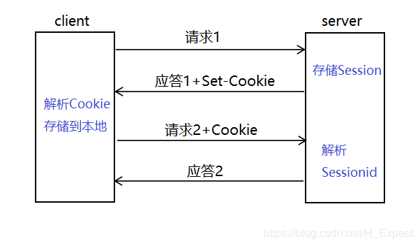

##### **1. Cookie**

Cookie 是客户端的存储空间，由浏览器来维持。具体来说 **cookie 机制采用的是在客户端保持状态的方案**。

Cookie，有时也用其复数形式Cookies，指某些网站为了辨别用户身份、进行 session 跟踪而储存在用户本地终端上的数据（通常经过加密）。

Cookie 可以翻译为“小甜品，小饼干” ，Cookie 在网络系统中几乎无处不在，当我们浏览以前访问过的网站时，网页中可能会出现 ：你好 XXX，这会让我们感觉很亲切，就好像吃了一个小甜品一样。

**Cookie 的实现过程：**

Cookie 会根据从服务器端发送的响应报文内的一个叫做 Set-Cookie 的首部字段信息，通知客户端保存 Cookie，当下次客户端再往该服务器发送请求时，客户端会自动在请求报文中加入 Cookie 值后发送出去。

也就是 **Cookie 是服务器生成的，但是发送给客户端，并且由客户端来保存**。每次请求加上 Cookie就行了。服务器端发现客户端发送过来的 Cookie 后，会去检查究竟是从哪一个客户端发来的连接请求，然后对比服务器上的记录，最后得到之前的状态信息。

##### 2. Session

Session，中文经常翻译为会话，其本来的含义是指有始有终的一系列动作/消息，比如打电话是从拿起电话拨号到挂断电话这中间的一系列过程可以称之为一个 Session。然而当 Session 一词与网络协议相关联时，它又往往隐含了“面向连接”或“保持状态”这样两个含义。 

Session 是另一种记录客户状态的机制，不同的是 Cookie 保存在客户端浏览器中，而 Session 保存在服务器上。

客户端浏览器访问服务器的时候，服务器把客户端信息以某种形式记录在服务器上，这就是 Session。客户端浏览器再次访问时，只需要从该 Session 中查找该客户的状态就可以了。

虽然 Session 保存在服务器，对客户端是透明的，它的正常运行仍然需要客户端浏览器的支持。这是因为 Session 需要使用Cookie 作为识别标志。HTTP协议是无状态的，Session 不能依据HTTP连接来判断是否为同一客户，因此服务器向客户端浏览器发送一个名为 JSESSIONID 的 Cookie，它的值为该 Session 的 id（即放在HTTP响应报文头部信息里的Set-Cookie）。Session依据该 Cookie 来识别是否为同一用户。

#### 3. Cookie 和 Session 的区别

（1）Cookie 数据存放在客户的浏览器上，Session 数据放在服务器上；

（2）Cookie 不是很安全，别人可以分析存放在本地的COOKIE并进行COOKIE欺骗，考虑到安全应当使用 Session ；

（3）Session 会在一定时间内保存在服务器上。当访问增多，会比较占用你服务器的性能。考虑到减轻服务器性能方面，应当使用COOKIE；

（4）单个Cookie 在客户端的限制是3K，就是说一个站点在客户端存放的COOKIE不能超过3K；

#### 4. 总结

如果说 Cookie 机制是通过检查客户身上的“通行证”来确定客户身份的话，那么Session机制就是通过检查服务器上的“客户明细表”来确认客户身份。Session 相当于程序在服务器上建立的一份客户档案，客户来访的时候只需要查询客户档案表就可以了。

Cookie 和 Session 的方案虽然分别属于客户端和服务端，但是服务端的 Session 的实现对客户端的 Cookie 有依赖关系的，上面我讲到**服务端执行 Session 机制时候会生成 Session 的 id 值，这个 id 值会发送给客户端，客户端每次请求都会把这个 id 值放到 HTTP 请求的头部发送给服务端，而这个 id 值在客户端会保存下来，保存的容器就是 Cookie**，因此当我们完全禁掉浏览器的Cookie的时候，服务端的Session也会不能正常使用。

问：客户端浏览器将 Cookie 功能禁用，或者不支持 Cookie 怎么办？

一般这种情况下，会使用一种叫做 **URL 重写**的技术来进行会话跟踪，即每次HTTP交互，URL后面都会被附加上一个诸如 sid=xxxxx 这样的参数，服务端据此来识别用户。

**Cookie 和 Session 应用场景**：

（1）登录网站，今输入用户名密码登录了，第二天再打开很多情况下就直接打开了。这个时候用到的一个机制就是cookie。

（2）session一个场景是购物车，添加了商品之后客户端处可以知道添加了哪些商品，而服务器端如何判别呢，所以也需要存储一些信息就用到了session。


### HTTP2.0

#### 前言

HTTP2.0大幅度的提高了web性能，在HTTP1.1完全语义兼容的基础上，进一步减少了网络的延迟。实现低延迟高吞吐量。对于前端开发者而言，减少了优化工作。本文将重点围绕以下几点新特性的作用、工作过程以及如何更出色的完成了优化工作来介绍HTTP2.0

- 二进制分帧
- 首部压缩
- 多路复用
- 请求优先级
- 服务器推送

#### 一. 介绍

HTTP/2是HTTP协议自1999年HTTP1.1发布后的首个更新，主要基于SPDY协议。

##### 1.1 什么是SPDY协议

SPDY是Speedy的昵音，意为“更快”。它是Google开发的基于TCP协议的应用层协议。目标是优化HTTP协议的性能，通过压缩、多路复用和优先级等技术，缩短网页的加载时间并提高安全性。SPDY协议的核心思想是尽量减少TCP连接数。SPDY并不是一种用于替代HTTP的协议，而是对HTTP协议的增强。

##### 1.2 HTTP1.X的缺点

任何事物的更新都是为了弥补或修复上个版本的某些问题，那么我们来看看HTTP1.x都有哪些缺点以至于我们要使用HTTP2.0。

HTTP1.x有以下几个主要缺点：

1. HTTP/1.0一次只允许在一个TCP连接上发起一个请求，HTTP/1.1使用的流水线技术也只能部分处理请求并发，仍然会存在队列头阻塞问题，因此客户端在需要发起多次请求时，通常会采用建立多连接来减少延迟。
2. 单向请求，只能由客户端发起。
3. 请求报文与响应报文首部信息冗余量大。
4. 数据未压缩，导致数据的传输量大

我们可以通过一个链接来对比一下HTTP2.0到底比HTTP1.x快了多少。[链接地址](HTTPs://HTTP2.akamai.com/demo)

#### 二. 二进制分帧

在不改变HTTP1.x的语义、方法、状态码、URL以及首部字段的情况下，HTTP2.0是怎样突破HTTP1.1的性能限制，改进传输性能，实现低延迟高吞吐量的呢？关键之一就是在应用层（HTTP）和传输层（TCP）之间增加一个二进制分帧层。

在整理二进制分帧及其作用的时候我们先来铺垫一点关于帧的知识：

- 帧：HTTP2.0通信的最小单位，所有帧都共享一个8字节的首部，其中包含帧的长度、类型、标志、还有一个保留位，并且至少有标识出当前帧所属的流的标识符，帧承载着特定类型的数据，如HTTP首部、负荷、等等。
- 消息：比帧大的通讯单位，是指逻辑上的HTTP消息，比如请求、响应等。由一个或多个帧组成
- 流：比消息大的通讯单位。是TCP连接中的一个虚拟通道，可以承载双向的消息。每个流都有一个唯一的整数标识符

HTTP2.0中所有加强性能的核心是二进制传输，在HTTP1.x中，我们是通过文本的方式传输数据。基于文本的方式传输数据存在很多缺陷，文本的表现形式有多样性，因此要做到健壮性考虑的场景必然有很多，但是二进制则不同，只有0和1的组合，因此选择了二进制传输，实现方便且健壮。
在HTTP2.0中引入了新的编码机制，所有传输的数据都会被分割，并采用二进制格式编码。


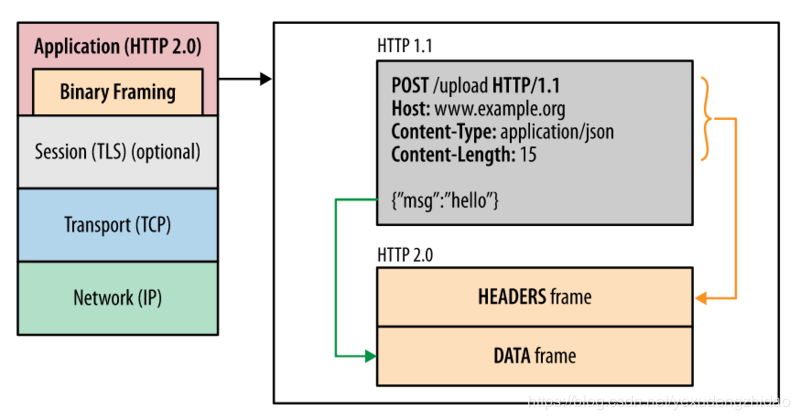

为了保证HTTP不受影响，那就需要在应用层（HTTP2.0）和传输层（TCP or UDP）之间增加一个二进制分帧层。`在二进制分帧层上，HTTP2.0会将所有传输的信息分为更小的消息和帧，并采用二进制格式编码，其中HTTP1.x的首部信息会被封装到Headers帧，而Request Body则封装到Data帧。`

#### 三. 首部压缩

HTTP1.1并不支持HTTP首部压缩，为此SPDY和HTTP2.0出现了。SPDY是用的是DEFLATE算法，而HTTP2.0则使用了专门为首部压缩设计的HPACK算法。

HTTP每次通讯（请求或响应）都会携带首部信息用于描述资源属性。

在HTTP1.0中，我们使用文本的形式传输header，在header中携带cookie的话，每次都需要重复传输几百到几千的字节，这着实是一笔不小的开销。

在HTTP2.0中，我们使用了HPACK（HTTP2头部压缩算法）压缩格式对传输的header进行编码，减少了header的大小。并在两端维护了索引表，用于记录出现过的header，后面在传输过程中就可以传输已经记录过的header的键名，对端收到数据后就可以通过键名找到对应的值。

#### 四. 多路复用

在HTTP1.x中，我们经常会使用到雪碧图、使用多个域名等方式来进行优化，都是因为浏览器限制了同一个域名下的请求数量，当页面需要请求很多资源的时候，队头阻塞（Head of line blocking）会导致在达到最大请求时，资源需要等待其他资源请求完成后才能继续发送。

HTTP2.0中,基于二进制分帧层，HTTP2.0可以在共享TCP连接的基础上同时发送请求和响应。HTTP消息被分解为独立的帧，而不破坏消息本身的语义，交错发出去，在另一端根据流标识符和首部将他们重新组装起来。 通过该技术，可以避免HTTP旧版本的队头阻塞问题，极大提高传输性能。

#### 五. 请求优先级

把HTTP消息分为很多独立帧之后，就可以通过优化这些帧的交错和传输顺序进一步优化性能。

#### 六. 服务器推送

HTTP2.0新增的一个强大的新功能，就是服务器可以对一个客户端请求发送多个响应。服务器向客户端推送资源无需客户端明确的请求。

服务端根据客户端的请求，提前返回多个响应，推送额外的资源给客户端。如下图，客户端请求stream 1(/page.html)。服务端在返回stream 1的消息的同时推送了stream 2(/script.js)和stream 4(/style.css)

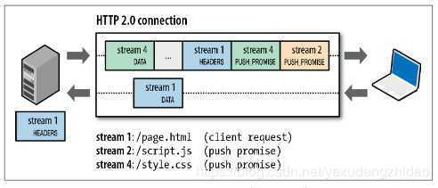

服务端推送是一种在客户端请求之前发送数据的机制。在HTTP2.0中，服务器可以对一个客户端的请求发送多个响应。如果一个请求是由你的主页发送的，服务器可能会响应主页内容、logo以及样式表，因为他知道客户端会用到这些东西。这样不但减轻了数据传送冗余步骤，也加快了页面响应的速度，提高了用户体验。

推送的缺点：所有推送的资源都必须遵守同源策略。换句话说，服务器不能随便将第三方资源推送给客户端，而必须是经过双方的确认才行。


### HTTPS 建立连接过程

### HTTPS 传输数据是否对称加密

### 网页加载时如何重定向

### 长连接短连接区别，应用场景

**首先介绍下短链接和长连接的区别：**
**短连接**
连接->传输数据->关闭连接 
比如HTTP是无状态的的短链接，浏览器和服务器每进行一次HTTP操作，就建立一次连接，但任务结束就中断连接。 
具体就是   浏览器client发起并建立TCP连接 -> client发送HTTPRequest报文 -> server接收到报文->server handle并发送HTTPResponse报文给前端,发送完毕之后立即调用socket.close方法
->client接收response报文->client最终会收到server端断开TCP连接的信号->client 端断开TCP连接，具体就是调用close方法。也可以这样说：短连接是指SOCKET连接后，发送接收完数据后马上断开连接。 
 因为连接后接收了数据就断开了，所以每次数据接受处理不会有联系。 这也是HTTP协议无状态的原因之一。

**长连接**
连接->传输数据->保持连接 -> 传输数据-> ...........->直到一方关闭连接，多是客户端关闭连接。 
长连接指建立SOCKET连接后不管是否使用都保持连接，但安全性较差。 **HTTP在短链接和长连接上的选择：**HTTP是无状态的 ，也就是说，浏览器和服务器每进行一次HTTP操作，就建立一次连接，但任务结束就中断连接。如果客户端浏览器访问的某个HTML或其他类型的 Web页中包含有其他的Web资源，如JavaScript文件、图像文件、CSS文件等；当浏览器每遇到这样一个Web资源，就会建立一个HTTP会话 HTTP1.1和HTTP1.0相比较而言，最大的区别就是增加了持久连接支持(貌似最新的HTTP1.1 可以显示的指定 keep-alive),但还是无状态的，或者说是不可以信任的。 
如果浏览器或者服务器在其头信息加入了这行代码 Connection:keep-alive 
TCP连接在发送后将仍然保持打开状态，于是，浏览器可以继续通过相同的连接发送请求。保持连接节省了为每个请求建立新连接所需的时间，还节约了带宽。 
实现长连接要客户端和服务端都支持长连接。**什么时候用长连接，短连接？**
 长连接多用于操作频繁，点对点的通讯，而且连接数不能太多情况，。每个TCP连接都需要三步握手，这需要时间，如果每个操作都是先连接，再操作的话那么处理速度会降低很多，所以每个操作完后都不断开，次处理时直接发送数据包就OK了，不用建立TCP连接。例如：数据库的连接用长连接， 如果用短连接频繁的通信会造成socket错误，而且频繁的socket 创建也是对资源的浪费。 而像WEB网站的HTTP服务一般都用短链接，因为长连接对于服务端来说会耗费一定的资源，而像WEB网站这么频繁的成千上万甚至上亿客户端的连接用短连接会更省一些资源，如果用长连接，而且同时有成千上万的用户，如果每个用户都占用一个连接的话，那可想而知吧。所以并发量大，但每个用户无需频繁操作情况下需用短连好。 总之，长连接和短连接的选择要视情况而定。 具体网络中的应用的话：
`HTTP 1.0一般就指短连接，smtp,pop3,telnet这种就可以认为是长连接。一般的网络游戏应用都是长连接`


- **什么是长连接和短连接**


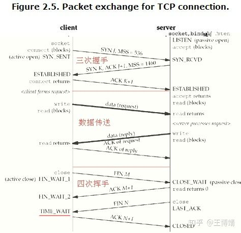

- **三次握手和四次挥手**

TCP区别于UDP最重要的特点是TCP必须建立在可靠的连接之上，连接的建立和释放就是握手和挥手的过程。

三次握手为连接的建立过程，握手失败则连接建立失败。

四次挥手为连接的**完整**释放过程，也会发生某个消息丢失或者超时的情况，有一方主动发送**FIN**消息即表示连接即将释放。

*注：SYN、ACK、FIN消息具有哪些含义，以及连接的状态，请参考《TCP/IP详解 卷1》第18章。*

- **长连接**

长连接，也叫持久连接，在TCP层握手成功后，**不立即**断开连接，并在此连接的基础上进行多次消息（包括心跳）交互，直至连接的任意一方（客户端OR服务端）主动断开连接，此过程称为一次完整的长连接。HTTP 1.1相对于1.0最重要的新特性就是引入了长连接。

- **短连接**

短连接，顾名思义，与长连接的区别就是，客户端收到服务端的响应后，**立刻发送FIN消息**，主动释放连接。也有服务端主动断连的情况，凡是在一次消息交互（发请求-收响应）之后立刻断开连接的情况都称为短连接。

*注：短连接是建立在TCP协议上的，有完整的握手挥手流程，区别于UDP协议。*

- **如何快速区分当前连接使用的是长连接还是短连接**

1、**凡是在一次完整的消息交互（发请求-收响应）之后，立刻断开连接（有一方发送FIN消息）的情况都称为短连接**；

2、长连接的一个明显特征是会有心跳消息（也有没有心跳的情况），且一般心跳间隔都在30S或者1MIN左右，用wireshark抓包可以看到有规律的心跳消息交互（可能会存在毫秒级别的误差）。

- **什么时候用长连接，短连接？**

1、需要**频繁交互**的场景使用长连接，如即时通信工具（微信/QQ，QQ也有UDP），相反则使用短连接，比如普通的web网站，只有当浏览器发起请求时才会建立连接，服务器返回相应后，连接立即断开。

2、**维持长连接**会有一定的系统开销，用户量少不容易看出系统瓶颈，一旦用户量上去了，就很有可能把服务器资源（内存/CPU/网卡）耗尽，所以使用需谨慎。


###  HTTP 和 HTTPS 的区别

### 基础知识问了 HTTPS 建立连接的过程，这里问的比较细节，其实你只要明白，tls协议的几轮交换是为了验证双方身份这个要点即可。我细节不太记得，就举了ssl的验证过程。

### 设计一个主动断开连接机制，要求断开20s内无数据响应的长链接


## TCP/IP 协议

### TCP 拥塞控制

**在某段时间，若对网络中某一资源的需求超过了该资源所能提供的可用部分，网络的性能就要变坏**。这种情况就叫拥塞。**拥塞控制就是为了防止过多的数据注入到网络中，这样就可以使网络中的路由器或链路不致过载**。拥塞控制所要做的都有一个前提，就是网络能够承受现有的网络负荷。**拥塞控制是一个全局性的过程，涉及到所有的主机，所有的路由器，以及与降低网络传输性能有关的所有因素**。相反，**流量控制往往是点对点通信量的控制，是个端到端的问题**。流量控制所要做到的就是抑制发送端发送数据的速率，以便使接收端来得及接收。

为了进行拥塞控制，TCP 发送方要维持一个 **拥塞窗口(cwnd)** 的状态变量。**拥塞控制窗口的大小取决于网络的拥塞程度，并且动态变化**。发送方让自己的发送窗口取为拥塞窗口和接收方的接受窗口中较小的一个。

TCP的拥塞控制采用了四种算法，即 **慢开始** 、 **拥塞避免** 、**快重传** 和 **快恢复**。在网络层也可以使路由器采用适当的**分组丢弃策略**（如主动队列管理 AQM），以减少网络拥塞的发生。

- **慢开始：** 慢开始算法的思路是当主机开始发送数据时，如果立即把大量数据字节注入到网络，那么可能会引起网络阻塞，因为现在还不知道网络的符合情况。经验表明，较好的方法是先探测一下，即由小到大逐渐增大发送窗口，也就是由小到大逐渐增大拥塞窗口数值。cwnd初始值为1，每经过一个传播轮次，cwnd加倍。
- **拥塞避免：** 拥塞避免算法的思路是让拥塞窗口cwnd缓慢增大，即每经过一个往返时间RTT就把发送放的cwnd加1.
- **快重传与快恢复：** 在 TCP/IP 中，**快速重传和恢复（fast retransmit and recovery，FRR）是一种拥塞控制算法，它能快速恢复丢失的数据包**。没有 FRR，如果数据包丢失了，TCP 将会使用定时器来要求传输暂停。在暂停的这段时间内，没有新的或复制的数据包被发送。**有了 FRR，如果接收机接收到一个不按顺序的数据段，它会立即给发送机发送一个重复确认。如果发送机接收到三个重复确认，它会假定确认件指出的数据段丢失了，并立即重传这些丢失的数据段**。有了 FRR，就不会因为重传时要求的暂停被耽误。当有单独的数据包丢失时，快速重传和恢复（FRR）能最有效地工作。当有多个数据信息包在某一段很短的时间内丢失时，它则不能很有效地工作。

详解：

在某段时间，若**对网络中某一资源的需求超过了该资源所能提供的可用部分，网络性能就要变坏**，这种情况就叫做**网络拥塞**。

在计算机网络中数位链路容量（即带宽）、交换结点中的缓存和处理机等，都是网络的资源。

若**出现拥塞而不进行控制**，整个网络的**吞吐量将随输入负荷的增大而下降**。
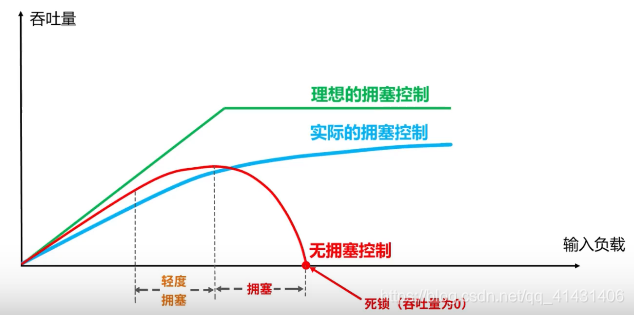
当输入的负载到达一定程度 吞吐量不会增加，即一部分网络资源会丢失掉，网络的吞吐量维持在其所能控制的最大值，转发节点的缓存不够大这造成分组的丢失是拥塞的征兆。

**TCP的四种拥塞控制算法**
1.慢开始
2.拥塞控制
3.快重传
4.快恢复

**假定**：

1.数据是单方向传送，而另一个方向只传送确认

2.接收方总是有足够大的缓存空间，因而发送发发送窗口的大小由网络的拥塞程度来决定

3.以TCP报文段的个数为讨论问题的单位，而不是以字节为单位
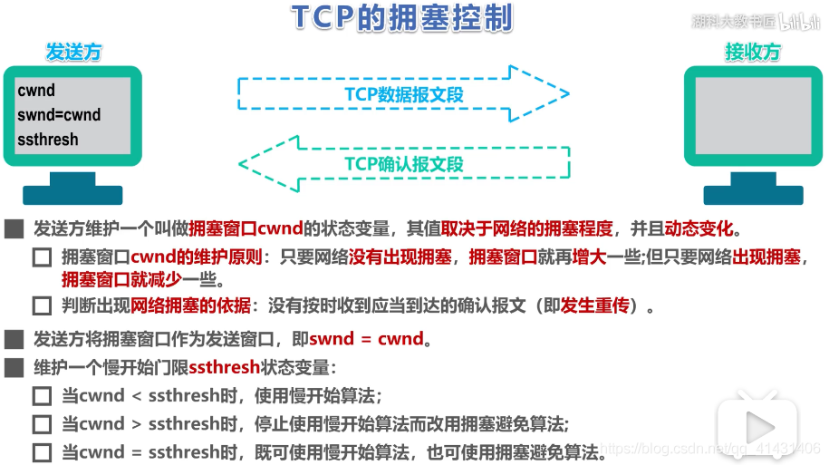

**示例如下：**
传输轮次：发送方给接收方发送数据报文段后，接收方给发送方发回相应的确认报文段，一个传输轮次所经历的时间就是往返时间RTT(RTT并非是恒定的数值），使用传输轮次是为了强调，把拥塞窗口cwnd所允许发送的报文段都连续发送出去，并收到了对已发送的最后一个报文段的确认，拥塞窗口cwnd会随着网络拥塞程度以及所使用的拥塞控制算法动态变化。

在TCP双方建立逻辑链接关系时， 拥塞窗口cwnd的值被设置为1，还需设置慢开始门限ssthresh,在执行慢开始算法时，发送方每收到一个对新报文段的确认时，就把拥塞窗口cwnd的值加一，然后开始下一轮的传输，当拥塞窗口cwnd增长到慢开始门限值时，就使用拥塞避免算法。

**慢开始：**
假设当前发送方拥塞窗口cwnd的值为1，而发送窗口swnd等于拥塞窗口cwnd，因此发送方当前只能发送一个数据报文段（拥塞窗口cwnd的值是几，就能发送几个数据报文段），接收方收到该数据报文段后，给发送方回复一个确认报文段，发送方收到该确认报文后，将拥塞窗口的值变为2，

> 发送方此时可以连续发送两个数据报文段，接收方收到该数据报文段后，给发送方一次发回2个确认报文段，发送方收到这两个确认报文后，将拥塞窗口的值加2变为4，发送方此时可连续发送4个报文段，接收方收到4个报文段后，给发送方依次回复4个确认报文，发送方收到确认报文后，将拥塞窗口加4，置为8，发送方此时可以连续发送8个数据报文段，接收方收到该8个数据报文段后，给发送方一次发回8个确认报文段，发送方收到这8个确认报文后，将拥塞窗口的值加8变为16，

当前的拥塞窗口cwnd的值已经等于慢开始门限值，之后改用拥塞避免算法。

**拥塞避免：**
也就是每个传输轮次，拥塞窗口cwnd只能线性加一，而不是像慢开始算法时，每个传输轮次，拥塞窗口cwnd按指数增长。同理，16+1……直至到达24，假设24个报文段在传输过程中丢失4个，接收方只收到20个报文段，给发送方依次回复20个确认报文段，一段时间后，丢失的4个报文段的重传计时器超时了，发送发判断可能出现拥塞，更改cwnd和ssthresh.并重新开始慢开始算法，如图所示：
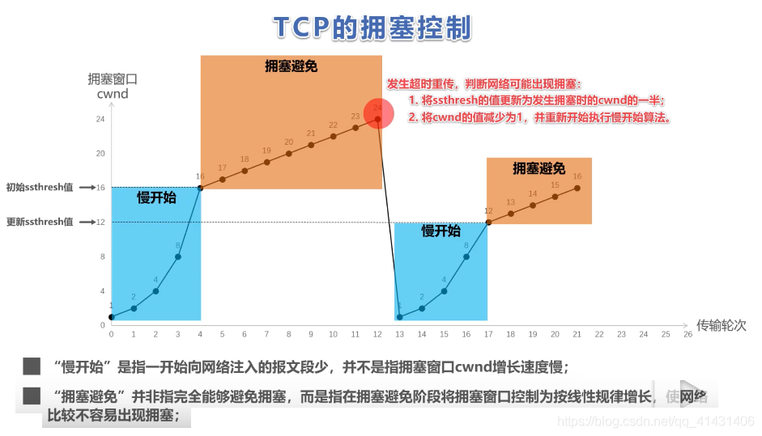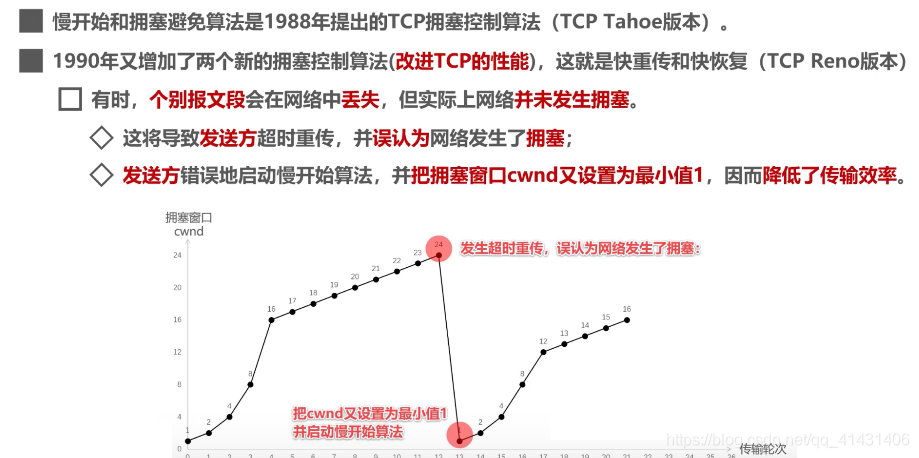
**快速重传：**
发送方发送1号数据报文段，接收方收到1号报文段后给发送方发回对1号报文段的确认，在1号报文段到达发送方之前，发送方还可以将发送窗口内的2号数据报文段发送出去，接收方收到2号报文段后给发送方发回对2号报文段的确认，在2号报文段到达发送方之前，发送方还可以将发送窗口内的3号数据报文段发送出去，

> 假设该报文丢失，发送方便不会发送针对该报文的确认报文给发送方，发送方还可以将发送窗口内的4号数据报文段发送出去，接收方收到后，发现这不是按序到达的报文段，因此给发送方发送针对2号报文段的重复确认，表明我现在希望收到的是3号报文段，但是我没有收到3号报文段，而收到了未按序到达的报文段，发送方还可以将发送窗口中的5号报文段发送出去,接收方收到后，发现这不是按序到达的报文段，因此给发送方发送针对2号报文段的重复确认，表明我现在希望收到的是3号报文段，但是我没有收到3号报文段，而收到了未按序到达的报文段,，发送方还可以将发送窗口内的最后一个数据段即6号数据报文段发送出去，接收方收到后，发现这不是按序到达的报文段，因此给发送方发送针对2号报文段的重复确认，表明我现在希望收到的是3号报文段，但是我没有收到3号报文段，而收到了未按序到达的报文段，

此时，发送方收到了累计3个连续的针对2号报文段的重复确认，立即重传3号报文段，接收方收到后，给发送方发回针对6号报文的确认，表明，序号到6为至的报文都收到了，这样就不会造成发送方对3号报文的超时重传，而是提早收到了重传。
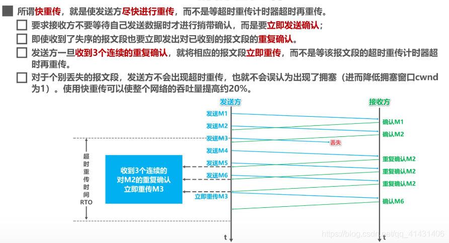
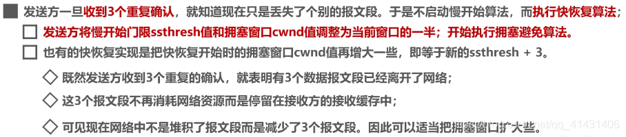


### TCP 如何保证可靠性，解释一下滑动窗口

我们从一台机器向另外一台机器发送数据的时候，数据并不是一口气也不可能一口气传输给接收方。这个并不难理解，因为网络环境特别的复杂，有些地方快有些地方慢。所以，操作系统把这些数据写成连续的数据包，并且以一定的速率发给对方。一定的速率怎么理解呢？网络环境就像复杂的交通链路。就好比一个沙漏，中间可能有一个地方流量非常的小，这个最小的口径决定了网络传输的真正速度。我们要考虑到带宽缓冲区等因素，如果一下子发送所有的数据只会加大网络压力，造成丢包重试，轻则传输更慢，重则网络崩溃。因为TCP是顺序发送的，操作系统将这些数据包一批一批的发送给对方，就像一个窗口，不停地往后移动，所以，我们称之为TCP滑动窗口协议。

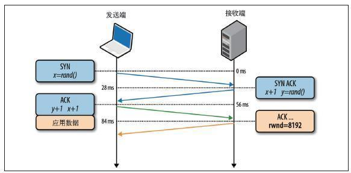

在TCP中，窗口的大小是在TCP三次握手后协定的，并且窗口的大小并不是固定的，而是会随着网络的情况进行调整。这个也不难理解，原本你女朋友在家独享10M的宽带，你下班要上虎牙看网址荣耀直播，两个人就要共享这个宽带。TCP为了更好的传输效率，就会调整窗口的大小。


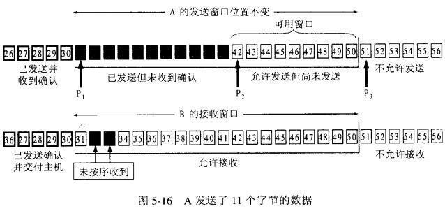

我们通过一个图来解释下滑动窗口的工作流程，对于发送端来说，即将要发送的数据包排成一个队列，对于发送者来说，数据包总共分成四类。分别是在窗口前的，已经发送给接收方，并且收到了接收方的答复，我们称之为已发送。在窗口中的，有两种状态，一个是已经发送给接收方，但是接收方还没确认送达，我们称之为已发送未确认，另外一个是可以发送了，但是还没有发送，我们称之为允许发送未发送。最后的是在窗口外面的，我们称之为不可发送，除非窗口滑到此处，否则不会进行发送。


就这样，一旦前面的数据已经得到服务端确认了，这个窗口就会慢慢地往后滑，如下图所示，P1,P2两个数据包被确认之后，窗口就往后移动，后面新的数据包就由不可发送待发送变成了可发送状态了。

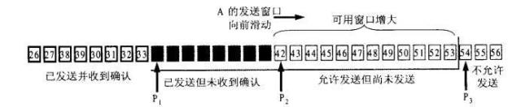

TCP的滑动窗口协议有什么意义呢？首先当然是可靠性，滑动窗口只有在队列前部的被确认之后，才会往后移动，保证数据包被接收方确认并接收。其次是传输效率，假如没有窗口，服务端是杂乱无章地进行发包，因为TCP的队首效应，如果有前面的包没有发送成功，就会不停的重试，反而造成更差的传输效率。最后是稳定性，TCP的滑动窗口大小，是整个复杂网络商榷的结果，会进行动态调整，可以尽量地避免网络拥塞，更加稳定。


###  TCP网络协议理解

### TCP与UDP的区别

### TCP为什么是三次握手，4次挥手

### 描述一个浏览器从请求发起到服务端接收到请求的过程（基于TCP/ip模型）

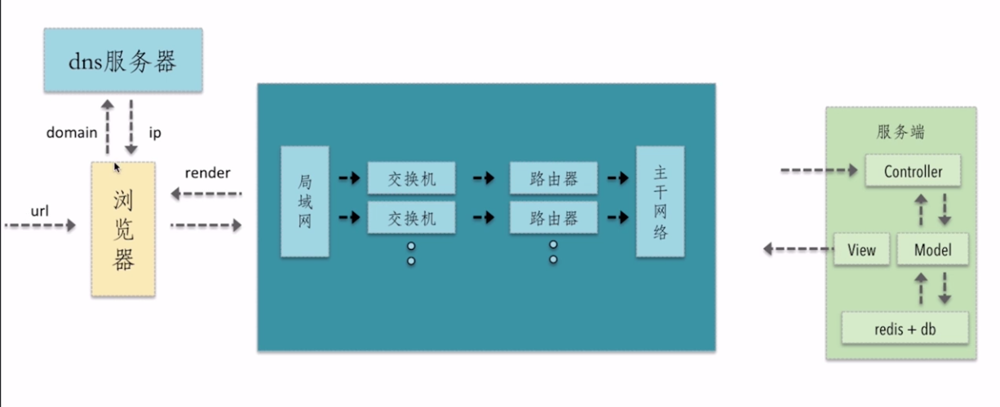

用户首先在浏览器输入请求的url地址，浏览器内部的核心代码会将这个url进行拆分解析，最终将domain发送到DNS服务器上，DNS服务器会根据domain去查询相关对于的ip地址，从而将IP地址返回给浏览器，浏览器持有ip地址后就会知道这个请求是要发送到哪个地方（哪个服务器上），然后跟随协议，将ip地址打在协议中，并且请求的相关的参数都会在协议中携带，最终发送到网络中去

然后经过我们自己的局域网——交换机——路由器——主干网络——最终到达服务端

服务端是有个MVC架构的请求会首先进入到Controller中进行相关的逻辑处理和请求的分发——调用Model层（负责和数据进行交互）数据交互的过程中Model会去读取redis和数据库里面的数据——获取到数据之后叫渲染好的页面通过View层返回给网络

这时候一个HTTP请求的Response又从服务端返回到浏览器，浏览器做一个render的过程（就是根据请求回来的html以及这个html所关联的css，js去进行渲染的过程，那么渲染的过程中浏览器会根据html去形成相关的dom树以及对应的css树，然后对dom树和css树进行整合，最终知道某个dom节点知道需要什么样的样式，从而进行样式的渲染）样式渲染完成之后，浏览器会进一步去执行下面的js脚本，执行动态的页面的能力，从而最终的页面就在浏览器中展现出来了


### TCP三次握手，四次挥手，为什么不是两次握手和3次挥手？少一次的话分别会出现什么问题？


## IO多路复用

IO 多路复用是5种I/O模型中的第3种，对各种模型讲个故事，描述下区别：

故事情节为：老李去买火车票，三天后买到一张退票。参演人员（老李，黄牛，售票员，快递员），往返车站耗费1小时。

1.**阻塞I/O模型**

老李去火车站买票，排队三天买到一张退票。

耗费：在车站吃喝拉撒睡 3天，其他事一件没干。

2.**非阻塞I/O模型**

老李去火车站买票，隔12小时去火车站问有没有退票，三天后买到一张票。

耗费：往返车站6次，路上6小时，其他时间做了好多事。

3.**I/O复用模型**

[①.select/poll](HTTPs://link.zhihu.com/?target=HTTP%3A//1.select/poll)

老李去火车站买票，委托黄牛，然后每隔6小时电话黄牛询问，黄牛三天内买到票，然后老李去火车站交钱领票。 

耗费：往返车站2次，路上2小时，黄牛手续费100元，打电话17次

②.epoll

老李去火车站买票，委托黄牛，黄牛买到后即通知老李去领，然后老李去火车站交钱领票。 

耗费：往返车站2次，路上2小时，黄牛手续费100元，无需打电话

4.**信号驱动I/O模型**

老李去火车站买票，给售票员留下电话，有票后，售票员电话通知老李，然后老李去火车站交钱领票。  

耗费：往返车站2次，路上2小时，免黄牛费100元，无需打电话

5.**异步I/O模型**

老李去火车站买票，给售票员留下电话，有票后，售票员电话通知老李并快递送票上门。 

耗费：往返车站1次，路上1小时，免黄牛费100元，无需打电话

1同2的区别是：自己轮询

2同3的区别是：委托黄牛

3同4的区别是：电话代替黄牛

4同5的区别是：电话通知是自取还是送票上门


### **高性能IO模型浅析**

服务器端编程经常需要构造高性能的IO模型，常见的IO模型有四种：

（1）同步阻塞IO（Blocking IO）：即传统的IO模型。

（2）同步非阻塞IO（Non-blocking IO）：默认创建的socket都是阻塞的，非阻塞IO要求socket被设置为NONBLOCK。注意这里所说的NIO并非Java的NIO（New IO）库。

（3）IO多路复用（IO Multiplexing）：即经典的Reactor设计模式，有时也称为异步阻塞IO，Java中的Selector和Linux中的epoll都是这种模型。

（4）异步IO（Asynchronous IO）：即经典的Proactor设计模式，也称为异步非阻塞IO。

 

**同步和异步**的概念描述的是用户线程与内核的交互方式：同步是指用户线程发起IO请求后需要等待或者轮询内核IO操作完成后才能继续执行；而异步是指用户线程发起IO请求后仍继续执行，当内核IO操作完成后会通知用户线程，或者调用用户线程注册的回调函数。

**阻塞和非阻塞**的概念描述的是用户线程调用内核IO操作的方式：阻塞是指IO操作需要彻底完成后才返回到用户空间；而非阻塞是指IO操作被调用后立即返回给用户一个状态值，无需等到IO操作彻底完成。

另外，Richard Stevens 在《Unix 网络编程》卷1中提到的基于信号驱动的IO（Signal Driven IO）模型，由于该模型并不常用，本文不作涉及。接下来，我们详细分析四种常见的IO模型的实现原理。为了方便描述，我们统一使用IO的读操作作为示例。

 

**一、同步阻塞IO**

同步阻塞IO模型是最简单的IO模型，用户线程在内核进行IO操作时被阻塞。


图1 同步阻塞IO

如图1所示，用户线程通过系统调用read发起IO读操作，由用户空间转到内核空间。内核等到数据包到达后，然后将接收的数据拷贝到用户空间，完成read操作。

用户线程使用同步阻塞IO模型的伪代码描述为：

```java
{
    read(socket, buffer);
    process(buffer);
}
```


即用户需要等待read将socket中的数据读取到buffer后，才继续处理接收的数据。整个IO请求的过程中，用户线程是被阻塞的，这导致用户在发起IO请求时，不能做任何事情，对CPU的资源利用率不够。

 

**二、同步非阻塞IO**

同步非阻塞IO是在同步阻塞IO的基础上，将socket设置为NONBLOCK。这样做用户线程可以在发起IO请求后可以立即返回。


图2 同步非阻塞IO

如图2所示，由于socket是非阻塞的方式，因此用户线程发起IO请求时立即返回。但并未读取到任何数据，用户线程需要不断地发起IO请求，直到数据到达后，才真正读取到数据，继续执行。

用户线程使用同步非阻塞IO模型的伪代码描述为：

```java
{
    while(read(socket, buffer) != SUCCESS);
    process(buffer);
}
```


即用户需要不断地调用read，尝试读取socket中的数据，直到读取成功后，才继续处理接收的数据。整个IO请求的过程中，虽然用户线程每次发起IO请求后可以立即返回，但是为了等到数据，仍需要不断地轮询、重复请求，消耗了大量的CPU的资源。一般很少直接使用这种模型，而是在其他IO模型中使用非阻塞IO这一特性。

 

**三、IO多路复用**

IO多路复用模型是建立在内核提供的多路分离函数select基础之上的，使用select函数可以避免同步非阻塞IO模型中轮询等待的问题。


图3 多路分离函数select

如图3所示，用户首先将需要进行IO操作的socket添加到select中，然后阻塞等待select系统调用返回。当数据到达时，socket被激活，select函数返回。用户线程正式发起read请求，读取数据并继续执行。

从流程上来看，使用select函数进行IO请求和同步阻塞模型没有太大的区别，甚至还多了添加监视socket，以及调用select函数的额外操作，效率更差。但是，使用select以后最大的优势是用户可以在一个线程内同时处理多个socket的IO请求。用户可以注册多个socket，然后不断地调用select读取被激活的socket，即可达到在**同一个线程内同时处理多个IO请求的目的**。而在同步阻塞模型中，必须通过多线程的方式才能达到这个目的。

用户线程使用select函数的伪代码描述为：

```java
{
    select(socket);
    while(1) {
        sockets = select();
        for(socket in sockets) {
            if(can_read(socket)) {
                read(socket, buffer);
                process(buffer);
            }
        }
    }
}
```


其中while循环前将socket添加到select监视中，然后在while内一直调用select获取被激活的socket，一旦socket可读，便调用read函数将socket中的数据读取出来。

 

然而，使用select函数的优点并不仅限于此。虽然上述方式允许单线程内处理多个IO请求，但是每个IO请求的过程还是阻塞的（在select函数上阻塞），平均时间甚至比同步阻塞IO模型还要长。如果用户线程只注册自己感兴趣的socket或者IO请求，然后去做自己的事情，等到数据到来时再进行处理，则可以提高CPU的利用率。

IO多路复用模型使用了Reactor设计模式实现了这一机制。

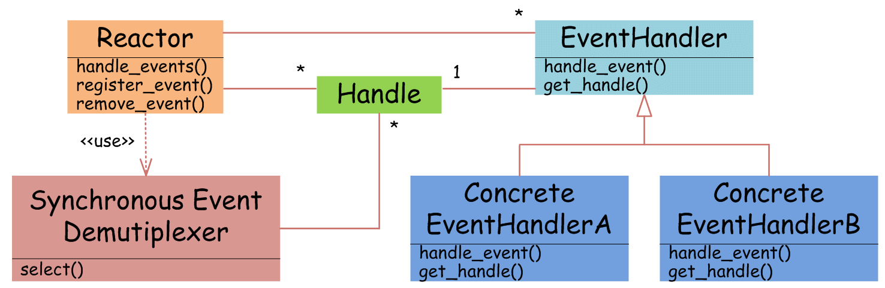

图4 Reactor设计模式

如图4所示，EventHandler抽象类表示IO事件处理器，它拥有IO文件句柄Handle（通过get_handle获取），以及对Handle的操作handle_event（读/写等）。继承于EventHandler的子类可以对事件处理器的行为进行定制。Reactor类用于管理EventHandler（注册、删除等），并使用handle_events实现事件循环，不断调用同步事件多路分离器（一般是内核）的多路分离函数select，只要某个文件句柄被激活（可读/写等），select就返回（阻塞），handle_events就会调用与文件句柄关联的事件处理器的handle_event进行相关操作。


图5 IO多路复用

如图5所示，通过Reactor的方式，可以将用户线程轮询IO操作状态的工作统一交给handle_events事件循环进行处理。用户线程注册事件处理器之后可以继续执行做其他的工作（异步），而Reactor线程负责调用内核的select函数检查socket状态。当有socket被激活时，则通知相应的用户线程（或执行用户线程的回调函数），执行handle_event进行数据读取、处理的工作。由于select函数是阻塞的，因此多路IO复用模型也被称为异步阻塞IO模型。注意，这里的所说的阻塞是指select函数执行时线程被阻塞，而不是指socket。一般在使用IO多路复用模型时，socket都是设置为NONBLOCK的，不过这并不会产生影响，因为用户发起IO请求时，数据已经到达了，用户线程一定不会被阻塞。

用户线程使用IO多路复用模型的伪代码描述为：

```java
void UserEventHandler::handle_event() {
    if(can_read(socket)) {
        read(socket, buffer);
        process(buffer);
    }
}
{
    Reactor.register(new UserEventHandler(socket));
}
```


用户需要重写EventHandler的handle_event函数进行读取数据、处理数据的工作，用户线程只需要将自己的EventHandler注册到Reactor即可。Reactor中handle_events事件循环的伪代码大致如下。

```java
Reactor::handle_events() {
    while(1) {
        sockets = select();
        for(socket in sockets) {
            get_event_handler(socket).handle_event();
        }
    }
}
```


事件循环不断地调用select获取被激活的socket，然后根据获取socket对应的EventHandler，执行器handle_event函数即可。

IO多路复用是最常使用的IO模型，但是其异步程度还不够“彻底”，因为它使用了会阻塞线程的select系统调用。因此IO多路复用只能称为异步阻塞IO，而非真正的异步IO。

 

**四、异步IO**

“真正”的异步IO需要操作系统更强的支持。在IO多路复用模型中，事件循环将文件句柄的状态事件通知给用户线程，由用户线程自行读取数据、处理数据。而在异步IO模型中，当用户线程收到通知时，数据已经被内核读取完毕，并放在了用户线程指定的缓冲区内，内核在IO完成后通知用户线程直接使用即可。

异步IO模型使用了Proactor设计模式实现了这一机制。


图6 Proactor设计模式

如图6，Proactor模式和Reactor模式在结构上比较相似，不过在用户（Client）使用方式上差别较大。Reactor模式中，用户线程通过向Reactor对象注册感兴趣的事件监听，然后事件触发时调用事件处理函数。而Proactor模式中，用户线程将AsynchronousOperation（读/写等）、Proactor以及操作完成时的CompletionHandler注册到AsynchronousOperationProcessor。AsynchronousOperationProcessor使用Facade模式提供了一组异步操作API（读/写等）供用户使用，当用户线程调用异步API后，便继续执行自己的任务。AsynchronousOperationProcessor 会开启独立的内核线程执行异步操作，实现真正的异步。当异步IO操作完成时，AsynchronousOperationProcessor将用户线程与AsynchronousOperation一起注册的Proactor和CompletionHandler取出，然后将CompletionHandler与IO操作的结果数据一起转发给Proactor，Proactor负责回调每一个异步操作的事件完成处理函数handle_event。虽然Proactor模式中每个异步操作都可以绑定一个Proactor对象，但是一般在操作系统中，Proactor被实现为Singleton模式，以便于集中化分发操作完成事件。


图7 异步IO

如图7所示，异步IO模型中，用户线程直接使用内核提供的异步IO API发起read请求，且发起后立即返回，继续执行用户线程代码。不过此时用户线程已经将调用的AsynchronousOperation和CompletionHandler注册到内核，然后操作系统开启独立的内核线程去处理IO操作。当read请求的数据到达时，由内核负责读取socket中的数据，并写入用户指定的缓冲区中。最后内核将read的数据和用户线程注册的CompletionHandler分发给内部Proactor，Proactor将IO完成的信息通知给用户线程（一般通过调用用户线程注册的完成事件处理函数），完成异步IO。

用户线程使用异步IO模型的伪代码描述为：

```java
void UserCompletionHandler::handle_event(buffer) {
    process(buffer);
}
{
    aio_read(socket, new UserCompletionHandler);
}
```


用户需要重写CompletionHandler的handle_event函数进行处理数据的工作，参数buffer表示Proactor已经准备好的数据，用户线程直接调用内核提供的异步IO API，并将重写的CompletionHandler注册即可。

相比于IO多路复用模型，异步IO并不十分常用，不少高性能并发服务程序使用IO多路复用模型+多线程任务处理的架构基本可以满足需求。况且目前操作系统对异步IO的支持并非特别完善，更多的是采用IO多路复用模型模拟异步IO的方式（IO事件触发时不直接通知用户线程，而是将数据读写完毕后放到用户指定的缓冲区中）。Java7之后已经支持了异步IO，感兴趣的读者可以尝试使用。

### epoll和select


## Nginx

### nginx如何处理连接

### nginx如何做性能优化

### apache和nginx区别


## netstat状态下有多少种状态，其中TIME-WAIT是什么意思

### **网络**

涉及到网络层面的问题一般都比较复杂，场景多，定位难，成为了大多数开发的噩梦，应该是最复杂的了。这里会举一些例子，并从TCP层、应用层以及工具的使用等方面进行阐述。

#### **超时**

超时错误大部分处在应用层面，所以这块着重理解概念。超时大体可以分为连接超时和读写超时，某些使用连接池的客户端框架还会存在获取连接超时和空闲连接清理超时。

- 读写超时。readTimeout/writeTimeout，有些框架叫做so_timeout或者socketTimeout，均指的是数据读写超时。注意这边的超时大部分是指逻辑上的超时。soa的超时指的也是读超时。读写超时一般都只针对客户端设置。
- 连接超时。connectionTimeout，客户端通常指与服务端建立连接的最大时间。服务端这边connectionTimeout就有些五花八门了，jetty中表示空闲连接清理时间，tomcat则表示连接维持的最大时间。
- 其他。包括连接获取超时connectionAcquireTimeout和空闲连接清理超时idleConnectionTimeout。多用于使用连接池或队列的客户端或服务端框架。

我们在设置各种超时时间中，需要确认的是尽量保持客户端的超时小于服务端的超时，以保证连接正常结束。

在实际开发中，我们关心最多的应该是接口的读写超时了。

如何设置合理的接口超时是一个问题。如果接口超时设置的过长，那么有可能会过多地占用服务端的TCP连接。而如果接口设置的过短，那么接口超时就会非常频繁。

服务端接口明明rt降低，但客户端仍然一直超时又是另一个问题。这个问题其实很简单，客户端到服务端的链路包括网络传输、排队以及服务处理等，每一个环节都可能是耗时的原因。

#### **TCP队列溢出**

TCP队列溢出是个相对底层的错误，它可能会造成超时、rst等更表层的错误。因此错误也更隐蔽，所以我们单独说一说。

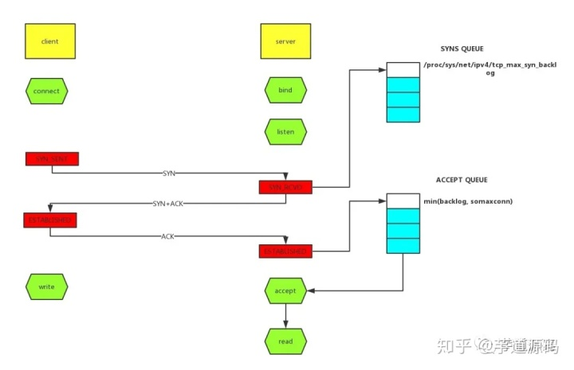

如上图所示，这里有两个队列：syns queue(半连接队列）、accept queue（全连接队列）。三次握手，在server收到client的syn后，把消息放到syns queue，回复syn+ack给client，server收到client的ack，如果这时accept queue没满，那就从syns queue拿出暂存的信息放入accept queue中，否则按TCP_abort_on_overflow指示的执行。

TCP_abort_on_overflow 0表示如果三次握手第三步的时候accept queue满了那么server扔掉client发过来的ack。TCP_abort_on_overflow 1则表示第三步的时候如果全连接队列满了，server发送一个rst包给client，表示废掉这个握手过程和这个连接，意味着日志里可能会有很多`connection reset / connection reset by peer`。

那么在实际开发中，我们怎么能快速定位到TCP队列溢出呢？

**netstat命令，执行netstat -s | egrep "listen|LISTEN"**


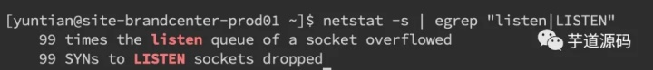

如上图所示，overflowed表示全连接队列溢出的次数，sockets dropped表示半连接队列溢出的次数。

**ss命令，执行ss -lnt**


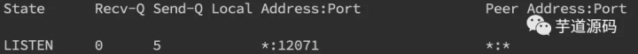

上面看到Send-Q 表示第三列的listen端口上的全连接队列最大为5，第一列Recv-Q为全连接队列当前使用了多少。

接着我们看看怎么设置全连接、半连接队列大小吧：

全连接队列的大小取决于min(backlog, somaxconn)。backlog是在socket创建的时候传入的，somaxconn是一个os级别的系统参数。而半连接队列的大小取决于max(64, /proc/sys/net/ipv4/TCP_max_syn_backlog)。

在日常开发中，我们往往使用servlet容器作为服务端，所以我们有时候也需要关注容器的连接队列大小。在tomcat中backlog叫做`acceptCount`，在jetty里面则是`acceptQueueSize`。

#### **RST异常**

RST包表示连接重置，用于关闭一些无用的连接，通常表示异常关闭，区别于四次挥手。

在实际开发中，我们往往会看到`connection reset / connection reset by peer`错误，这种情况就是RST包导致的。

**端口不存在**

如果像不存在的端口发出建立连接SYN请求，那么服务端发现自己并没有这个端口则会直接返回一个RST报文，用于中断连接。

**主动代替FIN终止连接**

一般来说，正常的连接关闭都是需要通过FIN报文实现，然而我们也可以用RST报文来代替FIN，表示直接终止连接。实际开发中，可设置SO_LINGER数值来控制，这种往往是故意的，来跳过TIMED_WAIT，提供交互效率，不闲就慎用。

**客户端或服务端有一边发生了异常，该方向对端发送RST以告知关闭连接**

我们上面讲的TCP队列溢出发送RST包其实也是属于这一种。这种往往是由于某些原因，一方无法再能正常处理请求连接了(比如程序崩了，队列满了)，从而告知另一方关闭连接。

**接收到的TCP报文不在已知的TCP连接内**

比如，一方机器由于网络实在太差TCP报文失踪了，另一方关闭了该连接，然后过了许久收到了之前失踪的TCP报文，但由于对应的TCP连接已不存在，那么会直接发一个RST包以便开启新的连接。

**一方长期未收到另一方的确认报文，在一定时间或重传次数后发出RST报文**

这种大多也和网络环境相关了，网络环境差可能会导致更多的RST报文。

之前说过RST报文多会导致程序报错，在一个已关闭的连接上读操作会报`connection reset`，而在一个已关闭的连接上写操作则会报`connection reset by peer`。通常我们可能还会看到`broken pipe`错误，这是管道层面的错误，表示对已关闭的管道进行读写，往往是在收到RST，报出`connection reset`错后继续读写数据报的错，这个在glibc源码注释中也有介绍。

我们在排查故障时候怎么确定有RST包的存在呢？当然是使用TCPdump命令进行抓包，并使用wireshark进行简单分析了。`TCPdump -i en0 TCP -w xxx.cap`，en0表示监听的网卡。


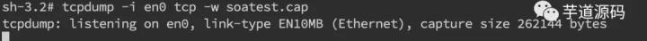

接下来我们通过wireshark打开抓到的包，可能就能看到如下图所示，红色的就表示RST包了。

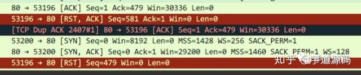

#### **TIME_WAIT和CLOSE_WAIT**

TIME_WAIT和CLOSE_WAIT是啥意思相信大家都知道。在线上时，我们可以直接用命令`netstat -n | awk '/^TCP/ {++S[$NF]} END {for(a in S) print a, S[a]}'`来查看time-wait和close_wait的数量

用ss命令会更快`ss -ant | awk '{++S[$1]} END {for(a in S) print a, S[a]}'`


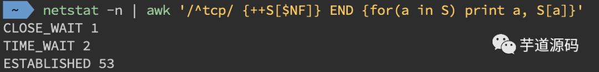

##### **TIME_WAIT**

time_wait的存在一是为了丢失的数据包被后面连接复用，二是为了在2MSL的时间范围内正常关闭连接。它的存在其实会大大减少RST包的出现。

过多的time_wait在短连接频繁的场景比较容易出现。这种情况可以在服务端做一些内核参数调优:

```text
#表示开启重用。允许将TIME-WAIT sockets重新用于新的TCP连接，默认为0，表示关闭
net.ipv4.TCP_tw_reuse = 1
#表示开启TCP连接中TIME-WAIT sockets的快速回收，默认为0，表示关闭
net.ipv4.TCP_tw_recycle = 1
```

当然我们不要忘记在NAT环境下因为时间戳错乱导致数据包被拒绝的坑了，另外的办法就是改小`TCP_max_tw_buckets`，超过这个数的time_wait都会被干掉，不过这也会导致报`time wait bucket table overflow`的错。

##### **CLOSE_WAIT**

close_wait往往都是因为应用程序写的有问题，没有在ACK后再次发起FIN报文。close_wait出现的概率甚至比time_wait要更高，后果也更严重。往往是由于某个地方阻塞住了，没有正常关闭连接，从而渐渐地消耗完所有的线程。

想要定位这类问题，最好是通过jstack来分析线程堆栈来排查问题，具体可参考上述章节。这里仅举一个例子。

开发同学说应用上线后CLOSE_WAIT就一直增多，直到挂掉为止，jstack后找到比较可疑的堆栈是大部分线程都卡在了`countdownlatch.await`方法，找开发同学了解后得知使用了多线程但是确没有catch异常，修改后发现异常仅仅是最简单的升级sdk后常出现的`class not found`。


## 进程和线程

### 进程和线程

的区别做个简单的比喻：进程=火车，线程=车厢

- 线程在进程下行进（单纯的车厢无法运行）
- 一个进程可以包含多个线程（一辆火车可以有多个车厢）
- 不同进程间数据很难共享（一辆火车上的乘客很难换到另外一辆火车，比如站点换乘）
- 同一进程下不同线程间数据很易共享（A车厢换到B车厢很容易）
- 进程要比线程消耗更多的计算机资源（采用多列火车相比多个车厢更耗资源）
- 进程间不会相互影响，一个线程挂掉将导致整个进程挂掉（一列火车不会影响到另外一列火车，但是如果一列火车上中间的一节车厢着火了，将影响到所有车厢）
- 进程可以拓展到多机，进程最多适合多核（不同火车可以开在多个轨道上，同一火车的车厢不能在行进的不同的轨道上）
- 进程使用的内存地址可以上锁，即一个线程使用某些共享内存时，其他线程必须等它结束，才能使用这一块内存。（比如火车上的洗手间）－"互斥锁"
- 进程使用的内存地址可以限定使用量（比如火车上的餐厅，最多只允许多少人进入，如果满了需要在门口等，等有人出来了才能进去）－“信号量”

首先来一句概括的总论：**进程和线程都是一个时间段的描述，是CPU工作时间段的描述。**

**下面细说背景**：
CPU+RAM+各种资源（比如显卡，光驱，键盘，GPS, 等等外设）构成我们的电脑，但是电脑的运行，实际就是CPU和相关寄存器以及RAM之间的事情。

**一个最最基础的事实**：CPU太快，太快，太快了，寄存器仅仅能够追的上他的脚步，RAM和别的挂在各总线上的设备完全是望其项背。那当多个任务要执行的时候怎么办呢？轮流着来?或者谁优先级高谁来？不管怎么样的策略，一句话就是在CPU看来就是轮流着来。

**一个必须知道的事实**：执行一段程序代码，实现一个功能的过程介绍 ，当得到CPU的时候，相关的资源必须也已经就位，就是显卡啊，GPS啊什么的必须就位，然后CPU开始执行。这里除了CPU以外所有的就构成了这个程序的执行环境，也就是我们所定义的程序上下文。当这个程序执行完了，或者分配给他的CPU执行时间用完了，那它就要被切换出去，等待下一次CPU的临幸。在被切换出去的最后一步工作就是保存程序上下文，因为这个是下次他被CPU临幸的运行环境，必须保存。

**串联起来的事实**：前面讲过在CPU看来所有的任务都是一个一个的轮流执行的，具体的轮流方法就是：***先加载程序A的上下文，然后开始执行A，保存程序A的上下文，调入下一个要执行的程序B的程序上下文，然后开始执行B,保存程序B的上下文\*。。。\*。\***

**========= 重要的东西出现了========**
进程和线程*就是这样的背景出来的**，两个名词不过是对应的CPU时间段的描述，名词就是这样的功能。***

- **进程就是包换上下文切换的程序执行时间总和** = **CPU加载上下文+CPU执行+CPU保存上下文**

***线程是什么呢？\***
进程的颗粒度太大，每次都要有上下的调入，保存，调出。如果我们把进程比喻为一个运行在电脑上的软件，那么一个软件的执行不可能是一条逻辑执行的，必定有多个分支和多个程序段，就好比要实现程序A，实际分成 a，b，c等多个块组合而成。那么这里具体的执行就可能变成：

程序A得到CPU =》CPU加载上下文，开始执行程序A的a小段，然后执行A的b小段，然后再执行A的c小段，最后CPU保存A的上下文。

这里a，b，c的执行是共享了A的上下文，CPU在执行的时候没有进行上下文切换的。这**里的a，b，c就是线程，也就是说线程是共享了进程的上下文环境，的更为细小的CPU时间段。**

**到此全文结束，再一个总结：**

**进程和线程都是一个时间段的描述，是CPU工作时间段的描述，不过是颗粒大小不同。**


### 多进程、多线程、多进程单线程、单进程多线程，场景举例，怎么选择？

### 高并发和多线程关系与区别

#### 一、什么是高并发

​    高并发（High Concurrency）是一种系统运行过程中遇到的一种“短时间内遇到大量操作请求”的情况，主要发生在web系统集中大量访问收到大量请求（例如：12306的抢票情况；天猫双十一活动）。该情况的发生会导致系统在这段时间内执行大量操作，例如对资源的请求、数据库的操作等。

#### 二、高并发的处理指标

高并发相关常用的一些指标有：响应时间、吞吐量、每秒查询率QPS、并发用户数

**1、响应时间（Response Time）**

响应时间：系统对请求做出响应的时间。例如系统处理一个HTTP请求需要200ms，这个200ms就是系统的响应时间

**2、吞吐量（Throughput）**

吞吐量：单位时间内处理的请求数量。

**3、每秒查询率QPS（Query Per Second）**

QPS：每秒响应请求数。在互联网领域，这个指标和吞吐量区分的没有这么明显。

**4、并发用户数**

并发用户数：同时承载正常使用系统功能的用户数量。例如一个即时通讯系统，同时在线量一定程度上代表了系统的并发用户数。

#### 三、高并发和多线程的关系和区别

“高并发和多线程”总是被一起提起，给人感觉两者好像相等，实则 高并发 ≠ 多线程

**3.1、多线程**

​        多线程是 Java 的特性，因为现在CPU都是多核多线程的，可以同时执行几个任务，为了提高 JVM 的执行效率，Java 提供了这种多线程的机制，以增强数据处理效率。***多线程对应的是 CPU，高并发对应的是访问请求，***可以用单线程处理所有访问请求，也可以用多线程同时处理访问请求。

​        在过去单CPU时代，单任务在一个时间点只能执行单一程序。之后发展到多任务阶段，计算机能在同一时间点并行执行多任务或多进程。虽然并不是真正意义上的“同一时间点”，而是多个任务或进程共享一个 CPU，并交由操作系统来完成多任务间对 CPU 的运行切换，以使得每个任务都有机会获得一定的时间片运行。

​        后来发展到多线程技术，使得在一个程序内部能拥有多个线程并行执行。一个线程的执行可以被认为是一个 CPU 在执行该程序。当一个程序运行在多线程下，就好像有多个 CPU 在同时执行该程序。

​        总之，多线程即可以这么理解：多线程是处理高并发的一种编程方法，即并发需要用多线程实现。

**3.2、高并发**

​        高并发不是 JAVA 的专有的东西，是语言无关的广义的，为提供更好互联网服务而提出的概念。

​        典型的场景，例如：12306抢火车票，天猫双十一秒杀活动等。该情况的发生会导致系统在这段时间内执行大量操作，例如对资源的请求，数据库的操作等。如果高并发处理不好，不仅仅降低了用户的体验度(请求响应时间过长)，同时可能导致系统宕机，严重的甚至导致OOM异常，系统停止工作等。

​        如果要想系统能够适应高并发状态，则需要从各个方面进行系统优化，包括，**硬件、网络、系统架构、开发语言的选取、数据结构的运用、算法优化、数据库优化**等……而多线程只是其中解决方法之一。

### 四、多线程并发技术

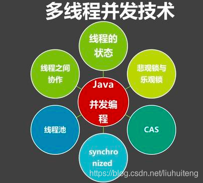

Java 多线程编程将会涉及到如下技术点：

**1、并发编程三要素**
     

原子性：即一个不可再被分割的颗粒。在 Java 中原子性指的是一个或多个操作要么全部执行成功要么全部执行失败。
     

有序性：程序执行的顺序按照代码的先后顺序执行。（处理器可能会对指令进行重排序）
     

可见性：当多个线程访问同一个变量时，如果其中一个线程对其作了修改，其他线程能立即获取到最新的值。

**2、 线程的五大状态**
     

创建状态：当用 new 操作符创建一个线程的时候
    

就绪状态：调用 start 方法，处于就绪状态的线程并不一定马上就会执行 run 方法，还需要等待 CPU 的调度
     

运行状态：CPU 开始调度线程，并开始执行 run 方法
     

阻塞状态：线程的执行过程中由于一些原因进入阻塞状态比如：调用 sleep 方法、尝试去得到一个锁等等
     

死亡状态：run 方法执行完 或者 执行过程中遇到了一个异常

**3、悲观锁与乐观锁**
    

悲观锁：每次操作都会加锁，会造成线程阻塞。
     

乐观锁：每次操作不加锁而是假设没有冲突而去完成某项操作，如果因为冲突失败就重试，直到成功为止，不会造成线程阻塞。

**4、线程之间的协作**
    

线程间的协作有：wait/notify/notifyAll等

**5、synchronized 关键字**
     

synchronized 是 Java 中的关键字，是一种同步锁。

它修饰的对象有以下几种：
     

1）修饰一个代码块：被修饰的代码块称为同步语句块，其作用的范围是大括号{}括起来的代码，作用的对象是调用这个代码块的对象
    

 2）修饰一个方法：被修饰的方法称为同步方法，其作用的范围是整个方法，作用的对象是调用这个方法的对象
    

 3）修改一个静态的方法：其作用的范围是整个静态方法，作用的对象是这个类的所有对象
     

4）修改一个类：其作用的范围是 synchronized 后面括号括起来的部分，作用主的对象是这个类的所有对象。

**6、CAS**
     

CAS 全称是 Compare And Swap，即比较替换，是实现并发应用到的一种技术。

操作包含三个操作数—内存位置（V）、预期原值（A）和新值(B)。 

如果内存位置的值与预期原值相匹配，那么处理器会自动将该位置值更新为新值 。否则，处理器不做任何操作。
    

 CAS 存在三大问题：

ABA问题，循环时间长开销大，以及只能保证一个共享变量的原子操作。

循环时间长开销很大：

CAS 通常是配合无限循环一起使用的，我们可以看到 getAndAddInt 方法执行时，如果 CAS 失败，会一直进行尝试。如果 CAS 长时间一直不成功，可能会给 CPU 带来很大的开销。

只能保证一个变量的原子操作：

当对一个变量执行操作时，我们可以使用循环 CAS 的方式来保证原子操作，但是对多个变量操作时，CAS 目前无法直接保证操作的原子性。但是我们可以通过以下两种办法来解决：

1）使用互斥锁来保证原子性；

2）将多个变量封装成对象，通过 AtomicReference 来保证原子性。 

什么是ABA问题？ABA问题怎么解决？

CAS 的使用流程通常如下：

1）首先从地址 V 读取值 A；

2）根据 A 计算目标值 B；

3）通过 CAS 以原子的方式将地址 V 中的值从 A 修改为 B。

但是在第 1 步中读取的值是 A，并且在第 3 步修改成功了，我们就能说它的值在第 1 步和第 3 步之间没有被其他线程改变过了吗？

如果在这段期间它的值曾经被改成了 B，后来又被改回为 A，那 CAS 操作就会误认为它从来没有被改变过。这个漏洞称为 CAS 操作的 ABA 问题。Java 并发包为了解决这个问题，提供了一个带有标记的原子引用类“AtomicStampedReference”，它可以通过控制变量值的版本来保证 CAS 的正确性。因此，在使用 CAS 前要考虑清楚 ABA 问题是否会影响程序并发的正确性，如果需要解决 ABA 问题，改用传统的互斥同步可能会比原子类更高效。


**7、线程池**

​        如果我们使用线程的时候就去创建一个线程，虽然简单，但是存在很大的问题。如果并发的线程数量很多，并且每个线程都是执行一个时间很短的任务就结束了，这样频繁创建线程就会大大降低系统的效率，因为频繁创建线程和销毁线程需要时间。线程池通过复用可以大大减少线程频繁创建与销毁带来的性能上的损耗。

### 五、高并发技术解决方案

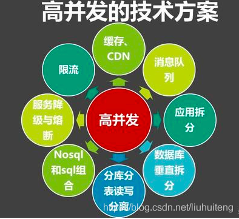

**5.1、怎样提高系统的高并发能力？**

1、静态资源结合CDN来解决图片文件等访问

2、分布式缓存：redis、memcached等。

3、消息队列中间件：activeMQ等，解决大量消息的异步处理能力。

4、应用拆分:一个工程被拆分为多个工程部署，利用 dubbo 解决多工程之间的通信。

5、数据库垂直拆分和水平拆分(分库分表)等。

6、数据库读写分离，解决大数据的查询问题。

7、利用 nosql ，例如 mongoDB 配合 MySQL 组合使用。

8、建立大数据访问情况下的服务降级以及限流机制等。


### 线程安全什么意思？如何线程安全？

​        一个程序在运行起来的时候会转换成进程，通常含有多个线程。

　　通常情况下，一个进程中的比较耗时的操作（如长循环、文件上传下载、网络资源获取等），往往会采用多线程来解决。

比如显示生活中，银行取钱问题、火车票多个售票窗口的问题，通常会涉及到并发的问题，从而需要多线程的技术。

　　当进程中有多个并发线程进入一个重要数据的代码块时，在修改数据的过程中，很有可能引发线程安全问题，从而造成数据异常。例如，正常逻辑下，同一个编号的火车票只能售出一次，却由于线程安全问题而被多次售出，从而引起实际业务异常。

 

现在我们就以售票问题来演示线程安全的问题

1， 在不对多线程数据进行保护的情况下会引发的状况

```java
public class ThreadUnSecurity {
    
    static int tickets = 10;
    
    class SellTickets implements Runnable{

        @Override
        public void run() {
            // 未加同步时产生脏数据
            while(tickets > 0) {
                
                System.out.println(Thread.currentThread().getName()+"--->售出第：  "+tickets+" 票");
                tickets--;
                
                try {
                    Thread.sleep(1000);
                } catch (InterruptedException e) {
                    e.printStackTrace();
                }
                
            }
            
            if (tickets <= 0) {
                
                System.out.println(Thread.currentThread().getName()+"--->售票结束！");
            }
        }
    }
    
    
    public static void main(String[] args) {
        
        
        SellTickets sell = new ThreadUnSecurity().new SellTickets();
        
        Thread thread1 = new Thread(sell, "1号窗口");
        Thread thread2 = new Thread(sell, "2号窗口");
        Thread thread3 = new Thread(sell, "3号窗口");
        Thread thread4 = new Thread(sell, "4号窗口");
        
        thread1.start();
        thread2.start();
        thread3.start();
        thread4.start();
        
    }
}
```

上述代码运行的结果：

```bash
1号窗口--->售出第：  10 票
3号窗口--->售出第：  10 票
2号窗口--->售出第：  10 票
4号窗口--->售出第：  10 票
2号窗口--->售出第：  6 票
1号窗口--->售出第：  5 票
3号窗口--->售出第：  4 票
4号窗口--->售出第：  3 票
2号窗口--->售出第：  2 票
4号窗口--->售出第：  1 票
1号窗口--->售出第：  1 票
3号窗口--->售票结束！
2号窗口--->售票结束！
1号窗口--->售票结束！
4号窗口--->售票结束！
```

我们可以看出同一张票在不对票数进行保护时会出现同一张票会被出售多次！由于线程调度中的不确定性，读者在演示上述代码时，出现的运行结果会有不同。


第一种实现线程安全的方式

- 同步代码块

```java
package com.bpan.spring.beans.thread;

import com.sun.org.apache.regexp.internal.recompile;

public class ThreadSynchronizedSecurity {
    
    static int tickets = 10;
    
    class SellTickets implements Runnable{

        @Override
        public void run() {
            // 同步代码块
            while(tickets > 0) {
                
                synchronized (this) {
                    
//                    System.out.println(this.getClass().getName().toString());
                    
                    if (tickets <= 0) {
                        
                        return;
                    }
                    
                    System.out.println(Thread.currentThread().getName()+"--->售出第：  "+tickets+" 票");
                    tickets--;
                    
                    try {
                        Thread.sleep(100);
                    } catch (InterruptedException e) {
                        e.printStackTrace();
                    }
                }
                
                if (tickets <= 0) {
                    
                    System.out.println(Thread.currentThread().getName()+"--->售票结束！");
                }
            }
        }
    }
    
    
    public static void main(String[] args) {
        
        
        SellTickets sell = new ThreadSynchronizedSecurity().new SellTickets();
        
        Thread thread1 = new Thread(sell, "1号窗口");
        Thread thread2 = new Thread(sell, "2号窗口");
        Thread thread3 = new Thread(sell, "3号窗口");
        Thread thread4 = new Thread(sell, "4号窗口");
        
        thread1.start();
        thread2.start();
        thread3.start();
        thread4.start();
        
        
    }
    

}
```

输出结果读者可自行调试，不会出现同一张票被出售多次的情况。

 

第二种 方式

- 同步方法

```java
package com.bpan.spring.beans.thread;

public class ThreadSynchroniazedMethodSecurity {
    
    
    static int tickets = 10;
    
    class SellTickets implements Runnable {

        @Override
        public void run() {
            //同步方法
            while (tickets > 0) {
                
                synMethod();
                
                try {
                    Thread.sleep(100);
                } catch (InterruptedException e) {
                    // TODO Auto-generated catch block
                    e.printStackTrace();
                }
                
                if (tickets<=0) {
                    
                    System.out.println(Thread.currentThread().getName()+"--->售票结束");
                }
                
            }
            
            
        }
        
        synchronized void synMethod() {
            
            synchronized (this) {
                if (tickets <=0) {
                    
                    return;
                }
                
                System.out.println(Thread.currentThread().getName()+"---->售出第 "+tickets+" 票 ");
                tickets-- ;
            }
            
        }
        
    }
    public static void main(String[] args) {
        
        
        SellTickets sell = new ThreadSynchroniazedMethodSecurity().new SellTickets();
        
        Thread thread1 = new Thread(sell, "1号窗口");
        Thread thread2 = new Thread(sell, "2号窗口");
        Thread thread3 = new Thread(sell, "3号窗口");
        Thread thread4 = new Thread(sell, "4号窗口");
        
        thread1.start();
        thread2.start();
        thread3.start();
        thread4.start();
        
    }

}
```

读者可自行调试上述代码的运行结果


第三种 方式

　　Lock 锁机制， 通过创建 Lock 对象，采用 lock() 加锁，unlock() 解锁，来保护指定的代码块

```java
package com.bpan.spring.beans.thread;

import java.util.concurrent.locks.Lock;
import java.util.concurrent.locks.ReentrantLock;

public class ThreadLockSecurity {
    
    static int tickets = 10;
    
    class SellTickets implements Runnable {
        
        Lock lock = new ReentrantLock();

        @Override
        public void run() {
            // Lock锁机制
            while(tickets > 0) {
                
                try {
                    lock.lock();
                    
                    if (tickets <= 0) {
                        
                        return;
                    }
                        
                    System.out.println(Thread.currentThread().getName()+"--->售出第：  "+tickets+" 票");
                    tickets--;
                } catch (Exception e1) {
                    // TODO Auto-generated catch block
                    e1.printStackTrace();
                }finally {
                    
                    lock.unlock();
                    try {
                        Thread.sleep(100);
                    } catch (InterruptedException e) {
                        e.printStackTrace();
                    }
                }
            }
                
            if (tickets <= 0) {
                
                System.out.println(Thread.currentThread().getName()+"--->售票结束！");
            }
            
        }
    }
    
    
    public static void main(String[] args) {
        
        
        SellTickets sell = new ThreadLockSecurity().new SellTickets();
        
        Thread thread1 = new Thread(sell, "1号窗口");
        Thread thread2 = new Thread(sell, "2号窗口");
        Thread thread3 = new Thread(sell, "3号窗口");
        Thread thread4 = new Thread(sell, "4号窗口");
        
        thread1.start();
        thread2.start();
        thread3.start();
        thread4.start();
        
        
    }
    

}
```

 

　最后总结：

　　由于 synchronized 是在 JVM 层面实现的，因此系统可以监控锁的释放与否；而 ReentrantLock 是使用代码实现的，系统无法自动释放锁，需要在代码中的 finally 子句中显式释放锁 lock.unlock()。

　　另外，在并发量比较小的情况下，使用 synchronized 是个不错的选择；但是在并发量比较高的情况下，其性能下降会很严重，此时 ReentrantLock 是个不错的方案。

 

补充：　　

　　在使用 synchronized 代码块时，可以与 wait()、notify()、nitifyAll() 一起使用，从而进一步实现线程的通信。
其中，wait() 方法会释放占有的对象锁，当前线程进入等待池，释放 CPU，而其他正在等待的线程即可抢占此锁，获得锁的线程即可运行程序；线程的 sleep() 方法则表示，当前线程会休眠一段时间，休眠期间，会暂时释放 CPU，但并不释放对象锁，也就是说，在休眠期间，其他线程依然无法进入被同步保护的代码内部，当前线程休眠结束时，会重新获得 CPU 执行权,从而执行被同步保护的代码。
wait() 和 sleep() 最大的不同在于 wait() 会释放对象锁，而 sleep() 不会释放对象锁。

　　notify()方法会唤醒因为调用对象的wait()而处于等待状态的线程，从而使得该线程有机会获取对象锁。调用notify()后，当前线程并不会立即释放锁，而是继续执行当前代码，直到synchronized中的代码全部执行完毕，才会释放对象锁。JVM会在等待的线程中调度一个线程去获得对象锁，执行代码。

　　需要注意的是，wait()和notify()必须在synchronized代码块中调用。

　　notifyAll()是唤醒所有等待的线程。

 

下面是示例代码，

```java
package com.bpan.spring.beans.thread;

public class ThreadDemo {
    
    static final Object obj = new Object();
    
    //第一个子线程
    static class ThreadA implements Runnable {

        @Override
        public void run() {
            
            
            int count = 10;
            while(count > 0) {
                
                synchronized (ThreadDemo.obj) {
                    
                    System.out.println("A-----"+count);
                    count--;
                    
                    synchronized (ThreadDemo.obj) {
                        
                        //notify()方法会唤醒因为调用对象的wait()而处于等待状态的线程，从而使得该线程有机会获取对象锁。
                        //调用notify()后，当前线程并不会立即释放锁，而是继续执行当前代码，直到synchronized中的代码全部执行完毕，
                        ThreadDemo.obj.notify();
                        
                        try {
                            ThreadDemo.obj.wait();
                        } catch (InterruptedException e) {
                            // TODO Auto-generated catch block
                            e.printStackTrace();
                        }
                    }
                }
            }
            
        }
        
    }
    
    static class ThreadB implements Runnable {
        
        
        @Override
        public void run() {
            
            int count = 10;
            
            while(count > 0) {
                
                synchronized (ThreadDemo.obj) {
                    System.out.println("B-----"+count);
                    count--;
                    
                    synchronized (ThreadDemo.obj) {
                    
                        //notify()方法会唤醒因为调用对象的wait()而处于等待状态的线程，从而使得该线程有机会获取对象锁。
                        //调用notify()后，当前线程并不会立即释放锁，而是继续执行当前代码，直到synchronized中的代码全部执行完毕，
                        ThreadDemo.obj.notify();
                        
                        try {
                            ThreadDemo.obj.wait();
                        } catch (InterruptedException e) {
                            // TODO Auto-generated catch block
                            e.printStackTrace();
                        }
                    }
                    
                }
                
            }
            
        }
        
    }
    
    public static void main(String[] args) {
        
        
        new Thread(new ThreadA()).start();
        new Thread(new ThreadB()).start();
        
    }

}
```


## Socket

### 管道如何使用

### socket建立过程

### 如何高效处理socket

### 无状态session，session和cookie的区别


## RPC

### RPC调用原理

### rpc框架原理


## ~~Raft 协议~~

###  ~~raft协议过程，数据同步及如何选主~~

### ~~raft一致性协议~~


## Dubbo

### dubbo 基本原理


## 加密

###  加密方式 对称 /非对称

非对称加密和对称加密在加密和解密过程、加密解密速度、传输的安全性上都有所不同，具体介绍如下：

1、加密和解密过程不同

对称加密过程和解密过程使用的同一个密钥，加密过程相当于用原文+密钥可以传输出密文，同时解密过程用密文-密钥可以推导出原文。但非对称加密采用了两个密钥，一般使用公钥进行加密，使用私钥进行解密。

2、加密解密速度不同

对称加密解密的速度比较快，适合数据比较长时的使用。非对称加密和解密花费的时间长、速度相对较慢，只适合对少量数据的使用。


3、传输的安全性不同

对称加密的过程中无法确保密钥被安全传递，密文在传输过程中是可能被第三方截获的，如果密码本也被第三方截获，则传输的密码信息将被第三方破获，安全性相对较低。

非对称加密算法中私钥是基于不同的算法生成不同的随机数，私钥通过一定的加密算法推导出公钥，但私钥到公钥的推导过程是单向的，也就是说公钥无法反推导出私钥。所以安全性较高。


# 分布式


# 微服务

**分布式和微服务的区别**

微服务是架构设计方式，分布式是系统部署方式，两者概念不同

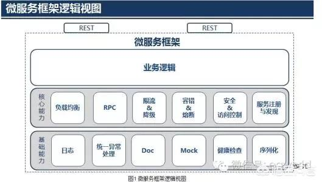
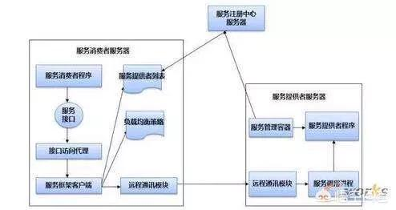
**微服务是啥？**

> 这里不引用书本上的复杂概论了，简单来说微服务就是很小的服务，小到一个服务只对应一个单一的功能，只做一件事。这个服务可以单独部署运行，服务之间可以通过RPC来相互交互，每个微服务都是由独立的小团队开发，测试，部署，上线，负责它的整个生命周期。

**微服务架构又是啥？**

> 在做架构设计的时候，先做逻辑架构，再做物理架构，当你拿到需求后，估算过最大用户量和并发量后，计算单个应用服务器能否满足需求，如果用户量只有几百人的小应用，单体应用就能搞定，即所有应用部署在一个应用服务器里，如果是很大用户量，且某些功能会被频繁访问，或者某些功能计算量很大，建议将应用拆解为多个子系统，各自负责各自功能，这就是微服务架构。

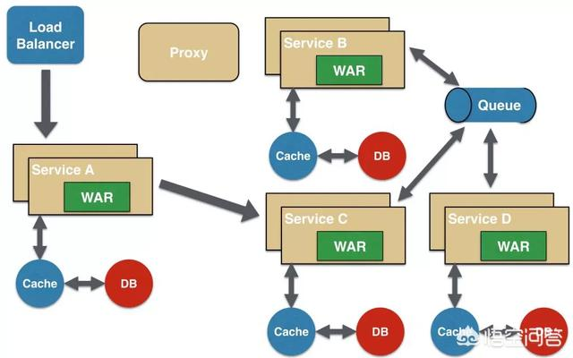

**那么分布式又是啥？**

> 分布式服务顾名思义服务是分散部署在不同的机器上的，一个服务可能负责几个功能，是一种面向SOA架构的，服务之间也是通过rpc来交互或者是webservice来交互的。逻辑架构设计完后就该做物理架构设计，系统应用部署在超过一台服务器或虚拟机上，且各分开部署的部分彼此通过各种通讯协议交互信息，就可算作分布式部署，生产环境下的微服务肯定是分布式部署的，分布式部署的应用不一定是微服务架构的，比如集群部署，它是把相同应用复制到不同服务器上，但是逻辑功能上还是单体应用。

微服务相比分布式服务来说，它的粒度更小，服务之间耦合度更低，由于每个微服务都由独立的小团队负责，因此它敏捷性更高，分布式服务最后都会向微服务架构演化，这是一种趋势， 不过服务微服务化后带来的挑战也是显而易见的，例如服务粒度小，数量大，后期运维将会很难


# 分布式和 Web 相关问题

## ● 说说你对get和post请求，并且说说它们之间的区别？

考察点：HTTP请求

### 参考回答：

①get请求用来从服务器上获得资源，而post是用来向服务器提交数据；

②get将表单中数据按照name=value的形式，添加到action 所指向的URL 后面，并且两者使用"?"连接，而各个变量之间使用"&"连接；post是将表单中的数据放在HTTP协议的请求头或消息体中，传递到action所指向URL；

③get传输的数据要受到URL长度限制（1024字节）；而post可以传输大量的数据，上传文件通常要使用post方式；

④使用get时参数会显示在地址栏上，如果这些数据不是敏感数据，那么可以使用get；对于敏感数据还是应用使用post；

⑤get使用MIME类型application/x-www-form-urlencoded的URL编码（也叫百分号编码）文本的格式传递参数，保证被传送的参数由遵循规范的文本组成，例如一个空格的编码是"%20"。

## ● get和post的区别？

考察点：HTTP请求

### 参考回答：

（1）在客户端， Get 方式在通过 URL 提交数据，数据 在URL中可以看到；POST方式，数据放置在HTML HEADER内提交。

（2）GET方式提交的数据最多只能有1024字节，而POST则没有此限制。

（3）安全性问题。正如在（ 1 ）中提到，使用 Get 的时候，参数会显示在地址栏上，而 Post 不会。所以，如果这些数据是中文数据而且是非敏感数据，那么使用 get ；如果用户输入的数据不是中文字符而且包含敏感数据，那么还是使用 post 为好。

安全的和幂等的。所谓安全的意味着该操作用于获取信息而非修改信息。幂等的意味着对同一 URL 的多个请求应该返回同样的结果。完整的定义并不像看起来那样严格。换句话说， GET 请求一般不应产生副作用。从根本上讲，其目标是当用户打开一个链接时，她可以确信从自身的角度来看没有改变资源。比如，新闻站点的头版不断更新。虽然第二次请求会返回不同的一批新闻，该操作仍然被认为是安全的和幂等的，因为它总是返回当前的新闻。反之亦然。 POST 请求就不那么轻松了。 POST 表示可能改变服务器上的资源的请求。仍然以新闻站点为例，读者对文章的注解应该通过 POST 请求实现，因为在注解提交之后站点已经不同了（比方说文章下面出现一条注解）。

## ● 转发和重定向之间的区别？

考察点：重定向

### 参考回答：

forward是容器中控制权的转向，是服务器请求资源，服务器直接访问目标地址的URL，把那个URL 的响应内容读取过来，然后把这些内容再发给浏览器，浏览器根本不知道服务器发送的内容是从哪儿来的，所以它的地址栏中还是原来的地址。redirect就是服务器端根据逻辑，发送一个状态码，告诉浏览器重新去请求那个地址，因此从浏览器的地址栏中可以看到跳转后的链接地址，很明显redirect无法访问到服务器保护起来资源，但是可以从一个网站redirect到其他网站。forward更加高效，所以在满足需要时尽量使用forward（通过调用RequestDispatcher对象的forward()方法，该对象可以通过ServletRequest对象的getRequestDispatcher()方法获得），并且这样也有助于隐藏实际的链接；在有些情况下，比如需要访问一个其它服务器上的资源，则必须使用重定向（通过HTTPServletResponse对象调用其sendRedirect()方法实现）。


## ● TCP协议的4次挥手。

考察点：TCP协议

### 参考回答：

由于TCP连接是全双工的，因此每个方向都必须单独进行关闭。这个原则是当一方完成它的数据发送任务后就能发送一个FIN来终止这个方向的连接。收到一个 FIN只意味着这一方向上没有数据流动，一个TCP连接在收到一个FIN后仍能发送数据。首先进行关闭的一方将执行主动关闭，而另一方执行被动关闭。

TCP的连接的拆除需要发送四个包，因此称为四次挥手(four-way handshake)。客户端或服务器均可主动发起挥手动作，在socket编程中，任何一方执行close()操作即可产生挥手操作。

（1）客户端A发送一个FIN，用来关闭客户A到服务器B的数据传送。

（2）服务器B收到这个FIN，它发回一个ACK，确认序号为收到的序号加1。和SYN一样，一个FIN将占用一个序号。

（3）服务器B关闭与客户端A的连接，发送一个FIN给客户端A。

（4）客户端A发回ACK报文确认，并将确认序号设置为收到序号加1。


## ● 为什么TCP为什么要建立连接？

考察点：TCP

### 参考回答：

保证可靠传输。

## ● TCP为什么可靠一些

考察点：TCP

### 参考回答：

三次握手，超时重传，滑动窗口，拥塞控制。

## ● 哪种应用场景会使用TCP协议，使用它的意义

考察点：TCP协议

### 参考回答：

当对网络通讯质量有要求的时候，比如：整个数据要准确无误的传递给对方，这往往用于一些要求可靠的应用，比如HTTP、HTTPS、FTP等传输文件的协议，POP、SMTP等邮件传输的协议

## ● TCP的连接和释放过程。

考察点：网络基础

### 参考回答：

三次握手的过程

1）主机A向主机B发送TCP连接请求数据包，其中包含主机A的初始序列号seq(A)=x。（其中报文中同步标志位SYN=1，ACK=0，表示这是一个TCP连接请求数据报文；序号seq=x，表明传输数据时的第一个数据字节的序号是x）；

2）主机B收到请求后，会发回连接确认数据包。（其中确认报文段中，标识位SYN=1，ACK=1，表示这是一个TCP连接响应数据报文，并含主机B的初始序列号seq(B)=y，以及主机B对主机A初始序列号的确认号ack(B)=seq(A)+1=x+1）

3）第三次，主机A收到主机B的确认报文后，还需作出确认，即发送一个序列号seq(A)=x+1；确认号为ack(A)=y+1的报文；

四次挥手过程

假设主机A为客户端，主机B为服务器，其释放TCP连接的过程如下：

1） 关闭客户端到服务器的连接：首先客户端A发送一个FIN，用来关闭客户到服务器的数据传送，然后等待服务器的确认。其中终止标志位FIN=1，序列号seq=u。

2） 服务器收到这个FIN，它发回一个ACK，确认号ack为收到的序号加1。

3） 关闭服务器到客户端的连接：也是发送一个FIN给客户端。

4） 客户段收到FIN后，并发回一个ACK报文确认，并将确认序号seq设置为收到序号加1。 首先进行关闭的一方将执行主动关闭，而另一方执行被动关闭。


三次握手


四次挥手

## ● HTTP请求中的304状态码的含义

考察点：HTTP

### 参考回答：

304(未修改)自从上次请求后，请求的网页未修改过。服务器返回此响应时，不会返回网页内容。如果网页自请求者上次请求后再也没有更改过，您应将服务器配置为返回此响应(称为 If-Modified-Since HTTP 标头)。服务器可以告诉 Googlebot 自从上次抓取后网页没有变更，进而节省带宽和开销。

## ● SSL四次握手的过程

考察：HTTP加密协议

### 参考回答：

1、 客户端发出请求

首先，客户端（通常是浏览器）先向服务器发出加密通信的请求，这被叫做ClientHello请求。

2、服务器回应

服务器收到客户端请求后，向客户端发出回应，这叫做SeverHello。

3、客户端回应

客户端收到服务器回应以后，首先验证服务器证书。如果证书不是可信机构颁布、或者证书中的域名与实际域名不一致、或者证书已经过期，就会向访问者显示一个警告，由其选择是否还要继续通信。

4、服务器的最后回应

服务器收到客户端的第三个随机数pre-master key之后，计算生成本次会话所用的"会话密钥"。然后，向客户端最后发送下面信息。

（1）编码改变通知，表示随后的信息都将用双方商定的加密方法和密钥发送。

（2）服务器握手结束通知，表示服务器的握手阶段已经结束。这一项同时也是前面发送的所有内容的hash值，用来供客户端校验。

至此，整个握手阶段全部结束。接下来，客户端与服务器进入加密通信，就完全是使用普通的HTTP协议，只不过用"会话密钥"加密内容。

## ● HTTP1.1和1.0的区别

考察点：HTTP

### 参考回答：

主要区别主要体现在：

缓存处理，在HTTP1.0中主要使用header里的If-Modified-Since,Expires来做为缓存判断的标准，HTTP1.1则引入了更多的缓存控制策略例如Entity tag，If-Unmodified-Since, If-Match, If-None-Match等更多可供选择的缓存头来控制缓存策略。

带宽优化及网络连接的使用，HTTP1.0中，存在一些浪费带宽的现象，例如客户端只是需要某个对象的一部分，而服务器却将整个对象送过来了，并且不支持断点续传功能，HTTP1.1则在请求头引入了range头域，它允许只请求资源的某个部分，即返回码是206（Partial Content），这样就方便了开发者自由的选择以便于充分利用带宽和连接。

错误通知的管理，在HTTP1.1中新增了24个错误状态响应码，如409（Conflict）表示请求的资源与资源的当前状态发生冲突；410（Gone）表示服务器上的某个资源被永久性的删除。

Host头处理，在HTTP1.0中认为每台服务器都绑定一个唯一的IP地址，因此，请求消息中的URL并没有传递主机名（hostname）。但随着虚拟主机技术的发展，在一台物理服务器上可以存在多个虚拟主机（Multi-homed Web Servers），并且它们共享一个IP地址。HTTP1.1的请求消息和响应消息都应支持Host头域，且请求消息中如果没有Host头域会报告一个错误（400 Bad Request）。

长连接，HTTP 1.1支持长连接（PersistentConnection）和请求的流水线（Pipelining）处理，在一个TCP连接上可以传送多个HTTP请求和响应，减少了建立和关闭连接的消耗和延迟，在HTTP1.1中默认开启Connection： keep-alive，一定程度上弥补了HTTP1.0每次请求都要创建连接的缺点。

## ● 你知道的HTTP请求，并说明应答码502和504的区别

考察点：HTTP协议

### 参考回答：

OPTIONS：返回服务器针对特定资源所支持的HTTP请求方法。也可以利用向Web服务器发送'*'的请求来测试服务器的功能性。

HEAD：向服务器索要与GET请求相一致的响应，只不过响应体将不会被返回。这一方法可以在不必传输整个响应内容的情况下，就可以获取包含在响应消息头中的元信息。

GET：向特定的资源发出请求。

POST：向指定资源提交数据进行处理请求（例如提交表单或者上传文件）。数据被包含在请求体中。POST请求可能会导致新的资源的创建和/或已有资源的修改。

PUT：向指定资源位置上传其最新内容。

DELETE：请求服务器删除Request-URI所标识的资源。

TRACE：回显服务器收到的请求，主要用于测试或诊断。

CONNECT：HTTP/1.1协议中预留给能够将连接改为管道方式的代理服务器。

虽然HTTP的请求方式有8种，但是我们在实际应用中常用的也就是get和post，其他请求方式也都可以通过这两种方式间接的来实现。

502：作为网关或者代理工作的服务器尝试执行请求时，从上游服务器接收到无效的响应。

504：作为网关或者代理工作的服务器尝试执行请求时，未能及时从上游服务器（URI标识出的服务器，例如HTTP、FTP、LDAP）或者辅助服务器（例如DNS）收到响应。

## ● HTTP和HTTPs的区别

考察点：HTTP协议

参考回答；

1）HTTPs协议要申请证书到ca，需要一定经济成本；

2） HTTP是明文传输，HTTPs是加密的安全传输；

3） 连接的端口不一样，HTTP是80，HTTPs是443；

4）HTTP连接很简单，没有状态；HTTPs是ssl加密的传输，身份认证的网络协议，相对HTTP传输比较安全。

## ● 浏览器从接收到一个URL，到最后展示出页面，经历了哪些过程。

考察点：HTTP协议

### 参考回答：

1.DNS解析 

2.TCP连接

3.发送HTTP请求

4.服务器处理请求并返回HTTP报文 

5.浏览器解析渲染页面