# 面经试题整理

## HashMap 数据结构，底层原理，扩容机制

数组+链表+红黑树

JDK8 开始，链表高度 8、数组长度 64 之后，链表转为红黑树，元素以内部类 Node 节点存在。

- 计算 key 的 hash 值，二次 hash 后对数组长度取模，对应到数组下标。
- 如果没有产生 hash 冲突（下标位置没有元素），则直接创建 Node 存入数组。
- 如果产生 hash 冲突，先进行 equals 比较，相同则取代该元素，不同则判断链表高度插入链表，链表高度达到 8，并且数组长度到 64 则转变为红黑树，长度低于 6 则将红黑树转回链表。
- key 为 null，存在下标为 0 的位置。

数组扩容

## HashMap key hash 的时间复杂度

## HashMap 线程安全问题

## Map 有哪些子类？分别有什么区别？一般用哪个？如何对 HashMap 的查找进行优化？

## HashMap 和 HashTable 区别

1. HashMap线程不安全，HashTable 全部方法都有 synchronized，线程安全但效率低，现在用 ConcurrentHashMap。
2. HashMap 允许 key 和 value 为 null，而 HashTable 则不允许。

## ConcurrentHashMap 原理，如何解决线程安全问题

HashTable 全局锁，CHM 是分段锁。

JDK7：

数据结构：ReentrantLock + Segment + HashEntry

## ConcurrentHashMap 在 JDK1.8 中为什么要使用内置锁 synchronized 来代替重入锁 ReentrantLock

ConcurrentHashMap 在1.8的时候有了很大的改动，当然，我这里要说的改动不是指链表长度大于8就转为红黑树这种常识，我要说的是 ConcurrentHashMap在 1.8 为什么用 CAS + Synchronized 取代 Segment + ReentrantLock 了。

首先，我假设你对 CAS，Synchronized，ReentrantLock 这些知识很了解，并且知道 AQS，自旋锁，偏向锁，轻量级锁，重量级锁这些知识，也知道 Synchronized 和 ReentrantLock 在唤醒被挂起线程竞争的时候有什么区别。

首先我们说下1.8以前的 ConcurrentHashMap 是怎么保证线程并发的。首先在初始化 ConcurrentHashMap 的时候，会初始化一个Segment数组，容量为16，而每个 Segment 都继承了 ReentrantLock 类，也就是说每个 Segment 类本身就是一个锁，之后 Segment 内部又有一个 table 数组，而每个 table 数组里的索引数据又对应着一个Node链表。

这样的好处是什么呢？先从老版本的添加流程说起吧，由于电脑里没有JDK1.7及以下的版本，我没法给你看代码，所以使用文字描述的方式。

首先，当我们使用 put 方法的时候，是对我们的 key 进行 hash 拿到一个整型，然后将整型对 16 取模，拿到对应的 Segment，之后调用 Segment 的 put 方法，然后上锁。请注意，这里 lock() 的时候其实是 this.lock()，也就是说，每个 Segment 的锁是分开的。

其中一个上锁不会影响另一个，此时也就代表了我可以有十六个线程进来，而 ReentrantLock 上锁的时候如果只有一个线程进来，是不会有线程挂起的操作的，也就是说只需要在 AQS 里使用 CAS 改变一个 state 的值为 1，此时就能对代码进行操作，这样一来，我们等于将并发量/16了。

说完了老版本的 ConcurrentHashMap，我们再说说新版本的，请看下面的图：

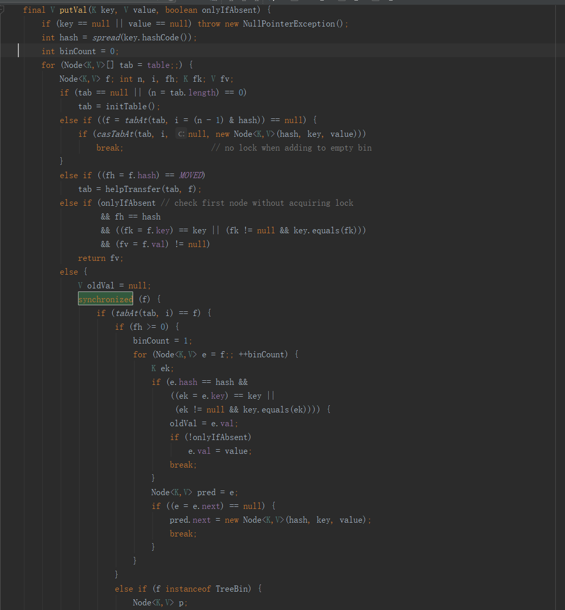

请注意 Synchronized 上锁的对象，请记住，Synchronized 是靠对象的对象头和此对象对应的 monitor 来保证上锁的。也就是对象头里的重量级锁标志指向了 monitor，而 monitor 内部则保存了一个当前线程，也就是抢到了锁的线程。

那么这里的这个 f 是什么呢？它是 Node 链表里的每一个 Node，也就是说，Synchronized 是将每一个 Node 对象作为了一个锁，这样做的好处是什么呢？将锁细化了，也就是说，除非两个线程同时操作一个Node，注意，是一个Node，而不是一个 Node 链表，那么才会争抢同一把锁。

如果使用 ReentrantLock 其实也可以将锁细化成这样的，只要让 Node 类继承 ReentrantLock 就行了，这样的话调用 f.lock() 就能做到和 Synchronized(f) 同样的效果，但为什么不这样做呢？

试想一下，锁已经被细化到这种程度了，那么出现并发争抢的可能性还高吗？还有就是，哪怕出现争抢了，只要线程可以在 30 到 50 次自旋里拿到锁，那么 Synchronized 就不会升级为重量级锁，而等待的线程也就不用被挂起，我们也就少了挂起和唤醒这个上下文切换的过程开销。

但如果是 ReentrantLock 呢？它则只有在线程没有抢到锁，然后新建 Node 节点后再尝试一次而已，不会自旋，而是直接被挂起，这样一来，我们就很容易会多出线程上下文开销的代价。当然，你也可以使用 tryLock()，但是这样又出现了一个问题，你怎么知道tryLock的时间呢？在时间范围里还好，假如超过了呢？

所以，在锁被细化到如此程度上，使用 Synchronized 是最好的选择了。这里再补充一句，Synchronized 和 ReentrantLock 他们的开销差距是在释放锁时唤醒线程的数量，Synchronized 是唤醒锁池里所有的线程 + 刚好来访问的线程，而 ReentrantLock 则是当前线程后进来的第一个线程 + 刚好来访问的线程。

如果是线程并发量不大的情况下，那么 Synchronized 因为自旋锁，偏向锁，轻量级锁的原因，不用将等待线程挂起，偏向锁甚至不用自旋，所以在这种情况下要比 ReentrantLock 高效。


## 集合

### List、Set、Map是否继承自Collection接口？

List、Set 是，Map 不是。Map是键值对映射容器，与List和Set有明显的区别，而Set存储的零散的元素且不允许有重复元素（数学中的集合也是如此），List是线性结构的容器，适用于按数值索引访问元素的情形。

### 阐述ArrayList、Vector、LinkedList的存储性能和特性。

ArrayList 和Vector都是使用数组方式存储数据，此数组元素数大于实际存储的数据以便增加和插入元素，它们都允许直接按序号索引元素，但是插入元素要涉及数组元素移动等内存操作，所以索引数据快而插入数据慢，Vector中的方法由于添加了synchronized修饰，因此Vector是线程安全的容器，但性能上较ArrayList差，因此已经是Java中的遗留容器。

LinkedList使用双向链表实现存储（将内存中零散的内存单元通过附加的引用关联起来，形成一个可以按序号索引的线性结构，这种链式存储方式与数组的连续存储方式相比，内存的利用率更高），按序号索引数据需要进行前向或后向遍历，但是插入数据时只需要记录本项的前后项即可，所以插入速度较快。

Vector属于遗留容器（Java早期的版本中提供的容器，除此之外，Hashtable、Dictionary、BitSet、Stack、Properties都是遗留容器），已经不推荐使用，但是由于ArrayList和LinkedListed都是非线程安全的，如果遇到多个线程操作同一个容器的场景，则可以通过工具类Collections中的synchronizedList方法将其转换成线程安全的容器后再使用。

### Collection和Collections的区别？

Collection是一个接口，它是Set、List等容器的父接口；

Collections是个一个工具类，提供了一系列的静态方法来辅助容器操作，这些方法包括对容器的搜索、排序、线程安全化等等。

### List、Map、Set三个接口存取元素时，各有什么特点？

List以特定索引来存取元素，可以有重复元素。

Set不能存放重复元素（用对象的equals()方法来区分元素是否重复）。

Map保存键值对（key-value pair）映射，映射关系可以是一对一或多对一。


## synchronized 的底层实现

 http://www.cnblogs.com/paddix/p/5367116.html


## lock 和 synchronized 区别 

**lock 是个接口，synchronized 是个关键字。**

```java
// lock
lock.lock();
do something;
lock.unlock();

// synchronized
synchronized {
    do something;
}
```

Lock 中的一些方法及描述：

- lock 阻塞式加锁，一直尝试获取锁。一直追一个女生，死缠烂打型，追到人家孩子都有了也要追下去。
- lockInterruptibly 可中断的阻塞式加锁，会抛出 InterruptedException。根据特定条件可打断阻塞。追女生，遇到白富美。
- tryLock 加成功了，返回 true；失败返回 false。追女生，被发好人卡，卡一扔，老死不相往来。行就行，不行就拉倒。
- tryLock(time, unit) 可以加时间。
- unlock
- newCondition 根据条件加锁

**synchronized 就是 lock 接口的 lock() 方法，天荒地老型。**

**synchronized 可满足大多数场景，lock 在有灵活加解锁的场景下使用。**


使用角度：

lock 需要获取锁，释放锁；synchronized 自动获取锁和释放锁。

lock 方法多，更灵活；lock 提供公平锁（先来先获取锁）；

```java
// 默认ReentrantLock 是非公平锁
public ReentrantLock {
    sync = new NonfairSync();
}
// 想创建公平锁的话
public ReentrantLock(boolean fair) { sync = fair ? new FairSync() : new NonfairSync(); }

// 公平锁采取队列的方式
```


性能角度：

线程较多时，lock 性能好；线程少时，synchronized 性能好。


## Java  AQS 

AbstractQueuedSynchronizer

提到 Java 加锁，我们通常会想到 synchronized 关键字或者是  Java Util Concurrent（后面简称JUC）包下面的 Lock，今天就来扒一扒 Lock 是如何实现的，比如我们可以先提出一些问题：当我们通实例化一个ReentrantLock 并且调用它的 lock 或 unlock 的时候，这其中发生了什么？如果多个线程同时对同一个锁实例进行 lock 或 unlcok 操作，这其中又发生了什么？

### 什么是可重入锁？

ReentrantLock 是可重入锁，什么是可重入锁呢？**可重入锁就是当前持有该锁的线程能够多次获取该锁，无需等待。**可重入锁是如何实现的呢？这要从 ReentrantLock 的一个内部类 Sync 的父类说起，Sync 的父类是 AbstractQueuedSynchronizer（后面简称 AQS ）。

### 什么是AQS？

AQS 是 JDK1.5 提供的一个基于 FIFO 等待队列实现的一个用于实现同步器的基础框架，这个基础框架的重要性可以这么说，JUC 包里面几乎所有的有关锁、多线程并发以及线程同步器等重要组件的实现都是基于AQS这个框架。**AQS 的核心思想是基于 volatile int state 这样的一个属性同时配合 Unsafe 工具对其原子性的操作来实现对当前锁的状态进行修改。**当 state 的值为 0 的时候，标识改 Lock 不被任何线程所占有。

### ReentrantLock锁的架构

ReentrantLock 的架构相对简单，主要包括一个 Sync 的内部抽象类以及 Sync 抽象类的两个实现类。上面已经说过了 Sync 继承自 AQS，他们的结构示意图如下：

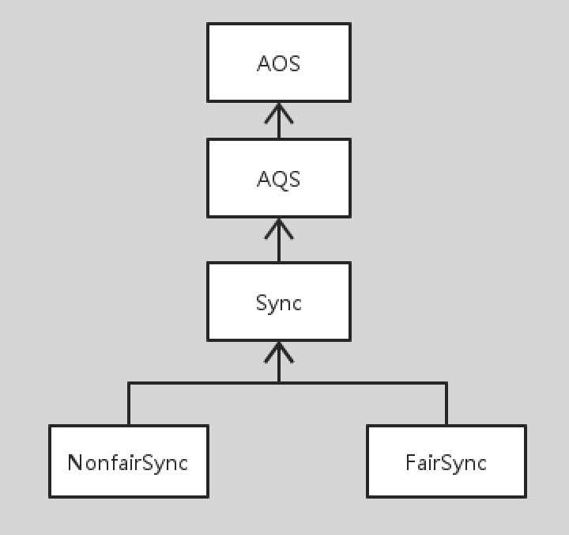

上图除了 AQS 之外，我把AQS的父类AbstractOwnableSynchronizer（简称AOS）也画了进来，AOS主要提供一个 exclusiveOwnerThread 属性，用于关联当前持有该所的线程。另外，Sync 的两个实现类分别是 NonfairSync 和 FairSync，由名字大概可以猜到，一个是用于实现公平锁、一个是用于实现非公平锁。那么 Sync 为什么要被设计成内部类呢？我们可以看看 AQS 主要提供了哪些 protect 的方法用于修改 state 的状态，我们发现 Sync 被设计成为安全的外部不可访问的内部类。ReentrantLock 中所有涉及对 AQS 的访问都要经过 Sync，其实，Sync 被设计成为内部类主要是为了安全性考虑，这也是作者在 AQS 的 comments 上强调的一点。

### AQS 的等待队列

作为AQS的核心实现的一部分，举个例子来描述一下这个队列长什么样子，我们假设目前有三个线程Thread1、Thread2、Thread3同时去竞争锁，如果结果是Thread1获取了锁，Thread2和Thread3进入了等待队列，那么他们的样子如下：


AQS 的等待队列基于一个双向链表实现的，HEAD 节点不关联线程，后面两个节点分别关联Thread2和Thread3，他们将会按照先后顺序被串联在这个队列上。这个时候如果后面再有线程进来的话将会被当做队列的TAIL。

**1）入队列**

我们来看看，当这三个线程同时去竞争锁的时候发生了什么？

代码：

```java
public final void acquire(int arg) {
    if (!tryAcquire(arg) && acquireQueued(addWaiter(Node.EXCLUSIVE), arg))
        selfInterrupt();
}
```

解读：

三个线程同时进来，他们会首先会通过 CAS 去修改 state 的状态，如果修改成功，那么竞争成功，因此这个时候三个线程只有一个 CAS 成功，其他两个线程失败，也就是 tryAcquire 返回 false。

接下来，addWaiter 会把将当前线程关联的 EXCLUSIVE 类型的节点入队列：

代码：

```java
private Node addWaiter(Node mode) {
    Node node = new Node(Thread.currentThread(), mode);
    Node pred = tail;
    if (pred != null) {
        node.prev = pred;
        if (compareAndSetTail(pred, node)) {
            pred.next = node;
            return node;
        }
    }
    enq(node);
    return node;
}
```

解读：

如果队尾节点不为 null，则说明队列中已经有线程在等待了，那么直接入队尾。对于我们举的例子，这边的逻辑应该是走 enq，也就是开始队尾是 null，其实这个时候整个队列都是 null 的。

代码：

```java
private Node enq(final Node node) {
    for (;;) {
        Node t = tail;
        if (t == null) { // Must initialize
            if (compareAndSetHead(new Node()))
                tail = head;
        } else {
            node.prev = t;
            if (compareAndSetTail(t, node)) {
                t.next = node;
                return t;
            }
        }
    }
}
```

解读：

如果 Thread2 和 Thread3 同时进入了 enq，同时 t==null，则进行 CAS 操作对队列进行初始化，这个时候只有一个线程能够成功，然后他们继续进入循环，第二次都进入了 else 代码块，这个时候又要进行 CAS 操作，将自己放在队尾，因此这个时候又是只有一个线程成功，我们假设是 Thread2 成功，Thread2 开心地返回了，Thread3 失落地再进行下一次的循环，最终入队列成功，返回自己。

**2）并发问题**

基于上面两段代码，**他们是如何实现不进行加锁，当有多个线程，或者说很多很多的线程同时执行的时候，怎么能保证最终他们都能够乖乖的入队列而不会出现并发问题的呢？**这也是这部分代码的经典之处，**多线程竞争，热点、单点在队列尾部，多个线程都通过【CAS+死循环】这个free-lock黄金搭档来对队列进行修改，每次能够保证只有一个成功，如果失败下次重试，如果是 N 个线程，那么每个线程最多 loop N 次，最终都能够成功。**

**3）挂起等待线程**

上面只是 addWaiter 的实现部分，那么节点入队列之后会继续发生什么呢？那就要看看 acquireQueued 是怎么实现的了，为保证文章整洁，代码我就不贴了，同志们自行查阅，我们还是以上面的例子来看看，Thread2 和 Thread3 已经被放入队列了，进入 acquireQueued 之后：

1. 对于 Thread2 来说，它的 prev 指向 HEAD，因此会首先再尝试获取锁一次，如果失败，则会将 HEAD 的 waitStatus 值为 SIGNAL，下次循环的时候再去尝试获取锁，如果还是失败，且这个时候 prev 节点的 waitStatus 已经是SIGNAL，则这个时候线程会被通过 LockSupport 挂起。
2. 对于 Thread3 来说，它的 prev 指向 Thread2，因此直接看看 Thread2 对应的节点的 waitStatus 是否为 SIGNAL，如果不是则将它设置为 SIGNAL，再给自己一次去看看自己有没有资格获取锁，如果 Thread2 还是挡在前面，且它的 waitStatus 是 SIGNAL，则将自己挂起。

如果 Thread1 死死的握住锁不放，那么 Thread2 和 Thread3 现在的状态就是挂起状态啦，而且 HEAD，以及 Thread 的 waitStatus 都是 SIGNAL，尽管他们在整个过程中曾经数次去尝试获取锁，但是都失败了，失败了不能死循环呀，所以就被挂起了。当前状态如下：

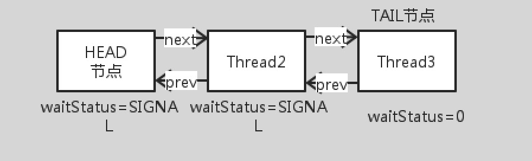

 

### **锁释放-等待线程唤起**

我们来看看当 Thread1 这个时候终于做完了事情，调用了unlock准备释放锁，这个时候发生了什么。

代码：

```java
public final boolean release(int arg) {
    if (tryRelease(arg)) {
        Node h = head;
        if (h != null && h.waitStatus != 0)
            unparkSuccessor(h);
        return true;
    }
    return false;
}
```

解读：

首先，Thread1 会修改 AQS 的 state 状态，加入之前是 1，则变为 0，注意这个时候对于非公平锁来说是个很好的插入机会，举个例子，如果锁是公平锁，这个时候来了 Thread4，那么这个锁将会被 Thread4 抢去……

我们继续走常规路线来分析，当 Thread1 修改完状态了，判断队列是否为 null，以及队头的 waitStatus 是否为 0，如果 waitStatus 为 0，说明队列无等待线程，按照我们的例子来说，队头的 waitStatus 为 SIGNAL = -1，因此这个时候要通知队列的等待线程，可以来拿锁啦，这也是 unparkSuccessor 做的事情， unparkSuccessor 主要做三件事情：

1. 将队头的 waitStatus 设置为 0。
2. 通过从队列尾部向队列头部移动，找到最后一个 waitStatus <= 0 的那个节点，也就是离队头最近的没有被 cancelled 的那个节点，队头这个时候指向这个节点。
3. 将这个节点唤醒，其实这个时候 Thread1 已经出队列了。

还记得线程在哪里挂起的么，上面说过了，在 acquireQueued 里面，我没有贴代码，自己去看哦。这里我们也大概能理解 AQS 的这个队列为什么叫 FIFO 队列了，因此每次唤醒仅仅唤醒队头等待线程，让队头等待线程先出。

 

### **羊群效应**

这里说一下羊群效应，当有多个线程去竞争同一个锁的时候，假设锁被某个线程占用，那么如果有成千上万个线程在等待锁，有一种做法是同时唤醒这成千上万个线程去去竞争锁，这个时候就发生了羊群效应，海量的竞争必然造成资源的剧增和浪费，因此终究只能有一个线程竞争成功，其他线程还是要老老实实的回去等待。**AQS 的 FIFO 的等待队列给解决在锁竞争方面的羊群效应问题提供了一个思路：保持一个 FIFO 队列，队列每个节点只关心其前一个节点的状态，线程唤醒也只唤醒队头等待线程。**其实这个思路已经被应用到了分布式锁的实践中，见：Zookeeper 分布式锁的改进实现方案。

 

### **总结**

这篇文章粗略的介绍一下 ReentrantLock 以及锁实现基础框架 AQS 的实现原理，大致上通过举了个三个线程竞争锁的例子，从 lock、unlock 过程发生了什么这个问题，深入了解 AQS 基于状态的标识以及 FIFO 等待队列方面的工作原理，最后扩展介绍了一下羊群效应问题，博主才疏学浅，还请多多指教。


##  Java JUC

java.util.current.Locks.lock

### 前言：

在 Java 中，线程部分是一个重点，本篇文章说的 JUC 也是关于线程的。JUC 就是 java.util .concurrent 工具包的简称。这是一个处理线程的工具包，JDK 1.5开始出现的。下面一起来看看它怎么使用。

### 一、volatile关键字与内存可见性

**1、内存可见性**

先来看看下面的一段代码：

```java
public class TestVolatile {
    public static void main(String[] args){ //这个线程是用来读取flag的值的
        ThreadDemo threadDemo = new ThreadDemo();
        Thread thread = new Thread(threadDemo);
        thread.start();
        while (true){
            if (threadDemo.isFlag()){
                System.out.println("主线程读取到的flag = " + threadDemo.isFlag());
                break;
            }
        }
    }
}

@Data
class ThreadDemo implements Runnable{ //这个线程是用来修改flag的值的
    public  boolean flag = false;
    @Override
    public void run() {
        try {
            Thread.sleep(200);
        } catch (InterruptedException e) {
            e.printStackTrace();
        }
        flag = true;
        System.out.println("ThreadDemo线程修改后的flag = " + isFlag());
    }
}
```

这段代码很简单，就是一个 ThreadDemo 类继承 Runnable 创建一个线程。它有一个成员变量 flag 为 false，然后重写 run 方法，在 run 方法里面将 flag 改为 true，同时还有一条输出语句。然后就是 main 方法主线程去读取 flag。如果 flag 为 true，就会 break 掉 while 循环，否则就是死循环。按道理，下面那个线程将 flag 改为 true 了，主线程读取到的应该也是 true，循环应该会结束。看看运行结果：


从图中可以看到，该程序并没有结束，也就是死循环。说明主线程读取到的 flag 还是 false，可是另一个线程明明将 flag 改为 true 了，而且打印出来了，这是什么原因呢？这就是内存可见性问题。

- 内存可见性问题：当多个线程操作共享数据时，彼此不可见。

看下图理解上述代码：


要解决这个问题，可以加锁。如下：

```java
while (true) {
    synchronized (threadDemo) {
        if (threadDemo.isFlag()) {
            System.out.println("主线程读取到的flag = " + threadDemo.isFlag());
            break;
        }
    }
}
```

加了锁，就可以让 while 循环每次都从主存中去读取数据，这样就能读取到 true 了。但是一加锁，每次只能有一个线程访问，当一个线程持有锁时，其他的就会阻塞，效率就非常低了。不想加锁，又要解决内存可见性问题，那么就可以使用volatile关键字。

**2、volatile关键字：**

- 用法：

volatile 关键字：当多个线程操作共享数据时，可以保证内存中的数据可见。用这个关键字修饰共享数据，就会及时的把线程缓存中的数据刷新到主存中去，也可以理解为，就是直接操作主存中的数据。所以在不使用锁的情况下，可以使用 volatile。如下

```java
public volatile boolean flag = false;
```

这样就可以解决内存可见性问题了。

- volatile 和 synchronized 的区别：
   volatile 不具备互斥性(当一个线程持有锁时，其他线程进不来，这就是互斥性)。
   volatile 不具备原子性。

### 二、原子性

**1、理解原子性：**
 上面说到 volatile 不具备原子性，那么原子性到底是什么呢？先看如下代码：

```java
public class TestIcon {
    public static void main(String[] args){
        AtomicDemo atomicDemo = new AtomicDemo();
        for (int x = 0;x < 10; x++){
            new Thread(atomicDemo).start();
        }
    }
}

class AtomicDemo implements Runnable{
    private int i = 0;
    public int getI(){
        return i++;
    }
    @Override
    public void run() {
        try {
            Thread.sleep(200);
        } catch (InterruptedException e) {
            e.printStackTrace();
        }
        System.out.println(getI());
    }
}
```

这段代码就是在 run 方法里面让 i++，然后启动十个线程去访问。看看结果：


可以发现，出现了重复数据。明显产生了多线程安全问题，或者说原子性问题。所谓原子性就是操作不可再细分，而i++操作分为读改写三步，如下：

```java
int temp = i;
i = i+1;
i = temp;
```

所以 i++ 明显不是原子操作。上面 10个 线程进行 i++ 时，内存图解如下：


看到这里，好像和上面的内存可见性问题一样。是不是加个 volatile 关键字就可以了呢？其实不是的，因为加了 volatile，只是相当于所有线程都是在主存中操作数据而已，但是不具备互斥性。比如两个线程同时读取主存中的 0，然后又同时自增，同时写入主存，结果还是会出现重复数据。

**2、原子变量：**
 JDK 1.5 之后，Java 提供了原子变量，在 java.util.concurrent.atomic 包下。原子变量具备如下特点：

- 有 volatile 保证内存可见性。
- 用 CAS 算法保证原子性。

**3、CAS 算法：**
 CAS 算法是计算机硬件对并发操作共享数据的支持，CAS包含3个操作数：

- 内存值V
- 预估值A
- 更新值B

当且仅当 V==A 时，才会把 B 的值赋给 V，即 V = B，否则不做任何操作。就上面的 i++ 问题，CAS 算法是这样处理的：首先 V 是主存中的值0，然后预估值 A 也是 0，因为此时还没有任何操作，这时 V  =B，所以进行自增，同时把主存中的值变为 1。如果第二个线程读取到主存中的还是 0 也没关系，因为此时预估值已经变成 1，V 不等于 A，所以不进行任何操作。

**4、使用原子变量改进 i++ 问题：**
 原子变量用法和包装类差不多，如下：

```java
 //private int i = 0;
 AtomicInteger i = new AtomicInteger();
 public int getI(){
     return i.getAndIncrement();
 }
```

只改这两处即可。

### 三、锁分段机制

JDK 1.5 之后，在 java.util.concurrent 包中提供了多种并发容器类来改进同步容器类的性能。其中最主要的就是 ConcurrentHashMap。

**1、ConcurrentHashMap：**
 ConcurrentHashMap 就是一个线程安全的 hash 表。我们知道 HashMap 是线程不安全的，HashTable 加了锁，是线程安全的，因此它效率低。HashTable 加锁就是将整个 hash 表锁起来，当有多个线程访问时，同一时间只能有一个线程访问，并行变成串行，因此效率低。所以JDK1.5 后提供了 ConcurrentHashMap，它采用了锁分段机制。


如上图所示，ConcurrentHashMap 默认分成了 16 个 segment，每个 Segment 都对应一个 Hash 表，且都有独立的锁。所以这样就可以每个线程访问一个Segment，就可以并行访问了，从而提高了效率。这就是锁分段。**但是，**java 8 又更新了，不再采用锁分段机制，也采用 CAS 算法了。


**2、用法:**
 java.util.concurrent 包还提供了设计用于多线程上下文中的 Collection 实现： ConcurrentHashMap、ConcurrentSkipListMap、ConcurrentSkipListSet、CopyOnWriteArrayList 和 CopyOnWriteArraySet。当期望许多线程访问一个给 定 collection 时，ConcurrentHashMap 通常优于同步的 HashMap， ConcurrentSkipListMap 通常优于同步的 TreeMap。当期望的读数和遍历远远 大于列表的更新数时，CopyOnWriteArrayList 优于同步的 ArrayList。下面看看部分用法：

```java
public class TestConcurrent {
    public static void main(String[] args) {
        ThreadDemo2 threadDemo2 = new ThreadDemo2();
           for (int i=0;i<10;i++) {
               new Thread(threadDemo2).start();
           }
    }
}
//10个线程同时访问
class ThreadDemo2 implements Runnable {
    private static List<String> list = Collections.synchronizedList(new ArrayList<>());//普通做法
    static {
        list.add("aaa");
        list.add("bbb");
        list.add("ccc");
    }
    @Override
    public void run() {
        Iterator<String> iterator = list.iterator();
        while (iterator.hasNext()){
            System.out.println(iterator.next());//读
            list.add("ddd");//写
        }
    }
}
```

10个线程并发访问这个集合，读取集合数据的同时再往集合中添加数据。运行这段代码会报错，并发修改异常。


将创建集合方式改成：

```java
private static CopyOnWriteArrayList<String> list = new CopyOnWriteArrayList<>();
```

这样就不会有并发修改异常了。因为这个是写入并复制，每次生成新的，所以如果添加操作比较多的话，开销非常大，适合迭代操作比较多的时候使用。

### 四、闭锁

java.util.concurrent 包中提供了多种并发容器类来改进同步容器的性能。CountDownLatch 是一个同步辅助类，在完成某些运算时，只有其他所有线程的运算全部完成，当前运算才继续执行，这就叫闭锁。看下面代码：

```java
public class TestCountDownLatch {
    public static void main(String[] args) {
        LatchDemo ld = new LatchDemo();
        long start = System.currentTimeMillis();
        for (int i = 0;i<10;i++){
            new Thread(ld).start();
        }
        long end = System.currentTimeMillis();
        System.out.println("耗费时间为："+(end - start)+"秒");
    }
}

class LatchDemo implements Runnable {
    private CountDownLatch latch;
    public LatchDemo() {
    }
    @Override
    public void run() {
        for (int i = 0;i<5000;i++) {
            if (i % 2 == 0){//50000以内的偶数
                System.out.println(i);
            }
        }
    }
}
```

这段代码就是 10 个线程同时去输出 5000 以内的偶数，然后在主线程那里计算执行时间。其实这是计算不了那 10 个线程的执行时间的，因为主线程与这 10 个线程也是同时执行的，可能那 10 个线程才执行到一半，主线程就已经输出“耗费时间为x秒”这句话了。所有要想计算这 10 个线程执行的时间，就得让主线程先等待，等 10 个分线程都执行完了才能执行主线程。这就要用到闭锁。看如何使用：

```java
public class TestCountDownLatch {
    public static void main(String[] args) {
        final CountDownLatch latch = new CountDownLatch(10);//有多少个线程这个参数就是几
        LatchDemo ld = new LatchDemo(latch);
        long start = System.currentTimeMillis();
        for (int i = 0; i < 10; i++) {
            new Thread(ld).start();
        }
        try {
            latch.await();//这10个线程执行完之前先等待
        } catch (InterruptedException e) {
        }
        long end = System.currentTimeMillis();
        System.out.println("耗费时间为：" + (end - start));
    }
}

class LatchDemo implements Runnable {
    private CountDownLatch latch;
    public LatchDemo(CountDownLatch latch) {
        this.latch = latch;
    }
    @Override
    public void run() {
        synchronized (this) {
            try {
                for (int i = 0; i < 50000; i++) {
                    if (i % 2 == 0) {//50000以内的偶数
                        System.out.println(i);
                    }
                }
            } finally {
                latch.countDown();//每执行完一个就递减一个
            }
        }
    }
}
```

如上代码，主要就是用`latch.countDown()`和`latch.await()`实现闭锁，详细请看上面注释即可。

### 五、创建线程的方式 --- 实现Callable接口

直接看代码：

```java
public class TestCallable {
    public static void main(String[] args){
        CallableDemo callableDemo = new CallableDemo();
        //执行callable方式，需要FutureTask实现类的支持，用来接收运算结果
        FutureTask<Integer> result = new FutureTask<>(callableDemo);
        new Thread(result).start();
        //接收线程运算结果
        try {
            Integer sum = result.get();//当上面的线程执行完后，才会打印结果。跟闭锁一样。所有futureTask也可以用于闭锁
            System.out.println(sum);
        } catch (Exception e) {
            e.printStackTrace();
        }
    }
}

class CallableDemo implements Callable<Integer> {
    @Override
    public Integer call() throws Exception {
       int sum = 0;
       for (int i = 0;i<=100;i++){
           sum += i;
       }
       return sum;
    }
}
```

现在 Callable 接口和实现 Runable 接口的区别就是，Callable 带泛型，其 call 方法有返回值。使用的时候，需要用 FutureTask 来接收返回值。而且它也要等到线程执行完调用 get 方法才会执行，也可以用于闭锁操作。

### 六、Lock 同步锁

在 JDK1.5 之前，解决多线程安全问题有两种方式(sychronized 隐式锁)：

- 同步代码块
- 同步方法

在JDK1.5之后，出现了更加灵活的方式(Lock显式锁)：

- 同步锁

Lock 需要通过 lock() 方法上锁，通过 unlock() 方法释放锁。为了保证锁能释放，所有 unlock 方法一般放在 finally 中去执行。

再来看一下卖票案例：


```java
public class TestLock {
    public static void main(String[] args) {
        Ticket td = new Ticket();
        new Thread(td, "窗口1").start();
        new Thread(td, "窗口2").start();
        new Thread(td, "窗口3").start();
    }
}

class Ticket implements Runnable {
    private int ticket = 100;
    @Override
    public void run() {
        while (true) {
            if (ticket > 0) {
                try {
                    Thread.sleep(200);
                } catch (Exception e) {
                }
                System.out.println(Thread.currentThread().getName() + "完成售票，余票为：" + (--ticket));
            }
        }
    }
}
```

多个线程同时操作共享数据 ticket，所以会出现线程安全问题。会出现同一张票卖了好几次或者票数为负数的情况。以前用同步代码块和同步方法解决，现在看看用同步锁怎么解决。

```java
class Ticket implements Runnable {
    private Lock lock = new ReentrantLock();//创建lock锁
    private int ticket = 100;
    @Override
    public void run() {
        while (true) {
            lock.lock();//上锁
            try {
                if (ticket > 0) {
                    try {
                        Thread.sleep(200);
                    } catch (Exception e) {
                    }
                    System.out.println(Thread.currentThread().getName() + "完成售票，余票为：" + (--ticket));
                }
            } finally {
                lock.unlock();//释放锁
            }
        }
    }
}
```

直接创建 lock 对象，然后用 lock() 方法上锁，最后用 unlock() 方法释放锁即可。

### 七、等待唤醒机制

**1、虚假唤醒问题：**
 生产消费模式是等待唤醒机制的一个经典案例，看下面的代码：

```java
public class TestProductorAndconsumer {
    public static void main(String[] args) {
       Clerk clerk = new Clerk();
       Productor productor = new Productor(clerk);
       Consumer consumer = new Consumer(clerk);
       new Thread(productor,"生产者A").start();
       new Thread(consumer,"消费者B").start();
    }
}
//店员
class Clerk {
    private int product = 0;//共享数据
    public synchronized void get() { //进货
        if(product >= 10) {
            System.out.println("产品已满");
        } else {
            System.out.println(Thread.currentThread().getName()+":"+ (++product));
        }
    }
    public synchronized void sell() {//卖货
        if (product <= 0){
            System.out.println("缺货");
        } else {
            System.out.println(Thread.currentThread().getName()+":"+ (--product));
        }
    }
}
//生产者
class Productor implements Runnable {
    private Clerk clerk;
    public Productor(Clerk clerk) {
        this.clerk = clerk;
    }
    @Override
    public void run() {
        for (int i = 0;i<20;i++) {
            clerk.get();
        }
    }
}
//消费者
class Consumer implements Runnable {
    private Clerk clerk;
    public Consumer(Clerk clerk) {
        this.clerk = clerk;
    }
    @Override
    public void run() {
        for (int i = 0;i<20;i++) {
            clerk.sell();
        }
    }
}
```

这就是生产消费模式的案例，这里没有使用等待唤醒机制，运行结果就是即使是缺货状态，它也会不断的去消费，也会一直打印“缺货”，即使是产品已满状态，也会不断地进货。用等待唤醒机制改进：

```java
//店员
class Clerk{
    private int product = 0;//共享数据
    public synchronized void get() { //进货
        if(product >= 10){
            System.out.println("产品已满");
            try {
                this.wait();//满了就等待
            } catch (InterruptedException e) {
                e.printStackTrace();
            }
        } else {
            System.out.println(Thread.currentThread().getName()+":"+ (++product));
            this.notifyAll();//没满就可以进货
        }
    }
    public synchronized void sell() {//卖货
        if (product <= 0){
            System.out.println("缺货");
            try {
                this.wait();//缺货就等待
            } catch (InterruptedException e) {
                e.printStackTrace();
            }
        } else {
            System.out.println(Thread.currentThread().getName()+":"+ (--product));
            this.notifyAll();//不缺货就可以卖
        }
    }
}
```

这样就不会出现上述问题了。没有的时候就生产，生产满了就通知消费，消费完了再通知生产。但是这样还是有点问题，将上述代码做如下改动：

```java
if(product >= 1) { //把原来的10改成1
            System.out.println("产品已满");
         ......
public void run() {
        try {
            Thread.sleep(200);//睡0.2秒
        } catch (InterruptedException e) {
            e.printStackTrace();
        }
        for (int i = 0;i<20;i++) {
            clerk.sell();
        }
}
```

就做这两处修改，再次运行，发现虽然结果没问题，但是程序却一直没停下来。出现这种情况是因为有一个线程在等待，而另一个线程没有执行机会了，唤醒不了这个等待的线程了，所以程序就无法结束。解决办法就是把get和sell方法里面的else去掉，不要用else包起来。但是，即使这样，如果再多加两个线程，就会出现负数了。

```java
new Thread(productor, "生产者C").start();
new Thread(consumer, "消费者D").start();
```

运行结果：


一个消费者线程抢到执行权，发现 product 是 0，就等待，这个时候，另一个消费者又抢到了执行权，product 是 0，还是等待，此时两个消费者线程在同一处等待。然后当生产者生产了一个 product 后，就会唤醒两个消费者，发现 product 是 1，同时消费，结果就出现了 0 和 -1。这就是**虚假唤醒**。解决办法就是把 if 判断改成 while。如下：

```java
 public synchronized void get() { //进货
        while (product >= 1) {
            System.out.println("产品已满");
            try {
                this.wait();//满了就等待
            } catch (InterruptedException e) {
                e.printStackTrace();
            }
        }
            System.out.println(Thread.currentThread().getName() + ":" + (++product));
            this.notifyAll();//没满就可以进货
    }
    public synchronized void sell() {//卖货
        while (product <= 0) {//为了避免虚假唤醒问题，wait方法应该总是在循环中使用
            System.out.println("缺货");
            try {
                this.wait();//缺货就等待
            } catch (InterruptedException e) {
                e.printStackTrace();
            }
        }
            System.out.println(Thread.currentThread().getName() + ":" + (--product));
            this.notifyAll();//不缺货就可以卖
    }
}
```

只需要把 if 改成 while，每次都再去判断一下，就可以了。

**2、用Lock锁实现等待唤醒：**

```java
class Clerk {
    private int product = 0;//共享数据
    private Lock lock = new ReentrantLock();//创建锁对象
    private Condition condition = lock.newCondition();//获取condition实例
    public  void get() { //进货
        lock.lock();//上锁
        try {
            while (product >= 1) {
                System.out.println("产品已满");
                try {
                    condition.await();//满了就等待
                } catch (InterruptedException e) {
                }
            }
            System.out.println(Thread.currentThread().getName() + ":" + (++product));
            condition.signalAll();//没满就可以进货
        }finally {
            lock.unlock();//释放锁
        }
    }

    public  void sell() {//卖货
        lock.lock();//上锁
        try {
            while (product <= 0) {
                System.out.println("缺货");
                try {
                    condition.await();//缺货就等待
                } catch (InterruptedException e) {
                    e.printStackTrace();
                }
            }
            System.out.println(Thread.currentThread().getName() + ":" + (--product));
            condition.signalAll();//不缺货就可以卖
        }finally {
            lock.unlock();//释放锁
        }
    }
}
```

使用 lock 同步锁，就不需要 sychronized 关键字了，需要创建 lock 对象和 condition 实例。condition 的 await() 方法、signal() 方法和 signalAll() 方法分别与 wait()  方法、notify() 方法和 notifyAll() 方法对应。

**3、线程按序交替：**
 首先来看一道题：

```txt
编写一个程序，开启 3 个线程，这三个线程的 ID 分别为 A、B、C，
每个线程将自己的 ID 在屏幕上打印 10 遍，要求输出的结果必须按顺序显示。
如：ABCABCABC…… 依次递归
```

分析：

```txt
线程本来是抢占式进行的，要按序交替，所以必须实现线程通信，
那就要用到等待唤醒。可以使用同步方法，也可以用同步锁。
```

编码实现：

```java
public class TestLoopPrint {
    public static void main(String[] args) {
        AlternationDemo ad = new AlternationDemo();
        new Thread(new Runnable() {
            @Override
            public void run() {
                for (int i = 0; i < 10; i++) {
                    ad.loopA();
                }
            }
        }, "A").start();
        new Thread(new Runnable() {
            @Override
            public void run() {
                for (int i = 0; i < 10; i++) {
                    ad.loopB();
                }
            }
        }, "B").start();
        new Thread(new Runnable() {
            @Override
            public void run() {
                for (int i = 0; i < 10; i++) {
                    ad.loopC();
                }
            }
        }, "C").start();
    }
}

class AlternationDemo {
    private int number = 1;//当前正在执行的线程的标记
    private Lock lock = new ReentrantLock();
    Condition condition1 = lock.newCondition();
    Condition condition2 = lock.newCondition();
    Condition condition3 = lock.newCondition();

    public void loopA() {
        lock.lock();
        try {
            if (number != 1) { //判断
                condition1.await();
            }
            System.out.println(Thread.currentThread().getName());//打印
            number = 2;
            condition2.signal();
        } catch (Exception e) {
        } finally {
            lock.unlock();
        }
    }

    public void loopB() {
        lock.lock();
        try {
            if (number != 2) { //判断
                condition2.await();
            }
            System.out.println(Thread.currentThread().getName());//打印
            number = 3;
            condition3.signal();
        } catch (Exception e) {
        } finally {
            lock.unlock();
        }
    }

    public void loopC() {
        lock.lock();
        try {
            if (number != 3) { //判断
                condition3.await();
            }
            System.out.println(Thread.currentThread().getName());//打印
            number = 1;
            condition1.signal();
        } catch (Exception e) {
        } finally {
            lock.unlock();
        }
    }
}
```

以上编码就满足需求。创建三个线程，分别调用loopA、loopB和loopC方法，这三个线程使用condition进行通信。

### 八、ReadWriterLock 读写锁

我们在读数据的时候，可以多个线程同时读，不会出现问题，但是写数据的时候，如果多个线程同时写数据，那么到底是写入哪个线程的数据呢？所以，如果有两个线程，写写/读写需要互斥，读读不需要互斥。这个时候可以用读写锁。看例子：

```java
public class TestReadWriterLock {
    public static void main(String[] args){
           ReadWriterLockDemo rw = new ReadWriterLockDemo();
           new Thread(new Runnable() {//一个线程写
               @Override
               public void run() {
                   rw.set((int)Math.random()*101);
               }
           },"write:").start();
           for (int i = 0;i<100;i++){//100个线程读
               Runnable runnable = () -> rw.get();
               Thread thread = new Thread(runnable);
               thread.start();
           }
    }
}

class ReadWriterLockDemo{
    private int number = 0;
    private ReadWriteLock readWriteLock = new ReentrantReadWriteLock();
    //读(可以多个线程同时操作)
    public void get(){
        readWriteLock.readLock().lock();//上锁
        try {
            System.out.println(Thread.currentThread().getName()+":"+number);
        }finally {
            readWriteLock.readLock().unlock();//释放锁
        }
    }
    //写(一次只能有一个线程操作)
    public void set(int number){
        readWriteLock.writeLock().lock();
        try {
            System.out.println(Thread.currentThread().getName());
            this.number = number;
        }finally {
            readWriteLock.writeLock().unlock();
        }
    }
}
```

这个就是读写锁的用法。上面的代码实现了一个线程写，一百个线程同时读的操作。

### 九、线程池

我们使用线程时，需要 new 一个，用完了又要销毁，这样频繁的创建销毁也很耗资源，所以就提供了线程池。道理和连接池差不多，连接池是为了避免频繁的创建和释放连接，所以在连接池中就有一定数量的连接，要用时从连接池拿出，用完归还给连接池。线程池也一样。线程池中有一个线程队列，里面保存着所有等待状态的线程。下面来看一下用法：

```java
public class TestThreadPool {
    public static void main(String[] args) {
        ThreadPoolDemo tp = new ThreadPoolDemo();
        //1.创建线程池
        ExecutorService pool = Executors.newFixedThreadPool(5);
        //2.为线程池中的线程分配任务
        pool.submit(tp);
        //3.关闭线程池
        pool.shutdown();
    }
}

class ThreadPoolDemo implements Runnable {
    private int i = 0;
    @Override
    public void run() {
        while (i < 100) {
            System.out.println(Thread.currentThread().getName() + ":" + (i++));
        }
    }
}
```

线程池用法很简单，分为三步。首先用工具类Executors创建线程池，然后给线程池分配任务，最后关闭线程池就行了。


## Java 读写锁如何实现

最近做的一个小项目中有这样的需求：整个项目有一份`config.json`保存着项目的一些配置，是存储在本地文件的一个资源，并且应用中存在读写（读>>写）更新问题。既然读写并发操作，那么就涉及到操作互斥，这里自然想到了读写锁，本文对读写锁方面的知识做个梳理。

### 为什么需要读写锁？

与传统锁不同的是读写锁的规则是可以共享读，但只能一个写，总结起来为：*`读读不互斥，读写互斥，写写互斥`*，而一般的独占锁是：*`读读互斥，读写互斥，写写互斥`*，而场景中往往**读远远大于写**，读写锁就是为了这种优化而创建出来的一种机制。

注意是*`读远远大于写`*，一般情况下独占锁的效率低来源于高并发下对临界区的激烈竞争导致线程上下文切换。因此当并发不是很高的情况下，读写锁由于需要额外维护读锁的状态，可能还不如独占锁的效率高。因此需要根据实际情况选择使用。

### 一个简单的读写锁实现

根据上面理论可以利用两个int变量来简单实现一个读写锁，实现虽然烂，但是原理都是差不多的，值得阅读下。

```java
public class ReadWriteLock {
    /**
     * 读锁持有个数
     */
    private int readCount = 0;
    /**
     * 写锁持有个数
     */
    private int writeCount = 0;
    
    /**
     * 获取读锁，读锁在写锁不存在的时候才能获取
     */
    public synchronized void lockRead() throws InterruptedException {
        // 写锁存在，需要wait
        while (writeCount > 0) {
            wait();
        }
        readCount++;
    }
    
    /**
     * 释放读锁
     */
    public synchronized void unlockRead() {
        readCount--;
        notifyAll();
    }
    
    /**
     * 获取写锁，当读锁存在时需要wait.
     */
    public synchronized void lockWrite() throws InterruptedException {
        // 先判断是否有写请求
        while (writeCount > 0) {
            wait();
        }
        
        // 此时已经不存在获取写锁的线程了，因此占坑，防止写锁饥饿
        writeCount++;
        
        // 读锁为0时获取写锁
        while (readCount > 0) {
            wait();
        }
    }
    
    /**
     * 释放读锁
     */
    public synchronized void unlockWrite() {
        writeCount--;
        notifyAll();
    }
}
```


### ReadWriteLock的实现原理

在Java中`ReadWriteLock`的主要实现为`ReentrantReadWriteLock`，其提供了以下特性：

1. 公平性选择：支持公平与非公平（默认）的锁获取方式，吞吐量非公平优先于公平。
2. 可重入：读线程获取读锁之后可以再次获取读锁，写线程获取写锁之后可以再次获取写锁
3. 可降级：写线程获取写锁之后，其还可以再次获取读锁，然后释放掉写锁，那么此时该线程是读锁状态，也就是降级操作。


### ***\*ReentrantReadWriteLock的结构\****

`ReentrantReadWriteLock`的核心是由一个基于AQS的同步器`Sync`构成，然后由其扩展出`ReadLock`（共享锁），`WriteLock`（排它锁）所组成。

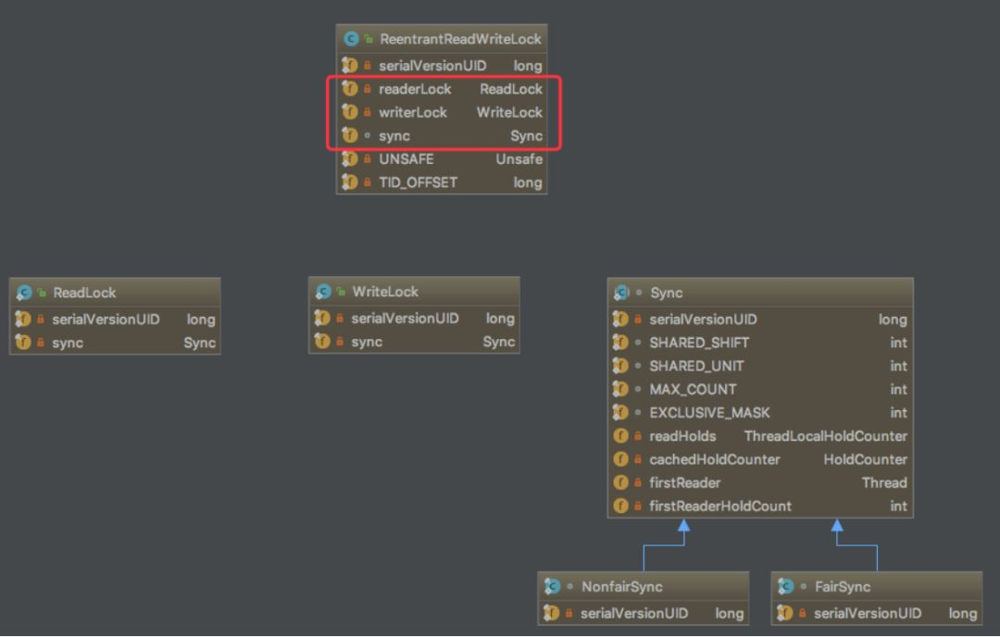

并且从`ReentrantReadWriteLock`的构造函数中可以发现`ReadLock`与`WriteLock`使用的是同一个Sync，具体怎么实现同一个队列既可以为共享锁，又可以表示排他锁下文会具体分析。

**清单1：ReentrantReadWriteLock构造函数**

```java
public ReentrantReadWriteLock(boolean fair) {
   sync = fair ? new FairSync() : new NonfairSync();
   readerLock = new ReadLock(this);
   writerLock = new WriteLock(this);
}
```


### **Sync的实现\**

`sync`是读写锁实现的核心，`sync`是基于AQS实现的，在AQS中核心是state字段和双端队列，那么一个一个问题来分析。

#### **Sync如何同时表示读锁与写锁？\**

**清单2：读写锁状态获取**

```java
static final int SHARED_SHIFT = 16;
static final int SHARED_UNIT = (1 << SHARED_SHIFT);
static final int MAX_COUNT = (1 << SHARED_SHIFT) - 1;
static final int EXCLUSIVE_MASK = (1 << SHARED_SHIFT) - 1;

/** Returns the number of shared holds represented in count */
static int sharedCount(int c) { return c >>> SHARED_SHIFT; }
/** Returns the number of exclusive holds represented in count */
static int exclusiveCount(int c) { return c & EXCLUSIVE_MASK; }
```


从代码中获取读写状态可以看出其是把`state（int32位）`字段分成高16位与低16位，其中高16位表示读锁个数，低16位表示写锁个数，如下图所示（图来自Java并发编程艺术）。


该图表示当前一个线程获取到了写锁，并且重入了两次，因此低16位是3，并且该线程又获取了读锁，并且重入了一次，所以高16位是2，当写锁被获取时如果读锁不为0那么读锁一定是获取写锁的这个线程。


### **读锁的获取**

读锁的获取主要实现是AQS中的`acquireShared`方法，其调用过程如下代码。

**清单3：读锁获取入口**

```java
// ReadLock
public void lock() {
    sync.acquireShared(1);
}
// AQS
public final void acquireShared(int arg) {
    if (tryAcquireShared(arg) < 0)
        doAcquireShared(arg);
}
```


其中`doAcquireShared(arg)`方法是获取失败之后AQS中入队操作，等待被唤醒后重新获取，那么关键点就是`tryAcquireShared(arg)`方法，方法有点长，因此先总结出获取读锁所经历的步骤，获取的第一部分步骤如下：


- 操作1：读写需要互斥，因此当存在写锁并且持有写锁的线程不是该线程时获取失败。
- 操作2：是否存在等待写锁的线程，存在的话则获取读锁需要等待，避免写锁饥饿。(写锁优先级是比较高的)
- 操作3：CAS获取读锁，实际上是state字段的高16位自增。
- 操作4：获取成功后再ThreadLocal中记录当前线程获取读锁的次数。

**清单4：读锁获取的第一部分**

```java
protected final int tryAcquireShared(int unused) {
      Thread current = Thread.currentThread();
      int c = getState();
      // 操作1：存在写锁，并且写锁不是当前线程则直接去排队
      if (exclusiveCount(c) != 0 &&
          getExclusiveOwnerThread() != current)
          return -1;
      int r = sharedCount(c);
      // 操作2：读锁是否该阻塞，对于非公平模式下写锁获取优先级会高，如果存在要获取写锁的线程则读锁需要让步，公平模式下则先来先到
      if (!readerShouldBlock() && 
          // 读锁使用高16位，因此存在获取上限为2^16-1
          r < MAX_COUNT &&
          // 操作3：CAS修改读锁状态，实际上是读锁状态+1
          compareAndSetState(c, c + SHARED_UNIT)) {
          // 操作4：执行到这里说明读锁已经获取成功，因此需要记录线程状态。
          if (r == 0) {
              firstReader = current; // firstReader是把读锁状态从0变成1的那个线程
              firstReaderHoldCount = 1;
          } else if (firstReader == current) { 
              firstReaderHoldCount++;
          } else {
              // 这些代码实际上是从ThreadLocal中获取当前线程重入读锁的次数，然后自增下。
              HoldCounter rh = cachedHoldCounter; // cachedHoldCounter是上一个获取锁成功的线程
              if (rh == null || rh.tid != getThreadId(current))
                  cachedHoldCounter = rh = readHolds.get();
              else if (rh.count == 0)
                  readHolds.set(rh);
              rh.count++;
          }
          return 1;
      }
      // 当操作2，操作3失败时执行该逻辑
      return fullTryAcquireShared(current);
}
```


当操作2，操作3失败时会执行`fullTryAcquireShared(current)`，为什么会这样写呢？个人认为是一种补偿操作，**操作2与操作3失败并不代表当前线程没有读锁的资格**，并且这里的读锁是共享锁，有资格就应该被获取成功，因此给予补偿获取读锁的操作。在`fullTryAcquireShared(current)`中是一个循环获取读锁的过程，大致步骤如下：


- 操作5：等同于操作2，存在写锁，且写锁线程并非当前线程则直接返回失败
- 操作6：当前线程是重入读锁，这里只会偏向第一个获取读锁的线程以及最后一个获取读锁的线程，其他都需要去AQS中排队。
- 操作7：CAS改变读锁状态
- 操作8：同操作4，获取成功后再ThreadLocal中记录当前线程获取读锁的次数。

**清单5：读锁获取的第二部分**

```java
final int fullTryAcquireShared(Thread current) {
           HoldCounter rh = null;
           // 最外层嵌套循环
           for (;;) {
               int c = getState();
               // 操作5：存在写锁，且写锁并非当前线程则直接返回失败
               if (exclusiveCount(c) != 0) {
                   if (getExclusiveOwnerThread() != current)
                       return -1;
                   // else we hold the exclusive lock; blocking here
                   // would cause deadlock.
               // 操作6：如果当前线程是重入读锁则放行
               } else if (readerShouldBlock()) {
                   // Make sure we're not acquiring read lock reentrantly
                   // 当前是firstReader，则直接放行,说明是已获取的线程重入读锁
                   if (firstReader == current) {
                       // assert firstReaderHoldCount > 0;
                   } else {
                       // 执行到这里说明是其他线程，如果是cachedHoldCounter（其count不为0）也就是上一个获取锁的线程则可以重入，否则进入AQS中排队
                       // **这里也是对写锁的让步**，如果队列中头结点为写锁，那么当前获取读锁的线程要进入队列中排队
                       if (rh == null) {
                           rh = cachedHoldCounter;
                           if (rh == null || rh.tid != getThreadId(current)) {
                               rh = readHolds.get();
                               if (rh.count == 0)
                                   readHolds.remove();
                           }
                       }
                       // 说明是上述刚初始化的rh，所以直接去AQS中排队
                       if (rh.count == 0)
                           return -1;
                   }
               }
               if (sharedCount(c) == MAX_COUNT)
                   throw new Error("Maximum lock count exceeded");
               // 操作7：修改读锁状态，实际上读锁自增操作
               if (compareAndSetState(c, c + SHARED_UNIT)) {
                   // 操作8：对ThreadLocal中维护的获取锁次数进行更新。
                   if (sharedCount(c) == 0) {
                       firstReader = current;
                       firstReaderHoldCount = 1;
                   } else if (firstReader == current) {
                       firstReaderHoldCount++;
                   } else {
                       if (rh == null)
                           rh = cachedHoldCounter;
                       if (rh == null || rh.tid != getThreadId(current))
                           rh = readHolds.get();
                       else if (rh.count == 0)
                           readHolds.set(rh);
                       rh.count++;
                       cachedHoldCounter = rh; // cache for release
                   }
                   return 1;
               }
           }
       }
```


### ***\*读锁的释放\****

**清单6：读锁释放入口**

```java
// ReadLock
public void unlock() {
    sync.releaseShared(1);
}
// Sync
public final boolean releaseShared(int arg) {
    if (tryReleaseShared(arg)) {
        doReleaseShared(); // 这里实际上是释放读锁后唤醒写锁的线程操作
        return true;
    }
    return false;
}
```


读锁的释放主要是`tryReleaseShared(arg)`函数，因此拆解其步骤如下：


- 操作1：清理ThreadLocal中保存的获取锁数量信息
- 操作2：CAS修改读锁个数，实际上是自减一

**清单7：读锁的释放流程**

```java
protected final boolean tryReleaseShared(int unused) {
         Thread current = Thread.currentThread();
         // 操作1：清理ThreadLocal对应的信息
         if (firstReader == current) {;
             if (firstReaderHoldCount == 1)
                 firstReader = null;
             else
                 firstReaderHoldCount--;
         } else {
             HoldCounter rh = cachedHoldCounter;
             if (rh == null || rh.tid != getThreadId(current))
                 rh = readHolds.get();
             int count = rh.count;
             // 已释放完的读锁的线程清空操作
             if (count <= 1) {
                 readHolds.remove();
                 // 如果没有获取锁却释放则会报该错误
                 if (count <= 0)
                     throw unmatchedUnlockException();
             }
             --rh.count;
         }
         // 操作2：循环中利用CAS修改读锁状态
         for (;;) {
             int c = getState();
             int nextc = c - SHARED_UNIT;
             if (compareAndSetState(c, nextc))
                 // Releasing the read lock has no effect on readers,
                 // but it may allow waiting writers to proceed if
                 // both read and write locks are now free.
                 return nextc == 0;
         }
     }
```


### ***\*写锁的获取\****

**清单8：写锁的获取入口**

```java
// WriteLock
  public void lock() {
        sync.acquire(1);
    }
// AQS
  public final void acquire(int arg) {
        // 尝试获取，获取失败后入队，入队失败则interrupt当前线程
        if (!tryAcquire(arg) &&
            acquireQueued(addWaiter(Node.EXCLUSIVE), arg))
            selfInterrupt();
    }
```


写锁的获取也主要是`tryAcquire(arg)`方法，这里也拆解步骤：


- 操作1：如果读锁数量不为0或者写锁数量不为0，并且不是重入操作，则获取失败。
- 操作2：如果当前锁的数量为0，也就是不存在操作1的情况，那么该线程是有资格获取到写锁，因此修改状态，设置独占线程为当前线程

**清单9：写锁的获取**

```java
protected final boolean tryAcquire(int acquires) {
    Thread current = Thread.currentThread();
    int c = getState();
    int w = exclusiveCount(c);
    // 操作1：c != 0，说明存在读锁或者写锁
    if (c != 0) {
        // (Note: if c != 0 and w == 0 then shared count != 0)  
        // 写锁为0，读锁不为0 或者获取写锁的线程并不是当前线程，直接失败
        if (w == 0 || current != getExclusiveOwnerThread())
            return false;
        if (w + exclusiveCount(acquires) > MAX_COUNT)
            throw new Error("Maximum lock count exceeded");
        // Reentrant acquire
        // 执行到这里说明是写锁线程的重入操作，直接修改状态，也不需要CAS因为没有竞争
        setState(c + acquires);
        return true;
    }
    // 操作2：获取写锁，writerShouldBlock对于非公平模式直接返回fasle，对于公平模式则线程需要排队，因此需要阻塞。
    if (writerShouldBlock() ||
        !compareAndSetState(c, c + acquires))
        return false;
    setExclusiveOwnerThread(current);
    return true;
}
```


### ***\*写锁的释放\****

#### **清单10：写锁的释放入口**

```java
// WriteLock
public void unlock() {
        sync.release(1);
    }
// AQS
public final boolean release(int arg) {
    // 释放锁成功后唤醒队列中第一个线程
    if (tryRelease(arg)) {
        Node h = head;
        if (h != null && h.waitStatus != 0)
            unparkSuccessor(h);
        return true;
    }
    return false;
}
```

写锁的释放主要是`tryRelease(arg)`方法，其逻辑就比较简单了，注释很详细。

**清单11：写锁的释放**

```java
protected final boolean tryRelease(int releases) {
     // 如果当前线程没有获取写锁却释放，则直接抛异常
     if (!isHeldExclusively())
         throw new IllegalMonitorStateException();
     // 状态变更至nextc
     int nextc = getState() - releases;
     // 因为写锁是可以重入，所以在都释放完毕后要把独占标识清空
     boolean free = exclusiveCount(nextc) == 0;
     if (free)
         setExclusiveOwnerThread(null);
     // 修改状态
     setState(nextc);
     return free;
 }
```


### ***\*一些其他问题：\****

#### ***\*锁降级操作哪里体现？\****

锁降级操作指的是一个线程获取写锁之后再获取读锁，然后读锁释放掉写锁的过程。在`tryAcquireShared(arg)`获取读锁的代码中有如下代码。

**清单12：写锁降级策略**


```java
Thread current = Thread.currentThread();
            // 当前状态
            int c = getState();
            // 存在写锁，并且写锁不等于当前线程时返回，换句话说等写锁为当前线程时则可以继续往下获取读锁。
            if (exclusiveCount(c) != 0 &&
                getExclusiveOwnerThread() != current)
                return -1;
。。。。。读锁获取。。。。。
```


那么锁降级有什么用？答案是为了可见性的保证。在`ReentrantReadWriteLock`的javadoc中有如下代码，其是锁降级的一个应用示例。


```java
class CachedData {
  Object data;
  volatile boolean cacheValid;
  final ReentrantReadWriteLock rwl = new ReentrantReadWriteLock();

  void processCachedData() {
    // 获取读锁
    rwl.readLock().lock();
    if (!cacheValid) {
      // Must release read lock before acquiring write lock，不释放的话下面写锁会获取不成功，造成死锁
      rwl.readLock().unlock();
     // 获取写锁
      rwl.writeLock().lock();
      try {
        // Recheck state because another thread might have
        // acquired write lock and changed state before we did.
        if (!cacheValid) {
          data = ...
          cacheValid = true;
        }
        // Downgrade by acquiring read lock before releasing write lock
        // 这里再次获取读锁，如果不获取那么当写锁释放后可能其他写线程再次获得写锁，导致下方`use(data)`时出现不一致的现象
        // 这个操作就是降级
        rwl.readLock().lock();
      } finally {
        rwl.writeLock().unlock(); // Unlock write, still hold read
      }
    }

    try {
    // 使用完后释放读锁
      use(data);
    } finally {
      rwl.readLock().unlock();
    }
  }
 }}
```


#### ***\*公平与非公平的区别\****

**清单13：公平下的Sync**

```java
static final class FairSync extends Sync {
     private static final long serialVersionUID = -2274990926593161451L;
     final boolean writerShouldBlock() {
         return hasQueuedPredecessors(); // 队列中是否有元素，有责当前操作需要block
     }
     final boolean readerShouldBlock() {
         return hasQueuedPredecessors();// 队列中是否有元素，有责当前操作需要block
     }
 }
```


公平下的Sync实现策略是所有获取的读锁或者写锁的线程都需要入队排队，按照顺序依次去尝试获取锁。

**清单14：非公平下的Sync**

```java
static final class NonfairSync extends Sync {
       private static final long serialVersionUID = -8159625535654395037L;
       final boolean writerShouldBlock() {
           // 非公平下不考虑排队，因此写锁可以竞争获取
           return false; // writers can always barge
       }
       final boolean readerShouldBlock() {
           /* As a heuristic to avoid indefinite writer starvation,
            * block if the thread that momentarily appears to be head
            * of queue, if one exists, is a waiting writer.  This is
            * only a probabilistic effect since a new reader will not
            * block if there is a waiting writer behind other enabled
            * readers that have not yet drained from the queue.
            */
           // 这里实际上是一个优先级，如果队列中头部元素时写锁，那么读锁需要等待，避免写锁饥饿。
           return apparentlyFirstQueuedIsExclusive();
       }
   }
```


非公平下由于抢占式获取锁，写锁是可能产生饥饿，因此解决办法就是提高写锁的优先级，换句话说获取写锁之前先占坑。


## 介绍一下 ThreadLocal 

**1、ThreadLocal是什么**

**2、ThreadLocal怎么用**

**3、ThreadLocal源码分析**

**4、ThreadLocal内存泄漏问题**

下面我们带着这些问题，一点一点揭开ThreadLocal的面纱。若有不正之处请多多谅解，并欢迎批评指正。**以下源码均基于jdk1.8。**

### **一、ThreadLocal是什么**

从名字我们就可以看到ThreadLocal叫做线程变量，意思是ThreadLocal中填充的变量属于**当前**线程，该变量对其他线程而言是隔离的。ThreadLocal为变量在每个线程中都创建了一个副本，那么每个线程可以访问自己内部的副本变量。

从字面意思来看非常容易理解，但是从实际使用的角度来看，就没那么容易了，作为一个面试常问的点，使用场景那也是相当的丰富：

**1、在进行对象跨层传递的时候，使用ThreadLocal可以避免多次传递，打破层次间的约束。**

**2、线程间数据隔离**

**3、进行事务操作，用于存储线程事务信息。**

**4、数据库连接，Session会话管理。**

现在相信你已经对ThreadLocal有一个大致的认识了，下面我们看看如何用？

### **二、ThreadLocal怎么用**

既然ThreadLocal的作用是每一个线程创建一个副本，我们使用一个例子来验证一下：

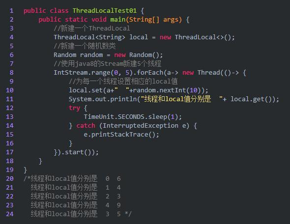

从结果我们可以看到，每一个线程都有各自的local值，我们设置了一个休眠时间，就是为了另外一个线程也能够及时的读取当前的local值。

这就是TheadLocal的基本使用，是不是非常的简单。那么为什么会在数据库连接的时候使用的比较多呢？

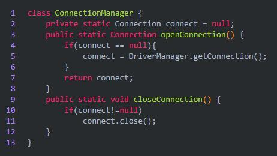

上面是一个数据库连接的管理类，我们使用数据库的时候首先就是建立数据库连接，然后用完了之后关闭就好了，这样做有一个很严重的问题，如果有1个客户端频繁的使用数据库，那么就需要建立多次链接和关闭，我们的服务器可能会吃不消，怎么办呢？如果有一万个客户端，那么服务器压力更大。

这时候最好ThreadLocal，因为ThreadLocal在每个线程中对连接会创建一个副本，且在线程内部任何地方都可以使用，线程之间互不影响，这样一来就不存在线程安全问题，也不会严重影响程序执行性能。是不是很好用。

以上主要是讲解了一个基本的案例，然后还分析了为什么在数据库连接的时候会使用ThreadLocal。下面我们从源码的角度来分析一下，ThreadLocal的工作原理。

### **三、ThreadLocal源码分析**

在最开始的例子中，只给出了两个方法也就是get和set方法，其实还有几个需要我们注意。

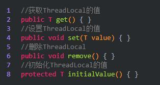

方法这么多，我们主要来看set，然后就能认识到整体的ThreadLocal了：

**1、set方法**

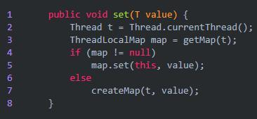

从set方法我们可以看到，首先获取到了当前线程t，然后调用getMap获取ThreadLocalMap，如果map存在，则将当前线程对象t作为key，要存储的对象作为value存到map里面去。如果该Map不存在，则初始化一个。

OK，到这一步了，相信你会有几个疑惑了，ThreadLocalMap是什么，getMap方法又是如何实现的。带着这些问题，继续往下看。先来看ThreadLocalMap。

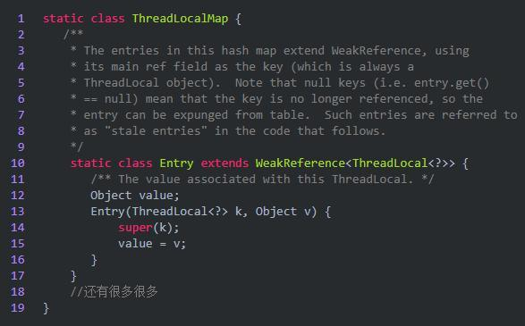

我们可以看到ThreadLocalMap其实就是ThreadLocal的一个静态内部类，里面定义了一个Entry来保存数据，而且还是继承的弱引用。在Entry内部使用ThreadLocal作为key，使用我们设置的value作为value。

还有一个getMap

```java
ThreadLocalMap getMap(Thread t) {
    return t.threadLocals;
}
```


调用当期线程t，返回当前线程t中的成员变量threadLocals。而threadLocals其实就是ThreadLocalMap。

**2、get方法**

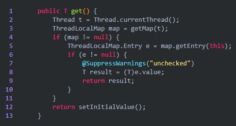

通过上面ThreadLocal的介绍相信你对这个方法能够很好的理解了，首先获取当前线程，然后调用getMap方法获取一个ThreadLocalMap，如果map不为null，那就使用当前线程作为ThreadLocalMap的Entry的键，然后值就作为相应的的值，如果没有那就设置一个初始值。

如何设置一个初始值呢？

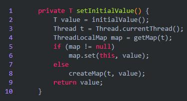

原理很简单

**3、remove方法**

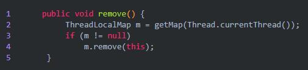

从我们的map移除即可。

OK，其实内部源码很简单，现在我们总结一波

（1）每个Thread维护着一个ThreadLocalMap的引用

（2）ThreadLocalMap是ThreadLocal的内部类，用Entry来进行存储

（3）ThreadLocal创建的副本是存储在自己的threadLocals中的，也就是自己的ThreadLocalMap。

（4）ThreadLocalMap的键值为ThreadLocal对象，而且可以有多个threadLocal变量，因此保存在map中

（5）在进行get之前，必须先set，否则会报空指针异常，当然也可以初始化一个，但是必须重写initialValue()方法。

（6）ThreadLocal本身并不存储值，它只是作为一个key来让线程从ThreadLocalMap获取value。

OK，现在从源码的角度上不知道你能理解不，对于ThreadLocal来说关键就是内部的ThreadLocalMap。

### **四、ThreadLocal其他几个注意的点**

只要是介绍ThreadLocal的文章都会帮大家认识一个点，那就是内存泄漏问题。我们先来看下面这张图。

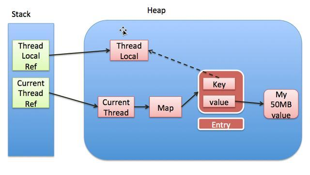

上面这张图详细的揭示了ThreadLocal和Thread以及ThreadLocalMap三者的关系。

1、Thread中有一个map，就是ThreadLocalMap

2、ThreadLocalMap的key是ThreadLocal，值是我们自己设定的。

3、ThreadLocal是一个弱引用，当为null时，会被当成垃圾回收

**4、重点来了，突然我们ThreadLocal是null了，也就是要被垃圾回收器回收了，但是此时我们的ThreadLocalMap生命周期和Thread的一样，它不会回收，这时候就出现了一个现象。那就是ThreadLocalMap的key没了，但是value还在，这就造成了内存泄漏。**

4 就是 ThreadLocal 存在的问题和风险

**解决办法：使用完ThreadLocal后，执行remove操作，避免出现内存溢出情况。**


## 使用 ThreadLocal 存在什么问题，有什么风险（Java中的引用类型）

### 在Java中提供了四个级别的引用：强引用，软引用，弱引用和虚引用。

在这四个引用类型中，只有强引用FinalReference类是包内可见，其他三种引用类型均为public，可以在应用程序中直接使用。

#### 1.强引用Java中的引用，类似C语言中最难的指针。

通过引用，可以对堆中的对象进行操作。如：StringBuffer stringBuffer = new StringBuffer("Helloword");变量str指向StringBuffer实例所在的堆空间，通过str可以操作该对象。强引用的特点：强引用可以直接访问目标对象。强引用所指向的对象在任何时候都不会被系统回收。JVM宁愿抛出OOM异常，也不会回收强引用所指向的对象。强引用可能导致内存泄漏。

#### 2.软引用软引用是除了强引用外，最强的引用类型。

可以通过java.lang.ref.SoftReference使用软引用。一个持有软引用的对象，不会被JVM很快回收，JVM会根据当前堆的使用情况来判断何时回收。当堆使用率临近阈值时，才会去回收软引用的对象。

因此，软引用可以用于实现对内存敏感的高速缓存。SoftReference的特点是它的一个实例保存对一个Java对象的软引用， 该软引用的存在不妨碍垃圾收集线程对该Java对象的回收。也就是说，一旦SoftReference保存了对一个Java对象的软引用后，在垃圾线程对 这个Java对象回收前，SoftReference类所提供的get()方法返回Java对象的强引用。一旦垃圾线程回收该Java对象之后，get()方法将返回null。下面举一个例子说明软引用的使用方法。在你的IDE设置参数 -Xmx2m -Xms2m规定堆内存大小为2m。

```java
@Test    
public void test3(){ 
    MyObject obj = new myObject();
    SoftReference sf = new SoftReference<>(obj);
    obj = null; 
    System.gc();
    //        byte[] bytes = new byte[1024*100];
    //        System.gc();
    System.out.println("是否被回收"+sf.get());    }
```

运行结果：是否被回收 cn.zyzpp.MyObject@42110406 打开被注释掉的 new byte[1024*100] 语句，这条语句请求一块大的堆空间，使堆内存使用紧张。并显式的再调用一次 GC，结果如下：是否被回收 null 说明在系统内存紧张的情况下，软引用被回收。

#### 3.弱引用弱引用是一种比软引用较弱的引用类型。

在系统 GC 时，只要发现弱引用，不管系统堆空间是否足够，都会将对象进行回收。在 Java 中，可以用 java.lang.ref.WeakReference 实例来保存对一个 Java 对象的弱引用。

```java
public void test3() {
    MyObject obj = new MyObject();
    WeakReference sf = new WeakReference(obj);
    obj = null;System.out.println("是否被回收" + sf.get());
    System.gc();
    System.out.println("是否被回收" + sf.get());    
}
```

运行结果：是否被回收 cn.zyzpp.MyObject@42110406 是否被回收 null 软引用，弱引用都非常适合来保存那些可有可无的缓存数据，如果这么做，当系统内存不足时，这些缓存数据会被回收，不会导致内存溢出。而当内存资源充足时，这些缓存数据又可以存在相当长的时间，从而起到加速系统的作用。

#### 4.虚引用虚引用是所有类型中最弱的一个。

一个持有虚引用的对象，和没有引用几乎是一样的，随时可能被垃圾回收器回收。当试图通过虚引用的get()方法取得强引用时，总是会失败。并且，虚引用必须和引用队列一起使用，它的作用在于跟踪垃圾回收过程。当垃圾回收器准备回收一个对象时，如果发现它还有虚引用，就会在垃圾回收后，销毁这个对象，将这个虚引用加入引用队列。程序可以通过判断引用队列中是否已经加入了虚引用，来了解被引用的对象是否将要被垃圾回收。如果程序发现某个虚引用已经被加入到引用队列，那么就可以在所引用的对象的内存被回收之前采取必要的行动。

```java
   public void test3(){ 
       MyObject obj = new MyObject();ReferenceQueue referenceQueue = new ReferenceQueue<>();
       PhantomReference sf = new PhantomReference<>(obj,referenceQueue); 
       obj = null;
       System.out.println("是否被回收"+sf.get());
       System.gc();
       System.out.println("是否被回收"+sf.get());
   }
```

运行结果：是否被回收null是否被回收null对虚引用的get()操作，总是返回null，因为sf.get()方法的实现如下：    public T get() {        return null;    }

#### 5.WeakHashMap 类及其实现 WeakHashMap 类在 java.util 包内，它实现了 Map 接口，是 HashMap 的一种实现，它使用弱引用作为内部数据的存储方案。

> WeakHashMap是弱引用的一种典型应用，它可以作为简单的缓存表解决方案。一下两段代码分别使用WeakHashMap和HashMap保存大量的数据：


```java
public void test(){
    Map map;        
    map = new WeakHashMap();    
    for (int i =0;i<10000;i++){
        map.put("key"+i,new byte[i]);}
    // map = new HashMap();
    //    for (int i =0;i<10000;i++){
    //  map.put("key"+i,new byte[i]);
    //}   
}
```

使用 -Xmx2M 限定堆内存，使用 WeakHashMap 的代码正常运行结束，而使用 HashMap 的代码段抛出异常 java.lang.OutOfMemoryError: Java heap space

##### 由此可见，WeakHashMap 会在系统内存紧张时使用弱引用，自动释放掉持有弱引用的内存数据。但如果 WeakHashMap 的 key 都在系统内持有强引用，那么 WeakHashMap 就退化为普通的 HashMap，因为所有的表项都无法被自动清理。


### ThreadLocal为什么会内存泄漏？

 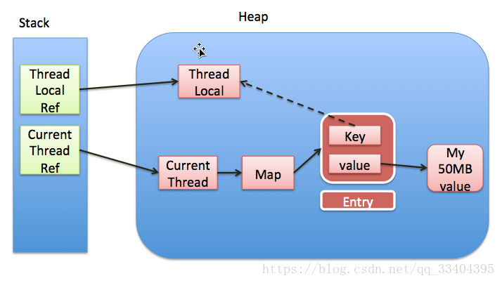

 

ThreadLocal的实现是这样的：每个Thread 维护一个 ThreadLocalMap 映射表，这个映射表的 key 是 ThreadLocal实例本身，value 是真正需要存储的 Object。
也就是说 ThreadLocal 本身并不存储值，它只是作为一个 key 来让线程从 ThreadLocalMap 获取 value。
值得注意的是图中的虚线，表示 ThreadLocalMap 是使用 ThreadLocal 的弱引用作为 Key 的，弱引用的对象在 GC 时会被回收。

ThreadLocalMap使用ThreadLocal的弱引用作为key，如果一个ThreadLocal没有外部强引用来引用它，那么系统 GC 的时候，这个ThreadLocal势必会被回收，这样一来，ThreadLocalMap中就会出现key为null的Entry，就没有办法访问这些key为null的Entry的value，如果当前线程再迟迟不结束的话，这些key为null的Entry的value就会一直存在一条强引用链：Thread Ref -> Thread -> ThreaLocalMap -> Entry -> value永远无法回收，造成内存泄漏。

### ThreadLocal如何防止内存泄漏？

每次使用完ThreadLocal，都调用它的remove()方法，清除数据。
在使用线程池的情况下，没有及时清理ThreadLocal，不仅是内存泄漏的问题，更严重的是可能导致业务逻辑出现问题。所以，使用ThreadLocal就跟加锁完要解锁一样，用完就需要清理。

应对软件变化


## ThreadPoolExecutor包含哪些参数，各个参数是什么含义

一、ThreadPoolExecutor的重要参数

```
    1、corePoolSize：核心线程数
        * 核心线程会一直存活，及时没有任务需要执行
        * 当线程数小于核心线程数时，即使有线程空闲，线程池也会优先创建新线程处理
        * 设置allowCoreThreadTimeout=true（默认false）时，核心线程会超时关闭

    2、queueCapacity：任务队列容量（阻塞队列）
        * 当核心线程数达到最大时，新任务会放在队列中排队等待执行

    3、maxPoolSize：最大线程数
        * 当线程数>=corePoolSize，且任务队列已满时。线程池会创建新线程来处理任务
        * 当线程数=maxPoolSize，且任务队列已满时，线程池会拒绝处理任务而抛出异常

    4、 keepAliveTime：线程空闲时间
        * 当线程空闲时间达到keepAliveTime时，线程会退出，直到线程数量=corePoolSize
        * 如果allowCoreThreadTimeout=true，则会直到线程数量=0

    5、allowCoreThreadTimeout：允许核心线程超时
    6、rejectedExecutionHandler：任务拒绝处理器
        * 两种情况会拒绝处理任务：
            - 当线程数已经达到maxPoolSize，切队列已满，会拒绝新任务
            - 当线程池被调用shutdown()后，会等待线程池里的任务执行完毕，再shutdown。如果在调用shutdown()和线程池真正shutdown之间提交任务，会拒绝新任务
        * 线程池会调用rejectedExecutionHandler来处理这个任务。如果没有设置默认是AbortPolicy，会抛出异常
        * ThreadPoolExecutor类有几个内部实现类来处理这类情况：
            - AbortPolicy 丢弃任务，抛运行时异常
            - CallerRunsPolicy 执行任务
            - DiscardPolicy 忽视，什么都不会发生
            - DiscardOldestPolicy 从队列中踢出最先进入队列（最后一个执行）的任务
        * 实现RejectedExecutionHandler接口，可自定义处理器
```

二、ThreadPoolExecutor执行顺序

```
        线程池按以下行为执行任务
    1. 当线程数小于核心线程数时，创建线程。
    2. 当线程数大于等于核心线程数，且任务队列未满时，将任务放入任务队列。
    3. 当线程数大于等于核心线程数，且任务队列已满
        - 若线程数小于最大线程数，创建线程
        - 若线程数等于最大线程数，抛出异常，拒绝任务
```

三、如何设置参数

```txt
1、默认值
* corePoolSize=1
* queueCapacity=Integer.MAX_VALUE
* maxPoolSize=Integer.MAX_VALUE
* keepAliveTime=60s
* allowCoreThreadTimeout=false
* rejectedExecutionHandler=AbortPolicy()

2、如何来设置
* 需要根据几个值来决定
    - tasks ：每秒的任务数，假设为500~1000
    - taskcost：每个任务花费时间，假设为0.1s
    - responsetime：系统允许容忍的最大响应时间，假设为1s
* 做几个计算
    - corePoolSize = 每秒需要多少个线程处理？ 
        * threadcount = tasks/(1/taskcost) =tasks*taskcout =  (500~1000)*0.1 = 50~100 个线程。corePoolSize设置应该大于50
        * 根据8020原则，如果80%的每秒任务数小于800，那么corePoolSize设置为80即可
    - queueCapacity = (coreSizePool/taskcost)*responsetime
        * 计算可得 queueCapacity = 80/0.1*1 = 80。意思是队列里的线程可以等待1s，超过了的需要新开线程来执行
        * 切记不能设置为Integer.MAX_VALUE，这样队列会很大，线程数只会保持在corePoolSize大小，当任务陡增时，不能新开线程来执行，响应时间会随之陡增。
    - maxPoolSize = (max(tasks)- queueCapacity)/(1/taskcost)
        * 计算可得 maxPoolSize = (1000-80)/10 = 92
        * （最大任务数-队列容量）/每个线程每秒处理能力 = 最大线程数
    - rejectedExecutionHandler：根据具体情况来决定，任务不重要可丢弃，任务重要则要利用一些缓冲机制来处理
    - keepAliveTime和allowCoreThreadTimeout采用默认通常能满足

3、以上都是理想值，实际情况下要根据机器性能来决定。如果在未达到最大线程数的情况机器cpu load已经满了，则需要通过升级硬件（呵呵）和优化代码，降低taskcost来处理。
```


## NIO 的原理和连接切换方式

## Java 范型的内部实现


## Java 动态代理

去妹子家里约她出来，她只有约会的方法。而需要先通过她爸爸、妈妈或者妹妹等角色，约会前处理，约会后处理。

Java动态代理的优势是实现无侵入式的代码扩展，也就是方法的增强；让你可以在不用修改源码的情况下，增强一些方法；在方法的前后你可以做你任何想做的事情（甚至不去执行这个方法就可以）。


1.动态代理是设计模式中的代理模式：

定义：为其它对象提供一种代理以控制对这个对象的访问控制；在某些情况下，客户不想或者不能直接引用另一个对象，这时候代理对象可以在客户端和目标对象之间起到中介的作用。


2.静态代理

静态代理类：由程序员创建或者由第三方工具生成，再进行编译；在程序运行之前，代理类的.class文件已经存在了。

静态代理类通常只代理一个类。

静态代理事先知道要代理的是什么。

3.动态代理

动态代理类：在程序运行时，通过反射机制动态生成。

动态代理类通常代理接口下的所有类。

动态代理事先不知道要代理的是什么，只有在运行的时候才能确定。

动态代理的调用处理程序必须事先InvocationHandler接口，及使用Proxy类中的newProxyInstance方法动态的创建代理类。

Java动态代理只能代理接口，要代理类需要使用第三方的CLIGB等类库。


# Java 8 新特性

stream 流

闭包


# HashMap 相关

## HashMap 数据结构

ArrayList 数据结构，数组，查找很快，因为直接指定下标就可以获取到相应元素；往中间插入很慢，因为涉及到后续整体元素的移动；往后面插也可以。

```java
# remove
System.arraycopy(elementData, index + 1 , elementData, index, numMoved);
```

LinkedList 数据结构，链表，逻辑上连续而物理上不连续，通过指针标注元素。

```java
// HashMap 中  ArrrayVSLinked
transient Node<K, V>[] table;

static class Node<K, V> implements Map.Entry<K, V> {
    finale int hash;
    final K key;
    V value;
    Node<K, V> next;
    
    Node(int hash, K key, V value, Node<L, V> next) {
        this.hash = hash;
        this.key = key;
        this.value = value;
        this.next = next;
    }
    
    public final K getKey() { return key; }
    public final V getVaalue() { return value; }
    public final String toString() { return key + "=" + value; }
    
    public final int hashCode() { return Objects.hashCode(key) ^ Objects.hashCode(……)……; }
}
```


Delayqueue 千万级并发限时订单处理，可以了解一下，电商场景使用很多。 


Map 存储的是 K-V 键值对。

ArrayList 结构不支持存储，因此在此基础上扩展，每个元素下可以堆叠其他元素，每一列元素 + 堆叠元素 = bucket（桶）。

1.7 数组 + 链表  

1.8 数组 + 链表 + 红黑树


红黑树

- 自平衡二叉树
- 所有叶子节点都是黑色的
- 最长路径不能超过最短路径的两倍
- 一条搜索路径里面必须包含相同的黑色节点
- 一条路径不能存在两个相同或者连续的红色节点


2^n 可以进行&与运算代替取模运算，和取模运算结果一样，但效率提升很多。


## HashMap 中的算法

### JDK1.8 中 Hash 算法

- **数组定位**：Hash 的目的就是寻找数组的下标 

```java
int index = hash & (n-1) == hash % n ; 
# hash 函数在下面，通过高低位异或生成了没有概率偏向的新 hash 值
```

& 与，1&1=1，0&0=0，1&0=0

计算效率最高，不需要转换进制，但是 hash 高位没有利用上，有概率偏向，偏向于 0


| 或，1|1=1，0|0=0，1|0=1，有概率偏向，偏向于 1


- **Hash 函数**

```java
static final int hash(Object key) {
    int h;
    return (key == null) ? 0 : (h = key.hashCode()) ^ (h >>> 16);
}
# if(key == null) return 0; // key 空值处理
# int h = key.hashCode(); // 32 位，高 16 位，低 16 位
## public native int hashCode(); // C/C++，本地方法——虚拟机规范——本地方法栈执行
# int temp = h >>> 16; // 向右位移 16 位，高位转低位，最终变为低 16 位
# int newHash = h ^ temp; // 异或运算
# return newHash；
```

^ 异或，1^1=0， 1^0=1， 0^0=0，0、1 概率基本相同，无概率偏向


##  HashMap 机制

### 增加

- 计算 key 的 hash 值
- 根据 hash 值找到数组位置
- 如果数组为空则插入，否则往链表的尾部添加元素

1. put 之后返回 oldValue

2. 相同 key，替换

3. 链表过长，树化

4. Size 过长，插入元素后，++size，判断是否需要数组扩容resize，2 倍

   hash & (n - 1)，n 16 -> 32，左移一位，遍历节点重新运算下标

   1.7 头插法，1.8 尾插法，数组扩容时，头插法容易形成死循环

### 查找

- 计算 key 的 hash 值
- 根据 hash 值找到数组位置
- 如果找到则返回，否则遍历链表查找对应节点

### 删除

- 计算 key 的 hash 值
- 根据 hash 值找到数组位置
- 如果找到则删除，否则从链表中找到对应节点，删除节点


### JDK1.8 中扩容

```java
final Node<K,V>[] resize() {
        Node<K,V>[] oldTab = table;
        int oldCap = (oldTab == null) ? 0 : oldTab.length;
        int oldThr = threshold;
        int newCap, newThr = 0;
        if (oldCap > 0) {
            if (oldCap >= MAXIMUM_CAPACITY) {
                threshold = Integer.MAX_VALUE;
                return oldTab;
            }
            else if ((newCap = oldCap << 1) < MAXIMUM_CAPACITY &&
                     oldCap >= DEFAULT_INITIAL_CAPACITY)
                newThr = oldThr << 1; // double threshold
        }
        else if (oldThr > 0) // initial capacity was placed in threshold
            newCap = oldThr;
        else {               // zero initial threshold signifies using defaults
            newCap = DEFAULT_INITIAL_CAPACITY;
            newThr = (int)(DEFAULT_LOAD_FACTOR * DEFAULT_INITIAL_CAPACITY);
        }
        if (newThr == 0) {
            float ft = (float)newCap * loadFactor;
            newThr = (newCap < MAXIMUM_CAPACITY && ft < (float)MAXIMUM_CAPACITY ?
                      (int)ft : Integer.MAX_VALUE);
        }
        threshold = newThr;
        @SuppressWarnings({"rawtypes","unchecked"})
            Node<K,V>[] newTab = (Node<K,V>[])new Node[newCap];
        table = newTab;
        if (oldTab != null) {
            for (int j = 0; j < oldCap; ++j) {
                Node<K,V> e;
                if ((e = oldTab[j]) != null) {
                    oldTab[j] = null;
                    if (e.next == null)
                        newTab[e.hash & (newCap - 1)] = e;
                    else if (e instanceof TreeNode)
                        ((TreeNode<K,V>)e).split(this, newTab, j, oldCap);
                    else { // preserve order
                        Node<K,V> loHead = null, loTail = null;
                        Node<K,V> hiHead = null, hiTail = null;
                        Node<K,V> next;
                        do {
                            next = e.next;
                            if ((e.hash & oldCap) == 0) {
                                if (loTail == null)
                                    loHead = e;
                                else
                                    loTail.next = e;
                                loTail = e;
                            }
                            else {
                                if (hiTail == null)
                                    hiHead = e;
                                else
                                    hiTail.next = e;
                                hiTail = e;
                            }
                        } while ((e = next) != null);
                        if (loTail != null) {
                            loTail.next = null;
                            newTab[j] = loHead;
                        }
                        if (hiTail != null) {
                            hiTail.next = null;
                            newTab[j + oldCap] = hiHead;
                        }
                    }
                }
            }
        }
        return newTab;
    }
}
```


## JDK1.7 中实现 HashMap

```java
int hash = key.hashCode;
int i - hash % table.length;

header = ...;
# new Entry(key, value, header);
table[i] = new Entry(key, value, table[i]);
# 之后将头插的链表头部下移，作为数组中的元素，才能在 get 的时候从该头部向下遍历链表。
```


```java
# HashMap 的一些初始化参数设置
static final int DEFAULT_INITIAL_CAPACITY = 1 << 4; // aka 16
static final int MAXIMUM_CAPACITY = 1 << 30; // 最大容量
static final float DEFAULT_LOAD_FACTOR = 0.75f;
static finale Entry<?, ?>[] EMPTY_TABLE = {};
transient Entry<K, V>[] table = (Entry<K, V>[]) EMPTY_TABLE;
```


``````java
# put
public V put(K key, V value) {
    // 数组还没有被初始化，懒加载
    if (table == EMPTY_TABLE) {
        inflateTable(threshold);
    }
    if (key == null) {
        return putForNullKey(value);
    }
    int hash = hash(key);
    int i = indexFor(hash, table.length); // 算出来数组下标，然后准备遍历链表
    for (Entry<K, V> e = table[i]; e != null; e = e.next) { // 高位移动
        Object k;
        if (e.hash == hash && ((k = e.key) == key || key.equals(k))) {
            V oldValualue = e.value;
            e.value = value;
            e.recordAcccess(this);
            return oldValue;
        }
    }
    
    modCount++;
    addEntry(hash, key, value, i);
    return null;
}   

private void inflateTable(int toSize) {
    // Find a power of 2 >= toSize
    int capacity = roundUpToPowerOf2(toSize);
    
    threshold = (int) Math.min(capacity * loadFactor, MAXIMUM_CAPACITY + 1);
    table = new Entry[capacity];
    initHashSeedAsNeeded(capacity);
}

private static int roundUpToPowerOf2(int number) {
    // assert number ?= 0 : "number must be non-negative";
    return number >= MAXIMUM_CAPACITY
        ? MAXIMUM_CAPACITY
        : (number > 1) ? Integer.highestOneBit((number - 1) << 1): 1;
}

// 找到 <= i 的2^n
public static int highestOneBit(int i) {
    i |= (i >> 1); # |= 或运算  >> 右移
    i |= (i >> 2);
    i |= (i >> 4);
    i |= (i >> 8);
    i |= (i >> 16);
    return i - (i >>> 1);
}

// key = null 只能存一个值，hash = 0，table[0]
private V putForNullKey(V value) {
    for (Entry<K, V> w = table[0]; e != null; e = e.next) {
        if (e.key == null) {
            V oldValue = e.value;
            e.value = value;
            e.recordAccess(this);
            return oldValue;
        }
    }
    modCount++;
    // hash, key, value, bucketIndex
    addEntry(0, null, value, 0);
    return null;
}
``````


```java
final int hash(Object k) {
    int h = hashSeed;
    if (0 != h && k instanceof String) {
        return sun.misc.Hashing.stringHash32((String) k);
    } 
    h ^= k.hashCode(); // 异或运算
    
    // This function ensures that hashCodes that differ only by
    // constant multiples at each bit position have a bounded
    // number of collisions(碰撞) (approximately 8 at default load factor).
    h ^= (h >>> 20) ^ (h >>> 12); // 提升散列性，防止某一数组位链表过长，影响 get 速度；另外，如果重写了上面的 hashCode()方法，如果实力不行，很可能散列性差，那么这里移位异或的处理，能增强容错性。
    return h ^ (h >>> 7) ^ (h >>> 4);
}

static int indexFor(int h, int length) {
    // assert Integer.bitCount(length) == 1 : "length must be a non-zero power of 2";
    return h & (length - 1);
}
```


```java
void addEntry(int hash, K key, V value, int bucketIndex) {
    // 加元素之前先判断是否需要扩容（阈值 threshold = capacity*loadfactor）
    if ((size >= threshold) && (null != table[bucketIndex])) { 
        resize(2 * table.length); // 扩容，2 倍当前数组长度，留更多坑位，提升 get 速度
        hash = (null != key) ? hash(key) : 0;
        bucketIndex = indexFor(hash, table.length);
    }
    createEntry(hash, key, value, bucketIndex);
}

void createEntry(int hash, K key, V value, int bucketIndex) {
    Entry<K, V> e = table[bucketIndex];
    table[bucketInndex] = new Entry<>(hash, key, value, e); // 把元素插在 i 位置链表的头部，然后移动头部至 i 位置
    size++; // 上步中元素加在了 HashMap 中，size++
}

Entry(int h, K k, V v, Entry<K, V> n) {
    value = v;
    next = n;
    key = k;
    hash = h;
}

void resize(int newCapacity) {
    Entry[] oldTable = table;
    int oldCapacity = oldTable.length;
    if (oldCapacity == MAXIMUM_C_CAPACITY) {
        threshold = Integer.MAX_VALUE;
        return;
    }
    Entry[] newTable = new Entry[newCaapacity];
    transfer(newTable, initHashSeedAsNeeded(newCapacity));
    table = newTable;
    threshold = (int) Math.min(newCapacity * loadFactor, MAXIMUM_CAPACITY + 1);
}

void transfer(Entry[] newTable, boolean rehash) {
    int newCapacity = newTable.length;
    for (Entry<K, V> e : table) { // 数组遍历
        while (null != e) { // 链表遍历
            Entry<K, V> next = e.next; // 如果多线程，在这里被阻塞；第一线程 rehash 好之后，第二线程再操作，可能生成循环链表。
            if (rehash) { // 
                e.hash = null == e.key ? 0 : hash(e.key);
            }
            // 根据新的容量算出来新的数组下标
            // 只有两个可能，要么是原来的位置，要么就是扩容复制后的相同位置 
            // 为了让每个原来数组挂载的链表更加散列
            // 扩容之后链表颠倒了 
            int i = indexFor(e.hash, newCapacity); 
            e.next = newTable[i];
            newTable[i] = e;
            e = next;
        }
    }
}
```


在多线程操作的 transfer 时可能会生成循环链表，那么可以尽量避免扩容。

如何避免扩容呢？

addEntry 的判断条件中，size >= threshold，增加加载因子。

```java
HashMap<String, Object> HashMap = new HashMap<>(32, 1);
```


## 线程安全

HashMap 线程不安全，加锁

### HashTable

不用，效率太低，加锁


### ConcurrentHashMap

HashTable 加锁过多，CHM 采取分段锁Segment的方式，相邻多个数组元素加一把锁。


#### JDK1.7 中的实现

```java
static final int DEFAULT_CONCURRENCY_LEVEL = 16; // 并发级别
```


```java
// 构造函数 
public ConcurrentHashMap() {
    this(DEFAULT_INITIAL_CAPACITY, DEFAULT_LOAD_FACTOR, DEFAULT_CONCURRENCY_LEVEL);
}

// 构造方法
public ConcurrentHashMap(int initialCapacity, float loadFactor, int concurrencyLevelevel) {
    if (!(loadFactor > 0) || initialCapacity < 0 || concurrencyLevel <= 0) 
        throw new IllegalArgumentException();
    if (concurrencyLevel > MAX_SEGMENTS)
        concurrencyLevel = MAX_SEGMENTS;
    // Find power-of-2 sizes best matching arguments
    int sshift = 0;
    int ssize = 1;
    while (ssize < concurrencyLevel) {
        ++sshift;
        ssize <<= 1;
    }
    this.segmentShift = 32 - sshift;
    this.segmentMask = ssize - 1;
    if (initialCapacity > MAXIMUM_CAPACITY)
        initialCapacity = MAXIMUM_CAPACITY;
    int c = initialCapacity / ssize;
    if (c * ssize < initialCapacity)
        ++c;
    int cap = MIN_SEGMENT_TABLE_CAPACITY;
    while (cap < c)
        cap <<= 1;
    // create segments and segments[0]
    Segment<K, V> s0 = 
        new Segment<K, V>(loadFactor, (int)(cap * loadFactor),
                         (HashEnntry<K, V>)[]) new HashEntry[cap]);
    Segment<K, V>[] ss = (Segment<K, V>[]) new Segment[ssize];
    UNSAFE.putOrderedObject(ss, SBASE, s0); // ordered write of segments[0]
    this.segments = ss;
}


```


```java
public V put(@NotNull K k key, @NotNuull V value) {
    Segment<K, V> s;
    if (value == null)
        throw new NullPointerException();
    int hash = hash(key);
    int k = (hash >>> segmentShift) & segmentMask;
    if ((s = (Segment<K, V>) UNSAFE.getObject  // nonvolatile; recheck
       (segments, j << SSHIFT) + SBASE)) == null  // in ensureSegment
        s = ensureSegment(j);
    return s.put(key, hash, value, false);
}
```


分段锁 Segment[] 是个数组

Segment 对象是一个小 HashMap，存放 Entry[]


在 put 一个 K-V，首先 hashCode(k)，看放在哪个 Segment 中，然后再通过 Segment.put() 算出 hash 值看放在小 HashMap 中的哪个位置。


#### JDK1.8 中的实现

- CAS
- synchronized

为什么 JDK1.8 中要使用内置锁 synchronized 来代替重入锁 ReentrantLock

1.8 不再使用分段锁

并发编程：

sync 在 1.8 版本中增强了，有多种状态，加在对象头

单线程（偏向锁，标志 1-哪个线程）-> 多线程交替执行（取消偏向锁）->  CAS 锁（轻量级锁）-> 重量级锁（没有抢到，阻塞）

CAS -> CPU 响应时间很快，造成 JVM 吞吐量不高

所以升级为重量级锁，上下文切换，吞吐量比较高。


#### ConcurrentHashMap的put（）方法：

final V putVal(K key, V value, boolean onlyIfAbsent) {….}

1.key或value是否为空，是的话，抛异常new NullPointerException();

2.table是否为空或length==0；是的话，初始化table；

3.根据key算出的hash值经过优化得到索引值i，如果i==-1，说明此时有线程扩容此链表，你需要去帮忙扩容。

4.i>=0，则找到table[i]对应的索引，为空的话，就CAS添加；

5.table[i]不为空，取出节点锁住，表示锁住此索引的所有链表或红黑树。判断是key是否重复，重复的话就更新value，否者尾插入法，更新。如果是红黑树就红黑树插入。

6.插入后判断链表的节点数是否大于8，是的话，转换为红黑树，

7.最后判断concurrentHashMap容量，大于扩容值，就进行扩容。

HashMap的put（）和resize（）都是尾插节点；（JDK1.8）

ConcurrentHashMap的put（）是尾插节点，tansfer（）是头插节点；（JDK1.8）


## HashMap 综合整理

HashMap应该算是Java后端工程师面试的必问题，因为其中的知识点太多，很适合用来考察面试者的Java基础。

### **开场**

**面试官**: 你先自我介绍一下吧！

**安琪拉**: 我是安琪拉，草丛三婊之一，最强中单（钟馗不服）！哦，不对，串场了，我是**，目前在--公司做--系统开发。

**面试官**: 看你简历上写熟悉 Java 集合，HashMap 用过的吧？

**安琪拉**: 用过的。(还是熟悉的味道)

**面试官**: 那你跟我讲讲 HashMap 的内部数据结构？

**安琪拉**: 目前我用的是 JDK1.8 版本的，内部使用数组 + 链表红黑树；

**安琪拉**: 方便我给您画个数据结构图吧：


**面试官**: 那你清楚HashMap的数据插入原理吗？

**安琪拉**: 呃[做沉思状]。我觉得还是应该画个图比较清楚，如下：


1. 判断数组是否为空，为空进行初始化;
2. 不为空，计算 k 的 hash 值，通过`(n - 1) & hash`计算应当存放在数组中的下标 index;
3. 查看 table[index] 是否存在数据，没有数据就构造一个Node节点存放在 table[index] 中；
4. 存在数据，说明发生了 hash 冲突(存在二个节点 key 的 hash 值一样)， 继续判断 key 是否相等，相等，用新的value替换原数据(onlyIfAbsent为false)；
5. 如果不相等，判断当前节点类型是不是树型节点，如果是树型节点，创造树型节点插入红黑树中；
6. 如果不是树型节点，创建普通Node加入链表中；判断链表长度是否大于 8， 大于的话链表转换为红黑树；
7. 插入完成之后判断当前节点数是否大于阈值，如果大于开始扩容为原数组的二倍。

**面试官**: 刚才你提到HashMap的初始化，那HashMap怎么设定初始容量大小的吗？

**安琪拉**: [这也算问题？?] 一般如果`new HashMap()` 不传值，默认大小是16，负载因子是0.75， 如果自己传入初始大小k，初始化大小为 大于k的 2的整数次方，例如如果传10，大小为16。（补充说明:实现代码如下）

```text
static final int tableSizeFor(int cap) {
  int n = cap - 1;
  n |= n >>> 1;
  n |= n >>> 2;
  n |= n >>> 4;
  n |= n >>> 8;
  n |= n >>> 16;
  return (n < 0) ? 1 : (n >= MAXIMUM_CAPACITY) ? MAXIMUM_CAPACITY : n + 1;
}
```


补充说明：下图是详细过程，算法就是让初始二进制右移1，2，4，8，16位，分别与自己异或，把高位第一个为1的数通过不断右移，把高位为1的后面全变为1，111111 + 1 = 1000000  = ![[公式]](/Java.assets/equation) 

（符合大于50并且是2的整数次幂 ）


**面试官**:  你提到 hash 函数，你知道 HashMap 的哈希函数怎么设计的吗？

**安琪拉**:  [问的还挺细] hash 函数是先拿到通过 key 的 hashCode，是 32 位的 int 值，然后让 hashCode 的高 16 位和低 16 位进行异或操作。


**面试官**:  那你知道为什么这么设计吗？

**安琪拉**:  [这也要问]，这个也叫扰动函数，这么设计有二点原因：

1. 一定要尽可能降低 hash 碰撞，越分散越好；
2. 算法一定要尽可能高效，因为这是高频操作, 因此采用位运算；

**面试官**:  为什么采用 hashCode 的高16位和低16位异或能降低 hash 碰撞？hash 函数能不能直接用 key 的 hashCode？

[这问题有点刁钻], 安琪拉差点原地 了，恨不得出 biubiubiu 二一三连招。

**安琪拉**:  因为 key.hashCode() 函数调用的是 key 键值类型自带的哈希函数，返回 int 型散列值。

int 值范围为**-2147483648~2147483647**，前后加起来大概40亿的映射空间。

只要哈希函数映射得比较均匀松散，一般应用是很难出现碰撞的。

但问题是一个40亿长度的数组，内存是放不下的。

你想，如果HashMap数组的初始大小才16，用之前需要对数组的长度取模运算，得到的余数才能用来访问数组下标。(来自知乎-[胖君]( JDK 源码中 HashMap 的 hash 方法原理是什么？))

源码中模运算就是把散列值和数组长度-1做一个"与"操作，位运算比%运算要快。

```text
bucketIndex = indexFor(hash, table.length);

static int indexFor(int h, int length) {
     return h & (length-1);
}
```

顺便说一下，这也正好解释了为什么HashMap的数组长度要取2的整数幂。因为这样（数组长度-1）正好相当于一个“低位掩码”。“与”操作的结果就是散列值的高位全部归零，只保留低位值，用来做数组下标访问。以初始长度16为例，16-1=15。2进制表示是00000000 00000000 00001111。和某散列值做“与”操作如下，结果就是截取了最低的四位值。

```text
  10100101 11000100 00100101
& 00000000 00000000 00001111
----------------------------------
  00000000 00000000 00000101    //高位全部归零，只保留末四位
```

但这时候问题就来了，这样就算我的散列值分布再松散，要是只取最后几位的话，碰撞也会很严重。更要命的是如果散列本身做得不好，分布上成等差数列的漏洞，如果正好让最后几个低位呈现规律性重复，就无比蛋疼。

这时候“扰动函数”的价值就体现出来了，说到这里大家应该猜出来了。看下面这个图，


右位移16位，正好是32bit的一半，自己的高半区和低半区做异或，就是为了混合原始哈希码的高位和低位，以此来加大低位的随机性。而且混合后的低位掺杂了高位的部分特征，这样高位的信息也被变相保留下来。

最后我们来看一下Peter Lawley的一篇专栏文章《An introduction to optimising a hashing strategy》里的的一个实验：他随机选取了352个字符串，在他们散列值完全没有冲突的前提下，对它们做低位掩码，取数组下标。


结果显示，当HashMap数组长度为512的时候（![[公式]](/Users/Shadowalker/Documents/interview-Java/Java.assets/equation-20200811171905998)），也就是用掩码取低9位的时候，在没有扰动函数的情况下，发生了 103 次碰撞，接近 30%。而在使用了扰动函数之后只有 92 次碰撞。碰撞减少了将近 10%。看来扰动函数确实还是有功效的。

另外 Java1.8 相比 1.7 做了调整，1.7 做了四次移位和四次异或，但明显 Java 8 觉得扰动做一次就够了，做4次的话，多了可能边际效用也不大，所谓为了效率考虑就改成一次了。

下面是1.7的hash代码：

```text
static int hash(int h) {
    h ^= (h >>> 20) ^ (h >>> 12);
    return h ^ (h >>> 7) ^ (h >>> 4);
}
```

**面试官**:  看来做过功课，有点料啊！是不是偷偷看了**[安琪拉的博客](https://zhuanlan.zhihu.com/p/125628540/验证)**，你刚刚说到 1.8 对 hash 函数做了优化，1.8 还有别的优化吗？

**安琪拉**: 1.8 还有三点主要的优化：

1. 数组 + 链表改成了数组 + 链表或红黑树；
2. 链表的插入方式从头插法改成了尾插法，简单说就是插入时，如果数组位置上已经有元素，1.7将新元素放到数组中，原始节点作为新节点的后继节点，1.8遍历链表，将元素放置到链表的最后；
3. 扩容的时候 1.7 需要对原数组中的元素进行重新 hash 定位在新数组的位置，1.8 采用更简单的判断逻辑，位置不变或索引 + 旧容量大小；
4. 在插入时，1.7 先判断是否需要扩容，再插入，1.8 先进行插入，插入完成再判断是否需要扩容；

**面试官**:  你分别跟我讲讲为什么要做这几点优化；

**安琪拉**:  【咳咳，果然是连环炮】

1. 防止发生 hash 冲突，链表长度过长，将时间复杂度由`O(n)`降为`O(logn)`;
   
2. 因为1.7 头插法扩容时，头插法会使链表发生反转，多线程环境下会产生环；
    A 线程在插入节点 B，B 线程也在插入，遇到容量不够开始扩容，重新 hash，放置元素，采用头插法，后遍历到的 B 节点放入了头部，这样形成了环，如下图所示：


```java
// 1.7 的扩容调用 transfer 代码，如下所示：
 void transfer(Entry[] newTable, boolean rehash) {
 int newCapacity = newTable.length;
 for (Entry<K,V> e : table) {
 while(null != e) {
      Entry<K,V> next = e.next;
 if (rehash) {
        e.hash = null == e.key ? 0 : hash(e.key);
      }
 int i = indexFor(e.hash, newCapacity);
      e.next = newTable[i]; //A线程如果执行到这一行挂起，B线程开始进行扩容
      newTable[i] = e;
      e = next;
    }
  }
}
```

1. 扩容的时候为什么 1.8 不用重新 hash 就可以直接定位原节点在新数据的位置呢?
   
    这是由于扩容是扩大为原数组大小的2倍，用于计算数组位置的掩码仅仅只是高位多了一个1。
    
    怎么理解呢？
    
    扩容前长度为16，用于计算 (n-1) & hash 的二进制 n-1 为 0000 1111，扩容为 32 后的二进制就高位多了 1，为 0001 1111。
    因为是 & 运算，1 和任何数 & 都是它本身，那就分二种情况，如下图：原数据 hashCode 高位第 4 位为 0 和高位为 1 的情况；
    第四位高位为 0，重新 hash 数值不变，第四位为 1，重新 hash 数值比原来大 16（旧数组的容量）


**面试官**:  那 HashMap 是线程安全的吗？

**安琪拉**:  不是，在多线程环境下，1.7 会产生死循环、数据丢失、数据覆盖的问题，1.8 中会有数据覆盖的问题，以1.8为例，当A线程判断index位置为空后正好挂起，B 线程开始往 index 位置的写入节点数据，这时 A 线程恢复现场，执行赋值操作，就把 A 线程的数据给覆盖了；还有 ++size 这个地方也会造成多线程同时扩容等问题。

```java
final V putVal(int hash, K key, V value, boolean onlyIfAbsent,
               boolean evict) {
  Node<K,V>[] tab; Node<K,V> p; int n, i;
  if ((tab = table) == null || (n = tab.length) == 0)
    n = (tab = resize()).length;
  if ((p = tab[i = (n - 1) & hash]) == null)  //多线程执行到这里
    tab[i] = newNode(hash, key, value, null);
  else {
    Node<K,V> e; K k;
    if (p.hash == hash &&
        ((k = p.key) == key || (key != null && key.equals(k))))
      e = p;
    else if (p instanceof TreeNode) // 这里很重要
      e = ((TreeNode<K,V>)p).putTreeVal(this, tab, hash, key, value);
    else {
      for (int binCount = 0; ; ++binCount) {
        if ((e = p.next) == null) {
          p.next = newNode(hash, key, value, null);
          if (binCount >= TREEIFY_THRESHOLD - 1) // -1 for 1st
            treeifyBin(tab, hash);
          break;
        }
        if (e.hash == hash &&
            ((k = e.key) == key || (key != null && key.equals(k))))
          break;
        p = e;
      }
    }
    if (e != null) { // existing mapping for key
      V oldValue = e.value;
      if (!onlyIfAbsent || oldValue == null)
        e.value = value;
      afterNodeAccess(e);
      return oldValue;
    }
  }
  ++modCount;
  if (++size > threshold) // 多个线程走到这，可能重复resize()
    resize();
  afterNodeInsertion(evict);
  return null;
}
```

**面试官**:  那你平常怎么解决这个线程不安全的问题？

**安琪拉**:  Java中有HashTable、Collections.synchronizedMap、以及ConcurrentHashMap可以实现线程安全的Map。

HashTable 是直接在操作方法上加 synchronized 关键字，锁住整个数组，粒度比较大，Collections.synchronizedMap 是使用 Collections 集合工具的内部类，通过传入 Map 封装出一个 SynchronizedMap 对象，内部定义了一个对象锁，方法内通过对象锁实现；ConcurrentHashMap 使用分段锁，降低了锁粒度，让并发度大大提高。

**面试官**:  那你知道 ConcurrentHashMap 的分段锁的实现原理吗？

**安琪拉**:  【天啦撸! 俄罗斯套娃，一个套一个】ConcurrentHashMap 成员变量使用 volatile 修饰，免除了指令重排序，同时保证内存可见性，另外使用 CAS 操作和 synchronized 结合实现赋值操作，多线程操作只会锁住当前操作索引的节点。

如下图，线程 A 锁住 A 节点所在链表，线程 B 锁住 B 节点所在链表，操作互不干涉。


**面试官**:  你前面提到链表转红黑树是链表长度达到阈值，这个阈值是多少？

**安琪拉**:  阈值是 8，红黑树转链表阈值为 6

**面试官**:  为什么是 8，不是 16，32 甚至是 7 ？又为什么红黑树转链表的阈值是 6，不是 8 了呢？

**安琪拉**: 【你去问作者啊！天啦撸，biubiubiu 真想213连招】因为作者就这么设计的，哦，不对，因为经过计算，在 hash 函数设计合理的情况下，发生 hash 碰撞 8 次的几率为百万分之 6 ，概率说话。。因为 8 够用了，至于为什么转回来是 6，因为如果 hash 碰撞次数在 8 附近徘徊，会一直发生链表和红黑树的转化，为了预防这种情况的发生。

**面试官**:  HashMap 内部节点是有序的吗？

**安琪拉**:  是无序的，根据 hash 值随机插入

**面试官**:  那有没有有序的 Map？

**安琪拉**:  LinkedHashMap 和 TreeMap

**面试官**:  跟我讲讲 LinkedHashMap 怎么实现有序的？

**安琪拉**:  LinkedHashMap 内部维护了一个单链表，有头尾节点，同时 LinkedHashMap 节点 Entry 内部除了继承 HashMap 的 Node 属性，还有 before 和 after 用于标识前置节点和后置节点。可以实现按插入的顺序或访问顺序排序。

```text
/**
 * The head (eldest) of the doubly linked list.
*/
transient LinkedHashMap.Entry<K,V> head;

/**
  * The tail (youngest) of the doubly linked list.
*/
transient LinkedHashMap.Entry<K,V> tail;
//链接新加入的p节点到链表后端
private void linkNodeLast(LinkedHashMap.Entry<K,V> p) {
  LinkedHashMap.Entry<K,V> last = tail;
  tail = p;
  if (last == null)
    head = p;
  else {
    p.before = last;
    last.after = p;
  }
}
//LinkedHashMap的节点类
static class Entry<K,V> extends HashMap.Node<K,V> {
  Entry<K,V> before, after;
  Entry(int hash, K key, V value, Node<K,V> next) {
    super(hash, key, value, next);
  }
}
```

示例代码：

```text
public static void main(String[] args) {
  Map<String, String> map = new LinkedHashMap<String, String>();
  map.put("1", "安琪拉");
  map.put("2", "的");
  map.put("3", "博客");

  for(Map.Entry<String,String> item: map.entrySet()){
    System.out.println(item.getKey() + ":" + item.getValue());
  }
}
//console输出
1:安琪拉
2:的
3:博客
```

**面试官**:  跟我讲讲TreeMap怎么实现有序的？

**安琪拉**：TreeMap是按照Key的自然顺序或者Comprator的顺序进行排序，内部是通过红黑树来实现。所以要么key所属的类实现 Comparable 接口，或者自定义一个实现了 Comparator 接口的比较器，传给 TreeMap 用户 key 的比较。

**面试官**:  前面提到通过 CAS 和 synchronized 结合实现锁粒度的降低，你能给我讲讲 CAS 的实现以及synchronized的实现原理吗？

**安琪拉**:  下一期咋们再约时间，OK？

**面试官**:  好吧，回去等通知吧！


----


接下来，我要带着 HashMap 去爬山了，注意不是六峰山，纯粹就是为了锻炼了一下身体，不不不，纯粹是为了和 HashMap 拉近关系，同学们注意不要掉队。

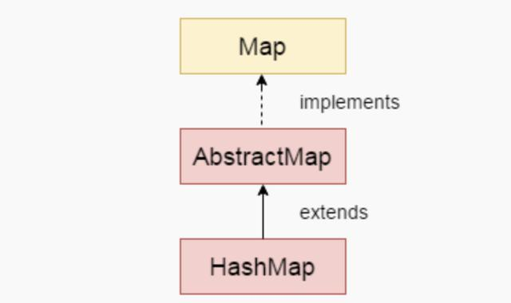


说一句很废的话，HashMap 是一个 Map，用来存储 key-value 的键值对，每个键都可以精确地映射到一个值，然后我们可以通过这个键快速地找到对应的值。

对于一个 List 来说，如果要找到一个值，时间复杂度为 ，如果 List 排序过的话，时间复杂度可以降低到 （二分查找法），但如果是 Map 的话，大多数情况下，时间复杂度能够降低到 。

来看一下 HashMap 的特点：

- HashMap 的键必须是唯一的，不能重复。
- HashMap 的键允许为 null，但只能有一个这样的键；值可以有多个 null。
- HashMap 是无序的，它不保证元素的任何特定顺序。
- HashMap 不是线程安全的；多线程环境下，建议使用 ConcurrentHashMap，或者使用 Collections.synchronizedMap(HashMap) 将 HashMap 转成线程同步的。
- 只能使用关联的键来获取值。
- HashMap 只能存储对象，所以基本数据类型应该使用其包装器类型，比如说 int 应该为 Integer。
- HashMap 实现了 Cloneable 和 Serializable 接口，因此可以拷贝和序列化。

### **01、HashMap 的重要字段**

HashMap 有 5 个非常重要的字段，我们来了解一下。（JDK 版本为 14）

```java
transient Node<K,V>[] table;
transient int size;
transient int modCount;
int threshold;
final float loadFactor;
```

1）table 是一个 Node 类型的数组，默认长度为 16，在第一次执行 resize() 方法的时候初始化。

```java
static final int DEFAULT_INITIAL_CAPACITY = 1 << 4; // aka 16
final HashMap.Node<K,V>[] resize() {    
    newCap = DEFAULT_INITIAL_CAPACITY;    
    Node<K,V>[] newTab = (Node<K,V>[])new Node[newCap];
}
```

Node 是 HashMap 的一个内部类，实现了 Map.Entry 接口，本质上是一个键值对。

```java
static class Node<K,V> implements Map.Entry<K,V> {    
    final int hash;    
    final K key;    
    V value;    
    HashMap.Node<K,V> next;    
    Node(int hash, K key, V value, HashMap.Node<K,V> next) {        
        ...    
    }    
    public final K getKey() { return key; }    
    public final V getValue() { return value; }    
    public final String toString() { return key + "=" + value; }    
    public final int hashCode() {  
        ...    
    }    
    public final V setValue(V newValue) {        
        ...    
    }    
    public final boolean equals(Object o) {        
        ...   
    }
}
```

2）size 就是 HashMap 中实际存储的键值对数量，它和 table 的 length 是有区别的。

为了说明这一点，我们来看下面这段代码：

```java
HashMap<String,Integer> map = new HashMap<>();
map.put("1", 1);
```

声明一个 HashMap，然后 put 一个键值对。在 put() 方法处打一个断点后进入，等到该方法临近结束的时候加一个 watch（table.length），然后就可以观察到如下结果。


也就是说，数组的大小为 16，但 HashMap 的大小为 1。

3）modCount 主要用来记录 HashMap 实际操作的次数，以便迭代器在执行 remove() 等操作的时候快速抛出 ConcurrentModificationException，因为 HashMap 和 ArrayList 一样，也是 fail-fast 的。

关于 ConcurrentModificationException 的更多信息，请点击下面的链接查看 03 小节的内容。

4）threshold 用来判断 HashMap 所能容纳的最大键值对数量，它的值等于数组大小 * 负载因子。默认情况下为 12（16 * 0.75），也就是第一次执行 resize() 方法的时候。

```java
static final int DEFAULT_INITIAL_CAPACITY = 1 << 4; // aka 16
static final float DEFAULT_LOAD_FACTOR = 0.75f;
final HashMap.Node<K,V>[] resize() {    
    newThr = (int)(DEFAULT_LOAD_FACTOR * DEFAULT_INITIAL_CAPACITY);
}
```

5）loadFactor 为负载因子，默认的 0.75 是对空间和时间效率上的一个平衡选择，一般不建议修改，像我这种工作了十多年的老菜鸟，就从来没有修改过这个值。

### **02、HashMap 的 hash 算法**

Hash，一般译作“散列”，也有直接音译为“哈希”的，这玩意什么意思呢？就是把任意长度的数据通过一种算法映射到固定长度的域上（散列值）。

再直观一点，就是对一串数据 wang 进行杂糅，输出另外一段固定长度的数据 er——作为数据 wang 的特征。我们通常用一串指纹来映射某一个人，别小瞧手指头那么大点的指纹，在你所处的范围内很难找出第二个和你相同的（人的散列算法也好厉害，有没有？）。

对于任意两个不同的数据块，其散列值相同的可能性极小，也就是说，对于一个给定的数据块，找到和它散列值相同的数据块极为困难。再者，对于一个数据块，哪怕只改动它的一个比特位，其散列值的改动也会非常的大——这正是 Hash 存在的价值！

同学们已经知道了，HashMap 的底层数据结构是一个数组，那不管是增加、删除，还是查找键值对，定位到数组的下表非常关键。

那 HashMap 是通过什么样的方法来定位下标呢？

第一步，hash() 方法：

```java
static final int hash(Object key) {    
    int h;    
    return (key == null) ? 0 : (h = key.hashCode()) ^ (h >>> 16);
}
```

第二步，putVal() 方法中的一行代码：

```java
n = (tab = resize()).length;
i = (n - 1) & hash;
```

为了更容易理解，我把这两步的方法合并到了一起：

```java
String [] keys = {"沉","默","王","二"};
for (String k : keys) {    
    int hasCode = k.hashCode();    
    int right = hasCode >>> 16;    
    int hash = hasCode ^ right;    
    int i = (16 - 1) & hash;   
    System.out.println(hash + " 下标：" + i);
}
```

1）k.hashCode() 用来计算键的 hashCode 值。对于任意给定的对象，只要它的hashCode() 返回值是相同，那么 hash() 方法计算得到的 Hash 码就总是相同的。

要能够做到这一点，就要求作为键的对象必须是不可变的，并且 hashCode() 方法要足够的巧妙，能够最大可能返回不重复的 hashCode 值，比如说 String 类。

```java
public int hashCode() {    
    int h = hash;    
    if (h == 0 && value.length > 0) {        
        char val[] = value;        
        for (int i = 0; i < value.length; i++) {            
            h = 31 * h + val[i];        
        }        
        hash = h;    
    }    
    return h;
}
```

2）>>> 为无符号右移运算符，高位补 0，移多少位补多少个 0。

3）^ 为异或运算符，其运算规则为 1^0 = 1、1^1 = 0、0^1 = 1、0^0 = 0。

4）& 为按位与运算符，运算规则是将两边的数转换为二进制位，然后运算最终值，运算规则即（两个为真才为真）1&1=1、1&0=0、0&1=0、0&0=0。

关于 >>>、^、& 运算符，涉及到二进制，本篇文章不再深入研究，感兴趣的同学可以自行研究一下。

假如四个字符串分别是"沉","默","王","二"，它们通过 hash() 方法计算后值和下标如下所示：

```java
27785 下标：940664 下标：829579 下标：1120108 下标：12
```

应该说，这样的 hash 算法非常巧妙，尤其是第二步。

> HashMap 底层数组的长度总是 2 的 n 次方，当 length 总是 2 的 n 次方式，(length - 1) & hash 运算等价于对数组的长度取模，也就是 hash%length，但是 & 比 % 具有更高的效率。

### **03、HashMap 的 put() 方法 HashMap 流程图**

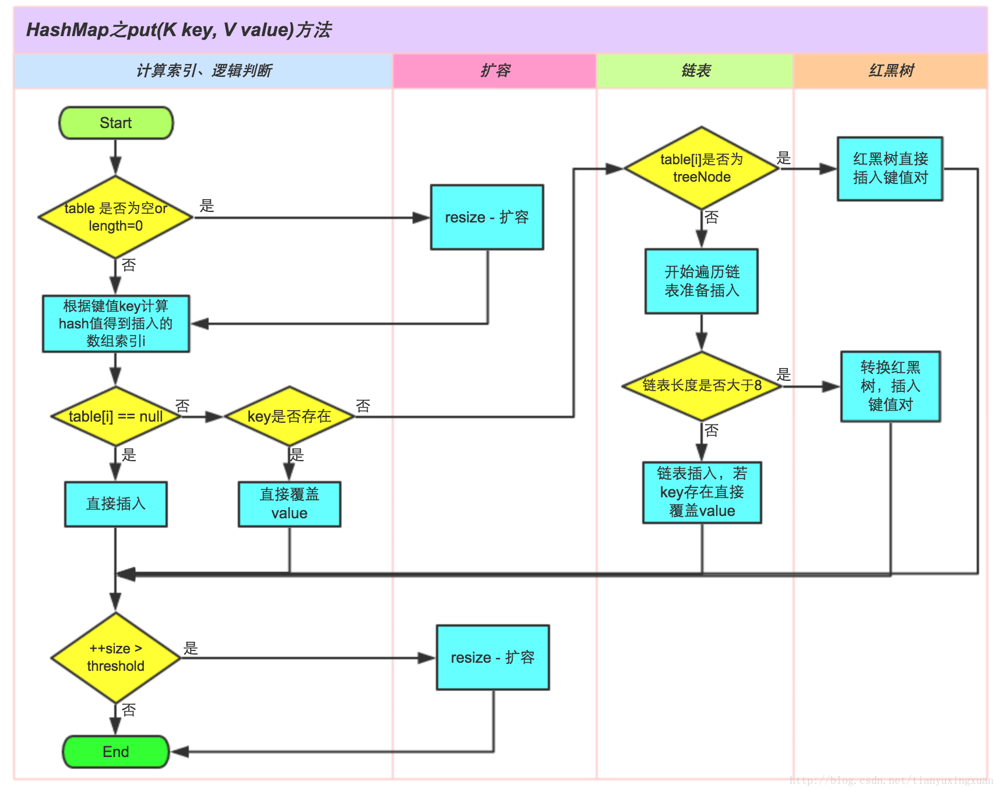

HashMap 的 hash 算法我们是明白了，但似乎有一丝疑虑，就是万一计算后的 hash 值冲突了怎么办？

比如说，“沉X”计算后的 hash 值为 27785，其下标为 9，放在了数组下标为 9 的位置上；过了一会，又来个“沉Y”计算后的 hash 值也为 27785，下标也为 9，也需要放在下标为 9 的位置上，该怎么办？

为了模拟这种情况，我们来新建一个自定义的键类。

```java
public class Key {    
    private final String value;    
    public Key(String value) {        
        this.value = value;    
    }    
    @Override    
    public boolean equals(Object o) {        
        if (this == o) 
            return true;        
        if (o == null || getClass() != o.getClass())            
            return false;        
        Key key = (Key) o;        
        return value.equals(key.value);    
    }    
    @Override    
    public int hashCode() {        
        if (value.startsWith("沉")) {            
            return "沉".hashCode();        
        }        
        return value.hashCode();    
    }
}
```

在 hashCode() 方法中，加了一个判断，如果键是以“沉”开头的话，就返回“沉”的 hashCode 值，这就意味着“沉X”和“沉Y”将会出现在数组的同一个下标上。

```java
HashMap<Key,String> map = new HashMap<>();
map.put(new Key("沉X"),"沉默王二X");
map.put(new Key("沉Y"),"沉默王二Y");
```

那紧接着来看一下 put() 方法的源码：

```java
public V put(K key, V value) {    
    return putVal(hash(key), key, value, false, true);
}
```

put() 方法会先调用 hash() 方法计算 key 的 hash 值，然后再调用内部方法 putVal()：

```java
final V putVal(int hash, K key, V value, boolean onlyIfAbsent, boolean evict) {    
    HashMap.Node<K,V>[] tab; 
    HashMap.Node<K,V> p; 
    int n, i;    
    // ①、数组 table 为 null 时，调用 resize 方法创建默认大小的数组    
    if ((tab = table) == null || (n = tab.length) == 0)       
        n = (tab = resize()).length;    
    // ②、计算下标，如果该位置上没有值，则填充    
    if ((p = tab[i = (n - 1) & hash]) == null)        
        tab[i] = newNode(hash, key, value, null);   
    else {        
        HashMap.Node<K,V> e; 
        K k;        
        // ③、如果键已经存在了，并且 hash 值相同，直接覆盖        
        if (p.hash == hash && ((k = p.key) == key || (key != null && key.equals(k))))    
            e = p;        
        // ④、红黑树处理        
        else if (p instanceof HashMap.TreeNode)           
            e = ((HashMap.TreeNode<K,V>)p).putTreeVal(this, tab, hash, key, value);        
        else {            
            // ⑤、增加链表来处理哈希冲突            
            for (int binCount = 0; ; ++binCount) {                
                if ((e = p.next) == null) {                    
                    p.next = newNode(hash, key, value, null);                    
                    // 如果链表长度大于 8 转换为红黑树处理                    
                    if (binCount >= TREEIFY_THRESHOLD - 1) 
                        // -1 for 1st                        
                        treeifyBin(tab, hash);                    
                    break;               
                }                
                // 如果键已经存在了，并且 hash 值相同，直接覆盖                
                if (e.hash == hash && ((k = e.key) == key || (key != null && key.equals(k))))                    
                    break;                
                p = e;            
            }
        }
        if (e != null) { 
            // existing mapping for key            
            V oldValue = e.value;            
            if (!onlyIfAbsent || oldValue == null)        
                e.value = value;       
            afterNodeAccess(e);          
            return oldValue;      
        }
    }   
    ++modCount;    
    // ⑥、超过容量限制，扩容   
    if (++size > threshold)    
        resize();   
    afterNodeInsertion(evict);   
    return null;
}
```

代码里我加了一些注释，同学们一定要花点时间看一下。

如果哈希冲突的话，会执行 ② 处对应的 else 语句，先判断键是否相等，相等的话直接覆盖；否则执行 ④，做红黑树处理；如果不是，会执行 ⑤，把上一个节点的 next 赋值为新的 Node。

也就是说，如果哈希冲突了，会在数组的同一个位置上增加链表，如果链表的长度大于 8，将会转化成红黑树进行处理。


以上就是大牛们嘴里常说的“链地址法”，简单点说，就是数组加链表，由于链表的查询效率比较低（时间复杂度为 ），Java 8 又追加了红黑树（时间复杂度为）。

留个小作业哈，同学们可以研究一下，当键为 null 的时候，键值对存放在什么位置上？

### **04、HashMap 的 get() 方法**

理解了 HashMap 的 hash 算法和 put() 方法，get() 方法就很容易理解。

```java
public V get(Object key) {    
    HashMap.Node<K,V> e;    
    return (e = getNode(hash(key), key)) == null ? null : e.value;
}
```

首先计算 key 的 hash 值，当 hash 值确定后，键值对在数组中的下标位置也就确定了，然后再调用 getNode() 方法：

```java
final HashMap.Node<K,V> getNode(int hash, Object key) {    
    HashMap.Node<K,V>[] tab; 
    HashMap.Node<K,V> first, e;
    int n;
    K k;   
    if ((tab = table) != null && (n = tab.length) > 0 && (first = tab[(n - 1) & hash]) != null) {  
        if (first.hash == hash && 
            // always check first node                
            ((k = first.key) == key || (key != null && key.equals(k))))        
            return first;    
        if ((e = first.next) != null) {      
            if (first instanceof HashMap.TreeNode)         
                return ((HashMap.TreeNode<K,V>)first).getTreeNode(hash, key);       
            do {               
                if (e.hash == hash && ((k = e.key) == key || (key != null && key.equals(k))))         
                    return e;           
            } while ((e = e.next) != null);    
        } 
    }
    return null;
}
```

其中 first = tab[(n - 1) & hash] 就可以快速的确定键对应的值，如果键相等并且键的 hash 相等，则直接返回；如果键的哈希冲突了，就先判断是不是红黑树，不是的话就遍历链表。

### **05、最后**

说句实在话，在写这篇文章之前，我对 HashMap 的认知并没有这么深刻，但写完这篇文章后，我敢拍着胸脯信誓旦旦地说：“HashMap 我真的掌握了，同学们谁以后再问我，就可以把这篇文章甩给他了。”

这次爬山虽然很累，但确实收获很大，值了！


# IO/NIO/AIO 相关

在我们学习Java的IO流之前，我们都要了解几个关键词

- 同步与异步（synchronous/asynchronous）：**同步**是一种可靠的有序运行机制，当我们进行同步操作时，后续的任务是等待当前调用返回，才会进行下一步；而**异步**则相反，其他任务不需要等待当前调用返回，通常依靠事件、回调等机制来实现任务间次序关系
- 阻塞与非阻塞：在进行**阻塞**操作时，当前线程会处于阻塞状态，无法从事其他任务，只有当条件就绪才能继续，比如ServerSocket新连接建立完毕，或者数据读取、写入操作完成；而**非阻塞**则是不管IO操作是否结束，直接返回，相应操作在后台继续处理

同步和异步的概念：实际的I/O操作

同步是用户线程发起I/O请求后需要等待或者轮询内核I/O操作完成后才能继续执行

异步是用户线程发起I/O请求后仍需要继续执行，当内核I/O操作完成后会通知用户线程，或者调用用户线程注册的回调函数

阻塞和非阻塞的概念：发起I/O请求

阻塞是指I/O操作需要彻底完成后才能返回用户空间

非阻塞是指I/O操作被调用后立即返回一个状态值，无需等I/O操作彻底完成


## 〇、BIO、NIO、AIO的概述

首先，传统的 java.io包，它基于流模型实现，提供了我们最熟知的一些 IO 功能，比如 File 抽象、输入输出流等。交互方式是同步、阻塞的方式，也就是说，在读取输入流或者写入输出流时，在读、写动作完成之前，线程会一直阻塞在那里，它们之间的调用是可靠的线性顺序。

java.io包的好处是代码比较简单、直观，缺点则是 IO 效率和扩展性存在局限性，容易成为应用性能的瓶颈。

很多时候，人们也把 java.net下面提供的部分网络 API，比如 Socket、ServerSocket、HttpURLConnection 也归类到同步阻塞 IO 类库，因为网络通信同样是 IO 行为。

第二，在 Java 1.4 中引入了 NIO 框架（java.nio 包），提供了 Channel、Selector、Buffer 等新的抽象，可以构建多路复用的、同步非阻塞 IO 程序，同时提供了更接近操作系统底层的高性能数据操作方式。

第三，在 Java 7 中，NIO 有了进一步的改进，也就是 NIO 2，引入了异步非阻塞 IO 方式，也有很多人叫它 AIO（Asynchronous IO）。异步 IO 操作基于事件和回调机制，可以简单理解为，应用操作直接返回，而不会阻塞在那里，当后台处理完成，操作系统会通知相应线程进行后续工作。


## 一、IO流（同步、阻塞）


### 1、概述

IO流简单来说就是input和output流，IO流主要是用来处理设备之间的数据传输，Java IO对于数据的操作都是通过流实现的，而java用于操作流的对象都在IO包中。


### 2、分类

按操作数据分为：字节流（InputStream、OutputStream）和字符流（Reader、Writer）

按流向分：输入流（Reader、InputStream）和输出流（Writer、OutputStream）


### 3、字符流

#### 概述

只用来处理文本数据

数据最常见的表现形式是文件，字符流用来操作文件的子类一般是FileReader和FileWriter

字符流读写文件注意事项：

- 写入文件必须要用flush()刷新
- 用完流记得要关闭流
- 使用流对象要抛出IO异常
- 定义文件路径时，可以用"/"或者"\"
- 在创建一个文件时，如果目录下有同名文件将被覆盖
- 在读取文件时，必须保证该文件已存在，否则抛出异常

#### 字符流的缓冲区

- 缓冲区的出现是为了提高流的操作效率而出现的
- 需要被提高效率的流作为参数传递给缓冲区的构造函数
- 在缓冲区中封装了一个数组，存入数据后一次取出


### 4、字节流

#### 概述

用来处理媒体数据

字节流读写文件注意事项：

- 字节流和字符流的基本操作是相同的，但是想要操作媒体流就需要用到字节流
- 字节流因为操作的是字节，所以可以用来操作媒体文件（媒体文件也是以字节存储的）
- 输入流（InputStream）、输出流（OutputStream）
- 字节流操作可以不用刷新流操作
- InputStream特有方法：int available()（返回文件中的字节个数）

字节流的缓冲区
字节流缓冲区跟字符流缓冲区一样，也是为了提高效率


### 5、Java Scanner类

Java 5添加了java.util.Scanner类，这是一个用于扫描输入文本的新的实用程序

#### 关于nextInt()、next()、nextLine()的理解

nextInt()：只能读取数值，若是格式不对，会抛出java.util.InputMismatchException异常

next()：遇见第一个有效字符（非空格，非换行符）时，开始扫描，当遇见第一个分隔符或结束符（空格或换行符）时，结束扫描，获取扫描到的内容

nextLine()：可以扫描到一行内容并作为字符串而被捕获到

#### 关于hasNext()、hasNextLine()、hasNextxxx()的理解

就是为了判断输入行中是否还存在xxx的意思

#### 与delimiter()有关的方法

应该是输入内容的分隔符设置


## 二、NIO（同步、非阻塞）

**NIO之所以是同步，是因为它的accept/read/write方法的内核I/O操作都会阻塞当前线程**

首先，我们要先了解一下NIO的三个主要组成部分：Channel（通道）、Buffer（缓冲区）、Selector（选择器）


### （1）Channel（通道）

Channel（通道）：Channel是一个对象，可以通过它读取和写入数据。可以把它看做是IO中的流，不同的是：

- Channel是双向的，既可以读又可以写，而流是单向的
- Channel可以进行异步的读写
- 对Channel的读写必须通过buffer对象

正如上面提到的，所有数据都通过Buffer对象处理，所以，您永远不会将字节直接写入到Channel中，相反，您是将数据写入到Buffer中；同样，您也不会从Channel中读取字节，而是将数据从Channel读入Buffer，再从Buffer获取这个字节。

因为Channel是双向的，所以Channel可以比流更好地反映出底层操作系统的真实情况。特别是在Unix模型中，底层操作系统通常都是双向的。

在Java NIO中的Channel主要有如下几种类型：

- FileChannel：从文件读取数据的
- DatagramChannel：读写UDP网络协议数据
- SocketChannel：读写TCP网络协议数据
- ServerSocketChannel：可以监听TCP连接


### （2）Buffer

Buffer是一个对象，它包含一些要写入或者读到Stream对象的。应用程序不能直接对 Channel 进行读写操作，而必须通过 Buffer 来进行，即 Channel 是通过 Buffer 来读写数据的。

在NIO中，所有的数据都是用Buffer处理的，它是NIO读写数据的中转池。Buffer实质上是一个数组，通常是一个字节数据，但也可以是其他类型的数组。但一个缓冲区不仅仅是一个数组，重要的是它提供了对数据的结构化访问，而且还可以跟踪系统的读写进程。

使用 Buffer 读写数据一般遵循以下四个步骤：

1.写入数据到 Buffer；

2.调用 flip() 方法；

3.从 Buffer 中读取数据；

4.调用 clear() 方法或者 compact() 方法。

当向 Buffer 写入数据时，Buffer 会记录下写了多少数据。一旦要读取数据，需要通过 flip() 方法将 Buffer 从写模式切换到读模式。在读模式下，可以读取之前写入到 Buffer 的所有数据。

一旦读完了所有的数据，就需要清空缓冲区，让它可以再次被写入。有两种方式能清空缓冲区：调用 clear() 或 compact() 方法。clear() 方法会清空整个缓冲区。compact() 方法只会清除已经读过的数据。任何未读的数据都被移到缓冲区的起始处，新写入的数据将放到缓冲区未读数据的后面。

Buffer主要有如下几种：

- ByteBuffer

- CharBuffer

- DoubleBuffer

- FloatBuffer

- IntBuffer

- LongBuffer

- ShortBuffer

  

#### copyFile实例（NIO）

CopyFile是一个非常好的读写结合的例子，我们将通过CopyFile这个实力让大家体会NIO的操作过程。CopyFile执行三个基本的操作：创建一个Buffer，然后从源文件读取数据到缓冲区，然后再将缓冲区写入目标文件。

```java
public static void copyFileUseNIO(String src,String dst) throws IOException{
//声明源文件和目标文件
        FileInputStream fi=new FileInputStream(new File(src));
        FileOutputStream fo=new FileOutputStream(new File(dst));
        //获得传输通道channel
        FileChannel inChannel=fi.getChannel();
        FileChannel outChannel=fo.getChannel();
        //获得容器buffer
        ByteBuffer buffer=ByteBuffer.allocate(1024);
        while(true){
            //判断是否读完文件
            int eof =inChannel.read(buffer);
            if(eof==-1){
                break;  
            }
            //重设一下buffer的position=0，limit=position
            buffer.flip();
            //开始写
            outChannel.write(buffer);
            //写完要重置buffer，重设position=0,limit=capacity
            buffer.clear();
        }
        inChannel.close();
        outChannel.close();
        fi.close();
        fo.close();
}   
```


### （3）Selector（选择器对象）

首先需要了解一件事情就是线程上下文切换开销会在高并发时变得很明显，这是同步阻塞方式的低扩展性劣势。

Selector是一个对象，它可以注册到很多个Channel上，监听各个Channel上发生的事件，并且能够根据事件情况决定Channel读写。这样，通过一个线程管理多个Channel，就可以处理大量网络连接了。

#### selector优点

有了Selector，我们就可以利用一个线程来处理所有的channels。线程之间的切换对操作系统来说代价是很高的，并且每个线程也会占用一定的系统资源。所以，对系统来说使用的线程越少越好。

#### 1.如何创建一个Selector

Selector 就是您注册对各种 I/O 事件兴趣的地方，而且当那些事件发生时，就是这个对象告诉您所发生的事件。

```java
Selector selector = Selector.open();
```

#### 2.注册Channel到Selector

为了能让Channel和Selector配合使用，我们需要把Channel注册到Selector上。通过调用 channel.register（）方法来实现注册：

```java
channel.configureBlocking(false);
SelectionKey key =channel.register(selector,SelectionKey.OP_READ);
```

注意，注册的Channel 必须设置成异步模式 才可以,否则异步IO就无法工作，这就意味着我们不能把一个FileChannel注册到Selector，因为FileChannel没有异步模式，但是网络编程中的SocketChannel是可以的。

#### 3.关于SelectionKey

请注意对register()的调用的返回值是一个SelectionKey。 SelectionKey 代表这个通道在此 Selector 上注册。当某个 Selector 通知您某个传入事件时，它是通过提供对应于该事件的 SelectionKey 来进行的。SelectionKey 还可以用于取消通道的注册。

SelectionKey中包含如下属性：

- The interest set
- The ready set
- The Channel
- The Selector
- An attached object (optional)

##### （1）Interest set

就像我们在前面讲到的把Channel注册到Selector来监听感兴趣的事件，interest set就是你要选择的感兴趣的事件的集合。你可以通过SelectionKey对象来读写interest set:

```java
int interestSet = selectionKey.interestOps();
boolean isInterestedInAccept  = interestSet & SelectionKey.OP_ACCEPT;
boolean isInterestedInConnect = interestSet & SelectionKey.OP_CONNECT;
boolean isInterestedInRead    = interestSet & SelectionKey.OP_READ;
boolean isInterestedInWrite   = interestSet & SelectionKey.OP_WRITE; 
```

通过上面例子可以看到，我们可以通过用AND 和SelectionKey 中的常量做运算，从SelectionKey中找到我们感兴趣的事件。

##### （2）Ready Set

ready set 是通道已经准备就绪的操作的集合。在一次选Selection之后，你应该会首先访问这个ready set。Selection将在下一小节进行解释。可以这样访问ready集合：

```java
int readySet = selectionKey.readyOps();
```

可以用像检测interest集合那样的方法，来检测Channel中什么事件或操作已经就绪。但是，也可以使用以下四个方法，它们都会返回一个布尔类型：

```java
selectionKey.isAcceptable();
selectionKey.isConnectable();
selectionKey.isReadable();
selectionKey.isWritable();
```

##### （3）Channel 和 Selector

我们可以通过SelectionKey获得Selector和注册的Channel：

```java
Channel  channel  = selectionKey.channel();
Selector selector = selectionKey.selector(); 
```

##### （4）Attach一个对象

可以将一个对象或者更多信息attach 到SelectionKey上，这样就能方便的识别某个给定的通道。例如，可以附加 与通道一起使用的Buffer，或是包含聚集数据的某个对象。使用方法如下：

```java
selectionKey.attach(theObject);
Object attachedObj = selectionKey.attachment();
```

还可以在用register()方法向Selector注册Channel的时候附加对象。如：

```java
SelectionKey key = channel.register(selector, SelectionKey.OP_READ, theObject);
```

#### 4.关于SelectedKeys()

**生产系统中一般会额外进行就绪状态检查**

一旦调用了select()方法，它就会返回一个数值，表示一个或多个通道已经就绪，然后你就可以通过调用selector.selectedKeys()方法返回的SelectionKey集合来获得就绪的Channel。请看演示方法：

```java
Set<SelectionKey> selectedKeys = selector.selectedKeys();
```

当你通过Selector注册一个Channel时，channel.register()方法会返回一个SelectionKey对象，这个对象就代表了你注册的Channel。这些对象可以通过selectedKeys()方法获得。你可以通过迭代这些selected key来获得就绪的Channel，下面是演示代码：

```java
Set<SelectionKey> selectedKeys = selector.selectedKeys();
Iterator<SelectionKey> keyIterator = selectedKeys.iterator();
while(keyIterator.hasNext()) {
    SelectionKey key = keyIterator.next();
    if(key.isAcceptable()) {
        // a connection was accepted by a ServerSocketChannel.
    } else if (key.isConnectable()) {
        // a connection was established with a remote server.
    } else if (key.isReadable()) {
        // a channel is ready for reading
    } else if (key.isWritable()) {
        // a channel is ready for writing
    }
    keyIterator.remove();
}
```

这个循环遍历selected key的集合中的每个key，并对每个key做测试来判断哪个Channel已经就绪。

请注意循环中最后的keyIterator.remove()方法。Selector对象并不会从自己的selected key集合中自动移除SelectionKey实例。我们需要在处理完一个Channel的时候自己去移除。当下一次Channel就绪的时候，Selector会再次把它添加到selected key集合中。

SelectionKey.channel()方法返回的Channel需要转换成你具体要处理的类型，比如是ServerSocketChannel或者SocketChannel等等。


### （4）NIO多路复用

主要步骤和元素：

- 首先，通过 Selector.open() 创建一个 Selector，作为类似调度员的角色。
- 然后，创建一个 ServerSocketChannel，并且向 Selector 注册，通过指定 SelectionKey.OP_ACCEPT，告诉调度员，它关注的是新的连接请求。
- 注意，为什么我们要明确配置非阻塞模式呢？这是因为阻塞模式下，注册操作是不允许的，会抛出 IllegalBlockingModeException 异常。
- Selector 阻塞在 select 操作，当有 Channel 发生接入请求，就会被唤醒。
- 在 具体的 方法中，通过 SocketChannel 和 Buffer 进行数据操作

IO 都是同步阻塞模式，所以需要多线程以实现多任务处理。而 NIO 则是利用了单线程轮询事件的机制，通过高效地定位就绪的 Channel，来决定做什么，仅仅 select 阶段是阻塞的，可以有效避免大量客户端连接时，频繁线程切换带来的问题，应用的扩展能力有了非常大的提高


## 三、NIO.2(异步、非阻塞)

AIO是异步IO的缩写，虽然NIO在网络操作中，提供了非阻塞的方法，但是NIO的IO行为还是同步的。对于NIO来说，我们的业务线程是在IO操作准备好时，得到通知，接着就由这个线程自行进行IO操作，IO操作本身是同步的。

但是对AIO来说，则更加进了一步，它不是在IO准备好时再通知线程，而是在IO操作已经完成后，再给线程发出通知。因此AIO是不会阻塞的，此时我们的业务逻辑将变成一个回调函数，等待IO操作完成后，由系统自动触发。

与NIO不同，当进行读写操作时，只须直接调用API的read或write方法即可。这两种方法均为异步的，对于读操作而言，当有流可读取时，操作系统会将可读的流传入read方法的缓冲区，并通知应用程序；对于写操作而言，当操作系统将write方法传递的流写入完毕时，操作系统主动通知应用程序。 即可以理解为，read/write方法都是异步的，完成后会主动调用回调函数。 在JDK1.7中，这部分内容被称作NIO.2，主要在Java.nio.channels包下增加了下面四个异步通道：

- AsynchronousSocketChannel
- AsynchronousServerSocketChannel
- AsynchronousFileChannel
- AsynchronousDatagramChannel

在AIO socket编程中，服务端通道是AsynchronousServerSocketChannel，这个类提供了一个open()静态工厂，一个bind()方法用于绑定服务端IP地址（还有端口号），另外还提供了accept()用于接收用户连接请求。在客户端使用的通道是AsynchronousSocketChannel,这个通道处理提供open静态工厂方法外，还提供了read和write方法。

在AIO编程中，发出一个事件（accept read write等）之后要指定事件处理类（回调函数），AIO中的事件处理类是CompletionHandler<V,A>，这个接口定义了如下两个方法，分别在异步操作成功和失败时被回调。

````java
void completed(V result, A attachment);
void failed(Throwable exc, A attachment);
````

