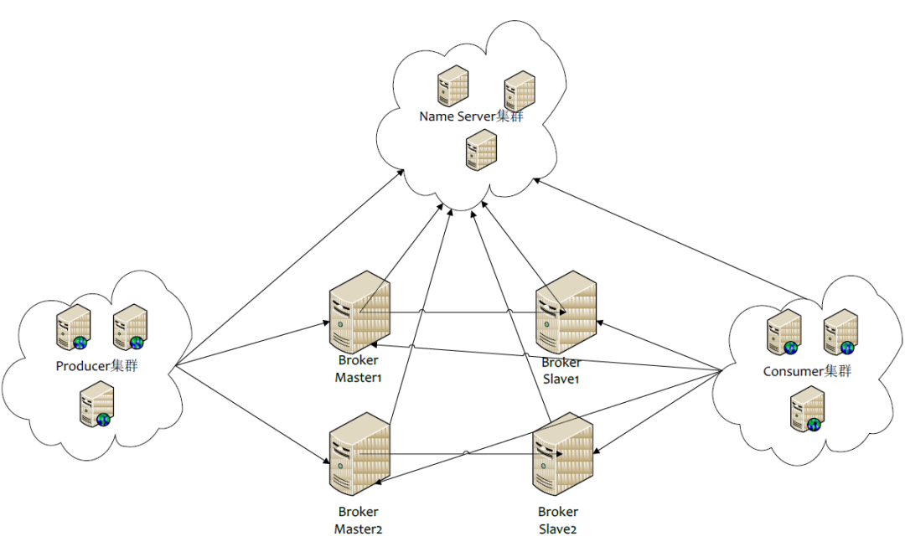
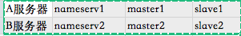
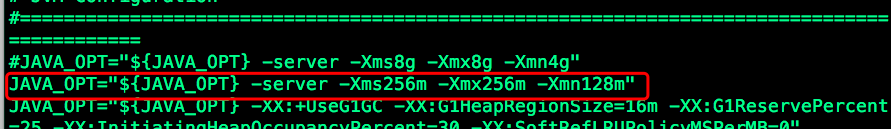
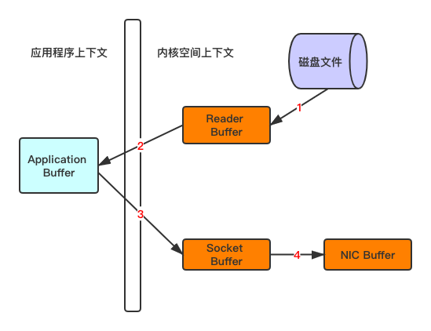
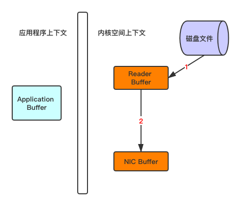
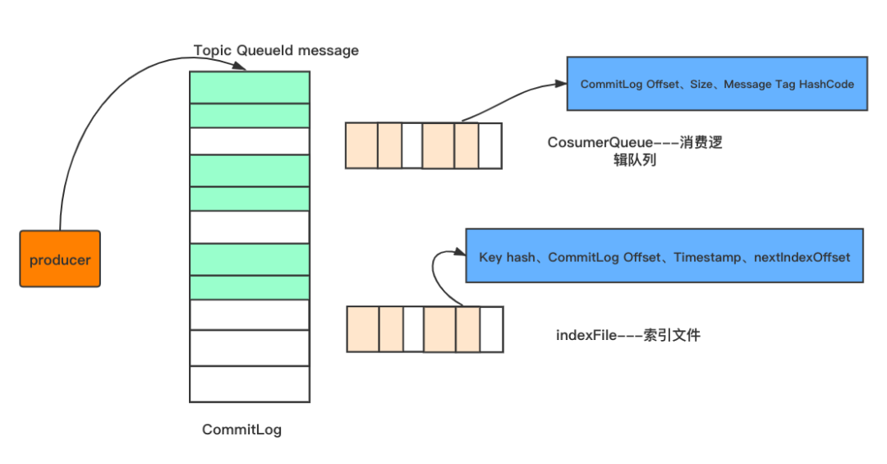

# 面经整理

### 消息队列：为什么使用，如何避免重复消费 事务消息

### 问了消息推送怎么保证可到达

### 消息队列用的啥？各种消息队列的区别

### 进程通信方法

### 削峰填谷


## Kafka

### kafka 如何保证高可用

### kafka 能否保证顺序消费

### Kafka 中的 ISR、AR 是线程间相互通信

### kafka水平扩容

### kafka原理介绍（数据存储形式，数据流程，特点，何如保证数据的高可用等）


# RocketMQ

**01.为什么要用RocketMQ？**

**02.RocketMQ的部署架构了解吗？**

**03.它有哪几种部署类型？分别有什么特点？**

**04.你自己部署过RocketMQ吗？简单说一下你当时部署的过程**

**05.rocketmq如何保证高可用性？**

**06.rocketmq的工作流程是怎样的？**

**07.RocketMQ使用哪种方式消费消息，pull还是push？**

**08.RocketMQ如何负载均衡？**

**09.RocketMQ的存储机制了解吗？**

**10.RocketMQ的存储结构是怎样的？**

**11.RocketMQ如何进行消息的去重？**

**12.RocketMQ性能比较高的原因？**


## 01. 为什么要用 RocketMQ？

总得来说，RocketMQ具有以下几个优势：

- 吞吐量高：单机吞吐量可达十万级

- 可用性高：分布式架构

- 消息可靠性高：经过参数优化配置，消息可以做到0丢失

- 功能支持完善：MQ功能较为完善，还是分布式的，扩展性好

- 支持10亿级别的消息堆积：不会因为堆积导致性能下降

- 源码是java：方便我们查看源码了解它的每个环节的实现逻辑，并针对不同的业务场景进行扩展

- 可靠性高：天生为金融互联网领域而生，对于要求很高的场景，尤其是电商里面的订单扣款，以及业务削峰，在大量交易涌入时，后端可能无法及时处理的情况

- 稳定性高：RoketMQ在上可能更值得信赖，这些业务场景在阿里双11已经经历了多次考验

  

## 02. RocketMQ 的部署架构了解吗？




这个是rocketMq的集群架构图，里面包含了四个主要部分：NameServer集群，Producer集群，Cosumer集群以及Broker集群

- NameServer 担任路由消息的提供者。生产者或消费者能够通过NameServer查找各Topic相应的Broker IP列表分别进行发送消息和消费消息。nameServer由多个无状态的节点构成，节点之间**无任何信息同步**

  Broker会定期向NameServer以发送心跳包的方式，轮询向所有NameServer注册以下元数据信息：

  **1）Broker的基本信息（ip port等）**

  **2）主题topic的地址信息**

  **3）Broker集群信息**

  **4）存活的Broker信息**

  **5）filter 过滤器**

  也就是说，每个NameServer注册的信息都是一样的，而且是当前系统中的所有Broker的元数据信息

- Producer负责生产消息，一般由业务系统负责生产消息。一个消息生产者会把业务应用系统里产生的消息发送到Broker服务器。RocketMQ提供多种发送方式，同步发送、异步发送、顺序发送、单向发送。同步和异步方式均需要Broker返回确认信息，单向发送不需要

- Broker，消息中转角色，负责存储消息、转发消息。在RocketMQ系统中负责接收从生产者发送来的消息并存储、同时为消费者的拉取请求作准备

- Consumer负责消费消息，一般是后台系统负责异步消费。一个消息消费者会从Broker服务器拉取消息、并将其提供给应用程序。从用户应用的角度而言提供了两种消费形式：拉取式消费、推动式消费

  

## 03. 它有哪几种部署类型？分别有什么特点？


RocketMQ有4种部署类型

### 1）单Master

单机模式, 即只有一个Broker，如果Broker宕机了，会导致RocketMQ服务不可用，不推荐使用

### 2）多Master模式

组成一个集群，集群每个节点都是Master节点，配置简单，性能也是最高，某节点宕机重启不会影响RocketMQ服务

缺点：如果某个节点宕机了，会导致该节点存在未被消费的消息在节点恢复之前不能被消费

### 3）多Master多Slave模式，异步复制

每个Master配置一个Slave，多对Master-Slave，Master与Slave消息采用异步复制方式。主从消息一致只会有毫秒级的延迟

优点是弥补了多Master模式（无slave）下节点宕机后在恢复前不可订阅的问题。在Master宕机后，消费者还可以从Slave节点进行消费。采用异步模式复制，提升了一定的吞吐量。总结一句就是，采用**多Master多Slave模式，异步复制模式进行部署，系统将会有较低的延迟和较高的吞吐量。**

缺点就是如果Master宕机，磁盘损坏的情况下，如果没有及时将消息复制到Slave，会导致有少量消息丢失

### 4）多Master多Slave模式，同步双写

与多Master多Slave模式，异步复制方式基本一致，唯一不同的是消息复制采用同步方式，只有master和slave都写成功以后，才会向客户端返回成功

优点：数据与服务都无单点，Master宕机情况下，消息无延迟，服务可用性与数据可用性都非常高

缺点就是会降低消息写入的效率，并影响系统的吞吐量

实际部署中，一般会根据业务场景的所需要的性能和消息可靠性等方面来选择后两种


## 04. 你自己部署过RocketMQ吗？简单说一下你当时部署的过程

由于我们项目中主要使用rocketMq做链路跟踪功能，因此需要比较高的性能，并且偶尔丢失几条消息也关系不大，所以我们就选择多Master多Slave模式，异步复制方式进行部署

部署过程简单说一下：

我部署的是双master和双slave模式集群，并部署了两个nameserver节点

1）服务器分配

分配是两台服务器，A和B，其中A服务器部署nameserv1,master1,slave2;B服务器部署nameserv2,master2和slave1节点



2）Broker的配置

分别配置rocketmq安装目录下四个配置文件：

```bash
master1:/conf/2m-2s-async/Broker-a.properties
slave2:/conf/2m-2s-async/Broker-b-s.properties
master2:/conf/2m-2s-async/Broker-b.properties
slave1:/conf/2m-2s-async/Broker-a-s.properties
```


总的思路是：

a.master节点的BrokerId为0，slave节点的BrokerId为1（大于0即可）；

b.同一组Broker的Broker-Name相同，如master1和slave1都为Broker-a;

c.每个borker节点配置相同的NameServer;

d.复制方式配置：master节点配置为ASYNC-MASTER，slave节点配置为SLAVE即可；

e.刷盘方式分为同步刷盘和异步刷盘，为了保证性能而不去考虑少量消息的丢失，因此同意配置为异步刷盘


3）启动集群

**a 检查修改参数**

启动前分别检查修改runBroker.sh和runserver.sh两个文件中的JVM参数，默认的JAVA_OPT参数的值比较大，若直接启动可能会失败，需要根据实际情况重新配置





**b 分别启动两个namerser节点
**

```
nohup sh bin/mqnamesrv > /dev/null 2>&1 &
```


**查看日志**

```zsh
tail -f ~/logs/rocketmqlogs/namesrv.log
```

**c 分别启动4个Broker节点
**

**maste1**

```
nohup sh bin/mqBroker -c 
/usr/local/rocketmq/conf/2m-2s-async/Broker-a.properties &
```

**slave1**

```
nohup sh bin/mqBroker -c 
/usr/local/rocketmq/conf/2m-2s-async/Broker-a-s.properties &
```

**maste2**

```
nohup sh bin/mqBroker -c 
/usr/local/rocketmq/conf/2m-2s-async/Broker-b.properties &
```

**slave2**

```
nohup sh bin/mqBroker -c 
/usr/local/rocketmq/conf/2m-2s-async/Broker-b-s.properties &
```

查看日志：

```
tail -f ~/logs/rocketmqlogs/Broker.log
```

**总结：**集群环境部署，主要就是以上三个步骤，需要注意的是过程中Broker配置文件的配置正确性，还需要注意一下启动前对jvm参数的检查


## 05. RocketMQ 如何保证高可用性？


1）集群化部署NameServer。Broker集群会将所有的Broker基本信息、topic信息以及两者之间的映射关系，轮询存储在每个NameServer中（也就是说每个NameServer存储的信息完全一样）。因此，NameServer集群化，不会因为其中的一两台服务器挂掉，而影响整个架构的消息发送与接收；

2）集群化部署多Broker。Producer发送消息到Broker的master，若当前的master挂掉，则会自动切换到其他的master

cosumer默认会访问Broker的master节点获取消息，那么master节点挂了之后，该怎么办呢？它就会自动切换到同一个Broker组的slave节点进行消费

那么你肯定会想到会有这样一个问题：Consumer要是直接消费slave节点，那master在宕机前没有来得及把消息同步到slave节点，那这个时候，不就会出现消费者不就取不到消息的情况了？

这样，就引出了下一个措施，来保证消息的高可用性

3）设置同步复制

前面已经提到，消息发送到Broker的master节点上，master需要将消息复制到slave节点上，rocketmq提供两种复制方式：同步复制和异步复制

异步复制，就是消息发送到master节点，只要master写成功，就直接向客户端返回成功，后续再异步写入slave节点

同步复制，就是等master和slave都成功写入内存之后，才会向客户端返回成功

那么，要保证高可用性，就需要将复制方式配置成同步复制，这样即使master节点挂了，slave上也有当前master的所有备份数据，那么不仅保证消费者消费到的消息是完整的，并且当master节点恢复之后，也容易恢复消息数据

在master的配置文件中直接配置BrokerRole：SYNC_MASTER即可

## 06. RocketMQ的工作流程是怎样的？

RocketMQ的工作流程如下：

**1）首先启动NameServer**。NameServer启动后监听端口，等待Broker、Producer以及Consumer连上来

**2）启动Broker**。启动之后，会跟所有的NameServer建立并保持一个长连接，定时发送心跳包。心跳包中包含当前Broker信息(ip、port等)、Topic信息以及Borker与Topic的映射关系

**3）创建Topic**。创建时需要指定该Topic要存储在哪些Broker上，也可以在发送消息时自动创建Topic

**4）Producer发送消息**。启动时先跟NameServer集群中的其中一台建立长连接，并从NameServer中获取当前发送的Topic所在的Broker；然后从队列列表中轮询选择一个队列，与队列所在的Broker建立长连接，进行消息的发送

**5）Consumer消费消息**。跟其中一台NameServer建立长连接，获取当前订阅Topic存在哪些Broker上，然后直接跟Broker建立连接通道，进行消息的消费


## 07. RocketMQ使用哪种方式消费消息，pull还是push？


RocketMQ提供两种方式：pull和push进行消息的消费


而RocketMQ的push方式，本质上也是采用pull的方式进行实现的。也就是说这两种方式本质上都是采用Consumer轮询从Broker拉取消息的


push方式里，Consumer把轮询过程封装了一层，并注册了MessageListener监听器。当轮询取到消息后，便唤醒MessageListener的consumeMessage()来消费，对用户而言，**感觉好像消息是被推送过来的**

其实想想，消息统一都发到了Broker，而Broker又不会主动去push消息，那么消息肯定都是需要消费者主动去拉的喽~


## 08. RocketMQ如何负载均衡？


1）Producer发送消息的负载均衡：默认会**轮询**向Topic的所有queue发送消息，以达到消息平均落到不同的queue上；而由于queue可以落在不同的Broker上，就可以发到不同Broker上（当然也可以指定发送到某个特定的queue上）


2）Consumer订阅消息的负载均衡：假设有5个队列，两个消费者，则第一个消费者消费3个队列，第二个则消费2个队列，以达到平均消费的效果。而需要注意的是，当Consumer的数量大于队列的数量的话，根据rocketMq的机制，多出来的 Consumer 不会去消费数据，因此建议Consumer的数量小于或者等于queue的数量，避免不必要的浪费


## 09. RocketMQ 的存储机制了解吗？


RocketMQ采用文件系统进行消息的存储，相对于ActiveMq采用关系型数据库进行存储的方式就更直接，性能更高了


**RocketMQ与Kafka在****写消息****与****发送消息****上，继续沿用了Kafka的这两个方面：****顺序写****和****零拷贝**


**1）顺序写**

我们知道，操作系统每次从磁盘读写数据的时候，都需要找到数据在磁盘上的地址，再进行读写。而如果是机械硬盘，寻址需要的时间往往会比较长

而一般来说，如果把数据存储在内存上面，少了寻址的过程，性能会好很多；但Kafka 的数据存储在磁盘上面，依然性能很好，这是为什么呢？

这是因为，Kafka采用的是顺序写，直接追加数据到末尾。实际上，磁盘顺序写的性能极高，在磁盘个数一定，转数一定的情况下，基本和内存速度一致

因此，磁盘的顺序写这一机制，极大地保证了Kafka本身的性能

2）零拷贝

比如：读取文件，再用socket发送出去这一过程


```
buffer = File.read
Socket.send(buffer)
```


传统方式实现：
先读取、再发送，实际会经过以下四次复制

1、将磁盘文件，读取到操作系统内核缓冲区**Read Buffer**
2、将内核缓冲区的数据，复制到应用程序缓冲区**Application Buffer**
3、将应用程序缓冲区**Application Buffer**中的数据，复制到socket网络发送缓冲区
4、将**Socket buffer**的数据，复制到**网卡**，由网卡进行网络传输



传统方式，读取磁盘文件并进行网络发送，经过的四次数据copy是非常繁琐的

重新思考传统IO方式，会注意到**在读取磁盘文件后，不需要做其他处理，直接用网络发送出去的这种场景下**，第二次和第三次数据的复制过程，不仅没有任何帮助，反而带来了巨大的开销。那么这里使用了**零拷贝**，也就是说，直接由内核缓冲区**Read Buffer**将数据复制到**网卡**，省去第二步和第三步的复制。



那么采用零拷贝的方式发送消息，必定会大大减少读取的开销，使得RocketMQ读取消息的性能有一个质的提升


此外，还需要再提一点，零拷贝技术采用了MappedByteBuffer内存映射技术，采用这种技术有一些限制，其中有一条就是传输的文件不能超过2G，这也就是为什么RocketMQ的存储消息的文件CommitLog的大小规定为1G的原因


小结：RocketMQ采用文件系统存储消息，并采用顺序写写入消息，使用零拷贝发送消息，极大得保证了RocketMQ的性能


## 10. RocketMQ 的存储结构是怎样的？


如图所示，消息生产者发送消息到Broker，都是会按照顺序存储在CommitLog文件中，每个commitLog文件的大小为1G





CommitLog-存储所有的消息元数据，包括Topic、QueueId以及message


CosumerQueue-消费逻辑队列：存储消息在CommitLog的offset


IndexFile-索引文件：存储消息的key和时间戳等信息，使得RocketMQ可以采用key和时间区间来查询消息


也就是说，rocketMq将消息均存储在CommitLog中，并分别提供了CosumerQueue和IndexFile两个索引，来快速检索消息


## 11. RocketMQ 如何进行消息的去重？


我们知道，只要通过网络交换数据，就无法避免因为网络不可靠而造成的消息重复这个问题。比如说 RocketMQ 中，当Consumer消费完消息后，因为网络问题未及时发送 ack 到 Broker，Broker 就不会删掉当前已经消费过的消息，那么，该消息将会被重复投递给消费者去消费


虽然rocketMq保证了同一个消费组只能消费一次，但会被不同的消费组重复消费，因此这种重复消费的情况不可避免


RocketMQ本身并不保证消息不重复，这样肯定会因为每次的判断，导致性能打折扣，所以它将去重操作直接放在了消费端：


1）消费端处理消息的业务逻辑保持幂等性。那么不管来多少条重复消息，可以实现处理的结果都一样

2）还可以建立一张日志表，使用消息主键作为表的主键，在处理消息前，先 insert 表，再做消息处理。这样可以避免消息重复消费


## 12. RocketMQ 性能比较高的原因？


就是前面在文件存储机制中所提到的：RocketMQ 采用文件系统存储消息，采用顺序写的方式写入消息，使用零拷贝发送消息，这三者的结合极大地保证了RocketMQ的性能


# 一、消息中间件相关知识

### 1、概述

消息队列已经逐渐成为企业IT系统内部通信的核心手段。它具有低耦合、可靠投递、广播、流量控制、最终一致性等一系列功能，成为异步RPC的主要手段之一。当今市面上有很多主流的消息中间件，如老牌的 ActiveMQ、RabbitMQ，炙手可热的 Kafka，阿里巴巴自主开发RocketMQ等。

 

### 2、消息中间件的组成

   **2.1 Broker**

消息服务器，作为server提供消息核心服务

   **2.2 Producer**

消息生产者，业务的发起方，负责生产消息传输给Broker

   **2.3 Consumer**

消息消费者，业务的处理方，负责从Broker获取消息并进行业务逻辑处理

   **2.4 Topic**

主题，发布订阅模式下的消息统一汇集地，不同生产者向topic发送消息，由MQ服务器分发到不同的订阅者，实现消息的广播

   **2.5 Queue**

队列，PTP模式下，特定生产者向特定queue发送消息，消费者订阅特定的queue完成指定消息的接收

   **2.6 Message**

消息体，根据不同通信协议定义的固定格式进行编码的数据包，来封装业务数据，实现消息的传输

 

### 3 消息中间件模式分类

   **3.1 点对点**

PTP点对点:使用queue作为通信载体 

说明： 
消息生产者生产消息发送到queue中，然后消息消费者从queue中取出并且消费消息。 
消息被消费以后，queue中不再存储，所以消息消费者不可能消费到已经被消费的消息。 Queue支持存在多个消费者，但是对一个消息而言，只会有一个消费者可以消费。

**3.2 发布/订阅**

Pub/Sub发布订阅（广播）：使用topic作为通信载体 

说明： 
消息生产者（发布）将消息发布到topic中，同时有多个消息消费者（订阅）消费该消息。和点对点方式不同，发布到topic的消息会被所有订阅者消费。

queue实现了负载均衡，将Producer生产的消息发送到消息队列中，由多个消费者消费。但一个消息只能被一个消费者接受，当没有消费者可用时，这个消息会被保存直到有一个可用的消费者。 
topic实现了发布和订阅，当你发布一个消息，所有订阅这个topic的服务都能得到这个消息，所以从1到N个订阅者都能得到一个消息的拷贝。

 

### 4 消息中间件的优势

   **4.1 系统解耦**

交互系统之间没有直接的调用关系，只是通过消息传输，故系统侵入性不强，耦合度低。

   **4.2 提高系统响应时间**

例如原来的一套逻辑，完成支付可能涉及先修改订单状态、计算会员积分、通知物流配送几个逻辑才能完成；通过MQ架构设计，就可将紧急重要（需要立刻响应）的业务放到该调用方法中，响应要求不高的使用消息队列，放到MQ队列中，供消费者处理。

   **4.3 为大数据处理架构提供服务**

通过消息作为整合，大数据的背景下，消息队列还与实时处理架构整合，为数据处理提供性能支持。

   **4.4 Java消息服务——JMS**

Java消息服务（Java Message Service，JMS）应用程序接口是一个Java平台中关于面向消息中间件（MOM）的API，用于在两个应用程序之间，或分布式系统中发送消息，进行异步通信。 
JMS中的P2P和Pub/Sub消息模式：点对点（point to point， queue）与发布订阅（publish/subscribe，topic）最初是由JMS定义的。这两种模式主要区别或解决的问题就是发送到队列的消息能否重复消费(多订阅)。

 

### 5 消息中间件应用场景

​    **5.1 异步通信**

有些业务不想也不需要立即处理消息。消息队列提供了异步处理机制，允许用户把一个消息放入队列，但并不立即处理它。想向队列中放入多少消息就放多少，然后在需要的时候再去处理它们。

   **5.2 解耦**

降低工程间的强依赖程度，针对异构系统进行适配。在项目启动之初来预测将来项目会碰到什么需求，是极其困难的。通过消息系统在处理过程中间插入了一个隐含的、基于数据的接口层，两边的处理过程都要实现这一接口，当应用发生变化时，可以独立的扩展或修改两边的处理过程，只要确保它们遵守同样的接口约束。

   **5.3 冗余**

有些情况下，处理数据的过程会失败。除非数据被持久化，否则将造成丢失。消息队列把数据进行持久化直到它们已经被完全处理，通过这一方式规避了数据丢失风险。许多消息队列所采用的”插入-获取-删除”范式中，在把一个消息从队列中删除之前，需要你的处理系统明确的指出该消息已经被处理完毕，从而确保你的数据被安全的保存直到你使用完毕。

   **5.4 扩展性**

因为消息队列解耦了你的处理过程，所以增大消息入队和处理的频率是很容易的，只要另外增加处理过程即可。不需要改变代码、不需要调节参数。便于分布式扩容。

   **5.5 过载保护**

在访问量剧增的情况下，应用仍然需要继续发挥作用，但是这样的突发流量无法提取预知；如果以为了能处理这类瞬间峰值访问为标准来投入资源随时待命无疑是巨大的浪费。使用消息队列能够使关键组件顶住突发的访问压力，而不会因为突发的超负荷的请求而完全崩溃。

   **5.6 可恢复性**

系统的一部分组件失效时，不会影响到整个系统。消息队列降低了进程间的耦合度，所以即使一个处理消息的进程挂掉，加入队列中的消息仍然可以在系统恢复后被处理。

   **5.7 顺序保证**

在大多使用场景下，数据处理的顺序都很重要。大部分消息队列本来就是排序的，并且能保证数据会按照特定的顺序来处理。

   **5.8 缓冲**

在任何重要的系统中，都会有需要不同的处理时间的元素。消息队列通过一个缓冲层来帮助任务最高效率的执行，该缓冲有助于控制和优化数据流经过系统的速度。以调节系统响应时间。

   **5.9 数据流处理**

分布式系统产生的海量数据流，如：业务日志、监控数据、用户行为等，针对这些数据流进行实时或批量采集汇总，然后进行大数据分析是当前互联网的必备技术，通过消息队列完成此类数据收集是最好的选择。

 

### 6 消息中间件常用协议

   **6.1 AMQP协议**

AMQP即Advanced Message Queuing Protocol,一个提供统一消息服务的应用层标准高级消息队列协议,是应用层协议的一个开放标准,为面向消息的中间件设计。基于此协议的客户端与消息中间件可传递消息，并不受客户端/中间件不同产品，不同开发语言等条件的限制。 
优点：可靠、通用

   **6.2 MQTT协议**

MQTT（Message Queuing Telemetry Transport，消息队列遥测传输）是IBM开发的一个即时通讯协议，有可能成为物联网的重要组成部分。该协议支持所有平台，几乎可以把所有联网物品和外部连接起来，被用来当做传感器和致动器（比如通过Twitter让房屋联网）的通信协议。 
优点：格式简洁、占用带宽小、移动端通信、PUSH、嵌入式系统

   **6.3 STOMP协议**

STOMP（Streaming Text Orientated Message Protocol）是流文本定向消息协议，是一种为MOM(Message Oriented Middleware，面向消息的中间件)设计的简单文本协议。STOMP提供一个可互操作的连接格式，允许客户端与任意STOMP消息代理（Broker）进行交互。 
优点：命令模式（非topic\queue模式）

   **6.4 XMPP协议**

XMPP（可扩展消息处理现场协议，Extensible Messaging and Presence Protocol）是基于可扩展标记语言（XML）的协议，多用于即时消息（IM）以及在线现场探测。适用于服务器之间的准即时操作。核心是基于XML流传输，这个协议可能最终允许因特网用户向因特网上的其他任何人发送即时消息，即使其操作系统和浏览器不同。 
优点：通用公开、兼容性强、可扩展、安全性高，但XML编码格式占用带宽大

   **6.5 其他基于TCP/IP自定义的协议**

有些特殊框架（如：redis、kafka、zeroMq等）根据自身需要未严格遵循MQ规范，而是基于TCP\IP自行封装了一套协议，通过网络socket接口进行传输，实现了MQ的功能。

 

### 7 常见消息中间件MQ介绍

   **7.1 RocketMQ**

阿里系下开源的一款分布式、队列模型的消息中间件，原名Metaq，3.0版本名称改为RocketMQ，是阿里参照kafka设计思想使用java实现的一套mq。同时将阿里系内部多款mq产品（Notify、metaq）进行整合，只维护核心功能，去除了所有其他运行时依赖，保证核心功能最简化，在此基础上配合阿里上述其他开源产品实现不同场景下mq的架构，目前主要多用于订单交易系统。

具有以下特点：

- 能够保证严格的消息顺序
- 提供针对消息的过滤功能
- 提供丰富的消息拉取模式
- 高效的订阅者水平扩展能力
- 实时的消息订阅机制
- 亿级消息堆积能力

官方提供了一些不同于kafka的对比差异： 
https://rocketmq.apache.org/docs/motivation/

   **7.2 RabbitMQ**

使用Erlang编写的一个开源的消息队列，本身支持很多的协议：AMQP，XMPP, SMTP,STOMP，也正是如此，使的它变的非常重量级，更适合于企业级的开发。同时实现了Broker架构，核心思想是生产者不会将消息直接发送给队列，消息在发送给客户端时先在中心队列排队。对路由(Routing)，负载均衡(Load balance)、数据持久化都有很好的支持。多用于进行企业级的ESB整合。

   **7.3 ActiveMQ**

Apache下的一个子项目。使用Java完全支持JMS1.1和J2EE 1.4规范的 JMS Provider实现，少量代码就可以高效地实现高级应用场景。可插拔的传输协议支持，比如：in-VM, TCP, SSL, NIO, UDP, multicast, JGroups and JXTA transports。RabbitMQ、ZeroMQ、ActiveMQ均支持常用的多种语言客户端 C++、Java、.Net,、Python、 Php、 Ruby等。

   **7.4 Redis**

使用C语言开发的一个Key-Value的NoSQL数据库，开发维护很活跃，虽然它是一个Key-Value数据库存储系统，但它本身支持MQ功能，所以完全可以当做一个轻量级的队列服务来使用。对于RabbitMQ和Redis的入队和出队操作，各执行100万次，每10万次记录一次执行时间。测试数据分为128Bytes、512Bytes、1K和10K四个不同大小的数据。实验表明：入队时，当数据比较小时Redis的性能要高于RabbitMQ，而如果数据大小超过了10K，Redis则慢的无法忍受；出队时，无论数据大小，Redis都表现出非常好的性能，而RabbitMQ的出队性能则远低于Redis。

   **7.5 Kafka**

Apache下的一个子项目，使用scala实现的一个高性能分布式Publish/Subscribe消息队列系统，具有以下特性：

- 快速持久化：通过磁盘顺序读写与零拷贝机制，可以在O(1)的系统开销下进行消息持久化；
- 高吞吐：在一台普通的服务器上既可以达到10W/s的吞吐速率；
- 高堆积：支持topic下消费者较长时间离线，消息堆积量大；
- 完全的分布式系统：Broker、Producer、Consumer都原生自动支持分布式，依赖zookeeper自动实现复杂均衡；
- 支持Hadoop数据并行加载：对于像Hadoop的一样的日志数据和离线分析系统，但又要求实时处理的限制，这是一个可行的解决方案。

   **7.6 ZeroMQ**

号称最快的消息队列系统，专门为高吞吐量/低延迟的场景开发，在金融界的应用中经常使用，偏重于实时数据通信场景。ZMQ能够实现RabbitMQ不擅长的高级/复杂的队列，但是开发人员需要自己组合多种技术框架，开发成本高。因此ZeroMQ具有一个独特的非中间件的模式，更像一个socket library，你不需要安装和运行一个消息服务器或中间件，因为你的应用程序本身就是使用ZeroMQ API完成逻辑服务的角色。但是ZeroMQ仅提供非持久性的队列，如果down机，数据将会丢失。如：Twitter的Storm中使用ZeroMQ作为数据流的传输。

ZeroMQ套接字是与传输层无关的：ZeroMQ套接字对所有传输层协议定义了统一的API接口。默认支持 进程内(inproc) ，进程间(IPC) ，多播，TCP协议，在不同的协议之间切换只要简单的改变连接字符串的前缀。可以在任何时候以最小的代价从进程间的本地通信切换到分布式下的TCP通信。ZeroMQ在背后处理连接建立，断开和重连逻辑。

特性：

- 无锁的队列模型：对于跨线程间的交互（用户端和session）之间的数据交换通道pipe，采用无锁的队列算法CAS；在pipe的两端注册有异步事件，在读或者写消息到pipe的时，会自动触发读写事件。
- 批量处理的算法：对于批量的消息，进行了适应性的优化，可以批量的接收和发送消息。
- 多核下的线程绑定，无须CPU切换：区别于传统的多线程并发模式，信号量或者临界区，zeroMQ充分利用多核的优势，每个核绑定运行一个工作者线程，避免多线程之间的CPU切换开销。

 

# 二、主要消息中间件的比较

 


**综合选择RabbitMq** 