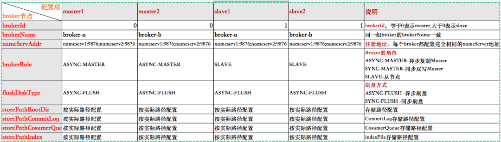
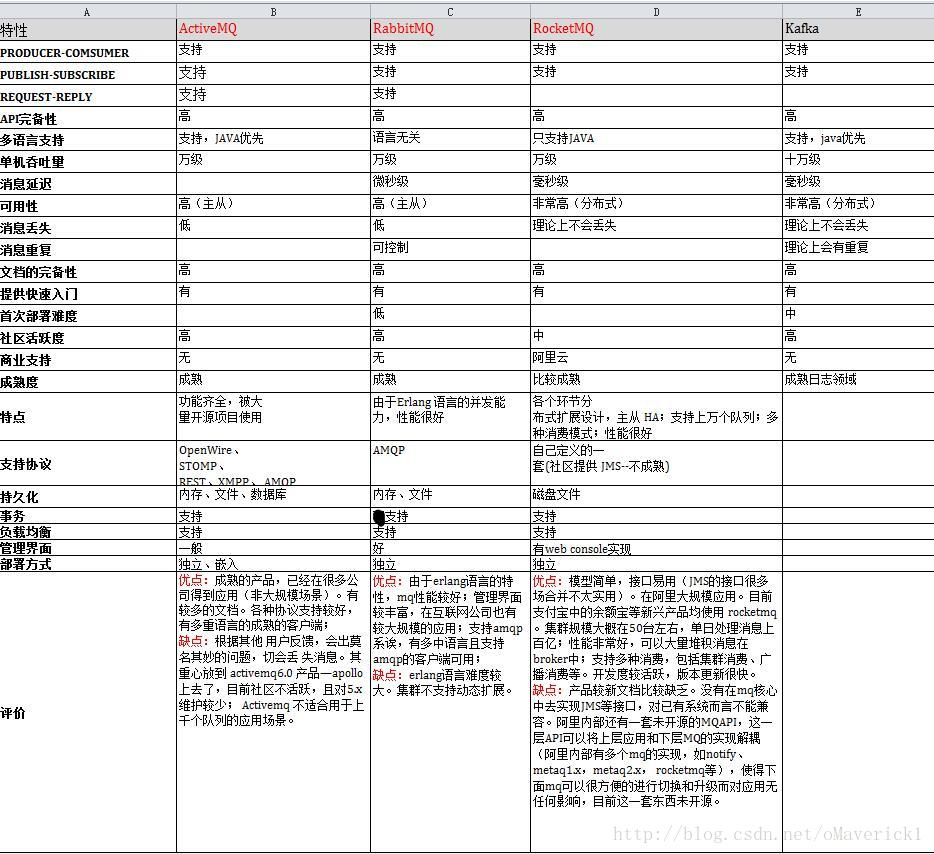

# 面经整理

### 消息队列：为什么使用，如何避免重复消费 事务消息

### 问了消息推送怎么保证可到达

### 消息队列用的啥？各种消息队列的区别

### 进程通信方法

### 削峰填谷


## Kafka

### kafka 如何保证高可用

### kafka 能否保证顺序消费

### Kafka 中的 ISR、AR 是线程间相互通信

### kafka水平扩容

### kafka原理介绍（数据存储形式，数据流程，特点，何如保证数据的高可用等）


# RocketMQ

https://zhuanlan.zhihu.com/p/93602392


**01.为什么要用RocketMQ？**

**02.RocketMQ 的部署架构了解吗？**

**03.它有哪几种部署类型？分别有什么特点？**

**04.你自己部署过 RocketMQ 吗？简单说一下你当时部署的过程**

**05.RocketMQ 如何保证高可用性？**

**06.RocketMQ 的工作流程是怎样的？**

**07.RocketMQ 使用哪种方式消费消息，pull 还是 push？**

**08.RocketMQ 如何负载均衡？**

**09.RocketMQ 的存储机制了解吗？**

**10.RocketMQ 的存储结构是怎样的？**

**11.RocketMQ 如何进行消息的去重？**

**12.RocketMQ 性能比较高的原因？**


## 01. 为什么要用 RocketMQ？

总得来说，RocketMQ具有以下几个优势：

- 吞吐量高：单机吞吐量可达十万级

- 可用性高：分布式架构

- 消息可靠性高：经过参数优化配置，消息可以做到0丢失

- 功能支持完善：MQ功能较为完善，还是分布式的，扩展性好

- 支持10亿级别的消息堆积：不会因为堆积导致性能下降

- 源码是 Java：方便我们查看源码了解它的每个环节的实现逻辑，并针对不同的业务场景进行扩展

- 可靠性高：天生为金融互联网领域而生，对于要求很高的场景，尤其是电商里面的订单扣款，以及业务削峰，在大量交易涌入时，后端可能无法及时处理的情况

- 稳定性高：RoketMQ 在上可能更值得信赖，这些业务场景在阿里双11已经经历了多次考验

  

## 02. RocketMQ 的部署架构了解吗？


这个是RocketMQ的集群架构图，里面包含了四个主要部分：NameServer 集群，Producer 集群，Cosumer 集群以及 Broker 集群

- NameServer 担任路由消息的提供者。生产者或消费者能够通过 NameServer 查找各 Topic 相应的 Broker IP 列表分别进行发送消息和消费消息。NameServer 由多个无状态的节点构成，节点之间**无任何信息同步**

  Broker 会定期向 NameServer 以发送心跳包的方式，轮询向所有 NameServer 注册以下元数据信息：

  **1）Broker 的基本信息（IP port 等）**

  **2）主题 topic 的地址信息**

  **3）Broker 集群信息**

  **4）存活的 Broker 信息**

  **5）filter 过滤器**

  也就是说，每个 NameServer 注册的信息都是一样的，而且是当前系统中的所有 Broker 的元数据信息

- Producer 负责生产消息，一般由业务系统负责生产消息。一个消息生产者会把业务应用系统里产生的消息发送到 Broker 服务器。RocketMQ 提供多种发送方式，同步发送、异步发送、顺序发送、单向发送。同步和异步方式均需要 Broker 返回确认信息，单向发送不需要

- Broker，消息中转角色，负责存储消息、转发消息。在 RocketMQ 系统中负责接收从生产者发送来的消息并存储、同时为消费者的拉取请求作准备。

- Consumer 负责消费消息，一般是后台系统负责异步消费。一个消息消费者会从 Broker 服务器拉取消息、并将其提供给应用程序。从用户应用的角度而言提供了两种消费形式：拉取式消费、推动式消费

  

## 03. 它有哪几种部署类型？分别有什么特点？


RocketMQ 有4种部署类型

### 1）单 Master

单机模式, 即只有一个 Broker，如果 Broker 宕机了，会导致 RocketMQ 服务不可用，不推荐使用

### 2）多 Master  模式

组成一个集群，集群每个节点都是Master节点，配置简单，性能也是最高，某节点宕机重启不会影响 RocketMQ 服务

缺点：如果某个节点宕机了，会导致该节点存在未被消费的消息在节点恢复之前不能被消费

### 3）多 Master 多 Slave 模式，异步复制

每个 Master 配置一个Slave，多对 Master-Slave，Master 与 Slave 消息采用异步复制方式。主从消息一致只会有毫秒级的延迟。

优点是弥补了多Master模式（无slave）下节点宕机后在恢复前不可订阅的问题。在Master宕机后，消费者还可以从Slave节点进行消费。采用异步模式复制，提升了一定的吞吐量。总结一句就是，采用**多Master多Slave模式，异步复制模式进行部署，系统将会有较低的延迟和较高的吞吐量。**

缺点就是如果Master宕机，磁盘损坏的情况下，如果没有及时将消息复制到Slave，会导致有少量消息丢失

### 4）多 Master 多 Slave 模式，同步双写

与多 Master 多 Slave 模式，异步复制方式基本一致，唯一不同的是消息复制采用同步方式，只有master和slave都写成功以后，才会向客户端返回成功

优点：数据与服务都无单点，Master宕机情况下，消息无延迟，服务可用性与数据可用性都非常高

缺点就是会降低消息写入的效率，并影响系统的吞吐量

实际部署中，一般会根据业务场景的所需要的性能和消息可靠性等方面来选择后两种


## 04. 你自己部署过 RocketMQ 吗？简单说一下你当时部署的过程

由于我们项目中主要使用RocketMQ做链路跟踪功能，因此需要比较高的性能，并且偶尔丢失几条消息也关系不大，所以我们就选择多Master多Slave模式，异步复制方式进行部署

部署过程简单说一下：

我部署的是双master和双slave模式集群，并部署了两个NameServer节点

1）服务器分配

分配是两台服务器，A和B，其中A服务器部署nameserv1,master1,slave2;B服务器部署nameserv2,master2和slave1节点


2）Broker的配置

分别配置RocketMQ安装目录下四个配置文件：

```bash
master1:/conf/2m-2s-async/Broker-a.properties
slave2:/conf/2m-2s-async/Broker-b-s.properties
master2:/conf/2m-2s-async/Broker-b.properties
slave1:/conf/2m-2s-async/Broker-a-s.properties
```




总的思路是：

a.master节点的BrokerId为0，slave节点的BrokerId为1（大于0即可）；

b.同一组Broker的Broker-Name相同，如master1和slave1都为Broker-a;

c.每个borker节点配置相同的NameServer;

d.复制方式配置：master节点配置为ASYNC-MASTER，slave节点配置为SLAVE即可；

e.刷盘方式分为同步刷盘和异步刷盘，为了保证性能而不去考虑少量消息的丢失，因此同意配置为异步刷盘


3）启动集群

**a 检查修改参数**

启动前分别检查修改runBroker.sh和runserver.sh两个文件中的JVM参数，默认的JAVA_OPT参数的值比较大，若直接启动可能会失败，需要根据实际情况重新配置


**b 分别启动两个namerser节点
**

```
nohup sh bin/mqnamesrv > /dev/null 2>&1 &
```


**查看日志**

```zsh
tail -f ~/logs/RocketMQlogs/namesrv.log
```

**c 分别启动4个Broker节点
**

**maste1**

```
nohup sh bin/mqBroker -c 
/usr/local/RocketMQ/conf/2m-2s-async/Broker-a.properties &
```

**slave1**

```
nohup sh bin/mqBroker -c 
/usr/local/RocketMQ/conf/2m-2s-async/Broker-a-s.properties &
```

**maste2**

```
nohup sh bin/mqBroker -c 
/usr/local/RocketMQ/conf/2m-2s-async/Broker-b.properties &
```

**slave2**

```
nohup sh bin/mqBroker -c 
/usr/local/RocketMQ/conf/2m-2s-async/Broker-b-s.properties &
```

查看日志：

```
tail -f ~/logs/RocketMQlogs/Broker.log
```

**总结：**集群环境部署，主要就是以上三个步骤，需要注意的是过程中Broker配置文件的配置正确性，还需要注意一下启动前对jvm参数的检查


## 05. RocketMQ 如何保证高可用性？


1）集群化部署 NameServer。Broker 集群会将所有的 Broker 基本信息、topic 信息以及两者之间的映射关系，轮询存储在每个 NameServer中（也就是说每个 NameServer 存储的信息完全一样）。因此，NameServer 集群化，不会因为其中的一两台服务器挂掉，而影响整个架构的消息发送与接收；

2）集群化部署多 Broker。Producer 发送消息到 Broker 的 master，若当前的 master 挂掉，则会自动切换到其他的 master。

cosumer 默认会访问 Broker 的 master 节点获取消息，那么 master 节点挂了之后，该怎么办呢？它就会自动切换到同一个 Broker 组的 slave 节点进行消费

那么你肯定会想到会有这样一个问题：Consumer 要是直接消费 slave 节点，那 master 在宕机前没有来得及把消息同步到 slave 节点，那这个时候，不就会出现消费者不就取不到消息的情况了？

这样，就引出了下一个措施，来保证消息的高可用性

3）设置同步复制

前面已经提到，消息发送到 Broker 的 master 节点上，master 需要将消息复制到 slave 节点上，RocketMQ 提供两种复制方式：同步复制和异步复制

异步复制，就是消息发送到 master 节点，只要 master 写成功，就直接向客户端返回成功，后续再异步写入 slave 节点

同步复制，就是等 master 和 slave 都成功写入内存之后，才会向客户端返回成功

那么，要保证高可用性，就需要将复制方式配置成同步复制，这样即使 master 节点挂了，slave 上也有当前 master 的所有备份数据，那么不仅保证消费者消费到的消息是完整的，并且当 master 节点恢复之后，也容易恢复消息数据

在 master 的配置文件中直接配置 BrokerRole：SYNC_MASTER 即可。


## 06. RocketMQ 的工作流程是怎样的？

RocketMQ的工作流程如下：

**1）首先启动 NameServer**。NameServer 启动后监听端口，等待 Broker、Producer 以及 Consumer 连上来

**2）启动 Broker**。启动之后，会跟所有的 NameServer 建立并保持一个长连接，定时发送心跳包。心跳包中包含当前 Broker 信息( IP、port 等)、Topic 信息以及 Borker 与 Topic 的映射关系

**3）创建 Topic**。创建时需要指定该 Topic 要存储在哪些 Broker 上，也可以在发送消息时自动创建 Topic。

**4）Producer 发送消息**。启动时先跟 NameServer 集群中的其中一台建立长连接，并从 NameServer 中获取当前发送的 Topic 所在的 Broker；然后从队列列表中轮询选择一个队列，与队列所在的 Broker 建立长连接，进行消息的发送

**5）Consumer 消费消息**。跟其中一台 NameServer 建立长连接，获取当前订阅 Topic 存在哪些 Broker 上，然后直接跟 Broker 建立连接通道，进行消息的消费


## 07. RocketMQ 使用哪种方式消费消息，pull 还是 push？

RocketMQ 提供两种方式：pull 和 push 进行消息的消费


而 RocketMQ 的 push 方式，本质上也是采用 pull 的方式进行实现的。也就是说这两种方式本质上都是采用 Consumer 轮询从 Broker 拉取消息的

push 方式里，Consumer 把轮询过程封装了一层，并注册了 MessageListener 监听器。当轮询取到消息后，便唤醒 MessageListener 的 consumeMessage()来消费，对用户而言，**感觉好像消息是被推送过来的**

其实想想，消息统一都发到了Broker，而Broker又不会主动去push消息，那么消息肯定都是需要消费者主动去拉的喽~


## 08. RocketMQ 如何负载均衡？


1）Producer 发送消息的负载均衡：默认会**轮询**向 Topic 的所有 queue 发送消息，以达到消息平均落到不同的 queue 上；而由于 queue 可以落在不同的 Broker 上，就可以发到不同 Broker 上（当然也可以指定发送到某个特定的 queue 上）


2）Consumer 订阅消息的负载均衡：假设有 5 个队列，两个消费者，则第一个消费者消费 3 个队列，第二个则消费 2 个队列，以达到平均消费的效果。而需要注意的是，当 Consumer 的数量大于队列的数量的话，根据 RocketMQ 的机制，多出来的 Consumer 不会去消费数据，因此建议 Consumer 的数量小于或者等于 queue 的数量，避免不必要的浪费


## 09. RocketMQ 的存储机制了解吗？


RocketMQ 采用**文件系统**进行消息的存储，相对于 ActiveMQ 采用关系型数据库进行存储的方式就更直接，性能更高了


**RocketMQ 与 Kafka 在**写消息与发送消息上，继续沿用了 Kafka 的这两个方面：**顺序写**和**零拷贝**


**1）顺序写**

我们知道，操作系统每次从磁盘读写数据的时候，都需要找到数据在磁盘上的地址，再进行读写。而如果是机械硬盘，寻址需要的时间往往会比较长

而一般来说，如果把数据存储在内存上面，少了寻址的过程，性能会好很多；但 Kafka 的数据存储在磁盘上面，依然性能很好，这是为什么呢？

这是因为，Kafka采用的是顺序写，直接追加数据到末尾。实际上，磁盘顺序写的性能极高，在磁盘个数一定，转数一定的情况下，基本和内存速度一致

因此，磁盘的顺序写这一机制，极大地保证了Kafka 本身的性能

2）零拷贝

比如：读取文件，再用 socket 发送出去这一过程


```
buffer = File.read
Socket.send(buffer)
```


传统方式实现：
先读取、再发送，实际会经过以下四次复制

1、将磁盘文件，读取到操作系统内核缓冲区**Read Buffer**

2、将内核缓冲区的数据，复制到应用程序缓冲区**Application Buffer**

3、将应用程序缓冲区**Application Buffer**中的数据，复制到socket网络发送缓冲区

4、将**Socket buffer**的数据，复制到**网卡**，由网卡进行网络传输


传统方式，读取磁盘文件并进行网络发送，经过的四次数据 copy 是非常繁琐的

重新思考传统IO方式，会注意到**在读取磁盘文件后，不需要做其他处理，直接用网络发送出去的这种场景下**，第二次和第三次数据的复制过程，不仅没有任何帮助，反而带来了巨大的开销。那么这里使用了**零拷贝**，也就是说，直接由内核缓冲区**Read Buffer**将数据复制到**网卡**，省去第二步和第三步的复制。


那么采用零拷贝的方式发送消息，必定会大大减少读取的开销，使得 RocketMQ 读取消息的性能有一个质的提升


此外，还需要再提一点，零拷贝技术采用了 MappedByteBuffer 内存映射技术，采用这种技术有一些限制，其中有一条就是传输的文件不能超过 2G，这也就是为什么 RocketMQ 的存储消息的文件 CommitLog 的大小规定为 1G 的原因


小结：RocketMQ 采用文件系统存储消息，并采用顺序写写入消息，使用零拷贝发送消息，极大得保证了 RocketMQ 的性能


## 10. RocketMQ 的存储结构是怎样的？


如图所示，消息生产者发送消息到 Broker，都是会按照顺序存储在 CommitLog 文件中，每个 commitLog 文件的大小为 1G


CommitLog-存储所有的消息元数据，包括Topic、QueueId以及message


CosumerQueue-消费逻辑队列：存储消息在CommitLog的offset


IndexFile-索引文件：存储消息的key和时间戳等信息，使得RocketMQ可以采用key和时间区间来查询消息


也就是说，RocketMQ将消息均存储在CommitLog中，并分别提供了CosumerQueue和IndexFile两个索引，来快速检索消息


## 11. RocketMQ 如何进行消息的去重？


我们知道，只要通过网络交换数据，就无法避免因为网络不可靠而造成的消息重复这个问题。比如说 RocketMQ 中，当 Consumer 消费完消息后，因为网络问题未及时发送 ack 到 Broker，Broker 就不会删掉当前已经消费过的消息，那么，该消息将会被重复投递给消费者去消费


虽然 RocketMQ 保证了同一个消费组只能消费一次，但会被不同的消费组重复消费，因此这种重复消费的情况不可避免


RocketMQ 本身并不保证消息不重复，这样肯定会因为每次的判断，导致性能打折扣，所以它将去重操作直接放在了消费端：


1）消费端处理消息的业务逻辑保持幂等性。那么不管来多少条重复消息，可以实现处理的结果都一样

2）还可以建立一张日志表，使用消息主键作为表的主键，在处理消息前，先 insert 表，再做消息处理。这样可以避免消息重复消费


## 12. RocketMQ 性能比较高的原因？


就是前面在文件存储机制中所提到的：RocketMQ 采用文件系统存储消息，采用顺序写的方式写入消息，使用零拷贝发送消息，这三者的结合极大地保证了RocketMQ的性能


# RocketMQ 性能分析

本文主要从性能角度考虑 RocketMQ 的实现。

### 整体架构


这是网络上流行的 RocketMQ 的集群部署图。

RocketMQ 主要由 Broker、NameServer、Producer 和 Consumer 组成的一个集群。

- **NameServer**：整个集群的注册中心和配置中心，管理集群的元数据。包括 Topic 信息和路由信息、Producer 和 Consumer 的客户端注册信息、Broker 的注册信息。
- **Broker**：负责接收消息的生产和消费请求，并进行消息的持久化和消息的读取。
- **Producer**：负责生产消息。
- **Consumer**：负责消费消息。

在实际生产和消费消息的过程中，NameServer 为生产者和消费者提供 Meta 数据，以确定消息该发往哪个 Broker 或者该从哪个 Broker 拉取消息。有了 Meta 数据后，生产者和消费者就可以直接和 Broker 交互了。这种点对点的交互方式最大限度降低了消息传递的中间环节，缩短了链路耗时。

### 网络模型

RocketMQ 使用 Netty 框架实现高性能的网络传输。

### 基于 Netty 实现网络通信模块

#### **Netty 主要特点**

- 具有统一的 API，用户无需关心 NIO 的编程模型和概念。通过 Netty 的 ChannelHandler 可以对通信框架进行灵活的定制和扩展。
- Netty 封装了网络编程涉及的基本功能：拆包解包、异常检测、零拷贝传输。
- Netty 解决了 NIO 的 Epoll Bug，避免空轮询导致 CPU 的 100% 利用率。
- 支持多种 Reactor 线程模型。
- 使用范围广泛，有较好的的开源社区支持。Hadoop、Spark、Dubbo 等项目都集成 Netty。

#### **Netty 的高性能传输的体现**

- 非阻塞 IO
- Ractor 线程模型
- 零拷贝。使用 FileChannel.transfer 避免在用户态和内核态之间的拷贝操作；通过 CompositeByteBuf 组合多个 ByteBuffer；通过 slice 获取 ByteBuffer 的切片；通过 wrapper 把普通 ByteBuffer 封装成 netty.ByteBuffer。

#### RocketMQ 网络模型

RocketMQ 的 Broker 端基于 Netty 实现了主从 Reactor 模型。架构如下：


具体流程：

1. eventLoopGroupBoss 作为 acceptor 负责接收客户端的连接请求
2. eventLoopGroupSelector 负责 NIO 的读写操作
3. NettyServerHandler 读取 IO 数据，并对消息头进行解析
4. disatch 过程根据注册的消息 code 和 processsor 把不同的事件分发给不同的线程。由 processTable 维护（类型为 HashMap）

### 业务线程池隔离

RocketMQ 对 Broker 的线程池进行了精细的隔离。使得消息的生产、消费、客户端心跳、客户端注册等请求不会互相干扰。如下是各个业务执行线程池和 Broker 处理的报文类型的对应关系，从下图中我们也可以看出 Broker 的核心功能点。


#### 消息的生产

RocketMQ 支持三种消息发送方式：同步发送、异步发送和 One-Way 发送。One-Way 发送时客户端无法确定服务端消息是否投递成功，因此是不可靠的发送方式。

#### 客户端发送时序图


流程说明

1. 客户端 API 调 DefaultMQProducer 的 send 方法进行消息的发送。
2. makeSureStateOk 检查客户端的发送服务是否 ok。RocketMQ 客户端维护了一个单例的 MQClientInstance，可通过 start 和 shutdown 来管理相关的网络服务。
3. tryToFindTopicPublishInfo 用来获取 Topic 的 Meta 信息，主要是可选的 MessageQueue 列表。
4. selectOneMessageQueue 根据当前的故障容错机制，路由到一个特定的 MessageQueue。
5. sendKernelImpl 的核心方法是调用 NettyRemotingClient 的 sendMessage 方法，该方法中会根据用户选择的发送策略进行区别处理，时序图中只体现了同步发送的方式。
6. invokeSync 通过调用 Netty 的 channel.writeAndFlush 把消息的字节流发送到 TCP 的 Socket 缓冲区，至此客户端消息完成发送。

#### **三种发送方式实现上的区别**

- 同步发送：注册 ResponseFuture 到 responseTable，发送 Request 请求，并同步等待 Response 返回。
- 异步发送：注册 ResponseFuture 到 responseTable，发送 Request 请求，不需要同步等待 Response 返回，当 Response 返回后会调用注册的 Callback 方法，从而异步获取发送的结果。
- One-Way：发送 Request 请求，不需要等待 Response 返回，不需要触发 Callback 方法回调。

#### 客户端故障容错机制

MQFaultStrategy 实现了基于 RT 耗时的容错策略。当某个 Broker 的 RT 过大时，认为该 Broker 存在问题，会禁用该 Broker 一段时间。latencyMax 和 notAvailableDuration 的对应关系如下图：

latencyMaxnotAvailableDuration50L0L100L0L550L30000L1000L60000L2000L120000L3000L180000L15000L600000L

### 客户端高效发送总结

1. One-Way 的发送方式是效率最高的，不需要同步等待过程，也不需要额外 CallBack 调用开销，但是消息发送不可靠
2. MQClientInstance 的单例模式统一管理维护网络通道，发送消息前只需要做一次服务状态可用性检查即可
3. Topic 的 Meta 信息在本地建立缓存，避免每次发送消息从 NameServer 拉取 Meta 数据
4. 高效的故障容错机制，保证消息发送失败时进行快速重发

### Broker 接收消息时序图


**流程说明**

1. Broker 通过 Netty 接收 RequestCode 为 SEND_MESSAGE 的请求，并把该请求交给 SendMessageProcessor 进行处理。
2. SendMessageProcessor 先解析出 SEND_MESSAGE 报文中的消息头信息（Topic、queueId、producerGroup 等），并调用存储层进行处理。
3. putMessage 中判断当前是否满足写入条件：Broker 状态为 running；Broker 为 master 节点；磁盘状态可写（磁盘满则无法写入）；Topic 长度未超限；消息属性长度未超限；pageCache 未处于繁忙状态（pageCachebusy 的依据是 putMessage 写入 mmap 的耗时，如果耗时超过 1s，说明由于缺页导致页加载慢，此时认定 pageCache 繁忙，拒绝写入）。
4. 从 MappedFileQueue 中选择已经预热过的 MappedFile。
5. AppendMessageCallback 中执行消息的操作 doAppend，直接对 mmap 后的文件的 bytbuffer 进行写入操作。

### Broker 端对写入性能的优化

### 自旋锁减少上下文切换

RocketMQ 的 CommitLog 为了避免并发写入，使用一个 PutMessageLock。PutMessageLock 有 2 个实现版本：PutMessageReentrantLock 和 PutMessageSpinLock。

PutMessageReentrantLock 是基于 Java 的同步等待唤醒机制；PutMessageSpinLock 使用 Java 的 CAS 原语，通过自旋设值实现上锁和解锁。RocketMQ 默认使用 PutMessageSpinLock 以提高高并发写入时候的上锁解锁效率，并减少线程上下文切换次数。

### MappedFile 预热和零拷贝机制

RocketMQ 消息写入对延时敏感，为了避免在写入消息时，CommitLog 文件尚未打开或者文件尚未加载到内存引起的 load 的开销，RocketMQ 实现了文件预热机制。

Linux 系统在写数据时候不会直接把数据写到磁盘上，而是写到磁盘对应的 PageCache 中，并把该页标记为脏页。当脏页累计到一定程度或者一定时间后再把数据 flush 到磁盘（当然在此期间如果系统掉电，会导致脏页数据丢失）。RocketMQ 实现文件预热的关键代码如下：

```java
public void warmMappedFile(FlushDiskType type, int pages) {
        ByteBuffer byteBuffer = this.mappedByteBuffer.slice();
        int flush = 0;
        long time = System.currentTimeMillis();
        for (int i = 0, j = 0; i < this.fileSize; i += MappedFile.OS_PAGE_SIZE, j++) {
            byteBuffer.put(i, (byte) 0);
            // force flush when flush disk type is sync
            if (type == FlushDiskType.SYNC_FLUSH) {
                if ((i / OS_PAGE_SIZE) - (flush / OS_PAGE_SIZE) >= pages) {
                    flush = i;
                    mappedByteBuffer.force();
                }
            }
                        ...
        }
        // force flush when prepare load finished
        if (type == FlushDiskType.SYNC_FLUSH) {
            log.info("mapped file warm-up done, force to disk, mappedFile={}, costTime={}",
                this.getFileName(), System.currentTimeMillis() - beginTime);
            mappedByteBuffer.force();
        }
        this.mlock();
    }
```

**代码分析**

1. 对文件进行 mmap 映射。
2. 对整个文件每隔一个 PAGE_SIZE 写入一个字节，如果是同步刷盘，每写入一个字节进行一次强制的刷盘。
3. 调用 libc 的 mlock 函数，对文件所在的内存区域进行锁定。(系统调用 mlock 家族允许程序在物理内存上锁住它的部分或全部地址空间。这将阻止 Linux 将这个内存页调度到交换空间（swap space），即使该程序已有一段时间没有访问这段空间）。

### 同步和异步刷盘

RocketMQ 提供了同步刷盘和异步刷盘两种机制。默认使用异步刷盘机制。

当 CommitLog 在 putMessage() 中收到 MappedFile 成功追加消息到内存的结果后，便会调用 handleDiskFlush() 方法进行刷盘，将消息存储到文件中。handleDiskFlush() 便会根据两种刷盘策略，调用不同的刷盘服务。

抽象类 FlushCommitLogService 负责进行刷盘操作，该抽象类有 3 中实现：

- GroupCommitService：同步刷盘
- FlushRealTimeService：异步刷盘
- CommitRealTimeService：异步刷盘并且开启 TransientStorePool

每个实现类都是一个 ServiceThread 实现类。ServiceThread 可以看做是一个封装了基础功能的后台线程服务。有完整的生命周期管理，支持 start、shutdown、weakup、waitForRunning。

### **同步刷盘流程**

1. 所有的 flush 操作都由 GroupCommitService 线程进行处理
2. 当前接收消息的线程封装一个 GroupCommitRequest，并提交给 GroupCommitService 线程，然后当前线程进入一个 CountDownLatch 的等待
3. 一旦有新任务进来 GroupCommitService 被立即唤醒，并调用 MappedFile.flush 进行刷盘。底层是调用 mappedByteBuffer.force ()
4. flush 完成后唤醒等待中的接收消息线程。从而完成同步刷盘流程

### 异步刷盘流程

1. RocketMQ 每隔 200ms 进行一次 flush 操作（把数据持久化到磁盘）
2. 当有新的消息写入时候会主动唤醒 flush 线程进行刷盘
3. 当前接收消息线程无须等待 flush 的结果。

### 消息消费

高性能的消息队列应该保证最快的消息周转效率：即发送方发送的一条消息被 Broker 处理完之后因该尽快地投递给消息的消费方。

### 消息存储结构

RocketMQ 的存储结构最大特点：

- 所有的消息写入转为顺序写（相比于 Kafka，RocketMQ 即使对于 1w+ 以上的 Topic 也能够应付自如）
- 读写文件分离。通过 ReputMessageService 服务生成 ConsumeQueue


**结构说明**

- ConsumeQueue 与 CommitLog 不同，采用定长存储结构，如下图所示。为了实现定长存储，ConsumeQueue 存储了消息 Tag 的 Hash Code，在进行 Broker 端消息过滤时，通过比较 Consumer 订阅 Tag 的 HashCode 和存储条目中的 Tag Hash Code 是否一致来决定是否消费消息。
- ReputMessageService 持续地读取 CommitLog 文件并生成 ConsumeQueue。

### 顺序消费与并行消费

串行消费和并行消费最大的区别在于消费队列中消息的顺序性。顺序消费保证了同一个 Queue 中的消费时的顺序性。RocketMQ 的顺序性依赖于分区锁的实现。消息消费有推拉两种模式，我们这里只考虑推这种模式

### **并行消费**

1. 并行消费的实现类为 ConsumeMessageConcurrentlyService。
2. PullMessageService 内置一个 scheduledExecutorService 线程池，主要负责处理 PullRequest 请求，从 Broker 端拉取最新的消息返回给客户端。拉取到的消息会放入 MessageQueue 对应的 ProcessQueue。
3. ConsumeMessageConcurrentlyService 把收到的消息封装成一个 ConsumeRequest，投递给内置的 consumeExecutor 独立线程池进行消费。
4. ConsumeRequest 调用 MessageListener.consumeMessage 执行用户定义的消费逻辑，返回消费状态。
5. 如果消费状态为 SUCCESS。则删除 ProcessQueue 中的消息，并提交 offset。
6. 如果消费状态为 RECONSUME。则把消息发送到延时队列进行重试，并对当前失败的消息进行延迟处理。

### **串行消费**

1. 串行消费的实现类为 ConsumeMessageOrderlyService。
2. PullMessageService 内置一个 scheduledExecutorService 线程池，主要负责处理 PullRequest 请求，从 Broker 端拉取最新的消息返回给客户端。拉取到的消息会放入 MessageQueue 对应的 ProcessQueue。
3. ConsumeMessageOrderlyService 把收到的消息封装成一个 ConsumeRequest，投递给内置的 consumeExecutor 独立线程池进行消费。
4. 消费时首先获取 MessageQueue 对应的 objectLock，保证当前进程内只有一个线程在处理对应的的 MessageQueue, 从 ProcessQueue 的 **msgTreeMap 中按 offset 从低到高的顺序取消息，从而保证了消息的顺序性**。
5. ConsumeRequest 调用 MessageListener.consumeMessage 执行用户定义的消费逻辑，返回消费状态。
6. 如果消费状态为 SUCCESS。则删除 ProcessQueue 中的消息，并提交 offset。
7. 如果消费状态为 SUSPEND。判断是否达到最大重试次数，如果达到最大重试次数，就把消息投递到死信队列，继续下一条消费；否则消息重试次数 + 1，在延时一段时间后继续重试。

可见，串行消费如果某条消息一直无法消费成功会造成阻塞，严重时会引起消息堆积和关联业务异常。

### Broker 端的 PullMessage 长连接实现

消息队列中的消息是由业务触发而产生的，如果使用周期性的轮询，不能保证每次都取到消息，且轮询的频率过快或者过慢都会对消息的延时有严重的影响。因此 RockMQ 在 Broker 端使用长连接的方式处理 PullMessage 请求。具体实现流程如下：

1. PullRequest 请求中有个参数 brokerSuspendMaxTimeMillis，默认值为 15s，控制请求 hold 的时长。
2. PullMessageProcessor 接收到 Request 后，解析参数，校验 Topic 的 Meta 信息和消费者的订阅关系。对于符合要求的请求，从存储中拉取消息。
3. 如果拉取消息的结果为 PULL_NOT_FOUND，表示当前 MessageQueue 没有最新消息。
4. 此时会封装一个 PullRequest 对象，并投递给 PullRequestHoldService 内部线程的 pullRequestTable 中。
5. PullRequestHoldService 线程会周期性轮询 pullRequestTable，如果有新的消息或者 hold 时间超时 polling time，就会封装 Response 请求发给客户端。
6. 另外 DefaultMessageStore 中定义了 messageArrivingListener，当产生新的 ConsumeQueue 记录时候，会触发 messageArrivingListener 回调，立即给客户端返回最新的消息。

长连接机制使得 RocketMQ 的网络利用率非常高效，并且最大限度地降低了消息拉取时的等待开销。实现了毫秒级的消息投递。

### RocketMQ 的其他性能优化手段

### 关闭偏向锁

在 RocketMQ 的性能测试中，发现存在大量的 RevokeBias 停顿，偏向锁主要是消除无竞争情况下的同步原语以提高性能，但考虑到 RocketMQ 中该场景比较少，便通过 `- XX:-UseBiasedLocking` 关闭了偏向锁特性。

在没有实际竞争的情况下，还能够针对部分场景继续优化。如果不仅仅没有实际竞争，自始至终，使用锁的线程都只有一个，那么，维护轻量级锁都是浪费的。偏向锁的目标是，减少无竞争且只有一个线程使用锁的情况下，使用轻量级锁产生的性能消耗。轻量级锁每次申请、释放锁都至少需要一次 CAS，但偏向锁只有初始化时需要一次 CAS。

偏向锁的使用场景有局限性，只适用于单个线程使用锁的场景，如果有其他线程竞争，则偏向锁会膨胀为轻量级锁。当出现大量 RevokeBias 引起的小停顿时，说明偏向锁意义不大，此时通过 `- XX:-UseBiasedLocking` 进行优化，因此 RocketMQ 的 JVM 参数中会默认加上 `- XX:-UseBiasedLocking`。

### 写在最后

最后附上阿里中间件的延时性能对比。RocketMQ 在低延迟方面依然具有领先地位，如下图所示，RocketMQ 仅有少量 10~50ms 的毛刺延迟，Kafka 则有不少 500~1000ms 的毛刺。


# 消息中间件相关比较

## 一、消息中间件相关知识

### 1、概述

消息队列已经逐渐成为企业IT系统内部通信的核心手段。它具有低耦合、可靠投递、广播、流量控制、最终一致性等一系列功能，成为异步 RPC 的主要手段之一。当今市面上有很多主流的消息中间件，如老牌的 ActiveMQ、RabbitMQ，炙手可热的 Kafka，阿里巴巴自主开发 RocketMQ 等。

 

### 2、消息中间件的组成

   **2.1 Broker**

消息服务器，作为server提供消息核心服务

   **2.2 Producer**

消息生产者，业务的发起方，负责生产消息传输给Broker

   **2.3 Consumer**

消息消费者，业务的处理方，负责从Broker获取消息并进行业务逻辑处理

   **2.4 Topic**

主题，发布订阅模式下的消息统一汇集地，不同生产者向topic发送消息，由MQ服务器分发到不同的订阅者，实现消息的广播

   **2.5 Queue**

队列，PTP模式下，特定生产者向特定queue发送消息，消费者订阅特定的queue完成指定消息的接收

   **2.6 Message**

消息体，根据不同通信协议定义的固定格式进行编码的数据包，来封装业务数据，实现消息的传输

 

### 3 消息中间件模式分类

   **3.1 点对点**

PTP点对点:使用queue作为通信载体


说明： 
消息生产者生产消息发送到queue中，然后消息消费者从queue中取出并且消费消息。 
消息被消费以后，queue中不再存储，所以消息消费者不可能消费到已经被消费的消息。 Queue支持存在多个消费者，但是对一个消息而言，只会有一个消费者可以消费。

**3.2 发布/订阅**

Pub/Sub发布订阅（广播）：使用topic作为通信载体


说明： 
消息生产者（发布）将消息发布到topic中，同时有多个消息消费者（订阅）消费该消息。和点对点方式不同，发布到topic的消息会被所有订阅者消费。

queue实现了负载均衡，将Producer生产的消息发送到消息队列中，由多个消费者消费。但一个消息只能被一个消费者接受，当没有消费者可用时，这个消息会被保存直到有一个可用的消费者。 
topic实现了发布和订阅，当你发布一个消息，所有订阅这个topic的服务都能得到这个消息，所以从1到N个订阅者都能得到一个消息的拷贝。

 

### 4 消息中间件的优势

   **4.1 系统解耦**

交互系统之间没有直接的调用关系，只是通过消息传输，故系统侵入性不强，耦合度低。

   **4.2 提高系统响应时间**

例如原来的一套逻辑，完成支付可能涉及先修改订单状态、计算会员积分、通知物流配送几个逻辑才能完成；

通过MQ架构设计，就可将紧急重要（需要立刻响应）的业务放到该调用方法中，响应要求不高的使用消息队列，放到MQ队列中，供消费者处理。

   **4.3 为大数据处理架构提供服务**

通过消息作为整合，大数据的背景下，消息队列还与实时处理架构整合，为数据处理提供性能支持。

   **4.4 Java消息服务——JMS**

Java 消息服务（Java Message Service，JMS）应用程序接口是一个 Java 平台中关于面向消息中间件（MOM）的 API，用于在两个应用程序之间，或分布式系统中发送消息，进行异步通信。 

JMS中的 P2P 和 Pub/Sub 消息模式：点对点（point to point， queue）与发布订阅（publish/subscribe，topic）最初是由 JMS 定义的。

这两种模式主要区别或解决的问题就是发送到队列的消息能否重复消费(多订阅)。

 

### 5 消息中间件应用场景

​    **5.1 异步通信**

有些业务不想也不需要立即处理消息。消息队列提供了异步处理机制，允许用户把一个消息放入队列，但并不立即处理它。想向队列中放入多少消息就放多少，然后在需要的时候再去处理它们。

   **5.2 解耦**

降低工程间的强依赖程度，针对异构系统进行适配。在项目启动之初来预测将来项目会碰到什么需求，是极其困难的。通过消息系统在处理过程中间插入了一个隐含的、基于数据的接口层，两边的处理过程都要实现这一接口，当应用发生变化时，可以独立的扩展或修改两边的处理过程，只要确保它们遵守同样的接口约束。

   **5.3 冗余**

有些情况下，处理数据的过程会失败。除非数据被持久化，否则将造成丢失。消息队列把数据进行持久化直到它们已经被完全处理，通过这一方式规避了数据丢失风险。许多消息队列所采用的”插入-获取-删除”范式中，在把一个消息从队列中删除之前，需要你的处理系统明确的指出该消息已经被处理完毕，从而确保你的数据被安全的保存直到你使用完毕。

   **5.4 扩展性**

因为消息队列解耦了你的处理过程，所以增大消息入队和处理的频率是很容易的，只要另外增加处理过程即可。不需要改变代码、不需要调节参数。便于分布式扩容。

   **5.5 过载保护**

在访问量剧增的情况下，应用仍然需要继续发挥作用，但是这样的突发流量无法提取预知；如果以为了能处理这类瞬间峰值访问为标准来投入资源随时待命无疑是巨大的浪费。使用消息队列能够使关键组件顶住突发的访问压力，而不会因为突发的超负荷的请求而完全崩溃。

   **5.6 可恢复性**

系统的一部分组件失效时，不会影响到整个系统。消息队列降低了进程间的耦合度，所以即使一个处理消息的进程挂掉，加入队列中的消息仍然可以在系统恢复后被处理。

   **5.7 顺序保证**

在大多使用场景下，数据处理的顺序都很重要。大部分消息队列本来就是排序的，并且能保证数据会按照特定的顺序来处理。

   **5.8 缓冲**

在任何重要的系统中，都会有需要不同的处理时间的元素。消息队列通过一个缓冲层来帮助任务最高效率的执行，该缓冲有助于控制和优化数据流经过系统的速度。以调节系统响应时间。

   **5.9 数据流处理**

分布式系统产生的海量数据流，如：业务日志、监控数据、用户行为等，针对这些数据流进行实时或批量采集汇总，然后进行大数据分析是当前互联网的必备技术，通过消息队列完成此类数据收集是最好的选择。

 

### 6 消息中间件常用协议

   **6.1 AMQP 协议**

AMQP 即 Advanced Message Queuing Protocol，一个提供统一消息服务的应用层标准高级消息队列协议,是应用层协议的一个开放标准,为面向消息的中间件设计。基于此协议的客户端与消息中间件可传递消息，并不受客户端/中间件不同产品，不同开发语言等条件的限制。 

优点：可靠、通用

   **6.2 MQTT协议**

MQTT（Message Queuing Telemetry Transport，消息队列遥测传输）是IBM开发的一个即时通讯协议，有可能成为物联网的重要组成部分。该协议支持所有平台，几乎可以把所有联网物品和外部连接起来，被用来当做传感器和致动器（比如通过Twitter让房屋联网）的通信协议。 

优点：格式简洁、占用带宽小、移动端通信、PUSH、嵌入式系统

   **6.3 STOMP协议**

STOMP（Streaming Text Orientated Message Protocol）是流文本定向消息协议，是一种为MOM(Message Oriented Middleware，面向消息的中间件)设计的简单文本协议。STOMP提供一个可互操作的连接格式，允许客户端与任意STOMP消息代理（Broker）进行交互。 

优点：命令模式（非topic\queue模式）

   **6.4 XMPP协议**

XMPP（可扩展消息处理现场协议，Extensible Messaging and Presence Protocol）是基于可扩展标记语言（XML）的协议，多用于即时消息（IM）以及在线现场探测。适用于服务器之间的准即时操作。核心是基于XML流传输，这个协议可能最终允许因特网用户向因特网上的其他任何人发送即时消息，即使其操作系统和浏览器不同。 

优点：通用公开、兼容性强、可扩展、安全性高，但XML编码格式占用带宽大

   **6.5 其他基于TCP/IP自定义的协议**

有些特殊框架（如：Redis、kafka、zeroMq等）根据自身需要未严格遵循MQ规范，而是基于TCP\IP自行封装了一套协议，通过网络socket接口进行传输，实现了MQ的功能。

 

### 7 常见消息中间件MQ介绍

   **7.1 RocketMQ**

阿里系下开源的一款分布式、队列模型的消息中间件，原名Metaq，3.0版本名称改为RocketMQ，是阿里参照kafka设计思想使用java实现的一套mq。同时将阿里系内部多款mq产品（Notify、metaq）进行整合，只维护核心功能，去除了所有其他运行时依赖，保证核心功能最简化，在此基础上配合阿里上述其他开源产品实现不同场景下mq的架构，目前主要多用于订单交易系统。

具有以下特点：

- 能够保证严格的消息顺序
- 提供针对消息的过滤功能
- 提供丰富的消息拉取模式
- 高效的订阅者水平扩展能力
- 实时的消息订阅机制
- 亿级消息堆积能力

官方提供了一些不同于 kafka 的对比差异： 
https://RocketMQ.apache.org/docs/motivation/

   **7.2 RabbitMQ**

使用Erlang编写的一个开源的消息队列，本身支持很多的协议：AMQP，XMPP, SMTP,STOMP，也正是如此，使的它变的非常重量级，更适合于企业级的开发。同时实现了Broker架构，核心思想是生产者不会将消息直接发送给队列，消息在发送给客户端时先在中心队列排队。对路由(Routing)，负载均衡(Load balance)、数据持久化都有很好的支持。多用于进行企业级的ESB整合。

   **7.3 ActiveMQ**

Apache下的一个子项目。使用Java完全支持JMS1.1和J2EE 1.4规范的 JMS Provider实现，少量代码就可以高效地实现高级应用场景。可插拔的传输协议支持，比如：in-VM, TCP, SSL, NIO, UDP, multicast, JGroups and JXTA transports。RabbitMQ、ZeroMQ、ActiveMQ均支持常用的多种语言客户端 C++、Java、.Net,、Python、 Php、 Ruby等。

   **7.4 Redis**

使用C语言开发的一个Key-Value的NoSQL数据库，开发维护很活跃，虽然它是一个Key-Value数据库存储系统，但它本身支持MQ功能，所以完全可以当做一个轻量级的队列服务来使用。对于 RabbitMQ 和 Redis 的入队和出队操作，各执行100万次，每10万次记录一次执行时间。测试数据分为128Bytes、512Bytes、1K和10K四个不同大小的数据。实验表明：入队时，当数据比较小时 Redis 的性能要高于 RabbitMQ，而如果数据大小超过了 10K，Redis 则慢得无法忍受；出队时，无论数据大小，Redis 都表现出非常好的性能，而 RabbitMQ 的出队性能则远低于Redis。

   **7.5 Kafka**

Apache下的一个子项目，使用 scala 实现的一个高性能分布式 Publish/Subscribe 消息队列系统，具有以下特性：

- 快速持久化：通过磁盘顺序读写与零拷贝机制，可以在O(1)的系统开销下进行消息持久化；
- 高吞吐：在一台普通的服务器上既可以达到10W/s的吞吐速率；
- 高堆积：支持topic下消费者较长时间离线，消息堆积量大；
- 完全的分布式系统：Broker、Producer、Consumer都原生自动支持分布式，依赖zookeeper自动实现复杂均衡；
- 支持Hadoop数据并行加载：对于像Hadoop的一样的日志数据和离线分析系统，但又要求实时处理的限制，这是一个可行的解决方案。

   **7.6 ZeroMQ**

号称最快的消息队列系统，专门为高吞吐量/低延迟的场景开发，在金融界的应用中经常使用，偏重于实时数据通信场景。ZMQ能够实现RabbitMQ不擅长的高级/复杂的队列，但是开发人员需要自己组合多种技术框架，开发成本高。因此ZeroMQ具有一个独特的非中间件的模式，更像一个socket library，你不需要安装和运行一个消息服务器或中间件，因为你的应用程序本身就是使用ZeroMQ API完成逻辑服务的角色。但是ZeroMQ仅提供非持久性的队列，如果down机，数据将会丢失。如：Twitter的Storm中使用ZeroMQ作为数据流的传输。

ZeroMQ 套接字是与传输层无关的：ZeroMQ 套接字对所有传输层协议定义了统一的API接口。默认支持 进程内(inproc) ，进程间(IPC) ，多播，TCP 协议，在不同的协议之间切换只要简单的改变连接字符串的前缀。可以在任何时候以最小的代价从进程间的本地通信切换到分布式下的 TCP 通信。ZeroMQ 在背后处理连接建立，断开和重连逻辑。

特性：

- 无锁的队列模型：对于跨线程间的交互（用户端和session）之间的数据交换通道 pipe，采用无锁的队列算法 CAS；在 pipe 的两端注册有异步事件，在读或者写消息到 pipe 的时候，会自动触发读写事件。
- 批量处理的算法：对于批量的消息，进行了适应性的优化，可以批量的接收和发送消息。
- 多核下的线程绑定，无需 CPU 切换：区别于传统的多线程并发模式，信号量或者临界区，zeroMQ 充分利用多核的优势，每个核绑定运行一个工作者线程，避免多线程之间的 CPU 切换开销。

 

## 二、主要消息中间件的比较

 



**综合选择RabbitMq** 

