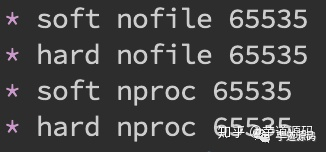
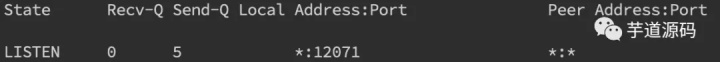
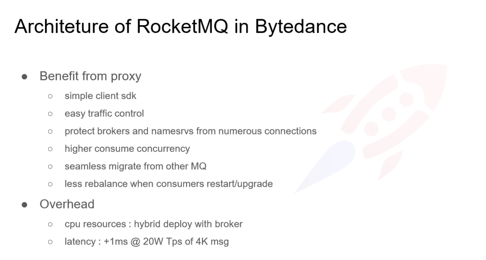

# 面经整理

## 如何查看系统性能,性能指标

## 如何查看系统负载

## 如何找项目性能瓶颈


## im里面群聊消息体设计，如何设计xx人已读xx人未读


## 描述项目的技术架构，都采用哪些技术

## 怎么做微服务拆分


## 是否遇到分布式事务，有哪些解决方案，分布式锁怎么做，用redis实现分布式锁有哪些步骤


## 自己项目结构的高并发，如何优化


## 微服务分布式事务如何实现

## 如何设计秒杀系统，应该关注什么：防恶意提交、NG限流等

## 微服务的某个节点挂了怎么办（似乎是想问调用方会怎么样）

## qps 需要你怼到20000，瓶颈在哪儿，怎么优化，如何保持一致性

## 服务降级

## 为什么采用三色标记清除？

## 微信朋友圈设计

## 项目问的比较细节，最难点是什么，如何做的。我提到了性能优化，顺便说了下利用火焰图查找性能瓶劲。然后介绍了如何提升服务的可靠性，从服务器层和模块层。提到了zookeeper组件，介绍了选主算法。

## 让设计一个秒杀系统，20分钟左右的时间。

## 先讲项目，描述项目的整体结构和执行流程，问上下游分别都会做什么。如果项目中原先依赖的某些条件不成立的话，有没有办法变通达成目标？

## 项目  抽奖怎么做

## 项目 全站活动的具体实现  

## 设计  怎么设计榜单  qps十万怎么解决

## 项目中抽奖的设计

## 设计如何保证消息的收到

## 聊一下项目设计和使用的技术点，难点和挑战在哪里？

## 服务部署结构？负责的服务发布的需要资源怎么分配？

## 结合项目问的，分布式系统中数据流转过程中怎么保证分布式系统事务一致性，涉及到mq中间件设计底层的可靠性如何保证，tcc事务的原理。

## 设计实现一个线程池

## 你们服务是怎么部署的以及规模

## 服务依赖不可用怎么治理

## 线上服务器挂掉怎么处理

## 熔断、限流、降级的区别

## 服务治理的过程要考虑哪些方面

## 微服务的一些理解


# 基于 RocketMQ 的微服务架构消息组件设计与实现

看这个！！！！**https://zhuanlan.zhihu.com/p/113677628**

## 一、什么是MQ？MQ的原理是什么？

MQ就是消息队列，是Message Queue的缩写。消息队列是一种通信方式。消息的本质就是一种数据结构。因为MQ把项目中的消息集中式的处理和存储，所以MQ主要有解耦，并发，和削峰的功能。

**1.1 解耦**：

MQ的消息生产者和消费者互相不关心对方是否存在，通过MQ这个中间件的存在，使整个系统达到解耦的作用。

如果服务之间用RPC通信，当一个服务跟几百个服务通信时，如果那个服务的通信接口改变，那么几百个服务的通信接口都的跟着变动，这是非常头疼的一件事。

但是采用MQ之后，不管是生产者或者消费者都可以单独改变自己。他们的改变不会影响到别的服务。从而达到解耦的目的。为什么要解耦呢？说白了就是方便，减少不必要的工作量。

**1.2 并发**：

MQ有生产者集群和消费者集群，所以客户端是亿级用户时，他们都是并行的。从而大大提升响应速度。

**1.3 削峰**：

因为MQ能存储的消息量很大，所以他可以把大量的消息请求先存下了，然后再并发的方式慢慢处理。

如果采用RPC通信，每一次请求用调用RPC接口，当请求量巨大的时候，因为RPC的请求是很耗资源的，所以巨大的请求一定会压垮服务器。

削峰的目的是用户体验变好，并且使整个系统稳定。能承受大量请求消息。

## 二、现在市面上有什么MQ

**重点介绍RocketMQ**

现在市面上的MQ有很多，主要有RabbitMQ，ActiveMQ，ZeroMQ，RocketMQ，Kafka等等，这些都是开源的MQ产品。以前很多人推荐使用RabbitMQ，他也是非常好用的MQ产品，这里不做过多的介绍。Kafka也是高吞吐量的老大，我们这里也不介绍。

我们重点介绍一下RocketMQ，RocketMQ是阿里巴巴在2012年开源的分布式消息中间件，目前已经捐赠给Apache软件基金会，并于并于2017年9月25日成为 Apache 的顶级项目。

作为经历过多次阿里巴巴双十一这种“超级工程”的洗礼并有稳定出色表现的国产中间件，以其高性能、低延时和高可靠等特性近年来已经也被越来越多的国内企业使用。

功能概览图


可以看见RocketMQ支持定时和延时消息，这是 RabbitMQ 所没有的能力。

RocketMQ 的物理结构


从这里可以看出，RocketMQ涉及到四大集群，producer，Name Server，Consumer，Broker。

**2.1 Producer集群：**

是生产者集群，负责产生消息，向消费者发送由业务应用程序系统生成的消息，RocketMQ提供三种方式发送消息：同步，异步，单向。

**2.1.1 普通消息**

**2.1.1.1 同步原理图**

同步消息关键代码


```php
try {
    SendResult sendResult =
    producer.send(msg);
    // 同步发送消息，
    只要不抛异常就是成功 if
    (sendResult != null) {
        System.out.println
        (new Date() + " Send mq message success.
Topic is:" + msg.getTopic() + " msgId is: " + sendResult.getMessageId());
    }
    catch (Exception e) {
        System.out.println
        (new Date() + " Send mq message failed.
Topic is:" + msg.getTopic());
        e.printStackTrace();
    }
}
```

**2.1.1.2 异步原理图**


异步消息关键代码


```php
producer.sendAsync(msg, new SendCallback()
{
    @Overridepublic void onSuccess
    (final SendResult sendResult)
    {
        // 消费发送成功 System.out.println
        ("send message success. topic=" +
        sendResult.getTopic() + ", msgId="
        + sendResult.getMessageId());
    }
    @Overridepublic void onException
    (OnExceptionContext context)
    {
        System.out.println("send message failed.
topic=" + context.getTopic() + ",
msgId=" + context.getMessageId());
    }
}
);
```

**2.1.1.3 单向（Oneway）发送原理图**


单向只发送，不等待返回，所以速度最快，一般在微秒级，但可能丢失

单向（Oneway）发送消息关键代码


```css
producer.sendOneway(msg);
```

**2.1.2 定时消息和延时消息**

发送定时消息关键代码


```php
try {
    // 定时消息，单位毫秒（ms），
    在指定时间戳（当前时间之后）进行投递，
    例如 2016-03-07 16:21:00 投递。
    如果被设置成当前时间戳之前的某个时刻，
    消息将立刻投递给消费者。 long timeStamp
    = new SimpleDateFormat("yyyy-MM-dd HH:mm:ss")
    .parse("2016-03-07 16:21:00").getTime();
    msg.setStartDeliverTime(timeStamp);
    // 发送消息，只要不抛异常就是成功
    SendResult sendResult = producer.send(msg);
    System.out.println
    ("MessageId:"+sendResult.getMessageId());
}
catch (Exception e) {
    // 消息发送失败，
    需要进行重试处理，可重新发送这条消息
    或持久化这条数据进行补偿处理
    System.out.println(new Date()
    + " Send mq message failed.
Topic is:" + msg.getTopic());
    e.printStackTrace();
}
```

发送延时消息关键代码


```php
try {
    // 延时消息，单位毫秒（ms），
    在指定延迟时间（当前时间之后）进行投递，
    例如消息在 3 秒后投递 long delayTime
    = System.currentTimeMillis() + 3000;
    // 设置消息需要被投递的时间
    msg.setStartDeliverTime(delayTime);
    SendResult sendResult = producer.send(msg);
    // 同步发送消息，只要不抛异常就是成功
    if (sendResult != null)
    {
        System.out.println(new Date()
        + " Send mq message success.
Topic is:" + msg.getTopic() + " msgId is: " + sendResult.getMessageId());
    }
}
catch (Exception e) {
    // 消息发送失败，
    需要进行重试处理，可重新发送这条消息
    或持久化这条数据进行补偿处理
    System.out.println(new Date()
    + " Send mq message failed.
Topic is:" + msg.getTopic());
    e.printStackTrace();
}
```

**2.2 注意事项**

①. 定时和延时消息的 msg.setStartDeliverTime 参数需要设置成当前时间戳之后的某个时刻（单位毫秒）。如果被设置成当前时间戳之前的某个时刻，消息将立刻投递给消费者。

②. 定时和延时消息的 msg.setStartDeliverTime 参数可设置40天内的任何时刻（单位毫秒），超过40天消息发送将失败。

③. StartDeliverTime 是服务端开始向消费端投递的时间。 如果消费者当前有消息堆积，那么定时和延时消息会排在堆积消息后面，将不能严格按照配置的时间进行投递。

④. 由于客户端和服务端可能存在时间差，消息的实际投递时间与客户端设置的投递时间之间可能存在偏差。

⑤. 设置定时和延时消息的投递时间后，依然受 3 天的消息保存时长限制。例如，设置定时消息 5 天后才能被消费，如果第 5 天后一直没被消费，那么这条消息将在第8天被删除。

⑥. 除 Java 语言支持延时消息外，其他语言都不支持延时消息。

发布消息原理图

## 三、事务消息

RocketMQ提供类似X/Open XA的分布式事务功能来确保业务发送方和MQ消息的最终一致性，其本质是通过半消息的方式把分布式事务放在MQ端来处理。

原理图


其中：

①. 发送方向消息队列 RocketMQ 服务端发送消息。

②. 服务端将消息持久化成功之后，向发送方 ACK 确认消息已经发送成功，此时消息为半消息。

③. 发送方开始执行本地事务逻辑。

④. 发送方根据本地事务执行结果向服务端提交二次确认（Commit 或是 Rollback），服务端收到 Commit 状态则将半消息标记为可投递，订阅方最终将收到该消息；服务端收到 Rollback 状态则删除半消息，订阅方将不会接受该消息。

⑤. 在断网或者是应用重启的特殊情况下，上述步骤 4 提交的二次确认最终未到达服务端，经过固定时间后服务端将对该消息发起消息回查。

⑥. 发送方收到消息回查后，需要检查对应消息的本地事务执行的最终结果。

⑦. 发送方根据检查得到的本地事务的最终状态再次提交二次确认，服务端仍按照步骤 4 对半消息进行操作。

**3.1 RocketMQ的半消息机制的注意事项**

①. 根据第六步可以看出他要求发送方提供业务回查接口。

②. 不能保证发送方的消息幂等，在ack没有返回的情况下，可能存在重复消息

③. 消费方要做幂等处理。

**3.2 核心代码**

final BusinessService businessService = new BusinessService(); // 本地业务


```php
TransactionProducer producer
= ONSFactory.createTransactionProducer
(properties,new LocalTransactionCheckerImpl());
producer.start();
Message msg = new Message
("Topic", "TagA", "Hello MQ transaction===".
getBytes());
try {
    SendResult sendResult
    = producer.send(msg, new LocalTransactionExecuter()
    {
        @Override public TransactionStatus execute
        (Message msg, Object arg) {
            // 消息 ID
            （有可能消息体一样，但消息 ID 不一样，
            当前消息 ID 在控制台无法查询）
            String msgId = msg.getMsgID();
            // 消息体内容进行 crc32，也可以使用其它的如
            MD5 long crc32Id = HashUtil.crc32Code
            (msg.getBody());
            // 消息 ID 和 crc32id
            主要是用来防止消息重复 // 如果业务本身是幂等的，
            可以忽略，否则需要利用 msgId 或 crc32Id 来做幂等
            // 如果要求消息绝对不重复，推荐做法是
            对消息体 body 使用 crc32 或 MD5 来防止重复消息
            Object businessServiceArgs = new Object();
            TransactionStatus transactionStatus
            =TransactionStatus.Unknow;
            try {
                Boolean isCommit =
                businessService.execbusinessService
                (businessServiceArgs);
                if (isCommit)
                {
                    // 本地事务成功则提交消息 transactionStatus = TransactionStatus.CommitTransaction; } else {
                        // 本地事务失败则回滚消息
                        transactionStatus = TransactionStatus.
                        RollbackTransaction;
                    }
                }
                catch (Exception e)
                {
                    log.error("Message Id:{}", msgId, e);
                }
                System.out.println(msg.getMsgID());
                log.warn("Message Id:{}transactionStatus:{}", msgId, transactionStatus.name());
                return transactionStatus;
            }
        }
        , null);
    }
    catch (Exception e) {
        // 消息发送失败，
        需要进行重试处理，可重新发送这条消息或
        持久化这条数据进行补偿处理 System.out.println
        (new Date() + " Send mq message failed.
Topic is:" + msg.getTopic());
        e.printStackTrace();
    }
```

所有消息发布原理图


producer完全无状态，可以集群部署。

**3.3 Name Server集群**：

NameServer是一个几乎无状态的节点，可集群部署，节点之间无任何信息同步，NameServer很像注册中心的功能。

听说阿里之前的NameServer 是用ZooKeeper做的，可能因为Zookeeper不能满足大规模并发的要求，所以之后NameServer 是阿里自研的。

NameServer其实就是一个路由表，他管理Producer和Comsumer之间的发现和注册。

**3.4 Broker集群**：

Broker部署相对复杂，Broker分为Master与Slave，一个Master可以对应多个Slaver，但是一个Slaver只能对应一个Master，Master与Slaver的对应关系通过指定相同的BrokerName。

不同的BrokerId来定义，BrokerId为0表示Master，非0表示Slaver。Master可以部署多个。每个Broker与NameServer集群中的所有节点建立长连接，定时注册Topic信息到所有的NameServer。

**3.5 Consumer集群**：

订阅方式

消息队列 RocketMQ 支持以下两种订阅方式：

集群订阅：同一个 Group ID 所标识的所有 Consumer 平均分摊消费消息。 例如某个 Topic 有 9 条消息，一个 Group ID 有 3 个 Consumer 实例，那么在集群消费模式下每个实例平均分摊，只消费其中的 3 条消息。


```cpp
// 集群订阅方式设置（不设置的情况下，
默认为集群订阅方式）properties.put
(PropertyKeyConst.MessageModel,
PropertyValueConst.CLUSTERING);
```

广播订阅：同一个 Group ID 所标识的所有 Consumer 都会各自消费某条消息一次。 例如某个 Topic 有 9 条消息，一个 Group ID 有 3 个 Consumer 实例，那么在广播消费模式下每个实例都会各自消费 9 条消息。


```cpp
// 广播订阅方式设置properties.put
(PropertyKeyConst.MessageModel,
PropertyValueConst.BR
OADCASTING);
```

订阅消息关键代码：


```csharp
Consumer consumer = ONSFactory.create
Consumer(properties);
consumer.subscribe
("TopicTestMQ", "TagA||TagB", **new**
MessageListener() {
    //订阅多个
    Tag public Action consume(Message message,
    ConsumeContext context) {
        System.out.println
        ("Receive: " + message);
        return Action.
        CommitMessage;
    }
}
);
//订阅另外一个 Topic
consumer.subscribe("TopicTestMQ-Other",
"*", **new** MessageListener()
{
    //订阅全部 Tag public Action consume
    (Message message, ConsumeContext context)
    {
        System.out.println("Receive: " + message);
        return Action.CommitMessage;
    }
}
);
consumer.start();
```

注意事项：

消费端要做幂等处理，所有MQ基本上都不会做幂等处理，需要业务端处理，原因是如果在MQ端做幂等处理会带来MQ的复杂度，而且严重影响MQ的性能。

消息收发模型


主子账号创建

创建主子账号的原因是权限问题。下面是主账号创建流程图


子账号流程图


## 四、MQ是微服务架构

非常重要的部分

MQ的诞生把原来的同步架构思维转变到异步架构思维提供一种方法，为大规模，高并发的业务场景的稳定性实现提供了很好的解决思路。

Martin Fowler强调：分布式调用的第一原则就是不要分布式。这句话看似颇具哲理，然而就企业应用系统而言，只要整个系统在不停地演化，并有多个子系统共同存在时，这条原则就会被迫打破。

Martin Fowler提出的这条原则，一方面是希望设计者能够审慎地对待分布式调用，另一方面却也是分布式系统自身存在的缺陷所致。

所以微服务并不是万能药，适合的架构才是最好的架构。


# JAVA 线上故障排查完整套路，CPU、磁盘、内存、网络、GC 一条龙

https://zhuanlan.zhihu.com/p/145180618

线上故障主要会包括cpu、磁盘、内存以及网络问题，而大多数故障可能会包含不止一个层面的问题，所以进行排查时候尽量四个方面依次排查一遍。同时例如jstack、jmap等工具也是不囿于一个方面的问题的，基本上出问题就是df、free、top 三连，然后依次jstack、jmap伺候，具体问题具体分析即可。

### **CPU**

一般来讲我们首先会排查cpu方面的问题。cpu异常往往还是比较好定位的。原因包括业务逻辑问题(死循环)、频繁gc以及上下文切换过多。而最常见的往往是业务逻辑(或者框架逻辑)导致的，可以使用jstack来分析对应的堆栈情况。

#### **使用jstack分析cpu问题**

我们先用ps命令找到对应进程的pid(如果你有好几个目标进程，可以先用top看一下哪个占用比较高)。接着用`top -H -p pid`来找到cpu使用率比较高的一些线程


然后将占用最高的pid转换为16进制`printf '%x\n' pid`得到nid


接着直接在jstack中找到相应的堆栈信息`jstack pid |grep 'nid' -C5 –color`


可以看到我们已经找到了nid为0x42的堆栈信息，接着只要仔细分析一番即可。

当然更常见的是我们对整个jstack文件进行分析，通常我们会比较关注WAITING和TIMED_WAITING的部分，BLOCKED就不用说了。我们可以使用命令`cat jstack.log | grep "java.lang.Thread.State" | sort -nr | uniq -c`来对jstack的状态有一个整体的把握，如果WAITING之类的特别多，那么多半是有问题啦。


#### **频繁gc**

当然我们还是会使用jstack来分析问题，但有时候我们可以先确定下gc是不是太频繁，使用`jstat -gc pid 1000`命令来对gc分代变化情况进行观察，1000表示采样间隔(ms)，S0C/S1C、S0U/S1U、EC/EU、OC/OU、MC/MU分别代表两个Survivor区、Eden区、老年代、元数据区的容量和使用量。YGC/YGT、FGC/FGCT、GCT则代表YoungGc、FullGc的耗时和次数以及总耗时。如果看到gc比较频繁，再针对gc方面做进一步分析，具体可以参考一下gc章节的描述。


#### **上下文切换**

针对频繁上下文问题，我们可以使用`vmstat`命令来进行查看


cs(context switch)一列则代表了上下文切换的次数。如果我们希望对特定的pid进行监控那么可以使用 `pidstat -w pid`命令，cswch和nvcswch表示自愿及非自愿切换。


### **磁盘**

磁盘问题和cpu一样是属于比较基础的。首先是磁盘空间方面，我们直接使用`df -hl`来查看文件系统状态


更多时候，磁盘问题还是性能上的问题。我们可以通过iostat`iostat -d -k -x`来进行分析


最后一列`%util`可以看到每块磁盘写入的程度，而`rrqpm/s`以及`wrqm/s`分别表示读写速度，一般就能帮助定位到具体哪块磁盘出现问题了。

另外我们还需要知道是哪个进程在进行读写，一般来说开发自己心里有数，或者用iotop命令来进行定位文件读写的来源。


不过这边拿到的是tid，我们要转换成pid，可以通过readlink来找到pid`readlink -f /proc/*/task/tid/../..`。


找到pid之后就可以看这个进程具体的读写情况`cat /proc/pid/io`


我们还可以通过lsof命令来确定具体的文件读写情况`lsof -p pid`


### **内存**

内存问题排查起来相对比CPU麻烦一些，场景也比较多。主要包括OOM、GC问题和堆外内存。一般来讲，我们会先用`free`命令先来检查一发内存的各种情况。


#### **堆内内存**

内存问题大多还都是堆内内存问题。表象上主要分为OOM和StackOverflow。

#### **OOM**

JMV中的内存不足，OOM大致可以分为以下几种：

**Exception in thread "main" java.lang.OutOfMemoryError: unable to create new native thread**这个意思是没有足够的内存空间给线程分配java栈，基本上还是线程池代码写的有问题，比如说忘记shutdown，所以说应该首先从代码层面来寻找问题，使用jstack或者jmap。如果一切都正常，JVM方面可以通过指定`Xss`来减少单个thread stack的大小。另外也可以在系统层面，可以通过修改`/etc/security/limits.conf`nofile和nproc来增大os对线程的限制




**Exception in thread "main" java.lang.OutOfMemoryError: Java heap space**这个意思是堆的内存占用已经达到-Xmx设置的最大值，应该是最常见的OOM错误了。解决思路仍然是先应该在代码中找，怀疑存在内存泄漏，通过jstack和jmap去定位问题。如果说一切都正常，才需要通过调整`Xmx`的值来扩大内存。

**Caused by: java.lang.OutOfMemoryError: Meta space**这个意思是元数据区的内存占用已经达到`XX:MaxMetaspaceSize`设置的最大值，排查思路和上面的一致，参数方面可以通过`XX:MaxPermSize`来进行调整(这里就不说1.8以前的永久代了)。

#### **Stack Overflow**

栈内存溢出，这个大家见到也比较多。**Exception in thread "main" java.lang.StackOverflowError**表示线程栈需要的内存大于Xss值，同样也是先进行排查，参数方面通过`Xss`来调整，但调整的太大可能又会引起OOM。

#### **使用JMAP定位代码内存泄漏**

上述关于OOM和StackOverflow的代码排查方面，我们一般使用JMAP`jmap -dump:format=b,file=filename pid`来导出dump文件


通过mat(Eclipse Memory Analysis Tools)导入dump文件进行分析，内存泄漏问题一般我们直接选Leak Suspects即可，mat给出了内存泄漏的建议。另外也可以选择Top Consumers来查看最大对象报告。和线程相关的问题可以选择thread overview进行分析。除此之外就是选择Histogram类概览来自己慢慢分析，大家可以搜搜mat的相关教程。


日常开发中，代码产生内存泄漏是比较常见的事，并且比较隐蔽，需要开发者更加关注细节。比如说每次请求都new对象，导致大量重复创建对象；进行文件流操作但未正确关闭；手动不当触发gc；ByteBuffer缓存分配不合理等都会造成代码OOM。

另一方面，我们可以在启动参数中指定`-XX:+HeapDumpOnOutOfMemoryError`来保存OOM时的dump文件。

#### **gc问题和线程**

gc问题除了影响cpu也会影响内存，排查思路也是一致的。一般先使用jstat来查看分代变化情况，比如youngGC或者fullGC次数是不是太多呀；EU、OU等指标增长是不是异常呀等。线程的话太多而且不被及时gc也会引发oom，大部分就是之前说的`unable to create new native thread`。除了jstack细细分析dump文件外，我们一般先会看下总体线程，通过`pstreee -p pid |wc -l`。


或者直接通过查看`/proc/pid/task`的数量即为线程数量。


#### **堆外内存**

如果碰到堆外内存溢出，那可真是太不幸了。首先堆外内存溢出表现就是物理常驻内存增长快，报错的话视使用方式都不确定，如果由于使用Netty导致的，那错误日志里可能会出现`OutOfDirectMemoryError`错误，如果直接是DirectByteBuffer，那会报`OutOfMemoryError: Direct buffer memory`。

堆外内存溢出往往是和NIO的使用相关，一般我们先通过pmap来查看下进程占用的内存情况`pmap -x pid | sort -rn -k3 | head -30`，这段意思是查看对应pid倒序前30大的内存段。这边可以再一段时间后再跑一次命令看看内存增长情况，或者和正常机器比较可疑的内存段在哪里。


我们如果确定有可疑的内存端，需要通过gdb来分析`gdb --batch --pid {pid} -ex "dump memory filename.dump {内存起始地址} {内存起始地址+内存块大小}"`


获取dump文件后可用heaxdump进行查看`hexdump -C filename | less`，不过大多数看到的都是二进制乱码。

NMT是Java7U40引入的HotSpot新特性，配合jcmd命令我们就可以看到具体内存组成了。需要在启动参数中加入 `-XX:NativeMemoryTracking=summary` 或者 `-XX:NativeMemoryTracking=detail`，会有略微性能损耗。

一般对于堆外内存缓慢增长直到爆炸的情况来说，可以先设一个基线`jcmd pid VM.native_memory baseline`。


然后等放一段时间后再去看看内存增长的情况，通过`jcmd pid VM.native_memory detail.diff(summary.diff)`做一下summary或者detail级别的diff。


可以看到jcmd分析出来的内存十分详细，包括堆内、线程以及gc(所以上述其他内存异常其实都可以用nmt来分析)，这边堆外内存我们重点关注Internal的内存增长，如果增长十分明显的话那就是有问题了。detail级别的话还会有具体内存段的增长情况，如下图。


此外在系统层面，我们还可以使用strace命令来监控内存分配 `strace -f -e "brk,mmap,munmap" -p pid`这边内存分配信息主要包括了pid和内存地址。


不过其实上面那些操作也很难定位到具体的问题点，关键还是要看错误日志栈，找到可疑的对象，搞清楚它的回收机制，然后去分析对应的对象。比如DirectByteBuffer分配内存的话，是需要full GC或者手动system.gc来进行回收的(所以最好不要使用`-XX:+DisableExplicitGC`)。那么其实我们可以跟踪一下DirectByteBuffer对象的内存情况，通过`jmap -histo:live pid`手动触发fullGC来看看堆外内存有没有被回收。如果被回收了，那么大概率是堆外内存本身分配的太小了，通过`-XX:MaxDirectMemorySize`进行调整。如果没有什么变化，那就要使用jmap去分析那些不能被gc的对象，以及和DirectByteBuffer之间的引用关系了。

### **GC问题**

堆内内存泄漏总是和GC异常相伴。不过GC问题不只是和内存问题相关，还有可能引起CPU负载、网络问题等系列并发症，只是相对来说和内存联系紧密些，所以我们在此单独总结一下GC相关问题。

我们在cpu章介绍了使用jstat来获取当前GC分代变化信息。而更多时候，我们是通过GC日志来排查问题的，在启动参数中加上`-verbose:gc -XX:+PrintGCDetails -XX:+PrintGCDateStamps -XX:+PrintGCTimeStamps`来开启GC日志。常见的Young GC、Full GC日志含义在此就不做赘述了。

针对gc日志，我们就能大致推断出youngGC与fullGC是否过于频繁或者耗时过长，从而对症下药。我们下面将对G1垃圾收集器来做分析，这边也建议大家使用G1`-XX:+UseG1GC`。

**youngGC过频繁**youngGC频繁一般是短周期小对象较多，先考虑是不是Eden区/新生代设置的太小了，看能否通过调整-Xmn、-XX:SurvivorRatio等参数设置来解决问题。如果参数正常，但是young gc频率还是太高，就需要使用Jmap和MAT对dump文件进行进一步排查了。

**youngGC耗时过长**耗时过长问题就要看GC日志里耗时耗在哪一块了。以G1日志为例，可以关注Root Scanning、Object Copy、Ref Proc等阶段。Ref Proc耗时长，就要注意引用相关的对象。Root Scanning耗时长，就要注意线程数、跨代引用。Object Copy则需要关注对象生存周期。而且耗时分析它需要横向比较，就是和其他项目或者正常时间段的耗时比较。比如说图中的Root Scanning和正常时间段比增长较多，那就是起的线程太多了。


**触发fullGC**G1中更多的还是mixedGC，但mixedGC可以和youngGC思路一样去排查。触发fullGC了一般都会有问题，G1会退化使用Serial收集器来完成垃圾的清理工作，暂停时长达到秒级别，可以说是半跪了。fullGC的原因可能包括以下这些，以及参数调整方面的一些思路：

- 并发阶段失败：在并发标记阶段，MixGC之前老年代就被填满了，那么这时候G1就会放弃标记周期。这种情况，可能就需要增加堆大小，或者调整并发标记线程数`-XX:ConcGCThreads`。
- 晋升失败：在GC的时候没有足够的内存供存活/晋升对象使用，所以触发了Full GC。这时候可以通过`-XX:G1ReservePercent`来增加预留内存百分比，减少`-XX:InitiatingHeapOccupancyPercent`来提前启动标记，`-XX:ConcGCThreads`来增加标记线程数也是可以的。
- 大对象分配失败：大对象找不到合适的region空间进行分配，就会进行fullGC，这种情况下可以增大内存或者增大`-XX:G1HeapRegionSize`。
- 程序主动执行System.gc()：不要随便写就对了。

另外，我们可以在启动参数中配置`-XX:HeapDumpPath=/xxx/dump.hprof`来dump fullGC相关的文件，并通过jinfo来进行gc前后的dump

```text
jinfo -flag +HeapDumpBeforeFullGC pid
jinfo -flag +HeapDumpAfterFullGC pid
```

这样得到2份dump文件，对比后主要关注被gc掉的问题对象来定位问题。

### **网络**

涉及到网络层面的问题一般都比较复杂，场景多，定位难，成为了大多数开发的噩梦，应该是最复杂的了。这里会举一些例子，并从tcp层、应用层以及工具的使用等方面进行阐述。

#### **超时**

超时错误大部分处在应用层面，所以这块着重理解概念。超时大体可以分为连接超时和读写超时，某些使用连接池的客户端框架还会存在获取连接超时和空闲连接清理超时。

- 读写超时。readTimeout/writeTimeout，有些框架叫做so_timeout或者socketTimeout，均指的是数据读写超时。注意这边的超时大部分是指逻辑上的超时。soa的超时指的也是读超时。读写超时一般都只针对客户端设置。
- 连接超时。connectionTimeout，客户端通常指与服务端建立连接的最大时间。服务端这边connectionTimeout就有些五花八门了，jetty中表示空闲连接清理时间，tomcat则表示连接维持的最大时间。
- 其他。包括连接获取超时connectionAcquireTimeout和空闲连接清理超时idleConnectionTimeout。多用于使用连接池或队列的客户端或服务端框架。

我们在设置各种超时时间中，需要确认的是尽量保持客户端的超时小于服务端的超时，以保证连接正常结束。

在实际开发中，我们关心最多的应该是接口的读写超时了。

如何设置合理的接口超时是一个问题。如果接口超时设置的过长，那么有可能会过多地占用服务端的tcp连接。而如果接口设置的过短，那么接口超时就会非常频繁。

服务端接口明明rt降低，但客户端仍然一直超时又是另一个问题。这个问题其实很简单，客户端到服务端的链路包括网络传输、排队以及服务处理等，每一个环节都可能是耗时的原因。

#### **TCP队列溢出**

tcp队列溢出是个相对底层的错误，它可能会造成超时、rst等更表层的错误。因此错误也更隐蔽，所以我们单独说一说。


如上图所示，这里有两个队列：syns queue(半连接队列）、accept queue（全连接队列）。三次握手，在server收到client的syn后，把消息放到syns queue，回复syn+ack给client，server收到client的ack，如果这时accept queue没满，那就从syns queue拿出暂存的信息放入accept queue中，否则按tcp_abort_on_overflow指示的执行。

tcp_abort_on_overflow 0表示如果三次握手第三步的时候accept queue满了那么server扔掉client发过来的ack。tcp_abort_on_overflow 1则表示第三步的时候如果全连接队列满了，server发送一个rst包给client，表示废掉这个握手过程和这个连接，意味着日志里可能会有很多`connection reset / connection reset by peer`。

那么在实际开发中，我们怎么能快速定位到tcp队列溢出呢？

**netstat命令，执行netstat -s | egrep "listen|LISTEN"**


如上图所示，overflowed表示全连接队列溢出的次数，sockets dropped表示半连接队列溢出的次数。

**ss命令，执行ss -lnt**




上面看到Send-Q 表示第三列的listen端口上的全连接队列最大为5，第一列Recv-Q为全连接队列当前使用了多少。

接着我们看看怎么设置全连接、半连接队列大小吧：

全连接队列的大小取决于min(backlog, somaxconn)。backlog是在socket创建的时候传入的，somaxconn是一个os级别的系统参数。而半连接队列的大小取决于max(64, /proc/sys/net/ipv4/tcp_max_syn_backlog)。

在日常开发中，我们往往使用servlet容器作为服务端，所以我们有时候也需要关注容器的连接队列大小。在tomcat中backlog叫做`acceptCount`，在jetty里面则是`acceptQueueSize`。

#### **RST异常**

RST包表示连接重置，用于关闭一些无用的连接，通常表示异常关闭，区别于四次挥手。

在实际开发中，我们往往会看到`connection reset / connection reset by peer`错误，这种情况就是RST包导致的。

**端口不存在**

如果像不存在的端口发出建立连接SYN请求，那么服务端发现自己并没有这个端口则会直接返回一个RST报文，用于中断连接。

**主动代替FIN终止连接**

一般来说，正常的连接关闭都是需要通过FIN报文实现，然而我们也可以用RST报文来代替FIN，表示直接终止连接。实际开发中，可设置SO_LINGER数值来控制，这种往往是故意的，来跳过TIMED_WAIT，提供交互效率，不闲就慎用。

**客户端或服务端有一边发生了异常，该方向对端发送RST以告知关闭连接**

我们上面讲的tcp队列溢出发送RST包其实也是属于这一种。这种往往是由于某些原因，一方无法再能正常处理请求连接了(比如程序崩了，队列满了)，从而告知另一方关闭连接。

**接收到的TCP报文不在已知的TCP连接内**

比如，一方机器由于网络实在太差TCP报文失踪了，另一方关闭了该连接，然后过了许久收到了之前失踪的TCP报文，但由于对应的TCP连接已不存在，那么会直接发一个RST包以便开启新的连接。

**一方长期未收到另一方的确认报文，在一定时间或重传次数后发出RST报文**

这种大多也和网络环境相关了，网络环境差可能会导致更多的RST报文。

之前说过RST报文多会导致程序报错，在一个已关闭的连接上读操作会报`connection reset`，而在一个已关闭的连接上写操作则会报`connection reset by peer`。通常我们可能还会看到`broken pipe`错误，这是管道层面的错误，表示对已关闭的管道进行读写，往往是在收到RST，报出`connection reset`错后继续读写数据报的错，这个在glibc源码注释中也有介绍。

我们在排查故障时候怎么确定有RST包的存在呢？当然是使用tcpdump命令进行抓包，并使用wireshark进行简单分析了。`tcpdump -i en0 tcp -w xxx.cap`，en0表示监听的网卡。


接下来我们通过wireshark打开抓到的包，可能就能看到如下图所示，红色的就表示RST包了。


#### **TIME_WAIT和CLOSE_WAIT**

TIME_WAIT和CLOSE_WAIT是啥意思相信大家都知道。在线上时，我们可以直接用命令`netstat -n | awk '/^tcp/ {++S[$NF]} END {for(a in S) print a, S[a]}'`来查看time-wait和close_wait的数量

用ss命令会更快`ss -ant | awk '{++S[$1]} END {for(a in S) print a, S[a]}'`


##### **TIME_WAIT**

time_wait的存在一是为了丢失的数据包被后面连接复用，二是为了在2MSL的时间范围内正常关闭连接。它的存在其实会大大减少RST包的出现。

过多的time_wait在短连接频繁的场景比较容易出现。这种情况可以在服务端做一些内核参数调优:

```text
#表示开启重用。允许将TIME-WAIT sockets重新用于新的TCP连接，默认为0，表示关闭
net.ipv4.tcp_tw_reuse = 1
#表示开启TCP连接中TIME-WAIT sockets的快速回收，默认为0，表示关闭
net.ipv4.tcp_tw_recycle = 1
```

当然我们不要忘记在NAT环境下因为时间戳错乱导致数据包被拒绝的坑了，另外的办法就是改小`tcp_max_tw_buckets`，超过这个数的time_wait都会被干掉，不过这也会导致报`time wait bucket table overflow`的错。

##### **CLOSE_WAIT**

close_wait往往都是因为应用程序写的有问题，没有在ACK后再次发起FIN报文。close_wait出现的概率甚至比time_wait要更高，后果也更严重。往往是由于某个地方阻塞住了，没有正常关闭连接，从而渐渐地消耗完所有的线程。

想要定位这类问题，最好是通过jstack来分析线程堆栈来排查问题，具体可参考上述章节。这里仅举一个例子。

开发同学说应用上线后CLOSE_WAIT就一直增多，直到挂掉为止，jstack后找到比较可疑的堆栈是大部分线程都卡在了`countdownlatch.await`方法，找开发同学了解后得知使用了多线程但是确没有catch异常，修改后发现异常仅仅是最简单的升级sdk后常出现的`class not found`。


## 项目落地

- **分布式 ID 生成中心**
- **配置中心**：SpringCloudCoonfig、Nacos、Apollo
- 分布式锁集群与 Util 基础类库（AP CP）
- 分布式事务集群与 Util 基础类库（AP CP）
- 缓存服务集群
- 网关服务集群
- 注册中心服务集群 etcd、nacos、eureka、zk、consul
- 监控服务集群SpringBoot admin、Prometheus + Grafana、zabbix
- MQ 服务集群 Rocket MQ、active MQ、kafka
- ES 服务集群
- 分布式任务调度服务集群：自研
- Tengine 服务集群 采用阿里 SLB、ECS 基础服务
- MySQL 服务集群


- 用户中心：权限系统设计；session 设计，redis cluster/codis
- 商品中心
- 库存中心
- 订单中心
- 搜索中心
- 评价中心
- 客服中心
- 推荐中心
- 促销秒杀中心
- 支付中心：分布式事务 seata、rocketMQ 软事务；大数据量统计 bitmap、bloom filter、HyperLogLog
- 物流中心
- ……


## 关于推荐算法和传播学

算法=讨好

传播学中的两个概念

- 编码与解码理论

传统舆论环境中，大众媒体负责传播消息——编码，普罗大众负责接收消息——解码，虽然不同受众会对同样的新闻产生不一样的想法，但受众的地位永远都是“接受者”，这是一个从属关系。

- 议程设置理论

媒体会出于自己的目的，选择性地去制造（编码）一个新闻，而大众只能分析（解码）媒体给你提供的新闻。这种情况就叫媒体对大众设置了一个议程。因为无论大众怎么分析，都是媒体发布的时候就预料到的了。


算法的出现，改变了这个传统的从属关系。通过算法，你看到的内容都是你想看你爱看的，这个时候你的议程就是你自己给自己设置的了。

比如我妈以前只能看新闻联播，很多不感兴趣的政治和军事等问题也都看了，因为媒体想让她知道这些，可以通过强制播放而达成这个目的；但是推荐算法普及之后，我妈就抛弃了电视，转而在今日头条上每天刷着震惊体，一边刷还一边不忘了“快快转发给家里人看”。

这在传播学上就叫做算法给受众的“赋权”。实际上，算法对于传统媒体业来说，并不是一个受欢迎的技术，算法给受众的赋权，本质上就是在削弱媒体的传播能力，它把本来高高在上的媒体拽了下来，把用户捧到了最高点。

- 基于用户的协同过滤

通过共同口味与偏好找相似邻居用户，K-邻居算法，你朋友喜欢，你也可能喜欢

- 基于项目的协同过滤

发现物品之间的相似度，推荐类似的物品，你喜欢物品 A，C 与 A 相似，可能也喜欢

- 基于模型的协同过滤

基于样本的用户喜好信息构成一个推荐模型，然后根据实时的用户喜好信息预测推荐


## CSRF 漏洞修复

漏洞挖掘中，说实话挖过最多的漏洞就属CSRF跨站请求伪造漏洞了，提交CSRF漏洞很多次，绕过CSRF防御进行攻击也有很多次。CSRF漏洞是一个很容易引发的问题，今天我从Java的角度来说下这个安全漏洞的修复方案。

　　这里不谈挖掘方式，只谈修复方案。

　　很多时候你很熟悉一种安全漏洞，但是涉及到的修复方案你只能大概讲下，具体到代码层你就束手无策了，这不是个优秀的白帽子行为。

　　　　CSRF一般有两种修复方案

　　　　　　1.加随机性token或者是sign (足够随机，不可解密)　　

　　　　　　2.验证Referer!

　　　　　　今晚我的修复方案从2.验证Referer说起，很多时候修复referer是可以被绕过的，有三种绕过方案:

　　　　　　　　　　1.Referer为空

　　　　　　　　　　2.通过伪造域名绕过  example:1.目标地址.随机字符.com 2.目标地址.com.随机字符.com 3.自定义域名地址/目标地址.com

　　　　　　　　　　3.利用@绕过，听说过但没遇到过

　　　　　　这里从Java的角度浅谈CSRF漏洞的修复，其实解决Referer就能彻底的根治CSRF漏洞，但是很多时候由于开发的疏忽往往Referer过滤不严就能绕过，这里我写了一个验证Referer的方案，仅作为自己学习Java一些记录吧:

　　　　首先随便准备一个简单的视图页面:

　　　　　　　　test.html:

```html
<!DOCTYPE html>
<html>
<head>
<meta charset="UTF-8">
<title>Insert title here</title>
</head>
<body>
    <a href="/WEB15/referer">点我,看看能不能防止referer</a>
</body>
</html>
```

　　　　未写功能点就是测试下安全问题的解决方案:

　　　　修复方案：

　　　　　　refererServlet.java

```java
package referer;

import java.io.IOException;
import javax.servlet.ServletException;
import javax.servlet.http.HttpServlet;
import javax.servlet.http.HttpServletRequest;
import javax.servlet.http.HttpServletResponse;

public class RefererServlet extends HttpServlet {

    public void doGet(HttpServletRequest request, HttpServletResponse response) throws ServletException, IOException {
        response.setCharacterEncoding("UTF-8");
        response.setContentType("text/html;charset=UTF-8");
        String header = request.getHeader("Referer");
        //String domainName = null;
        String[] domain = { "localhost", "test.localhost", "admin.localhost" };
        boolean key=false;
        for (int i = 0; i < domain.length; i++) {
            if (header != null && header.startsWith("http://" + domain[i]) && header.endsWith(domain[i])) {
                key=true;
            } 
        }
        if(key==true) {
            response.getWriter().write("成功读到打到数据");
        }else{
            response.getWriter().write("非法请求");
        }
    }

    public void doPost(HttpServletRequest request, HttpServletResponse response) throws ServletException, IOException {
        doGet(request, response);
    }
}
```

String[] domain = { referer可接受的信任域名 };　　

　　我们来使用Burp测试绕过看看能否绕过:

　　　　输入正常的程序指定的referer地址正常:


 　　　

　　　

　　　

 

　　尝试绕过Referer进行攻击　　

　　　　　　使用绕过方案1发现无法绕过


 

使用绕过方案2发现无法绕过


 

使用绕过方案3发现无法绕过


 

那么此次CSRF的修复还是比较完整的用这种方式!

　　　　不忘初心，方得始终。


## Java 几种规则引擎

### 一. Drools规则引擎

### 简介：

```
Drools就是为了解决业务代码和业务规则分离的引擎。
Drools 规则是在 Java 应用程序上运行的，其要执行的步骤顺序由代码确定，为了实现这一点，Drools 规则引擎将业务规则转换成执行树。
```

### 特性：

```
优点：
　　　1、简化系统架构，优化应用
　　　2、提高系统的可维护性和维护成本
　　　3、方便系统的整合
　　　4、减少编写“硬代码”业务规则的成本和风险
```

### 原理：


### 使用方式：

(1)Maven 依赖：

```html
<dependencies>
    <dependency>
        <groupId>org.kie</groupId>
        <artifactId>kie-api</artifactId>
        <version>6.5.0.Final</version>
    </dependency>
    <dependency>
        <groupId>org.drools</groupId>
        <artifactId>drools-compiler</artifactId>
        <version>6.5.0.Final</version>
        <scope>runtime</scope>
    </dependency>
    <dependency>
        <groupId>junit</groupId>
        <artifactId>junit</artifactId>
        <version>4.12</version>
    </dependency>
</dependencies>
```

（2）新建配置文件/src/resources/META-INF/kmodule.xml

```html
<?xml version="1.0" encoding="UTF-8"?>
<kmodule xmlns="http://jboss.org/kie/6.0.0/kmodule">
    <kbase name="rules" packages="rules">
        <ksession name="myAgeSession"/>
    </kbase>
</kmodule>
```

（3）新建drools规则文件/src/resources/rules/age.drl

```java
import cn.caijiajia.decision.domain.User               // 导入类
dialect  "mvel"
rule "age"                                      // 规则名，唯一
    when
        $user : User(age<15 || age>60)     //规则的条件部分
    then
        System.out.println("年龄不符合要求！");
end
```

工程搭建完毕，效果如图：


### 测试用例：

```java
package cn.caijiajia.decision.service;

import cn.caijiajia.decision.domain.User;
import org.junit.Test;
import org.junit.runner.RunWith;
import org.kie.api.KieServices;
import org.kie.api.runtime.KieContainer;
import org.kie.api.runtime.KieSession;
import org.springframework.test.context.ContextConfiguration;
import org.sprinframework.test.context.junit4.SpringJUnit4ClassRunner;

/**
 * CreateBy: Liurenquan
 * CreateDate: 2018/12/26
 */
@RunWith(SpringJUnit4ClassRunner.class)
@ContextConfiguration(locations = {"classpath*:applicationContext.xml"})
public class TestUser {

    private static KieContainer container = null;
    private KieSession statefulKieSession = null;

    @Test
    public void test(){
        KieServices kieServices = KieServices.Factory.get();
        container = kieServices.getKieClasspathContainer();
        statefulKieSession = container.newKieSession("myAgeSession");
        User user = new User("duval yang",12);
        statefulKieSession.insert(user);
        statefulKieSession.fireAllRules();
        statefulKieSession.dispose();
    }
} 
```

### 二.Aviator表达式求值引擎

### 简介：

```
Aviator是一个高性能、轻量级的java语言实现的表达式求值引擎，主要用于各种表达式的动态求值。现在已经有很多开源可用的java表达式求值引擎，为什么还需要Avaitor呢？
Aviator的设计目标是轻量级和高性能 ，相比于Groovy、JRuby的笨重，Aviator非常小，加上依赖包也才450K,不算依赖包的话只有70K；当然，Aviator的语法是受限的，它不是一门完整的语言，而只是语言的一小部分集合。
其次，Aviator的实现思路与其他轻量级的求值器很不相同，其他求值器一般都是通过解释的方式运行，而Aviator则是直接将表达式编译成Java字节码，交给JVM去执行。简单来说，Aviator的定位是介于Groovy这样的重量级脚本语言和IKExpression这样的轻量级表达式引擎之间。
```

### 特性：

```
（1）支持大部分运算操作符，包括算术操作符、关系运算符、逻辑操作符、正则匹配操作符(=~)、三元表达式?: ，并且支持操作符的优先级和括号强制优先级，具体请看后面的操作符列表。
（2）支持函数调用和自定义函数。
（3）支持正则表达式匹配，类似Ruby、Perl的匹配语法，并且支持类Ruby的$digit指向匹配分组。自动类型转换，当执行操作的时候，会自动判断操作数类型并做相应转换，无法转换即抛异常。
（4）支持传入变量，支持类似a.b.c的嵌套变量访问。
（5）性能优秀。
（6）Aviator的限制，没有if else、do while等语句，没有赋值语句，仅支持逻辑表达式、算术表达式、三元表达式和正则匹配。没有位运算符
```

### 整体结构：


### maven依赖：

```xml
<dependency>
    <groupId>com.googlecode.aviator</groupId>
    <artifactId>aviator</artifactId>
    <version>${aviator.version}</version>
</dependency>
```

### 执行方式

执行表达式的方法有两个：execute()、exec();
execute()，需要传递Map格式参数
exec(),不需要传递Map

### 示例：

```java
package cn.caijiajia.decision.controller;

import com.googlecode.aviator.AviatorEvaluator;
import java.util.HashMap;
import java.util.Map;

/**
 * CreateBy: Liurenquan
 * CreateDate: 2018/12/25
*/
public class Test {
    public static void main(String[] args) {
        // exec执行方式，无需传递Map格式
        String age = "18";
        System.out.println(AviatorEvaluator.exec("'His age is '+ age +'!'", age));
        // execute执行方式，需传递Map格式
        Map<String, Object> map = new HashMap<String, Object>();
        map.put("age", "18");
        System.out.println(AviatorEvaluator.execute("'His age is '+ age +'!'", map));
    }
}
```

### 使用函数

Aviator可以使用两种函数：内置函数、自定义函数
（1）内置函数


```java
package cn.caijiajia.decision.service;

import com.googlecode.aviator.AviatorEvaluator;
import java.util.HashMap;
import java.util.Map;

/**
 * CreateBy: Liurenquan
 * CreateDate: 2018/12/25
 */
public class Test {
    public static void main(String[] args) {
        Map<String,Object> map = new HashMap<>();
        map.put("s1","123qwer");
        map.put("s2","123");
        System.out.println(AviatorEvaluator.execute("string.startsWith(s1,s2)",map));
    }
}
```

（2）自定义函数

自定义函数要继承AbstractFunction类，重写目标方法。

```java
package cn.caijiajia.decision.controller;

import com.googlecode.aviator.AviatorEvaluator;
import com.googlecode.aviator.runtime.function.AbstractFunction;
import com.googlecode.aviator.runtime.function.FunctionUtils;
import com.googlecode.aviator.runtime.type.AviatorDouble;
import com.googlecode.aviator.runtime.type.AviatorLong;
import com.googlecode.aviator.runtime.type.AviatorObject;
import java.util.HashMap;
import java.util.Map;

/**
 * CreateBy: Liurenquan
 * CreateDate: 2018/12/25
 */
public class Test {
    public static void main(String[] args) {
        // 注册自定义函数
        AviatorEvaluator.addFunction(new MultiplyFunction());
        // 方式1
        System.out.println(AviatorEvaluator.execute("multiply(12.23, -2.3)"));
        // 方式2
        Map<String, Object> params = new HashMap<>();
        params.put("a", 12.23);
        params.put("b", -2.3);
        System.out.println(AviatorEvaluator.execute("multiply(a, b)", params));
    }
}
class MultiplyFunction extends AbstractFunction{
    @Override
    public AviatorObject call(Map<String, Object> env, AviatorObject arg1, AviatorObject arg2) {
        double num1 = FunctionUtils.getNumberValue(arg1, env).doubleValue();
        double num2 = FunctionUtils.getNumberValue(arg2, env).doubleValue();
        return new AviatorDouble(num1 * num2);
    }
    @Override
    public String getName() {
        return "multiply";
    }
}
```

### 常用操作符的使用

（1）操作符列表


（2）常量和变量


（3）编译表达式

```java
package cn.caijiajia.decision.service;
import com.googlecode.aviator.AviatorEvaluator;
import com.googlecode.aviator.Expression;
import java.util.HashMap;
import java.util.Map;
/**
  * CreateBy: Liurenquan
  * CreateDate: 2018/12/25
  */
public class Test {
   public static void main(String[] args) {
       String expression = "a+(b-c)>100";
       // 编译表达式
       Expression compiledExp = AviatorEvaluator.compile(expression);
       Map<String, Object> env = new HashMap<>();
       env.put("a", 100.3);
       env.put("b", 45);
       env.put("c", -199.100);
       // 执行表达式
       Boolean result = (Boolean) compiledExp.execute(env);
       System.out.println(result);
   }
}
```

(4) 访问数组和集合
List和数组用list[0]和array[0]，Map用map.date

```java
package cn.caijiajia.decision.service;

import com.googlecode.aviator.AviatorEvaluator;
import com.googlecode.aviator.Expression;
import java.util.*;
/**
 * CreateBy: Liurenquan
 * CreateDate: 2018/12/25
 */
public class Test {
    public static void main(String[] args) {
        final List<String> list = new ArrayList<>();
        list.add("hello");
        list.add(" world");
        final int[] array = new int[3];
        array[0] = 0;
        array[1] = 1;
        array[2] = 3;
        final Map<String, Date> map = new HashMap<>();
        map.put("date", new Date());
        Map<String, Object> env = new HashMap<>();
        env.put("list", list);
        env.put("array", array);
        env.put("map", map);
        System.out.println(AviatorEvaluator.execute(
                "list[0]+':'+array[0]+':'+'today is '+map.date", env));
    }
}
```

（5） 三元比较符

```java
package cn.caijiajia.decision.controller;

import com.googlecode.aviator.AviatorEvaluator;
import java.util.HashMap;
import java.util.Map;
/**
 * CreateBy: Liurenquan
 * CreateDate: 2018/12/25
 */
public class Test {
    public static void main(String[] args) {
        Map<String, Object> env = new HashMap<String, Object>();
        env.put("a", -5);
        String result = (String) AviatorEvaluator.execute("a>0? 'yes':'no'", env);
        System.out.println(result);
    }
}
```

(6) 正则表达式匹配

```java
package cn.caijiajia.decision.controller;

import com.googlecode.aviator.AviatorEvaluator;
import java.text.SimpleDateFormat;
import java.util.Date;
import java.util.HashMap;
import java.util.Map;
/**
 * CreateBy: Liurenquan
 * CreateDate: 2018/12/25
 */
public class Test {
    public static void main(String[] args) {
        String email = "hello2018@gmail.com";
        Map<String, Object> env = new HashMap<String, Object>();
        env.put("email", email);
        String username = (String) AviatorEvaluator.execute("email=~/([\\w0-8]+)@\\w+[\\.\\w+]+/ ? $1 : 'unknow' ", env);
        System.out.println(username);
    }
}
```

(7) 变量的语法糖衣

```java
package cn.caijiajia.decision.controller;

import com.googlecode.aviator.AviatorEvaluator;
import java.util.HashMap;
import java.util.Map;

/**
 * CreateBy: Liurenquan
 * CreateDate: 2018/12/25
 */
public class Test {
    public static void main(String[] args) {
        User user = new User(1,"jack","18");
        Map<String, Object> env = new HashMap<>();
        env.put("user", user);
        String result = (String) AviatorEvaluator.execute(" '[user id='+ user.id + ',name='+user.name + ',age=' +user.age +']' ", env);
        System.out.println(result);
    }
}
```

```java
package cn.caijiajia.decision.controller;
/**
 * CreateBy: Liurenquan
 * CreateDate: 2018/12/25
 */
public class User {
    private int id;
    private String name;
    private String age;
    public User() {
    }

    public User(int id, String name, String age) {
        this.id = id;
        this.name = name;
        this.age = age;
    }
    public int getId() {
        return id;
    }
    public void setId(int id) {
        this.id = id;
    }
    public String getName() {
        return name;
    }
    public void setName(String name) {
        this.name = name;
    }
    public String getAge() {
        return age;
    }
    public void setAge(String age) {
        this.age = age;
    }
    @Override
    public String toString() {
        return "User{" +
                "id=" + id +
                ", name='" + name + '\'' +
                ", age='" + age + '\'' +
                '}';
    }
}
```


(8) nil对象[任何对象都比nil大除了nil本身]

```java
/** nil是Aviator内置的常量，类似java中的null，表示空的值。nil跟null不同的在于，在java中null只能使用在==、!=的比较运算符，而nil还可以使用>、>=、<、<=等比较运算符。Aviator规定，[任何对象都比nil大除了nil本身]。用户传入的变量如果为null，将自动以nil替代。**/
        AviatorEvaluator.execute("nil == nil");  //true 
        AviatorEvaluator.execute(" 3> nil");    //true 
        AviatorEvaluator.execute(" true!= nil");    //true 
        AviatorEvaluator.execute(" ' '>nil ");  //true 
        AviatorEvaluator.execute(" a==nil ");   //true,a is null
// nil与String相加的时候，跟java一样显示为null
```

(9) 日期比较

```java
package cn.caijiajia.decision.controller;

import com.googlecode.aviator.AviatorEvaluator;
import java.text.SimpleDateFormat;
import java.util.Date;
import java.util.HashMap;
import java.util.Map;

/**
 * CreateBy: Liurenquan
 * CreateDate: 2018/12/25
 */
public class Test {
    public static void main(String[] args) {
        Map<String, Object> env = new HashMap<String, Object>();
        final Date date = new Date();
        String dateStr = new SimpleDateFormat("yyyy-MM-dd HH:mm:ss:SS").format(date);
        env.put("date", date);
        env.put("dateStr", dateStr);
        Boolean result = (Boolean) AviatorEvaluator.execute("date==dateStr",env);
        System.out.println(result);
        result = (Boolean) AviatorEvaluator.execute("date > '2009-12-20 00:00:00:00' ", env);
        System.out.println(result);
        result = (Boolean) AviatorEvaluator.execute("date < '2200-12-20 00:00:00:00' ", env);
        System.out.println(result);
        result = (Boolean) AviatorEvaluator.execute("date ==date ", env);
        System.out.println(result);
    }
}
```

(10) 语法手册

数据类型

- Number类型：数字类型，支持两种类型，分别对应Java的Long和Double，也就是说任何整数都将被转换为Long，而任何浮点数都将被转换为Double，包括用户传入的数值也是如此转换。不支持科学计数法，仅支持十进制。如-1、100、2.3等。
- String类型： 字符串类型，单引号或者双引号括起来的文本串，如'hello world'，变量如果传入的是String或者Character也将转为String类型。
- Bool类型： 常量true和false，表示真值和假值，与java的Boolean.TRUE和Boolean.False对应。
- Pattern类型： 类似Ruby、perl的正则表达式，以//括起来的字符串，如//d+/，内部实现为java.util.Pattern。
- 变量类型： 与Java的变量命名规则相同，变量的值由用户传入，如"a"、"*b"等*
- nil类型: 常量nil,类似java中的null，但是nil比较特殊，nil不仅可以参与==、!=的比较，也可以参与>、>=、<、<=的比较，Aviator规定任何类型都n大于nil除了nil本身，nil==nil返回true。用户传入的变量值如果为null，那么也将作为nil处理，nil打印为null。

算术运算符

Aviator支持常见的算术运算符，包括+ - <tt>*</tt> / % 五个二元运算符，和一元运算符"-"。其中 - <tt>*</tt> / %和一元的"-"仅能作用于Number类型。

"+"不仅能用于Number类型，还可以用于String的相加，或者字符串与其他对象的相加。Aviator规定，任何类型与String相加，结果为String。

逻辑运算符

Avaitor的支持的逻辑运算符包括，一元否定运算符"!"，以及逻辑与的"&&"，逻辑或的"||"。逻辑运算符的操作数只能为Boolean。

关系运算符

Aviator支持的关系运算符包括"<" "<=" ">" ">=" 以及"=="和"!=" 。
&&和||都执行短路规则。

关系运算符可以作用于Number之间、String之间、Pattern之间、Boolean之间、变量之间以及其他类型与nil之间的关系比较，不同类型除了nil之外不能相互比较。

Aviator规定任何对象都比nil大除了nil之外。

匹配运算符

匹配运算符"=~"用于String和Pattern的匹配，它的左操作数必须为String，右操作数必须为Pattern。匹配成功后，Pattern的分组将存于变量$num，num为分组索引。

三元运算符

Aviator没有提供if else语句，但是提供了三元运算符 "?:"，形式为 bool ? exp1: exp2。 其中bool必须为结果为Boolean类型的表达式，而exp1和exp2可以为任何合法的Aviator表达式，并且不要求exp1和exp2返回的结果类型一致。

两种模式
默认AviatorEvaluator以编译速度优先：
AviatorEvaluator.setOptimize(AviatorEvaluator.COMPILE);
你可以修改为运行速度优先，这会做更多的编译优化：
AviatorEvaluator.setOptimize(AviatorEvaluator.EVAL);

### 三.MVEL表达式解析器

### 简介：

```
MVEL在很大程度上受到Java语法的启发，作为一个表达式语言，也有一些根本的区别，旨在更高的效率，例如：直接支持集合、数组和字符串匹配等操作以及正则表达式。 MVEL用于执行使用Java语法编写的表达式。
```

### 特性：

```
MVEL是一个功能强大的基于Java应用程序的表达式语言。
目前最新的版本是2.0，具有以下特性：
(1). 动态JIT优化器。当负载超过一个确保代码产生的阈值时，选择性地产生字节代码,这大大减少了内存的使用量。新的静态类型检查和属性支持，允许集成类型安全表达。
(2). 错误报告的改善。包括行和列的错误信息。
(3). 新的脚本语言特征。MVEL2.0 包含函数定义，如：闭包，lambda定义，标准循环构造(for, while, do-while, do-until…)，空值安全导航操作，内联with-context运营 ，易变的（isdef）的测试运营等等。
(4). 改进的集成功能。迎合主流的需求，MVEL2.0支持基础类型的个性化属性处理器，集成到JIT中。
(5). 更快的模板引擎，支持线性模板定义，宏定义和个性化标记定义。
(6). 新的交互式shell（MVELSH）。
(7). 缺少可选类型安全
(8). 集成不良，通常通过映射填入内容。没有字节码不能运作用字节码生成编译时间慢，还增加了可扩展性问题；不用字节码生成运行时执行非常慢
(9). 内存消耗过大
(10). Jar巨大/依赖规模
```

### 原理：

```
与java不同，MVEL是动态类型（带有可选分类），也就是说在源文件中是没有类型限制的。一条MVEL表达式，简单的可以是单个标识符，复杂的则可能是一个充满了方法调用和内部集合创建的庞大的布尔表达式。
```

### 使用方式：

maven引入jar：

```xml
<dependency>
    <groupId>org.mvel</groupId>
    <artifactId>mvel2</artifactId>
    <version>2.3.1.Final</version>
</dependency>
```

### 测试：

```java
package com.lrq.wechatdemo.utils;
import com.google.common.collect.Maps;
import org.mvel2.MVEL;
import java.util.Map;
/**
 * CreateBy: Liurenquan
 * CreateDate: 2018/12/26
 */
public class MvelUtils {
    public static void main(String[] args) {
        String expression = "a == null && b == nil ";
        Map<String,Object> map = Maps.newHashMap();
        map.put("a",null);
        map.put("b",null);
        Object object = MVEL.eval(expression,map);
        System.out.println(object);
    }
}
```

### 四.EasyRules规则引擎

### 简介：

```
easy-rules首先集成了mvel表达式，后续可能集成SpEL的一款轻量级规则引擎
```

### 特性：

```
easy rules是一个简单而强大的java规则引擎，它有以下特性：
轻量级框架，学习成本低
基于POJO
为定义业务引擎提供有用的抽象和简便的应用
从原始的规则组合成复杂的规则
它主要包括几个主要的类或接口：Rule,RulesEngine,RuleListener,Facts 
还有几个主要的注解：@Action,@Condition,@Fact,@Priority,@Rule
```

### 使用方式：

```
@Rule可以标注name和description属性，每个rule的name要唯一，如果没有指定，则RuleProxy则默认取类名
@Condition是条件判断，要求返回boolean值，表示是否满足条件
@Action标注条件成立之后触发的方法
@Priority标注该rule的优先级，默认是Integer.MAX_VALUE - 1，值越小越优先
@Fact 我们要注意Facts的使用。Facts的用法很像Map，它是客户端和规则文件之间通信的桥梁。在客户端使用put方法向Facts中添加数据，在规则文件中通过key来得到相应的数据。
```

有两种使用方式：

（1）java方式
首先先创建规则并标注属性

```java
package com.lrq.wechatdemo.rules;
import org.jeasy.rules.annotation.Action;
import org.jeasy.rules.annotation.Condition;
import org.jeasy.rules.annotation.Fact;
import org.jeasy.rules.annotation.Rule;
import org.jeasy.rules.support.UnitRuleGroup;
/**
 * CreateBy: Liurenquan
 * CreateDate: 2018/12/26
 */
public class RuleClass {
    @Rule(priority = 1) //规则设定优先级
    public static class FizzRule {
        @Condition
        public boolean isFizz(@Fact("number") Integer number) {
            return number % 5 == 0;
        }
        @Action
        public void printFizz() {
            System.out.print("fizz\n");
        }
    }
    @Rule(priority = 2)
    public static class BuzzRule {
        @Condition
        public boolean isBuzz(@Fact("number") Integer number) {
            return number % 7 == 0;
        }
        @Action
        public void printBuzz() {
            System.out.print("buzz\n");
        }
    }
    public static class FizzBuzzRule extends UnitRuleGroup {
        public FizzBuzzRule(Object... rules) {
            for (Object rule : rules) {
                addRule(rule);
            }
        }
        @Override
        public int getPriority() {
            return 0;
        }
    }
    @Rule(priority = 3)
    public static class NonFizzBuzzRule {
        @Condition
        public boolean isNotFizzNorBuzz(@Fact("number") Integer number) {
            // can return true, because this is the latest rule to trigger according to
            // assigned priorities
            // and in which case, the number is not fizz nor buzz
            return number % 5 != 0 || number % 7 != 0;
        }
        @Action
        public void printInput(@Fact("number") Integer number) {
            System.out.print(number+"\n");
        }
    }
}
```

然后客户端调用

```java
package com.lrq.wechatdemo.rules;
import org.jeasy.rules.api.Facts;
import org.jeasy.rules.api.Rules;
import org.jeasy.rules.api.RulesEngine;
import org.jeasy.rules.core.DefaultRulesEngine;
import org.jeasy.rules.core.RulesEngineParameters;
/**
 * CreateBy: Liurenquan
 * CreateDate: 2018/12/26
 */
public class RuleJavaClient {
    public static void main(String[] args) {
        // 创建规则引擎
        RulesEngineParameters parameters = new RulesEngineParameters().skipOnFirstAppliedRule(true);
        RulesEngine fizzBuzzEngine = new DefaultRulesEngine(parameters);
        // 创建规则集并注册规则
        Rules rules = new Rules();
        rules.register(new RuleClass.FizzRule());
        rules.register(new RuleClass.BuzzRule());
        rules.register(new RuleClass.FizzBuzzRule(new RuleClass.FizzRule(), new RuleClass.BuzzRule()));
        rules.register(new RuleClass.NonFizzBuzzRule());
        // 执行规则
        Facts facts = new Facts();
        for (int i = 1; i <= 100; i++) {
            facts.put("number", i);
            fizzBuzzEngine.fire(rules, facts);
            System.out.println();
        }
    }
} 
```

（2）yml方式

resources目录下新建fizzbuzz.yml

```
---
name: "fizz rule"
description: "print fizz if the number is multiple of 5"
priority: 1
condition: "number % 5 == 0"
actions:
- "System.out.println(\"fizz\")"
---
name: "buzz rule"
description: "print buzz if the number is multiple of 7"
priority: 2
condition: "number % 7 == 0"
actions:
- "System.out.println(\"buzz\")"

---
name: "fizzbuzz rule"
description: "print fizzbuzz if the number is multiple of 5 and 7"
priority: 0
condition: "number % 5 == 0 && number % 7 == 0"
actions:
- "System.out.println(\"fizzbuzz\")"
---
name: "non fizzbuzz rule"
description: "print the number itself otherwise"
priority: 3
condition: "number % 5 != 0 || number % 7 != 0"
actions:
- "System.out.println(number)"
```

客户端调用：

```java
package com.lrq.wechatdemo.rules;
import org.jeasy.rules.api.Facts;
import org.jeasy.rules.api.Rules;
import org.jeasy.rules.api.RulesEngine;
import org.jeasy.rules.core.DefaultRulesEngine;
import org.jeasy.rules.core.RulesEngineParameters;
import org.jeasy.rules.mvel.MVELRuleFactory;
import java.io.FileNotFoundException;
import java.io.FileReader;

/**
 * CreateBy: Liurenquan
 * CreateDate: 2018/12/26
 */
public class RuleYmlClient {
    public static void main(String[] args) throws FileNotFoundException {
        // create a rules engine
        RulesEngineParameters parameters = new RulesEngineParameters().skipOnFirstAppliedRule(true);
        RulesEngine fizzBuzzEngine = new DefaultRulesEngine(parameters);
        // create rules
        Rules rules = MVELRuleFactory.createRulesFrom(new FileReader("fizzbuzz.yml"));
        // fire rules
        Facts facts = new Facts();
        for (int i = 1; i <= 100; i++) {
            facts.put("number", i);
            fizzBuzzEngine.fire(rules, facts);
            System.out.println();
        }
    }
}
```


# 今日头条：RocketMQ 在微服务架构下的应用实践

本篇文章整理自今日头条的沈辉在 RocketMQ 开发者沙龙中的演讲，主要和大家分享一下，RocketMQ 在微服务架构下的实践和容灾体系建设。沈辉是今日头条的架构师，主要负责 RocketMQ 在头条的落地以及架构设计，参与消息系统的时间大概一年左右。

 

以下是本次分享的议题：

- 今日头条的业务背景
- 为什么选择 RocketMQ
- RocketMQ 在头条的落地实践
- 头条的容灾系统建设


***\*业务背景\****

------


今日头条的服务大量使用微服务，容器数目巨大，业务线繁多， Topic 的数量也非常多。另外，使用的语言比较繁杂，包括 Python，Go,  C++,  Java, JS 等，对于基础组件的接入，维护 SDK 的成本很高。

 

引入 RocketMQ 之前采用的消息队列是 NSQ 和 kafka ， NSQ 是纯内存的消息队列，缺少消息的持久性，不落盘直接写到 Golang 的 channel 里，在并发量高的时候 CPU 利用率非常高，其优点是可以无限水平扩展，另外，由于不需要保证消息的有序性，集群单点故障对可用性基本没有影响，所以具有非常高的可用性。我们也用到了 Kafka ，它的主要问题是在业务线和 Topic 繁多，其写入性能会出现明显的下降，拆分集群又会增加额外的运维负担。并且在高负载下，其故障恢复时间比较长。所以，针对当时的状况和业务场景的需求，我们进行了一些调研，期望选择一款新的 MQ 来比较好的解决目前的困境，最终选择了 RocketMQ 。

 

***\*为什么选择 RocketMQ\****

------


这是一个经过阿里巴巴多年双11验证过的、可以支持亿级并发的开源消息队列，是值得信任的。其次关注一下他的特性。 RocketMQ 具有高可靠性、数据持久性，和 Kafka 一样是先写 PageCache ，再落盘，并且数据有多副本；并且它的存储模型是所有的 Topic 都写到同一个 Commitlog 里，是一个append only 操作，在海量 Topic 下也能将磁盘的性能发挥到极致，并且保持稳定的写入时延。然后就是他的性能，经过我们的 benchmark ，采用一主两从的结构，单机 qps 可以达到 14w ,  latency 保持在 2ms 以内。对比之前的 NSQ 和 Kafka ， Kafka 的吞吐非常高，但是在多 Topic 下， Kafka 的 PCT99 毛刺会非常多,而且平均值非常长，不适合在线业务场景。另外 NSQ 的消息首先经过 Golang 的 channel ，这是非常消耗 CPU 的，在单机 5~6w 的时候 CPU 利用率达到 50~60% ，高负载下的写延迟不稳定。另外 RocketMQ 对在线业务特性支持是非常丰富的，支持 retry , 支持并发消费，死信队列，延时消息，基于时间戳的消息回溯，另外消息体支持消息头，这个是非常有用的，可以直接支持实现消息链路追踪，不然就需要把追踪信息写到 message 的 body 里；还支持事务的消息。综合以上特性最终选择了 RocketMQ 。

 

***\*RocketMQ 在头条的落地实践\****

------

 

下面简单介绍下，今日头条的部署结构，如图所示：


由于生产者种类繁多，我们倾向于保持客户端简单，因为推动 SDK 升级是一个很沉重的负担，所以我们通过提供一个 Proxy 层，来保持生产端的轻量。 Proxy 层是由一个标准的 gRpc 框架实现，也可以用 thrift ,当然任何 RPC 都框架都可以实现。


Producer 的 Proxy 相对比较简单，虽然在 Producer 这边也集成了很多比如路由管理、监控等其他功能， SDK 只需实现发消息的请求，所以 SDK 的非常轻量、改动非常少，在迭代过程中也不需要一个个推业务去升级 SDK 。 SDK 通过服务发现去找到一个 Proxy 实例，然后建立连接发送消息， Proxy 的工作是根据 RPC 请求的消息转发到对应的 Broker 集群上。 Consumer Proxy 实现的是 pull 和二次 reblance 的逻辑，这个后面会讲到，相当于把 Consumer 的 pull 透传给 Brokerset ， Proxy 这边会有一个消息的 cache ，一定程度上降低对 broker page cache 的污染。这个架构和滴滴的 MQ 架构有点相似，他们也是之前做了一个 Proxy ，用 thrift 做 RPC ，这对后端的扩容、运维、减少 SDK 的逻辑上来说都是很有必要的。

 

***\*在容器以及微服务场景下为什么要做这个 Porxy ?\****

------




有以下几点原因：

1、 SDK 会非常简单轻量。

2、很容易对流量进行控制； Proxy 可以对生产端的流量进行控制，比如我们期望某些Broker压力比较大的时候，能够切一些流量或者说切流量到另外的机房，这种流量的调度，多环境的支持，再比如有些预发布环境、预上线环境的支持，我们 Topic 这边写入的流量可以在 Proxy 这边可以很方便的完成控制，不用修改 SDK 。

3，解决连接的问题；特别是解决 Python 的问题， Python 实现的服务如果要获得高并发度，一般是采取多进程模型，这意味着一个进程一个连接，特别是对于部署到 Docker 里的 Python 服务，它可能一个容器里启动几百个进程，如果直接连到 Broker ，这个 Broker 上的连接数可能到几十上百万，此时 CPU 软中断会非常高，导致读写的延时的明显上涨。

4，通过 Proxy ,多了一个代理，在消费不需要顺序的情况下，我们可以支持更高的并发度， Consumer 的实例数可以超过 Consume Queue 的数量。

5，可以无缝的继承其他的 MQ 。中间有一层 Proxy ,后面可以更改存储引擎，这个对客户端是无感知的。

6，在 Conusmer 在升级或 Restart 的时候， Consumer 如果直接连 broker 的话， rebalance 触发比较频繁， 如果 rebalance 比较频繁，且 Topic 量比较大的时候，可能会造成消息堆积，这个业务不是太接受的；如果加一层 Proxy 的话， rebalance 只在 Proxt 和 Broker 之间进行，就不需要 Consumer 再进行一次 rebalance ， Proxy 只需要维护着和自己建立连接的 Consumer 就可以了。当消费者重启或升级的时候，可以最小程度的减少 rebalance 。

 

以上是我们通过 Proxy 接口给 RocketMQ 带来的好处。因为多了一层，也会带来额外的 Overhead 的，如下：

 

1，会消耗 CPU ， Proxy 那一层会做RPC协议的序列化和反序列化。

 

如下是 Conusme Proxy 的结构图，它带来了消费并发度的提高。由于我们的 Broker 集群是独立部署的，考虑到broker主要是消耗包括网卡、磁盘和内存资源，对于 CPU 的消耗反而不高，这里的解决方式直接进行混合部署，然后直接在新的机器上进行扩，但是 Broker 这边的 CPU 也是可以得到利用的。

2，延迟问题。经过测试，在 4Kmsg、20W Tps 下，延迟会有所增加，大概是 1ms ,从 2ms 到 3ms 左右，这个时延对于业务来说是可以接受的。

 

下面看下 Consumer 这边的逻辑，如下图所示，


比如上面部署了两个 Proxy , Broker，左边有 6 个 Queue ，对于顺序消息来说，左边这边 rebalance 是一个相对静态的结果， Consumer 的上下线是比较频繁的。对于顺序消息来说，左边和之前的逻辑是保持一致的， Proxy 会为每个 Consumer 实例分配到合适的数量的 Queue ；对于不关心顺序性的消息，Proxy 会把所有的消息都放到一个队列里，然后从这个队列 dispatch 到各个 Consumer ，对于乱序消息来说，理论上来说 Consumer 数量可以无限扩展的；相对于和普通 Consumer 直连的情况，Consumer 的数量如果超过了Consume Queue的数量，其中多出来的 Consumer 是没有办法分配到 Queue 的，而且在容器部署环境下，单 Consumer 不能起太多线程去支撑高并发；在容器这个环境下，比较好的方式是多实例，然后按照 CPU 的核心数，启动多个线程，比如 8C 的启动 8 个线程，因为容器是有 Quota 的，一般是 1C,2C,4C,8C 这样，这种情况下，如果线程数超过了 CPU 的核心数，其实对并发度并没有太大的意义。

 

接下来，分享一下做这个接入方式的时候遇到的一些问题，如下图所示：

 


1、消息大小的限制。

因为这里有一层 RPC ，在 RPC 请求过程中会有单次请求大小的限制；另外一方面是 RocketMQ 的 producer 里会有一个 MaxMessageSize 方法去控制消息不能超过这个大小； Broker 里也有一个参数，是 Broker 启动的配置，这个需要Broker重启，不然修改也不生效， Broker 里面有一个 DefaultAppendMessage 配置，是在启动的时候传进去对的参数，如果仅 NameServer 在线变更是不生效的，而且超过这个大小会报错。因为现在 RocketMQ 默认是 4M 的消息，如果将 RocketMQ 作为日志总线，可能消息体大小不是太够， Procuer 和 Broker 是都需要做变更的。

 

2、多连接的问题。

如果看 RocketMQ 源码会发现，多个 Producer 是共享一个底层的 MQ Client 实例的，因为一个 socket 连接吞吐是有限的，所以只会和Broker建立一个socket连接。另外，我们也有 socket 与 socket 之间是隔离的，可以通过 Producer 的 setIntanceName() ，当与 DefaultI Instance 的 name 不一样时会新启动一个 Client 的，其实就是一个新的 socket 连接，对于有隔离需求的、连接池需求得等，这个参数是有用的，在 4.5.0 上新加了一个接口是指定构造的实例数量。

 

3、超时设置。

因为多了一层 RPC ，那一层是有一个超时设置的，这个会有点不一样，因为我们的 RPC 请求里会带上超时设置的，客户端到 Proxy 有一个 RTT ，然后 Producer 到 Broker 的发送消息也是有一个请求响应延时，需要给 SDK 一个正确的超时语义。

 

4、如何选择一个合适的 reblance 算法，我们遇到这个问题是在双机房同城容灾的背景下，会有一边 Topic 的 MessageQueue 没有写入。

这种情况下， RocketMQ 自己默认的是按照平均分配算法进行分配的，比如有 10 个 Queue ， 3 个 Proxy 情况， 1、2、3 是对应 Proxy1，4、5、6 是对应 Proxy2，7、8、9、10 是对应 Proxy3 ，如果在双机房同城容灾部署情况下，一般有一半 Message Queue 是没有写入的，会有一大部分 Consumer 是启动了，但是分配到的 Message Queue 是没有消息写入的。然后另外一个诉求是因为有跨机房的流量，所以他其实直接复用开源出来的 Consumer 的实现里就有根据 MachineRoom 去做 reblance ，会就近分配你的 MessageQueue 。

 

5、在 Proxy 这边需要做一个缓存，特别是拉消息的缓存。

特别提醒一下， Proxy 拉消息都是通过 Slave 去拉，不需要使用 Master 去拉， Master 的 IO 比较重；还有 Buffer 的管理，我们是遇到过这种问题的，如果只考虑 Message 数量的话，会导致 OOM ，所以要注意消息 size 的设置，

 

6、端到端压缩。

因为 RocketMQ 在消息超过 4k 的时候， Producer 会进行压缩。如果不在客户端做压缩，这还是涉及到 RPC 的问题， RPC 一般来说， Byte 类型，就是 Byte 数组类型它是不会进行压缩的，只是会进行一些常规的编码，所以消息体需要在客户端做压缩。如果放在 Proxy 这边做， Proxy 压力会比较大，所以不如放在客户端去承载这个压缩。

 

***\*头条的容灾系统建设\****

------


前面大致介绍了我们这边大致如何接入 RocketMQ ，如何实现这么一套 Proxy ，以及在实现这套 Proxy 过程中遇到的一些问题。下面看一下灾难恢复的方案，设计之初也参考了一些潜在相关方案。

 

第一种方案：扩展集群，扩展集群的方案就像下图所示。


这是 master 和 slave 跨机房去部署的方式。因为我们有一层 proxy ，所以可以很方便的去做流量的调度，让消息只在一个主机房进行消息写入，不需要一个类似中控功能的实体存在。

 

第二种方案：类似 MySQL 和 Redis 的架构模式，即单主模式，只有一个地方式写入的，如下图所示。数据是通过 Mysql Matser/Slave 方式同步到另一个机房。这样 RocketMQ 会启动一个类似 Kafka 的 Mirror maker 类进行消息复制，这样会多一倍的冗余，实际上数据还会存在一些不一致的问题。


第三种方案：双写加双向复制的架构。这个结构太复杂不好控制，尤其是双向复制，其中消息区回环的问题比较好解决，只需针对在每个正常的业务消息，在 Header 里加一个标志字段就好，另外的 Mirror 发现有这个字段就把这条消息直接丢掉即可。这个链路上维护复杂而且存在数据冗余，其中最大问题是两边的数据不对等，在一边挂掉情况下，对于一些无法接受数据不一致的是有问题的。


 此外，双写都是没有 Mirror 的方案，如下图所示。这也是我们最终选择的方案。我们对有序消息和无序消息的处理方式不太一样，针对无序消息只需就近写本机房就可以了，对于有序消息我们还是会有一个主机房，Proxy 会去 NameServer 拉取 Broker 的 Queue 信息， Producer 将有序消息路由到一个指定主机房，消费端这一侧，就是就近拉取消息。对于顺序消息我们会采取一定的调度逻辑保证均衡的分担压力获取消息，这个架构的优点是比较简单，缺点是当集群中一边挂掉时，会造成有序消息的无序，这边是通过记录消息 offset 来处理的。


 

此外，还有一种独立集群部署的，相当于没有上图中间的有序消息那条线，因为大多数有序消息是整体体系的，服务要部署单元化，比如某些 uid 、订单 Id 的消息或请求只会落到一边机房的，完全不用担心消息来得时候是否需要按照某些 key 去指定 MessageQueue ,因为过来的消息必定是隶属于这个机房的，也就是说中间有序消息那条线可以不用关心了，可以直接去掉。但是，这个是和整个公司部署方式以及单元化体系有关系的，对于部分业务我们是直接做到两个集群，两边的生产者、消费者、Broker 、Proxy 全部是隔离的，两边都互不发现，就是这么一套运行方式，但是这就需要业务的上下游要做到单元化的程度才可行。

 

以上就是 RocketMQ 在头条的落地实践头条的容灾系统建设分享，谢谢。


# 微服务 + 消息队列 + 定时任务


这里所说的三架马车是指**微服务**、**消息队列**和**定时任务**。如下图所示，这里是一个三驾马车共同驱动的一个立体的互联网项目的架构。不管项目是大是小，这个架构模板的形态一旦定型了之后就不太会变，区别只是我们有更多的服务有更复杂的调用，更复杂的消息流转，更多的Job，整个架构整体是可扩展的，而且不会变形，这个架构可以在很长的一段时间内无需有大的调整。

图上画了虚线框的都代表这个模块或项目是不包含太多业务逻辑的，纯粹是一层皮（会调用服务但是不会触碰数据库）。黑色线的箭头代表依赖关系，绿色和红色箭头分别是MQ的发送和订阅消息流的方向。具体在后文都会进一步详细说明。

微服务

微服务并不是一个很新的概念，在10年前的时候我就开始实践这个架构风格，在四个公司的项目中全面实现了微服务，越来越坚信这是非常适合互联网项目的一个架构风格。不是说我们的服务一定要跨物理机器进行远程调用，而是我们通过进行有意的设计让我们的业务在一开始的时候就按照领域进行分割，这能让我们对业务有更充分的理解，能让我们在之后的迭代中轻易在不同的业务模块上进行耕耘，能让我们的项目开发**越来越轻松**，轻松来源于几个方面：

**1.** 如果我们能进行微服务化，那么我们一定事先经过比较完善的产品需求讨论和领域划分，每一个服务精心设计自己领域内的表结构，这是一个很重要的设计过程，也决定了整个技术架构和产品架构是匹配的，对于All-In-One的架构往往会省略这一过程，需求到哪里代码写到哪里。

**2.** 我们对服务的划分和职责的定位如果是清晰的，对于新的需求，我们就能知道需要在哪里改怎么样的代码，没有复制粘贴的存在少了很多坑。

**3.** 我们大多数的业务逻辑已经开发完毕，直接重用即可，我们的新业务只是现有逻辑的聚合。在PRD评审后，开发得到的结论是只需要组合分别调用ABC三个服务的XYZ方法，然后在C服务中修改一下Z方法增加一个分支逻辑，就可以构建起新的逻辑，这种爽快的感觉难以想象。

**4.** 在性能存在明显瓶颈的时候，我们可以针对性地对某些服务增加更多机器进行扩容，而且因为服务的划分，我们更清楚系统的瓶颈所在，从10000行代码定位到一行性能存在问题的代码是比较困难的，但是如果这10000行代码已经是由10个服务构成的，那么先定位到某个服务存在性能问题然后再针对这个服务进行分析一下子降低了定位问题的复杂度。

**5.** 如果业务有比较大的变动需要下线，那么我们可以肯定的是底层的公共服务是不会淘汰的，下线对应业务的聚合业务服务停掉流量入口，然后下线相关涉及到的基础服务进行部分接口即可。如果拥有完善的服务治理平台，整个操作甚至无需改动代码。

这里也要求我们做到几个方面的原则：

**1.** 服务的粒度划分需要把控好。我的习惯是先按照领域来分不会错，随着项目的进展慢慢进行更细粒度的拆分。比如对于互联网金融P2P业务，一开始可以分为：

- a 三方合作服务PartnerInvestService：对接合作的三方理财平台的流量
- b 普通投资服务NormalInvestService：最普通形态的资产的主流程
- c 预约投资产品服务ReserveInvestService：需要预约投资的资产的主流程
- d 周期性计划产品服务AutoInvestService：会定期自动复投的理财产品主流程
- e 投资人交易服务TradeService：专门负责处理投资人的交易行为，比如投资
- f 借款人交易服务LoanService：专门负责处理借款人的交易行为，比如还款
- g 用户服务UserService：处理用户的注册登录等
- h 资产服务ProjectService：处理资产和标的相关
- i 账户账务服务AccountService：处理用户的账户各个子账户和账务记录
- j 营销活动服务ActivityService：处理各种活动、用户的积分体系
- k 会员体系服务VipService：处理用户的会员成长体系
- l 银行存管服务BankService：专门用于对接银行存管系统
- m 电子签章服务DigSignService：专门用于对接三方数字签章系统
- n 消息推送服务MessageService：专门用于对接三方短信通道和推送SDK

**2.** 服务一定是立体的，不是在一个层次上的，如上图，我们的服务有三个层次：

聚合业务服务：高层次的串起来整个流程的具有完整业务形态的业务服务。和基础业务服务不同的是，这里是在完整描述一方面的业务，这个业务往往是由各种基础业务拼装组合起来的。和不同外部合作方的不同合作形式，给用户提供的产品的不同服务形态，都决定了聚合业务服务会有业务流程上的差异化，如果把此类服务下放到基础业务服务中，那么基础业务服务会有各种if-else逻辑（根据产品类型、用户类型进行各种if-else），随着业务的合作不合作，需求变动，基础业务服务会腐化得很厉害，为了避免这个情况，我们把变动的多的聚合业务逻辑放到独立的业务服务中。一般而言，聚合业务服务因为代表了独立的业务流程，它们之间是不会进行相互调用的，但是它们一定会调用大量的各类基础业务服务。在第一点里说的标有蓝色字体的a~d这些服务都是此类服务。这个层次的服务的业务逻辑更多是在表达业务流程的复杂性和差异性，不会涉及到具体怎么处理账户信息、账务信息、用户信息，不会涉及到怎么处理具体的投资人和借款人的交易。比如对于预约这类业务形态，它关注的是先要预约资产，然后再由系统进行自动投资，底层完全依赖于投资人交易服务来做整个交易的过程。

基础业务服务：某一个领域业务相关的服务。此类服务之间是允许相互调用的，比如投资人交易服务和借款人交易服务免不了需要和用户服务、资产服务、账户账务服务进行通讯做相关的用户信息查询、标的信息查询、记账等业务操作。之所以投资人交易服务和借款人交易服务定位为基础业务服务是因为，它们处理的是还是某一个具体方面的业务，并不是全流程，在这个抽象层次上，业务不是那么容易变动的，对于复杂的各种业务形态（比如预约交易、自动复投交易、等额本息交易）会在这些服务之上形成聚合业务服务。在第一点里说的标有绿色字体的e~k这些服务都是此类服务。在这个层次的服务虽然拥有大量的业务逻辑，但是其实已经享受到了很大层度的公共基础服务的重用了，而且和自己业务耦合较弱的额外逻辑往往没有在本服务中堆积，由更多专职的基础业务服务来承担了这部分逻辑。

公共基础服务：负责某一个方面的基础业务（没有什么领域业务逻辑在里面），可以是自治的处理某一个方面的基础业务，也可以和外部通讯实现某一个方面的功能，服务之间是不会相互调用的，但是会被聚合业务服务和基础业务服务调用。在第一点里说的标有橙色字体的l~n这些服务都是此类服务。如果以后和外部的合作有变动，因为我们已经定义了对外的服务契约，可以轻易替换这个服务来更换合作的第三方，系统其余的地方几乎不需要修改。所有的三方对接都建议独立出公共基础服务，如果同一个业务对接多个三方渠道，比如推送对接了极光和个推，甚至公共基础服务还可以由一个抽象聚合的推送服务，下面再路由到具体的极光推送和个推推送服务。

希望在这里把这个事情说清楚了，怎么来划分服务怎么划分三个层次的服务是一个很有意思很有必要的事情，在服务划分之后最好有一个明确的文档来描述每一个服务的职责，这样我们在无需阅读API的情况下可以大概定位到业务所在的服务，整个复杂的系统就变得很直白了。

**3.**每一个服务对接的底层数据表是独立的没有交叉关联的，也就是数据结构是不直接对外的，需要使用其他服务的数据一定通过访问接口进行。好处也就是面向对象设计中封装的好处：

- 可以很方便地重构底层的数据结构甚至是数据源，只要接口不变，外部不会感知到。
- 性能有问题的情况下需要加缓存、分表、拆库、归档是比较方便的事情，毕竟数据源没有外部依赖。

说白了就是我的数据我做主，我想怎么搞外面管不着，在重构或是做一些高层次技术架构（比如异地多活）的时候，没有底层数据被依赖，这太重要了。当然，坏处或是麻烦的地方就是跨服务的调用使得数据操作无法在一个数据库事务中完成，这并不是什么大问题，一是因为我们这种拆分方式并不会让粒度太细，大部分的业务逻辑是在一个业务服务里完成的，二是后面会提到跨服务的调用不管是通过MQ进行的还是直接调用进行的，都会有补偿来实现最终一致性。

**4.**考虑到跨机器跨进程调用服务稳定性方面的显著差异。在方法内部进行方法调用，我们需要考虑调用出现异常的情况，但是几乎不需要考虑超时的情况，几乎不需要考虑请求丢失的情况，几乎不需要考虑重复调用的情况，对于远程服务调用，这些点都需要去重点考虑，否则系统整体就是基本可用，测试环境不出问题，但是到了线上问题百出的状态。这就要求对于每一个服务的提供和调用多问几个上面的问题，细细考虑到因为网络问题方法没有执行多次执行或部分执行的情况：

- 我们在对外提供服务的时候，不但要告知用户服务提供的业务能力，还要告知用户服务的特性，比如是否是幂等的（对于订单类型的操作服务，相同的订单相同的操作强烈建议是幂等的，这样调用方可以放心进行重试或补偿）；是否需要外部进行补偿（在这里你可能说为什么需要外部进行补偿，服务就不能自己补偿吗，对于内部的子逻辑服务当然可以自己补偿，但是有的时候因为网络原因请求就没有到服务端，服务端一无所知这个调用当然无从去补偿）；是否有频控的限制；是否有权限的限制；降级后的处理方式等等。
- 反过来，我们调用其它服务也需要多问几句目标服务的特性，针对性进行设计相应的补偿逻辑、一致性处理逻辑和降级逻辑。我们必须考虑到有些时候并不是服务端的问题，而是请求根本没有到达服务端。
- 服务本身往往也会有复杂的逻辑，作为客户端的身份调用大量外部的服务，所以服务端和客户端的角色不是固定不变的，当我们的服务内部有许多客户端来调用服务端的时候，对于每一个子逻辑我们都需要仔细考虑每一个环节。否正会出现的情况就是，这个服务是部分逻辑幂等的或是部分逻辑是具备最终一致性的。

如果你说，这么多服务，我在实现的时候很难考虑到这些点，我完全不去考虑分布式事务、幂等性、补偿（毫不夸张地说，有的时候我们花了20%的时间实现了业务逻辑，然后花80%的时间在实现这些可靠性方面的外围逻辑），行不行？也不是不可以，那么业务在线上跑的时候一定会是千疮百孔的，如果整个业务的处理对可靠性方面的要求不高或是业务不面向用户不会受到投诉的话，这部分业务的是可以暂时不考虑这些点，但是诸如订单业务这种核心的不允许有不一致性的业务还是需要全面考虑这些点的。

**5.** 考虑到跨机器跨进程调用服务数据传输方面的显著差异。对于本地的方法调用，如果参数和返回值传的是对象，那么对于大部分的语言来说，传的是指针（或指针的拷贝），指针指向的是堆中分配的对象，对象在数据传输上的成本几乎忽略不计，也没有序列化和反序列化的开销。对于跨进程的服务调用，这个成本往往不能忽略不计。如果我们需要返回很多数据，往往接口的定义需要进行特殊的改造：

- 通过使用分页的形式，一次返回固定的少量数据，客户端按需拉取更多数据。
- 可以在参数中传类似于EnumSet的数据结构，让客户端告知服务端我需要什么层次的数据，比如GetUserInfo接口可以提供给客户端BasicInfo、VIPInfo、InvestData、RechargeData、WithdrawData，客户端可以按需从服务端拿BasicInfo|VipInfo。

**6.** 这里还引申出方法粒度的问题，比如我们可以定义GetUserInfo通过传入不用的参数来返回不同的数据组合，也可以分别定义GetUserBasicInfo、GetUserVIPInfo、GetUserInvestData等等细粒度的接口，接口的粒度定义取决于使用者会怎么来使用数据，更趋向于一次使用单种类型数据还是复合类型的数据等等。

**7.** 然后我们需要考虑接口升级的问题，接口的改动最好是兼容之前的接口，如果接口需要淘汰下线，需要先确保调用方改造到了新接口，确保调用方流量为0观察一段时间后方能从代码下线老接口。一旦服务公开出去，要进行接口定义调整甚至下线往往就没有这么容易了，不是自己说了算了。所以对外API的设计需要慎重点。

**8.** 最后不得不说，在整个公司都搞起了微服务后，跨部门的一些服务调用在商定API的时候难免会有一些扯皮的现象发生，到底是我传给你呢还是你自己来拉，这个数据对我没用为什么要在我这里留一下呢？抛开非技术层面的事情不说，这些扯皮也是有一些技术手段来化解的：

- 明确服务职责，也就明确了服务应该感知到什么不应该感知到什么。
- 跨部门的服务交互的接口定义可以定的很轻，采用只有一个订单号的接口或MQ通知+数据回拉的策略（谁数据多谁提供数据接口，不用把数据一次性推给下游）。
- 数据提供方可以构建一套通用数据接口，这样可以满足多个部门的需求，无需做定制化的处理。甚至在接口上可以提供落地和不落地两种性质的透传。

你可能看到这里觉得很头晕，为什么微服务需要额外考虑这么多东西，实现的复杂度一下子上升了。我想说的是我们需要换一个角度来考虑这个事情：

**1.** 我们不需要在一开始的时候对所有逻辑都进行严密的考虑，先覆盖核心流程核心逻辑。因为跨服务成为了服务的提供方和使用方，相当于除了我自己，还有很多其它人会来关系我的服务能力，大家会提出各种问题，这对设计一个可靠的方法是有好处的。

**2.** 即使在不跨服务调用的时候我们把所有逻辑堆积在一起，也不意味着这些逻辑一定是事务性的，实现严密的，跨服务调用往往是一定程度放大了问题产生的可能性。

**3.** 我们还有服务框架呢，服务框架往往会在监控跟踪层次和运维系统结合在一起提供很多一体化的功能，这将封闭在内部的方法逻辑打散暴露出来，对于有一个完善的监控平台的微服务系统，在排查问题的时候你往往会感叹这是一个远程服务调用就好了。

**4.** 最大的红利还是之前说的，当我们以清晰的业务逻辑形成了一个立体化的服务体系之后，任何需求可以解剖为很少量的代码修改和一些组合的服务调用，而且你知道我这么做是不会有任何问题的，因为底层的服务ABCDEFG都是经过历史考验的，这种爽快感体验过一次就会大呼过瘾。

但是，如果服务粒度划分的不合理，层次划分的不合理，底层数据源有交叉，没考虑到网络调用失败，没考虑到数据量，接口定义不合理，版本升级过于鲁莽，整个系统会出各种各样的扩展问题性能问题和Bug，这是很头痛的，这也就需要我们有一个完善的服务框架来帮助我们定位各种不合理，在之后说到中间件的文章中会再具体着重介绍服务治理这块。

消息队列

消息队列MQ的使用有下面几个好处，或者说我们往往处于这些目的来考虑引入MQ：

**1.** 异步处理：类似于订单这样的流程一般可以定义出一个核心流程，这个流程用于处理核心订单的状态机，需要尽快同步落库完成，然后围绕订单会衍生出一系列和用户相关的库存相关的后续的业务处理，这些处理完全不需要卡在用户点击提交订单的那刹那进行处理。下单只是一个确认合法受理订单的过程，后续的很多事情都可以慢慢在几十个模块中进行流转，这个流转过程哪怕是消耗5分钟，用户也无需感受到。

**2.** 流量洪峰：互联网项目的一个特点是有的时候会做一些toC的促销，免不了有一些流量洪峰，如果我们引入了消息队列在模块之间作为缓冲，那么backend的服务可以以自己既有的舒服的频次来被动消耗数据，不会被强压的流量击垮。当然，做好监控是必不可少的，下面再细说一下监控。

**3.** 模块解耦：随着项目复杂度的上升，我们会有各种来源于项目内部和外部的事件（用户注册登陆、投资、提现事件等），这些重要事件可能不断有各种各样的模块（营销模块、活动模块）需要关心，核心业务系统去调用这些外部体系的模块，让整个系统在内部纠缠在一起显然是不合适的，这个时候通过MQ进行解耦，让各种各样的事件在系统中进行松耦合流转，模块之间各司其职也相互没有感知，这是比较适合的做法。

**4.** 消息群发：有一些消息是会有多个接收者的，接收者的数量还是动态的（类似指责链的性质也是可能的），在这个时候如果上下游进行一对多的耦合就会更麻烦，对于这种情况就更适用使用MQ进行解耦了。上游只管发消息说现在发生了什么事情，下游不管有多少人关心这个消息，上游都是没有感知的。

这些需求互联网项目中基本都存在，所以消息队列的使用是非常重要的一个架构手段。在使用上有几个注意点：

**1.** 我更倾向于独立一个专门的listener项目（而不是合并在server中）来专门做消息的监听，然后这个模块其实没有过多的逻辑，只是在收到了具体的消息之后调用对应的service中的API进行消息处理。listener是可以启动多份做一个负载均衡的（取决于具体使用的MQ产品），但是因为这里几乎没有什么压力，不是100%必须。注意，不是所有的service都是需要有一个配到的listener项目的，大多数公共基础服务因为本身很独立不需要感知到外部的其它业务事件，所以往往是没有listener的，基础业务服务也有一些是类似的原因不需要有listener。

**2.** 对于重要的MQ消息，应当配以相应的补偿线作为备份，在MQ集群一切正常作为补漏，在MQ集群瘫痪的时候作为后背。我在日千万订单的项目中使用过RabbitMQ，虽然QPS在几百上千，远远低于RabbitMQ压测下来能抗住的数万QPS，但是整体上有那么十万分之一的丢消息概率（我也用过阿里的RocketMQ，但是因为单量较小目前没有观察到有类似的问题），这些丢掉的消息马上会由补偿线进行处理了。在极端的情况下，RabbitMQ发生了整个集群宕机，A服务发出的消息无法抵达B服务了，这个时候补偿Job开始工作，定期从A服务批量拉取消息提供给B服务，虽然消息处理是一批一批的，但是至少确保了消息可以正常处理。做好这套后备是非常重要的，因为我们无法确保中间件的可用性在100%。

**3.** 补偿的实现是不带任何业务逻辑的，我们再梳理一下补偿这个事情。如果A服务是消息的提供者，B-listener是消息监听器，听到消息后会调用B-server中具体的方法handleXXMessage(XXMessage message)来执行业务逻辑，在MQ停止工作的时候，有一个Job（可配置补偿时间以及每次拉取的量）来定期调用A服务提供的专有方法getXXMessages(LocalDateTime from, LocalDateTime to, int batchSize)来拉取消息，然后还是（可以并发）调用B-server的那个handleXXMessage来处理消息。这个补偿的Job可以重用的可配置的，无需每次为每一个消息都手写一套，唯一需要多做的事情是A服务需要提供一个拉取消息的接口。那你可能会说，我A服务这里还需要维护一套基于数据库的消息队列吗，这个不是自己搞一套基于被动拉的消息队列了吗？其实这里的消息往往只是一个转化工作，A一定在数据库中有落地过去一段时间发生过变动的数据，只要把这些数据转化为Message对象提供出去即可。B-server的handleXXMessage由于是幂等的，所以无所谓消息是否重复处理，这里只是在应急情况下进行无脑的过去一段时间的数据的依次处理。

**4.** 所有消息的处理端最好对相同的消息处理实现幂等，即使有一些MQ产品支持消息处理且只处理一次，靠自己做好幂等能让事情变得更简单。

**5.** 有一些场景下有延迟消息或延迟消息队列的需求，诸如RabbitMQ、RocketMQ都有不同的实现方式。

**6.** MQ消息一般而言有两种，一种是（最好）只能被一个消费者进行消费并且只消费一次的，另一种是所有订阅者都可以来处理，不限制人数。不用的MQ中间件对于这两种形式都有不同的实现，有的时候使用消息类型来做，有的使用不同的交换机来做，有的是使用group的划分来做（不同的group可以重复消息相同的消息）。一般来说都是支持这两种实现的。在使用具体产品的时候务必研究相关的文档，做好实验确保这两种消息是以正确的方式在处理，以免发生妖怪问题。

**7.** 需要做好消息监控，最最重要的是监控消息是否有堆积，有的话需要及时增强下游处理能力（加机器，加线程），当然做的更好点可以以热点拓扑图绘制所有消息的流向流速一眼就可以看到目前哪些消息有压力。你可能会想既然消息都在MQ体系中不会丢失，消息有堆积处理慢一点其实也没什么问题。是的，消息可以有适当的堆积，但是不能大量堆积，如果MQ系统出现存储问题，大量堆积的消息有丢失也是比较麻烦的，而且有一些业务系统对于消息的处理是看时间的，过晚到达的消息是会认为业务违例进行忽略的。

**8.** 图上画了两个MQ集群，一套对内一套对外。原因是对内的MQ集群我们在权限上控制可以相对弱点，对外的集群必须明确每一个Topic，而且Topic需要由固定的人来维护不能在集群上随意增删Topic造成混乱。对内对外的消息实现硬隔离对于性能也有好处，建议在生产环境把对内对外的MQ集群进行隔离划分。

定时任务

定时任务的需求有那么几类：

**1.** 如之前所说，跨服务调用，MQ通知难免会有不可达的问题，我们需要有一定的机制进行补偿。

**2.** 有一些业务是基于任务表进行驱动的，有关任务表的设计下面会详细说明。

**3.** 有一些业务是定时定期来进行处理的，根本不需要实时进行处理（比如通知用户红包即将过期，和银行进行日终对账，给用户出账单等）。和2的区别在于，这里的任务的执行时间和频次是五花八门的，2的话一般而言是固定频次的。

详细说明一下任务驱动是怎么一回事。其实在数据库中做一些任务表，以这些表驱动作为整个数据处理的核心体系，这套被动的运作方式是最最可靠的，比MQ驱动或服务驱动两种形态可靠多，天生必然是可负载均衡的+幂等处理+补偿到底的，任务表可以设计下面的字段：

- 自增ID
- 任务类型：表明具体的任务类型，当然也可以不同的任务类型直接做多个任务表。
- 外部订单号：和外部业务逻辑的唯一单号关联起来。
- 执行状态：未处理（等待处理），处理中（防止被其它Job抢占），成功（最终成功了），失败（暂时失败，会继续进行重试），人工介入（永远不会再变了，一定需要人工处理，需要报警通知）
- 重试次数：处理过太多次还是失败的可以归类为死信，由专门的死信队列任务单独再进行若干次的重试不行的话就报警人工干预
- 处理历史：每一次的处理结果，Json的List保存在这里供参考
- 上次处理时间：最近一次执行时间
- 上次处理结果：最近一次执行结果
- 创建时间：数据库维护
- 最后修改时间：数据库维护

除了这些字段之外，还可能会加一些业务自己的字段，比如订单状态，用户ID等等信息作为冗余。任务表可以进行归档减少数据量，任务表扮演了消息队列的性质，我们需要有监控可以对数据积压，出入队不平衡处理不过来，死信数据发生等等情况进行报警。如果我们的流程处理是任务ABCD顺序来处理的话，每一个任务因为有自己的检查间隔，这套体系可能会浪费一点时间，没有通过MQ实时串联这么高效，但是我们要考虑到的是，任务的处理往往是批量数据获取+并行执行的，和MQ基于单条数据的处理是不一样的，总体上来说吞吐上不会有太多的差异，差的只是单条数据的执行时间，考虑到任务表驱动执行的被动稳定性，对于有的业务来说，这不失为一种选择。

这里再说明一下Job的几个设计原则：

**1.** Job可以由各种调度框架来驱动，比如ElasticJob、Quartz等等，需要独立项目处理，不能和服务混在一起，部署启动多份往往会有问题。当然，自己实现一个任务调度框架也不是很麻烦的事情，在执行的时候来决定Job在哪台机器来跑，让整个集群的资源使用更合理。说白了就是两种形态，一种是Job部署在那里由框架来触发，还有就是只是代码在那里，由框架来起进程。

**2.** Job项目只是一层皮，最多有一些配置的整合，不应该有实际的业务逻辑，不会触碰数据库，大部分情况就是在调用具体服务的API接口。Job项目就负责配置和频次的控制。

**3.** 补偿类的Job注意补偿次数，避免整个任务被死信数据卡住的问题。

三马车都说完了，那么，最后我们来梳理一下这么一套架构下整个项目的模块划分：

- Site:
  - front
  - console
  - app-gateway
- Façade Service:
  - partnerinvestservice-api
  - partnerinvestservice-server
  - partnerinvestservice-listener
  - normalinvestservice-api
  - normalinvestservice-server
  - normalinvestservice-listener
  - reserveinvestservice-api
  - reserveinvestservice-server
  - reserveinvestservice-listener
  - autoinvestservice-api
  - autoinvestservice-server
  - autoinvestservice-listener
- Business Service:
  - tradeservice-api
  - tradeservice-server
  - tradeservice-listener
  - loanservice-api
  - loanservice-server
  - loanservice-listener
  - userservice-api
  - userservice-server
  - projectservice-api
  - projectservice-server
  - accountservice-api
  - accountservice-server
  - accountservice-listener
  - activityservice-api
  - activityservice-server
  - activityservice-listener
  - vipservice-api
  - vipservice-server
  - vipservice-listener
- Foundation Service:
  - bankservice-api
  - bankservice-server
  - digsignservice-api
  - digsignservice-server
  - messageservice-api
  - messageservice-server
- Job:
  - scheduler-job
  - task-job
  - compensation-job

这每一个模块都可以打包成独立的包，所有的项目不一定都要在一个项目空间内，可以拆分为20个项目，服务的api+server+listener放在一个项目内，这样其实有利于CICD缺点就是修改代码的时候需要打开N个项目。

之前开篇的时候说过，使用这套简单的架构既能够有很强的扩展余地，复杂程度上或者说工作量上不会比All-In-One的架构多多少，看到这里你可能觉得并不同意这个观点。其实这个还是要看团队的积累的，如果团队大家熟悉这套架构体系，玩转微服务多年的话，那么其实很多问题会在编码的过程中直接考虑进去，很多时候设计也可以认为是一个熟能生巧的活，做了多了自然知道什么东西应该放在哪里，怎么去分怎么去合，所以并不会有太多的额外时间成本。这三驾马车构成的这么一套简单实用的架构方案我认为可以适用于大多数的互联网项目，只是有些互联网项目会更偏重其中的某一方面弱化另一方面，希望本文对你有用。

 


# 微服务架构设计思路


### 微服务架构的演进

在谈微服务之前，我们有很长一段时间都是单体架构，因为本篇文章主要讲述微服务的知识，那么这里，我仅简述一下微服务之前的历程。

初识 DMS 时，它还是一个 CS 的客户端，一台 AP（应用服务器），一台 DB（数据库服务器），一台文件服务器。所有的应用程序都跑在这一台 AP 上，不分前后端，也没有模块化，总之你能看到的所有的代码都在一起。

后来随着业务的扩展，在性能和稳定性上逐渐有了更高要求，我们开始对用户和商品数据做缓存，增加了缓存系统。但是当遇到“节点”（并发高的时候），系统依然不能满足要求，比如会出现响应慢、卡死等故障。我们这时候就开始扩展 AP，增加多台应用服务器，通过 LVS 和 Nginx 等软件来做负载均衡。由于硬件负载比较贵，考虑成本，我们没采用。

再后来，我们又做了数据库的读写分离，这期间我们开始转向 BS 模式，并且使用反向代理和 CDN 加速网站响应。到了这个时候，其实已经到瓶颈了。这时候的 DB 是 Oracle，因为 Oracle 的运算性能很强，所以我们当时把很多复杂的业务逻辑写在存储过程里，其实也是迫不得已的，当时的程序代码仓库已经严重臃肿了。毕竟那么庞大的系统，没人敢改以前的代码，每增加个新模块，都要小心翼翼地做好关联分析。但即便做得再好也不可能完全避免，甚至改一个小小的 SQL，测试人员都要疯掉，而业务还在不断地提出新需求、新想法。

真的没办法，所有人都迫切希望能够把这个庞然大物重构掉，这个时候，微服务来了……

微服务并不是个“银弹”，它并没有传说中的那么强大，仿佛你只要用了微服务，你的问题全都能得到解决一样，并不是的。当你真正用的时候，你会发现填了一个“坑”的同时，挖了更多的“坑”。如果一个团队或者企业没有准备好的时候，就盲目地开展微服务建设，我敢肯定，这又是一个填不完的巨坑，成本可能会更高，技术可能很不稳定，业务还不一定满意，测试和运维团队会更加“疯狂”，至于研发人员，只能“祭天”了，最后导致项目死掉。

### 什么是微服务

前言部分以 DMS 系统架构的变迁，引出微服务，也指出微服务可能是我们不得已的选择，但是微服务并非是“银弹”，在应用微服务之前，我们还需要解决很多问题。接下来，我先来谈一谈，微服务的定义是什么？

这里，我引用微服务大师 Martin Fowler 的定义：微服务架构是以开发一组小型服务的方式来开发一个独立的应用系统的。其中每个小型服务都运行在自己的进程中，并经常采用 HTTP 资源 API 这样轻量的机制来相互通信。这些服务围绕业务功能进行构建，并能通过全自动的部署机制来进行独立部署。这些微服务可以使用不同的语言来编写，并且可以使用不同的数据存储技术。对这些微服务我们仅做最低限度的集中管理。

我们来逐句理解一下。

\1. 微服务架构是以开发一组小型服务的方式来开发一个独立的应用系统的。

开发面向的对象变了，从面向独立的应用系统变为面向一组小型的服务。

\2. 其中每个小型服务都运行在自己的进程中。

每个小型服务都是独立的进程，互不干扰。

\3. 采用 HTTP 资源 API 这样轻量的机制来相互通信。

定义了服务之间的通信方式。

\4. 这些服务围绕业务功能进行构建。

在设计微服务时，不能脱离业务模块，不能凭空想象，要依据业务实际原则来设计。

\5. 通过全自动的部署机制来进行独立部署。

在落地微服务的时候，需要一套全自动的部署机制来进行独立部署，原有的人工运维方式需要改变。

\6. 这些微服务可以使用不同的语言来编写，并且可以使用不同的数据存储技术。

微服务不限定语言和数据存储技术，每个微服务可以有自己的开发语言和独立的数据库，你可以选择 C++,Java,Python 等语言并存在一个系统中，也可以选择 Oracle、Mysql 等关系型数据库，还可以选择 Nosql 以及其他数据存储技术。

\7. 对这些微服务我们仅做最低限度的集中管理。

虽然微服务自上而下都是各自独立的，但是我们还是需要对这些微服务做好集中管理。例如 服务调度，服务网关，服务监控等。

业界另一位大师 Chris Richardson，也对微服务做了补充定义：微服务架构将应用拆分为一套小且互相关联的服务。一个微服务一般完成某个特定的功能，比如订单管理、客户管理等。每个微服务都是一个微型应用，有着自己六边形架构，包括商业逻辑和各种接口。有的微服务通过暴露 API 被别的微服务或者应用客户端所用；有的微服务则通过网页 UI 实现。在运行时，每个实例通常是一个云虚拟机或者 Docker 容器。Chris Richardson 补充了微服务的运行环境，可以是云虚拟机，也可以是 Docker 容器。随着 Docker 技术的进步，微服务才真正的走向各个领域，被广泛应用起来。这是后话，本篇文章不细谈这个。

### 微服务架构特点

\1. 由完成特定功能的小型服务组成

把一个庞大的系统拆分成多个模块，每个模块又可以细分多个微服务，每个服务都可独立的并且支持多节点部署，运行在独立的进程中。

\2. 去中心化的服务治理

每个微服务允许使用不同的技术来开发， 且数据可以不再单独的保存在一个数据库中，允许多种数据库技术。

\3. 高内聚低耦合的设计

组成各个应用的微服务，都要尽可能地实现“高内聚和低耦合”的目标，每个微服务都拥有自己的领域边界和完整的业务逻辑。

\4. 容错设计和弹性设计

当服务发生故障时，能够快速地试错，能够快速地检测出故障，而且能够在一定的情况下自动恢复。

\5. 自动化运维

基础设施例如服务器、数据库、中间件等能够弹性且自动化分配资源，微服务迭代构建要能够满足自动化的提交版本、自动化代码检查、自动化测试、自动化部署以及监控等。

### 微服务架构优势

- 通过分解巨大单体应用为多个微服务的方法，解决了单体系统复杂性的问题。
- 每个微服务都可以有专门开发团队来开发，开发人员可以自由选择开发技术，只需要按照开发标准，提供统一的 API 服务。
- 每个微服务独立部署，运维人员不再需要考虑其它服务部署对本服务的关联影响，可以支持灰度发布，AB 测试等，并且使得 CI/CD 成为可能。
- 每个微服务都是独立扩展的。可以根据每个微服务的吞吐量和性能要求来针对性的制定部署策略，例如动态扩展、限流、降级等，以满足不同的业务场景。

### 微服务面临的挑战

像其他任何技术一样，微服务架构也有不足，我们从 IT 人员的角色职责来谈一下应用微服务所要面临的挑战。

- 设计人员：单体架构一般是三层设计，微服务架构其实也不例外，只是在这三层的基础上要更细化，要梳理出微服务的边界，并非微服务颗粒度划分越细越好，这个度要按照业务领域来设计，要更清晰地设计出每个 API 输入好输出参数，要考虑高可用、高性能和可扩展性等，还要考虑其他中间件的应用，由此由此会带来许多固有的复杂性。
- 开发人员：微服务架构提高了开发的技术门槛。如果采用了微服务架构，那么几乎不可避免地会遇到分布式事务的一致性问题，这是微服务架构的经典问题，业界也有很多种解决办法，但是也并不是万能的。开发人员必须写代码来处理消息传递中的延迟、丢失或者不可用等问题，并做好补偿措施。如果还采用了数据库的分库分表，那么你还会遇到跨库查询的难题。
- 测试人员：微服务架构增加了测试复杂度。对于单体架构 ，测试它的 API 是很容易的事情，但是对于微服务，测试人员要明确知道它的关联服务，清楚地知道服务的消费者和提供者，以及它们的环境配置部署节点等。此外还要清楚中间件逻辑，例如反向代理、负载均衡算法、缓存策略等。
- 运维人员：微服务架构增加了运维部署的复杂度。对于单体架构，直接将部署包发布到服务器上即可，但是对于微服务，需要部署到不同的服务器上，同时要注意服务之间的调用的先后顺序以及启动顺序。还要直观地看到服务调用链，服务器访问关系，应用系统接口调用关系等，这时候你必须有一套完善且强大的监控体系，才能运维好采用微服务架构的分布式系统，否则一旦出现系统级的故障，单体架构你还可以通过简单快速的重启解决，而面对调用链路复杂，服务器庞大的分布式系统，你根本就无从下手。

最后，我们再对微服务做个总结：微服务架构是采用一组服务的方式来构建一个应用，服务独立部署在各自独立的进程中，服务间通过一些轻量级交互机制来通信，例如 RPC、HTTP 等，服务可独立扩展伸缩，每个服务定义了明确的边界，不同的服务甚至可以采用不同的编程语言来实现，由独立的团队来维护。

### 微服务设计方法

### 资源规划

方法一：根据业务微服务规划业务资源

首先，Martin Fowler 说过微服务应该围绕业务功能进行构建，我们应该首先梳理业务模块，遵循以下三个原则：

- 完整性：功能是否完整，避免一个功能的业务逻辑分散到不同的服务，甚至部署到不同的服务器上。
- 性能要求：要求并发高，响应快，用户使用频率高的功能，通过多节点部署来分散压力。
- 关联性：避免关联的功能分散到不同的服务。

首先从上述三个原则中先预估业务微服务数量，然后再结合基础设施服务和环境要求，预估资源数量。例如基础设施服务 5 个，分别是网关服务、服务注册和调度、消息队列、配置中心、缓存服务，上一步预估的业务微服务 n 个。由于把业务微服务拆分成服务提供者和服务消费者，所以服务器计算公式：5+2n。如果需要多节点部署，则每增加一个节点，需要额外增加 2 台服务器。

方法二：根据业务资源规划业务微服务

微服务占用的内存大小是不固定的，经测试，基本在 500M - 1G，供 Tomcat 正常运行。内存根据业务具体情况而增大，常见的占用内存的情况及对策如下：

- 复杂的逻辑计算：比如数学运算，需要开辟额外的内存地址，尽量避开，如果无法避免则需要确保代码尽早释放占用的内存。
- 大文本处理：比如存取大文本数据，文本索引查找等，尽量使用数据库查询，优先将大文本拆解并归类存放，以便实现精准查询。
- 大量数据加载：比如从数据库加载大批量数据，采用分页分批条件查询，优化业务流程，提高数据使用命中率。
- 缓存数据：比如保存临时数据等，合理设置过期时间。
- 每个服务都占用了基础内存：资源约束时可以考虑合并服务包，把多个服务合并部署。

以虚拟机为例，1 台 4 核 8G 的服务器，考虑到机器负载阀值，可以设为 0.8，也就是说最大可用内存为 8*0.8=6.4G，我们按 1 个微服务占用最大 1G 内存来分配，那么这台服务器最大可以分配 6 个微服务。这样可以算出资源有限的情况下，最多可以划分多少微服务。

如果微服务规划过多，和资源不匹配，则可以合并多个微服务到服务包，部署到一台服务器，这样可以节省服务运行时的基础资源消耗。需要注意的是，虽然服务包是运行在一个进程中，但是服务包内的服务依然要满足微服务定义。

服务合并到服务包示意图如下：


另外，对于虚拟机来讲，并非分配的内存越多越好。经测试，2 台 4G 内存的服务器各部署 2 个微服务，要比 1 台 8G 内存的服务器部署 4 个微服务性能高。

资源规划和业务功能规划产出示意图如下：


### 微服务设计原则

原则一：完整性

- 功能完整性：功能内部逻辑独立，外部依赖较少。
- 微服务完整性：服务里面的每个微服务都应能独立完成具体的业务操作或者流程，都有明确的输入、输出和处理逻辑。

原则二：技术限制

- 需要使用事务一致性的功能需要放在一个微服务内，尽量避免分布式事务问题。

原则三：性能扩展

- 对于用户使用频率较高，性能要求较高的功能可单独作为一个微服务，以便做多节点扩展提升性能。

原则四：耦合性

- 微服务和微服务之间尽量避免相互调用依赖。可以通过 RPC 远程调用接口的方式，对于关联性较高的功能，应放在同一个微服务内。
- 公共使用的功能可设计在一个公共微服务。比如日志功能，文件上传功能以及一些底层技术组件等，可设计在一个微服务中。

微服务设计流程图如下：


设计人员遵循上述流程图，不断应用服务设计原则，对微服务进行归类；对技术限制、耦合性高但没有性能要求的微服务进行合并设计；对耦合性不高、性能要求高、没有技术限制的微服务进行独立设计。

### 微服务设计方法

### 名词解释


### 总体目标和思路

指导设计人员进行业务系统设计，并产出可以指导业务开发人员进行业务开发的微服务清单、API 清单。并且指导开发人员按照微服务清单、API 清单进行业务功能开发。

### API 设计步骤

第一步：细化功能到步骤，比如新增用户这个功能

\1. 用户输入完用户名后需要即时提醒用户名是否已经存在。

- 输入：用户名
- 输出：是否存在相同名称的用户
- 处理逻辑：通过用户名查询用户表，如果有数据返回已经存在，没有数据则返回用户名可用

\2. 用户点击保存按钮保存用户信息并提示保存结果。

- 输入：用户信息（用户名、密码、地址、邮箱地址）
- 输出：保存成功/保存失败
- 处理逻辑：通过用户名查询用户表，如果用户名不存在则把用户信息保存到用户表

第二步：分配请求地址以及请求方式，分配 URI

1.

- 请求地址：/user/getuser
- 请求方式：GET

2.

- 请求地址：/user/saveuser
- 请求方式：POST

第三步：使用开发语言表达，形成 API 清单

1.

- 输入：username
- 输出：1（用户名已经存在）/0（用户名不存在）
- 请求地址：/user/getuser_byname
- 请求方式：GET
- 处理逻辑：
- 解析输入参数并判断用户名的有效性
- 根据用户名查询用户表，如果有数据则返回 1，如果没有数据返回 0

2.

- 输入：{username:xxx,psd:xxx,address:xxx,email:xxx}
- 输出：1（保存成功）/0（保存失败）
- 请求地址：/user/saveuser
- 请求方式：POST
- 处理逻辑：……

### 微服务判断标准

采用业界常用的五层架构，以降低性能损耗和提高程序的可维护性。五层分别为：表现层，业务接口层，业务实现层，数据接口层，数据实现层。


- 表现层：也叫 UI 层，包含 BS 页面或者 CS 的窗体来实现用户功能的 UI 表现层
- 业务接口层：业务逻辑功能的接口规定，通过服务的方式暴露给表现层调用
- 业务实现层：业务逻辑的具体实现层，用来具体实现业务接口
- 数据接口层：业务功能所需的数据的接口定义，通常只被业务实现层调用，并且封装在系统内部使用
- 数据实现层：实现具体业务所需要的数据操作功能，是对数据接口层的具体实现，内部包含了针对不同数据库的不同数据操作功能

在准备和设计规划阶段，便根据业务需求以及服务设计指导方法来规划微服务和 API，这个过程即明确了业务功能的划分、也明确了业务系统的部署；同时产出的清单用来约束业务系统的开发，确保业务系统符合业务规划。清单中的输入和输出是明确的，接口和协议也明确的，API 地址也是固定的。

API 清单示例：


### 代码检查

引入 Jenkins、Sonar 等，制定代码规范，对代码进行自动化检查，并提供对系统的稳定性和健壮性进行检测的辅助看板功能，应包括：

- 代码分析看板：编译过程中发现的代码问题，是否按照编码规范来编码，单元测试是否达标，单元测试的覆盖率是否达标；
- 系统稳定性看板：是否分布式部署，是否多点部署，是否支持灰度部署等；
- 工程产出看板：分析每个人的 SVN 产出情况，并根据代码提交记录和单元测试结果进行个人能力评价等。

### 微服务框架选型

### 技术原型的原则和依据

关于开源框架和技术栈的选型原则和依据，作为架构师或者团队技术核心应该主要从以下几个方面去考虑，开源项目的作者、星级、社区活跃程度、官方文档、开源协议等。

首先考虑开源项目的作者，最好是一个团队，看是否是业界知名的开源组织，例如 Apache 软件基金会、Linux 基金会等或者一些大公司例如 Google、Facebook、阿里巴巴等。如果是个人开发者，那么就小心了，首先要看这个作者的的实力和开源精神，还要看版本迭代周期，作者是否有精力持续投入。

- 星级是最直观的反应这个开源项目的口碑的，越高越好。
- 社区活跃度高说明开发用户多，遇到问题可以交流的人多，很多开发者都遇到类似的坑，能帮你解决问题。
- 官方文档完善能帮助新手快速的了解开源软件，避免很多误区，并且会有很多样例供学习参考。
- 开源协议是最重要的，我放在最后讲，因为如果没注意，可能会给自己挖坑，我们首先来看这个图：


后面 4 个开源许可证 GPL、BSD、MIT、Apache 是我们经常用到的，简述一下它们的区别：

- GPL：开源、免费使用、你可以修改，但是你的软件也同样需要开源、免费。使用这个一定要谨慎；据说有个大厂的商业闭源软件，因为使用的这个开源协议的第三方软件而面临不得不也同样开源的窘境。

后面三个开源协议则比较自由了：

- BSD：可以自由的使用，但源代码中必须带有原来代码中的 BSD 协议。
- MIT：可以自由的使用，但源代码中必须带有原来代码中的 MIT 协议，较 BSD 协议宽松，作者只想保留版权。
- Apache：开源、免费使用、可以修改，保留协议。

### 开发框架的选择

Dubbo 和 Spring Cloud 在架构上非常接近，但是 Dubbo 只是实现了服务治理，同时提供了各种扩展选择，比如服务注册和调度可以选择 Zookeeper，配置中心可以使用 Diamond 或者 Apollo，服务跟踪可以使用 Hydra 或者 Zippin 等等，而 Spring Cloud 则把这些全部套件都包含进来，提供给你一套“全家桶”，诸如服务注册中心 Eureka、服务网关 Zuul、Spring Cloud Gateway、熔断器 Hystrix、配置中心 Spring Cloud Config、分布式追踪系统 Spring Cloud Sleuth、消息总线 Spring Cloud Bus 等。

Dubbo 的关注点在于服务治理，并不能算是一个真正的微服务框架。而 Spring Cloud 不仅仅是针对微服务而设计，另外一方面 Spring Cloud 还通过集成各种组件的方式来实现微服务，理论上可以集成业界绝大多数的微服务相关组件，从而实现微服务的全部功能。对于 Dubbo 而言，微服务中大多数功能都需要通过集成第三方组件的方式来实现。

个人比较倾向于选择 Spring Cloud，原因如下：

- 从通讯方式对比，Dubbo 是纯粹的 RPC 框架，实现远程服务调用。而 Spring Cloud 采用的是其于 HTTP 的 REST 方式。这两种方式各有优劣。虽然从一定程度度上来说，后者牺牲了服务调用的性能，但也避免了上面提到的原生 RPC 带来的问题。而且 REST 相比 RPC 更为灵活，不存在代码级的强依赖，这在微服务的定义中更加合适些。这也是 Dubbo 和 Spring Cloud 最本质的区别
- 从社区活跃度对比，从 GitHub 上提交代码的频度和发布版本的时间间隔就可以看出。Dubbo 的活跃度线基本上是直线，而 Springcloud 社区的活跃度则非常高。
- 从微服务套件角度对比，Dubbo 专注于服务治理，如果我们需要使用配置中心、分布式跟踪这些内容都需要自己去集成。Spring Cloud 功能更完善，涵盖更广，作为 Spring 的拳头产品，它能与 Spring Framework，Spring Boot，SpringData 等其他 Spring 项目完美融合。使用 Dubbo 就像组装电脑，各个环节的自由度很高，例如注册中心，可以用 Zookeeper 等。Spring Cloud 就像品牌机，做了大量的兼容性测试，保证了机器拥有更高的稳定性。

### 中间件的选择

业界开源的中间件有非常多，比如消息队列常用的就有 RabbitMQ、ActiveMQ、RocketMQ、Kafka。技术选型时除了考虑上述原则和依据之外，还要考虑自己团队的人员能力和技术储备，以及实际应用的业务场景，从技术门槛、学习成本、开发效率、开源协议、性能指标、成熟度等多个指标维度来综合衡量选择。

以我在 DMS 系统中的选择经验给大家参考：

- 网关：Nginx、Keepalived
- 缓存：Redis
- 服务调度：ZooKeeper
- 消息队列：ActiveMQ
- 数据库：MySQL、Mycat、LVS、MongoDB
- 自动化运维：Jenkins、Gradle、Sonar
- 在线接口调试工具：Swagger
- 配置中心：Apollo
- 监控系统：Zabbix、InfluxDB、Telegraf、Mysql

每个中间件的选择也都是依据第二节技术选型的原则，给出多个解决方案并作出方案对比后，提交公司技术委员会评审决策。至于这些中间件的部署和使用策略，我打算专门写一篇文章来讲述，这里就不展开了。

### 总结回顾

回顾一下这篇文章，首先从一个庞大系统 DMS 的重构谈起，我也遇到了很多业务痛点，例如代码仓库腐化，系统臃肿，系统迭代周期长，关联影响多，客户需求响应不及时等等，已经到了迫不得已，不得不寻求新出路的地步，这条路就是微服务。

显然微服务不是万能的，要做好微服务必须要做好充分的准备，例如人才储备、自动化运维、全栈系统监控，DevOps、中间件选型等，还要制定一套微服务设计开发规范以及工程方法。

微服务经历了多年的应用和摸索前行，其开发模式、技术成熟度、开源中间件数量、人才储备等都有了很大的提升，其应用领域也越来越广。没有最好的架构，只有最合适的架构，不同的应用场景有不同的架构技术选择，不是所有的系统都要像淘宝等大型系统那样去设计，有时候最简单的设计才是最合适自己的，这需要设计人员或者架构师要深入业务领域，从全局掌握系统的架构设计，这对人员的能力要求也是非常高的。


# 平安消金系统域方案

### 域介绍

- 为什么要划分域

使域边界清晰，单一域职责，不同业务域代码变更后，互相不影响。

- 消金平台业务域按职能划分，可分为 7 层，包含“渠道”层、“运营管理”层、“业务串联”层、“核心业务”层、“数据中台”层、“基础服务”层、“技术平台”层。
- 各层对应业务域内 WEB/GW/APP/BE 是怎么进行功能分工的

| 分层     | WEB 组件                                                     | APP 组件                                                     | BE 组件                                                      |
| -------- | ------------------------------------------------------------ | ------------------------------------------------------------ | ------------------------------------------------------------ |
| 渠道     | 面向 C 端用户，提供操作页面，进行前后端分离，WEB 负责页面展现，由下层业务域内 APP 组件提供支撑。约束：无数据库 | 自有渠道做前后端分离，不涉及 APP 组件；开放平台，APP组件做下层服务包装，对外部约束：可以有数据库 | 提供页面供业务人员进行业务配置，包含该配置的持久化逻辑。如：自有渠道-内容管理；开发平台-机构管理。约束：可以有数据库，与本域 APP 组件共库。 |
| 运营管理 | 无                                                           | 包含域内核心业务逻辑及跑批。约束：可以有数据库               | 面向业务员、客服，提供操作页面，并包含业务参数配置对应的持久化逻辑（域内核心业务逻辑在 APP 组件内实现），约束：可以有数据库，与本域内 APP 组件共库 |
| 业务串联 | 存在本域内业务场景对应的 H5 页面，通过二级域名内嵌至自有渠道（消金手机 APP 或 H5） | 进行业务串联，支撑渠道层各域。约束：可以有数据库             | 面向业务员，提供配置页面，并包含业务参数配置对应的持久化逻辑。约束：可以有数据库，与本域 APP 组件共库。 |
| 核心业务 | 无                                                           | 处理互联网联机业务（包括交易、非交易类）、后台批处理、按需为上层域的 BE 组件提供只读接口、按需为同层域 APP 提供异步消息。约束：可以有数据库 | 面向业务员，提供配置页面，并包含业务参数配置对应的持久化逻辑。约束：可以有数据库，与本域 APP 组件共库。 |
| 基础服务 | 无                                                           | 提供与具体业务场景无强关联的通用服务，不包含具体业务场景的业务规则。约束：可以有数据库 | 提供配置页面，进行业务参数配置，并包含业务参数配置对应的持久化逻辑。约束：可以有数据库，与本域 APP 组件共库。 |

GW 组件：统一网管域拥有该 GW 组件。其他业务域均不含该类型组件，GW 对外提供 API 服务（包含第三方合作机构、第三方 SAAS 服务商、集团内其他 BU、科技）。约束：GW 内无数据库，一家合作机构对应一个网关微服务组件。

## BE-ADMIN 介绍

见图

## 全局域规划

见图

## 域分层原则

见图

## 域边界

见图

## 系统与业务域对应关系

见图

## 域台账

见图


# 设计模式

- **单一职责原则**

一个类或者一个接口只负责唯一项职责，尽量设计出功能单一的接口

- **依赖倒转原则**

高层模块不应该依赖低层模块具体实现，解耦高层与低层。即**面向接口编程**，当实现发生变化时，只需提供新的实现类，不需要修改高层模块代码。

- **开放-封闭原则**

程序对外扩展开放，对修改关闭；换句话说，当需求发生变化时，我们可以通过添加新模块来满足新需求，而不是通过修改原来的实现代码来满足新需求。


# 微服务架构设计原则、思路 & 老系统微服务改造

https://zhuanlan.zhihu.com/p/94976754

微服务拆分核心价值观

1. 功能剥离、数据解耦
2. 自然演进、逐步拆分
3. 小步快跑、快速迭代
4. 灰度发布、谨慎试错
5. 提质量线、还技术债
6. 各方一致，过程透明


# DDD 模式


领域驱动设计   https://zhuanlan.zhihu.com/p/91525839

