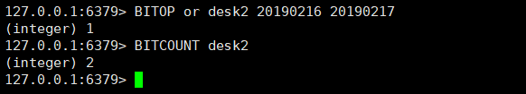

#  面经整理

## Redis 常用数据类型，底层结构

### zset的底层数据结构，跳跃表如何实现，为什么不用红黑树？两者对比。

Redis选择跳跃表而非红黑树作为有序集合实现方式的原因并非是基于并发上的考虑，因为Redis是单线程的，选用跳跃表的原因仅仅是因为跳跃表的实现相较于红黑树更加简洁。

#### skiplist与平衡树、哈希表的比较

- skiplist和各种平衡树（如AVL、红黑树等）的元素是有序排列的，而哈希表不是有序的。因此，在哈希表上只能做单个key的查找，不适宜做范围查找。所谓范围查找，指的是查找那些大小在指定的两个值之间的所有节点。
- 在做范围查找的时候，平衡树比skiplist操作要复杂。在平衡树上，我们找到指定范围的小值之后，还需要以中序遍历的顺序继续寻找其它不超过大值的节点。如果不对平衡树进行一定的改造，这里的中序遍历并不容易实现。而在skiplist上进行范围查找就非常简单，只需要在找到小值之后，对第1层链表进行若干步的遍历就可以实现。
- 平衡树的插入和删除操作可能引发子树的调整，逻辑复杂，而skiplist的插入和删除只需要修改相邻节点的指针，操作简单又快速。
- 从内存占用上来说，skiplist比平衡树更灵活一些。一般来说，平衡树每个节点包含2个指针（分别指向左右子树），而skiplist每个节点包含的指针数目平均为1/(1-p)，具体取决于参数p的大小。如果像Redis里的实现一样，取p=1/4，那么平均每个节点包含1.33个指针，比平衡树更有优势。
- 查找单个key，skiplist和平衡树的时间复杂度都为O(log n)，大体相当；而哈希表在保持较低的哈希值冲突概率的前提下，查找时间复杂度接近O(1)，性能更高一些。所以我们平常使用的各种Map或dictionary结构，大都是基于哈希表实现的。
- 从算法实现难度上来比较，skiplist比平衡树要简单得多。

见下 Redis ZSet

### zset排序原理

### list结构，扩容

### 对长字符串和短字符串处理有什么不同


## Redis 拓展

### 有多少种类型的缓存,从客户端到服务端


### Redis 为什么那么快

1、完全基于内存，绝大部分请求是纯粹的内存操作，非常快速。数据存在内存中，类似于HashMap，HashMap的优势就是查找和操作的时间复杂度都是O(1)；

2、数据结构简单，对数据操作也简单，Redis中的数据结构是专门进行设计的；

3、采用单线程，避免了不必要的上下文切换和竞争条件，也不存在多进程或者多线程导致的切换而消耗 CPU，不用去考虑各种锁的问题，不存在加锁释放锁操作，没有因为可能出现死锁而导致的性能消耗；

4、使用多路I/O复用模型，非阻塞IO；

5、使用底层模型不同，它们之间底层实现方式以及与客户端之间通信的应用协议不一样，Redis直接自己构建了VM 机制 ，因为一般的系统调用系统函数的话，会浪费一定的时间去移动和请求；

以上几点都比较好理解，下边我们针对多路 I/O 复用模型进行简单的探讨：

（1）多路 I/O 复用模型

多路I/O复用模型是利用 select、poll、epoll 可以同时监察多个流的 I/O 事件的能力，在空闲的时候，会把当前线程阻塞掉，当有一个或多个流有 I/O 事件时，就从阻塞态中唤醒，于是程序就会轮询一遍所有的流（epoll 是只轮询那些真正发出了事件的流），并且只依次顺序的处理就绪的流，这种做法就避免了大量的无用操作。

这里“多路”指的是多个网络连接，“复用”指的是复用同一个线程。采用多路 I/O 复用技术可以让单个线程高效的处理多个连接请求（尽量减少网络 IO 的时间消耗），且 Redis 在内存中操作数据的速度非常快，也就是说内存内的操作不会成为影响Redis性能的瓶颈，主要由以上几点造就了 Redis 具有很高的吞吐量。


### Redis为什么单线程的

我们首先要明白，上边的种种分析，都是为了营造一个Redis很快的氛围！官方FAQ表示，因为Redis是基于内存的操作，CPU不是Redis的瓶颈，Redis的瓶颈最有可能是机器内存的大小或者网络带宽。既然单线程容易实现，而且CPU不会成为瓶颈，那就顺理成章地采用单线程的方案了（毕竟采用多线程会有很多麻烦！）。

看到这里，你可能会气哭！本以为会有什么重大的技术要点才使得Redis使用单线程就可以这么快，没想到就是一句官方看似糊弄我们的回答！但是，我们已经可以很清楚的解释了为什么Redis这么快，并且正是由于在单线程模式的情况下已经很快了，就没有必要在使用多线程了！

但是，我们使用单线程的方式是无法发挥多核CPU 性能，不过我们可以通过在单机开多个Redis 实例来完善！

警告1：这里我们一直在强调的单线程，只是在处理我们的网络请求的时候只有一个线程来处理，一个正式的Redis Server运行的时候肯定是不止一个线程的，这里需要大家明确的注意一下！


### memcache与Redis区别


## Redis 持久化

### Redis如何持久化RDB

### RDB 和 AOF 优缺点对比，如何选择

### Redis的aof太大如何优化


## Redis 系统设计

### Redis 集群架构方案

### Redis cluster如何搭建，master-slave模式，如何选主

### Redis 过期策略

### Reids 如何实现分布式锁

### 如何实现一个分布式锁，Redis实现的分布式锁弊病在哪里，可以如何解决？

如果你对某个 Redis master 实例，写入了 myLock 这种锁 key 的 value，此时会异步复制给对应的 master slave 实例。但是这个过程中一旦发生 Redis m aster 宕机，主备切换，Redis slave 变为了 Redis master。
接着就会导致，客户端 2 来尝试加锁的时候，在新的 Redis master 上完成了加锁，而客户端 1 也以为自己成功加了锁。此时就会导致多个客户端对一个分布式锁完成了加锁。这时系统在业 务语义上一定会出现问题，导致各种脏数据的产生。
所以这个就是 Redis cluster，或者是 Redis master-slave 架构的主从异步复制导致的 Redis 分布 式锁的最大缺陷：在 Redis master 实例宕机的时候，可能导致多个客户端同时完成加锁。


Redis分布式锁，其实需要自己不断去尝试获取锁，比较消耗性能；

zk分布式锁，获取不到锁，注册个监听器即可，不需要不断主动尝试获取锁，性能开销较小。

另外一点就是，如果是Redis获取锁的那个客户端bug了或者挂了，那么只能等待超时时间之后才能释放锁；而zk的话，因为创建的是临时znode，只要客户端挂了，znode就没了，此时就自动释放锁。

Redis分布式锁大家每发现好麻烦吗？遍历上锁，计算时间等等。zk的分布式锁语义清晰实现简单。

所以先不分析太多的东西，就说这两点，我个人实践认为zk的分布式锁比Redis的分布式锁牢靠、而且模型简单易用。


### Redis 公平锁


### Redis 非公平锁

#### Redis分布式锁第一版

大家应该都知道Redis做分布式锁无非就是INCR命令或者是SetNx命令，这里我们采用setnx命令。
操作：setnx key 如果操作成功则代表拿到锁，如果没有操作成功则代表没有拿到锁。

缺点：如果这个人拿到锁后宕机了怎么办，那么这个锁就再也不能释放了。

改进：给这个锁增加一个过期时间，这样如果有效期过了，那么这个锁就会自动释放了。

#### Redis分布式锁第二版

通过上面所说我们应该对Redis分布式进行改进。
操作： 使用setnx 命令，之后，在EXPIREAT key 30000 这条命令设置key的有效期为30秒。
这里我们可能会发现，如果要是刚setnx结束之后，要是宕机了。怎么办？那么我们为了保证原子性，所以jedis提供了一个原子操作，set（key，value，nx，30，时间单位）这样便解决了。
缺点：如果这个锁的时间不够用怎么办，那么就会导致这个功能锁不住。假设：A拿到锁了，但是A还没有执行结束，B又拿到锁了，那么A执行结束的时候是不是会把B的这个锁给删除掉。这样就导致了锁不住的效果。
改进：我们可以学习乐观所，给锁的value值是一个唯一的编号，或者版本号，我们每次对锁进行操作的时候，就会去验证这个版本号，还是不是自己的版本号。如果不是了就不允许操作了。

#### Redis分布式锁第三版

通过上面的总结这第三版想必也很简单了。知识多了一个唯一值而已。但是加了唯一值还是改变不了锁不住的结果，只是解决了帮其他的线程解锁的问题，那么要怎么样才能锁得住呢？当时我想到的是给他 时间久一点，后来发现其实再久，也一样会出现锁不住的时候，而且太久了如果宕机了，就会有很长时间机器无法工作，很容易造成线程堆积。

#### Redis分布式锁最终版

由上面我们发现一般简单实用Redis做锁其实是有很多漏洞和bug的，但是有没有能够解决这些的呢？当然是有的。
模仿AQS锁， lock方法执行完之后，执行下面代码是被锁的，unlock执行完，释放锁。其他线程等待，而不是直接返回错误结果。

分析：

1. 判断是否获取到锁，获取到锁，继续执行，没有获取到锁，自旋继续获取。
2. 获取到锁后调度一个任务。每10秒执行一次，并且如果发现所没有释放延长10秒。
3. 释放锁，删除掉Redis中的key，并结束掉对应的锁的任务。

加锁运行原理：


解锁操作原理：


解锁操作就比较简单了。但是得为了不出必要的麻烦，最好是给停止锁延时任务，和删除所 这两部添加进程锁，可以使用synchronized，也可以使用AQS lock锁。


### 再整理锁的种类


#### 乐观锁与悲观锁

乐观锁和悲观锁都是用于解决并发场景下的数据竞争问题，但是却是两种完全不同的思想。它们的使用非常广泛，也不局限于某种编程语言或数据库。

#### **乐观锁的概念**

所谓的乐观锁，指的是在操作数据的时候非常乐观，乐观地认为别人不会同时修改数据，因此乐观锁不会上锁，只有在执行更新的时候才会去判断在此期间别人是否修改了数据，如果别人修改了数据则放弃操作，否则执行操作。


#### 悲观锁的概念

所谓的悲观锁，指的是在操作数据的时候比较悲观，悲观地认为别人一定会同时修改数据，因此悲观锁在操作数据时是直接把数据上锁，直到操作完成之后才会释放锁，在上锁期间其他人不能操作数据。


#### 乐观锁的实现方式

乐观锁的实现方式主要有两种，一种是CAS（Compare and Swap，比较并交换）机制，一种是版本号机制。

#### **CAS机制**

CAS操作包括了三个操作数，分别是需要读取的内存位置（V）、进行比较的预期值（A）和拟写入的新值（B），操作逻辑是，如果内存位置V的值等于预期值A，则将该位置更新为新值B，否则不进行操作。另外，许多CAS操作都是自旋的，意思就是，如果操作不成功，就会一直重试，直到操作成功为止。

#### **版本号机制**

版本号机制的基本思路，是在数据中增加一个version字段用来表示该数据的版本号，每当数据被修改版本号就会加1。当某个线程查询数据的时候，会将该数据的版本号一起读取出来，之后在该线程需要更新该数据的时候，就将之前读取的版本号与当前版本号进行比较，如果一致，则执行操作，如果不一致，则放弃操作。

#### **悲观锁的实现方式**

悲观锁的实现方式也就是加锁，加锁既可以在代码层面（比如Java中的synchronized关键字），也可以在数据库层面（比如MySQL中的排他锁）。

#### **乐观锁与悲观锁优缺点和使用场景**

乐观锁和悲观锁并没有优劣之分，它们有各自适合的场景。

#### **功能限制**

乐观锁与悲观锁相比，适用的场景受到了更多的限制，无论是CAS机制还是版本号机制。

比如，CAS机制只能保证单个变量操作的原子性，当涉及到多个变量的时候，CAS机制是无能为力的，而synchronized却可以通过对整个代码块进行加锁处理；再比如，版本号机制如果在查询数据的时候是针对表1，而更新数据的时候是针对表2，也很难通过简单的版本号来实现乐观锁。

#### **竞争激烈程度**

在竞争不激烈（出现并发冲突的概率比较小）的场景中，乐观锁更有优势。因为悲观锁会锁住代码块或数据，其他的线程无法同时访问，必须等待上一个线程释放锁才能进入操作，会影响并发的响应速度。另外，加锁和释放锁都需要消耗额外的系统资源，也会影响并发的处理速度。

在竞争激烈（出现并发冲突的概率较大）的场景中，悲观锁则更有优势。因为乐观锁在执行更新的时候，可能会因为数据被反复修改而更新失败，进而不断重试，造成CPU资源的浪费。

#### **乐观锁是否会加锁**

乐观锁本身是不加锁的，只有在更新的时候才会去判断数据是否被其他线程更新了，比如AtomicInteger便是一个例子。但是有时候乐观锁可能会与加锁操作合作，比如MySQL在执行更新数据操作的时候会加上排他锁。因此可以理解为乐观锁本身是不加锁的，只有在更新数据的时候才有可能会加锁。

#### **CAS的缺点**

CAS的缺点主要有ABA问题、高竞争下的开销问题和本身的功能限制。

#### **ABA问题**

所谓的ABA问题，指的就是一个线程在操作数据的时候，有别的线程对数据进行了一系列操作，但是在该线程重新读取该数据的时候，被修改过的数据却和该线程一开始读取的数据一致，该线程不会知道该数据已经被修改过了，然后CAS操作就被判断是成功了。

ABA问题在一些场景下可能不会造成什么危害，但是在某些场景中却可能会造成隐患。比如CAS操作的是栈顶的数据，栈顶的数据虽然经过两次（或多次）变化后又恢复了原值，但是栈却可能是发生了变化，栈中数据的变化就可能会引发一些问题。

对于ABA问题，比较有效的方案是引入版本号。只要内存中的值发生变化，版本号就加1，在进行CAS操作的时候不仅比较内存中的值，也比较版本号，只有当二者都没有变化的时候，CAS操作才能执行成功。Java中的AtomicStampedReference类便是适用版本号来解决ABA问题的。

#### **高竞争下的开销问题**

在并发冲突的概率较大的高竞争场景下，如果CAS操作一直失败，就会一直重试，造成CPU开销大的问题。针对这个问题，一个简单的思路是引入退出机制，如果重试次数超过一定阈值，就强制失败退出。当然了，最好是避免在高竞争的场景下使用乐观锁。

#### **自身的功能限制**

CAS的功能是比较受限的，比如CAS只能保证单个变量（或者说单个内存值）操作的原子性。这就意味着原子性不一定能保证线程安全，当涉及到多个变量（或者说多个内存值），CAS也是无能为力。除此之外，CAS的实现需要硬件层面处理器的支持，在Java中普通的用户是无法直接使用的，只有借助atomic包下的原子类才能使用，灵活性有限。


#### 公平锁与非公平锁

#### **公平锁的概念**

**「公平锁」** 是指多个线程按照申请锁的顺序来获取锁，类似排队打饭，先来后到。

#### **非公平锁的概念**

**「非公平锁」** 是指多个线程获取锁的顺序并不是按照申请锁的顺序，有可能后申请的线程比先申请的线程优先获取锁，在高并发的情况，有可能会造成优先级 **「反转」** 或 **「饥饿现象」**。

#### **两者区别**

**「公平锁 / 非公平锁」**

并发包中ReentrantLock的创建可以指定构造函数的boolean类型来得到公平锁或非公平锁，默认是非公平锁。

**「关于两者的区别」**

**「公平锁」**：Threads acquire a fair lock in the order which they requested it.

公平锁，就是很公平，在并发环境中，每个线程在获取锁时会先查看此锁维护的等待队列，如果为空，或者当前线程是等待队列的第一个，就占有锁，否则就会加入到等待队列中，以后按照FIFO的规则从队列中取到自己。

**「非公平锁」**：a nonfair lock permits barging: treads requesting a lock can jump ahead of the queue of waiting threads if the lock happens to be available when it is requested.

非公平锁，毕竟粗鲁，上来就直接尝试占有锁，如果尝试失败，就再采用类似公平锁的那种方式。

#### **题外话**

**「Java ReentrantLock」**而言

通过构造函数指定该锁是否是公平锁，默认是非公平锁。非公平锁的优点在于吞吐量比公平锁大。

对于Synchronized而言，也是一种非公平锁。


#### **自旋锁与非自旋锁**

#### **自旋锁的概念**

自旋锁（spinlock），是指尝试获取锁的线程不会立即阻塞，而是采用循环的方式去尝试获取锁，这样的好处是减少线程上下文切换的消耗，缺点是循环会消耗CPU。


#### 自旋锁的优点

自旋锁不会使线程状态发生切换，一直处于用户态，即线程一直都是active的；不会使线程进入阻塞状态，减少了不必要的上下文切换，执行速度快

非自旋锁在获取不到锁的时候会进入阻塞状态，从而进入内核态，当获取到锁的时候需要从内核态恢复，需要线程上下文切换。 （线程被阻塞后便进入内核（Linux）调度状态，这个会导致系统在用户态与内核态之间来回切换，严重影响锁的性能）

```
// unsafe.getAndAddInt
public final int getAndAddInt(Object var1, long var2, int var4) {
        int var5;
        do {
            var5 = this.getIntVolatile(var1, var2);        } while(!this.compareAndSwapInt(var1, var2, var5, var5 + var4));
        return var5;
    }
```

#### **Demo1# 实现一个自旋锁**

```java
package com.nuih.lock;
import sun.misc.Unsafe;
import java.util.concurrent.TimeUnit;
import java.util.concurrent.atomic.AtomicReference;
import java.util.concurrent.locks.Lock;
import java.util.concurrent.locks.ReentrantLock;
/**
 * 题目：实现一个自旋锁
 * 自旋锁好处：循环比较获取直到成功为止，没有类似wait的阻塞
 *
 * 通过cas操作完成自旋锁，A线程先进来调用myLock方法自己持有锁5秒钟，
 * B随后进来后发现当前又线程持有锁，不是null，所以只能通过自旋等待，直到A释放锁后B随后抢到
 *
 * @author: hejianhui
 * @create: 2020-06-21 15:05
 * @see SpinLockDemo
 * @since JDK1.8
 */
public class SpinLockDemo {
    // 原子引用
    AtomicReference<Thread> atomicReference = new AtomicReference<>();
    public void myLock(){
        Thread thread = Thread.currentThread();
        System.out.println(thread.getName() + "\t come in ");
        while (!atomicReference.compareAndSet(null,thread)){
        }
    }
    public void myUnLock(){
        Thread thread = Thread.currentThread();
        atomicReference.compareAndSet(thread,null);
        System.out.println(thread.getName() + "\t invoked myUnLock");
    }
    public static void main(String[] args) throws InterruptedException {
        SpinLockDemo spinLockDemo = new SpinLockDemo();
        new Thread(() -> {
            spinLockDemo.myLock();
            try {
                TimeUnit.SECONDS.sleep(5);
            } catch (InterruptedException e) {
                e.printStackTrace();
            }
            spinLockDemo.myUnLock();
        },"A").start();
        TimeUnit.SECONDS.sleep(1);
        new Thread(() -> {
            spinLockDemo.myLock();
            try {
                TimeUnit.SECONDS.sleep(1);
            } catch (InterruptedException e) {
                e.printStackTrace();
            }
            spinLockDemo.myUnLock();
        },"B").start();
    }
}
```


#### 可重入锁（又名递归锁）

#### **可重入锁的概念**

可重入锁（也叫做递归锁）

指的是同一线程外层函数获得锁之后，内层递归函数仍然能获取该锁的代码，在同一个线程在外层方法获取锁的时候，在进入内层方法会自动获取锁。也就是说，线程可以进入任何一个它已经拥有的锁所同步着的代码块。

ReentrantLock / Synchronized 就是一个典型的可重入锁

可重入锁的最大作用是避免死锁

#### **Demo2# 可重入锁**

```java
package com.nuih.lock;
import java.util.concurrent.TimeUnit;import java.util.concurrent.locks.Lock;
import java.util.concurrent.locks.ReentrantLock;

class MyPhone implements Runnable {
    public synchronized void sendMsg() {
        System.out.println(Thread.currentThread().getName() + "\t invoked sendMsg");
        sendEmail();    
    }    
    public synchronized void sendEmail() {
        System.out.println(Thread.currentThread().getName() + "\t##### invoked sendEmail");
    }    
    Lock lock = new ReentrantLock();
    
    @Override
    public void run() {
        get();
    }   
    
    public void get() {
        lock.lock();
        try {
            System.out.println(Thread.currentThread().getName() + "\t invoked get");
            set();
        } finally {
            lock.unlock();
        }    }    public void set() {
        lock.lock();
        try {
            System.out.println(Thread.currentThread().getName() + "\t###### invoked set");
        } finally {
            lock.unlock();
        }    
    }
}
/**
 * 可重入锁（也叫做递归锁）
 *
 * 指的是同一线程外层函数获得锁之后，内层递归函数仍然能获取该锁的代码，
 * 在同一个线程在外层方法获取锁的时候，在进入内层方法会自动获取锁。
 *
 * 也就是说，线程可以进入任何一个它已经拥有的锁所同步着的代码快。
 *
 * t1 invoked sendMsg()        t1线程在外层方法获取锁的时候
 * t1 ##### invoked sendEmail  t1在进入内层方法会自动获取锁
 *
 * t2 invoked sendMsg()
 * t2 ##### invoked sendEmail
 *
 * @author: hejianhui
 * @create: 2020-06-21 14:10
 * @see ReentrantLockDemo
 * @since JDK1.8
 */
public class ReentrantLockDemo {
    public static void main(String[] args) throws InterruptedException {
        MyPhone myPhone = new MyPhone();
        new Thread(() -> {
            myPhone.sendMsg();        
        },"t1").start();
        new Thread(() -> {
            myPhone.sendMsg();        
        },"t2").start();
        TimeUnit.SECONDS.sleep(1);
        System.out.println("\n\n\n\n");
        Thread t3 = new Thread(myPhone,"t3");
        t3.start();        
        Thread t4 = new Thread(myPhone,"t4");
        t4.start();    
    }
}
```


#### 独占锁（写锁）/共享锁（写锁）/互斥锁是什么？

独占锁：指该锁一次只能被一个线程所持有。对ReentrantLock和Synchronized而言都是独占锁

共享锁：指该锁可被多个线程所持有。

对ReentrantReadWriteLock其读锁是共享锁，其写锁是独占锁。

读锁的共享锁可保证并发读是非常高效的，读写、写读、写写的过程是互斥的。

#### **Demo#3 独占锁/共享锁**

```java
package com.nuih.lock;
import com.nuih.map.HashMap;
import com.nuih.map.Map;
import java.util.concurrent.locks.ReadWriteLock;
import java.util.concurrent.locks.ReentrantReadWriteLock;

class MyCache{
    private volatile Map<String,Object> map = new HashMap<>();
    final ReadWriteLock readWriteLock = new ReentrantReadWriteLock();
    public void put(String key,Object value){
        readWriteLock.writeLock().lock();
        try {
            System.out.println(Thread.currentThread().getName() + "\t 开始写入:" + key);
            map.put(key,value);
            System.out.println(Thread.currentThread().getName() + "\t 写入完成");
        } finally {
            readWriteLock.writeLock().unlock();        
        } 
    }   
    
    public void get(String key){
        readWriteLock.readLock().lock();
        try {
            System.out.println(Thread.currentThread().getName() + "\t 开始读取");
            Object result = map.get(key);
            System.out.println(Thread.currentThread().getName() + "\t 读物完成:" + result);
        } finally {
            readWriteLock.readLock().unlock();        
        }
    }
}
/**
 * 多个线程同时读一个资源类没有任何问题，所以为了满足并发量，读取共享资源应该可以同时进行
 * 但是
 * 如果又一个线程想去写共享资源了，就不应该再有其它线程可以对该资源进行读或写
 * 小总结：
 *      读-读可以共存
 *      读-写不能共存
 *      写-写不能共存
 *
 *      写操作：原子+独占，中间过程必须一个完整的统一体，中间不许被分割
 *
 * @author: hejianhui
 * @create: 2020-06-21 15:39
 * @see ReadWriteLockDemo
 * @since JDK1.8
 */
public class ReadWriteLockDemo {
    public static void main(String[] args) {
        MyCache myCache = new MyCache();
        for(int i=0;i<5;i++) {
            int finalI = i;
            new Thread(() -> {
                myCache.put(finalI+"",finalI);
            }, "A"+String.valueOf(i)).start();
        }        
        for(int i=0;i<5;i++){
            int finalI = i;
            new Thread(() -> {
                myCache.get(finalI+"");
            },"B"+String.valueOf(i)).start();
        }
    }
}
```


### ZooKeeper 分布式锁方案

多人访问时产生节点或者生成标识，然后基于 zookeeper 的选举机制，谁先拿到的数字比较大，或者较小的，就可以先使用那个锁。


### 介绍下 Redis 中的哨兵机制

### 如何避免Redis缓存穿透

### Redis、mysql保持数据一致性问题

先保存数据库，还是先操作 Redis；或者先操作 Redis，后保存数据库；甚至是先删掉 Redis，等待下次访问，再保存。那么如何选择呢？

先更新数据库，然后删 Redis 或者可以给 Redis 设置过期时间，有可能出现短暂性的数据不一致。比如还没来得及删缓存，就已经更新了数据库，那么读到的数据就跟数据库里面不一致。这边还是要根据业务作为出发点，选择最适合业务容忍度的。


### Redis原理，bloomfilter原理，换页策略及lru的实现


# Redis 整理

## Redis 知识树

Redis 是一个开源的内存存储的数据结构服务器，可用作数据库，高速缓存和消息队列代理。采用单进程单线程模型，并发能力强大（10w+），是当前互联网架构中主流的分布式缓存工具。

### 入门知识

Redis 特性

Redis 使用场景

Redis 单机安装

Redis 日常使用

五类数据结构

常用命令

### 进阶学习

Redis 客户端

Redis 连接池

Spring 整合

Redis 持久化

事务支持

lua 脚本支持

pipeline 管道

发布订阅

### 高级学习

Redis 复制

Redis 集群

哨兵机制

Spring 与哨兵结合

数据恢复与转移

Redis 阻塞分析

### 实战学习

网站排行榜

微博点赞数

时间轴

队列实现

分布式锁实现

session 统一缓存Redission

网站访问限流

……


## Redis 五种基础数据类型

### Redis String


- 存储最简单的key-value结构。
- value可以是字符串、整数或者浮点数。
- 可以对整个字符串或者字符串的一部分执行操作；
- 对整数和浮点数执行自增或者自减操作。

使用场景 ： 

- 常规key-value缓存应用；
- 常规计数：微博数，粉丝数等。
- RocketMQ消息幂等。


### Redis List


- 一个链表，链表上的每个节点都包含了一个字符串， 字符串可以重复 ； 
- 可以从链表的两端推入或者弹出元素；
- 根据偏移量对链表进行修剪；
- 读取单个或多个元素；
- 根据值查找或者移除元素。

使用场景 ： 

- 最新消息排行等功能；
- 消息队列；
- 关注列表，粉丝列表；

应用场景：

（1）Redis list 的应用场景非常多，也是Redis最重要的数据结构之一，比如微博的关注列表，粉丝列表，消息列表等功能都可以用Redis的 list 结构来实现。 另外可以通过 lrange 命令，就是从某个元素开始读取多少个元素，可以基于 list 实现分页查询，这个很棒的一个功能，基于 Redis 实现简单的高性能分页，可以做类似微博那种下拉不断分页的东西（一页一页的往下走），性能高。

（2）使用Redis的lst来实现缓存用户最近浏览商品：https://blog.csdn.net/qq_37107280/article/details/77894680


### Redis Hash


- 包含键值对的无序散列表， 键不能重复 ； 
- 可以添加、获取、移除单个键值对；
- 获取所有键值对。

使用场景 ： 

- 存储用户信息（能单独修改用户某一属性信息）；


### Redis Set


- 包含字符串的无序收集器，并且被包含的每个字符串都是独一无二，各不相同的，即 不能重复 ； 
- 可以添加、获取、移除单个元素；
- 检查一个元素是否存在于集合中；
- 计算交集、并集、差集；
- 从集合里面随机获取元素。

使用场景 ： 

- 共同好友，共同喜好，二度好友；
- 统计网站访问IP（利用唯一性，统计访问网站的所有独立IP）；
- 好友推荐（好友推荐时，根据tag求交集，大于某个阈值就可以推荐）；


在微博应用中，可以将一个用户所有的关注人存在一个集合中，将其所有粉丝存在一个集合。Redis可以非常方便的实现如共同关注、共同粉丝、共同喜好等功能。这个过程也就是求交集的过程，具体命令如下：

```bash
sinterstore key1 key2 key3   将交集存在key1内
```


### Redis ZSet


- 有序集合的键被称为成员， 每个成员都是各不相同的 ； 
- 而有序集合的值被称为分值，分值必须为浮点数；
- 有序集合是字符串成员与浮点数分值之间的有序映射，元素的排列顺序由分值的大小决定；
- 可以添加、获取、删除单个元素；
- 根据分值范围或者成员来获取元素；
- 有序集合是 [Redis](http://www.codercto.com/category/Redis.html) 里面唯一一个既可以根据成员访问元素（这一点和散列一样），又可以根据分值以及分值的排列顺序来访问元素的结构；

使用场景 ： 

- 排行版；
- 带权重的消息队列；

在直播系统中，实时排行信息包含直播间在线用户列表，各种礼物排行榜，弹幕消息（可以理解为按消息维度的消息排行榜）等信息，适合使用 Redis 中的 SortedSet 结构进行存储

在 set 的基础上，增加了一个值。

key value(score, member)

```bash
set k1 v1
zset k1 score1 v1
```

```bash
zadd key score value # key 排序 值
zadd key score1 value1 score2 value2 # 添加多个值
zrange key 0 -1 # 所有值从小到大排序
zrangebyscore key min max (±无穷 -inf +inf (5 表示<5 ) [withscores](带分数、排序值) [limit|offset|count] 
zrem key value # 移除有序集合中的制定元素
zcard key # 获取有序集合中的元素数量

```


#### 排行榜

排行榜是非常常见的实现，比如收入排行榜，积分排行榜。在某种情况下，可以直接缓存整个排行榜，然后设置定时任务，在某个时间点更新。但对于一些实时性比较强的，需要及时更新数据，可以利用Redis的有序队列实现，原理是利用有序队列的关联评分。

PS：如果要自己实现，可以考虑使用二叉堆实现，效率能到到**O(log(N))**


```yaml
#假定有一个实时的竞技场评分，在玩家结束操作后打分，并动态显示玩家的排行榜
> zadd rank 100 biki 87 zhibin 72 ming 64 fen 98 cat
(integer) 5
#显示得分最高的前三名玩家
> ZREVRANGE rank 0 2 WITHSCORES
1) "biki"
2) 100.0
3) "cat"
4) 98.0
5) "zhibin"
6) 87.0
#此时aaa玩家结束游戏得分为90
>zadd rank 90 aaa
#插入到有序队列，在进行查询
> zadd rank 90 aaa
(integer) 1
> ZREVRANGE rank 0 2 WITHSCORES
1) "biki"
2) 100.0
3) "cat"
4) 98.0
5) "aaa"
6) 90.0
```

排名已经更新了

#### 跳表 数据结构

参考公交车，2 路，快 2 路，会跳过几站

思路：增加一层有序链表，可提高查找效率；如果数据量大，继续增加有序链表层——空间换时间 

跳表是Redis的一个核心组件，也同时被广泛地运用到了各种缓存的实现当中，它的主要优点，就是可以跟红黑树、AVL等平衡树一样，做到比较稳定地插入、查询与删除。理论插入查询删除的算法时间复杂度为O(logN)。


**什么是跳表**

链表，相信大家都不陌生，维护一个有序的链表是一件非常简单的事情，我们都知道，在一个有序的链表里面，查询跟插入的算法复杂度都是O(n)。


我们能不能进行优化呢，比如我们一次比较两个呢？那样不就可以把时间缩小一半？


同理，如果我们4个4个比，那不就更快了？


跳表就是这样的一种数据结构，结点是跳过一部分的，从而加快了查询的速度。跳表跟红黑树又有什么差别呢？既然两者的算法复杂度差不多，为什么Redis要使用跳表而不使用红黑树呢？跳表相对于红黑树，主要有这几个优点：

1.代码相对简单，手写个跳表还有可能，手写个红黑树试试？

2.如果我们要查询一个区间里面的值，用平衡树可能会麻烦。这里的麻烦指的是实现和理解上，平衡二叉树查询一段区间也是可以做到的。

3.删除一段区间，这个如果是平衡二叉树，就会相当困难，毕竟设计到树的平衡问题，而跳表则没有这种烦恼。


skip List是一种随机化的数据结构，基于并联的链表，实现简单，插入、删除、查找的复杂度均为O(logN)（大多数情况下），因为其性能匹敌红黑树且实现较为简单，因此在很多著名项目都用跳表来代替红黑树，例如LevelDB、Reddis的底层存储结构就是用的SkipList。

目前常用的key-value数据结构有三种：Hash表、红黑树、SkipList，它们各自有着不同的优缺点：
Hash表：插入、查找最快，为O(1)；如使用链表实现则可实现无锁；数据有序化需要显式的排序操作。
红黑树：插入、查找为O(logn)，但常数项较小；无锁实现的复杂性很高，一般需要加锁；数据天然有序。
SkipList：插入、查找为O(logn)，但常数项比红黑树要大；底层结构为链表，可无锁实现；数据天然有序。


一个跳表，应该具有以下特征：

1、一个跳表应该有几个层（level）组成；
通常是10-20层，leveldb中默认为12层。

2、跳表的第0层包含所有的元素；
且节点值是有序的。

3、每一层都是一个有序的链表；
层数越高应越稀疏，这样在高层次中能'跳过’许多的不符合条件的数据。

4、如果元素x出现在第i层，则所有比i小的层都包含x；

5、每个节点包含key及其对应的value和一个指向该节点第n层的下个节点的指针数组
x->next[level]表示第level层的x的下一个节点


如果要实现一个key-value结构，需求的功能有插入、查找、迭代、修改，那么首先Hash表就不是很适合了，因为迭代的时间复杂度比较高；而红黑树的插入很可能会涉及多个结点的旋转、变色操作，因此需要在外层加锁，这无形中降低了它可能的并发度。而SkipList底层是用链表实现的，可以实现为lock free，同时它还有着不错的性能（单线程下只比红黑树略慢），非常适合用来实现我们需求的那种key-value结构。


平衡二叉树的几个基本操作。

**查询**

假如我们要查询11，那么我们从最上层出发，发现下一个是5，再下一个是13，已经大于11，所以进入下一层，下一层的一个是9，查找下一个，下一个又是13，再次进入下一层。最终找到11。


是不是非常的简单？我们可以把查找的过程总结为一条二元表达式（下一个是否大于结果？下一个：下一层）。理解跳表的查询过程非常重要，试试看查询其他数字，只要你理解了查询，后面两种都非常简单。

**插入**

插入的时候，首先要进行查询，然后从最底层开始，插入被插入的元素。然后看看从下而上，是否需要逐层插入。可是到底要不要插入上一层呢？我们都知道，我们想每层的跳跃都非常高效，越是平衡就越好（第一层1级跳，第二层2级跳，第3层4级跳，第4层8级跳）。但是用算法实现起来，确实非常地复杂的，并且要严格地按照2地指数次幂，我们还要对原有地结构进行调整。所以跳表的思路是抛硬币，听天由命，产生一个随机数，50%概率再向上扩展，否则就结束。这样子，每一个元素能够有X层的概率为0.5^(X-1)次方。反过来，第X层有多少个元素的数学期望大家也可以算一下。

**删除**

同插入一样，删除也是先查找，查找到了之后，再从下往上逐个删除。比较简单，就不再赘叙。

**总结**

跳表，用了计算机中一场非常用的解决问题的思路，随机。随机在深度学习与人工智能领域运用得非常的广泛。（不仅人会蒙，计算机也是很会蒙的）


#### 跳表详细整理

##### 跳跃表的原理

zskiplist跳表结构`保存跳跃表信息，表头、表尾、长度、最大层数`
header：`表头节点`
tail：`表尾节点`
level：`最大层数`
length：`跳表节点数量`

zskiplistNode跳表节点`每个节点层高1~32随机数`


ele：`sds字符串对象，保存节点的member成员，唯一的。`
score：`double类型的分数，从小到大排序。score相同，按照ele的字典顺序排序。`
backward：`后退指针，节点的prev节点，用于表尾向表头遍历。`
level数组：`每个元素都包含一个forward前进指针和span跨度。`
forward：`前进指针，每一层都有指向表尾方向的前进指针，用于实现多层链表。`
span：`跨度，记录两个节点之间的距离，用于计算rank排名。`

 

跳跃表的思想来自于一篇论文：Skip Lists: A Probabilistic Alternative to Balanced Trees. 如果想要深入了解跳跃表，可以阅读论文原文。这里引用论文中的一幅图对跳跃表的原理作一个简单的说明。


上图用a,b,c,d,e五种有序链表及其变式（变式的名字是我随便起的）说明了跳跃表的motivation.

[a] 单链表：查询时间复杂度O(n)
[b] level-2单链表：每隔一个节点为一个level-2节点，每个level-2节点有2个后继指针，分别指向单链表中的下一个节点和下一个level-2节点。查询时间复杂度为O(n/2)
[c] level-3单链表：每隔一个节点为一个level-2节点，每隔4个节点为一个level-3节点，查询时间复杂度O(n/4)
[d] 指数式单链表：每2^i个节点的level为i+1，查询时间复杂度为O(log2N)
[e] 跳跃表：各个level的节点个数同指数式单链表，但出现的位置随机，查询复杂度仍然是O(log2N)吗
之所以这里关心查询复杂度，因为有序链表的插入和删除复杂度等于查询复杂度。

作为一种概率性算法，文章证明了跳跃表查询复杂度的期望是O(logN).


##### Redis有序集合采用跳跃表的原因


为什么Redis的有序集合采用跳跃表而不是红黑树呢？对于这个问题，可以在 https://news.ycombinator.com/item?id=1171423 找到作者本人的一个回答：

> They are not very memory intensive. It’s up to you basically. Changing parameters about the probability of a node to have a given number of levels will make then less memory intensive than btrees.
>
> A sorted set is often target of many ZRANGE or ZREVRANGE operations, that is, traversing the skip list as a linked list. With this operation the cache locality of skip lists is at least as good as with other kind of balanced trees.
>
> They are simpler to implement, debug, and so forth. For instance thanks to the skip list simplicity I received a patch (already in Redis master) with augmented skip lists implementing ZRANK in O(log(N)). It required little changes to the code.
>
> About the Append Only durability & speed, I don’t think it is a good idea to optimize Redis at cost of more code and more complexity for a use case that IMHO should be rare for the Redis target (fsync() at every command). Almost no one is using this feature even with ACID SQL databases, as the performance hint is big anyway.
>
> About threads: our experience shows that Redis is mostly I/O bound. I’m using threads to serve things from Virtual Memory. The long term solution to exploit all the cores, assuming your link is so fast that you can saturate a single core, is running multiple instances of Redis (no locks, almost fully scalable linearly with number of cores), and using the “Redis Cluster” solution that I plan to develop in the future.

可以看到Redis选择跳跃表而非红黑树作为有序集合实现方式的原因并非是基于并发上的考虑，因为Redis是单线程的，选用跳跃表的原因仅仅是因为跳跃表的实现相较于红黑树更加简洁。

链接：https://blog.csdn.net/da_kao_la/article/details/94744886

 

Redis里面是用skiplist是为了实现zset这种对外的数据结构。zset提供的操作非常丰富，可以满足许多业务场景，同时也意味着zset相对来说实现比较复杂。

##### skiplist数据结构简介


如图，跳表的底层是一个顺序链表，每隔一个节点有一个上层的指针指向下下一个节点，并层层向上递归。这样设计成类似树形的结构，可以使得对于链表的查找可以到达二分查找的时间复杂度。

按照上面的生成跳表的方式上面每一层节点的个数是下层节点个数的一半，这种方式在插入数据的时候有很大的问题。就是插入一个新节点会打乱上下相邻两层链表节点个数严格的2:1的对应关系。如果要维持这种严格对应关系，就必须重新调整整个跳表，这会让插入/删除的时间复杂度重新退化为O(n)。

为了解决这一问题，skiplist他不要求上下两层链表之间个数的严格对应关系，他为每个节点随机出一个层数。比如，一个节点的随机出的层数是3，那么就把它插入到三层的空间上，如下图。


那么，这就产生了一个问题，每次插入节点时随机出一个层数，真的能保证跳表良好的性能能么，

首先跳表随机数的产生，不是一次执行就产生的，他有自己严格的计算过程，

1首先每个节点都有最下层(第1层)指针

2如果一个节点有第i层指针，那么他有第i层指针的概率为p。

3节点的最大层数不超过MaxLevel

我们注意到，每个节点的插入过程都是随机的，他不依赖于其他节点的情况，即skiplist形成的结构和节点插入的顺序无关。

这样形成的skiplist查找的时间复杂度约为O(log n)。

##### Redis中的skiplist

- 当数据较少的时候，zset是由一个ziplist来实现的
- 当数据较多的时候，zset是一个由dict 和一个 skiplist来实现的，dict用来查询数据到分数的对应关系，而skiplist用来根据分数查询数据。

为了支持排名rank查询，Redis中对skiplist做了扩展，使得根据排名能够快速查到数据，或者根据分数查到数据之后容易获得排名，二者都是O(log n)。

| 123456 | `typedef struct zset{``   ``//跳跃表``   ``zskiplist *zsl;``   ``//字典``   ``dict *dice;``} zset;` |
| ------ | ------------------------------------------------------------ |
|        |                                                              |

　　dict的key保存元素的值，字典的value保存元素的score，跳表节点的robj保存元素的成员，节点的score保存对应score。并且会通过指针来共享元素相同的robj和score。

##### skiplist的数据结构定义

| 1234567891011121314151617 | `//server.h<br>#define ZSKIPLIST_MAXLEVEL 32``#define ZSKIPLIST_P 0.25``typedef struct zskiplistNode {``  ``robj *obj;``  ``double` `score;``  ``struct zskiplistNode *backward;``  ``struct zskiplistLevel {``    ``struct zskiplistNode *``forward``;``    ``unsigned ``int` `span;``  ``} ``level``[];``} zskiplistNode;`` ` `typedef struct zskiplist {``  ``struct zskiplistNode *header, *tail;``  ``unsigned long length;``  ``int` `level``;``} zskiplist;` |
| ------------------------- | ------------------------------------------------------------ |
|                           |                                                              |

开头定义了两个常量 ZSKIPLIST_MAXLEVEL和ZSKIPLIST_P，即上文所提到的p和maxlevel。

zskiplistNode表示skiplist的节点结构

- obj字段存放节点数据，存放string robj。
- score字段对应的是节点的分数。
- backward字段是指向前一个节点的指针，节点只有一个向前指针，最底层是一个双向链表。
- level[]存放各层链表的向后指针结构，包含一个forward ，指向对应层后一个节点；span字段指的是这层的指针跨越了多少个节点值，用于计算排名。(level是一个柔性数组，因此他占用的内存不在zskiplistNode里，也需要单独为其分配内存。)

zskiplist 定义了skiplist的外观，包含

- header和tail指针
- 链表长度 length
- level表示 跳表的最大层数


上图就是Redis中一个skiplist可能的结构，括号中的数字代表 level数组中span的值，即跨越了多少个节点。

假设我们在这个skiplist中查找score=89的元素，在查找路径上，我们只需要吧所有的level指针对应的span值求和，就可以得到对应的排名；相反，如果查找排名的时候，只需要不断累加span保证他不超过指定的值就可以求得对应的节点元素。

##### 三、Redis_ENCODING_INTSET

Redis中使用intset实现数量较少数字的set。

```bash
set -max -intset-entries 512
```


　实际上 intset是一个由整数组成的有序集合，为了快速查找元素，数组是有序的，用二分查找判断一个元素是否在这个结合上。在内存分配上与ziplist类似，用一块连续的内存保存数组元素，并且对于大整数和小证书 采用了不同的编码。

结构如下

```java
`//intset.h
typedef struct intset {
    uint32_t encoding;
    uint32_t length;
    int8_t contents[];
} intset;
#define INTSET_ENC_INT16 (sizeof(int16_t))
#define INTSET_ENC_INT32 (sizeof(int32_t))
#define INTSET_ENC_INT64 (sizeof(int64_t))
```

encoding 数据编码 表示intset中的每个元素用几个字节存储。(INTSET_ENC_INT16 用两个字节存储，即两个contents数组位置 INTSET_ENC_INT32表示4个字节 INTSET_ENC_INT64表示8个字节)

length 表示inset中元素的个数

contents 柔性数组，表示存储的实际数据，数组长度 = encoding * length。

另外，intset可能会随着数据的添加改编他的编码，最开始创建的inset使用 INTSET_ENC_INT16编码。


如上图 intset采用小端存储。

关于插入逻辑。

| 12345678910111213141516171819202122232425262728 | `intset *intsetAdd(intset *``is``, int64_t value, uint8_t *success) {``  ``uint8_t valenc = _intsetValueEncoding(value);``  ``uint32_t pos;``  ``if (success) *success = 1;`` ` `  ``/* Upgrade encoding if necessary. If we need to upgrade, we know that``   ``* this value should be either appended (if > 0) or prepended (if < 0),``   ``* because it lies outside the range of existing values. */``  ``if (valenc > intrev32ifbe(``is``->encoding)) {``    ``/* This always succeeds, so we don't need to curry *success. */``    ``return` `intsetUpgradeAndAdd(``is``,value);``  ``} ``else` `{``    ``/* Abort if the value is already present in the set.``     ``* This call will populate "pos" with the right position to insert``     ``* the value when it cannot be found. */``    ``if (intsetSearch(``is``,value,&pos)) {``      ``if (success) *success = 0;``      ``return` `is``;``    ``}`` ` `    ``is` `= intsetResize(``is``,intrev32ifbe(``is``->length)+1);``    ``if (pos < intrev32ifbe(``is``->length)) intsetMoveTail(``is``,pos,pos+1);``  ``}`` ` `  ``_intsetSet(``is``,pos,value);``  ``is``->length = intrev32ifbe(intrev32ifbe(``is``->length)+1);``  ``return` `is``;``}` |
| ----------------------------------------------- | ------------------------------------------------------------ |
|                                                 |                                                              |

intsetadd在intset中添加新元素value。如果value在添加前已经存在，则不会重复添加，这个时候success设置值为0

如果要添加的元素编码比当前intset的编码大。调用intsetUpgradeAndAdd将intset的编码进行增长，然后插入。

调用intsetSearch 如果能查找到，不会重复添加。没查到调用intsetResize对其进行扩容(realloc)，同时intsetMoveTail将带插入位置后面的元素统一向后移动一个位置。返回值是一个新的intset指针，替换原来的intset指针，总的时间复杂度为O(n)。


## Redis 三种特殊数据类型

Redis除了5种数据类型之外，还提供了其他功能，如：慢查询，pipeline，事务，发布订阅和消息队列，Bitmap，HyperLogLog，GEO

### 1.Bitmap(位图)

BitMap，即位图，其实也就是 byte 数组，用二进制表示，只有 0 和 1 两个数字。
就是通过一个bit位来表示某个元素对应的值或者状态,其中的key就是对应元素本身。我们知道8个bit可以组成一个Byte，所以bitmap本身会极大的节省储存空间。


API：

| 命令                              | 含义                                                         |
| --------------------------------- | ------------------------------------------------------------ |
| getbit key offset                 | 对key所存储的字符串值，获取指定偏移量上的位（bit）           |
| setbit key offset value           | 对key所存储的字符串值，设置或清除指定偏移量上的位（bit）1. 返回值为该位在setbit之前的值。2. value只能取0或1。3. offset从0开始，即使原位图只能10位，offset可以取1000 |
| bitcount key [start end]          | 获取位图指定范围中位值为1的个数 如果不指定start与end，则取所有 |
| bitop op destKey key1 [key2...]   | 做多个BitMap的and（交集）、or（并集）、not（非）、xor（异或）操作并将结果保存在destKey中 |
| bitpos key tartgetBit [start end] | 计算位图指定范围第一个偏移量对应的的值等于targetBit的位置。1. 找不到返回-1。2. start与end没有设置，则取全部。3. targetBit只能取0或者1 |

使用场景：

1. 用户签到：
   根据日期 offset =hash % 365 ； key = 年份#用户id
   
2. 统计活跃用户：
   使用时间作为cacheKey，然后用户ID为offset，如果当日活跃过就设置为1。
   那么我该如果计算某几天/月/年的活跃用户呢(暂且约定，统计时间内只有有一天在线就称为活跃)，有请下一个Redis的命令
   命令 BITOP operation destkey key [key ...]
   说明：对一个或多个保存二进制位的字符串 key 进行位元操作，并将结果保存到 destkey 上。
   说明：BITOP 命令支持 AND 、 OR 、 NOT 、 XOR 这四种操作中的任意一种参数
   20190216 活跃用户 【1，2】
   20190217 活跃用户 【1】
   统计20190216~20190217 总活跃用户数: 1
   
   统计20190216~20190217 在线活跃用户数: 2
   
3. 用户在线状态：
   使用bitmap是一个节约空间效率又高的一种方法，只需要一个key，然后用户ID为offset，如果在线就设置为1，不在线就设置为0，和上面的场景一样，5000W用户只需要6MB的空间

使用经验：

1. type = string，BitMap 是 sting 类型，最大 512 MB。
2. 注意 setbit 时的偏移量，可能有较大耗时。
3. 位图不是绝对好。

优势：

1. 基于最小的单位bit进行存储，所以非常省空间。
2. 设置时候时间复杂度O(1)、读取时候时间复杂度O(n)，操作是非常快的。
3. 二进制数据的存储，进行相关计算的时候非常快。
4. 方便扩容。

限制：
Redis中bit映射被限制在512MB之内，所以最大是2^32位。建议每个key的位数都控制下，因为读取时候时间复杂度O(n)，越大的串读的时间花销越多。

bitmap空间、时间粗略计算方式：
在一台2010MacBook Pro上，offset为2^32-1（分配512MB）需要～300ms，
offset为230-1(分配128MB)需要～80ms，offset为228-1（分配32MB）需要～30ms，
offset为2^26-1（分配8MB）需要8ms。<来自官方文档>
大概的空间占用计算公式是：($offset/8/1024/1024)MB

### 2.HyperLogLog

1. 基于HyperLogLog算法：极小空间完成独立数量统计。
2. 本质还是字符串。

> 举个栗子：假如我要统计网页的UV（浏览用户数量，一天内同一个用户多次访问只能算一次），传统的解决方案是使用Set来保存用户id，然后统计Set中的元素数量来获取页面UV。但这种方案只能承载少量用户，一旦用户数量大起来就需要消耗大量的空间来存储用户id。我的目的是统计用户数量而不是保存用户，这简直是个吃力不讨好的方案！而使用Redis的HyperLogLog最多需要12k就可以统计大量的用户数，尽管它大概有0.81%的错误率，但对于统计UV这种不需要很精确的数据是可以忽略不计的。

API:

| 序号 | 命令及描述                                                   |
| ---- | ------------------------------------------------------------ |
| 1    | PFADD key element [element ...] 添加指定元素到 HyperLogLog 中。 |
| 2    | PFCOUNT key [key ...] 返回给定 HyperLogLog 的基数估算值。    |
| 3    | PFMERGE destkey sourcekey [sourcekey ...] 将多个 HyperLogLog 合并为一个 HyperLogLog。 |

使用场景：

- 基数不大，数据量不大就用不上，会有点大材小用浪费空间。
- 有局限性，就是只能统计基数数量，而没办法去知道具体的内容是什么。
- 和bitmap相比，属于两种特定统计情况，简单来说，HyperLogLog 去重比 bitmap 方便很多。
- 一般可以bitmap和hyperloglog配合使用，bitmap标识哪些用户活跃，hyperloglog计数。
  一般使用：

1. 统计注册 IP 数。
2. 统计每日访问 IP 数。
3. 统计页面实时 UV 数。
4. 统计在线用户数。
5. 统计用户每天搜索不同词条的个数。

### 3.GEO(地理信息定位)

GEO功能在Redis3.2版本提供，支持存储地理位置信息用来实现诸如附近位置、摇一摇这类依赖于地理位置信息的功能.geo的数据类型为zset。
存储经纬度，计算两地距离，范围计算等。


#### 3.1 geoadd

语法：geoadd key longitude latitude member [longitude latitude member...]
解析：
将给定的空间元素(纬度、经度、名字)添加到指定的键里面。这些数据会以有序集he的形式被储存在键里面，从而使得georadius和georadiusbymember这样的命令可以在之后通过位置查询取得这些元素。
geoadd命令以标准的x,y格式接受参数,所以用户必须先输入经度,然后再输入纬度。
geoadd能够记录的坐标是有限的:非常接近两极的区域无法被索引的精确的坐标限制由EPSG:900913 / EPSG:3785 / OSGEO:41001 等坐标系统定义， 具体如下
有效的经度介于-180-180度之间
有效的纬度介于-85.05112878 度至 85.05112878 度之间。
当用户尝试输入一个超出范围的经度或者纬度时,geoadd命令将返回一个错误。
返回值：
新添加到键里面的空间元素数量,不包括那些已经存在但是被更新的元素。

```
geoadd cities:locations 116.28 39.55 beijing
geopos cities:locations beijing
```

#### 3.2 geopos

语法：
geopos key member [member...]
解析：
从键里面返回所有给定位置元素的位置(经度和纬度)
因为geopos命令接受可变数量的位置元素作为输入,所以即使用户只给定了一个位置元素,命令也会返回数组的回复。
返回值：
geopos命令返回一个数组,数组中的每个项都由两个元素组成:第一个元素为给定位置元素的经度,而第二个元素则为给定位置元素的纬度。当给定的位置元素不存在时,对应的数组项为空值。

```
geoadd cities:locations 117.12 39.08 tianjin 114.29 38.02  shijiazhuang 118.01 39.38 tangshan 115.29 38.51 baoding
geopos cities:locations tianjin shijiazhuang
```

#### 3.3 geodist

语法：geodist key member1 member2 [unit]
解析：
如果两个位置之间的其中一个不存在,那么命令返回空值。
指定单位的参数unit必须是以下单位的其中一个：
m表示单位为米
km表示单位为千米
mi表示单位为英里
ft表示单位为英尺
如果用户没有显式地指定单位参数,那么geodist默认使用米作为单位。
geodist命令在计算距离时会假设地球为完美的球形,在极限情况下,这一假设最大会造成0.5%的误差。
返回值：
计算出的距离会以双精度浮点数的形式被返回。如果给定的位置元素不存在,那么命令返回空值。

```
geoadd cities:locations 117.12 39.08 tianjin 114.29 38.02  shijiazhuang 118.01 39.38
geodist cities:locations tianjin shijiazhuang
geodist cities:locations tianjin shijiazhuang km
#如果不存在返回nil
geodist cities:locations beijing zhengzhou
```

#### 3.4 georadius

语法：georadius key longitude latitude radius m|km|ft|mi [withcoord][withdist][withhash][asc|desc][count count]

解析：

以给定的经纬度为中心,返回键包含的位置元素当中,与中心的距离不超过给定最大距离的所有位置元素。

范围可以使用以下其中一个单位：
m 表示单位为米。
km 表示单位为千米。
mi 表示单位为英里。
ft 表示单位为英尺。

在给定以下选项时,命令会返回额外的信息：

withdist:在返回位置元素的同时,将位置元素与中心之间的距离也一并返回.距离的单位和用户给定的范围单位保持一致。

withcoord:将位置元素的经度和纬度也一并返回。

withhash:以52位有符号整数的形式,返回位置元素经过原始geohash编码的有序集合分值。这个选项主要用于底层应用或者调试,实际中的作用不大。

命令默认返回未排序的位置元素。通过以下两个参数,用户可以指定被返回位置元素的排序方式：

asc:根据中心的位置,按照从近到远的方式返回位置元素

desc:根据中心的位置,按照从远到近的方式返回位置元素。

在默认情况下,georadius命令会返回所有匹配的位置元素.虽然用户可以使用count选项去获取N个匹配元素,但是因为命令在内部

可能会需要对所有被匹配的元素进行处理,所以在对一个非常大的区域进行搜索时,即使只使用count选项去获取少量元素，

命令的执行速度也可能非常慢。但从另一方面说,使用count选项去减少需要返回的元素数量,对于减少带宽来说仍然是非常有用的。

返回值：

georadius命令返回一个数组,具体来说：
在没有给定任何with选项的情况下,命令只会返回一个像["Beijing","Tianjin"]这样的线性列表

在指定了withcoord、withdist、withhash等选项的情况下,命令返回一个二层嵌套数组,内层的每个子数组就表示一个元素。

在返回嵌套数组时,子数组的第一个元素总是位置元素的名字.至于额外的信息,则会作为子数组的后续元素,按照以下顺序被返回：

(1).以浮点数格式返回的中心位置元素之间的距离,单位与用户指定范围时的单位一致。

(2).geohash整数

(3).由两个元素组成的坐标,分别为经度和纬度。

```bash
语法：georadius key longitude latitude radius m|km|ft|mi [withcoord][withdist][withhash][asc|desc][count count]
解析：
以给定的经纬度为中心,返回键包含的位置元素当中,与中心的距离不超过给定最大距离的所有位置元素。
范围可以使用以下其中一个单位：
m 表示单位为米。
km 表示单位为千米。
mi 表示单位为英里。
ft 表示单位为英尺。
在给定以下选项时,命令会返回额外的信息：
withdist:在返回位置元素的同时,将位置元素与中心之间的距离也一并返回.距离的单位和用户给定的范围单位保持一致。
withcoord:将位置元素的经度和纬度也一并返回。
withhash:以52位有符号整数的形式,返回位置元素经过原始geohash编码的有序集合分值。这个选项主要用于底层应用或者调试,实际中的作用不大。
命令默认返回未排序的位置元素。通过以下两个参数,用户可以指定被返回位置元素的排序方式：
asc:根据中心的位置,按照从近到远的方式返回位置元素
desc:根据中心的位置,按照从远到近的方式返回位置元素。
在默认情况下,georadius命令会返回所有匹配的位置元素.虽然用户可以使用count选项去获取N个匹配元素,但是因为命令在内部
可能会需要对所有被匹配的元素进行处理,所以在对一个非常大的区域进行搜索时,即使只使用count选项去获取少量元素，
命令的执行速度也可能非常慢。但从另一方面说,使用count选项去减少需要返回的元素数量,对于减少带宽来说仍然是非常有用的。
返回值：
georadius命令返回一个数组,具体来说：
在没有给定任何with选项的情况下,命令只会返回一个像["Beijing","Tianjin"]这样的线性列表
在指定了withcoord、withdist、withhash等选项的情况下,命令返回一个二层嵌套数组,内层的每个子数组就表示一个元素。
在返回嵌套数组时,子数组的第一个元素总是位置元素的名字.至于额外的信息,则会作为子数组的后续元素,按照以下顺序被返回：
(1).以浮点数格式返回的中心位置元素之间的距离,单位与用户指定范围时的单位一致。
(2).geohash整数
(3).由两个元素组成的坐标,分别为经度和纬度。geoadd cities:locations 117.12 39.08 tianjin 114.29 38.02  shijiazhuang 118.01 39.38 tangshan 115.29 38.51 baoding
#withdist 返回位置名称和中心距离
georadius cities:locations 117 39 200 km withdist
#withcoord 返回位置名称和经纬度
georadius cities:locations 117 39 200 km withcoord
#withdist withcoord 返回位置名称 距离 和经纬度
georadius cities:locations 117 39 200 km withdist withcoord
```

#### 3.5 georadiusbymember

语法：georadiusbymember key member radius m|km|ft|mi [withcoord][withdist][withhash][asc|desc][count count]
解析：
这个命令和georadius命令一样,都可以找出位于指定范围内的元素,但是georadiusbymember的中心点是由给定的位置元素决定的,而不是像georadius那样,使用输入的经度和纬度来决定中心点。
返回值：
一个数组,数组中的每个项表示一个范围之内的位置元素。

```
geoadd cities:locations 117.12 39.08 tianjin 114.29 38.02  shijiazhuang 118.01 39.38 tangshan 115.29 38.51 baoding
georadiusbymember cities:locations tianjin 100 km
```

#### 3.6 geohash

语法：geohash key member [member...]
解析：
Redis使用geohash将二维经纬度转换为一维字符串，字符串越长表示位置更精确,两个字符串越相似表示距离越近。
返回值：
一个数组,数组的每个项都是一个geohash。命令返回的geohash的位置与用户给定的位置元素的位置一一对应。

```
geoadd cities:locations 118.01 39.38 tangshan 115.29 38.51 baoding
geohash cities:locations tangshan baoding
```

#### 3.7 zrem

GEO没有提供删除成员的命令，但是因为GEO的底层实现是zset，所以可以借用zrem命令实现对地理位置信息的删除。

```
zrem cities:locations tianjin
```


## 事务

## Redis.conf 详解

通过配置文件启动 Redis

```bash
vim Redis.conf
```

```bash
# UNIT
1k => 1000 bytes
1kb => ……


# INCLUDES
# include /path/to/local.conf
# include /path/to/other.conf

# NETWORK
bind 127.0.0.1 #
protected-mode yes # 保护模式
port 6379 #

# GENERAL
daemonize yes # 以守护进程的方式运行，默认是 no，需自己开启为 yes
pidfile /var/run/Redis_6379.pid # 如果以后台方式运行，则需要制定一个 pid 文件（进程文件）
loglevel notice # 日志级别 debug，verbose，notice，warning，默认生产环境适用 notice
logfile "" # 默认日志文件位置名
database 16 # 默认数据库数量 16 个
always-show-logo yes # 是否总是显示 logo

# SNAPSHOT
save 900 1 # 如果 900s 内，至少有一个 key 进行修改，就进行持久化操作
save 300 10 # 300s 内，如果有超过 10 个 key，就进行持久化操作
save 60 10000 # 60s 内，10000 个 key 进行修改，持久化操作（高并发）
stop-writes-on-bgsave-error yes # 如果持久化失败，是否继续工作
rdbcompression yes # 是否压缩 rdb 文件，需要消耗一些 CPU 资源
rdbchecksum yes # 保存 rdb 文件时进行错误校验
dir ./ # rdb 文件保存目录

# REPLICATION

# SECURITY
requirepass xxxx # 密码

# CLIENT
maxclients 10000 # 设置能连接上 Redis 的最大连接数
maxmemory <bytes> # Redis 配置最大的内存容量
maxmemory-policy noeviction # 内存达到上线之后的处理策略
# volatile-lru 只对设置了过期时间的 key 进行 lru（default）
# allkeys-lru 删除 lru 算法的 key
# volatile-random 随机删除即将过期的 key
# allkeys-random 随即删除
# volatile-ttl 删除即将过期的
# noeviction 永不过期，返回错误

# APPEND ONLY
appendonly no # 默认是不开启 aof 模式的，默认是使用 rdb 方式持久化的
appendfilename "appendpnly.aof" # 持久化文件名
# appendfsync always # 每次修改都会 sync， 消耗性能
appendfsync everysec # 每秒执行一次 sync，可能会丢失这 1s 的数据
# appendfsync no # 不执行 sync，这时候操作系统自己同步数据，速度最快
```

- 配置文件 unit 单位对大小写不敏感
- 可以 include 其他 conf

- 网络相关配置，集群

- 通用配置

- 快照配置，持久化，Redis 是内存数据库，如果没有持久化，数据断点即失

- 主从复制

- 密码配置

  ```bash
  config get requirepass # 获取 Redis 密码
  config set requirepass "shadowalker" # 设置密码
  auth "shadowalker" # 使用密码登录
  ```

- 客户端设置
- aof 配置


## Redis 持久化

### RDB（Redis DataBase）

RDB其实就是把数据以快照的形式保存在磁盘上。什么是快照呢，你可以理解成把当前时刻的数据拍成一张照片保存下来。

RDB持久化是指在指定的时间间隔内将内存中的数据集快照写入磁盘。也是默认的持久化方式，这种方式是就是将内存中数据以快照的方式写入到二进制文件中,默认的文件名为dump.rdb。恢复时是将快照文件直接读到内存里。

在我们安装了Redis之后，所有的配置都是在Redis.conf文件中，里面保存了RDB和AOF两种持久化机制的各种配置。

既然RDB机制是通过把某个时刻的所有数据生成一个快照来保存，那么就应该有一种触发机制，是实现这个过程。对于RDB来说，提供了三种机制：save、bgsave、自动化。我们分别来看一下

#### **1. save触发方式**

该命令会阻塞当前Redis服务器，执行save命令期间，Redis不能处理其他命令，直到RDB过程完成为止。具体流程如下：


执行完成时候如果存在老的RDB文件，就把新的替代掉旧的。我们的客户端可能都是几万或者是几十万，这种方式显然不可取。

#### **2. bgsave触发方式**

执行该命令时，Redis会在后台异步进行快照操作，快照同时还可以响应客户端请求。具体流程如下：


具体操作是Redis进程执行fork操作创建子进程，RDB持久化过程由子进程负责，完成后自动结束。阻塞只发生在fork阶段，一般时间很短。基本上 Redis 内部所有的RDB操作都是采用 bgsave 命令。

#### **3. 自动触发**

自动触发是由我们的配置文件来完成的。在Redis.conf配置文件中，里面有如下配置，我们可以去设置：

**①save：**这里是用来配置触发 Redis的 RDB 持久化条件，也就是什么时候将内存中的数据保存到硬盘。比如“save m n”。表示m秒内数据集存在n次修改时，自动触发bgsave。

默认如下配置：

\#表示900 秒内如果至少有 1 个 key 的值变化，则保存save 900 1#表示300 秒内如果至少有 10 个 key 的值变化，则保存save 300 10#表示60 秒内如果至少有 10000 个 key 的值变化，则保存save 60 10000

不需要持久化，那么你可以注释掉所有的 save 行来停用保存功能。

**②stop-writes-on-bgsave-error ：**默认值为yes。当启用了RDB且最后一次后台保存数据失败，Redis是否停止接收数据。这会让用户意识到数据没有正确持久化到磁盘上，否则没有人会注意到灾难（disaster）发生了。如果Redis重启了，那么又可以重新开始接收数据了

**③rdbcompression ；**默认值是yes。对于存储到磁盘中的快照，可以设置是否进行压缩存储。

**④rdbchecksum ：**默认值是yes。在存储快照后，我们还可以让Redis使用CRC64算法来进行数据校验，但是这样做会增加大约10%的性能消耗，如果希望获取到最大的性能提升，可以关闭此功能。

**⑤dbfilename ：**设置快照的文件名，默认是 dump.rdb

**⑥dir：**设置快照文件的存放路径，这个配置项一定是个目录，而不能是文件名。

我们可以修改这些配置来实现我们想要的效果。因为第三种方式是配置的，所以我们对前两种进行一个对比：


#### **4. RDB 的优势和劣势**

①、优势

（1）RDB文件紧凑，全量备份，非常适合用于进行备份和灾难恢复。

（2）生成RDB文件的时候，Redis主进程会fork()一个子进程来处理所有保存工作，主进程不需要进行任何磁盘IO操作。

（3）RDB 在恢复大数据集时的速度比 AOF 的恢复速度要快。

②、劣势

RDB快照是一次全量备份，存储的是内存数据的二进制序列化形式，存储上非常紧凑。当进行快照持久化时，会开启一个子进程专门负责快照持久化，子进程会拥有父进程的内存数据，父进程修改内存子进程不会反应出来，所以在快照持久化期间修改的数据不会被保存，可能丢失数据。


### AOF（Append Only File）

全量备份总是耗时的，有时候我们提供一种更加高效的方式AOF，工作机制很简单，Redis会将每一个收到的写命令都通过write函数追加到文件中。通俗的理解就是日志记录。

#### **1. 持久化原理**

原理如下图所示：


每当有一个写命令过来时，就直接保存在我们的AOF文件中。

#### **2. 文件重写原理**

AOF的方式也同时带来了另一个问题。持久化文件会变的越来越大。为了压缩aof的持久化文件。Redis提供了bgrewriteaof命令。将内存中的数据以命令的方式保存到临时文件中，同时会fork出一条新进程来将文件重写。


重写aof文件的操作，并没有读取旧的aof文件，而是将整个内存中的数据库内容用命令的方式重写了一个新的aof文件，这点和快照有点类似。

#### **3. AOF也有三种触发机制**

（1）每修改同步always：同步持久化 每次发生数据变更会被立即记录到磁盘 性能较差但数据完整性比较好

（2）每秒同步everysec：异步操作，每秒记录 如果一秒内宕机，有数据丢失

（3）不同no：从不同步


#### **4. 优点**

（1）AOF可以更好的保护数据不丢失，一般AOF会每隔1秒，通过一个后台线程执行一次fsync操作，最多丢失1秒钟的数据。

（2）AOF日志文件没有任何磁盘寻址的开销，写入性能非常高，文件不容易破损。

（3）AOF日志文件即使过大的时候，出现后台重写操作，也不会影响客户端的读写。

（4）AOF日志文件的命令通过非常可读的方式进行记录，这个特性非常适合做灾难性的误删除的紧急恢复。比如某人不小心用flushall命令清空了所有数据，只要这个时候后台rewrite还没有发生，那么就可以立即拷贝AOF文件，将最后一条flushall命令给删了，然后再将该AOF文件放回去，就可以通过恢复机制，自动恢复所有数据

#### **5. 缺点**

（1）对于同一份数据来说，AOF日志文件通常比RDB数据快照文件更大

（2）AOF开启后，支持的写QPS会比RDB支持的写QPS低，因为AOF一般会配置成每秒fsync一次日志文件，当然，每秒一次fsync，性能也还是很高的

（3）以前AOF发生过bug，就是通过AOF记录的日志，进行数据恢复的时候，没有恢复一模一样的数据出来。


### **RDB和AOF到底该如何选择**

选择的话，两者加一起才更好。因为两个持久化机制你明白了，剩下的就是看自己的需求了，需求不同选择的也不一定，但是通常都是结合使用。有一张图可供总结：


对比了这几个特性，剩下的就是看自己了。


### 狂神说 · Redis 持久化


#### RDB

Redis 会单独 fork 一个子进程来进行持久化，会先将数据写入到一个临时文件中，待持久化过程都结束了，再用这个临时文件替换上次持久化好的文件。

整个过程中，主进程是不进行任何 IO 操作的，这就确保了极高的性能。

如果需要进行大规模数据的恢复，且对于数据恢复的完整性不是非常敏感，那 RDB 方式要比 AOF 方式更加高效。

RDB 的缺点是最后一次持久化后的数据可能丢失。

默认 RDB，dump.rdb ，一般情况下不需要修改这个配置。

在主从复制中，rdb 就是备用，只占用从机内存。

```bash
save time(秒) times(次数) 几秒内修改了几次触发
```

触发机制

1. save 规则自动触发
2. 执行 flushall 命令
3. shutdown退出 Redis


如何恢复 RDB 文件

1. 只需要将 rdb 文件放在 Redis 启动目录就可以，Redis 启动的时候会自动检查 dump.rdb 文件并恢复其中的数据


优点

- 适合大规模数据恢复
- 如果对数据完整性要求不高

缺点

- 需要一定的时间间隔操作，如果 Redis 宕机，最后修改的数据就没有了
- fork 子进程的时候，会占用一定的内存时间


#### AOF

以日志的形式来记录每个写操作，将 Redis 执行过的所有指令记录下来（读操作不记录），只许追加文件但不可以改写文件，Redis 启动之初会读取该文件重新构建数据。即 Redis 重启时根据日志文件的内容将写指令从前到后执行一次已完成数据的恢复工作。

AOF 保存的是 appendonly.aof 文件

默认不开启，需要手动进行配置

```bash
appendonly yes
appendfilename "appendonly.aof"

# appendfsync always # 每次修改都会 sync，消耗性能
appendfsync everysec # 每次执行一次 sync，可能会丢失 1s 的数据
# appendfsync no # 不执行 sync，这时候操作系统自己同步数据，速度最快

# rewrite
no-appendfsync-on-rewrite no # 默认 aof 文件无限追加，文件越来越大

auto-aof-rewrite-percentage 100
auto-aof-rewrite-min-size 64mb

```

如果 aof 文件有错误，Redis 无法启动，需要修复 aof 文件

Redis 提供了工具

```bash
Redis-check-aof --fix appendonly.aof
```

优点

- 每一次修改都同步，文件完整性会更好
- 

缺点

- 相对于数据文件来说，aof 远远大于 rdb，修复速度慢
- 运行效率也比 rdb 慢，所以默认配置 rdb
- 


## Redis 发布订阅

通信 队列 发送 == 管道 == 订阅

Redis 发布订阅(pub/sub)是一种消息通信模式：发送者(pub)发送消息，订阅者(sub)接收消息。

Redis 客户端可以订阅任意数量的频道。

Redis提供了发布订阅功能，可以用于消息的传输，Redis的发布订阅机制包括三个部分，发布者，订阅者和Channel。 
 
发布者和订阅者都是Redis客户端，Channel则为Redis服务器端，发布者将消息发送到某个的频道，订阅了这个频道的订阅者就能接收到这条消息。Redis的这种发布订阅机制与基于主题的发布订阅类似，Channel相当于主题。

publisher/subscriber，Redis_cli

channel，Redis_server，队列

**命令**

```bash
psubscribe pattern [pattern] # 订阅一个或多个符合给定模式的频道
pubsub subcommand [argument [argument...]] # 查看订阅与发布系统状态
publish channel message # 将信息发送到指定的频道
punsubscribe [pattern [pattern...]] # 退订所有给定模式的频道
subscribe channel [channel...] # 订阅给定的一个或多个频道的信息
unsubscribe [channel [channel...]] # 退订给定的频道
```


```bash
# 订阅者
subscribe kuangshenshuo # 订阅狂神说
>"subscribe"
>"kuangshenshuo"
>(integer) 1
# 等待读取推送的消息
>"message"
>"kuangshenshuo"
>"hello"
```


```bash
# 发布者
publish kuangshenshuo "hello" # 发布消息，订阅者会实时收到消息
```


应用：实时消息系统，网络聊天室，视频网站关注某人，微信公众号订阅

稍微复杂一些的应用：消息中间件

原理

Redis 实用 C 实现的，通过分析 Redis 源码里的 public.c 文件，了解发布和订阅机制的底层实现。

Redis 通过 PUBLISH、SUCSCRIBE 和 PSUBSCRIBE 等命令实现发布和订阅功能。

微信公众号订阅

通过 SUBSCRIBE 命令订阅某频道后，Redis-server 里维护了一个字典，字典的键就是一个个 channel，而字典的值则是一个链表，链表中保存了所有订阅这个 channel 的客户端。SUBSCRIBE 命令的关键，就是将客户端添加到制定 channel 的订阅链表中。

通过 PUBLISH 命令想订阅者发送消息，Redis-server 会使用给定的频道作为键，在它所维护的 channel 字典中查找记录了订阅这个频道的所有客户端的链表，遍历这个链表，将消息发布给所有订阅者。

PUB/SUB 从字面上理解就是发布、订阅，在 Redis 中，可以设定给某一个 key 值进行消息发布和消息订阅，当一个 key 值上进行了消息发布后，所有订阅它的客户端都会受到相应的消息。这一功能最明显的用法就是用作实时消息系统，比如普通的即时聊天、群聊等功能。


## Redis 主从复制

主从复制，是指将一台 Redis 服务器的数据，复制到其他的 Redis 服务器。前者称为主节点（master/leader），后者称为从节点（slave/follower）；数据的复制是单向的，只能由主节点到从节点。Master 以写为主，Slave 以读为主。

默认情况下，每台 Redis 服务器都是主节点；且一个主节点可以有多个从节点（或没有从节点），但一个从节点只能由一个主节点。

主从复制的作用主要包括：

- **数据冗余**：主从复制实现了数据的热备份，是持久化之外的一种数据冗余方式。
- **故障恢复**：当主节点出现问题时，可以由从节点提供服务，实现快速的故障恢复；实际上是一种服务的冗余。
- **负载均衡**：在主从复制的基础上，配合读写分离，可以由主节点提供写服务，从节点提供读服务（即写 Redis 数据时应用连接主节点，读 Redis 时应用连接从节点），分担服务器负载；尤其是在写少读多的场景下，通过多个从节点分担读负载，可以大大提高 Redis 服务器的并发量。
- **高可用基石**：除了上述作用以外，主从复制还是哨兵和集群能够实施的基础，因此说主从复制是 Redis 高可用的基础。


一般来说，使用 Redis 集群原因如下：

- 从结构上，单个 Redis 服务器会发生单点故障，并且一台服务器需要处理所有的请求负载，压力较大；
- 从容量上，单个 Redis 服务器内存容量有限，就算一台 Redis 服务器内存容量为 256G，也不能将所有内存用作 Redis 存储内存，一般来说，单台 Redis 最大使用内存不应该超过 20G。

电商网站上的商品，一般都是一次上传，无数次浏览的。多读少写。

主从复制，读写分离，减缓服务器压力。


### 环境配置

只配置从库，不用配置主库

```bash
>info replication # 查看当前库的信息
role:master
connected_slaves:0
……
```

修改配置文件，并启动几个 Redis 服务器，默认都是主节点

```bash
端口
pid 名称
log 文件名称
dump.rdb 名称
```

````bash
# 配制从机，认老大
slaveof 127.0.0.1 6379 #slaveof of host port
````


真实的主从配置应该是在配置文件中修改，在 term 中配置是暂时的，重启就不是从机了。

```bash
replicaof <masterip> <masterport>
```


主机可以写，从机只能读不能写

主机中所有信息和数据，都可以自动被从机保存

在没有哨兵的时候，主机断了或者挂了，从机依旧连接到主机，都还是从机，不能写数据；

如果主机恢复了，又能恢复原来的状态。

从机挂了，重启还能拿到主机的值。


### 复制原理

Slave 启动成功连接到 master 后会发送一个 sync 命令

Master 接到命令，启动后台的存盘进程，同时收集所有接收到的用于修改数据集命令，在后台进程执行完毕之后，master 将传送整个数据文件到 slave，并完成一次完全同步。

**全量复制**：而 slave 服务在接受到数据库文件数据后，将其存盘并加载到内存中。

**增量复制**：master 继续将新的所有收集到的修改命令一次传给 slave，完成同步。

但是只要是重新连接 master，一次完全同步（全量复制）将被自动执行。


### 层层链路

A——B——C

M——S/M——S

B 是的从节点，又是 C 的主节点。在 info 命令下，仍旧显示为从节点。

如果 A 断了，还是需要手动执行 slaveof no one 命令让 B 变成老大。

A 恢复了，B 也是主节点，需要重新 slaveof 到 A 才行。


### 哨兵模式

自动选举老大的模式

主从切换技术的方法是：当主服务器宕机后，如果没有哨兵，则要手动把一台服务器切换为主服务器，需要人工干预，费时费力，还会造成一段时间内服务不可用。Redis 从 2.8 开始正式提供了 Sentinel (哨兵) 架构来解决这个问题。

谋朝篡位的自动版，能够后台监控主机是否故障，如果故障了根据投票数自动将从库转换为主库。

哨兵模式是一种特殊的模式，首先 Redis 提供了哨兵的命令，哨兵是一个独立的进程，作为进程，会独立运行。

其原理是：哨兵通过发送命令，等到 Redis 服务器响应，从而监控运行的多个 Redis 实例。


这里的哨兵有两个作用

- 通过发送命令，让 Redis 服务器返回监控其运行状态，包括主服务器和从服务器。
- 当哨兵监测到 master 宕机，会自动将 slave 切换成 master，然后通过**发布订阅模式**通知其他的从服务器，修改配置文件，让它们切换主机。

然而一个哨兵进程对 Redis 服务器进行监控，可能会出现问题，为此，我们可以使用多个哨兵进行监控。各个哨兵之间还会进行监控，这样就形成了多哨兵模式。


用文字描述一下**故障切换（failover）**的过程。假设主服务器宕机，哨兵1先检测到这个结果，系统并不会马上进行failover过程，仅仅是哨兵1主观的认为主服务器不可用，这个现象成为**主观下线**。当后面的哨兵也检测到主服务器不可用，并且数量达到一定值时，那么哨兵之间就会进行一次投票，投票的结果由一个哨兵发起，进行 failover 操作。切换成功后，就会通过发布订阅模式，让各个哨兵把自己监控的从服务器实现切换主机，这个过程称为**客观下线**。这样对于客户端而言，一切都是透明的。

#### Redis配置哨兵模式

配置3个哨兵和1主2从的Redis服务器来演示这个过程。

| 服务类型 | 是否是主服务器 | IP地址         | 端口  |
| -------- | -------------- | -------------- | ----- |
| Redis    | 是             | 192.168.11.128 | 6379  |
| Redis    | 否             | 192.168.11.129 | 6379  |
| Redis    | 否             | 192.168.11.130 | 6379  |
| Sentinel | -              | 192.168.11.128 | 26379 |
| Sentinel | -              | 192.168.11.129 | 26379 |
| Sentinel | -              | 192.168.11.130 | 26379 |


多哨兵监控 Redis

首先配置Redis的主从服务器，修改Redis.conf文件如下


```bash
# 使得Redis服务器可以跨网络访问
bind 0.0.0.0
# 设置密码
requirepass "123456"
# 指定主服务器，注意：有关slaveof的配置只是配置从服务器，主服务器不需要配置
slaveof 192.168.11.128 6379
# 主服务器密码，注意：有关slaveof的配置只是配置从服务器，主服务器不需要配置
masterauth 123456
```

上述内容主要是配置Redis服务器，从服务器比主服务器多一个slaveof的配置和密码。

配置3个哨兵，每个哨兵的配置都是一样的。在Redis安装目录下有一个 sentinel.conf 文件，copy一份进行修改

```css
# 禁止保护模式
protected-mode no
# 配置监听的主服务器，这里sentinel monitor代表监控，mymaster代表服务器的名称，可以自定义，192.168.11.128代表监控的主服务器，6379代表端口，2代表只有两个或两个以上的哨兵认为主服务器不可用的时候，才会进行failover操作。
sentinel monitor mymaster 192.168.11.128 6379 2
# sentinel author-pass定义服务的密码，mymaster是服务名称，123456是Redis服务器密码
# sentinel auth-pass <master-name> <password>
sentinel auth-pass mymaster 123456
```

上述关闭了保护模式，便于测试。

有了上述的修改，我们可以进入Redis的安装目录的src目录，通过下面的命令启动服务器和哨兵

```bash
# 启动Redis服务器进程
./Redis-server ../Redis.conf
# 启动哨兵进程
./Redis-sentinel ../sentinel.conf
```

注意启动的顺序。**首先是主机（192.168.11.128）的Redis服务进程，然后启动从机的服务进程，最后启动3个哨兵的服务进程。**


如果原主机恢复了，只能当新主机的从机。


#### Java中使用哨兵模式


```csharp
/**
 * 测试Redis哨兵模式
 */
public class TestSentinels {
    @SuppressWarnings("resource")
    @Test
    public void testSentinel() {
        JedisPoolConfig jedisPoolConfig = new JedisPoolConfig();
        jedisPoolConfig.setMaxTotal(10);
        jedisPoolConfig.setMaxIdle(5);
        jedisPoolConfig.setMinIdle(5);
        // 哨兵信息
        Set<String> sentinels = new HashSet<>(Arrays.asList("192.168.11.128:26379",
                "192.168.11.129:26379","192.168.11.130:26379"));
        // 创建连接池
        JedisSentinelPool pool = new JedisSentinelPool("mymaster", sentinels,jedisPoolConfig,"123456");
        // 获取客户端
        Jedis jedis = pool.getResource();
        // 执行两个命令
        jedis.set("mykey", "myvalue");
        String value = jedis.get("mykey");
        System.out.println(value);
    }
}
```

上面是通过Jedis进行使用的，同样也可以使用Spring进行配置RedisTemplate使用。


```jsx
        <bean id = "poolConfig" class="Redis.clients.jedis.JedisPoolConfig">
            <!-- 最大空闲数 -->
            <property name="maxIdle" value="50"></property>
            <!-- 最大连接数 -->
            <property name="maxTotal" value="100"></property>
            <!-- 最大等待时间 -->
            <property name="maxWaitMillis" value="20000"></property>
        </bean>
        
        <bean id="connectionFactory" class="org.springframework.data.Redis.connection.jedis.JedisConnectionFactory">
            <constructor-arg name="poolConfig" ref="poolConfig"></constructor-arg>
            <constructor-arg name="sentinelConfig" ref="sentinelConfig"></constructor-arg>
            <property name="password" value="123456"></property>
        </bean>
        
        <!-- JDK序列化器 -->
        <bean id="jdkSerializationRedisSerializer" class="org.springframework.data.Redis.serializer.JdkSerializationRedisSerializer"></bean>
        
        <!-- String序列化器 -->
        <bean id="stringRedisSerializer" class="org.springframework.data.Redis.serializer.StringRedisSerializer"></bean>
        
        <bean id="RedisTemplate" class="org.springframework.data.Redis.core.RedisTemplate">
            <property name="connectionFactory" ref="connectionFactory"></property>
            <property name="keySerializer" ref="stringRedisSerializer"></property>
            <property name="defaultSerializer" ref="stringRedisSerializer"></property>
            <property name="valueSerializer" ref="jdkSerializationRedisSerializer"></property>
        </bean>
        
        <!-- 哨兵配置 -->
        <bean id="sentinelConfig" class="org.springframework.data.Redis.connection.RedisSentinelConfiguration">
            <!-- 服务名称 -->
            <property name="master">
                <bean class="org.springframework.data.Redis.connection.RedisNode">
                    <property name="name" value="mymaster"></property>
                </bean>
            </property>
            <!-- 哨兵服务IP和端口 -->
            <property name="sentinels">
                <set>
                    <bean class="org.springframework.data.Redis.connection.RedisNode">
                        <constructor-arg name="host" value="192.168.11.128"></constructor-arg>
                        <constructor-arg name="port" value="26379"></constructor-arg>
                    </bean>
                    <bean class="org.springframework.data.Redis.connection.RedisNode">
                        <constructor-arg name="host" value="192.168.11.129"></constructor-arg>
                        <constructor-arg name="port" value="26379"></constructor-arg>
                    </bean>
                    <bean class="org.springframework.data.Redis.connection.RedisNode">
                        <constructor-arg name="host" value="192.168.11.130"></constructor-arg>
                        <constructor-arg name="port" value="26379"></constructor-arg>
                    </bean>
                </set>
            </property>
        </bean>
```

#### 哨兵模式的其他配置项

| 配置项                           | 参数类型                     | 作用                                                         |
| -------------------------------- | ---------------------------- | ------------------------------------------------------------ |
| port                             | 整数                         | 启动哨兵进程端口                                             |
| dir                              | 文件夹目录                   | 哨兵进程服务临时文件夹，默认为/tmp，要保证有可写入的权限     |
| sentinel down-after-milliseconds | <服务名称><毫秒数（整数）>   | 指定哨兵在监控Redis服务时，当Redis服务在一个默认毫秒数内都无法回答时，单个哨兵认为的主观下线时间，默认为30000（30秒） |
| sentinel parallel-syncs          | <服务名称><服务器数（整数）> | 指定可以有多少个Redis服务同步新的主机，一般而言，这个数字越小同步时间越长，而越大，则对网络资源要求越高 |
| sentinel failover-timeout        | <服务名称><毫秒数（整数）>   | 指定故障切换允许的毫秒数，超过这个时间，就认为故障切换失败，默认为3分钟 |
| sentinel notification-script     | <服务名称><脚本路径>         | 指定sentinel检测到该监控的redis实例指向的实例异常时，调用的报警脚本。该配置项可选，比较常用 |
| sentinel client-reconfig-script  | <服务名称><脚本路径>         | 客户端重新配置主节点参数脚本                                 |

sentinel down-after-milliseconds配置项只是一个哨兵在超过规定时间依旧没有得到响应后，会自己认为主机不可用。对于其他哨兵而言，并不是这样认为。哨兵会记录这个消息，当拥有认为主观下线的哨兵达到sentinel monitor所配置的数量时，就会发起一次投票，进行failover，此时哨兵会重写Redis的哨兵配置文件，以适应新场景的需要。


#### 哨兵模式优缺点

优点

- 哨兵集群，基于主从复制模式，所有的主从配置有点，它全有
- 主从可以切换，故障可以转移，系统可用性更好
- 哨兵模式就是主从模式的升级，手动到自动，系统更加健壮

缺点

- Redis 不好在线扩容，集群容量一旦到达上限，在线扩容就十分麻烦。如果写死在配置文件中，手动操作就很麻烦了。
- 实现哨兵模式的配置其实是很麻烦的，里面有很多选择。sentinel.conf
- 


## Redis 缓存穿透、击穿、雪崩

https://www.bilibili.com/video/BV1xf4y1278g

服务器高可用问题

### 缓存穿透

如果查询数据的时候，Redis 查不到，就去 MySQL 中查，这个是个正常现象。但是我们不怕低频，怕高频。

- id=-1，一直查询

解决方案：缓存空对象，将 MySQL  中查询出来的数据（null），缓存到 Redis 中。

- id=uuid，一直查询

造成内存紧张，内存淘汰策略，TTL、LRU、LFU

解决方案：加过滤器，将最近可能会用到的数据（例如所有id）存储进来，若无，则非法请求

- id=uuid，score=xxx，order=xxx……

过滤器在内存中，不可能存储所有字段，同样内存紧张

解决方案：使用轻量级过滤器，尽量减少内存占用，采取布隆算法

#### 布隆算法：通过错误率来换取空间的一个算法，是个数据标识算法

例如 id=10

hash 函数，需满足

- hash 值尽可能散列
- hash 值要在数组长度之间[0, 9)

id=10，hash(id) = 1，表示

- hash 函数值
- 二进制码Bit数组下标

0000000000 ——> 0100000000

client —id=10—> hash(client) = 1，命中，存在

client —id=100—> hash(client) = 1，命中，但不存在

client —id=938—> hash(client) = 3， 未命中，不存在

命中存在10%错误率，hash 碰撞导致，而这个错误率影响不大

未命中，一定不存在

- 错误率受数组长度影响，Bit数组越长，hash 计算出来结果越多，hash碰撞概率就会越低

- hash 函数个数影响，当然了，hash 太多也不好，太多，每个 bit 都为 1 了，那么以后再来查询，有过多 bit 为 1 的存在，以为都存在，错误率反而升高。

client —id=10—> hash1(client) = 1

client —id=10—> hash2(client) = 5

client —id=10—> hash3(client) = 10


client —id=100—> hash1(client) = 1

client —id=100—> hash2(client) = 7

client —id=100—> hash3(client) = 13

错误率 (1/length)^3


**布隆过滤器**何时同步数据

建议异步，首先操作数据库，可设置时间策略，异步开启线程，写在 bloomfilter，否则用户体验不好。


### 缓存击穿

Redis 中，**一条**热门数据过期后自动清理，client-server-mysql。

缓存击穿是缓存穿透的一个特殊表现形式。

一般中小型公司不需要解决，因为很少有这样的热门数据。

大公司，我们想一个场景用于面试的时候展示对于这部分的理解。

解决方案：分布式锁

能解决多个节点上多个进程之间的排队问题

加锁，做负载均衡的场景的话，多台服务器来竞争锁，竞争到的，可以访问 MySQL。

优化：查询到之后存入 Redis，而后续服务器直接去 Redis 取值就好了。

何时需要加锁，缺一不可：

拉屎………………

1. 共享资源
2. 共享资源互斥
3. 多任务环境

如果是三个线程，在同一 JVM，锁和同步机制可以解决 JVM 内部。

而如果是三个 JVM，则需要分布式锁。


基于 MySQL 的分布式锁方案，上锁 insert value，释放锁 delete value

而释放锁，如果比如猝死（服务器宕机）了……永远锁着门占着坑，就是死锁。


解决方案：设置过期时间，保安盯着

但如果保安挂了怎么办，两个保安；两个保安还要通信。总之也会因为数据同步问题引起别的矛盾。


如果锁过期时间太短，例如如果 JVM1 GC 为11min，而锁过期时间 10min

JVM2 也会上去，导致一票多卖的问题


如果过期时间太长，导致后续 JVM 都在等待


### 缓存雪崩

Redis 中**多条**数据同时失效，全部请求全部打到 MySQL，雪崩。——给每条数据设置随机有效期，陆续失效

或者 Redis 挂了……——Redis 集群，比如三台Redis，都存三分之一，分散风险。

可以做成切片集群（3*三分之一）

或者主从复制（3*100%）

如果加了 n 台 Redis（集群动态扩展），导致频繁的复制移动数据，也可能造成雪崩。而一致性 hash 算法可以优雅地解决内部疯狂复制的问题。

**一致性 hash 算法** 

以两台 Redis 为例，数据都是 kv 对，hash(key) % 2 = 0，放在 Redis1，=1，放在 Redis2

那如果加了一个，hash(key) % 3，肯定不要这样……

Hash 环 2^32

value  通过 hash(key) % 2^32 = [0, 2^32 - 1] 映射在 Hash 环上

Redis 集群每个单机，根据自身标识或者特点（端口、id、等等）也通过 hash(key) % 2^32 映射在环上。

数据顺时针寻找要存储的 Redis 机器。

而每次新增一台，只需要两台 Redis 做数据复制迁移。


当然了也存在缺陷，一致性 Hash 算法也会出现数据倾斜。

解决方案：虚拟节点


**Redis 高可用**：既然可能挂掉，就多增设几台，搭建集群

**限流降级**：缓存失效后，通过加锁或者队列来控制读数据库写缓存的线程数量。比如对某个 key 只允许一个线程查询数据和写缓存，其他线程等待

**数据预热**：在正式部署之前，先把可能的数据预先访问一遍，这样部分热点数据可预先加载到缓存中，在即将发生高并发访问前手动触发加载缓存不同的 key，设置不同的过期时间，让缓存失效的时间点尽量均匀。


一些场景和方案

双十一：停掉一些服务，保证主要服务可用，比如双十一不能退款


## Redis 分布式锁

海量并发下保障核心数据安全

### 锁的那些事儿

#### 为什么需要锁

- 多任务环境中才需要，细粒度来说的话，多线程、多进程

- 任务都需要对同一共享资源进行写操作，读操作不需要锁

- 对资源的访问是互斥的

Tips：任务通过竞争获取锁才能对该资源进行操作（**竞争锁**）；当有一个任务在对资源进行更新时（**占有锁**），其他任务都不可以对这个资源进行操作（**任务阻塞**），直到该任务完成更新（**释放锁**）。

例子：足浴中心，三个人去找 13 号服务。

#### JDK 锁的那些事儿

例子：买火车票

线程不安全，静态变量存储在堆中，共享，没有加锁，每一次运行结果也不相同，操作不是原子性，且不符合预期和不可重复性。

- 最简单的办法 synchronized 修饰方法

- 将静态变量 AtomicInteger

- ```java
  // java.util.concurrent.Locks.Lock -- j.u.c
  // jdk 锁
  private Lock lock = new ReentrantLock();
  ...
      run() {
          lock.lock(); // 竞争并获取锁
          try {
                  xxx
          } catch (Exception e) {
              
          } finally {
                  lock.unlock(); // 避免死锁
          }
      }
      
  ```


#### lock 和 synchronized 区别 

##### lock 是个接口

- lock 阻塞式加锁，一直尝试获取锁。一直追一个女生，死缠烂打型，追到人家孩子都有了也要追下去。
- lockInterruptibly 可中断的阻塞式加锁，会抛出 InterruptedException。根据特定条件可打断阻塞。追女生，遇到白富美。
- tryLock 加成功了，返回 true；失败返回 false。追女生，被发好人卡，卡一扔，老死不相往来。行就行，不行就拉倒。
- unlock
- newCondition 根据条件加锁

##### synchronized 就是 lock 接口的 lock() 方法，天荒地老型。

##### synchronized 可满足大多数场景，lock 在有灵活加解锁的场景下使用。


#### JVM 锁解决不了分布式环境多任务对共享资源竞争的协同操作问题。他们只能解决本地环境 JVM 中的并发，但无法对分布式环境生效。


### 锁的种类

1.公平锁 / 非公平锁

2.可重入锁 / 不可重入锁

3.独享锁 / 共享锁

4.互斥锁 / 读写锁

5.乐观锁 / 悲观锁

6.分段锁

7.偏向锁 / 轻量级锁 / 重量级锁

8.自旋锁

上面是很多锁的名词，这些分类并不是全是指锁的状态，有的指锁的特性，有的指锁的设计，下面总结的内容是对每个锁的名词进行一定的解释。

#### **公平锁 / 非公平锁**

**公平锁**

公平锁是指多个线程按照申请锁的顺序来获取锁。

**非公平锁**

非公平锁是指多个线程获取锁的顺序并不是按照申请锁的顺序，有可能后申请的线程比先申请的线程优先获取锁。有可能，会造成优先级反转或者饥饿现象。

对于`Java ReentrantLock`而言，通过构造函数指定该锁是否是公平锁，默认是非公平锁。非公平锁的优点在于吞吐量比公平锁大。
对于`Synchronized`而言，也是一种非公平锁。由于其并不像`ReentrantLock`是通过`AQS`的来实现线程调度，所以并没有任何办法使其变成公平锁。

#### **可重入锁 / 不可重入锁**

**可重入锁**

广义上的可重入锁指的是可重复可递归调用的锁，在外层使用锁之后，在内层仍然可以使用，并且不发生死锁（前提得是同一个对象或者class），这样的锁就叫做可重入锁。`ReentrantLock`和`synchronized`都是可重入锁

```java
synchronized void setA() throws Exception {
    Thread.sleep(1000);
    setB();
}
synchronized void setB() throws Exception {
    Thread.sleep(1000);
}
```

上面的代码就是一个可重入锁的一个特点，如果不是可重入锁的话，setB可能不会被当前线程执行，可能造成死锁。

**不可重入锁**

不可重入锁，与可重入锁相反，不可递归调用，递归调用就发生死锁。看到一个经典的讲解，使用自旋锁来模拟一个不可重入锁，代码如下

```java
import java.util.concurrent.atomic.AtomicReference;

public class UnreentrantLock {
    private AtomicReference<Thread> owner = new AtomicReference<Thread>();
    public void lock() {
        Thread current = Thread.currentThread();
        //这句是很经典的“自旋”语法，AtomicInteger中也有
        for (;;) {
            if (!owner.compareAndSet(null, current)) {
                return;
            }
        }
    }
    public void unlock() {
        Thread current = Thread.currentThread();
        owner.compareAndSet(current, null);
    }
}
```

代码也比较简单，使用原子引用来存放线程，同一线程两次调用lock()方法，如果不执行unlock()释放锁的话，第二次调用自旋的时候就会产生死锁，这个锁就不是可重入的，而实际上同一个线程不必每次都去释放锁再来获取锁，这样的调度切换是很耗资源的。

**把它变成一个可重入锁**：

```java
import java.util.concurrent.atomic.AtomicReference;

public class UnreentrantLock {
    private AtomicReference<Thread> owner = new AtomicReference<Thread>();
    private int state = 0;
    public void lock() {
        Thread current = Thread.currentThread();
        if (current == owner.get()) {
            state++;
            return;
        }
        //这句是很经典的“自旋”式语法，AtomicInteger中也有
        for (;;) {
            if (!owner.compareAndSet(null, current)) {
                return;
            }
        }
    }
    public void unlock() {
        Thread current = Thread.currentThread();
        if (current == owner.get()) {
            if (state != 0) {
                state--;
            } else {
                owner.compareAndSet(current, null);
            }
        }
    }
}
```

在执行每次操作之前，判断当前锁持有者是否是当前对象，采用 state 计数，不用每次去释放锁。

**ReentrantLock中可重入锁实现**

这里看非公平锁的锁获取方法：

```java
final boolean nonfairTryAcquire(int acquires) {
    final Thread current = Thread.currentThread();
    int c = getState();
    if (c == 0) {
        if (compareAndSetState(0, acquires)) {
            setExclusiveOwnerThread(current);
            return true;
        }
    }
    //就是这里
    else if (current == getExclusiveOwnerThread()) {
        int nextc = c + acquires;
        if (nextc < 0) // overflow
            throw new Error("Maximum lock count exceeded");
        setState(nextc);
        return true;
    }
    return false;
}
```

在AQS中维护了一个private volatile int state来计数重入次数，避免了频繁的持有释放操作，这样既提升了效率，又避免了死锁。

#### **独享锁 / 共享锁**

独享锁和共享锁在你去读C.U.T包下的ReeReentrantLock和ReentrantReadWriteLock你就会发现，它俩一个是独享一个是共享锁。

**独享锁**：该锁每一次只能被一个线程所持有。

**共享锁**：该锁可被多个线程共有，典型的就是ReentrantReadWriteLock里的读锁，它的读锁是可以被共享的，但是它的写锁确每次只能被独占。

另外读锁的共享可保证并发读是非常高效的，但是读写和写写，写读都是互斥的。

独享锁与共享锁也是通过AQS来实现的，通过实现不同的方法，来实现独享或者共享。
对于Synchronized而言，当然是独享锁。

#### **互斥锁 / 读写锁**

**互斥锁**

在访问共享资源之前对进行加锁操作，在访问完成之后进行解锁操作。 加锁后，任何其他试图再次加锁的线程会被阻塞，直到当前进程解锁。

如果解锁时有一个以上的线程阻塞，那么所有该锁上的线程都被编程就绪状态， 第一个变为就绪状态的线程又执行加锁操作，那么其他的线程又会进入等待。 在这种方式下，只有一个线程能够访问被互斥锁保护的资源

**读写锁**

读写锁既是互斥锁，又是共享锁，read模式是共享，write是互斥(排它锁)的。

**读写锁有三种状态**：读加锁状态、写加锁状态和不加锁状态

**读写锁在Java中的具体实现就是**`ReadWriteLock`

一次只有一个线程可以占有写模式的读写锁，但是多个线程可以同时占有读模式的读写锁。
只有一个线程可以占有写状态的锁，但可以有多个线程同时占有读状态锁，这也是它可以实现高并发的原因。当其处于写状态锁下，任何想要尝试获得锁的线程都会被阻塞，直到写状态锁被释放；如果是处于读状态锁下，允许其它线程获得它的读状态锁，但是不允许获得它的写状态锁，直到所有线程的读状态锁被释放；为了避免想要尝试写操作的线程一直得不到写状态锁，当读写锁感知到有线程想要获得写状态锁时，便会阻塞其后所有想要获得读状态锁的线程。所以读写锁非常适合资源的读操作远多于写操作的情况。

#### **乐观锁 / 悲观锁**

**悲观锁**

总是假设最坏的情况，每次去拿数据的时候都认为别人会修改，所以每次在拿数据的时候都会上锁，这样别人想拿这个数据就会阻塞直到它拿到锁（**共享资源每次只给一个线程使用，其它线程阻塞，用完后再把资源转让给其它线程**）。传统的关系型数据库里边就用到了很多这种锁机制，比如行锁，表锁等，读锁，写锁等，都是在做操作之前先上锁。`Java`中`synchronized`和`ReentrantLock`等独占锁就是悲观锁思想的实现。

**乐观锁**

总是假设最好的情况，每次去拿数据的时候都认为别人不会修改，所以不会上锁，但是在更新的时候会判断一下在此期间别人有没有去更新这个数据，可以使用版本号机制和CAS算法实现。**乐观锁适用于多读的应用类型，这样可以提高吞吐量**，像数据库提供的类似于`write_condition`机制，其实都是提供的乐观锁。在`Java`中`java.util.concurrent.atomic`包下面的**原子变量类就是使用了乐观锁的一种实现方式CAS实现的**。

#### **分段锁**

分段锁其实是一种锁的设计，并不是具体的一种锁，对于`ConcurrentHashMap`而言，其并发的实现就是通过分段锁的形式来实现高效的并发操作。

并发容器类的加锁机制是基于粒度更小的分段锁，分段锁也是提升多并发程序性能的重要手段之一。

在并发程序中，串行操作是会降低可伸缩性，并且上下文切换也会减低性能。在锁上发生竞争时将同时导致这两种问题，使用独占锁时保护受限资源的时候，基本上是采用串行方式——每次只能有一个线程能访问它。所以对于可伸缩性来说最大的威胁就是独占锁。

**我们一般有三种方式降低锁的竞争程度**： 
1、减少锁的持有时间 
2、降低锁的请求频率 
3、使用带有协调机制的独占锁，这些机制允许更高的并发性。

在某些情况下我们可以将锁分解技术进一步扩展为一组独立对象上的锁进行分解，这成为分段锁。

**其实说的简单一点就是**：

容器里有多把锁，每一把锁用于锁容器其中一部分数据，那么当多线程访问容器里不同数据段的数据时，线程间就不会存在锁竞争，从而可以有效的提高并发访问效率，这就是`ConcurrentHashMap`所使用的锁分段技术，首先将数据分成一段一段的存储，然后给每一段数据配一把锁，当一个线程占用锁访问其中一个段数据的时候，其他段的数据也能被其他线程访问。

比如：在ConcurrentHashMap中使用了一个包含16个锁的数组，每个锁保护所有散列桶的1/16，其中第N个散列桶由第（N mod 16）个锁来保护。假设使用合理的散列算法使关键字能够均匀的分部，那么这大约能使对锁的请求减少到越来的1/16。也正是这项技术使得ConcurrentHashMap支持多达16个并发的写入线程。

#### **偏向锁 / 轻量级锁 / 重量级锁** 

**锁的状态**：

1.无锁状态

2.偏向锁状态

3.轻量级锁状态

4.重量级锁状态

锁的状态是通过对象监视器在对象头中的字段来表明的。
四种状态会随着竞争的情况逐渐升级，而且是不可逆的过程，即不可降级。
**这四种状态都不是Java语言中的锁**，而是Jvm为了提高锁的获取与释放效率而做的优化(**使用synchronized时**)。

**偏向锁**

偏向锁是指一段同步代码一直被一个线程所访问，那么该线程会自动获取锁。降低获取锁的代价。

**轻量级**

轻量级锁是指当锁是偏向锁的时候，被另一个线程所访问，偏向锁就会升级为轻量级锁，其他线程会通过自旋的形式尝试获取锁，不会阻塞，提高性能。

**重量级锁**

重量级锁是指当锁为轻量级锁的时候，另一个线程虽然是自旋，但自旋不会一直持续下去，当自旋一定次数的时候，还没有获取到锁，就会进入阻塞，该锁膨胀为重量级锁。重量级锁会让其他申请的线程进入阻塞，性能降低。


#### **自旋锁**

我们知道CAS算法是乐观锁的一种实现方式，CAS算法中又涉及到自旋锁，所以这里给大家讲一下什么是自旋锁。

##### **简单回顾一下CAS算法**

`CAS`是英文单词`Compare and Swap`（比较并交换），是一种有名的无锁算法。无锁编程，即不使用锁的情况下实现多线程之间的变量同步，也就是在没有线程被阻塞的情况下实现变量的同步，所以也叫非阻塞同步（`Non-blocking Synchronization`）。

CAS算法涉及到三个操作数

1.需要读写的内存值 V

2.进行比较的值 A

3.拟写入的新值 B

更新一个变量的时候，只有当变量的预期值A和内存地址V当中的实际值相同时，才会将内存地址V对应的值修改为B，否则不会执行任何操作。一般情况下是一个自旋操作，即不断的重试。

##### **什么是自旋锁？**

**自旋锁（spinlock）：是指当一个线程在获取锁的时候，如果锁已经被其它线程获取，那么该线程将循环等待，然后不断的判断锁是否能够被成功获取，直到获取到锁才会退出循环**。

它是为实现保护共享资源而提出一种锁机制。其实，自旋锁与互斥锁比较类似，它们都是为了解决对某项资源的互斥使用。**无论是互斥锁，还是自旋锁，在任何时刻，最多只能有一个保持者，也就说，在任何时刻最多只能有一个执行单元获得锁**。但是两者在调度机制上略有不同。对于互斥锁，如果资源已经被占用，资源申请者只能进入睡眠状态。但是自旋锁不会引起调用者睡眠，如果自旋锁已经被别的执行单元保持，调用者就一直循环在那里看是否该自旋锁的保持者已经释放了锁，”自旋”一词就是因此而得名。

##### **Java如何实现自旋锁？**

下面是个简单的例子：

```java
public class SpinLock {
    private AtomicReference<Thread> cas = new AtomicReference<Thread>();
    public void lock() {
        Thread current = Thread.currentThread();
        // 利用CAS
        while (!cas.compareAndSet(null, current)) {
            // DO nothing
        }
    }
    public void unlock() {
        Thread current = Thread.currentThread();
        cas.compareAndSet(current, null);
    }
}
```

lock() 方法利用的 CAS，当第一个线程A获取锁的时候，能够成功获取到，不会进入 while 循环，如果此时线程A没有释放锁，另一个线程B又来获取锁，此时由于不满足 CAS，所以就会进入 while 循环，不断判断是否满足 CAS，直到A线程调用 unlock 方法释放了该锁。

##### **自旋锁存在的问题**

1、如果某个线程持有锁的时间过长，就会导致其它等待获取锁的线程进入循环等待，消耗CPU。使用不当会造成CPU使用率极高。

2、上面Java实现的自旋锁不是公平的，即无法满足等待时间最长的线程优先获取锁。不公平的锁就会存在“线程饥饿”问题。

##### **自旋锁的优点**

1、自旋锁不会使线程状态发生切换，一直处于用户态，即线程一直都是active的；不会使线程进入阻塞状态，减少了不必要的上下文切换，执行速度快

2、非自旋锁在获取不到锁的时候会进入阻塞状态，从而进入内核态，当获取到锁的时候需要从内核态恢复，需要线程上下文切换。 （线程被阻塞后便进入内核（Linux）调度状态，这个会导致系统在用户态与内核态之间来回切换，严重影响锁的性能）

##### **可重入的自旋锁和不可重入的自旋锁**

文章开始的时候的那段代码，仔细分析一下就可以看出，它是不支持重入的，即当一个线程第一次已经获取到了该锁，在锁释放之前又一次重新获取该锁，第二次就不能成功获取到。由于不满足CAS，所以第二次获取会进入while循环等待，而如果是可重入锁，第二次也是应该能够成功获取到的。

而且，即使第二次能够成功获取，那么当第一次释放锁的时候，第二次获取到的锁也会被释放，而这是不合理的。

为了实现可重入锁，我们需要引入一个计数器，用来记录获取锁的线程数。

```java
public class ReentrantSpinLock {
    private AtomicReference<Thread> cas = new AtomicReference<Thread>();
    private int count;
    public void lock() {
        Thread current = Thread.currentThread();
        if (current == cas.get()) { // 如果当前线程已经获取到了锁，线程数增加一，然后返回
            count++;
            return;
        }
        // 如果没获取到锁，则通过CAS自旋
        while (!cas.compareAndSet(null, current)) {
            // DO nothing
        }
    }
    public void unlock() {
        Thread cur = Thread.currentThread();
        if (cur == cas.get()) {
            if (count > 0) {// 如果大于0，表示当前线程多次获取了该锁，释放锁通过count减一来模拟
                count--;
            } else {// 如果count==0，可以将锁释放，这样就能保证获取锁的次数与释放锁的次数是一致的了。
                cas.compareAndSet(cur, null);
            }
        }
    }
}
```

 

##### **自旋锁与互斥锁**

1.自旋锁与互斥锁都是为了实现保护资源共享的机制。

2.无论是自旋锁还是互斥锁，在任意时刻，都最多只能有一个保持者。

3获取互斥锁的线程，如果锁已经被占用，则该线程将进入睡眠状态；获取自旋锁的线程则不会睡眠，而是一直循环等待锁释放。

##### **自旋锁总结**

1.自旋锁：线程获取锁的时候，如果锁被其他线程持有，则当前线程将循环等待，直到获取到锁。

2.自旋锁等待期间，线程的状态不会改变，线程一直是用户态并且是活动的(active)。

3.自旋锁如果持有锁的时间太长，则会导致其它等待获取锁的线程耗尽CPU。

4.自旋锁本身无法保证公平性，同时也无法保证可重入性。

5.基于自旋锁，可以实现具备公平性和可重入性质的锁。


### 分布式锁方案大全

|                |                           实现思路                           |                    优点                    |                             缺点                             |
| :------------- | :----------------------------------------------------------: | :----------------------------------------: | :----------------------------------------------------------: |
| MySQL 方案     |    利用数据库自身提供的锁机制实现，要求数据库支持行级锁。    |            实现简单，稳定可靠。            | 性能差，无法适应高并发场景(300-700并发)；容易出现死锁的情况；无法优雅地实现阻塞式锁。 |
| Redis 方案     | 基于 Redis 的 setnx 命令实现，并通过 Lua 脚本保证解锁时对缓存操作序列的原子性。 |                  性能好。                  |           实现相对较复杂；无法优雅地实现阻塞式锁。           |
| zookeeper 方案 |            基于 zk 节点特性以及 watch 机制实现。             | 性能好，稳定可靠性，能较好地实现阻塞式锁。 |                        实现相对复杂。                        |


#### 基于数据库

- ```java
  @Override
  // 非阻塞式加锁，往数据库写入 id 为 1 的数据，能写成功的即加锁成功
  public boolean tryLock() {
      try {
          mapper.insert(ID_NUM);
      } catch (Exception e) {
          return false;
      }
      return true;
  }
  ```

- ```java
  @Override
  // 解锁
  public void unlock() {
      mapper.deleteByPrimaryKey(ID_NUM);
  }
  ```

- ```java
  @Override
  // 阻塞式加锁
  public void lock() {
      // 尝试加锁
      if (tryLock()) {
          return;
      }
      // 尝试加锁失败，当前任务休眠一段时间
      try {
          Thread.sleep(10);
      } catch (InterruptedException e) {
          // TODO Auto-generated catch block
          e.printstackTrace();
      }
      // 递归调用，再次重新加锁
      lock();
  }
  ```

- 面向接口编程

  @Resource(name="xxxx")


#### 基于 Redis

1.根据lockKey区进行setnx（set not exist，如果key值为空，则正常设置，返回1，否则不会进行设置并返回0）操作，如果设置成功，表示已经获得锁，否则并没有获取锁。

2.如果没有获得锁，去Redis上拿到该key对应的值，在该key上我们存储一个时间戳（用毫秒表示，t1），为了避免死锁以及其他客户端占用该锁超过一定时间（5秒），使用该客户端当前时间戳，与存储的时间戳作比较。

3.如果没有超过该key的使用时限，返回false，表示其他人正在占用该key，不能强制使用；如果已经超过时限，那我们就可以进行解锁，使用我们的时间戳来代替该字段的值。

4.但是如果在setnx失败后，get该值却无法拿到该字段时，说明操作之前该锁已经被释放，这个时候，最好的办法就是重新执行一遍setnx方法来获取其值以获得该锁。

　　释放锁：删除Redis中key

----

另一个版本：

　　SET my:lock 随机值 NX PX 30000

　　这个的NX的意思就是只有key不存在的时候才会设置成功，PX 30000的意思是30秒后锁自动释放。别人创建的时候如果发现已经有了就不能加锁了。

　　释放锁就是删除key，但是一般可以用lua脚本删除，判断value一样才删除

 

　　为啥要用随机值呢？因为如果某个客户端获取到了锁，但是阻塞了很长时间才执行完，此时可能已经自动释放锁了，此时可能别的客户端已经获取到了这个锁，要是你这个时候直接删除key的话会有问题，所以得用随机值加上面的lua脚本来释放锁。（就是根据这个随机值来判断这个锁是不是自己加的）

 

　　如果是Redis是单机，会有问题。因为如果是普通的Redis单实例，那就是单点故障。单节点挂了会导致锁失效。

　　如果是Redis普通主从，那Redis主从异步复制，如果主节点挂了，key还没同步到从节点，此时从节点切换为主节点，别人就会拿到锁。

 

RedLock算法

　　这个场景是假设有一个Redis cluster，有5个Redis master实例。然后执行如下步骤获取一把锁：

 

　　获取当前时间戳，单位是毫秒

　　跟上面类似，轮流尝试在每个master节点上创建锁，过期时间较短，一般就几十毫秒

　　尝试在大多数节点上建立一个锁，比如5个节点就要求是3个节点（n / 2 +1）

　　客户端计算建立好锁的时间，如果建立锁的时间小于超时时间，就算建立成功了

　　要是锁建立失败了，那么就依次删除这个锁

　　只要别人建立了一把分布式锁，你就得不断轮询去尝试获取锁


#### 基于 zookeeper

基于临时顺序节点：

　　1.客户端调用create()方法创建名为“locknode/guid-lock-”的节点，需要注意的是，这里节点的创建类型需要设置为EPHEMERAL_SEQUENTIAL。

　　2.客户端调用getChildren(“locknode”)方法来获取所有已经创建的子节点。

　　3.客户端获取到所有子节点path之后，如果发现自己在步骤1中创建的节点是所有节点中序号最小的，那么就认为这个客户端获得了锁。

　　4.如果创建的节点不是所有节点中序号最小的，那么则监视比自己创建节点的序列号小的最大的节点，进入等待。直到下次监视的子节点变更的时候，再进行子节点的获取，判断是否获取锁。

　　释放锁的过程相对比较简单，就是删除自己创建的那个子节点即可。

---

另一个版本： 

　　zk分布式锁，就是某个节点尝试创建临时znode，此时创建成功了就获取了这个锁；这个时候别的客户端来创建锁会失败，只能注册个监听器监听这个锁。

　　释放锁就是删除这个znode，一旦释放掉就会通知客户端，然后有一个等待着的客户端就可以再次重新加锁。

---

zk 锁和 Redis 锁区别：

Redis分布式锁，其实需要自己不断去尝试获取锁，比较消耗性能 

zk分布式锁，获取不到锁，注册个监听器即可，不需要不断主动尝试获取锁，性能开销较小

 

如果是Redis获取锁的那个客户端bug了或者挂了，那么只能等待超时时间之后才能释放锁；

而zk的话，因为创建的是临时znode，只要客户端挂了，znode就没了，此时就自动释放锁


### 基于 Redis 的实现

#### 基础知识

- **缓存有效期**：Redis 中的数据，不一定都是持久化的；给定 key 设置的过期时间，当 key 过期是，会被自动删除；

- SETNX **命令**：setnx key value，将 key 的值设为 value，当且仅当 key 不存在。若给定的 key 已经存在，则 setnx 不做任何动作。setnx 是‘set if not exists’（如果不存在，则 set）的简写。
- lua **脚本**：轻量小巧的脚本语言，用于支持 Redis 操作序列（存储过程）的原子性。

```java
Jedis jedis = new Jedis("localhost");
// setnx 命令，chenzihao=931030，NX 表示 nx 模式，PX 表示毫秒
String ret = jedis.set("chenzihao", "931030", "NX", "PX", "100000");
System.out.println(ret);
jedis.close();
```


#### 加锁

通过 setnx 向特定的 key 写入一个随机值，并同时设置失效时间，写值成功即加锁成功；

- 必须给锁设置一个失效时间——避免死锁
- 加锁时，每个节点产生一个随机字符串——避免锁误删
- 写入随机值与设置失效时间必须是同时的——保证加锁是原子的

``````lua
-- Set a lock
--  如果获取锁成功，则返回 1
local key     = KEYS[1]
local content = ARGV[1]
local ttl     = tonumber(ARGV[2])
local lockSet = Redis.call('setnx', key, content)
if lockSet == 1 then
  Redis.call('PEXPIRE', key, ttl)
else
  -- 如果value相同，则认为是同一个线程的请求，则认为重入锁
  local value = Redis.call('get', key)
  if(value == content) then
    lockSet = 1;
    Redis.call('PEXPIRE', key, ttl)
  end
end
return lockSet
``````


#### 解锁

匹配随机值，删除 Redis 上的特定 key 数据，**要保证获取数据、判断一致及删除数据三个操作是原子的**。

因为 Redis 的单线程特性，lua 脚本能实现原子性。

执行如下lua 脚本

```lua
-- unlock key
local key     = KEYS[1]
local content = ARGV[1]
local value = Redis.call('get', key)
if value == content then
  return Redis.call('del', key)
else
    return 0
end
```


#### Java 实现

- ```java
  @Service
  public class RedisLock implements Lock {
      private static final String KEY = "KEY";
      
      @Resource
      private JedisConnectionFactory factory;
      
      private ThreadLocal<String> local = new ThreadLocal<String>();
  }
  ```

  

- ```java
  @Override
  // 非阻塞式加锁，使用 setnx 命令返回 OK 的加锁成功，并产生随机值
  public boolean tryLock() {
      // 产生随机值
      String uuid = UUID.randomUUID().toString();
      // 获取 Redis 的原始连接（RedisTemplate 不支持 setnx 命令）
      Jedis jedis = (Jedis) factory.getConnection().getNativeConnection();
      // 使用 setnx 命令请求写值，并设置失效时间
      String ret = jedis.set(KEY, uuid, "NX", "PX", 1000);
      // 返回 OK 则加锁成功
      if ("OK".equals(ret)) {
          local.set(uuid); # 用于解锁时
          return true;
      }
      // 不返回 OK 则加锁失败
      return false;
  }
  ```

- ```java
  @Override
  // 解锁
  public void unlock() {
      // 读取 lua 脚本
      String script = FileUtils.readFileByLines("pathToLuaScript");
      // 获取 Redis 原始连接
      Jedis jedis = (Jedis) factory.getConnection().getNativeConnection();
      // 通过原始连接连接 Redis 执行 Lua 脚本
      jedis.eval(script, Arrays.asList(KEY), Arrays.asList(local.get()));
  }
  ```

- ```java
  @Override
  // 阻塞式加锁，不优雅在于没有通知到其他客户端，而 zk 可以。
  public void lock() {
      // 尝试加锁
      if (reyLock()) {
          return;
      }
      // 加锁失败，当前任务休眠一段时间
      try {
          Thread.sleep(10);
      } catch (InterruptedException e) {
          // TODO Auto-generated catch block
          e.printStackTrace();
      }
      // 递归调用，再次重新加锁
      lock();
  }
  ```


### 知识点复盘

#### Java 编程知识

- 线程安全，JVM 内存模型
- JDK Lock 接口
- ThreadLock

#### 分布式知识

- 分布式锁
- Redis 实现分布式锁


## Jedis

## SpringBoot 整合


## 其他问题


### Redis 其他用法

Redis 存放登录信息，30 分钟自动过期；做对立，List，一边出一边进，保证一致性，消除峰值；订阅等；分布式锁。


### Redission


### Redis 缓存和其他缓存实现方式有什么区别呢

Redis 缓存是一种中央缓存，公共缓存。A 服务放了，B 服务也能取到，缓存就不再依赖于 JVM。

其他都是缓存在本地节点的，那下次访问到其他节点，就可能没有缓存数据了

