# 面经整理

## 分布式总体限流方案，例如 100w 总流量如何在 100 台分布机做出总体限流

## Spring Quartz 定时器的实现 crontab 支持的最小精度

## 服务器降级方案，如何指定降级优先级

## RPC 服务的底层架构，线程管理

## 微服务化及 SpringCloud 相关组件

## Spring AOP 事务

## Spring 的事务性是怎么实现的？（详细描述过程和实现方式，不能只是流程）


## Spring 事务的隔离级别和传播行为

事务(Transaction)是访问并可能更新数据库中各种数据项的一个程序执行单元(unit)。事务通常由高级数据库操纵语言或编程语言(如SQL、C++或Java)书写的用户程序的执行所引起，并用形如begin transaction和end transaction语句(或函数调用)来界定。事务由事务开始(begin transaction)和事务结束(end transaction)之间执行的全体操作组成。例如：在关系数据库中，一个事务可以是一条SQL语句，一组SQL语句或整个程序。

`事务是恢复和并发控制的基本单位。`

事务隔离级别定义了在一个事务中，哪些数据是对当前执行的语句“可见”的。在并发访问数据库时，事务隔离级别定义了多个事务之间对于同个目标数据源访问时的可交叉程度。

### 一. 可交叉程度

1. Dirty Read(脏读) `看到的数据则是不正确的`

当一个事务能看见另外一个事务未提交的数据时，就称为脏读。如果这个事务被回滚了而不是提交了，那么其它事务看到的数据则是不正确的，是“脏”的。


2. Non-repeatable Read(不可重复读) `两次读取到的数据不同`

假设事务A读取了一行数据，接下来事务B改变了这行数据，之后事务A再一次读取这行数据，结果就是事务A两次读取到的数据不同。


3. Phantom Read(幻读) `发现多出来一条数据`

假设事务A通过一个 where 条件读取到了一个结果集，事务B这时插入了一条符合事务A的 where 条件的数据，之后事务A通过同样的 where 条件再次查询时，发现多出来一条数据。


### 二. 事务隔离级别(Isolation)

JDBC 规范增加了隔离级别，来满足了 SQL:2003 定义的 4 种事务隔离级别。`在安装MySQL时，安装默认的隔离级别就是：可重复读。`可以通过 `select @@global.tx_isolation;` 来查看当前隔离级别。隔离级别从最宽松到最严格，排序如下所示：

TRANSACTION_NONE
 这意味着当前的 JDBC 驱动不支持事务，也意味着这个驱动不符合 JDBC 规范。

2️⃣READ_UNCOMMITTED(读未提交)
 允许事务看到其它事务修改了但未提交的数据，这意味着有可能是脏读、不可重复读或者幻读。

3️⃣READ_COMMITTED(读提交)
 一个事务在未提交之前，所做的修改不会被其它事务所看见。这能避免脏读，但避免不了不可重复读和幻读。

4️⃣REPEATABLE_READ(可重复读取) `MySQL默认的事务隔离级别`
 避免了脏读和不可重复读，但幻读依然是有可能发生的。

5️⃣SERIALIZABLE(序列化)
 避免了脏读、不可重复读以及幻读。


### 三. [Propagation事务传播行为](https://www.jianshu.com/p/df67740c1f4c)

Propagation属性用来枚举事务的传播行为。所谓事务传播行为就是多个事务方法相互调用时，事务如何在这些方法间传播。Spring支持7种事务传播行为，默认为REQUIRED。

REQUIRED
 REQUIRED是常用的事务传播行为。如果当前没有事务，就新建一个事务，如果已经存在一个事务中，加入到这个事务中。

2️⃣SUPPORTS
 SUPPORTS表示当前方法不需要事务上下文，但是如果存在当前事务的话，那么这个方法会在这个事务中运行。

3️⃣MANDATORY
 MANDATORY表示该方法必须在事务中运行，如果当前事务不存在，则会抛出一个异常。不会主动开启一个事务。

4️⃣REQUIRES_NEW
 REQUIRES_NEW表示当前方法必须运行在它自己的事务中。一个新的事务将被启动，如果存在当前事务，在该方法执行期间，当前事务会被挂起(如果一个事务已经存在，则先将这个存在的事务挂起)。如果使用JTATransactionManager的话，则需要访问TransactionManager。

5️⃣NOT_SUPPORTED
 NOT_SUPPORTED表示该方法不应该运行在事务中，如果存在当前事务，在该方法运行期间，当前事务将被挂起。如果使用JTATransactionManager的话，则需要访问TransactionManager。

6️⃣NEVER
 NEVER表示当前方法不应该运行在事务上下文中，如果当前正有一个事务在运行，则会抛出异常。

7️⃣NESTED
 NESTED表示如果当前已经存在一个事务，那么该方法将会在嵌套事务中运行。嵌套的事务可以独立于当前事务进行单独地提交或回滚。如果当前事务不存在，那么其行为与REQUIRED一样。嵌套事务一个非常重要的概念就是内层事务依赖于外层事务。外层事务失败时，会回滚内层事务所做的动作。而内层事务操作失败并不会引起外层事务的回滚。

综上所述，NESTED和REQUIRES_NEW非常相似，都是开启一个属于它自己的新事务。使用REQUIRES_NEW时，内层事务与外层事务就像两个独立的事务一样，一旦内层事务进行了提交后，外层事务不能对其进行回滚。当内部事务开始执行时, 外部事务将被挂起, 内务事务结束时, 外部事务将继续执行。两个事务互不影响，两个事务不是一个真正的嵌套事务，同时它还需要JTA事务管理器的支持。

使用NESTED时，外层事务的回滚可以引起内层事务的回滚。而内层事务的异常并不会导致外层事务的回滚，它是一个真正的嵌套事务。嵌套事务开始执行时, 它将取得一个 savepoint，如果这个嵌套事务失败, 将回滚到此savepoint。潜套事务是外部事务的一部分, 只有外部事务结束后它才会被提交。

### 四. [Spring事务](https://www.jianshu.com/p/9da0fee0d026)的基本原理

Spring事务的本质其实就是数据库对事务的支持，没有数据库的事务支持，Spring是无法提供事务功能的。对于[纯JDBC操作数据库](https://www.jianshu.com/p/62e03ec5868c)，想要用到事务，可以按照以下步骤进行：

1. 获取连接 Connection con = DriverManager.getConnection()；
2. 开启事务 con.setAutoCommit(true/false)；
3. 执行 CRUD；
4. 提交事务/回滚事务 con.commit()/con.rollback()；
5. 关闭连接 con.close()。

使用Spring的事务管理功能后，程序员可以不再写步骤 2 和 4 的代码，而是由 Spirng 自动完成。Spring是如何CRUD之前和之后开启事务和关闭事务的？解决这个问题，也就可以从整体上理解Spring的事务管理实现原理了。下面简单地介绍下，注解方式为例子：

1. 配置文件开启注解驱动，在相关的类和方法上通过注解@Transactional标识。
2. Spring 在启动的时候会去解析生成相关的bean，这时候会查看拥有相关注解的类和方法，并且为这些类和方法生成代理，并根据@Transactional的相关参数进行相关配置注入，这样就在代理中把相关的事务实现了(开启正常提交事务，异常回滚事务)。
3. 真正的数据库层的事务提交和回滚是通过binlog或者[redo log](https://www.jianshu.com/p/788e4f1dd362)实现的。

### 五. 原子性(Atomicity)、一致性(Consistency)、隔离性(Isolation)、持久性(Durability)

事务最经典的例子就是转账了。假如小明要给小红转账100元，这个转账会涉及到两个关键操作就是：将小明的余额减少100元，将小红的余额增加100元。万一在这两个操作之间突然出现错误(如银行系统崩溃等)，导致小明余额减少而小红的余额没有增加，这样就不对了。事务就是保证这两个关键操作要么都成功，要么都要失败。


1️⃣原子性(atomicity)。一个事务是一个不可分割的工作单位，事务中包括的操作要么都做，要么都不做。

2️⃣一致性(consistency)。事务必须是使数据库从一个一致性状态变到另一个一致性状态。一致性与原子性是密切相关的。

3️⃣隔离性(isolation)。一个事务的执行不能被其他事务干扰。即一个事务内部的操作及使用的数据对并发的其他事务是隔离的，并发执行的各个事务之间不能互相干扰。

4️⃣持久性(durability)。持久性也称永久性(permanence)，指一个事务一旦提交，它对数据库中数据的改变就应该是永久性的。接下来的其他操作或故障不应该对其有任何影响。


# 分布式

字面意思：不同业务分散到不同地方，MySQL、Web 服务等部署到不同服务器上；包括微服务架构，同一系统中不同业务拆分成单独的服务，对于每个服务可以交给团队做独立的技术选型、独立的部署和独立的运维。

### 分布式事务

#### 1 什么是分布式事务

分布式事务就是指事务的参与者、支持事务的服务器、资源服务器以及事务管理器分别位于不同的分布式系统的不同节点之上。以上是百度百科的解释，简单的说，就是一次大的操作由不同的小操作组成，这些小的操作分布在不同的服务器上，且属于不同的应用，分布式事务需要保证这些小操作要么全部成功，要么全部失败。本质上来说，分布式事务就是为了保证不同数据库的数据一致性。

#### 2 分布式事务的产生的原因

**2.1 数据库分库分表**

当数据库单表一年产生的数据超过1000W，那么就要考虑分库分表，具体分库分表的原理在此不做解释，以后有空详细说，简单的说就是原来的一个数据库变成了多个数据库。这时候，如果一个操作既访问01库，又访问02库，而且要保证数据的一致性，那么就要用到分布式事务。

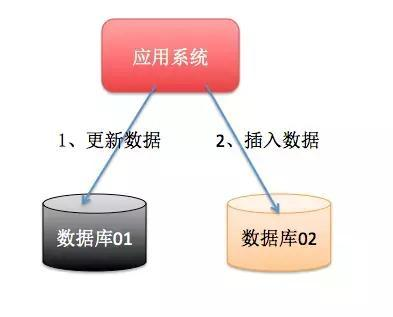


**2.2 应用SOA化**

所谓的SOA化，就是业务的服务化。比如原来单机支撑了整个电商网站，现在对整个网站进行拆解，分离出了订单中心、用户中心、库存中心。对于订单中心，有专门的数据库存储订单信息，用户中心也有专门的数据库存储用户信息，库存中心也会有专门的数据库存储库存信息。这时候如果要同时对订单和库存进行操作，那么就会涉及到订单数据库和库存数据库，为了保证数据一致性，就需要用到分布式事务。

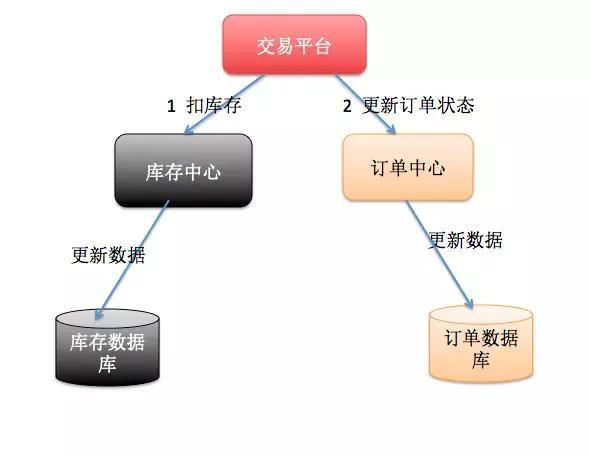


以上两种情况表象不同，但是本质相同，都是因为要操作的数据库变多了！

#### 3 事务的ACID特性

**3.1 原子性（A）**

所谓的原子性就是说，在整个事务中的所有操作，要么全部完成，要么全部不做，没有中间状态。对于事务在执行中发生错误，所有的操作都会被回滚，整个事务就像从没被执行过一样。

**3.2 一致性（C）**

事务的执行必须保证系统的一致性，就拿转账为例，A有500元，B有300元，如果在一个事务里A成功转给B50元，那么不管并发多少，不管发生什么，只要事务执行成功了，那么最后A账户一定是450元，B账户一定是350元。

**3.3 隔离性（I）**

所谓的隔离性就是说，事务与事务之间不会互相影响，一个事务的中间状态不会被其他事务感知。

**3.4 持久性（D）**

所谓的持久性，就是说一单事务完成了，那么事务对数据所做的变更就完全保存在了数据库中，即使发生停电，系统宕机也是如此。

#### 4 分布式事务的应用场景

**4.1 支付**

最经典的场景就是支付了，一笔支付，是对买家账户进行扣款，同时对卖家账户进行加钱，这些操作必须在一个事务里执行，要么全部成功，要么全部失败。而对于买家账户属于买家中心，对应的是买家数据库，而卖家账户属于卖家中心，对应的是卖家数据库，对不同数据库的操作必然需要引入分布式事务。

**4.2 在线下单**

买家在电商平台下单，往往会涉及到两个动作，一个是扣库存，第二个是更新订单状态，库存和订单一般属于不同的数据库，需要使用分布式事务保证数据一致性。

#### 5 常见的分布式事务解决方案

**5.1 基于XA协议的两阶段提交**

XA是一个分布式事务协议，由Tuxedo提出。XA中大致分为两部分：事务管理器和本地资源管理器。其中本地资源管理器往往由数据库实现，比如Oracle、DB2这些商业数据库都实现了XA接口，而事务管理器作为全局的调度者，负责各个本地资源的提交和回滚。XA实现分布式事务的原理如下：

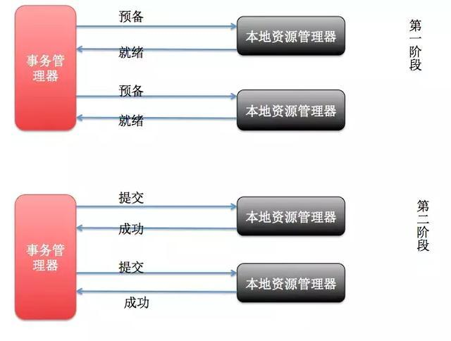


总的来说，XA协议比较简单，而且一旦商业数据库实现了XA协议，使用分布式事务的成本也比较低。但是，XA也有致命的缺点，那就是性能不理想，特别是在交易下单链路，往往并发量很高，XA无法满足高并发场景。XA目前在商业数据库支持的比较理想，在mysql数据库中支持的不太理想，mysql的XA实现，没有记录prepare阶段日志，主备切换回导致主库与备库数据不一致。许多nosql也没有支持XA，这让XA的应用场景变得非常狭隘。

**5.2 消息事务+最终一致性**

所谓的消息事务就是基于消息中间件的两阶段提交，本质上是对消息中间件的一种特殊利用，它是将本地事务和发消息放在了一个分布式事务里，保证要么本地操作成功成功并且对外发消息成功，要么两者都失败，开源的RocketMQ就支持这一特性，具体原理如下：

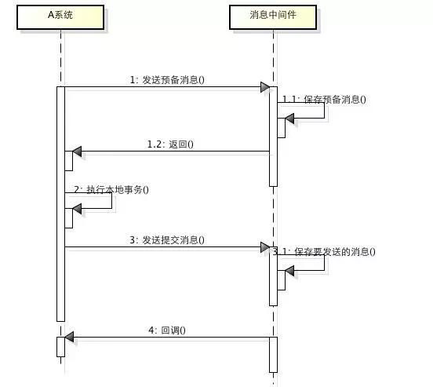


1、A系统向消息中间件发送一条预备消息

2、消息中间件保存预备消息并返回成功

3、A执行本地事务

4、A发送提交消息给消息中间件

通过以上4步完成了一个消息事务。对于以上的4个步骤，每个步骤都可能产生错误，下面一一分析：

步骤一出错，则整个事务失败，不会执行A的本地操作；

步骤二出错，则整个事务失败，不会执行A的本地操作；

步骤三出错，这时候需要回滚预备消息，怎么回滚？答案是A系统实现一个消息中间件的回调接口，消息中间件会去不断执行回调接口，检查A事务执行是否执行成功，如果失败则回滚预备消息；

步骤四出错，这时候A的本地事务是成功的，那么消息中间件要回滚A吗？答案是不需要，其实通过回调接口，消息中间件能够检查到A执行成功了，这时候其实不需要A发提交消息了，消息中间件可以自己对消息进行提交，从而完成整个消息事务。

基于消息中间件的两阶段提交往往用在高并发场景下，将一个分布式事务拆成一个消息事务（A系统的本地操作+发消息）+B系统的本地操作，其中B系统的操作由消息驱动，只要消息事务成功，那么A操作一定成功，消息也一定发出来了，这时候B会收到消息去执行本地操作，如果本地操作失败，消息会重投，直到B操作成功，这样就变相地实现了A与B的分布式事务。原理如下：

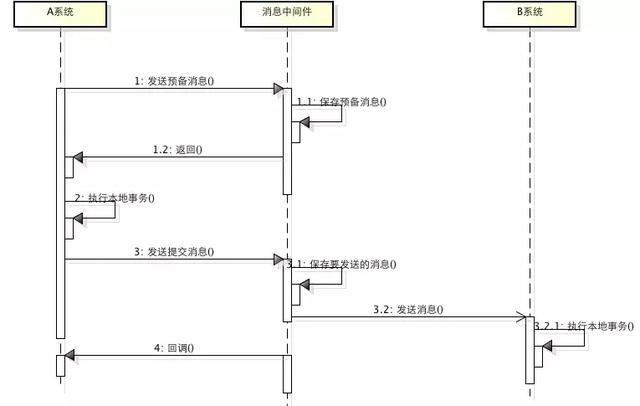


虽然上面的方案能够完成A和B的操作，但是A和B并不是严格一致的，而是最终一致的，我们在这里牺牲了一致性，换来了性能的大幅度提升。当然，这种玩法也是有风险的，如果B一直执行不成功，那么一致性会被破坏，具体要不要玩，还是得看业务能够承担多少风险。

**5.3 TCC编程模式**

所谓的TCC编程模式，也是两阶段提交的一个变种。TCC提供了一个编程框架，将整个业务逻辑分为三块：Try、Confirm和Cancel三个操作。以在线下单为例，Try阶段会去扣库存，Confirm阶段则是去更新订单状态，如果更新订单失败，则进入Cancel阶段，会去恢复库存。总之，TCC就是通过代码人为实现了两阶段提交，不同的业务场景所写的代码都不一样，复杂度也不一样，因此，这种模式并不能很好地被复用。

#### 6 总结

分布式事务，本质上是对多个数据库的事务进行统一控制，按照控制力度可以分为：不控制、部分控制和完全控制。

不控制就是不引入分布式事务，部分控制就是各种变种的两阶段提交，包括上面提到的消息事务+最终一致性、TCC模式。

完全控制就是完全实现两阶段提交。

部分控制的好处是并发量和性能很好，缺点是数据一致性减弱了，完全控制则是牺牲了性能，保障了一致性。

具体用哪种方式，最终还是取决于业务场景。

作为技术人员，一定不能忘了技术是为业务服务的，不要为了技术而技术，针对不同业务进行技术选型也是一种很重要的能力！


# SpringCloud 分布式微服务的实现

## 分布式系统

微服务就是原来臃肿的项目拆分为多个模块互不关联。如：按照子服务拆分、数据库、接口，依次往下就更加细粒度，当然运维也就越来越难受了。

分布式则是偏向与机器将诺大的系统划分为多个模块部署在不同服务器上。

微服务和分布式就是作用的“目标不一样”。


## 微服务与 Cloud

微服务是一种概念，Spring-Cloud是微服务的实现。

微服务也不一定必须使用Cloud来实现，只是微服务中有许多问题，如：负载均衡、服务注册与发现、路由等等，而 Cloud 则是将这些处理问题的技术整合了。

## SpringCloud 组件

**Eureka**

Eureka是Netifix的子模块之一，Eureka有2个组件，一个 EurekaServer 实现中间层服务器的负载均衡和故障转移，一个 EurekaClient 使得与server交互变得简单。

Spring-Cloud封装了Netifix公司开发的Eureka模块来实现服务注册和发现。

通过 Eureka的客户端 Eureka Server维持心跳连接，维护可以更方便监控各个微服务的运行。

**角色关系图**


**Eureka使用**

客户端

```xml
<dependency>
    <groupId>org.Springframework.cloud</groupId>
    <artifactId>Spring-cloud-starter-netflix-eureka-client</artifactId>
</dependency>
server:
port: 4001
eureka:
client:
serviceUrl:
defaultZone: http://localhost:3000/eureka/ #eureka服务端提供的注册地址 参考服务端配置的这个路径
instance:
instance-id: admin-1 #此实例注册到eureka服务端的唯一的实例ID
prefer-ip-address: true #是否显示IP地址
leaseRenewalIntervalInSeconds: 10 #eureka客户需要多长时间发送心跳给eureka服务器，表明它仍然活着,默认为30 秒 (与下面配置的单位都是秒)
leaseExpirationDurationInSeconds: 30 #Eureka服务器在接收到实例的最后一次发出的心跳后，需要等待多久才可以将此实例删除，默认为90秒

Spring:
application:
name: server-admin #此实例注册到eureka服务端的name
```


服务端

```xml
<dependency>
    <groupId>org.Springframework.cloud</groupId>
    <artifactId>Spring-cloud-starter-netflix-eureka-server</artifactId>
</dependency>
yml文件声明 
server:
port: 3000
eureka:
server:
enable-self-preservation: false #关闭自我保护机制
eviction-interval-timer-in-ms: 4000 #设置清理间隔
（单位：毫秒 默认是60*1000）
instance:
hostname: localhost 
client:
registerWithEureka: false #不把自己作为一个客户端注册到自己身上
fetchRegistry: false #不需要从服务端获取注册信息
（因为在这里自己就是服务端，而且已经禁用自己注册了）
serviceUrl:
defaultZone: http://${eureka.instance.hostname}:${server.port}/eureka
在SpringBoot 启动项目中加入注解:@EnableEurekaServer 
就可以启动项目了，访问对应地址就可以看到界面。
```


**Eureka 集群**

服务启动后 Eureka Server会向其他服务server 同步，当消费者要调用服务提供者，则向服务注册中心获取服务提供者的地址，然后将提供者的地址缓存到本地，下次调用时候直接从本地缓存中获取

**yml 服务端**

```xml
server:
port: 3000
eureka:
server:
enable-self-preservation: false #关闭自我保护机制
eviction-interval-timer-in-ms: 4000 #设置清理间隔
（单位：毫秒 默认是60*1000）
instance:
hostname: eureka3000.com 
client:
registerWithEureka: false #不把自己作为一个客户端
注册到自己身上
fetchRegistry: false #不需要从服务端获取注册信息
（因为在这里自己就是服务端，而且已经禁用自己注册了）
serviceUrl:
defaultZone: http://eureka3001.com:3001/eureka,
http://eureka3002.com:3002/eureka
(这里不注册自己，注册到其他服务上面以为会同步。)
```


**yml 客户端**

```xml
server:
port: 4001
eureka:
client:
serviceUrl:
defaultZone:http://localhost:3000/eureka/,http://
eureka3001.com:3001/eureka,http://eureka3002.com:3 002
/eureka #eureka服务端提供的注册地址 参考服务端配置的这个路径
instance:
instance-id: admin-1 #此实例注册到eureka服务端的唯一的实例ID
prefer-ip-address: true #是否显示IP地址
leaseRenewalIntervalInSeconds: 10 #eureka客户需要多长时间发
送心跳给eureka服务器，表明它仍然活着,默认为30 秒 (与下面配置的单位都是秒)
leaseExpirationDurationInSeconds: 30 #Eureka服务器在
接收到实例的最后一次发出的心跳后，需要等待多久才可以将此实例删除，默认为90秒

Spring:
application:
name: server-admin #此实例注册到eureka服务端的name

```


**CAP定理**

```txt
C：Consistency 一致性
A：Availability 可用性
P：Partition tolerance 分区容错性
这三个指标不能同时达到
```


**Partition tolerance**

分区容错性，大多数分布式系统都部署在多个子网络。每一个网络是一个区。区间的通信是可能失败的如一个在本地，一个在外地，他们之间是无法通信的。分布式系统在设计的时候必须要考虑这种情况。

**Consistency**

一致性，写操作后的读取，必须返回该值。如：服务器A1和服务器A2，现在发起操作将A1中V0改为V1，用户去读取的时候读到服务器A1得到V1，如果读到A2服务器但是服务器还是V0，读到的数据就不对，这就不满足一致性。

所以让A2返回的数据也对，的让A1给A2发送一条消息，把A2的V0变为V1，这时候不管从哪里读取都是修改后的数据。

**Availability**

可用性就是用户只要给出请求就必须回应，不管是本地服务器还是外地服务器只要接收到就必须做出回应，不管数据是否是最新必须做出回应，否则就不是可用性。

**C与A矛盾**

一致性和可用性不能同时成立，存在分区容错性，通信可能失败。

如果保证一致性，A1在写操作时，A2的读写只能被锁定，只有等数据同步了才能读写，在锁定期间是不能读写的就不符合可用性。

如果保持可用性，那么A2就不会被锁定，所以一致性就不能成立。

综上 无法做到一致性和可用性，所以系统在设计的时候就只能选其一。

**Eureka与Zookeeper**

Zookeeper遵循的是CP原则保持了一致性，所以在master节点因为网络故障与剩余“跟随者”接点失去联系时会重新选举“领导者”，选取“领导者”大概会持续30-120s的时间，且选举的时候整个zookeeper是不可用的。导致在选举的时候注册服务瘫痪。

Eureka在设计的时候遵循AP可用性。Eureka各个接点是公平的，没有主从之分，down掉几个几点也没问题，其他接点依然可以支持注册，只要有一台Eureka在，注册就可以用，只不过查询到的数据可能不是最新的。Eureka有自我保护机制，如果15分钟之内超过85%接点都没有正常心跳，那么Eureka认为客户端与注册中心出现故障，此时情况可能是

Eureka不在从注册列表移除因为长时间没有瘦到心跳而过期的服务。

Eureka仍然能够接收注册和查询，但不会同步到其他接点。

当网络稳定后，当前的 实例注册信息会更新到其他接点。

**Ribbon**

rebbon主要提供客户端的负载均衡，提供了一套完善的客户端的配置。Rebbin会自动帮助你基于某种规则（如：简单的轮询，随机链接等）。

服务端的负载均衡是一个url通过一个代理服务器，然后通过代理服务器（策略：轮询，随机 ，权重等等），反向代理到你的服务器。

客户端负载均衡是通过一个请求在客户端已经声明了要调用那个服务，然后通过具体算法来完成负载均衡。

**Ribbon 使用**

引入依赖，Eureka以及把Ribbon集成在里面。

使用Ribbon只有在RestTemplate上面加入@LoadBalanced注解。

**Feign负载均衡**

feign是一个声明式的webService客户端，使用feign会让编写webService更简单，就是定义一个接口加上注解。

feign是为了编写java http客户端更加简单，在Ribbon+RestTemplate此基础上进一步封装，简化了使用Spring Cloud Ribbon时，自动封装服务调用客户端的开发量。

**Feign使用**

```xml
引入依赖
<dependency>
    <groupId>org.Springframework.cloud</groupId>
    <artifactId>Spring-cloud-starter-openfeign</artifactId>
</dependency>
在启动类上加@EnableFeignClients
然后在接口上加@FeignClient("SERVER-POWER")注解其中参数就是服务的名字。
```


**Feign集成Ribbon**

利用Ribbon维护服务列表信息，融合了Ribbon的负载均衡配置，与Ribbon不同的是Feign只需要定义服务绑定接口以声明的方式，实现简答的服务调用。

## hystrix 断路器

是一种用于处理分布式系统延迟和容错的开源库。在分布式系统中许多依赖不可避免的会调用失败，比如超时、异常等，断路器保证出错不会导致整体服务失败，避免级联故障。

断路器其实就是一种开关设置，类似保险丝，像调用方返回一个符合预期的、可处理的备选响应，而不是长时间等待或者抛出无法处理的异常，保证服务调用方线程不会被长时间 不必要占用，从而避免了在分布式系统中蔓延，乃至雪崩。

微服务中 client->微服务A->微服务B->微服务C->微服务D,其中微服务B异常了，所有请求微服务A的请求都会卡在B这里，就会导致线程一直累积在这里，那么其他微服务就没有可用线程，导致整个服务器雪崩。

针对这方案有 服务限流、超时监控、服务熔断、服务降级

**降级 超时**

降级就是服务响应过长 ，或者不可用了，就是服务调用不了了，我们不能把错误信息返回出来，或者长时间卡在哪里，所以要准备一个策略当发生这种问题我们直接调用这个方法快速返回这个请求，不让他一直卡在那。

要在调用方做降级（要不然那个微服务都down掉了在做降级就没有意义）。

引入hystrix依赖

```xml
<dependency> 
    <groupId>org.Springframework.cloud</groupId>
    <artifactId>Spring-cloud-starter-netflix-hystrix</artifactId> 
</dependency>
在启动类上加入@EnableHystrix 或者@EnableCircuitBreaker。
@RequestMapping("/feignPower.do") 
@HystrixCommand(fallbackMethod = "fallbackMethod") 
public Object feignPower(String name){ 
return powerServiceClient.power(); 
} 
fallbackMethod：
public Object fallbackMethod(String name){ 
System.out.println(name); 
return R.error("降级信息"); 
}
这里的降级信息具体内容根据业务需求来，比如返回一个默认的查询信息等等。
hystrix有超时监听，当你请求超过1秒 就会超时，这个是可以配置的

```


这里的降级信息具体内容根据业务需求来，比如返回一个默认的查询信息等等。

hystrix有超时监听，当你请求超过1秒 就会超时，这个是可以配置的

**降级什么用**

第一他可以监听服务有没有超时。第二报错了他这里直接截断了没有让请求一直卡在这个。

其实降级，当你系统迎来高并发的时候，这时候发现系统马上承载不了这个大的并发 ，可以先关闭一些不重要 的微服务（就是在降级方法返回一个比较友好的信息）把资源让出来给主服务，其实就是整体资源不够用了，忍痛关闭某些服务，待过渡后再打开。

**熔断限流**

熔断就像生活中的跳闸，比如电路故障了，为了防止事故扩大，这里切断你的电源以免意外发生。当一个微服务调用多次，hystrix就会采取熔断机制，不在继续调用你的方法，会默认短路，5秒后试探性的先关闭熔断机制，如果在这时候失败一次会直接调用降级方法，一定程度避免雪崩，

限流，限制某个微服务使用量，如果线程占用超过了，超过的就会直接降级该次调用。

**Feign整合hystrix**

```java
// feign默认支持hystrix，需要在yml配置中打开。
// feign: 
// hystrix: 
// enabled: true

// 降级方法
@FeignClient(value = "SERVER-POWER", fallback = PowerServiceFallBack.class)
public interface PowerServiceClient {
    @RequestMapping("/power.do")
    public Object power(@RequestParam("name") String name);
}

// 在feign客户端的注解上 有个属性叫fallback 然后指向一个类 PowerServiceClient 
@Component
public class PowerServiceFallBack implements PowerServiceClient {
    @Override
    public Object power(String name) {
        return R.error("测试降级");
    }
}
```


## Zuul 网关

zuul包含了对请求的路由和过滤两个主要功能

路由是将外部请求转发到具体的微服务实例上。是实现统一入口基础而过滤器功能负责对请求的处理过程干预，是实现请求校验等功能。

Zuul与Eureka进行整合，将zuul注册在Eureka服务治理下，同时从Eureka获取其他服务信息。（zuul分服务最终还是注册在Eureka上）

**路由**

```xml
<dependency>
    <groupId>org.Springframework.cloud</groupId>
    <artifactId>Spring-cloud-starter-netflix-zuul</artifactId>
</dependency>
<dependency>
    <groupId>org.Springframework.cloud</groupId>
    <artifactId>Spring-cloud-starter-netflix-eureka-client</artifactId>
</dependency>
最后要注册在Eureka上所以需要引入eureka依赖
YML
server:
port: 9000
eureka:
client:
serviceUrl:
defaultZone: http://localhost:3000/eureka/ #eureka服务端提供的注册地址 参考服务端配置的这个路径
instance:
instance-id: zuul-0 #此实例注册到eureka服务端的唯一的实例ID
prefer-ip-address: true #是否显示IP地址
leaseRenewalIntervalInSeconds: 10 #eureka客户需要多长时间发送心跳给eureka服务器，表明它仍然活着,默认为30 秒 (与下面配置的单位都是秒)
leaseExpirationDurationInSeconds: 30 #Eureka服务器在接收到实例的最后一次发出的心跳后，需要等待多久才可以将此实例删除，默认为90秒

Spring:
application:
name: zuul #此实例注册到eureka服务端的name 
启动类 @EnableZuulProxy

在实际开发当中我们肯定不会/server-power这样通过微服务调用，
可能只要一个/power就好了 
zuul: 
routes:
mypower: 
serviceId: server-power 
path: /power/** 
myorder: 
serviceId: server-order 
path: /order/**
注意/**代表是所有层级 /* 是代表一层。
一般我们会禁用服务名调用
ignored-services：server-order 这样就不能通过此服务名调用，
不过这个配置如果一个一个通微服务名字设置太复杂
一般禁用服务名 ignored-services：“*”
有时候要考虑到接口调用需要一定的规范，比如调用微服务URL需要前缀/api，可以加上一个prefix
prefix：/api 在加上strip-prefix: false /api前缀是不会出现在路由中
zuul:
prefix: /api
ignored-services: "*"
stripPrefix: false
routes:
product:
serviceId: server-product
path: /product/**
order:
serviceId: server-order
path: /order/**

```


**过滤器**

过滤器(filter)是zuul的核心组件，zuul大部分功能是通过过滤器实现的，zuul中定义了4种标准过滤器类型，这些过滤器类型对应与请求的生命周期，

PRE：这种过滤器在请求路由前被调用，可利用过滤器进行身份验证，记录请求微服务的调试信息等。

ROUTING：这种过滤器将请求路由到微服务，这种过滤器用于构建发送给微服务请求，并使用 Apache HttpClient或Netfix Ribbon请求微服务。

POST：这种过滤器在路由微服务后执行，可用来相应添加标准的HTTP Header、收集统计信息和指标、将响应从微服务发送给客户端。

ERROR：在其他阶段发送错误时执行过滤器

**继承ZuulFilter**

````java
@Component
public class LogFilter extends ZuulFilter { 
    @Override
    public String filterType() {
        return FilterConstants.PRE_TYPE;
    }

    @Override
    public int filterOrder() {
        return FilterConstants.PRE_DECORATION_FILTER_ORDER+1;
    }

    @Override
    public boolean shouldFilter() {
        return true;
    }

    @Override
    public Object run() throws ZuulException {
        RequestContext ctx = RequestContext.getCurrentContext();
        //被代理到的微服务
        String proxy = (String)ctx.get("proxy");
        //请求的地址
        String requestURI = (String)ctx.get("requestURI");
        //zuul路由后的url
        System.out.println(proxy+"/"+requestURI);
        HttpServletRequest request = ctx.getRequest();
        String loginCookie = CookieUtil.getLoginCookie(request);
        ctx.addZuulRequestHeader("login_key",loginCookie);
        return null;
    }
}
````


由此可知道自定义zuul Filter要实现以下几个方法。

filterType：返回过滤器类型，有pre、route、post、erro等几种取值

filterOrder：返回一个int值指定过滤器的顺序，不同过滤器允许返回相同数字。

shouldFilter：返回一个boolean判断过滤器是否执行，true执行，false不执行。

run：过滤器的具体实现。

Spting-Cloud默认为zuul编写并开启一些过滤器。如果要禁用部分过滤器，只需在application.yml里设置zuul…disable=true，例如zuul.LogFilter.pre.disable=true

zuul也整合了了hystrix和ribbon的， 提供降级回退，继承FallbackProvider 类 然后重写里面的方法。


# Spring 基础知识点

## Spring Cloud——分布式主要使用组件

- 注册中心 Eureka 将各种服务注册到里面，之后调用要先来这里拿服务
- 调用 feign
- 负载均衡 ribbon 同一个服务有可能注册多个，从注册中心拿到多个服务的列表，按照一定的负载均衡策略，完成调用。
- 正常调用，如果服务突然挂掉了，为保证服务的健壮性，就要用到 hystrix 来做一个熔断、降级和限流。
- 配置中心 apollo/configure 如果这些配置分散到不同的微服务当中，管理起来不好管理的，所以需要一个统一配置中心
- 网关 zuul 微服务最终是要暴露给前端调用的，而前端如果是一个服务就有一个地址，非常不好管理，那么就需要统一地址；还可以对要访问的微服务做统一鉴权等操作。而这些操作通通都交给微服务的网关去处理。并且可以做限流。

鉴权设计

RBAC 基于角色的设计，基于角色的授权——用户-角色-权限-资源

用户角色多对多，角色权限多对多，权限资源一般一对一

单体项目shiro，微服务 Spring Security

shiro 后端系统 需要登录 权限分配策略 url 资源有没有对应的权限 做权限拦截 jwt - json web token

jwt 微服务项目中 校验机制 登录完之后 本来正常返回消息 而 jwt 把权限、用户信息放到 jwt 资源当中，缓存到 rule 里面，下一次用户来访问的时候，可直接通过用户传过来的 token 做校验，就不需要查询数据库了。所以 jwt 就是对一些权限数据进行缓存处理，然后再获取资源是直接解析就可以了。


## 分布式事务

后台管理系统用 seeta， redisson

二阶段提交，效率低，但是解耦

tcc，缺点是将事务耦合在业务代码中，会对代码造成一定污染和侵害，效率可能稍高，但其实能高多少呢？

基于 tcc 优化方案，最大努力通知，基于消息队列

还有最终消息可靠（一致性）：

A：生产者将消息确保发给你，但是消费者能否消费由 B 保证；

B：对方尽最大努力通知我，比如一些支付系统。比如我调支付系统，以它为核心，那么它支付完成以后呢，尽最大努力来通知我，通知完之后我这边就要去做后续处理，那如果出现通知中断，就需要让对方提供一个查询接口，如果实在通知不到我，我就再去查询，最终达到一个一致性。

而生产者如何确保消息一定发送成功，放到队列中了呢？或者说，因为网络抖动，多发了几次消息。

阿里提供了 RocketMQ，支持事务消息，保证方队列的操作和保存数据库的操作，是个原子性操作，幂等性。


## 核心

Spring的两大核心当属**IoC**和**AOP**。

### IoC

IoC是控制反转(**I**nversion **O**f **C**ontrol)，IoC是一种**编程思想**。Spring的IoC容器实现了IoC，是Spring框架的基本功能，管理着Spring应用中bean的**创建**、**配置**和**管理**。Spring的IoC容器接管了应用中的bean，能够自动解决bean与bean之间的依赖。

> 传统应用程序是由我们自己在对象中主动控制去直接获取依赖对象，也就是正转；而反转则是由容器来帮忙创建及注入依赖对象；因为由容器帮我们查找及注入依赖对象，对象只是被动的接受依赖对象，所以是反转。因此反转是指：依赖对象的获取被反转了。

IoC容器对使用者来说就像是一个黑盒，不需要关心bean之间的依赖是怎样的，大大减少了编程的难度。

IoC的实现方式有两种：**依赖注入**（Dependency Injection，DI）和**依赖查找**（Dependency Lookup，DL）

- **依赖注入**：应用程序**被动**的接收对象，bean实例化的时候，IoC容器会自动根据**类型**或者**名称**，把依赖的其他bean注入给当前bean。依赖注入的方式主要有以下四种：**注解**：通过注解来让IoC容器注入所依赖类型的对象，例如最常用的@Autowired。**构造方法**：实现对应参数的构造方法，在创建对象时来让IoC容器注入所依赖类型的对象。**setter方法**：实现对应属性的setter方法，来让IoC容器注入所依赖类型的对象。**接口**：实现特定接口以，让IoC容器注入所依赖类型的对象。
- **依赖查找**：依赖查找是容器中的对象，通过容器的API，来查找自己所依赖的资源和对象。相比于**依赖注入**，**依赖查找**是一种更加主动的方式。


### AOP

AOP(**A**spect-**O**riented **P**rogramming)即**面向切面编程**，是一种完全不同于OOP的**编程思想**。AOP不是用来取代OOP的，反而是来补充OOP的。

OOP的思想把项目分为**层次结构**，是一种**从上到下**的结构。这种上下结构想要做到从**左到右**是一件非常繁琐的事。这种**从左到右**的需求往往是一些诸如**日志**、**安全**、**事务**等，非业务性的功能。这样的功能如果按照OOP的思想来实现，就会导致大量冗余、侵入性强的代码。所以AOP的作用就是剥离一些非业务代码，做到统一管理。

AOP的功能就是在**运行时**，把指定的代码**动态的**加入到指定的地方，来完成一些非业务逻辑的功能，从而避免手动编写这些代码。

AOP往往采用**动态代理**的方式来实现。


## 作用域

Spring bean的作用域主要有五种：

- singleton：在整个Spring IoC容器仅存在一个Bean实例，Bean以**单例**方式存在。singleton是Spring的**默认**配置。
- prototype：**每次**从Spring IoC容器中获取Bean时，都返回一个**新的实例**。
- request：每次HTTP请求都会创建一个新的Bean实例。该作用域仅适用于Spring构建的web环境。
- session：同一个HTTP Session共享一个Bean，不同Session使用不同的Bean。该作用域仅适用于Spring构建的web环境。
- application：限定一个Bean的作用域为整个web应用。该作用域仅适用于Spring构建的web环境。

## 实例化

Spring中的bean的实例化主要有三种方式

- **无参构造方法**，这种方式最常用
- 使用静态工厂
- 使用实例工厂

## 注入方式

属性的注入有两种方式：byType和byName。

- byType：如果容器中存在一个与指定属性**类型相同**的bean，那么将该属性自动装配。
  比如在Controller注入Serviceprivate IUserService userService 1byType方式会自动注入IUserService的实现类UserServiceImpl，如果实现类有多个，默认会抛出异常。下文讲述如何解决。
- byName：通过**属性名称**自动装配。
  比如在Controller注入Serviceprivate IUserService userService 1通过byName的方式需要指定实现类UserServiceImpl的**Name**@Service("userService") public class UserServiceImpl implements IUserService {...} 12

## 事务隔离级别

Spring提供了五种隔离级别：

- DEFAULT（默认）：意思就是数据库用啥我用啥
- SERIALIZABLE（串行化）：事务之间以一种串行的方式执行
- REPEATABLE READ（可重复读）：是MySQL默认的隔离级别，同一个事务中相同的查询会看到同样的数据行
- READ COMMITED（读已提交）：一个事务可以读到另一个事务已经提交的数据
- READ UNCOMMITED（读未提交）：一个事务可以读到另一个事务未提交的数据

除了第一个是Spring新增的，其余的四个都是和**数据库的事务隔离级别**一一对应

## 事务传播机制

事务传播机制是指在一个可能含有事务的方法中，调用了另一个可能含有事务的方法，这两个事务应该如何去取舍。最常见的场景就是在Service层。比如OrderService#createOrder()方法里调用了StockService#decreaseStock()，而这两个方法明显都是有事务的。这时，两个事务如何相互影响就是事务传播机制。

Spring提供了七种事务传播机制：

- REQUIRED：Spring**默认值**，如果存在事务，则加入当前事务；如果没有事务，则开启一个新的事务。
- REQUIRES_NEW：如果当前存在事务，把当前事务挂起，新建事务。
- SUPPORTS：支持当前事务，如果当前没有事务，就以非事务方式执行。
- NOT_SUPPORTED：以非事务方式执行操作，如果当前存在事务，就把当前事务挂起。
- MANDATORY：如果当前存在事务，则加入当前事务；如果没有事务，就抛出异常。
- NEVER：以非事务方式执行，如果当前存在事务，则抛出异常。
- NESTED：支持当前事务，新增Savepoint，与当前事务同步提交或回滚。外层事务失败时，会回滚内层事务所做的动作。而内层事务操作失败并不会引起外层事务的回滚。

## 生命周期

Spring管理了对象的生命周期，所以有必要了解Spring到底是怎么管理bean的生命周期的。如果我们想要在bean生命周期的某个时刻执行特定的功能应该怎么办？

Spring bean的生命周期颇为复杂，以下是整个过程，参考org.Springframework.beans.factory.BeanFactory


## 常用注解

### 标识类

- @Component：标识此类由Spring IoC容器管理
- @Controller：标识此类是接收和转发请求用的Controller类，是@Component的细化注解
- @Service：标识此类是处理业务逻辑的Service类，是@Component的细化注解
- @Repository：标识此类是处理**持久化**操作相关的类，通常是XxxDao，是@Component的细化注解

### 注入类

- @Autowired：属于Spring，是根据类型（byType）的方式自动注入属性，默认是必须的。如果要设置成可选，需要把required设置成

```java
@Autowired(required = false)
private IUserService userService;
```

如果IUserService的实现类不止一个，默认会报错。需要配合注解@Qualifier指定具体的实现类

```java
public interface IUserService {
}

@Component("helloUserService")
public class HelloUserServiceImpl implements IUserService {
}

@Component("worldUserService")
public class WorldUserServiceImpl implements IUserService {
}
```

正确注入方式

```java
@Autowired
@Qualifier("helloUserService")
private IUserService userService;
```

- @Qualifier：见@Autowired
- @Resource属于JDK，默认是按照名称（byName）进行装配的。如果没有指定name属性，默认取字段的名称作为bean名称寻找依赖对象。如果没有指定name属性，且byName的方式无法装配，则会按照byType的方式进行装配。如果仅指定的type属性，也会通过byType的方式进行装配，找不到或者找到多个都会抛异常。只要指定了name属性，就不会再按照byType的方式进行装配。
- @Value：用于注入一些配置文件中的常量，如jdbc相关的配置等

### web相关

- @RequestMapping：这个注解会将HTTP请求映射到Controller的处理方法上。

```java
// 简单用法
@RequestMapping("/index")

// 映射多个url
@RequestMapping({"/index", "/home"})

// 限制请求方式为Post，等同于注解 @PostMapping("/index")
@RequestMapping(value = "/index", method = RequestMethod.POST)
```

@RequestBody：将HTTP请求正文插入方法中，用来处理请求的Content-Type不是application/x-www-form-urlencoded（表单）编码的内容，例如：application/json、application/xml等。也就是说当客户端向后台提交数据不是以表单，而是以JSON数据的方式时，可以使用@RequestBody注解将数据映射到后台参数列表

```java
// 前端
$.ajax({
    type: 'POST',
    dataType: "json",
    contentType: "application/json; charset=utf-8",
    data: JSON.stringify(paramJson),
    url: "",
    success: function (data) {
    }
});

// 后台
@RequestMapping("/xxx")
public Sring xxx(@RequestBody UserDTO userDTO) {
    return "success";
}
```

@RequestParam：用来辅助绑定特殊要求的参数

```java
// 表示该接口必须传递参数id
@RequestMapping("/xxx")
public String xxx(@RequestParam("id") String id) {
    return "";
}

// 参数id可以不传
@RequestMapping("/xxx")
public String xxx(@RequestParam(name = "id", required = false) String id) {
    return "success";
}
```

@PathVariable：表示将url中的参数变量绑定到参数列表

```java
// 将参数列表中的值自动填充到url中的变量中
@RequestMapping("/order/{orderId}")
public String xxx(@PathVariable String orderId) {
    return "success";
}

// 如果参数列表中的参数名和url中的不一致，则需要指定@PathVariable的name属性
@RequestMapping("/order/{orderId}")
public String xxx(@PathVariable(name = "orderId") String id) {
    return "success";
}
```

@ResponseBody：表示该方法的返回的结果直接写入 HTTP 响应正文中，而不是跳转到某个路径，一般用于向客户端返回JSON数据。

```java
// 把success字符串返回给客户端
@ResponseBody
@RequestMapping("/xxx")
public String xxx() {
   return "success";
}
```


## SpringMVC请求过程

一图胜千言


## 总结

本篇主要列举了与Spring相关的一些基础知识，包括IoC、AOP、bean的作用域、生命周期、事务传播机制、常用注解等。了解了这些基础知识，能帮助我们更好的使用Spring。


# [Spring事件驱动模型--观察者模式在Spring中的应用](https://www.cnblogs.com/fingerboy/p/6393644.html)

Spring中的事件驱动模型也叫作发布订阅模式,是观察者模式的一个典型的应用,关于观察者模式在之前的博文中总结过

http://www.cnblogs.com/fingerboy/p/5468994.html 

这里主要讲一下Spring中的观察者模式的应用.

## Spring事件驱动模型的结构.

　　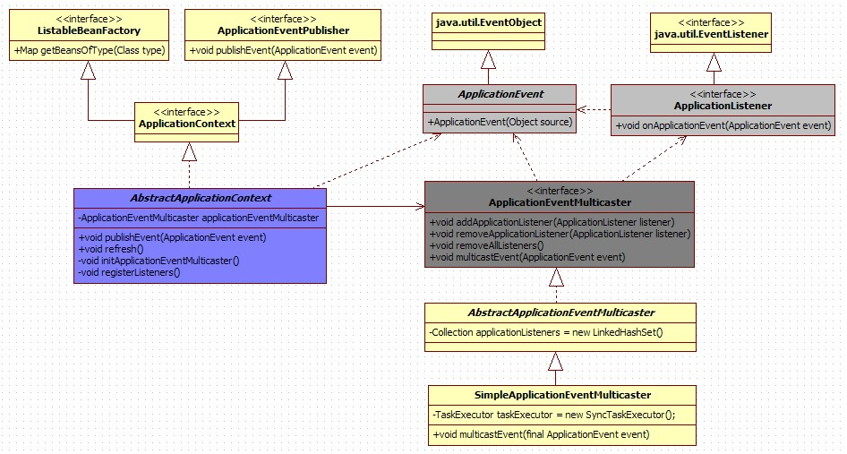

　　首先明确几个Spring提供的类的概念

## 　　1.ApplicationEvent

```java
public abstract class ApplicationEvent extends EventObject {
    private static final long serialVersionUID = 7099057708183571937L;
    private final long timestamp;
    public ApplicationEvent(Object source) {
        super(source);
        this.timestamp = System.currentTimeMillis();
    }
    public final long getTimestamp() {
        return this.timestamp;
    }
}
```

　　ApplicationEvent继承自jdk的EventObject,所有的事件都需要继承ApplicationEvent,并且通过source得到事件源.该类的实现类ApplicationContextEvent表示ApplicaitonContext的容器事件.

## 　　2.ApplicationListener

```java
public interface ApplicationListener<E extends ApplicationEvent> extends EventListener {
    void onApplicationEvent(E event);
}
```

　　ApplicationListener继承自jdk的EventListener,所有的监听器都要实现这个接口,这个接口只有一个onApplicationEvent()方法,该方法接受一个ApplicationEvent或其子类对象作为参数,在方法体中,可以通过不同对Event类的判断来进行相应的处理.当事件触发时所有的监听器都会收到消息,如果你需要对监听器的接收顺序有要求,可是实现该接口的一个实现SmartApplicationListener,通过这个接口可以指定监听器接收事件的顺序.

## 　　3.ApplicationContext

　　　事件机制的实现需要三个部分,事件源,事件,事件监听器,在上面介绍的ApplicationEvent就相当于事件,ApplicationListener相当于事件监听器,这里的事件源说的就是applicaitonContext.

　　 ApplicationContext是Spring中的全局容器,翻译过来是"应用上下文"的意思,它用来负责读取bean的配置文档,管理bean的加载,维护bean之间的依赖关系,可以说是负责bean的整个生命周期,再通俗一点就是我们平时所说的IoC容器.　

   Application作为一个事件源,需要显示的调用publishEvent方法,传入一个ApplicationEvent的实现类对象作为参数,每当ApplicationContext发布ApplicationEvent时,所有的ApplicationListener就会被自动的触发.

　　ApplicationContext接口实现了ApplicationEventPublisher接口,后者有一个很重要的方法:

```java
public interface ApplicationEventPublisher {
    void publishEvent(ApplicationEvent event);
}
```

　　我们常用的ApplicationContext都继承了AbstractApplicationContext,像我们平时常见的ClassPathXmlApplicationContext、XmlWebApplicationContex也都是继承了它,AbstractApplicationcontext是ApplicationContext接口的抽象实现类,在该类中实现了publishEvent方法

```java
public void publishEvent(ApplicationEvent event) {
        Assert.notNull(event, "Event must not be null");
        if (logger.isTraceEnabled()) {
            logger.trace("Publishing event in " + getDisplayName() + ": " + event);
        }
        getApplicationEventMulticaster().multicastEvent(event);
        if (this.parent != null) {
            this.parent.publishEvent(event);
        }
    }
```

　　在这个方法中,我们看到了一个getApplicationEventMulticaster().这就要牵扯到另一个类ApplicationEventMulticaster.

## 　　4.ApplicationEventMulticaster

　　属于事件广播器,它的作用是把Applicationcontext发布的Event广播给所有的监听器.

　　在AbstractApplicationcontext中有一个applicationEventMulticaster的成员变量,提供了监听器Listener的注册方法.

```java
public abstract class AbstractApplicationContext extends DefaultResourceLoader
        implements ConfigurableApplicationContext, DisposableBean {

　　private ApplicationEventMulticaster applicationEventMulticaster;
　　protected void registerListeners() {
        // Register statically specified listeners first.
        for (ApplicationListener<?> listener : getApplicationListeners()) {
            getApplicationEventMulticaster().addApplicationListener(listener);
        }
        // Do not initialize FactoryBeans here: We need to leave all regular beans
        // uninitialized to let post-processors apply to them!
        String[] listenerBeanNames = getBeanNamesForType(ApplicationListener.class, true, false);
        for (String lisName : listenerBeanNames) {
            getApplicationEventMulticaster().addApplicationListenerBean(lisName);
        }
    }
}
```


## 　在 Spring 中使用事件监听机制的Demo

　　1. 建立事件类,继承applicationEvent

```java
public class MyEvent extends ApplicationEvent {

    public MyEvent(Object source) {
        super(source);
        System.out.println("my Event");
    }
    public void print(){
        System.out.println("hello Spring event[MyEvent]");
    }
}
```


2.建立监听类,实现ApplicationListener接口


```java
public class MyListener  implements ApplicationListener{
    
    public void onApplicationEvent(ApplicationEvent event) {
        if(event instanceof MyEvent){
            System.out.println("into My Listener");
            MyEvent myEvent=(MyEvent)event;
            myEvent.print();
        }
    }
}
```


这里再建一个监听类


```java
public class MyListener  implements ApplicationListener{
    
    public void onApplicationEvent(ApplicationEvent event) {
        if(event instanceof MyEvent){
            System.out.println("into My Listener");
            MyEvent myEvent=(MyEvent)event;
            myEvent.print();
        }
    }
}
```


　　3.创建一个发布事件的类,该类实现ApplicationContextAware接口,得到ApplicationContext对象,使用该对象的publishEvent方法发布事件.


```java
public class MyPubisher implements ApplicationContextAware {

    private ApplicationContext applicationContext;
    
    public void setApplicationContext(ApplicationContext applicationContext) throws BeansException {
        this.applicationContext=applicationContext;
    }
    public void publishEvent(ApplicationEvent event){
        System.out.println("into My Publisher's method");
        applicationContext.publishEvent(event);
    }
}
```


　　3.在Spring配置文件中,注册事件类和监听类,当然使用注解的方式也是一样的.(略)

　　4.测试


```java
public class MyTest {
    public static void main(String[] args) {
        ApplicationContext context=new ClassPathXmlApplicationContext("classpath:Spring/application-database.xml");
        MyPubisher myPubisher=(MyPubisher) context.getBean("myPublisher");
        myPubisher.publishEvent(new MyEvent("1"));
    }
}
```


　　查看控制台打印

> my Event
>
> into My Publisher's method
>
> **into My Listener**
> hello Spring event[MyEvent]
> **into My second Listener**
> hello Spring event[MyEvent]

## 总结

　　Spring的事件驱动模型使用的是 观察者模式

　　通过ApplicationEvent抽象类和ApplicationListener接口,可以实现ApplicationContext事件处理

　　监听器在处理Event时,通常会进行判断传入的Event是不是自己所想要处理的,使用instanceof关键字

　　ApplicationEventMulticaster事件广播器实现了监听器的注册,一般不需要我们实现,只需要显示的调用applicationcontext.publisherEvent方法即可


# 设计模式：策略+工厂+模板

在平时开发中，有时避免不了使用大量判断，简单处理的话就使用if...else...了，但过多层的if else对于性能有很大的开销，而且业务复杂的话，耦合太重，对于后期的拓展也不是很友好，所以使用策略模式。

## 1. 策略+工厂实现相同业务抽象

策略模式：一种解耦的方法，它对算法进行封装，使得算法的调用和算法本身分离。使用策略模式客户端代码不需要调整，算法之间可以互相替换，因为不同的算法实现的是同一个接口。策略模式是一种对象行为型模式。策略模式符合“开闭原则”。

策略模式包括如下角色：

- Context ：环境类
- Strategy：抽象策略类
- ConcreteStrategy：具体策略类

下面简单抽象下业务逻辑：

[](javascript:void(0);)

```java
String name = "shaqiang";

if(name.equals("saobin")){
    System.out.println("I am SaoBin");
}else if(name.equals("shaqiang")){
    System.out.println("I am ShaQiang");
}else if(name.equals("weifeng")){
    System.out.println("I am WeiFeng");
}
```

[](javascript:void(0);)

有成员“骚斌”、“傻强”、“伟峰”···，其执行逻辑基本一样，基于策略模式对其进行改造：

### 1.1 定义策略接口

将成员的业务方法抽象为统一的策略接口。其中 InitializingBean 接口来自Spring框架，用于实现环境的统一工厂。

[](javascript:void(0);)

```java
import org.Springframework.beans.factory.InitializingBean;

/**
 * 策略总接口*/
public interface NameHandler extends InitializingBean {
    /**
     * 输出名称
     * @param name
     */
    public void myName(String name);

}
```

[](javascript:void(0);)

### 1.2 实现策略工厂

此处的工厂即策略模式下的 “环境类” 要素，功能为根据不同的name找到其对应的不同的策略实现，实现方法为将实现NameHandler接口的类都装载到strategyMap里，除使用工厂实现外，也可以使用枚举+代理实现。

[](javascript:void(0);)

```java
import org.Springframework.util.StringUtils;

import java.util.HashMap;
import java.util.Map;

/**
 * 工厂设计模式*/
public class NameSetFactory {

    private static Map<String, NameHandler> strategyMap = new HashMap<>();

    /**
     * 根据name获取对应的handler实现
     * @param name
     * @return
     */
    public static NameHandler getInvokeStrategyMap(String name){
        return strategyMap.get(name);
    }

    /**
     * 注册
     * @param name
     * @param handler
     */
    public static void register(String name, NameHandler handler){
        if(StringUtils.isEmpty(name)||null == handler){
            return;
        }
        strategyMap.put(name,handler);
    }
}[](javascript:void(0);)
```

### 1.3 为各成员实现各自的具体策略实现类

将各自实现类声明为组件（用于维护工厂），org.Springframework.beans.factory.InitializingBean#afterPropertiesSet内部实现工厂注册。

[](javascript:void(0);)

```java
import org.Springframework.stereotype.Component;

/**
 * saobin策略实现*/
@Component
public class SaoBinHandler implements NameHandler {

    /**
     * 输出名称
     * @param name
     */
    @Override
    public void myName(String name) {
        System.out.println("I am SaoBin");
    }

    @Override
    public void afterPropertiesSet() throws Exception {
        NameSetFactory.register("saobin",this);
    }
}
```

[](javascript:void(0);)

[](javascript:void(0);)

```java
import org.Springframework.stereotype.Component;

/**
 * shaqiang策略实现*/
@Component
public class ShaQiangHandler implements NameHandler {

    /**
     * 输出名称
     * @param name
     */
    @Override
    public void myName(String name) {
        System.out.println("I am ShaQiang");
    }

    @Override
    public void afterPropertiesSet() throws Exception {
        NameSetFactory.register("shaqiang",this);
    }
}
```

[](javascript:void(0);)

[](javascript:void(0);)

```java
import org.Springframework.stereotype.Component;

/**
 * weifeng策略实现*/
@Component
public class WeiFengHandler implements NameHandler {

    /**
     * 输出名称
     * @param name
     */
    @Override
    public void myName(String name) {
        System.out.println("I am WeiFeng");
    }

    @Override
    public void afterPropertiesSet() throws Exception {
        NameSetFactory.register("weifeng",this);
    }
}
```

[](javascript:void(0);)

### 1.4 新增 if 逻辑拓展

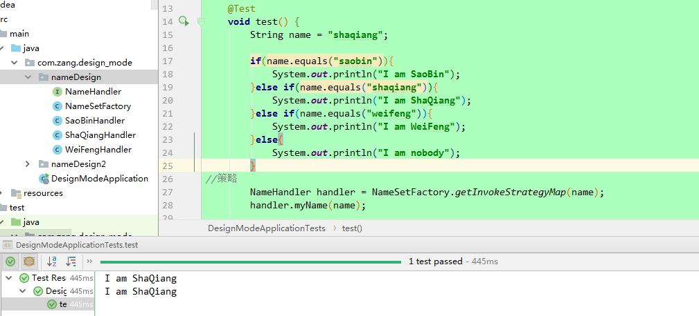

 如上，如果后续再加新成员的业务，只需要实现其对应的具体策略类即可，不需要关注其对其他成员的业务是否有影响。

## 2. 策略模式+工厂模式+模板模式实现不同业务

现在来了新需求，之前成员实现的方法基本一致，但现在要求：“骚斌”实现打印名称，“傻强”实现跳舞，“伟峰”实现打印名称和跳舞，后续随时会有新增成员和新增功能，基于上面的实现，可以在策略总接口中新增跳舞方法，实现如下：

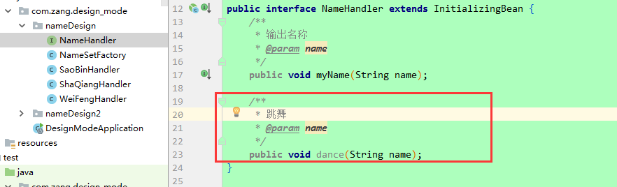

 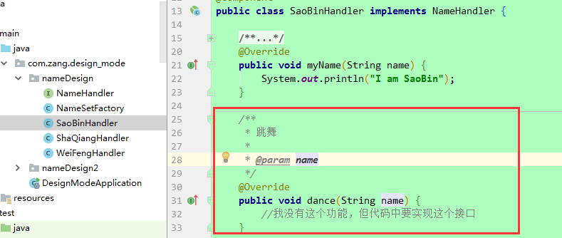

 可以看出，在总策略接口中新增“跳舞”方法后，没有该功能的“骚斌”也需要实现它，这个就很不友好了。下面对其进行改造：

### 2.1 模板设计模式改造总策略接口

将原先的接口改造为抽象类，实现模板模式，所有的功能在类中定义，子类要实现具体功能，重写即可。

[](javascript:void(0);)

```
import org.Springframework.beans.factory.InitializingBean;

/**
 * 策略抽象类（模板）
 */
public abstract class AbstractNameHandler implements InitializingBean {
    /**
     * 输出名称
     * @param name
     */
     public void myName(String name){
         throw new UnsupportedOperationException();
     };

    /**
     * 跳舞
     * @param name
     */
    public void dance(String name){
        throw new UnsupportedOperationException();
    };

}
```

[](javascript:void(0);)

### 2.2 策略实现

各成员只需实现其对应的策略方法即可。

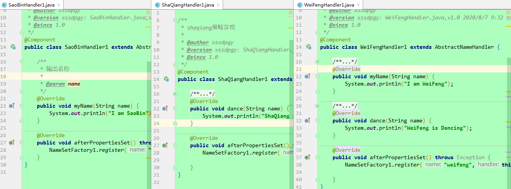

如下，测试成员功能，对于有具体实现的方法，成员会执行，如果没有具体实现，会抛出异常。

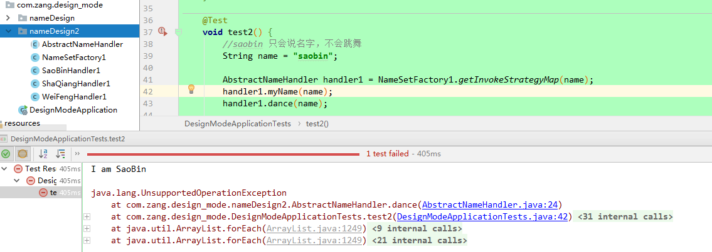

 经过上面改造，后面如果新增成员或者新功能实现，新增策略实现即可。这种改造符合开闭原则，适用较为复杂的逻辑判断。


# 面试问题


## ● 请谈一谈Spring中自动装配的方式有哪些？

考察点：Spring框架

### 参考回答：

- no：不进行自动装配，手动设置Bean的依赖关系。
- byName：根据Bean的名字进行自动装配。

- byType：根据Bean的类型进行自动装配。
  \- 
- constructor：类似于byType，不过是应用于构造器的参数，如果正好有一个Bean与构造器的参数类型相同则可以自动装配，否则会导致错误。
  \- 
- autodetect：如果有默认的构造器，则通过constructor的方式进行自动装配，否则使用byType的方式进行自动装配。

自动装配没有自定义装配方式那么精确，而且不能自动装配简单属性（基本类型、字符串等），在使用时应注意。


## ● 请问Spring中Bean的作用域有哪些？

考察点：框架

### 参考回答：

在Spring的早期版本中，仅有两个作用域：singleton和prototype，前者表示Bean以单例的方式存在；后者表示每次从容器中调用Bean时，都会返回一个新的实例，prototype通常翻译为原型。

设计模式中的创建型模式中也有一个原型模式，原型模式也是一个常用的模式，例如做一个室内设计软件，所有的素材都在工具箱中，而每次从工具箱中取出的都是素材对象的一个原型，可以通过对象克隆来实现原型模式。Spring 2.x中针对WebApplicationContext新增了3个作用域，分别是：request（每次HTTP请求都会创建一个新的Bean）、session（同一个HttpSession共享同一个Bean，不同的HttpSession使用不同的Bean）和globalSession（同一个全局Session共享一个Bean）。

单例模式和原型模式都是重要的设计模式。一般情况下，无状态或状态不可变的类适合使用单例模式。在传统开发中，由于DAO持有Connection这个非线程安全对象因而没有使用单例模式；但在Spring环境下，所有DAO类对可以采用单例模式，因为Spring利用AOP和Java API中的ThreadLocal对非线程安全的对象进行了特殊处理。

## ● 请问什么是IoC和DI？并且简要说明一下DI是如何实现的？

考察点：控制反转

### 参考回答：

IoC 叫控制反转，是 Inversion of Control 的缩写，DI（Dependency Injection）叫依赖注入，是对 IoC 更简单的诠释。控制反转是把传统上由程序代码直接操控的对象的调用权交给容器，通过容器来实现对象组件的装配和管理。所谓的"控制反转"就是对组件对象控制权的转移，从程序代码本身转移到了外部容器，由容器来创建对象并管理对象之间的依赖关系。IoC 体现了好莱坞原则 - "Don’t call me, we will call you"。依赖注入的基本原则是应用组件不应该负责查找资源或者其他依赖的协作对象。配置对象的工作应该由容器负责，查找资源的逻辑应该从应用组件的代码中抽取出来，交给容器来完成。DI是对IoC更准确的描述，即组件之间的依赖关系由容器在运行期决定，形象的来说，即由容器动态的将某种依赖关系注入到组件之中。

一个类A需要用到接口B中的方法，那么就需要为类A和接口B建立关联或依赖关系，最原始的方法是在类A中创建一个接口B的实现类C的实例，但这种方法需要开发人员自行维护二者的依赖关系，也就是说当依赖关系发生变动的时候需要修改代码并重新构建整个系统。如果通过一个容器来管理这些对象以及对象的依赖关系，则只需要在类A中定义好用于关联接口B的方法（构造器或setter方法），将类A和接口B的实现类C放入容器中，通过对容器的配置来实现二者的关联。
依赖注入可以通过setter方法注入（设值注入）、构造器注入和接口注入三种方式来实现，Spring支持setter注入和构造器注入，通常使用构造器注入来注入必须的依赖关系，对于可选的依赖关系，则setter注入是更好的选择，setter注入需要类提供无参构造器或者无参的静态工厂方法来创建对象。

## ● 请说明一下Spring中BeanFactory和ApplicationContext的区别是什么？

考察点：Spring框架

### 参考回答：

概念：

BeanFactory：
BeanFactory是Spring中比较原始，比较古老的Factory。因为比较古老，所以BeanFactory无法支持Spring插件，例如：AOP、Web应用等功能。

ApplicationContext
ApplicationContext是BeanFactory的子类，因为古老的BeanFactory无法满足不断更新的Spring的需求，于是ApplicationContext就基本上代替了BeanFactory的工作，以一种更面向框架的工作方式以及对上下文进行分层和实现继承，并在这个基础上对功能进行扩展：
<1>MessageSource, 提供国际化的消息访问
<2>资源访问（如URL和文件）
<3>事件传递
<4>Bean的自动装配
<5>各种不同应用层的Context实现

区别：

<1>如果使用ApplicationContext，如果配置的bean是singleton，那么不管你有没有或想不想用它，它都会被实例化。好处是可以预先加载，坏处是浪费内存。

<2>BeanFactory，当使用BeanFactory实例化对象时，配置的bean不会马上被实例化，而是等到你使用该bean的时候（getBean）才会被实例化。好处是节约内存，坏处是速度比较慢。多用于移动设备的开发。

<3>没有特殊要求的情况下，应该使用ApplicationContext完成。因为BeanFactory能完成的事情，ApplicationContext都能完成，并且提供了更多接近现在开发的功能。

## ● 请说明一下SpringIoC原理是什么？如果你要实现IoC需要怎么做？请简单描述一下实现步骤？

考察点：Spring

### 参考回答：

①IoC（Inversion of Control，控制倒转）。这是Spring的核心，贯穿始终。所谓IoC，对于Spring框架来说，就是由Spring来负责控制对象的生命周期和对象间的关系。

IoC的一个重点是在系统运行中，动态的向某个对象提供它所需要的其他对象。这一点是通过DI（Dependency Injection，依赖注入）来实现的。比如对象A需要操作数据库，以前我们总是要在A中自己编写代码来获得一个Connection对象，有了 Spring我们就只需要告诉Spring，A中需要一个Connection，至于这个Connection怎么构造，何时构造，A不需要知道。在系统运行时，Spring会在适当的时候制造一个Connection，然后像打针一样，注射到A当中，这样就完成了对各个对象之间关系的控制。A需要依赖 Connection才能正常运行，而这个Connection是由Spring注入到A中的，依赖注入的名字就这么来的。那么DI是如何实现的呢？ Java 1.3之后一个重要特征是反射（reflection），它允许程序在运行的时候动态的生成对象、执行对象的方法、改变对象的属性，Spring就是通过反射来实现注入的。

举个简单的例子，我们找女朋友常见的情况是，我们到处去看哪里有长得漂亮身材又好的女孩子，然后打听她们的兴趣爱好、qq号、电话号、ip号、iq号………，想办法认识她们，投其所好送其所要，这个过程是复杂深奥的，我们必须自己设计和面对每个环节。传统的程序开发也是如此，在一个对象中，如果要使用另外的对象，就必须得到它（自己new一个，或者从JNDI中查询一个），使用完之后还要将对象销毁（比如Connection等），对象始终会和其他的接口或类藕合起来。

②实现IoC的步骤

定义用来描述bean的配置的Java类

解析bean的配置，将bean的配置信息转换为上面的BeanDefinition对象保存在内存中，Spring中采用HashMap进行对象存储，其中会用到一些xml解析技术

遍历存放BeanDefinition的HashMap对象，逐条取出BeanDefinition对象，获取bean的配置信息，利用Java的反射机制实例化对象，將实例化后的对象保存在另外一个Map中即可。

## ● 请简单说明一下依赖注入的方式有哪几种？以及这些方法如何使用？

考察点：Spring

### 参考回答：

1、Set注入 2、构造器注入 3、接口注入

## ● 请说明一下 @Controller 和 @RestController 的区别是什么？

考察点：Spring

### 参考回答：

@RestController注解相当于@ResponseBody ＋ @Controller合在一起的作用

## ● 请问在以前的学习中有使用过 Spring 里面的注解吗？如果有请谈一下 @Autowired 和@Resource区别是什么？

考察点：Spring

### 参考回答：

1、共同点

两者都可以写在字段和setter方法上。两者如果都写在字段上，那么就不需要再写setter方法。

2、不同点

（1）@Autowired

@Autowired为Spring提供的注解，需要导入包org.Springframework.beans.factory.annotation.Autowired;只按照byType注入。

@Autowired注解是按照类型（byType）装配依赖对象，默认情况下它要求依赖对象必须存在，如果允许null值，可以设置它的required属性为false。如果我们想使用按照名称（byName）来装配，可以结合@Qualifier注解一起使用。

（2）@Resource

@Resource默认按照ByName自动注入，由J2EE提供，需要导入包javax.annotation.Resource。@Resource有两个重要的属性：name和type，而Spring将@Resource注解的name属性解析为bean的名字，而type属性则解析为bean的类型。所以，如果使用name属性，则使用byName的自动注入策略，而使用type属性时则使用byType自动注入策略。如果既不制定name也不制定type属性，这时将通过反射机制使用byName自动注入策略。

## ● 请介绍一下bean的生命周期

考察点：Spring

### 参考回答：

Spring生命周期流程图：


## ● 请简要说明一下IoC和AOP是什么？

考察点：Spring

### 参考回答：

依赖注入的三种方式：（1）接口注入（2）Construct注入（3）Setter注入

控制反转（IoC）与依赖注入（DI）是同一个概念，引入IoC的目的：（1）脱开、降低类之间的耦合；（2）倡导面向接口编程、实施依赖倒换原则； （3）提高系统可插入、可测试、可修改等特性。

具体做法：（1）将bean之间的依赖关系尽可能地抓换为关联关系；

（2）将对具体类的关联尽可能地转换为对Java interface的关联，而不是与具体的服务对象相关联；

（3）Bean实例具体关联相关Java interface的哪个实现类的实例，在配置信息的元数据中描述；

（4）由IoC组件（或称容器）根据配置信息，实例化具体bean类、将bean之间的依赖关系注入进来。

AOP（Aspect Oriented Programming），即面向切面编程，可以说是OOP（Object Oriented Programming，面向对象编程）的补充和完善。OOP引入封装、继承、多态等概念来建立一种对象层次结构，用于模拟公共行为的一个集合。不过OOP允许开发者定义纵向的关系，但并不适合定义横向的关系，例如日志功能。日志代码往往横向地散布在所有对象层次中，而与它对应的对象的核心功能毫无关系对于其他类型的代码，如安全性、异常处理和透明的持续性也都是如此，这种散布在各处的无关的代码被称为横切（cross cutting），在OOP设计中，它导致了大量代码的重复，而不利于各个模块的重用。

AOP技术恰恰相反，它利用一种称为"横切"的技术，剖解开封装的对象内部，并将那些影响了多个类的公共行为封装到一个可重用模块，并将其命名为"Aspect"，即切面。所谓"切面"，简单说就是那些与业务无关，却为业务模块所共同调用的逻辑或责任封装起来，便于减少系统的重复代码，降低模块之间的耦合度，并有利于未来的可操作性和可维护性。

使用"横切"技术，AOP把软件系统分为两个部分：核心关注点和横切关注点。业务处理的主要流程是核心关注点，与之关系不大的部分是横切关注点。横切关注点的一个特点是，他们经常发生在核心关注点的多处，而各处基本相似，比如权限认证、日志、事务。AOP的作用在于分离系统中的各种关注点，将核心关注点和横切关注点分离开来。

## ● 请问Spring支持的事务管理类型有哪些？以及你在项目中会使用哪种方式？ 

考察点：事物管理

### 参考回答：

Spring支持编程式事务管理和声明式事务管理。许多Spring框架的用户选择声明式事务管理，因为这种方式和应用程序的关联较少，因此更加符合轻量级容器的概念。声明式事务管理要优于编程式事务管理，尽管在灵活性方面它弱于编程式事务管理，因为编程式事务允许你通过代码控制业务。

事务分为全局事务和局部事务。全局事务由应用服务器管理，需要底层服务器JTA支持（如WebLogic、WildFly等）。局部事务和底层采用的持久化方案有关，例如使用JDBC进行持久化时，需要使用Connetion对象来操作事务；而采用Hibernate进行持久化时，需要使用Session对象来操作事务。

这些事务的父接口都是PlatformTransactionManager。Spring的事务管理机制是一种典型的策略模式，PlatformTransactionManager代表事务管理接口，该接口定义了三个方法，该接口并不知道底层如何管理事务，但是它的实现类必须提供getTransaction()方法（开启事务）、commit()方法（提交事务）、rollback()方法（回滚事务）的多态实现，这样就可以用不同的实现类代表不同的事务管理策略。使用JTA全局事务策略时，需要底层应用服务器支持，而不同的应用服务器所提供的JTA全局事务可能存在细节上的差异，因此实际配置全局事务管理器是可能需要使用JtaTransactionManager的子类，如：WebLogicJtaTransactionManager（Oracle的WebLogic服务器提供）、UowJtaTransactionManager（IBM的WebSphere服务器提供）等。

## ● 你如何理解AOP中的连接点（Joinpoint）、切点（Pointcut）、增强（Advice）、引介（Introduction）、织入（Weaving）、切面（Aspect）这些概念？

考察点：AOP

### 参考回答：

a. 连接点（Joinpoint）：程序执行的某个特定位置（如：某个方法调用前、调用后，方法抛出异常后）。一个类或一段程序代码拥有一些具有边界性质的特定点，这些代码中的特定点就是连接点。Spring仅支持方法的连接点。

b. 切点（Pointcut）：如果连接点相当于数据中的记录，那么切点相当于查询条件，一个切点可以匹配多个连接点。Spring AOP的规则解析引擎负责解析切点所设定的查询条件，找到对应的连接点。

c. 增强（Advice）：增强是织入到目标类连接点上的一段程序代码。Spring提供的增强接口都是带方位名的，如：BeforeAdvice、AfterReturningAdvice、ThrowsAdvice等。

d. 引介（Introduction）：引介是一种特殊的增强，它为类添加一些属性和方法。这样，即使一个业务类原本没有实现某个接口，通过引介功能，可以动态的未该业务类添加接口的实现逻辑，让业务类成为这个接口的实现类。

e. 织入（Weaving）：织入是将增强添加到目标类具体连接点上的过程，AOP有三种织入方式：①编译期织入：需要特殊的Java编译期（例如AspectJ的ajc）；②装载期织入：要求使用特殊的类加载器，在装载类的时候对类进行增强；③运行时织入：在运行时为目标类生成代理实现增强。Spring采用了动态代理的方式实现了运行时织入，而AspectJ采用了编译期织入和装载期织入的方式。

f. 切面（Aspect）：切面是由切点和增强（引介）组成的，它包括了对横切关注功能的定义，也包括了对连接点的定义。

## ● 请问AOP的原理是什么？

考察点：动态代理

### 参考回答：

AOP（Aspect Orient Programming），指面向方面（切面）编程，作为面向对象的一种补充，用于处理系统中分布于各个模块的横切关注点，比如事务管理、日志、缓存等等。AOP实现的关键在于AOP框架自动创建的AOP代理，AOP代理主要分为静态代理和动态代理，静态代理的代表为AspectJ；而动态代理则以Spring AOP为代表。通常使用AspectJ的编译时增强实现AOP，AspectJ是静态代理的增强，所谓的静态代理就是AOP框架会在编译阶段生成AOP代理类，因此也称为编译时增强。

Spring AOP中的动态代理主要有两种方式，JDK动态代理和CGLIB动态代理。JDK动态代理通过反射来接收被代理的类，并且要求被代理的类必须实现一个接口。JDK动态代理的核心是InvocationHandler接口和Proxy类。

如果目标类没有实现接口，那么Spring AOP会选择使用CGLIB来动态代理目标类。CGLIB（Code Generation Library），是一个代码生成的类库，可以在运行时动态的生成某个类的子类，注意，CGLIB是通过继承的方式做的动态代理，因此如果某个类被标记为final，那么它是无法使用CGLIB做动态代理的。

## ● 请问AOP的应用场景有哪些？

考察点：Spring AOP

### 参考回答：

Authentication 权限 ，Caching 缓存 ，Context passing 内容传递 ，Error handling 错误处理 ，Lazy loading 懒加载 ，Debugging 调试 ，logging, tracing, profiling and monitoring 记录跟踪　优化　校准，Performance optimization 性能优化 ，Persistence 持久化 ，Resource pooling 资源池 ，Synchronization 同步，Transactions 事务。

## ● 请说明一下Spring框架为企业级开发带来的好处有哪些？

考察点：框架

### 参考回答：

- 非侵入式：支持基于POJO的编程模式，不强制性的要求实现Spring框架中的接口或继承Spring框架中的类。

- IoC容器：IoC容器帮助应用程序管理对象以及对象之间的依赖关系，对象之间的依赖关系如果发生了改变只需要修改配置文件而不是修改代码，因为代码的修改可能意味着项目的重新构建和完整的回归测试。有了IoC容器，程序员再也不需要自己编写工厂、单例，这一点特别符合Spring的精神"不要重复的发明轮子"。
- AOP（面向切面编程）：将所有的横切关注功能封装到切面（aspect）中，通过配置的方式将横切关注功能动态添加到目标代码上，进一步实现了业务逻辑和系统服务之间的分离。另一方面，有了AOP程序员可以省去很多自己写代理类的工作。
- MVC：Spring的MVC框架为Web表示层提供了更好的解决方案。
- 事务管理：Spring以宽广的胸怀接纳多种持久层技术，并且为其提供了声明式的事务管理，在不需要任何一行代码的情况下就能够完成事务管理。
- 其他：选择Spring框架的原因还远不止于此，Spring为Java企业级开发提供了一站式选择，你可以在需要的时候使用它的部分和全部，更重要的是，甚至可以在感觉不到Spring存在的情况下，在你的项目中使用Spring提供的各种优秀的功能。

## ● 请简单谈一下Spring框架的优点都有哪些？

考察点：Spring

### 参考回答：

Spring是一个轻量级的DI和AOP容器框架，在项目的中的使用越来越广泛，它的优点主要有以下几点：

Spring是一个非侵入式框架，其目标是使应用程序代码对框架的依赖最小化，应用代码可以在没有Spring或者其他容器的情况运行。

Spring提供了一个一致的编程模型，使应用直接使用POJO开发，从而可以使运行环境隔离开来。

Spring推动应用的设计风格向面向对象及面向接口编程转变，提高了代码的重用性和可测试性。

Spring改进了结构体系的选择，虽然作为应用平台，Spring可以帮助我们选择不同的技术实现，比如从Hibernate切换到其他的ORM工具，从Struts切换到Spring MVC,尽管我们通常不会这么做，但是我们在技术方案上选择使用Spring作为应用平台，Spring至少为我们提供了这种可能性的选择，从而降低了平台锁定风险。

## ● 请问Struts拦截器和Spring AOP有什么区别？

考察点：框架

### 参考回答：

拦截器是AOP的一种实现，struts2 拦截器采用xwork2的interceptor！而Spring的AOP基于IoC基础,其底层采用动态代理与CGLIB代理两种方式结合的实现方式。

## ● 请简单介绍一下Spring？

考察点：Spring

### 参考回答：

Spring是一个轻量级框架，可以一站式构建你的企业级应用。

Spring的模块大概分为6个。分别是：

1、Core Container（Spring的核心）【重要】

2、AOP（面向切面变成）【重要】

3、Messaging（消息发送的支持）

4、Data Access/Integration（数据访问和集成）

5、Web（主要是SpringWeb内容，包括MVC）【重要】

6、Test（Spring测试支持，包含JUint等测试单元的支持）

 7、Instrumentation（设备支持，比如Tomcat的支持）

## ● 请问持久层设计要考虑的问题有哪些？请谈一下你用过的持久层框架都有哪些？

考察点：框架

### 参考回答：

所谓"持久"就是将数据保存到可掉电式存储设备中以便今后使用，简单的说，就是将内存中的数据保存到关系型数据库、文件系统、消息队列等提供持久化支持的设备中。持久层就是系统中专注于实现数据持久化的相对独立的层面。

持久层设计的目标包括：
\- 数据存储逻辑的分离，提供抽象化的数据访问接口。
\- 数据访问底层实现的分离，可以在不修改代码的情况下切换底层实现。
\- 资源管理和调度的分离，在数据访问层实现统一的资源调度（如缓存机制）。
\- 数据抽象，提供更面向对象的数据操作。

持久层框架有：
\- Hibernate
\- MyBatis
\- TopLink
\- Guzz
\- jOOQ
\- Spring Data
\- ActiveJDBC


