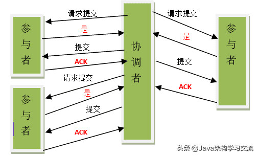
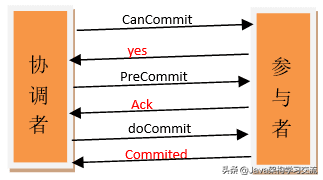
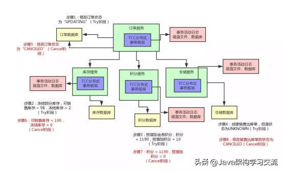
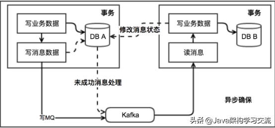
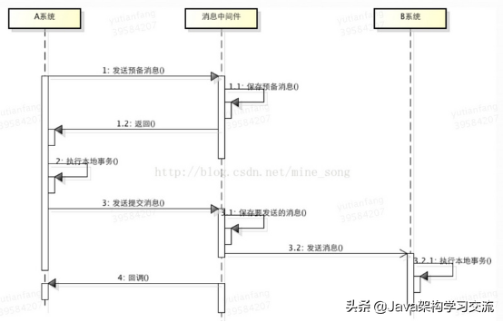
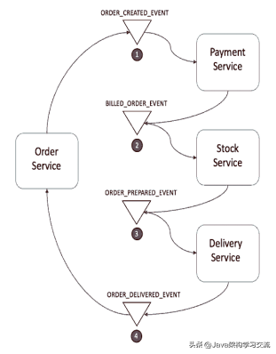
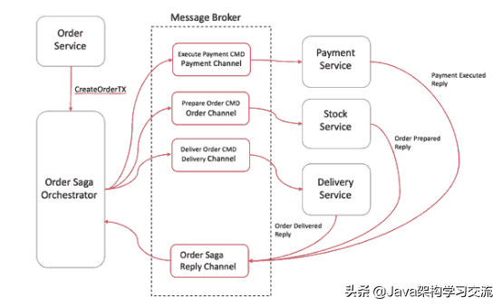

# 分布式事务

## 解决方案

- 基于 XA 协议

二阶段提交和三阶段提交，需要数据库层面支持

- 基于事务补偿机制

TCC，基于业务层面实现

- 基于事务消息

MQ

- 本地消息表

基于本地数据库+MQ，维护本地状态（进行中），通过 MQ 调用服务，完成后响应一条消息回调，将状态改为完成。需要配合定时任务扫表、重新发送消息调用服务，需要保证幂等性。

# 5种分布式事务解决方案优缺点对比

## 背景

分布式事务是企业集成中的一个技术难点，也是每一个分布式系统架构中都会涉及到的一个东西，特别是在微服务架构中，几乎可以说是无法避免。

**ACID**

指数据库事务正确执行的四个基本要素：

1. 原子性（Atomicity）
2. 一致性（Consistency）
3. 隔离性（Isolation）
4. 持久性（Durability）

**CAP**

CAP原则又称CAP定理，指的是在一个分布式系统中，一致性（Consistency）、可用性（Availability）、分区容忍性（Partition tolerance）。CAP 原则指的是，这三个要素最多只能同时实现两点，不可能三者兼顾。

- 一致性：在分布式系统中的所有数据备份，在同一时刻是否同样的值。
- 可用性：在集群中一部分节点故障后，集群整体是否还能响应客户端的读写请求。
- 分区容忍性：以实际效果而言，分区相当于对通信的时限要求。系统如果不能在时限内达成数据一致性，就意味着发生了分区的情况，必须就当前操作在C和A之间做出选择。

**BASE理论**

BASE理论是对CAP中的一致性和可用性进行一个权衡的结果，理论的核心思想就是：我们无法做到强一致，但每个应用都可以根据自身的业务特点，采用适当的方式来使系统达到最终一致性。

- Basically Available（基本可用）
- Soft state（软状态）
- Eventually consistent（最终一致性）

## 解决方案

### 01 两阶段提交（2PC）

两阶段提交2PC是分布式事务中最强大的事务类型之一，两段提交就是分两个阶段提交，第一阶段询问各个事务数据源是否准备好，第二阶段才真正将数据提交给事务数据源。

为了保证该事务可以满足ACID，就要引入一个协调者（Cooradinator）。其他的节点被称为参与者（Participant）。协调者负责调度参与者的行为，并最终决定这些参与者是否要把事务进行提交。处理流程如下：

**阶段一**

a) 协调者向所有参与者发送事务内容，询问是否可以提交事务，并等待答复。

b) 各参与者执行事务操作，将 undo 和 redo 信息记入事务日志中（但不提交事务）。

c) 如参与者执行成功，给协调者反馈 yes，否则反馈 no。

**阶段二**

如果协调者收到了参与者的失败消息或者超时，直接给每个参与者发送回滚(rollback)消息；否则，发送提交(commit)消息。两种情况处理如下：

**情况1：**当所有参与者均反馈 yes，提交事务

a) 协调者向所有参与者发出正式提交事务的请求（即 commit 请求）。

b) 参与者执行 commit 请求，并释放整个事务期间占用的资源。

c) 各参与者向协调者反馈 ack(应答)完成的消息。

d) 协调者收到所有参与者反馈的 ack 消息后，即完成事务提交。

**情况2：**当有一个参与者反馈 no，回滚事务

a) 协调者向所有参与者发出回滚请求（即 rollback 请求）。

b) 参与者使用阶段 1 中的 undo 信息执行回滚操作，并释放整个事务期间占用的资源。

c) 各参与者向协调者反馈 ack 完成的消息。

d) 协调者收到所有参与者反馈的 ack 消息后，即完成事务。

#### 问题

**1) 性能问题**：所有参与者在事务提交阶段处于同步阻塞状态，占用系统资源，容易导致性能瓶颈。

**2) 可靠性问题：**如果协调者存在单点故障问题，或出现故障，提供者将一直处于锁定状态。

**3) 数据一致性问题：**在阶段 2 中，如果出现协调者和参与者都挂了的情况，有可能导致数据不一致。

**优点：**尽量保证了数据的强一致，适合对数据强一致要求很高的关键领域。（其实也不能100%保证强一致）。

**缺点：**实现复杂，牺牲了可用性，对性能影响较大，不适合高并发高性能场景。

### 02 三阶段提交（3PC）

三阶段提交是在二阶段提交上的改进版本，3PC最关键要解决的就是协调者和参与者同时挂掉的问题，所以3PC把2PC的准备阶段再次一分为二，这样三阶段提交。处理流程如下：

**阶段一**

a) 协调者向所有参与者发出包含事务内容的 canCommit 请求，询问是否可以提交事务，并等待所有参与者答复。

b) 参与者收到 canCommit 请求后，如果认为可以执行事务操作，则反馈 yes 并进入预备状态，否则反馈 no。

**阶段二**

协调者根据参与者响应情况，有以下两种可能。

**情况1：**所有参与者均反馈 yes，协调者预执行事务

a) 协调者向所有参与者发出 preCommit 请求，进入准备阶段。

b) 参与者收到 preCommit 请求后，执行事务操作，将 undo 和 redo 信息记入事务日志中（但不提交事务）。

c) 各参与者向协调者反馈 ack 响应或 no 响应，并等待最终指令。

**情况2：**只要有一个参与者反馈 no，或者等待超时后协调者尚无法收到所有提供者的反馈，即中断事务

a) 协调者向所有参与者发出 abort 请求。

b) 无论收到协调者发出的 abort 请求，或者在等待协调者请求过程中出现超时，参与者均会中断事务。

**阶段三**

该阶段进行真正的事务提交，也可以分为以下两种情况。

**情况 1：**所有参与者均反馈 ack 响应，执行真正的事务提交

a) 如果协调者处于工作状态，则向所有参与者发出 do Commit 请求。

b) 参与者收到 do Commit 请求后，会正式执行事务提交，并释放整个事务期间占用的资源。

c) 各参与者向协调者反馈 ack 完成的消息。

d) 协调者收到所有参与者反馈的 ack 消息后，即完成事务提交。

**情况2：**只要有一个参与者反馈 no，或者等待超时后协调组尚无法收到所有提供者的反馈，即回滚事务。

a) 如果协调者处于工作状态，向所有参与者发出 rollback 请求。

b) 参与者使用阶段 1 中的 undo 信息执行回滚操作，并释放整个事务期间占用的资源。

c) 各参与者向协调组反馈 ack 完成的消息。

d) 协调组收到所有参与者反馈的 ack 消息后，即完成事务回滚。

**优点：**相比二阶段提交，三阶段提交降低了阻塞范围，在等待超时后协调者或参与者会中断事务。避免了协调者单点问题。阶段 3 中协调者出现问题时，参与者会继续提交事务。

**缺点：**数据不一致问题依然存在，当在参与者收到 preCommit 请求后等待 do commite 指令时，此时如果协调者请求中断事务，而协调者无法与参与者正常通信，会导致参与者继续提交事务，造成数据不一致。

### 03 补偿事务（TCC）

TCC 是服务化的二阶段编程模型，采用的补偿机制：

**条件：**

需要实现确认和补偿逻辑

需要支持幂等

**处理流程：**

a) Try 阶段主要是对业务系统做检测及资源预留。

这个阶段主要完成：

完成所有业务检查( 一致性 ) 。

预留必须业务资源( 准隔离性 ) 。

Try 尝试执行业务。

b) Confirm 阶段主要是对业务系统做确认提交。

Try阶段执行成功并开始执行 Confirm阶段时，默认 Confirm阶段是不会出错的。即：只要Try成功，Confirm一定成功。

c) Cancel 阶段主要是在业务执行错误，需要回滚的状态下执行的业务取消，预留资源释放。

**优点：**

性能提升：具体业务来实现控制资源锁的粒度变小，不会锁定整个资源。

数据最终一致性：基于 Confirm 和 Cancel 的幂等性，保证事务最终完成确认或者取消，保证数据的一致性。

可靠性：解决了 XA 协议的协调者单点故障问题，由主业务方发起并控制整个业务活动，业务活动管理器也变成多点，引入集群。

**缺点：**TCC 的 Try、Confirm 和 Cancel 操作功能要按具体业务来实现，业务耦合度较高，提高了开发成本。

### 04 本地消息表（消息队列）

其核心思想是将分布式事务拆分成本地事务进行处理。

方案通过在消费者额外新建事务消息表，消费者处理业务和记录事务消息在本地事务中完成，轮询事务消息表的数据发送事务消息，提供者基于消息中间件消费事务消息表中的事务。

**条件：**

服务消费者需要创建一张消息表，用来记录消息状态。

服务消费者和提供者需要支持幂等。

需要补偿逻辑。

每个节点上起定时线程，检查未处理完成或发出失败的消息，重新发出消息，即重试机制和幂等性机制。

**处理流程：**

\1. 服务消费者把业务数据和消息一同提交，发起事务。

\2. 消息经过MQ发送到服务提供方，服务消费者等待处理结果。

\3. 服务提供方接收消息，完成业务逻辑并通知消费者已处理的消息。

容错处理情况如下：

当步骤1处理出错，事务回滚，相当于什么都没有发生。

当步骤2、3处理出错，由于消息保存在消费者表中，可以重新发送到MQ进行重试。

如果步骤3处理出错，且是业务上的失败，服务提供者发送消息通知消费者事务失败，且此时变为消费者发起回滚事务进行回滚逻辑。

**优点：**从应用设计开发的角度实现了消息数据的可靠性，消息数据的可靠性不依赖于消息中间件，弱化了对 MQ 中间件特性的依赖。

**缺点：**与具体的业务场景绑定，耦合性强，不可公用。消息数据与业务数据同库，占用业务系统资源。业务系统在使用关系型数据库的情况下，消息服务性能会受到关系型数据库并发性能的局限。

**MQ事务消息（最终一致性）**

支持事务消息的MQ，其支持事务消息的方式采用类似于二阶段提交。

基于 MQ 的分布式事务方案其实是对本地消息表的封装，将本地消息表基于 MQ 内部，其他方面的协议基本与本地消息表一致。

**条件：**

a) 需要补偿逻辑

b) 业务处理逻辑需要幂等

**处理流程：**

c) 消费者向MQ发送half消息。

d) MQ Server将消息持久化后，向发送方ack确认消息发送成功。

e) 消费者开始执行事务逻辑。

f) 消费者根据本地事务执行结果向MQ Server提交二次确认或者回滚。

g) MQ Server收到commit状态则将half消息标记可投递状态。

h) 服务提供者收到该消息，执行本地业务逻辑。返回处理结果。

**优点：**

消息数据独立存储，降低业务系统与消息系统之间的耦合。

吞吐量优于本地消息表方案。

**缺点：**

一次消息发送需要两次网络请求(half消息 + commit/rollback)。

需要实现消息回查接口。

### 05 Sagas事务模型（最终一致性）

Saga模式是一种分布式异步事务，一种最终一致性事务，是一种柔性事务，有两种不同的方式来实现saga事务，最流行的两种方式是：

**一、 事件/编排Choreography：没有中央协调器（没有单点风险）时，每个服务产生并聆听其他服务的事件，并决定是否应采取行动。**

该实现第一个服务执行一个事务，然后发布一个事件。该事件被一个或多个服务进行监听，这些服务再执行本地事务并发布（或不发布）新的事件，当最后一个服务执行本地事务并且不发布任何事件时，意味着分布式事务结束，或者它发布的事件没有被任何Saga参与者听到都意味着事务结束。

**处理流程：**

订单服务保存新订单，将状态设置为pengding挂起状态，并发布名为ORDER_CREATED_EVENT的事件。

支付服务监听ORDER_CREATED_EVENT，并公布事件BILLED_ORDER_EVENT。

库存服务监听BILLED_ORDER_EVENT，更新库存，并发布ORDER_PREPARED_EVENT。

货运服务监听ORDER_PREPARED_EVENT，然后交付产品。最后，它发布ORDER_DELIVERED_EVENT。

最后，订单服务侦听ORDER_DELIVERED_EVENT并设置订单的状态为concluded完成。

假设库存服务在事务过程中失败了。进行回滚：

库存服务产生
PRODUCT_OUT_OF_STOCK_EVENT

订购服务和支付服务会监听到上面库存服务的这一事件：

①支付服务会退款给客户。

②订单服务将订单状态设置为失败。

**优点：**事件/编排是实现Saga模式的自然方式; 它很简单，容易理解，不需要太多的努力来构建，所有参与者都是松散耦合的，因为他们彼此之间没有直接的耦合。如果您的事务涉及2至4个步骤，则可能是非常合适的。

**二、 命令/协调orchestrator：中央协调器负责集中处理事件的决策和业务逻辑排序。**

saga协调器orchestrator以命令/回复的方式与每项服务进行通信，告诉他们应该执行哪些操作。

订单服务保存pending状态，并要求订单Saga协调器（简称OSO）开始启动订单事务。

OSO向收款服务发送执行收款命令，收款服务回复Payment Executed消息。

OSO向库存服务发送准备订单命令，库存服务将回复OrderPrepared消息。

OSO向货运服务发送订单发货命令，货运服务将回复Order Delivered消息。

OSO订单Saga协调器必须事先知道执行“创建订单”事务所需的流程(通过读取BPM业务流程XML配置获得)。如果有任何失败，它还负责通过向每个参与者发送命令来撤销之前的操作来协调分布式的回滚。当你有一个中央协调器协调一切时，回滚要容易得多，因为协调器默认是执行正向流程，回滚时只要执行反向流程即可。

**优点：**

避免服务之间的循环依赖关系，因为saga协调器会调用saga参与者，但参与者不会调用协调器。

集中分布式事务的编排。

只需要执行命令/回复(其实回复消息也是一种事件消息)，降低参与者的复杂性。

在添加新步骤时，事务复杂性保持线性，回滚更容易管理。

如果在第一笔交易还没有执行完，想改变有第二笔事务的目标对象，则可以轻松地将其暂停在协调器上，直到第一笔交易结束。