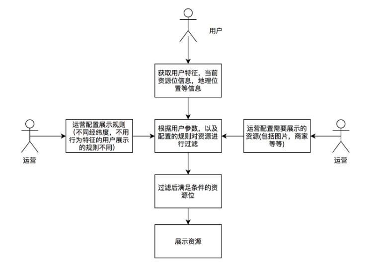

# 自我介绍

1. 基本情况：姓名，年龄（年龄特别小 ≈ 没有经验，就不要说了），学校和专业（985、211，科班出身，最高学历）。
2. 最近一段时间的工作经验（一个最熟悉、包含技术栈最丰富的、能体现xx行业经验的项目），当前项目的价值，用到的技术体系，在项目中承担的主要职责，和自己解决的项目主要问题。
3. 说一下对面试公司的了解（提前做好企业背调），展示态度，行业解决方案。
4. 面试官，以上是我的个人简介，您看您有什么想了解的？

```txt
面试官如果打断你，说明对你感兴趣，没兴趣的才什么都不会问，所以不用慌，把握住自己的节奏。
```


## 自我介绍素材

面试官您好，我叫陈子豪，今年 27 岁，17 年毕业于大连理工大学网络工程系，同年入职平安普惠。

17-19 年主要做国内外多个贷款项目的业务系统开发，主要应用 SpringMVC 和 SpringBoot 框架，并经历了单体架构到集群架构到 SOA 再到 ESB 的转变。

20 年到 21 年，在平安消费金融产品小橙花 APP 负责后端营销平台搭建，应用 SpringCloud + MQ + 分布式定时任务的分布式微服务总体架构方案，基于 OOA/OOD 并向 DDD 演变。

去年，参与到营销领域的设计、开发迭代和需求管理，做微服务拆分、架构改造、对接大数据平台，并重构部分代码。

关于技术栈，熟悉 Java 基础，了解 JVM，熟悉 Redis ，了解 MySQL 的原理和优化，了解消息中间件 RocketMQ，了解分布式场景的三高解决方案。

以上是我的个人简介，您看您有什么想了解的？


# 项目经历

1. 不要把所有项目都说一遍，显得没有重点；拿一个最近、最熟练的项目来进行表述

2. 展现逻辑性和条理性——总分总结构

   2.1 先表述当前项目的核心价值，包含的主要功能

   2.2 说明当前项目中参与的核心技术模块，职责描述，技术栈，项目架构

   2.3 描述项目开发过程中存在的技术问题，以及你的技术解决思路和方案（一定要说自己解决的）

   2.4 根据情境判断是否需要额外说：我之前了解过**咱们**公司用到的也是 xx 技术/行业解决方案，您能跟我讲一下咱们公司的一些技术架构吗？

3. 面试官，以上是我对项目经历的简单介绍，您看一下有什么想问的？


## 项目经历梳理


### DDD——系统架构设计

我的项目经历，以营销平台为例。

小橙花 APP 的总体架构基于类似 DDD 方式区分领域和分层，对用户/业务员（WEB）、商务运营人员（BE）、其他领域（APP）提供服务。

从设计模式与思想来看，设计营销系统时采用自顶向下的方式来解构业务，为此我们引入 DDD 的思想。从战略层面上讲，DDD 能够指导我们完成从问题空间到解决方案的剖析，将业务需求映射为领域上下文以及上下文间的映射关系。从战术层面上，DDD 能够细化领域上下文，形成统一规范的语言，并做领域边界约束，最终形成有效的、细化的领域模型来指导工程实践。（建立领域模型的一个关键意义在于，能够确保不断扩展和变化的需求在领域模型内不断地演进和发展，而不至于出现模型的腐化和领域逻辑的外溢。）参考 [领域驱动设计在互联网业务开发中的实践](https://tech.meituan.com/2017/12/22/ddd-in-practice.html)

所以我们借鉴 DDD 的思想和模式，通过对 OOA/OOD 的优化，将整个产品的系统架构分为七层：交互层、运营支持层；交互服务层；基础服务层（应用层）；公共服务层（基础工具类）；大数据层、AI 服务层；硬件平台层。

我们域跨了交互服务层和应用层。

向上提供 APP 页面内容管理、营销配置后台管理、业务员进度件等功能。

向下沉淀了用户触达、标签、签报等功能。


技术架构的话

Nginx 的 Kong 网关及对内部的 CISP 网关系统以及对外部的 UGW 网关系统，登录、安全、限流、熔断、负载均衡……

Apollo 配置中心

MySQL，TiDB + Hive

Redis 集群

RPC：Feign，HTTP 的 Restful 请求，ESB

RocketMQ 削峰，异步，解耦，事务控制

分布式任务调度系统：基于 Quartz 的 DJSS，大数据端的 Azkaban

日志平台，运维平台，链路监控，运维报警……


其中 DJSS：

Server 端：任务管理，任务编排，任务触发，任务重试，任务分片，节假日，邮件告警，蓝绿部署

JDBC—>PG，缓存 Redis，SMTP邮件中转服务器，配置中心 Apollo

通过 MQ 任务触发、任务重试

通过 zookeeper 获取任务执行节点，任务触发，同步任务配置

Client 端：业务系统中开发 任务触发，任务执行，并发控制，状态反馈

配置中心 Apollo

通过 MQ 做任务状态反馈

通过 zookeeper 节点状态，分布式锁，任务状态反馈，获取任务配置


### 设计模式——业务模块设计及实现

依托于拉新促活等营销场景，主要由渠道管理模块、商城管理模块、商户品牌管理模块、营销活动管理模块、奖品模块、广告模块、佣金计算模块、数据运营模块等构成。

站在业务建模的立场上，DDD 的模式解决的是如何进行领域建模。而站在代码实践的立场 上，设计模式主要关注于代码的设计与实现。

当然，在工程中实践设计模式，必须深入到某一个特定的业务场景中去，再结合对业务场景的理解和领域模型的建立，才能更好地应用设计模式思想的精髓。（如果脱离具体的业务逻辑去学习或者使用设计模式，那是极其空洞的。）

接下来我通过一些营销业务场景的实践，来探讨如何用设计模式来实现可重用、易维护的代码。


#### 策略模式+工厂模式

##### OCPX 渠道反馈

头部平台投放广告回调

1. 回调不同平台，涉及到不同的数据封装规则。
2. 从用户操作时底层的渠道判定到渠道反馈的整个流程。

##### 新老用户 MGM 返奖规则

用户 A 邀请用户 B，在 B 注册或其他行为后，给予 A 一定的奖励。同时为了协调成本与收益的关系，返奖会有多个计算逻辑。

1. 返奖金额的计算，涉及到不同的计算规则。
2. 从邀请开始到返奖结束的整个流程。

业务建模

如图是返奖规则计算的业务逻辑视图:


从这份业务逻辑图中可以看到返奖金额计算的规则。首先要根据用户状态确定用户是 否满足返奖条件。如果满足返奖条件，则继续判断当前用户属于新用户还是老用户， 从而给予不同的奖励方案。一共涉及以下几种不同的奖励方案:

新用户

● 普通奖励(给予固定金额的奖励)

● 梯度奖(根据用户邀请的人数给予不同的奖励金额，邀请的人越多，奖励金额越多)

老用户

● 根据老用户的用户属性来计算返奖金额。为了评估不同的邀新效果，老用户返奖会存在多种返奖机制。

计算完奖励金额以后，还需要更新用户的奖金信息，以及通知结算服务对用户的金额进行结算。这两个模块对于所有的奖励来说都是一样的。

可以看到，无论是何种用户，对于整体返奖流程是不变的，唯一变化的是返奖规则。 此处，我们可参考开闭原则，对于返奖流程保持封闭，对于可能扩展的返奖规则进行 开放。我们将返奖规则抽象为返奖策略，即针对不同用户类型的不同返奖方案，我们视为不同的返奖策略，不同的返奖策略会产生不同的返奖金额结果。

在我们的领域模型里，返奖策略是一个值对象，我们通过工厂的方式生产针对不同用 户的奖励策略值对象。下文我们将介绍以上领域模型的工程实现，即工厂模式和策略 模式的实际应用。

**模式：工厂模式**

工厂模式又细分为工厂方法模式和抽象工厂模式，本文主要介绍工厂方法模式。

模式定义：定义一个用于创建对象的接口，让子类决定实例化哪一个类。工厂方法是 一个类的实例化延迟到其子类。

工厂模式通用类图如下 :


通过一段代码来解释如何使用工厂模式

```java
// 抽象的产品
public abstract class Product {
    public abstract void method();
}
//定义一个具体的产品 (可以定义多个具体的产品) 
class ProductA extends Product {
    @Override
    public void method() {} // 具体的执行逻辑 
}
// 抽象的工厂
abstract class Factory<T> {
    abstract Product createProduct(Class<T> c); 
}
// 具体的工厂可以生产出相应的产品 
class FactoryA extends Factory{
    @Override
    Product createProduct(Class c) {
        Product product = (Product) Class.forName(c.getName()).newInstance();
        return product;
    }
}
```


**模式：策略模式**

模式定义：定义一系列算法，将每个算法都封装起来，并且它们可以互换。策略模式 是一种对象行为模式。

策略模式通用类图如下:


通过一段代码来解释如何使用策略模式

```java
// 定义一个策略接口
public interface Strategy {
    void strategyImplementation(); 
}
// 具体的策略实现 ( 可以定义多个具体的策略实现 ) 
public class StrategyA implements Strategy {
	@Override
	public void strategyImplementation() { 
        System.out.println(" 正在执行策略 A");
    } 
}
// 封装策略，屏蔽高层模块对策略、算法的直接访问，屏蔽可能存在的策略变化 
public class Context {
    private Strategy strategy = null;
    public Context(Strategy strategy) { 
        this.strategy = strategy;
    }
    public void doStrategy() { 
        strategy.strategyImplementation();
    } 
}
```


**实战**

通过上文介绍的返奖业务模型，我们可以看到返奖的主流程就是选择不同的返奖策略的过程，每个返奖策略都包括返奖金额计算、更新用户奖金信息、以及结算这三个步骤。

我们可以使用工厂模式生产出不同的策略，同时使用策略模式来进行不同的策略执行。

首先确定我们需要生成出 n 种不同的返奖策略，其编码如下:


```java
// 抽象策略
public abstract class RewardStrategy {

    public abstract void reward(long userId);

    // 更新用户信息以及结算
    public void insertRewardAndSettlement(long userId, int reward) {
    }

}

// 新用户返奖具体策略 A
public class newUserRewardStrategyA extends RewardStrategy {
    // 具体的计算逻辑，...
    @Override
    public void reward(long userId) {
    }
}

// 老用户返奖具体策略 A
public class OldUserRewardStrategyA extends RewardStrategy {
    // 具体的计算逻辑，...
    @Override
    public void reward(long userId) {
    }
}

// 抽象工厂
public abstract class StrategyFactory<T> {
    abstract RewardStrategy createStrategy(Class<T> c);
}

// 具体工厂创建具体的策略
public class FactorRewardStrategyFactory extends StrategyFactory {
    @Override
    RewardStrategy createStrategy(Class c) {
        RewardStrategy product = null;
        try {
            product = (RewardStrategy) Class.forName(c.getName()).newInstance();
        } catch (Exception e) {
        }
        return product;
    }
}
```


通过工厂模式生产出具体的策略之后，根据我们之前的介绍，很容易就可以想到使用 策略模式来执行我们的策略。具体代码如下:


```java
public class RewardContext {
    private RewardStrategy strategy;

    public RewardContext(RewardStrategy strategy) {
        this.strategy = strategy;
    }

    public void doStrategy(long userId) {
        int rewardMoney = strategy.reward(userId);
        insertRewardAndSettlement(long userId, int reward){
            insertReward(userId, rewardMoney);
            settlement(userId);
        }
    }
}
```


接下来我们将工厂模式和策略模式结合在一起，就完成了整个返奖的过程:


```java
public class InviteRewardImpl {
    // 返奖主流程
    public void sendReward(long userId) {
        // 创建工厂
        FactorRewardStrategyFactory strategyFactory = new FactorRewardStrategyFactory();
        // 根据用户id查询用户信息
        Invitee invitee = getInviteeByUserId(userId);
        // 新用户返奖策略
        if (invitee.userType == UserTypeEnum.NEW_USER) {
            NewUserBasicReward newUserBasicReward = (NewUserBasicReward) strategyFactory.createStrategy(NewUserBasicReward.class);
            RewardContext rewardContext = new RewardContext(newUserBasicReward);
            // 执行返奖策略
            rewardContext.doStrategy(userId);
        }
        // 老用户返奖策略
        if (invitee.userType == UserTypeEnum.OLD_USER) {
            // ……
        }
    }
}
```


工厂方法模式帮助我们直接产生一个具体的策略对象，策略模式帮助我们保证这些策 略对象可以自由地切换而不需要改动其他逻辑，从而达到解耦的目的。通过这两个模 式的组合，当我们系统需要增加一种返奖策略时，只需要实现 RewardStrategy 接 口即可，无需考虑其他的改动。当我们需要改变策略时，只要修改策略的类名即可。 不仅增强了系统的可扩展性，避免了大量的条件判断，而且从真正意义上达到了高内 聚、低耦合的目的。


#### 状态模式

##### 返奖流程

当受邀人在接受邀请人的邀请并且下单后，返奖后台接收到受邀人的下单记录，此时 邀请人也进入返奖流程。首先我们订阅用户订单消息并对订单进行返奖规则校验。例 如，是否使用红包下单，是否在红包有效期内下单，订单是否满足一定的优惠金额等 等条件。当满足这些条件以后，我们将订单信息放入延迟队列中进行后续处理。经过 T+N 天之后处理该延迟消息，判断用户是否对该订单进行了退款，如果未退款，对 用户进行返奖。若返奖失败，后台还有返奖补偿流程，再次进行返奖。其流程如下图 所示:


我们对上述业务流程进行领域建模:

1. 在接收到订单消息后，用户进入待校验状态;
2. 在校验后，若校验通过，用户进入预返奖状态，并放入延迟队列。若校验未通过，用户进入不返奖状态，结束流程;
3. T+N 天后，处理延迟消息，若用户未退款，进入待返奖状态。若用户退款，进入失败状态，结束流程;
4. 执行返奖，若返奖成功，进入完成状态，结束流程。若返奖不成功，进入待补偿状态;
5. 待补偿状态的用户会由任务定期触发补偿机制，直至返奖成功，进入完成状态，保障流程结束。


可以看到，我们通过建模将返奖流程的多个步骤映射为系统的状态。对于系统状态的 表述，DDD 中常用到的概念是领域事件，另外也提及过事件溯源的实践方案。当然， 在设计模式中，也有一种能够表述系统状态的代码模型，那就是状态模式。在邀请下 单系统中，我们的主要流程是返奖。对于返奖，每一个状态要进行的动作和操作都是 不同的。因此，使用状态模式，能够帮助我们对系统状态以及状态间的流转进行统一 的管理和扩展。


模式：状态模式

模式定义：当一个对象内在状态改变时允许其改变行为，这个对象看起来像改变了 其类。


对比策略模式的类型会发现和状态模式的类图很类似，但实际上有很大的区别，具体 体现在 concrete class 上。

策略模式通过 Context 产生唯一一个 ConcreteStrategy 作用于代码中，而状态模式则是通过 context 组织多个 ConcreteState 形成一个状态转换图来实现业务逻辑。

接下来，通过一段通用代码来解释怎么使用状态模式:

```java
// 定义一个抽象的状态类
public abstract class State {

    Context context;

    public void setContext(Context context) {
        this.context = context;
    }

    public abstract void handle1();

    public abstract void handle2();
}

// 定义状态 A
public class ConcreteStateA extends State {

    // 本状态下必须要处理的事情
    @Override
    public void handle1() {
    }

    @Override
    public void handle2() {
        // 切换到状态 B
        super.context.setCurrentState(Context.contreteStateB);
        // 执行状态 B 的任务
        super.context.handle2();
    }
}

// 定义状态 B
public class ConcreteStateB extends State {
    
    // 本状态下必须要处理的事情，...
    @Override
    public void handle2() {
    }

    @Override
    public void handle1() {
        // 切换到状态 A
        super.context.setCurrentState(Context.contreteStateA);
        // 执行状态 A 的任务
        super.context.handle1();
    }
}

// 定义一个上下文管理环境 
public class Context {

    public final static ConcreteStateA contreteStateA = new ConcreteStateA();
    public final static ConcreteStateB contreteStateB = new ConcreteStateB();
    private State CurrentState;

    public State getCurrentState() {
        return CurrentState;
    }

    public void setCurrentState(State currentState) {
        this.CurrentState = currentState;
        this.CurrentState.setContext(this);
    }

    public void handle1() {
        this.CurrentState.handle1();
    }

    public void handle2() {
        this.CurrentState.handle2();
    }
}

// 定义 client 执行 
public class client {
    public static void main(String[] args) {
        Context context = new Context();
        context.setCurrentState(new ContreteStateA());
        context.handle1();
        context.handle2();
    }
}
```


**实战**

通过前文对状态模式的简介，我们可以看到当状态之间的转换在不是非常复杂的情况 下，通用的状态模式存在大量的与状态无关的动作从而产生大量的无用代码。在我们的实践中，一个状态的下游不会涉及特别多的状态装换，所以我们简化了状态模式。 当前的状态只负责当前状态要处理的事情，状态的流转则由第三方类负责。

其实践代码如下:

```java
// 返奖状态执行的上下文
public class RewardStateContext {

    private RewardState rewardState;

    public void setRewardState(RewardState currentState) {
        this.rewardState = currentState;
    }

    public RewardState getRewardState() {
        return rewardState;
    }

    public void echo(RewardStateContext context, Request request) {
        rewardState.doReward(context, request);
    }
}

public abstract class RewardState {
    abstract void doReward(RewardStateContext context, Request
            request);
}

// 待校验状态
public class OrderCheckState extends RewardState {
    @Override
    public void doReward(RewardStateContext context, Request request) {
        //对进来的订单进行校验，判断是否用券， 是否满足优惠条件等等
        orderCheck(context, request);
    }
}

// 待补偿状态
public class CompensateRewardState extends RewardState {
    @Override
    public void doReward(RewardStateContext context, Request request) {
        //返奖失败，需要对用户进行返奖
        compensateReward(context, request);
    }
}

// 预返奖状态，待返奖状态，成功状态，失败状态 ( 此处逻辑省略 )
// ...

public class InviteRewardServiceImpl {

    public boolean sendRewardForInvtee(long userId, long orderId) {
        Request request = new Request(userId, orderId);
        RewardStateContext rewardContext = new RewardStateContext();
        rewardContext.setRewardState(new OrderCheckState());
        //开始返奖，订单校验
        rewardContext.echo(rewardContext, request);
        // 此处的 if-else 逻辑只是为了表达状态的转换过程，并非实际的业务逻辑
        //如果订单校验成功，进入预返奖状态
        if (rewardContext.isResultFlag()) {
            rewardContext.setRewardState(new BeforeRewardCheckState());
            rewardContext.echo(rewardContext, request);
            //如果订单校验失败，进入返奖失败流程，...
        } else {
            rewardContext.setRewardState(new RewardFailedState());
            rewardContext.echo(rewardContext, request);
            return false;
        }
        //预返奖检查成功，进入待返奖流程，...
        if (rewardContext.isResultFlag()) {
            rewardContext.setRewardState(new SendRewardState());
            rewardContext.echo(rewardContext, request);
            // 如果预返奖检查失败，进入返奖失败流程，...
        } else {
            rewardContext.setRewardState(new RewardFailedState());
            rewardContext.echo(rewardContext, request);
            return false;
        }
        //返奖成功，进入返奖结束流程，...
        if (rewardContext.isResultFlag()) {
            rewardContext.setRewardState(new RewardSuccessState());
            rewardContext.echo(rewardContext, request);
            // 返奖失败，进入返奖补偿阶段，...
        } else {
            rewardContext.setRewardState(new CompensateRewardState());
            rewardContext.echo(rewardContext, request);
        }
        //补偿成功，进入返奖完成阶段，...
        if (rewardContext.isResultFlag()) {
            rewardContext.setRewardState(new RewardSuccessState());
            rewardContext.echo(rewardContext, request);
            // 补偿失败，仍然停留在当前态，直至补偿成功(或多次补偿失败后人工介入处理)
        } else {
            rewardContext.setRewardState(new CompensateRewardState());
            rewardContext.echo(rewardContext, request);
        }
        return true;
    }
}
```


状态模式的核心是封装，将状态以及状态转换逻辑封装到类的内部来实现，也很好的 体现了“开闭原则”和“单一职责原则”。每一个状态都是一个子类，不管是修改还 是增加状态，只需要修改或者增加一个子类即可。在我们的应用场景中，状态数量以及状态转换远比上述例子复杂，通过“状态模式”避免了大量的 if-else 代码，让我 们的逻辑变得更加清晰。同时由于状态模式的良好的封装性以及遵循的设计原则，让 我们在复杂的业务场景中，能够游刃有余地管理各个状态。


##### 用户节点渠道判定主流程


#### 责任链模式

##### 投放系统

继续举例，点评 App 的外卖频道中会预留多个资源位为营销使用，向用户展示一些 比较精品美味的外卖食品，为了增加用户点外卖的意向。当用户点击点评首页的“美 团外卖”入口时，资源位开始加载，会通过一些规则来筛选出合适的展示 Banner。

对于投放业务，就是要在这些资源位中展示符合当前用户的资源。其流程如下图 所示:



从流程中我们可以看到，首先运营人员会配置需要展示的资源，以及对资源进行过滤 的规则。我们资源的过滤规则相对灵活多变，这里体现为三点:

1. 过滤规则大部分可重用，但也会有扩展和变更。

2. 不同资源位的过滤规则和过滤顺序是不同的。
3. 同一个资源位由于业务所处的不同阶段，过滤规则可能不同。

过滤规则本身是一个个的值对象，我们通过领域服务的方式，操作这些规则值对象 完成资源位的过滤逻辑。下图介绍了资源位在进行用户特征相关规则过滤时的过程:


为了实现过滤规则的解耦，对单个规则值对象的修改封闭，并对规则集合组成的过滤 链条开放，我们在资源位过滤的领域服务中引入了责任链模式。

模式:责任链模式

模式定义：使多个对象都有机会处理请求，从而避免了请求的发送者和接受者之间的耦合关系。将这些对象连成一条链，并沿着这条链传递该请求，直到有对象处理 它为止。

责任链模式通用类图如下:


通过一段比较通用的代码来解释如何使用责任链模式:

```java
// 定义一个抽象的 handle
public abstract class Handler {
    // 指向下一个处理者
    private Handler nextHandler;
    // 处理者能够处理的级别
    private int level;

    public Handler(int level) {
        this.level = level;
    }

    public void setNextHandler(Handler handler) {
        this.nextHandler = handler;
    }

    // 处理请求传递，注意final，子类不可重写
    public final void handleMessage(Request request) {
        if (level == request.getRequstLevel()) {
            this.echo(request);
        } else {
            if (this.nextHandler != null) {
                this.nextHandler.handleMessage(request);
            } else {
                System.out.println(" 已经到最尽头了 ");
            }
        }
    }

    // 抽象方法，子类实现
    public abstract void echo(Request request);
}

// 定义一个具体的handleA
public class HandleRuleA extends Handler {
    public HandleRuleA(int level) {
        super(level);
    }

    @Override
    public void echo(Request request) {
        System.out.println(" 我是处理者 1, 我正在处理 A 规则 ");
    }
}

// 定义一个具体的 handleB
public class HandleRuleB extends Handler {
    public HandleRuleB(int level) {
        super(level);
    }

    @Override
    public void echo(Request request) {
        System.out.println(" 我是处理者 2, 我正在处理 B 规则 ");
    }
}


//...

// 客户端实现
class Client {
    public static void main(String[] args) {
        HandleRuleA handleRuleA = new HandleRuleA(1);
        HandleRuleB handleRuleB = new HandleRuleB(2);
        // 这是重点，将 handleA 和 handleB 串起来
        handleRuleA.setNextHandler(handleRuleB);
        handleRuleA.echo(new Request());
    }
}
```


**实战**

下面通过代码向大家展示如何实现这一套流程：

```java
// 定义一个抽象的规则
public abstract class BasicRule<CORE_ITEM, T extends RuleContext<CORE_ITEM>> {
    
    // 有两个方法，evaluate 用于判断是否经过规则执行，execute 用于执行具体的规则内容。
    public abstract boolean evaluate(T context);

    public abstract void execute(T context) {
    }
}

// 定义所有的规则具体实现
// 规则 1:判断服务可用性
public class ServiceAvailableRule extends BasicRule<UserPortrait, UserPortraitRuleContext> {
    @Override
    public boolean evaluate(UserPortraitRuleContext context) {
        TakeawayUserPortraitBasicInfo basicInfo = context.getBasicInfo();
        if (basicInfo.isServiceFail()) {
            return false;
        }
        return true;
    }

    @Override
    public void execute(UserPortraitRuleContext context) {
    }
}

// 规则 2:判断当前用户属性是否符合当前资源位投放的用户属性要求
public class UserGroupRule extends BasicRule<UserPortrait, UserPortraitRuleContext> {
    @Override
    public boolean evaluate(UserPortraitRuleContext context) {
    }

    @Override
    public void execute(UserPortraitRuleContext context) {
        UserPortrait userPortraitPO = context.getData();
        if (userPortraitPO.getUserGroup() == context.getBasicInfo().
                getUserGroup().code) {
            context.setValid(true);
        } else {
            context.setValid(false);
        }
    }
}

// 规则 3:判断当前用户是否在投放城市，具体逻辑省略
public class CityInfoRule extends BasicRule<UserPortrait, UserPortraitRuleContext> {
}

// 规则 4:根据用户的活跃度进行资源过滤，具体逻辑省略
public class UserPortraitRule extends BasicRule<UserPortrait, UserPortraitRuleContext> {
}

// 我们通过 spring 将这些规则串起来组成一个一个请求链
<bean name="serviceAvailableRule"class="com.dianping.takeaway.ServiceAvailableRule"/>
<bean name="userGroupValidRule"class="com.dianping.takeaway.UserGroupRule"/>
<bean name="cityInfoValidRule"class="com.dianping.takeaway.CityInfoRule"/>
<bean name="userPortraitRule"class="com.dianping.takeaway.UserPortraitRule"/>
<util:list id="userPortraitRuleChain" value-type="com.dianping. takeaway.Rule">
    <ref bean="serviceAvailableRule"/>
    <ref bean="userGroupValidRule"/>
    <ref bean="cityInfoValidRule"/>
    <ref bean="userPortraitRule"/>
</util:list>

// 规则执行
public class DefaultRuleEngine {
    @Autowired
    List<BasicRule> userPortraitRuleChain;

    public void invokeAll(RuleContext ruleContext) {
        for (Rule rule : userPortraitRuleChain) {
            rule.evaluate(ruleContext)
        }
    }
}
```


责任链模式最重要的优点就是解耦，将客户端与处理者分开，客户端不需要了解是哪个处理者对事件进行处理，处理者也不需要知道处理的整个流程。

在我们的系统中， 后台的过滤规则会经常变动，规则和规则之间可能也会存在传递关系，通过责任链模式，我们将规则与规则分开，将规则与规则之间的传递关系通过 Spring 注入到 List 中，形成一个链的关系。

当增加一个规则时，只需要实现 BasicRule 接口，然后将 新增的规则按照顺序加入 Spring 中即可。

当删除时，只需删除相关规则即可，不需 要考虑代码的其他逻辑。

从而显著地提高了代码的灵活性，提高了代码的开发效率， 同时也保证了系统的稳定性。


### 分布式问题

##### 高并发访问分布式锁

商城模块秒杀（还涉及到 MQ 异步处理订单并保证缓存数据库最终一致性，分布式事务等）

##### 分布式事务

用户注册送积分，签到送积分：本地消息表或 RocketMQ 事务消息方案

站内信：本地消息表

信息同步：本地消息表

转账：Seata 实现 2PC 事务

商城订单库存，签到送积分：可以 TCC，可以 MQ 异步订单

支付结果通知， 充值，Steam 买游戏，新增渠道的审核，地铁绑定微信支付或支付宝支付的自动支付结算通知：最大努力通知，方案二通知程序（✅），方案一内部可监听 MQ（x）


P2P 模式贷款


银行存管模式


普惠作为 P2P 平台，担保，5%……

P2P 平台和银行各有一套账户体系。


微服务也不要拆太细，否则远程调用和分布式事务太多。


## 总结

本文从营销业务出发，介绍了领域模型到代码工程之间的转化，从 DDD 引出了设计 模式，详细介绍了工厂方法模式、策略模式、责任链模式以及状态模式这四种模式在营销业务中的具体实现。

除了这四种模式以外，我们的代码工程中还大量使用了代理模式、单例模式、适配器模式等等，例如在我们对 DDD 防腐层的实现就使用了适配器模式，通过适配器模式屏蔽了业务逻辑与第三方服务的交互。因篇幅原因不再进行 过多的阐述。

对于营销业务来说，业务策略多变导致需求多变是我们面临的主要问题。如何应对复杂多变的需求，是我们提炼领域模型和实现代码模型时必须要考虑的内容。DDD 以 及设计模式提供了一套相对完整的方法论帮助我们完成了领域建模及工程实现。其实，设计模式就像一面镜子，将领域模型映射到代码模型中，切实地提高代码的复用性、可扩展性，也提高了系统的可维护性。

当然，设计模式只是软件开发领域内多年来的经验总结，任何一个或简单或复杂的设计模式都会遵循上述的七大设计原则，只要大家真正理解了七大设计原则，设计模式对我们来说应该就不再是一件难事。但是，使用设计模式也不是要求我们循规蹈矩， 只要我们的代码模型设计遵循了上述的七大原则，我们会发现原来我们的设计中就已 经使用了某种设计模式。

【面向对象的设计模式有七大基本原则:

●  开闭原则(Open Closed Principle，OCP)

●  单一职责原则(Single Responsibility Principle, SRP)

●  里氏代换原则(Liskov Substitution Principle，LSP)

●  依赖倒转原则(Dependency Inversion Principle，DIP)

●  接口隔离原则(Interface Segregation Principle，ISP)

●  合成 / 聚合复用原则(Composite/Aggregate Reuse Principle，CARP)

●  最少知识原则(Least Knowledge Principle，LKP)或者迪米特法则(Law of Demeter，LOD)

简单理解就是：

开闭原则是总纲，它指导我们要对扩展开放，对修改关闭；

单一职责原则指导我们实现类要职责单一；

里氏替换原则指导我们不要破坏继承体系；

依赖倒置原则指导我们要面向接口编程；

接口隔离原则指导我们在设计接口的时候要精简单 一；

迪米特法则指导我们要降低耦合。

设计模式就是通过这七个原则，来指导我们如何做一个好的设计。

但是设计模式不是 一套“奇技淫巧”，它是一套方法论，一种高内聚、低耦合的设计思想。我们可以在 此基础上自由的发挥，甚至设计出自己的一套设计模式。】


# 回答自己会的问题

0. 首先，遇到会的问题，一定不要过于兴奋，冷静。注意有没有坑，切忌一兴奋就开始胡说。
1. 回答问题的时候，要记住展现逻辑性和条理性——总分结构

```txt
例如：
Q：主从复制有了解过嘛？
A：嗯，了解过的，以下是我的理解：
    1. 为什么需要主从复制，解决了什么问题……
    2. 分步骤阐述实现机制，1、2、3、4、5，或者首先、其次、然后、之后、最后……
    3. 延迟问题，如何解决（如果了解的话，可以展现一下自己的工作经验，最好能挂到项目实际场景）
    4. 主从复制——读写分离——分库分表……把一条线上的知识串起来拓展一下，说明知识是成体系的而不是散乱的。
    
   面试官，刚刚是我对这个问题的理解，您看哪里有问题，可以帮我指点一下？（虽然自己这里很懂，但也卖面试官个面子，假装虚心请教，摆出一副无辜脸和认真脸。人都是有虚荣心的，但凡他在这方面有一点自己的见解，都会装一波，这时候要给足面子。）
   如果面试官真想展现一下，除非他说的有错误（有可能是挖坑？），否则不论讲得怎么样都要表示认同，并且表示要加强自己在这方面的学习。
   如果面试官还不如你懂，那他会说时间有限，我们先继续吧……
```


# 回答自己不会的问题

分两种情况：

1. 有一点了解，或者接触过类似的技术。

```txt
首先诚恳地说，自己日常工作中这里没有涉及到，确实是自己的知识盲区，但是我了解它大概的原理，然后找原理差不多的技术展示一下。
面试官的反馈，如果说直接过，那也没问题；如果接着你提出的这个聊，也是没关系的。
之后表示一下，自己会继续加深对这里的学习和了解。
```


2. 真不会，一点都没听说过

```txt
千万千万不要不懂装懂！！！两个人都会巨他妈尴尬，而且留下不好的印象。
可以直接请教面试官：您能告诉我，在咱们公司的技术体系中是怎么使用的呢？在项目中有哪些作用？
之后表示一下，自己会去了解这里，丰富自己的知识体系。
```


# 谈薪技巧

你之前的薪水是多少？你期待的薪水是多少？


比如现在是 15k * 16，期待是 25k * 16，那么说出来的可以加 2、3k，比如 28k * 16。

HR 一定会压价，但心里不要咒骂，因为这是他们的 KPI。

如果没有自信，但是很想去这家公司，就直接说我这边根据面试的结果来定，只要合理我都可以接受的。

如果有自信，直接说出来就好了，比如：

```txt
我：28k
HR：对不起，我们这里预算只能给到您 24k（低于预期）
我：（只要不是太离谱，一定要 犹！豫！！几！！！秒！！！！）（然后就是演员的诞生……）emmmmmm，说实话这个比我的预期低了一些，（然后开始夸公司），不过基于我面试以来接触的咱们公司的情况，我还是十分中意的，也愿意在此实现自己的提升，也为公司创造更多价值，（然后开始夸 HR），而且我也觉得您是蛮诚恳的，感谢这段时间您的辛苦和付出，（进一步表明自己的态度）我也相信随着我为公司创造更多价值，我也能有进一步发展的机会。我选择接收 offer！
（太离谱怎么办……）（硬气一点，直接说有其他的 offer）不好意思，这个薪资我真的不太能接受，确实我也拿到了其他的 offer，（他要问哪一家的咋整，废话当然不告诉了，因为是编的；或者随便编一个，他现在又无法查证；如果要截图怎么办，对不起，商业机密，不能提供）如果您这边不好再调整的话，也表示非常遗憾。不过，真诚地感谢您这段时间的付出，也感谢您给了我一个机会。
```


# 职业规划

终极目标：正经程序员一般都是架构师，或者什么 CTO，放心大胆说就好了；或者管理方向的，就项目经理、部门主管之类的。

如果我有幸入职咱们公司，那么我会先从本职工作做起，能胜任工作之后，根据自己的能力来选择未来的发展路线。

我相信在咱们公司内能获得更好的发展，我能取得更高成就，同时能为公司创造更多价值。

反问一下：如果我有幸入职的话，公司会对我有怎么样的安排呢？


# 你有什么想问的

面试官：

一般面试官问的时候，就意味着面试结束了，为了表现对技术的执著，可以问如下问题~注意，福利、加班相关的千万别问。

1. 公司内部有没有技术培训/分享？
2. 目前部门的主要工作内容是什么？应用了哪些行业解决方案？技术栈？了解了解，提前回去准备一下。
3. 团队规模和分工？
4. 入职后，会有什么安排？


HR：

1. 福利随便问。房补也可以问一下，还有日常福利和节日福利之类的，年终奖也可以问。

2. 加班和加班工资谨慎问，只要不是不接受加班，但最好调整好话术。
3. 晋升机制。
4. 出差。


# 离职原因

千万不要说上家公司的不好！！！

1. 之前的项目一直在改动，没有什么新项目和发展空间了。但是不要说之前的项目太传统，不然技术面的时候那些项目经历怎么来的？

2. 个人发展规划。

3. 也可以为了爱情 =.=

   比如一个兄弟就说女朋友在浦西东，他在浦西，一个城市像异地恋似的，准备结婚，所以要换来附近的公司。

   （没有啥别的可说的时候可以讲这个，其实是个非常可信的理由。）

4. 最好不要说钱没给到位。HR 又不傻，看破不说破而已。


# 你的优缺点

优点：别太吹捧就行，别太绝对。

自己的克里夫顿优势测试结果拿过来说一下就可以了。

缺点：

别真说缺点。

一般现在也不会问这个问题了。你懂 HR 的欲擒故纵，HR 懂你的故作矜持。

因为都特喵的是把优点说成缺点：

1. 我有代码洁癖，别人或者自己写不好代码就会很抓狂；
2. 我这个人太过于执着，在认为自己合理的时候会坚持己见；
3. 我这个人太追求完美，程序有问题或者测试有漏洞我就不想下班，睡不着觉；
4. ……