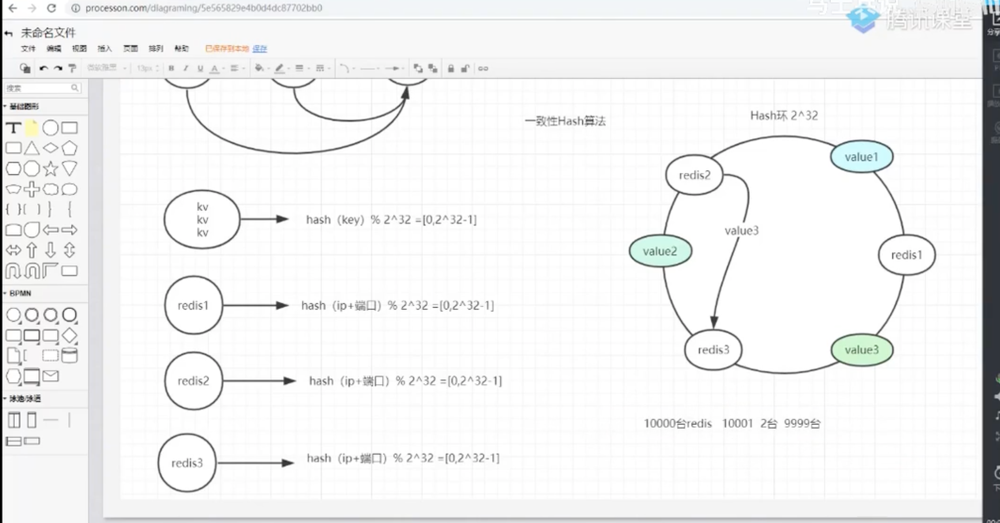

会问比较多底层的知识。

掌握微服务改造，高并发改造，jvm调优以及架构设计

# 1.业务方面：谈过往经历，考察业务熟悉度、技术能力和领导力，以及和这个岗位的匹配度。


# 2.系统设计：缓存、消息队列、数据库、分布式等


# 3.对账系统：

## （1）海量数据，内存装不下怎么办（hash切分文件）；

### 海量数据处理

所谓海量数据处理，就是基于海量数据的查找、统计、运算等操作。所谓海量数据，就是数据量太大，所以导致要么是无法在较短时间内迅速解决，要么是数据太大，导致无法一次性装入内存。从而导致传统的操作无法实现。

1、分治法——Hash映射

    所有散列函数都有如下一个基本特性：**如果两个散列值是不相同的（根据同一函数），那么这两个散列值的原始输入也是不相同的。**这个特性使得散列函数具有确定性的结果。

    在对大文件进行处理时，若文件过大，无法一次性读入内存，可以考虑采取Hash映射的方法将文件中的元素映射到不同大小文件中，然后再依次处理各个小文件，最后合并结果，这样就降低了问题规模。

2、top K问题

    在大规模数据处理中，经常会遇到的一类问题：如何寻找出最大的前K个数、或最小的K个数。**堆也是海量数据处理经常采用的工具**。

Trie树、Suffix树、败者树、多路归并、堆排序、hash_map都可以用到海量数据处理里面。

3、Bit-map

    Bit-map的原理就是使用位数组来表示某些元素是否存在，由于采用了bit为单位来存储数据，因此在存储空间方面，可以大大节省，故适用于海量数据的快速查找、判重、删除等。

4、Bloom Filter(布隆过滤器)

    即Bit-map的扩展，具体而言，Bloom Filter是一个包含了m位的位数组，数组的每一位都初始化为0，然后定义k个不同的Hash函数，每个Hash函数都可以将集合中的元素映射到位数组中的某一位。

    当向集合中插入一个元素时，根据k个Hash函数可以得到数组中的k个位，将这些位全部设置为1；

    当要查询某个元素是否属于集合时，就使用k个哈希函数得到此元素对应的k个位，如果所有点都是1，那么元素在集合内，如果有0，元素不在集合内。

    **注意：**如果一个位置多次被置为1，那么只有第一次会起作用，后面几次将没有任何效果。

    **总结：**Bloom Filter的位数m通常要比集合中的最大元素小得多，可见，Bloom Filter是一种空间效率和时间效率很高的随机数据结构，但这种高效是有一定代价的：在判断一个元素是否属于某个集合时，有可能会把不属于这个集合的元素误认为属于这个集合。因此，Bloom Filter不适合那些“零错误”应用场合。而在能容忍低错误率的应用场合下，Bloom Filter通过极少的错误换取了存储空间的极大节省。

5、倒排索引法

    倒排索引也常被称为反向索引、置入档案或反向档案，是一种索引方法，被用来存储在全文检索下某个单词在一个文档或者一组文档中的存储位置的映射。它是文档检索系统中最常用的数据结构。

    **使用范围：**搜索引擎的关键字查询。

    倒排索引是相对正向索引而言的，正向索引是用来存储每个文档的单词的列表。在正向索引中，文档占据了中心的位置，每个文档指向了一个它包含的索引项的序列。也就是说文档指向了它包含的那些单词，而反向索引则是单词指向了包含它的文档，很容易看到这个反向的关系。

### 海量数据处理——基于hash的常见问题总结

一、信息压缩处理

问题1：如果有40亿个数（不重复无符号整数），需要知道某个数是否在这40个亿中？

答：如果利用hash表来查找，需要 int[] array=new int[40亿],用这40亿个数作为下标初始化一个数组，各个值为0，然后遍历数组，下标等于这个数的位置存1，根据所有位置存的是0还是1就能知道某个数是否存在了。
40亿×4字节=160亿字节，每个位置只需要存0或1 ，用4字节来存太浪费空间。

由此引入位图:

所谓的位图，就是利用 1 bit保存0或1 （存在或者不存在的问题）

int[] bitArray=new int[10]

10*32 bit 可以判断320个数中是否存在的问题

位图的整体思路：压缩空间

问题2：如果需要判断王者荣耀的某玩家是否在黑名单里，然后确定是否进行封号，该设计怎样的算法？

比如黑名单为 {张三，李四，王五，赵六，…} 不是无符号的整数但是是海量的，这时就不能保证不重复，不能使用位图解决

这就需要引入布隆过滤器：

布隆过滤器原理: 将所有的用户利用多个哈希函数得到多个下标，将这多个下标处的值设置为1，然后使用这多个哈希函数对要查找用户进行处理得到下标，如果该用户得到的所有的下标处的值都为1，则这个用户在黑名单里，只要有一个得到的下标处的值为0，则说明这个数不在这个数据集里.

缺点：某用户可能不在黑名单里，但是得到的值为1 被进行了封号处理.（可能性小，概率事件）

二、分段处理

问题1：一个日志文件中保存了很多IP地址，问如何找到出现次数最多的IP地址？

解决思路：

1.如何获取每个IP地址的出现次数–Map解决

2.如何找到出现次数最多的IP–遍历Map，找max位置

伪代码：

```java
InputStream is = new FileInputStream(“ip.txt”);
Scanner scanner = new Scanner(is);
Map<ip,出现次数> map = new HashMap<>();
while(scanner.hasNextLine()) {//假设一行一个IP地址
    String ip=scanner.nextLine();
    int count=map.getOrDefault(ip,0)
    map.put(ip,count+1);
}
//再遍历map中的所有key-value，找到count最大的一组
String maxIp = null;
int maxCount = -1;
for(Map.Entry<ip,次数> entry:map.entrySet()) { //entrySet是key-value对，Set里面的类型是Map.Entry
    String ip=entry.getKey();
    int count=entry.getValue();
    if(count>maxCount){
        maxCount=count;
        maxIp=ip;
    }
}
```


maxIp就是出现次数最多的IP

如果IP数量太大了，大到map在内存中存不下了，上述办法失效.

核心思路：分段处理，将原来的大文件，分成多个小文件分别处理

如何分段？相同的IP被分到一起–利用hash函数分段

分好之后，先依次对每个小文件选出次数最多的IP和出现次数，再在所有文件中选出最优解.

```txt
如何设计这个hash函数？

比如：分成10个文件，得到的下标为[0,10)

hash函数1：取IP地址的最后一位 192.168.10.0 取0

hash函数2：把IP地址中所有值相加v=192+168+10+0 取v%10

hash函数3：v=1921000+168100+10*10+0 取v%10

…

哈希函数可以设计很多，但是性能不一定好
```


问题2：给定100亿个整数，设计算法找到只出现一次的整数？

问题3：给定两个文件，分别有100亿个整数，只有1G内存，如何找到两个文件的交集？

万能方法：分段处理

这类问题，还可以从信息压缩的角度思考–位图


对于问题2：要找出只出现一次的整数.

某个数出现的情况有三种：不出现/出现一次/出现超过一次

1 bit只能存二元信息，三元信息需要2 bit，分别用00/01/11来表示，

如果有40亿个数只出现了一次，需要40亿2 bit =10亿字节，如果按常规思路，一个数用4个字节表示，需要40亿4字节=160亿字节，很明显这种方法节省了空间.


对于问题3：要找出在两个文件中都出现的数.

某个数出现的情况有四种：都不出现/只在a出现/只在b出现/都出现，

用2 bit表示四元信息，以上情况分别用00/10/01/11来表示


注意：

一定是处理数字的问题，才有可能用空间压缩的办法解决

不是处理数字的问题，可以试试布隆过滤器。


海量数据处理问题总结：

1.分段处理–核心在于文件怎么分–按hash函数分–万能方法

2.信息压缩处理–优点是实现简单，但是有使用范围

- 位图

- 布隆过滤器（得到的结果是概率性的）


## （2）集群数目发变化，怎么办（hash一致性法则，只有一个节点受影响）

集群方案：

- 主从复制集群

- 切片集群

切片集群一般会平均分数据，或者也可能发生一些数据倾斜，如果挂掉一台（小型缓存雪崩，但还好）

如果新增一台，需要迁移之前多个节点的数据给到新节点，那么会发生频繁的数据复制，不能对外提供服务，影响一部分性能（也可能发生小型缓存雪崩，但还好）

一致性 hash 算法，解决动态扩展集群的性能问题

https://www.bilibili.com/video/BV1xf4y1278g  91：00 处开始讲的

内部实现就是 hash 槽



**一致性 hash 算法** 

以两台 Redis 为例，数据都是 kv 对，hash(key) % 2 = 0，放在 Redis1，=1，放在 Redis2

那如果加了一个，hash(key) % 3，肯定不要这样……

Hash 环 2^32

value  通过 hash(key) % 2^32 = [0, 2^32 - 1] 映射在 Hash 环上

Redis 集群每个单机，根据自身标识或者特点（端口、id、等等）也通过 hash(key) % 2^32 映射在环上。

数据顺时针寻找要存储的 Redis 机器。

而每次新增一台，只需要两台 Redis 做数据复制迁移。


当然了也存在缺陷，一致性 Hash 算法也会出现数据倾斜。

解决方案：虚拟节点

一致性哈希算法在服务节点太少时，容易因为节点分部不均匀而造成数据倾斜问题。

此时必然造成大量数据集中到Node A上，而只有极少量会定位到Node B上。为了解决这种数据倾斜问题，一致性哈希算法引入了虚拟节点机制，即对每一个服务节点计算多个哈希，每个计算结果位置都放置一个此服务节点，称为虚拟节点。具体做法可以在服务器ip或主机名的后面增加编号来实现。例如上面的情况，可以为每台服务器计算三个虚拟节点，于是可以分别计算 “Node A#1”、“Node A#2”、“Node A#3”、“Node B#1”、“Node B#2”、“Node B#3”的哈希值，于是形成六个虚拟节点：

同时数据定位算法不变，只是多了一步虚拟节点到实际节点的映射，例如定位到“Node A#1”、“Node A#2”、“Node A#3”三个虚拟节点的数据均定位到Node A上。这样就解决了服务节点少时数据倾斜的问题。在实际应用中，通常将虚拟节点数设置为32甚至更大，因此即使很少的服务节点也能做到相对均匀的数据分布。


# 4.红黑树和平衡二叉树区别

https://blog.csdn.net/u010899985/article/details/80981053

# 5.算法题：判断是否为平衡二叉树

## 方法一：

需要遍历完整颗树

1. 先设置初始flag为true；
2. 求二叉树的深度；
3. 在求深度过程中，一旦遇到左子树与右子树深度差大于1的情况，设置flag为false；
4. 最后返回flag.

```java
/*
方法一：需要遍历完整棵树
*/
public class Solution {
    boolean flag = true; //先设置flag为true
    public boolean IsBalanced_Solution(TreeNode root) {
        if(root == null){
            return true;
        }
        getDepth(root); //getDepth()函数是求树的深度的，里面一旦遇到左右子树深度差大于1的情况，就把flag改为false
        return flag;
    }
    public int getDepth(TreeNode root){
        if(root == null){
            return 0;
        }
        int left = getDepth(root.left);
        int right = getDepth(root.right);
        if(Math.abs(left-right) > 1){  //左右子树高度差大于一
            flag = false;  //将flag设为false
        }
        return Math.max(left, right)+1;
    }
}

```


## 方法二

遇到左子树与右子树的高度差大于1的情况即返回，无需遍历完整棵树。

1. 仍需借助求深度的函数，只是需要改一下这个函数；
2. getDepth()中，当左子树与右子树高度差大于1时，返回-1，否则返回高度；

```java
/*
方法二：无需遍历完整棵树
*/
import java.lang.Math;

public class Solution {
    public boolean IsBalanced_Solution(TreeNode root) {
        return getDepth(root) != -1;
    }
    public int getDepth(TreeNode root){
        if(root == null){
            return 0;
        }
        int left = getDepth(root.left);
        if(left == -1){
            return -1;
        }
        int right = getDepth(root.right);
        if(right == -1){
            return -1;
        }
        //出现左右子树高度差大于一的情况便立即返回-1，否则返回高度
        return Math.abs(left-right)>1?-1:Math.max(left, right)+1;
    }
}

```


# 6.多线程相关基础


# 7.Java线程安全问题之精通变量、实例变量、局部变量

https://www.bilibili.com/video/BV1Eb4y1R7zd?p=21

PDF 对线程安全的理解


```java
package base;

public class Demo07 {
    //类变量 static
    static double salary = 2500;

    //属性：变量

    //实例变量：从属于对象；如果不自行初始化，这个类型的默认值 0 0.0 u0000
    //布尔值；默认是false
    //除了基本类型，其余的默认值都是null;

    String name;//实例变量
    int  age;

    //main方法
    public static void main(String[] args) {

        //局部变量；必须声明和初始化值
        int i = 10;
        System.out.println(i);

        //变量类型 变量名字 = new Demo07();
        Demo07 demo07 = new Demo07();
        System.out.println(demo07.age);
        System.out.println(demo07.name);

        //类变量 static
        System.out.println(salary);


    }

    //其他方法
    public void add(){
        System.out.println(salary);

    }
}
```


# 8.2PC是什么

二阶段提交

分布式事务

https://blog.csdn.net/lengxiao1993/article/details/88290514

https://www.cnblogs.com/AndyAo/p/8228099.html


# 9.为啥用缓存，微服务和分布式区别

https://www.cnblogs.com/lfjn/p/11393156.html


集群是个物理形态，分布式是个工作方式。

- 分布式：一个业务拆分成多个子业务，每个子业务分别部署在不同的服务器上
- 集群：同一个业务，部署在多个服务器上


好的设计应该是分布式和集群的结合，先分布式再集群，具体实现就是业务拆分成很多子业务，然后针对每个子业务进行集群部署，这样每个子业务如果出了问题，整个系统完全不会受影响。

另外，还有一个概念和分布式比较相似，那就是微服务。

微服务是一种架构风格，一个大型复杂软件应用由一个或多个微服务组成。系统中的各个微服务可被独立部署，各个微服务之间是松耦合的。每个微服务仅关注于完成一件任务并很好地完成该任务。在所有情况下，每个任务代表着一个小的业务能力。


分布式一定是微服务，微服务不一定是分布式。

微服务的设计是为了不因为某个模块的升级和BUG影响现有的系统业务。微服务与分布式的细微差别是，微服务的应用不一定是分散在多个服务器上，他也可以是同一个服务器。


# 10.有没有用过分布式锁。以及redis都有用了干嘛。


各种锁：搜索 Redis 中的  Redis 分布式锁


各种分布式锁：搜索 Redis 中的 分布式锁方案大全


具备以下条件才需要锁

JVM 中多线程

1. 共享资源
2. 共享资源互斥
3. 多任务环境

参考三个人抢一个坑，缺一不可


多人去一个窗口买票

多个 JVM 


Redis 分布式锁方案：搜索 Redis 中的 基于 Redis 的实现


Redis 其他应用：

5+3 数据类型常用场景；

Redis 存放登录信息，30 分钟自动过期；

做队列，List，一边出一边进，保证一致性，消除峰值；

订阅等；

分布式锁。


# 其他问题

## 任务在多个模块间异步回调，如果某个模块挂了怎么处理


## 失败任务怎么处理


**10. 微信抢红包怎么设计系统**

**11. 怎么切分红包金额**


问题：定义一个[链表]()结构如下：

```java
struct ListNode {
    int value;
    struct ListNode *next;
};
```


请写一个程序，实现[链表]()中重复节点的删除（同一值的节点只保留一个），且[链表]()顺序保持不变。如，
初始[链表]()：3 -> 2 -> 3 -> 4 -> 4 -> 1 -> 7 -> 8
节点去重后的[链表]()：3 -> 2 -> 4 -> 1 -> 7 -> 8

注意：初始[链表]()是非[排序]()的[链表]()。

```java
class ListNode {
    int val;
    ListNode next;

    ListNode(int val) {
        this.val = val;
    }
}

public ListNode func(ListNode head) {
    if (head == null || head.next == null) return head;
    ListNode dummy = new ListNode(-1);
    dummy.next = head;

    ListNode pre = head;
    ListNode cur = head.next;
    Set<Integer> exist = new HashSet<>();
    exist.add(head.val);

    while (cur != null) {
        if (exist.contains(cur.val)) {
            ListNode nxt = cur.next;
            cur.next = null;
            pre.next = nxt;
            cur = nxt;
        } else {
            exist.add(cur.val);
            pre = cur;
            cur = cur.next;
        }
    }

    return dummy.next;
}
```


## 一面 

1.  线程池相关参数的意义 
2.  classloader双亲委派机制 
3.  Java sleep和wait的区别？在线程持有锁资源时sleep和wait有什么区别 
4.  hashMap和concurrentHashMap区别 
5.  Java 的 GC 机制，CMS gc过程概述 有几次stop the wolrd？ 
6.  Java 进程突然挂了，怎么排查，有哪些日志可以看？ 

 比如说配了 -XX:+HeapDumpOnOutOfMemoryError启动参数后，java进程挂了后会自动dump出一份java堆文件，用以分析。 

1.  两个线程改变同一个变量，第一个线程set 50 第二个线程set 60 为什么第一个线程读到是50，有几种情况 

 这里其实是想考，java内存模型中每个线程有自己的本地内存，但是我一直没有get到点，直到面试官用CAS问题来引导我才答出来，这里就体现面试经验的重要性了。 

1.  spring启动过程 
2.  tcp三次握手和四次挥手 
3.  VPN 的原理 加密隧道 

1.  操作系统进程创建过程。 

 fork函数

1.  硬中断和软中断是什么 
2.  操作系统的中断和java线程中断的区别，java线程中断是怎么实现的？ 
3.  网络的数据是怎么经过网卡到内存里的 

 这个过程和中断有关，可以参考这个博客https://blog.51cto.com/noican/1361087 

1.  BIO 和 NIO 操作系统层面是怎么实现的？如果一个 BIO 服务端建立了100个链接会有几个线程？NIO 呢？ 
2.  进程间的通信，管道是什么？什么是信号量？socket是怎么实现的？ 
3.  页面置换[算法]()有哪些？ 
4.  进程抢占和上下文切换 
5.  不同优先级任务调度的设计 

 思路是参考操作系统进程调度算法

1.  设计下微博中点赞关注拉黑功能 
2.  数据库中排它锁和共享锁有什么区别 
3.  mysql为什么要有自增ID？ 
4.  磁盘预读是怎么实现的 

##  二面 

1.  sychornized 锁可重入吗？可重入的含义是什么？ 
2.  如果控制对共享资源的并发访问？ 
3.  AtomicLong 和普通的 Long 使用有什么差别，原理是什么？ 
4.  volatile 的原理和使用     Java 中搜索 volatile关键字与内存可见性
5.  内存的分页机制是什么？ http://c.biancheng.net/view/1267.html
6.  一个份很大的日志文件，文件里记录了很多学生的成绩，找出排名前1000名成绩的学生。算法时间复杂度和空间复杂度 

 小顶堆实现  

1.  数据库并发操作，乐观锁实现和悲观锁实现  
2.  http 和 https 的区别，https 能被拦截嘛？  

##  在线编程题 

 设计一个并发安全任务调度器，三个方法、插入任务、根据任务优先级获取并删除任务、根据任务插入顺序获取并删除任务 


## 二面


1、各种[排序]()[算法]()、未[排序]()常规数据查找第K大的数，时间复杂度。 

 2、[二叉树]()的深度 

 3、虚拟内存分页了解不？  https://www.cnblogs.com/orange-CC/p/12673271.html

 4、进程和线程区别？ 

 5、第一二三范式是什么？ 

 6、一个表一千个列值为true和false，写sql 查询 有300个列值为true的行。 


 7、脏读和幻读是什么？ 

 8、什么对象会从新生代晋升到老年代 

 9、一个任务分成十个任务，最后汇总计算，不能用fork/join 

 10、开源框架源码了解不？ 

 11、数据建模两道、个人题开放性题 

 12、对安全方面了解多少？ 

 13、安全协议有哪些 、https是啥？ 

HTTP特点：
无状态：协议对客户端没有状态存储，对事物处理没有“记忆”能力，比如访问一个网站需要反复进行登录操作
无连接：HTTP/1.1之前，由于无状态特点，每次请求需要通过TCP三次握手四次挥手，和服务器重新建立连接。比如某个客户机在短时间多次请求同一个资源，服务器并不能区别是否已经响应过用户的请求，所以每次需要重新响应请求，需要耗费不必要的时间和流量。
基于请求和响应：基本的特性，由客户端发起请求，服务端响应
简单快速、灵活
通信使用明文、请求和响应不会对通信方进行确认、无法保护数据的完整性


HTTPS是一种通过计算机网络进行安全通信的传输协议，经由HTTP进行通信，利用SSL/TLS建立全信道，加密数据包。HTTPS使用的主要目的是提供对网站服务器的身份认证，同时保护交换数据的隐私与完整性。

基于HTTP协议，通过SSL或TLS提供加密处理数据、验证对方身份以及数据完整性保护

1. 内容加密：采用混合加密技术，中间者无法直接查看明文内容
2. 验证身份：通过证书认证客户端访问的是自己的服务器
3. 保护数据完整性：防止传输的内容被中间人冒充或者篡改

```txt
**混合加密：**结合非对称加密和对称加密技术。客户端使用对称加密生成密钥对传输数据进行加密，然后使用非对称加密的公钥再对秘钥进行加密，所以网络上传输的数据是被秘钥加密的密文和用公钥加密后的秘密秘钥，因此即使被黑客截取，由于没有私钥，无法获取到加密明文的秘钥，便无法获取到明文数据。


**数字摘要：**通过单向hash函数对原文进行哈希，将需加密的明文“摘要”成一串固定长度(如128bit)的密文，不同的明文摘要成的密文其结果总是不相同，同样的明文其摘要必定一致，并且即使知道了摘要也不能反推出明文。


**数字签名技术：**数字签名建立在公钥加密体制基础上，是公钥加密技术的另一类应用。它把公钥加密技术和数字摘要结合起来，形成了实用的数字签名技术。

```

非对称加密过程需要用到公钥进行加密，那么公钥从何而来？其实公钥就被包含在数字证书中，数字证书通常来说是由受信任的数字证书颁发机构CA，在验证服务器身份后颁发，证书中包含了一个密钥对（公钥和私钥）和所有者识别信息。数字证书被放到服务端，具有服务器身份验证和数据传输加密功能。


 14、介绍你做的[项目]()和其中的难点。 

  

##  三面： 

  

 1、从ConcurrentHashMap一路问到锁&锁优化->LongAdder->伪共享->缓存行填充->cas等诸多技术细节； 

 2、从hystrix一路问到原理->自己如何实现->如何优化->响应流编程(reactive streams); 

 3、从简单的生产者消费者模式设计到如何高效健壮实现等等。 

  

##  四面： 

  

 1、如何倒序输出单向[链表]()？ 

 2、个人直接想法是用栈先进后出的特点，把[链表]()数据读到栈里然后输出。 

 3、有更好的实现方式吗？ 

 4、主要问[项目]()情况，然后根据一个[项目]()，问如果量级扩大1000倍，你会怎么做？有哪些优化措施？高性能&高可用措施？ 

  

##  五面： 

  

 1、个人的[职业规划]()是什么？ 

 2、你遇到的最大问题或者是困难是什么？ 

 3、你如何看待我们公司？ 

 4、你能为我们公司带来什么？ 

 5、你的优缺点是什么？